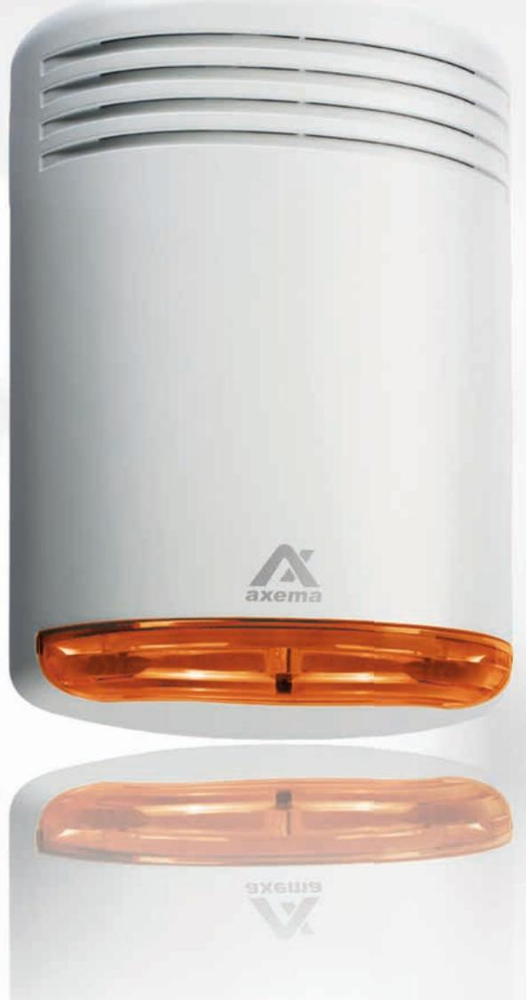

## UDRPLUS

## **– e� smart dörrlarm från Axema!**

Smiter obehöriga ut via bakdörren? Då är UDR Plus e� perfekt dörrlarm med smarta funk�oner som på e� enkelt sä� övervakar alla typer av dörrar.

För utrymningsdörrar i bu�ker eller andra offentliga lokaler är UDR Plus e� idealiskt skydd!

- Inbyggd kra�full sirén som utlöser om dörren öppnas av obehörig.
- Du ställer enkelt in �der för larm och fördröjningar samt återställning.
- Blixtljus för a� du snabbt och enkelt skall se vilken dörr som forcerats. Bra funk�on om du har fler nödutgångar i en större bu�k/lokal.
- Signal låg volym som varnar t ex om dörren inte är låst e�er en utrymning.
- Passar bra med läsaren A66 (art.nr. 2-1660) och kodlåset A04 (art.nr. 2-1040)

## **Teknisk data**

- Plastkapsling
- Integrerat blixtjus
- Sirén: hög volym justeras från 0 �ll 90,6dB, 1m
- Signal: låg volym justeras från 0 �ll 77dB, 1m
- Inställbar sirén-�d
- Ingång för Låsregel/återställning
- Ingång för utrymning/dörrkontakt
- Fri reläutgång
- Temperatur: från -20 �ll + 50° C
- Spänning: 10-30V DC
- Strömförbrukning: 5mA i vila, max 50mA (24V DC)
- Må�: 155x100x53 (HxBxD)
- Tillbehör: färgade linser i grönt och grå�

## **Art.nr. 1-9033-3 E5870725**