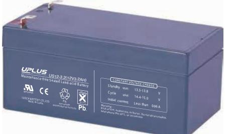
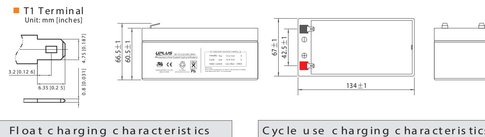
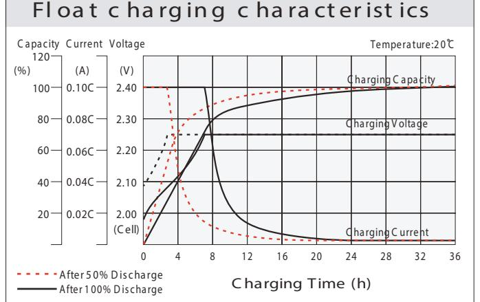
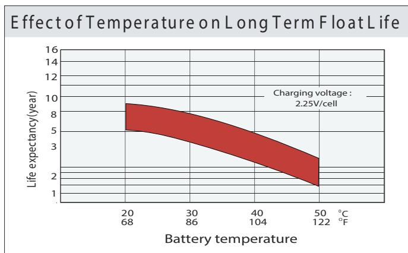
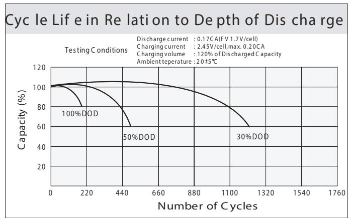
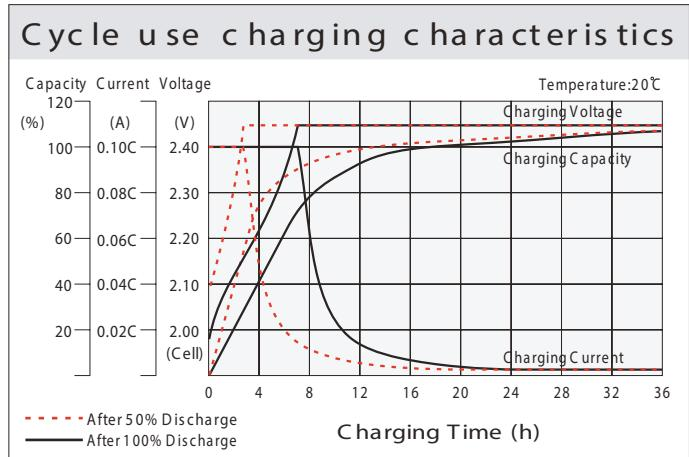
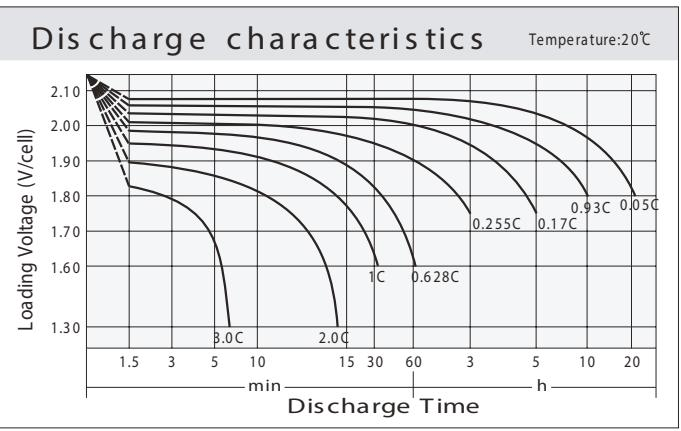
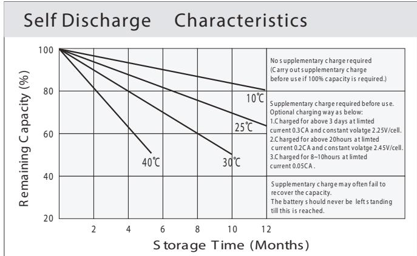

## General Features

- ♦ Sealed and maintenance free operation.
- ◆ Non-Spillable construction design.
- ◆ ABS containers and covers(UL94HB, UL94V-0) optional.
- ◆ Safety valve installation for explosion proof.
- ◆ High quality and high reliability.
- ◆ Exceptional deep discharge recovery performance.
- � Low self discharge characteristic.
- ♦ Flexibility design for multiple install positions.

|  | ાવડા | Intertek ETL SEMKO | 20 MH26866 | OED 0 ISO14001 | 459 ISO9001 | C C   THE EMC tested . Geolia as the |
|--|------|--------------------|---------------|----------------------|----------------|-----------------------------------------------|
|--|------|--------------------|---------------|----------------------|----------------|-----------------------------------------------|

| Battery Type          | Valve-Requlated,Absorbed                          |        |                                       |                                                    |                       |                    |  |  |  |  |
|-----------------------|---------------------------------------------------|--------|---------------------------------------|----------------------------------------------------|-----------------------|--------------------|--|--|--|--|
| Nomial Voltage        | 12V                                               |        |                                       |                                                    |                       |                    |  |  |  |  |
|                       | 20HR(0.155A,1.8V/cell)                            |        | 10HR(0.289A,1.80V)                    | 5HR(0.522A,1.75V)                                  |                       | 1HR(11.91A,1.60V)  |  |  |  |  |
| Capacity( 20°C)       | 3.10AH                                            | 2.89AH |                                       | 2.61AH                                             |                       | 1.91AH             |  |  |  |  |
|                       | Length                                            |        | Width                                 | Height                                             |                       | Total Height       |  |  |  |  |
| Dimensions            | 134mm(5.28inches)                                 |        | 67mm(2.64inches)                      | 60.5mm(2.38inches)                                 |                       | 66.5mm(2.62inches) |  |  |  |  |
| Approx Weight         | Approx 1.35 kg (2.98lbs)                          |        |                                       |                                                    |                       |                    |  |  |  |  |
| Internal Resistance   |                                                   |        | Full Charged at 20°C : Approx 45m   Ù |                                                    |                       |                    |  |  |  |  |
| Self Discharge        |                                                   |        |                                       |                                                    |                       |                    |  |  |  |  |
| Capacity affected by  | 40°C                                              | 25°C   |                                       | 0°C                                                |                       | -15°C              |  |  |  |  |
| Temperature (10HR)    | 103%                                              |        | 100%                                  | 86%                                                |                       | 65%                |  |  |  |  |
|                       | Cycle use                                         |        |                                       | Float use                                          |                       |                    |  |  |  |  |
| Charging Voltage (V)  | 14.4V~15.0V at 20 °C.T emp. Coefficient -30mV/ °C |        |                                       | 13.5V~13.8V at 20 °C.Temp. Coefficient (-20mV/ °C) |                       |                    |  |  |  |  |
|                       | Max. Discharge Current                            |        |                                       | Initial Charging Current                           |                       |                    |  |  |  |  |
| Current               | 48A                                               |        |                                       | Less than 0.96A                                    |                       |                    |  |  |  |  |
|                       | Discharge                                         |        |                                       | Charging                                           | Storage               |                    |  |  |  |  |
| Operating T emp.Range | -15 ~50 °C (5 ~ 122 °F)                           |        |                                       | 0~40°C (32 ~ 104°F)                                | -15 ~40°C (5 ~ 104°F) |                    |  |  |  |  |

## Co ns tant C urrent Dis ch arge (A mperes) at 20 °C (6 8°F ) F.V/Tim e 20 min 4h 5h 5m in 10 min 15 m in 30 min 45 min 1 h 2h 3h 6h 8h 10 h 20h 1.8 5V /ce ll 5.79 4.45 3.68 3.18 2.46 1.81 1.53 0.91 0.715 0.581 0.474 0.416 0.335 0.280 0.154 1.8 0V /ce ll 7.77 5.68 4.45 3.76 2.91 2.11 1.71 1.00 0.769 0.621 0.509 0.446 0.355 0.289 0.155 1.03 1.7 5V /cell 8.76 6.24 4.05 3.02 2.19 1.79 0.783 0.634 0.522 0.458 0.362 0.296 0.157 4.86 1.7 0V /ce ll 9.65 6.80 5.19 4.26 3.14 2.28 1.85 1.06 0.805 0.651 0.535 0.467 0.367 0.302 0.160 1.6 5V /cell 10.6 7.34 5.52 4.52 3.31 2.33 1.89 1.08 0.840 0.674 0.550 0.478 0.372 0.309 0.162 1.6 0V /ce ll 11.7 7.97 5.90 4.82 3.50 2.43 1.91 1.12 0.865 0.695 0.568 0.488 0.376 0.312 0.163

## Co ns tant P ower Dis ch ar ge (W atts ) a t 2 0 ℃ (6 8 ℉ )

| F.V/Tim e    | 5m in | 10min | 15 min | 20 min | 30 min | 45 min | 1h   | 2h   | 3h   | 4h   | 5h   | 6h    | 8h    | 10h   | 20h   |
|--------------|-------|-------|--------|--------|--------|--------|------|------|------|------|------|-------|-------|-------|-------|
| 1.8 5V /cell | 10.6  | 8.21  | 6.87   | 6.00   | 4.69   | 3.49   | 2.95 | 1.77 | 1.39 | 1.14 | 0.93 | 0.817 | 0.662 | 0.554 | 0.304 |
| 1.8 0V /cell | 14.1  | 10.4  | 8.19   | 6.99   | 5.45   | 4.02   | 3.29 | 1.92 | 1.49 | 1.21 | 0.99 | 0.873 | 0.700 | 0.570 | 0.307 |
| 1.7 5V /cell | 15.5  | 11.2  | 8.84   | 7.45   | 5.61   | 4.14   | 3.42 | 1.99 | 1.51 | 1.23 | 1.02 | 0.894 | 0.710 | 0.585 | 0.310 |
| 1.7 0V /cell | 16.6  | 11.9  | 9.30   | 7.77   | 5.81   | 4.28   | 3.52 | 2.03 | 1.55 | 1.26 | 1.04 | 0.911 | 0.719 | 0.596 | 0.315 |
| 1.6 5V /cell | 18.1  | 12.8  | 9.82   | 8.19   | 6.08   | 4.35   | 3.57 | 2.05 | 1.61 | 1.30 | 1.06 | 0.928 | 0.729 | 0.608 | 0.319 |
| 1.6 0V /cell | 19.5  | 13.5  | 10.3   | 8.63   | 6.37   | 4.51   | 3.59 | 2.13 | 1.65 | 1.33 | 1.10 | 0.945 | 0.734 | 0.613 | 0.320 |

