USER MANUAL

# **Legal notice**

Copyright © 2014 TELTONIKA Ltd. All rights reserved. Reproduction, transfer, distribution or storage of part or all of the contents in this document in any form without the prior written permission of TELTONIKA Ltd is prohibited. The manufacturer reserves the right to modify the product and manual for the purpose of technical improvement without prior notice.

**Other product and company names mentioned herein may be trademarks or trade names of their respective owners.** 

# **Attention**

Before using the device we strongly recommend reading this user manual first.

Do not rip open the device. Do not touch the device if the device block is broken.

All wireless devices for data transferring may be susceptible to interference, which could affect performance.

The device is not water-resistant. Keep it dry.

Device is powered by low voltage +9V DC power adaptor.

|                              | Legal notice2                             |  |
|------------------------------|-------------------------------------------|--|
|                              | Attention2                                |  |
|                              | SAFETY INFORMATION7                       |  |
|                              | Device connection 8                       |  |
| 1                            | Introduction 9                            |  |
| 1.1                          | Specifications9                           |  |
| 1.1.1                        | LTE  9                                    |  |
| 1.1.2                        | UMTS  9                                   |  |
| 1.1.3                        | GSM/GPRS/EDGE  9                          |  |
| 1.1.4                        | Ethernet  9                               |  |
| 1.1.5                        | Wi-Fi 9                                   |  |
| 1.1.6                        | Hardware 10                               |  |
| 1.1.7                        | Software 10                               |  |
| 1.1.8                        | Electrical, Mechanical & Environmental 10 |  |
| 1.1.9                        | Applications 11                           |  |
| 2                            | Setting up your router 12                 |  |
| 2.1 Installation 12       |                                           |  |
| 2.1.1                        | Front Panel and Back Panel 12             |  |
| 2.1.2                        | Hardware installation 12                  |  |
| 2.2                          | Logging in13                              |  |
| 3                            | Operation Modes16                         |  |
| 4                            | Powering Options 16                       |  |
| 4.1                          | Powering the device from higher voltage17 |  |
| 5                            | Status18                                  |  |
| 5.1                          | System Information 18                     |  |
| 5.2 Network Information19 |                                           |  |
| 5.3                          | Device information 26                     |  |
| 5.4                          | Services26                                |  |
| 5.5                          | Routes27                                  |  |
| 5.5.1                        | ARP27                                     |  |
| 5.5.2                        | Active IP-Routes28                        |  |
| 5.6                          | Realtime Graphs 28                        |  |
| 5.6.1                        | Traffic 29                                |  |
| 5.7                          | Events Log 30                             |  |

|   |     | 5.7.1 | All 30                            |  |
|---|-----|-------|-----------------------------------|--|
|   |     | 5.7.2 | Authentication 30                 |  |
|   |     | 5.7.3 | Reboot31                          |  |
|   |     | 5.7.4 | Safemode 31                       |  |
| 6 |     |       | Network 32                        |  |
|   | 6.1 |       | Mobile32                          |  |
|   |     | 6.1.1 | General32                         |  |
|   |     | 6.1.2 | SIM Management 34                 |  |
|   |     | 6.1.3 | Network Operators35               |  |
|   |     | 6.1.4 | Mobile Data Limit35               |  |
|   | 6.2 |       | WAN 37                            |  |
|   |     | 6.2.1 | Operation Mode 37                 |  |
|   |     | 6.2.2 | Common configuration37            |  |
|   | 6.3 |       | LAN42                             |  |
|   |     | 6.3.1 | Configuration 42                  |  |
|   |     | 6.3.2 | DHCP Server43                     |  |
|   | 6.4 |       | Wireless 44                       |  |
|   | 6.5 |       | Backup WAN 47                     |  |
|   | 6.6 |       | Firewall49                        |  |
|   |     | 6.6.1 | General Settings49                |  |
|   |     | 6.6.2 | DMZ50                             |  |
|   |     | 6.6.3 | Port Forwarding 50                |  |
|   |     | 6.6.4 | Traffic Rules52                   |  |
|   |     | 6.6.5 | Custom Rules 57                   |  |
|   | 6.7 |       | Static Routes58                   |  |
| 7 |     |       | Services59                        |  |
|   | 7.1 |       | VRRP59                            |  |
|   |     | 7.1.1 | LAN/WAN Settings59                |  |
|   |     | 7.1.2 | Advanced settings59               |  |
|   | 7.2 |       | Web filter60                      |  |
|   |     | 7.2.1 | Site blocking60                   |  |
|   |     | 7.2.2 | Proxy based URL content blocker61 |  |
|   | 7.3 |       | NTP62                             |  |
|   | 7.4 |       | SNMP 63                           |  |
|   |     | 7.4.1 | SNMP Settings63                   |  |

|   | 7.4.2 |       | TRAP Settings64          |  |
|---|-------|-------|--------------------------|--|
|   | 7.5   |       | VPN 65                   |  |
|   | 7.5.1 |       | OpenVPN65                |  |
|   | 7.5.2 |       | IPSec67                  |  |
|   |       | 7.5.3 | GRE Tunnel 70            |  |
|   |       | 7.5.4 | PPTP 71                  |  |
|   |       | 7.5.5 | L2TP 71                  |  |
|   |       | 7.5.6 | Dynamic DNS 72           |  |
|   | 7.6   |       | SMS Utilities 74         |  |
|   | 7.6.1 |       | SMS Utilities74          |  |
|   | 7.6.2 |       | Call Utilities77         |  |
|   | 7.6.3 |       | User Groups77            |  |
|   | 7.6.4 |       | SMS Management77         |  |
|   |       | 7.6.5 | Remote Configuration 77  |  |
|   | 7.7   |       | Hotspot 78               |  |
|   |       | 7.7.1 | General settings  79     |  |
|   |       | 7.7.2 | Logging 80               |  |
|   | 7.7.3 |       | Landing Page82           |  |
|   | 7.8   |       | Auto Reboot82            |  |
|   | 7.8.1 |       | Ping Reboot82            |  |
|   | 7.8.2 |       | Periodic Reboot84        |  |
| 8 |       |       | System84                 |  |
|   | 8.1   |       | Configuration Wizard84   |  |
|   | 8.2   |       | Configuration profiles87 |  |
|   | 8.3   |       | Administration 87        |  |
|   | 8.3.1 |       | General87                |  |
|   | 8.3.2 |       | Troubleshoot88           |  |
|   | 8.3.3 |       | Backup89                 |  |
|   |       | 8.3.4 | Access Control89         |  |
|   | 8.3.5 |       | Diagnostics90            |  |
|   | 8.3.6 |       | MAC Clone 91             |  |
|   | 8.4   |       | User scripts 91          |  |
|   | 8.5   |       | Safe mode 91             |  |
|   | 8.6   |       | Firmware92               |  |
|   | 8.7   |       | Restore point 92         |  |
|   |       |       |                          |  |

|    | 8.8  |       | Reboot92                                      |  |
|----|------|-------|-----------------------------------------------|--|
| 9  |      |       | Functionality not listed in menu93            |  |
|    | 9.1  |       | SMS by HTTP POST/GET93                        |  |
|    |      | 9.1.1 | Syntax of HTTP POST/GET string93              |  |
|    |      | 9.1.2 | Parameters of HTTP POST/GET string93          |  |
|    |      | 9.1.3 | Possible responses after command execution 93 |  |
|    |      | 9.1.4 | HTTP POST/GET string examples93               |  |
| 10 |      |       | Device Recovery94                             |  |
|    | 10.1 |       | Reset button 94                               |  |
|    | 10.2 |       | Safemode94                                    |  |
|    | 10.3 |       | Bootloader's WebUI94                          |  |
| 11 |      |       | Glossary:95                                   |  |

# **SAFETY INFORMATION**

In this document you will be introduced on how to use a RUT950 router safely. We suggest you to adhere to the following recommendations in order to avoid personal injuries and or property damage.

You have to be familiar with the safety requirements before using the device!

To avoid burning and voltage caused traumas, of the personnel working with the device, please follow these safety requirements.

The device is intended for supply from a Limited Power Source (LPS) that power consumption should not exceed 15VA and current rating of overcurrent protective device should not exceed 2A.

The highest transient overvoltage in the output (secondary circuit) of used PSU shall not exceed 36V peak.

The device can be used with the Personal Computer (first safety class) or Notebook (second safety class). Associated equipment: PSU (power supply unit) (LPS) and personal computer (PC) shall comply with the requirements of standard EN 60950-1.

Do not mount or service the device during a thunderstorm.

To avoid mechanical damages to the device it is recommended to transport it packed in a damage-proof pack.

Protection in primary circuits of associated PC and PSU (LPS) against short circuits and earth faults of associated PC shall be provided as part of the building installation.

To avoid mechanical damages to the device it is recommended to transport it packed in a damage-proof pack. While using the device, it should be placed so, that its indicating LEDs would be visible as they inform in which working mode the device is and if it has any working problems.

Protection against overcurrent, short circuiting and earth faults should be provided as a part of the building installation.

Signal level of the device depends on the environment in which it is working. In case the device starts working insufficiently, please refer to qualified personnel in order to repair this product. We recommend forwarding it to a repair center or the manufacturer. There are no exchangeable parts inside the device.

## **Device connection**

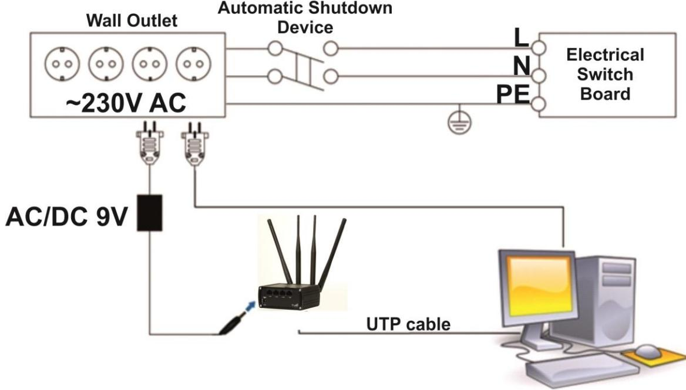

# **1 Introduction**

Thank you for purchasing a RUT950 LTE router!

RUT950 is part of the RUT9xx series of compact mobile routers with high speed wireless and Ethernet connections.

This router is ideal for people who'd like to share their internet on the go, as it is not restricted by a cumbersome cable connection. Unrestricted, but not forgotten: the router still supports internet distribution via a broadband cable, simply plug it in to the wan port, set the router to a correct mode and you are ready to browse.

### **1.1 Specifications**

### **1.1.1 LTE**

- FDD 800/850/900/1800/1900/2100/2600 MHz
- Up to 100 Mbps downlink speed
- Up to 50 Mbps uplink speed
- All bands with diversity

### **1.1.2 UMTS**

- 850/900/1900/2100 MHz
- DC-HSPA+ mode: DL up to 43.2 Mbps, UL 5.76 Mbps
- HSPA+ mode: DL up to 21.6 Mbps, UL 5.76 Mbps
- UMTS mode: 384 kbps DL/384 kbps UL
- All bands with diversity

### **1.1.3 GSM/GPRS/EDGE**

- 850/900/1800/1900 MHz
- Power Class 4 (2 W, 33 dBm) GSM/GPRS 850/900 MHz
- Power Class 1 (1 W, 30 dBm) GSM/GPRS 1800/1900 MHz
- Power Class E2 (0.5 W, 27 dBm) for EDGE 850/900 MHz
- GPRS: 85.6 kbps DL/85.6 kbps UL (class 12)
- EDGE: 236.8 kbps DL/236.8 kbps UL (class 12)

### **1.1.4 Ethernet**

- IEEE 802.3, IEEE 802.3u standards
- 3 x LAN 10/100Mbps Ethernet ports
- 1 x WAN 10/100Mbps Ethernet port
- Supports Auto MDI/MDIX

#### **1.1.5 Wi-Fi**

- IEEE 802.11b/g/n Wi-Fi standards
- 2x2 MIMO
- AP and STA modes
- 64/128-bit WEP, WPA, WPA2, WPA&WPA2 encryption methods
- 2.401 2.495GHz Wi-Fi frequency range
- 20dBm max Wi-Fi TX power
- SSID stealth mode and access control based on MAC address

### **1.1.6 Hardware**

- High performance 560 MHz CPU with 128 Mbytes of DDR2 memory
- 5.5/2.5mm DC power socket
- Reset/restore to default button
- 2 x SMA for LTE , 2 x RP-SMA for Wi-Fi antenna connectors
- 4 x Ethernet LEDs, 1 x Power LED
- 1 x bi-color connection status LED, 5 x connection strength LEDs

### **1.1.7 Software**

- OpenVPN, IPSec, GRE, L2TP, PPTP
- Backup WAN
- PPPoE
- Dynamic DNS
- SMS and Ping reboot, periodic reboot
- Status, configuration via SMS
- Send/read SMS via HTTP POST/GET
- Monitoring by SNMP, SNMP trap
- System log to record the status of the router
- VRRP
- Web filter
- Wireless hotspot with or without radius server
- SIM card switch controlled by signal, data limit, roaming
- Configuration profiles
- Dual image with safemode firmware
- Firmware update from bootloader via WebUI
- Restore point

#### **1.1.8 Electrical, Mechanical & Environmental**

- Dimensions (H x W x D) 80mm x 106mm x 46mm Weight 285g
- Power supply 100 240 VAC -> 9 VDC wall adapter
- Input voltage range 9 30VDC
- 
- Power consumption < 7W
- Operating temperature -40° to 75° C
- Storage temperature -45° to 80° C
- Operating humidity 10% to 90% Non-condensing
- Storage humidity 5% to 95% Non-condensing

### **1.1.9 Applications**

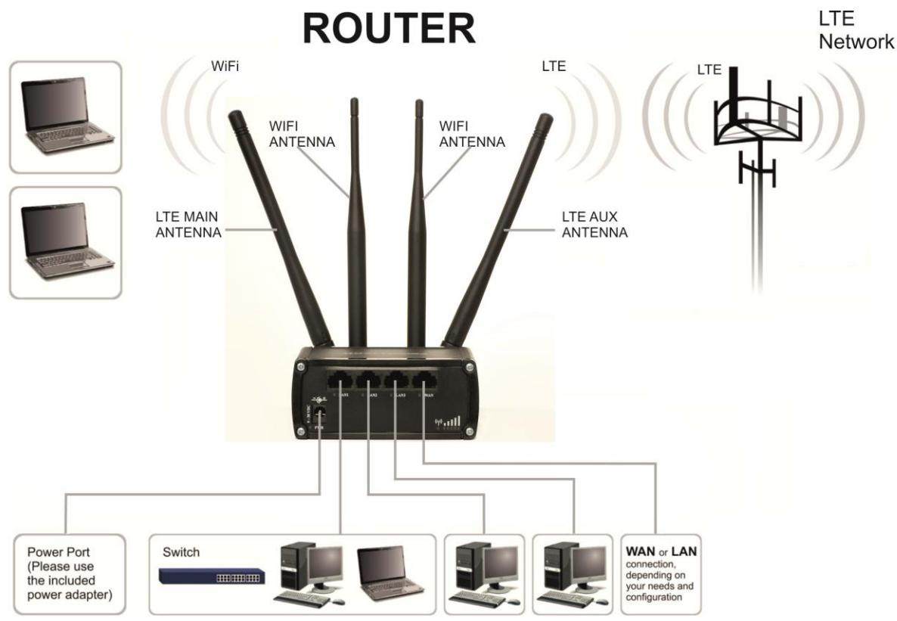

# **2 Setting up your router**

## **2.1 Installation**

After you unpack the box, follow the steps, documented below, in order to properly connect the device. For better Wi-Fi performance, put the device in clearly visible spot, as obstacles such as walls and door hinder the signal.

- 1. First assemble your router by attaching the necessary antennas and inserting the SIM card.
- 2. To power up your router, please use the power adapter included in the box. (IMPORTANT: Using a different power adapter can damage and void the warranty for this product.).
- 3. If you have a wired broadband connection you will also have to connect it to the WAN port of the router.

### **2.1.1 Front Panel and Back Panel**

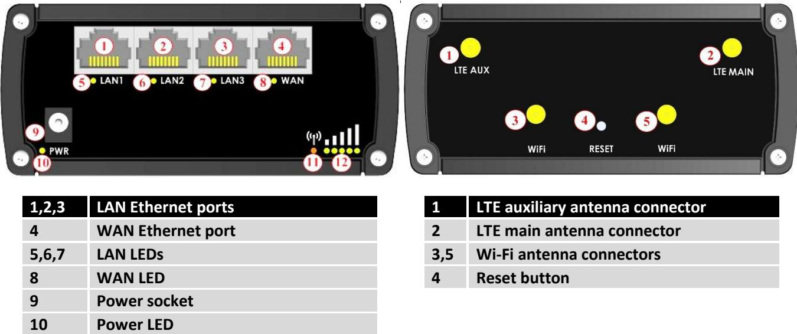

### **2.1.2 Hardware installation**

**11 Connection status LED**

**12 Signal strength indication LEDs**

- 1. Remove back panel and insert SIM card which was given by your ISP (Internet Service Provider). Correct SIM card orientation is shown in the picture.
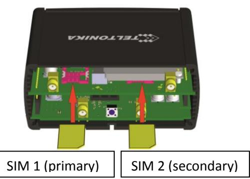

- 2. Attach LTE main and Wi-Fi antennas.
- 3. Connect the power adapter to the socket on the front panel of the device. Then plug the other end of the power adapter into a wall outlet or power strip.
- 4. Connect to the device wirelessly (SSID: **Teltonika_Router**) or use Ethernet cable and plug it into any LAN Ethernet port.

### **2.2 Logging in**

After you're complete with the setting up as described in the section above, you are ready to start logging into your router and start configuring it. This example shows how to connect on Windows 7. On windows Vista: click Start -> Control Panel -> Network and Sharing Centre -> Manage network Connections -> (Go to step 4). On Windows XP: Click Start -> Settings -> Network Connections -> (see step 4). You wont's see "Internet protocol version 4(TCP/IPv4)", instead you'll have to select "TCP/IP Settings" and click options -> (Go to step 6)

We first must set up our network card so that it could properly communicate with the router.

- 
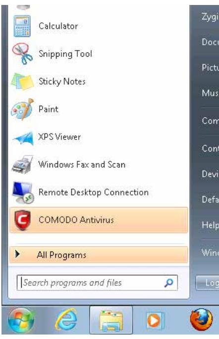

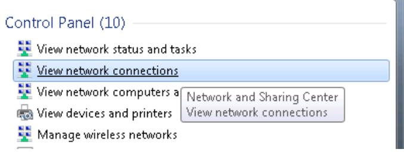

1. Press the start button 2. Type in "network connections", wait for the results to pop up.

3. Click "View network connections" 4. Then right click on your wireless device that you use to connect to other access points (It is the one with the name "Wireless Network Connection" and has signal bars on its icon).

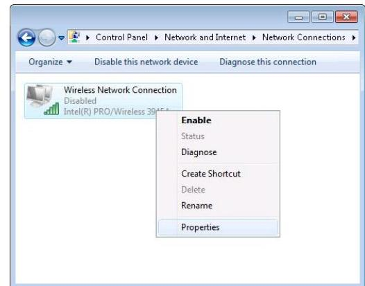

5. Select Internet Protocol Version 4 (TCP/IPv4) and then click Properties

|  | should lease you an IP and you should be ready to login. |
|--|----------------------------------------------------------|
|  |                                                          |
|  |                                                          |
|  |                                                          |
|  |                                                          |
|  |                                                          |
|  |                                                          |
|  |                                                          |
|  |                                                          |
|  |                                                          |
|  |                                                          |
|  |                                                          |
|  |                                                          |
|  |                                                          |
|  |                                                          |

6. By default the router is going to have DHCP enabled, which means that if you select "Obtain an IP address automatically"

7. If you choose to configure manually here's what you do:

First select an IP address. Due to the stock settings that your router has arrived in you can only enter an IP in the form of 192.168.1.XXX , where XXX is a number in the range of 2-254 (192.168.1.2 , 192.168.1.254 , 192.168.1.155 and so on… are valid; 192.168.1.0 , 192.168.1.1 , 192.168.1.255 , 192.168.1.699 and so on… are not). Next we enter the subnet mask: this has to be "255.255.255.0". Then we enter the default gateway: this has to be "192.168.1.1". Finally we enter primary and secondary DNS server IPs. One will suffice, though it is good to have a secondary one as well as it will act as a backup if the first should fail. The DNS can be your routers IP (192.168.1.1), but it can also be some external DNS server (like the one Google provides: 8.8.8.8).

| Internet Protocol Version 4 (TCP/IPv4) Properties                                                                                                                                     |                     |  |  |  |  |
|---------------------------------------------------------------------------------------------------------------------------------------------------------------------------------------|---------------------|--|--|--|--|
| General                                                                                                                                                                               |                     |  |  |  |  |
| You can get IP settings assigned automatically if your network supports this capability. Otherwise, you need to ask your network administrator for the appropriate IP settings. |                     |  |  |  |  |
| Obtain an IP address automatically                                                                                                                                                    |                     |  |  |  |  |
| © Use the following IP address: IP address:                                                                                                                                        | 192 . 168 . 1 . 100 |  |  |  |  |
| Subnet mask:                                                                                                                                                                          | 255 . 255 . 255 . 0 |  |  |  |  |
| Default gateway:                                                                                                                                                                      | 192 . 168 . 1 . 1   |  |  |  |  |
| Obtain DNS server address automatically                                                                                                                                               |                     |  |  |  |  |
| O Use the following DNS server addresses:                                                                                                                                             |                     |  |  |  |  |
| Preferred DNS server:                                                                                                                                                                 | 192 . 168 . 1 . 1   |  |  |  |  |
| Alternate DNS server:                                                                                                                                                                 | 8 8 8 8    |  |  |  |  |
| Validate settings upon exit                                                                                                                                                           | Advanced            |  |  |  |  |
|                                                                                                                                                                                       | OK Cance         |  |  |  |  |

| Not connecte Intel(R) PRO/V | Disable              |
|--------------------------------|----------------------|
|                                | Connect / Disconnect |
|                                | Status               |
|                                | Diagnose             |
|                                | Bridge Connections   |
|                                | Create Shortcut      |
|                                | Delete               |
|                                | Rename               |
|                                | Properties           |

Right click on the Wireless network icon and select **Connect / Disconnect**. A list should pop up with all available wireless networks. Select "Teltonika" and click **connect**. Then we launch our favorite browser and enter the routers IP into the address field:

| ← | 10 4  1 | 192.168.1.1 |
|---|------------|-------------|
| ) |            |             |

Press enter. If there are no problems you should be greeted with a login screen such as this:

|          | Please enter your usemame and password. |  |  |
|----------|-----------------------------------------|--|--|
|          |                                         |  |  |
| Username | admin                                   |  |  |
| Password |                                         |  |  |

Enter the default password, which is "admin01" into the "Password" field and then either click Login with your mouse or press the Enter key. You have now successfully logged into the RUT950!

From here on out you can configure almost any aspect of your router.

# **3 Operation Modes**

The RUT9xx series router supports various operation modes. It can be connected to the internet (WAN) via mobile, standard Ethernet cable or via a wireless network. If you connect to the internet via an Ethernet cable of Wi-Fi, you may also backup your connection with mobile for added stability. On every case except when you connect to the internet via Wi-Fi, you can distribute your internet via an Ethernet cable (3 ports) and/or a wireless network. When you connect via Wi-Fi, you cannot have Wi-Fi in your LAN.

| WAN      | LAN      |       | Mobile Backup link |
|----------|----------|-------|--------------------|
|          | Ethernet | Wi-Fi |                    |
| Mobile   | √        | √     | x                  |
| Ethernet | √        | √     | √                  |
| Wi-Fi    | √        | x     | √                  |

In later sections it will be explained, bit by bit, how to configure your router to work in a desired mode.

# **4 Powering Options**

The RUT9xx router can be powered from power socket or over Ethernet port. Depending on your network architecture you can use LAN 1 port to power the device.

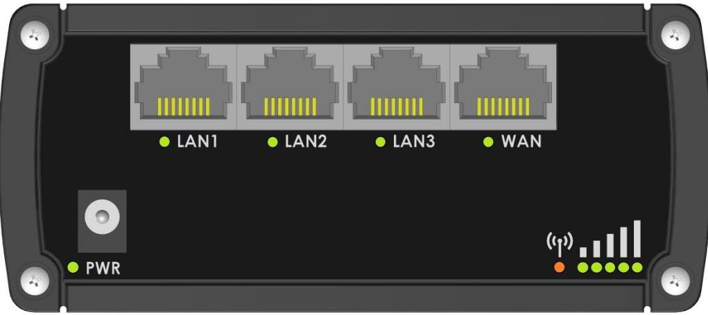

RUT9xx can be powered from power socket and over Ethernet simultaneously. Power socket has higher priority meaning that the device will draw power from power socket as long as it is available.

When RUT9xx is switching from one power source to the other it loses power for a fraction of the second and may reboot. The device will function correctly after the reboot.

| Pin | Signal ID | T568A Color         | T568B Color         | Pins on plug face (socket is reversed) |
|-----|-----------|---------------------|---------------------|----------------------------------------|
| 1   | TX+       | white/green stripe  | white/orange stripe |                                        |
| 2   | TX-       | green solid         | orange solid        | Pin Positio                            |
| 3   | RX+       | white/orange stripe | white/green stripe  |                                        |
| 4   |           | 6 blue solid     | blue solid          |                                        |
| 5   | 7 - 30VDC | white/blue stripe   | white/blue stripe   |                                        |
| 6   | RX-       | orange solid        | green solid         |                                        |
| 7   | GROUND    | white/brown stripe  | white/brown stripe  |                                        |
| 8   | GROUND    | brown solid         | brown solid         |                                        |

Though the device can be powered over Ethernet port it is not compliant with IEEE 802.3af-2003 standard. Powering RUT9xx from IEEE 802.3af-2003 power supply **will damage the device** as it is not rated for input voltages of PoE standard.

### **4.1 Powering the device from higher voltage**

If you decide not to use our standard 9 VDC wall adapters and want to power the device from higher voltage (15 – 30 VDC) please make sure that you choose power supply of high quality. Some power supplies can produce voltage peaks significantly higher than the declared output voltage, especially during connecting and disconnecting them.

While the device is designed to accept input voltage of up to 30 VDC peaks from high voltage power supplies can harm the device. If you want to use high voltage power supplies it is recommended to also use additional safety equipment to suppress voltage peaks from power supply. One of the options is to use "Teltonika" PR1000 overvoltage protection device conforming ISO 7637-2.

# **5 Status**

The status section contains various information, like current IP addresses of various network interfaces; the state of the routers memory; firmware version; DHCP leases; associated wireless stations; graphs indicating load, traffic, etc.; and much more.

### **5.1 System Information**

The System Information tab contains data that pertains to the routers operating system.

| System Information |                                         |
|--------------------|-----------------------------------------|
| System             |                                         |
| Router name        | Teltonika                               |
| Host name          | Teltonika                               |
| Router model       | Teltonika RUT9XX                        |
| Firmware version   | RUT9XX_T_00.00.372                      |
| Kernel version     | 3.10.36                                 |
| Local device time  | 2014-11-03, 14:29:09                    |
| Uptime             | 0h 35m 56s (since 2014-11-03, 13:53:13) |
| Load average       | 1 min: 10%; 5 mins: 18%; 15 mins: 17%   |
| Temperature        | :                                       |
| Memory             |                                         |
| Free               | 94556 kB / 126452 kB (74%)              |
| Cached             | 10828 kB / 126452 kB (8%)               |
| Buffered           | 4308 kB / 126452 kB (3%)                |

### *System explanation:*

|    | Field Name          | Sample value                               | Explanation                                                                                                                                                                                                                                                                               |
|----|---------------------|--------------------------------------------|-------------------------------------------------------------------------------------------------------------------------------------------------------------------------------------------------------------------------------------------------------------------------------------------|
| 1. | Router Name         | Teltonika                                  | Name of the router (hostname of the routers system). Can be changed in System -> Administration.                                                                                                                                                                                       |
| 2. | Host name           | Teltonika                                  | Indicates how router will be seen by other devices on the network. Can be changed in System -> Administration.                                                                                                                                                                         |
| 3. | Router Model        | Teltonika RUT9xx                           | Routers model.                                                                                                                                                                                                                                                                            |
| 4. | Firmware Version | RUT9XX_T_00.00.372                         | Shows the version of the firmware that is currently loaded in the router. Newer versions might become available as new features are added. Use this field to decide whether you need a firmware upgrade or not.                                                                     |
| 5. | Kernel Version      | 3.10.36                                    | The version of the Linux kernel that is currently running on the router.                                                                                                                                                                                                                  |
| 6. | Local Time          | 2014-11-03, 14:33:14                       | Shows the current system time. Might differ from your computer, because the router synchronizes it's time with an NTP server. Format [year-month-day, hours:minutes:seconds].                                                                                                       |
| 7. | Uptime              | 0h 40m 46s (since 2014-11-03, 13:53:13) | Indicates how long it has been since the router booted up. Reboots will reset this timer to 0.Format [day's hours minutes seconds (since year month-day, hours: minutes: seconds)].                                                                                                 |
| 8. | Load Average        | 1 min: 11%; 5 mins: 18%; 15 mins: 17%   | Indicates how busy the router is. Let's examine some sample output: "1 min: 11%, 5 mins: 18%, 15 mins: 17%". The first number mean past minute and second number 11% means that in the past minute there have been, on average, 11% processes running or waiting for a resource. |
| 9. | Temperature         |                                            | Device's temperature                                                                                                                                                                                                                                                                      |

|    | Field Name | Sample Value                  | Explanation                                                                                                                                                                                                       |
|----|------------|-------------------------------|-------------------------------------------------------------------------------------------------------------------------------------------------------------------------------------------------------------------|
| 1. | Free       | 94532 kB / 126452 kB (74%) | The amount of memory that is completely free. Should this rapidly decrease or get close to 0, it would indicate that the router is running out of memory, which could cause crashes and unexpected reboots. |
| 2. | Cached     | 10828 kB / 126452 kB (8%)  | The size of the area of memory that is dedicated to storing frequently accessed data.                                                                                                                          |
| 3. | Buffered   | 4308 kB / 126452 kB (3%)   | The size of the area in which data is temporarily stored before moving it to another location.                                                                                                                 |

#### *Memory explanation:*

### **5.2 Network Information**

#### **5.2.1.1 Mobile**

Displays information about mobile modem connection.

| Mobile WAN LAN Wireless | OpenVPN VRRP        |  |  |  |  |
|----------------------------------|------------------------|--|--|--|--|
| Mobile Information               |                        |  |  |  |  |
| Mobile all                       | SIM card in use: SIM 1 |  |  |  |  |
| Data connection state            | Connected              |  |  |  |  |
| IMEI                             | 351579053495923        |  |  |  |  |
| Sim card state                   | Ready                  |  |  |  |  |
| Signal strength                  | -91 dBm                |  |  |  |  |
| Operator                         | LT BITE GSM            |  |  |  |  |
| Operator state                   | Registered (home)      |  |  |  |  |
| Connection type                  | 3G (HSDPA)             |  |  |  |  |
| Bytes recieved                   | 80039                  |  |  |  |  |
| Bytes sent                       | 84651                  |  |  |  |  |
|                                  | Refresh C              |  |  |  |  |

### *Mobile information:*

|     | Field Name         | Sample Value      | Explanation                                                                  |
|-----|--------------------|-------------------|------------------------------------------------------------------------------|
| 1.  | State              | Connected         | Mobile data connection status                                                |
| 2.  | IMEI               | 351579053495923   | Modem's IMEI (International Mobile Equipment Identity) number                |
| 3.  | SIM card state  | OK                | Indicates the SIM card's state, e.g. PIN required, Not inserted, etc.        |
| 6.  | Signal strength | -91 dBm           | Received Signal Strength Indicator (RSSI). Signal's strength measured in dBm |
| 7.  | Operator state  | LT BITE GSM       | Operator's name of the connected GSM network                                 |
| 8.  | Operator           | Registered (home) | GSM network's status                                                         |
| 9.  | Connection type | 3G (HSDPA)        | Indicates the GSM network's access technology                                |
| 10. | Bytes received  | 80039             | How many bytes were received via mobile data connection                      |
| 11. | Bytes sent         | 84651             | How many bytes were sent via mobile data connection                          |

#### **5.2.1.2 WAN**

Displays information about WAN connection.

| Mobile          | WAN | LAN | Wireless | OpenVPN        |  |
|-----------------|-----|-----|----------|----------------|--|
| WAN Information |     |     |          |                |  |
| WAN             |     |     |          |                |  |
| Interface       |     |     |          | Wired          |  |
| Type            |     |     |          | Static         |  |
| IP ackiress     |     |     |          | 192.168.99.199 |  |
| Netmask         |     |     |          | 255.255.255.0  |  |
| Gateway         |     |     |          | 192.168.99.254 |  |
| DNS 1           |     |     |          | 8.8.8.8        |  |
| Connected       |     |     |          | Oh Om 22s      |  |

### *WAN information:*

|    | Field Name | Sample Value   | Explanation                                                                                                           |  |  |
|----|------------|----------------|-----------------------------------------------------------------------------------------------------------------------|--|--|
| 1. | Interface  | Wired          | Specifies through what medium the router is connecting to the internet. This can either be Wired, Mobile or Wi-Fi. |  |  |
| 2. | Type       | DHCP           | Specifies the type of connection. This can either be static or DHCP.                                                  |  |  |
| 3. | IP address | 192.168.99.199 | The IP address that the routers uses to connect the internet.                                                         |  |  |
| 4. | Netmask*   | 255.255.255.0  | Indicates the networks netmask                                                                                        |  |  |
| 5. | Gateway*   | 192.168.99.254 | Indicates the default gateway, an address where traffic destined for the internet is routed to.                    |  |  |
| 6. | DNS#*      | 8.8.8.8        | Domain name server(s).                                                                                                |  |  |
| 7. | Connected* | 0h 0m 22s      | How long the connection has been successfully maintained.                                                             |  |  |

*-These fields show up on other connection modes.

**-Exclusive to other Modes with DHCP.

### **5.2.1.3 LAN**

| Mobile                    | WAN | LAN | Wireless | OpenVPN       |                   |                      |
|---------------------------|-----|-----|----------|---------------|-------------------|----------------------|
| LAN Information           |     |     |          |               |                   |                      |
| LAN                       |     |     |          |               |                   |                      |
| IP address                |     |     |          | 192,168.1,1   |                   |                      |
| Netmask                   |     |     |          | 255.255.255.0 |                   |                      |
| Connected for             |     |     |          | 1h 27m 9s     |                   |                      |
| DHCP Leases               |     |     |          |               |                   |                      |
| Hostname                  |     |     |          | IP address    | MAC address       | Lease time remaining |
| android-482b9b5dc 7b3b0fe |     |     |          | 192,168,1.181 | E8:92 A4:8D:75:27 | 11h 59m 59s          |

### *LAN information:*

|    | Field Name | Sample Value  | Explanation                                      |
|----|------------|---------------|--------------------------------------------------|
| 1. | IP address | 192.168.1.1   | Address that the router uses on the LAN network. |
| 2. | Netmask    | 255.255.255.0 | Indicates the networks netmask.                  |
| 3. | Connected  | 1h 6m 14s     | How long LAN has been successfully maintained.   |

#### *DHCP Leases*

If you have enabled a DHCP server this field will show how many devices have received an IP address and what those IP addresses are.

|    | Field Name              | Sample Value      | Explanation                                                                                                                                                                   |
|----|-------------------------|-------------------|-------------------------------------------------------------------------------------------------------------------------------------------------------------------------------|
| 1. | Hostname                | Android-abc12     | DHCP client's hostname                                                                                                                                                        |
| 2. | IP address              | 192.168.1.181     | Each lease declaration includes a single IP address that has been leased to the client                                                                                     |
| 3. | MAC address             | E8:92:A4:8D:75:27 | The MAC (Media Access Control) address of the network interface on which the lease will be used. MAC is specified as a series of hexadecimal octets separated by colons |
| 4. | Lease time remaining | 11h 59m 59s       | Remaining lease time for addresses handed out to clients                                                                                                                      |

#### **5.2.1.4 Wireless**

Wireless can work in two modes, Access Point (AP) or Station (STA). AP is when the wireless radio is used to create an Access Point that other devices can connect to. STA is when the radio is used to connect to an Access Point via WAN.

### **5.2.1.4.1 Station**

| Wireless Information         |                   |        |         |         |
|------------------------------|-------------------|--------|---------|---------|
| Radio Status                 |                   |        |         |         |
| SSID                         | RUT9XX            |        |         |         |
| Mode                         | Station (STA)     |        |         |         |
| Channel                      | 2 (2.42 GHz)      |        |         |         |
| Wireless MAC                 | 00:1E:42:00:00:03 |        |         |         |
| Encryption                   | WPA2-PSK          |        |         |         |
| Bit rate                     | 39.0 MBit/s       |        |         |         |
| Signal quality               | 98%               |        |         |         |
| Country code                 | LT (Lithuania)    |        |         |         |
| Associated Stations          |                   |        |         |         |
| MAC Address                  | Device Name       | Signal | RX Rate | TX Rate |
| No associated stations found |                   |        |         |         |
|                              |                   |        |         | Refresh |

#### *Client mode information*

|    | Field Name | Sample Value      | Explanation                                                                                                                                                                                                                              |
|----|------------|-------------------|------------------------------------------------------------------------------------------------------------------------------------------------------------------------------------------------------------------------------------------|
| 1. | SSID       | RUT9XX            | The SSID that the AP, to which the routers is connected to, uses.                                                                                                                                                                        |
| 2. | Mode       | Station (STA)     | Connection mode – Client indicates that the router is a client to some local AP.                                                                                                                                                      |
| 3. | Channel    | 2 (2.42 GHz)      | The channel that the AP, to which the routers is connected to, uses. Your wireless radio is forced to work in this channel in order to maintain the connection.                                                                    |
| 4. | BSSID      | 00:1E:42:00:00:03 | The MAC address of the access points radio.                                                                                                                                                                                              |
| 5. | Encryption | WPA2 PSK (CCMP)   | The AP, to which the router is connected to, dictates the type of encryption.                                                                                                                                                         |
| 6. | Bit rate   | 39.0 MBit/s       | The physical maximum possible throughput that the routers radio can handle. Keep in mind that this value is cumulative - The bitrate will be shared between the router and other possible devices that connect to the local AP. |
| 7. | Country    | LT                | Country code.                                                                                                                                                                                                                            |

### **5.2.1.4.2 Access Point**

| WAN Mobile        | LAN     | Wireless | OpenVPN                                   |         |                          |                                       |
|----------------------|---------|----------|-------------------------------------------|---------|--------------------------|---------------------------------------|
| Wireless Information |         |          |                                           |         |                          |                                       |
| Radio Status         |         |          |                                           |         |                          |                                       |
| SSID                 |         |          | Teltonika_Router_Test                     |         |                          |                                       |
| Mode                 |         |          | Access Point (AP)                         |         |                          |                                       |
| Channel              |         |          | 11 (2.46 GHz)                             |         |                          |                                       |
| BSSID                |         |          | 00:1E:42:00:00:02                         |         |                          |                                       |
| Encryption           |         |          | No Encryption                             |         |                          |                                       |
| Bit rate             |         |          | 1.0 MBit/s                                |         |                          |                                       |
| Signal quality       |         |          | 91%                                       |         |                          |                                       |
| Country code         |         |          | 00 (World)                                |         |                          |                                       |
| Associated Stations  |         |          |                                           |         |                          |                                       |
| MAC Address          | Network |          |                                           | Signal  | RX Rate                  | TX Rate                               |
| 00:21:C5:15:05:34    |         |          | Access Point (AP) "Teltonika_Router_Test" | -46 dBm | 1.0 Mbit/s, MCS 0, 20MHz | 1.0 Mbit/s, MCS 0, 20MHz Befresh 3 |

#### *Wireless AP information*

|    | Field Name     | Sample Value          | Explanation                                                                                                                                                                                 |
|----|----------------|-----------------------|---------------------------------------------------------------------------------------------------------------------------------------------------------------------------------------------|
| 1. | SSID           | Teltonika_Router_Test | The SSID that is being broadcast. Other devices will see this and will be able to use to connect to your wireless network.                                                               |
| 2. | Mode           | Access Point (AP)     | Connection mode – Master indicates that you router is an access point.                                                                                                                   |
| 3. | Channel        | 11 (2.46 GHz)         | The channel which is used to broadcast the SSID and to establish new connections to devices.                                                                                             |
| 4. | BSSID          | 00:1E:42:00:00:02     | MAC address of your wireless radio.                                                                                                                                                         |
| 5. | Encryption     | No Encryption         | The type of encryption that the router will use to authenticate, establish and maintain a connection.                                                                                    |
| 6. | Bit rate       | 1.0 MBit/s            | The bitrate will be shared between all devices that connect to the routers wireless network.                                                                                             |
| 7. | Signal Quality | 91%                   | The quality between routers radio and some other device that is connecting to the router. Will show 0% if no devices are trying to connect or are currently maintaining a connection. |
| 8. | Country        | 00(World)             | Country code.                                                                                                                                                                               |

Additional note: MBit/s indicates the bits not bytes. To get the throughput in bytes divide the bit value by 8, for e.g. 54MBits/s would be 6.75MB/s (Mega Bytes per second).

#### **5.2.1.5 Associated Stations**

Outputs a list of all devices and their MAC addresses that are maintain a connection with your router right now.

This can either be the information of the Access Point that the router is connecting to in STA mode or a list of all devices that are connecting to the router in AP mode:

|    | Field Name  | Sample Value                                 | Explanation                                                                     |
|----|-------------|----------------------------------------------|---------------------------------------------------------------------------------|
| 1. | MAC Address | 00:21:C5:15:05:34                            | Associated station's MAC (Media Access Control) address                         |
| 2. | Network     | Access point (AP) "Teltonika_Router_Test" | Associated station's mode and SSID (Service Set Identifier)                     |
| 3. | Signal      | -46dBm                                       | Received Signal Strength Indicator (RSSI). Signal's strength measured in dBm |
| 4. | RX Rate     | 1.0Mbit/s, MCS 0, 20MHz                      | The rate at which packets are received from associated station                  |
| 5. | TX Rate     | 1.0Mbit/s, MCS 0, 20MHz                      | The rate at which packets are sent to associated station                        |

### **5.2.1.6 OpenVPN Client (must be updated)**

| Mobile WAN       | LAN           | Wireless | OpenVPN    |  |
|---------------------|---------------|----------|------------|--|
| OpenVPN Information |               |          |            |  |
| Client_Client       | Server_Server |          |            |  |
| OpenVPN             |               |          |            |  |
| Status              |               |          | Enabled    |  |
| Type                |               |          | Client     |  |
| P                   |               |          | N/A        |  |
| Mask                |               |          | N/A        |  |
| Server IP           |               |          | N/A        |  |
| Time                |               |          | 4h 23m 15s |  |

|    | Field Name | Sample Value | Explanation                                      |  |  |
|----|------------|--------------|--------------------------------------------------|--|--|
| 1. | Status     | Enabled      | OpenVPN status                                   |  |  |
| 2. | Type       | Client       | A type of OpenVPN instance that has been created |  |  |
| 3. | IP         | N/A          | Remote virtual network's IP address              |  |  |
| 4. | Mask       | N/A          | Remote virtual network's subnet mask             |  |  |
| 5. | Server IP  | N/A          | Remote virtual server's IP address               |  |  |
| 6. | Time       | 4h 23m 15s   | For how long the connection has been established |  |  |

#### **5.2.1.7 OpenVPN Server**

| Mobile WAN       | LAN           | Wireless | OpenVPN      |                 |                     |
|---------------------|---------------|----------|--------------|-----------------|---------------------|
| OpenVPN Information |               |          |              |                 |                     |
| Client_Client       | Server Server |          |              |                 |                     |
| OpenVPN             |               |          |              |                 |                     |
| Status              |               |          | Enabled      |                 |                     |
| Type                |               |          | Server       |                 |                     |
| іь                  |               |          | N/A          |                 |                     |
| Mask                |               |          | NA           |                 |                     |
| Time                |               |          | 4h 30m 8s    |                 |                     |
| Clients Information |               |          |              |                 |                     |
| Common Name         |               |          | Real Address | Virtual Address | Connection Since |
|                     |               |          |              |                 | Refresh C           |

|    | Field Name | Sample Value | Explanation                                      |
|----|------------|--------------|--------------------------------------------------|
| 1. | Status     | Enabled      | OpenVPN status                                   |
| 2. | Type       | Client       | A type of OpenVPN instance that has been created |
| 3. | IP         | N/A          | Remote virtual network's IP address              |
| 4. | Mask       | N/A          | Remote virtual network's subnet mask             |
| 5. | Time       | 4h 23m 15s   | For how long the connection has been established |

#### **5.2.1.8 Client information**

|    | Field Name       | Sample Value | Explanation                                      |
|----|------------------|--------------|--------------------------------------------------|
| 1. | Common Name      |              |                                                  |
| 2. | Real Address     |              |                                                  |
| 3. | Virtual Address  |              | Virtual address which has been given to a client |
| 4. | Connection Since |              | Since when connection has been established       |

### **5.3 Device information**

The page displays factory information that was written into the device during manufacturing process

| Device Information       |                   |  |
|--------------------------|-------------------|--|
| Device                   |                   |  |
| Serial number            | 12345678          |  |
| Product code             | RUT950101000      |  |
| Batch number             | 0001              |  |
| Hardware revision        | 0002              |  |
| IMEI                     | 860461024164561   |  |
| Ethernet LAN MAC address | 00:1E:42:10:80:01 |  |
| Ethernet WAN MAC address | 00:1E:42:10:80:02 |  |
| Wireless MAC address     | 00:1E:42:10:80:03 |  |

|    | Field Name        | Sample Value      | Explanation                                             |
|----|-------------------|-------------------|---------------------------------------------------------|
| 1. | Serial number     | 12345678          | Serial number of the device                             |
| 2. | Product code      | RUT950101000      | Product code of the device                              |
| 3. | Batch number      | 0001              | Batch number used during device's manufacturing process |
| 4. | Hardware revision | 0002              | Hardware revision of the device                         |
| 5. | IMEI              | 860461024164561   | Identification number of the internal modem             |
| 6. | Ethernet LAN MAC  | 00:1E:42:10:80:01 | MAC address of the Ethernet LAN ports                   |
| 7. | Ethernet WAN MAC  | 00:1E:42:10:80:02 | MAC address of the Ethernet WAN port                    |
| 8. | Wireless MAC      | 00:1E:42:10:80:03 | MAC address of the Wi-Fi interface                      |

### **5.4 Services**

The page displays usage of the available services

| Services                  |          |                    |          |
|---------------------------|----------|--------------------|----------|
| Services Status           |          |                    |          |
| VRRP LAN                  | Disabled | DDNS               | Disabled |
| VRRP WAN                  | Disabled | Site blocking      | Disabled |
| OpenVPN servers           | Enabled  | Privoxy            | Disabled |
| OpenVPN clients           | Enabled  | SMS utils rules    | Disabled |
| SNMP agent                | Disabled | Hotspot            | Disabled |
| SNMP trap                 | Disabled | Hotspot logging    | Disabled |
| Run NTP client on startup | Disabled | GRE tunnel         | Disabled |
| IPsec                     | Disabled | Input/Output rules | Disabled |
| Ping reboot               | Disabled | GPS                | Disabled |
|                           |          |                    | Refresh  |

### **5.5 Routes**

The page displays ARP table active IP routes of the device

| Routes           |                 |                   |                |           |
|------------------|-----------------|-------------------|----------------|-----------|
| ARP              |                 |                   |                |           |
| IP Address       |                 | MAC Address       |                | Interface |
| 192.168.99.110   |                 | 00:1E:42:12:DC:54 |                | eth1      |
| 192.168.99.30    |                 | 70:71:BC:0C:F9:F6 |                | eth1      |
| 192.168.99.109   |                 | 70:71:BC:0C:F8:CD |                | eth1      |
| 192.168.1.181    |                 | E8:92:A4:8D:75:27 |                | br-lan    |
| 192.168.1.109    |                 | 64:70:02:10:8D:26 |                | br-lan    |
| 192.168.99.254   |                 | 00:06:4F:40:82:F8 |                | eth 1     |
|                  |                 |                   |                |           |
| Active IP Routes |                 |                   |                |           |
| Network          | Target          |                   | IP Gateway     | Metric    |
| wan6             | 0.0.0.0/0       |                   | 192.168.99.254 | 0         |
| lan              | 192.168.1.0/24  |                   | 0.0.0.0        | 0         |
| wan6             | 192.168.99.0/24 |                   | 0.0.0.0        | 0         |

#### **5.5.1 ARP**

Shows the routers active ARP table. An ARP table contains recently cached MAC addresses of every immediate device that was communicating with the router.

|    | Field Name  | Sample Value      | Explanation                                                                                       |
|----|-------------|-------------------|---------------------------------------------------------------------------------------------------|
| 1. | IP Address  | 192.168.99.110    | Recently cashed IP addresses of every immediate device that was communicating with the router  |
| 2. | MAC Address | 00:1E:42:12:DC:54 | Recently cashed MAC addresses of every immediate device that was communicating with the router |
| 3. | IP Address  | 192.168.99.110    | Recently cashed IP addresses of every immediate device that was communicating with the router  |

#### **5.5.2 Active IP-Routes**

Shows the routers routing table. The routing table indicates where a TCP/IP packet, with a specific IP address, should be directed to.

|    | Field Name | Sample Value   | Explanation                                                                          |
|----|------------|----------------|--------------------------------------------------------------------------------------|
| 1. | Network    | lan            | Interface to be used to transmit TCP/IP packets through                              |
| 2. | Target     | 192.168.1.0/24 | Indicates where a TCP/IP packet, with a specific IP address, should be directed   |
| 3. | IP Gateway | 0.0.0.0        | Indicates through which gateway a TCP/IP packet should be directed                   |
| 4. | Metric     | 0              | A number of network nodes through which a packet must go to reach its destination |

### **5.6 Realtime Graphs**

Real-time graphs show how various statistical data changes over time.

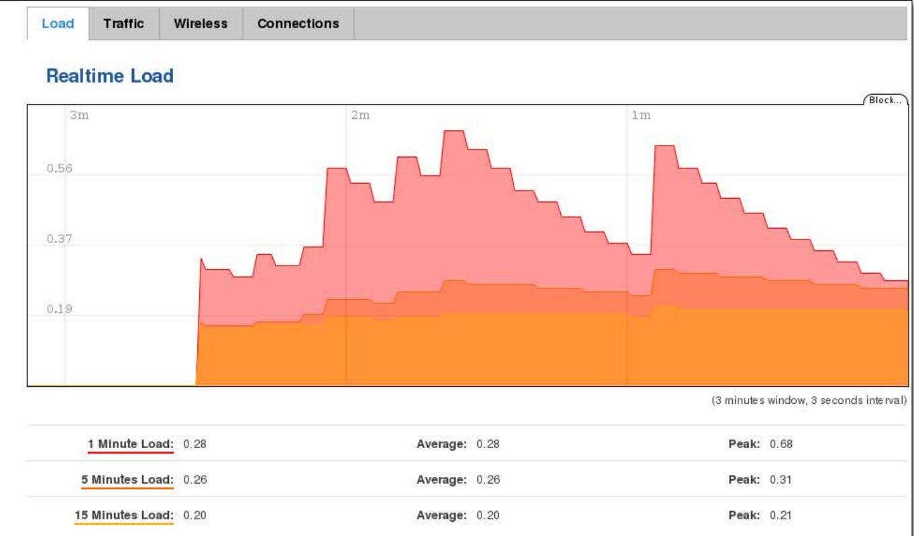

#### **5.6.1 Traffic**

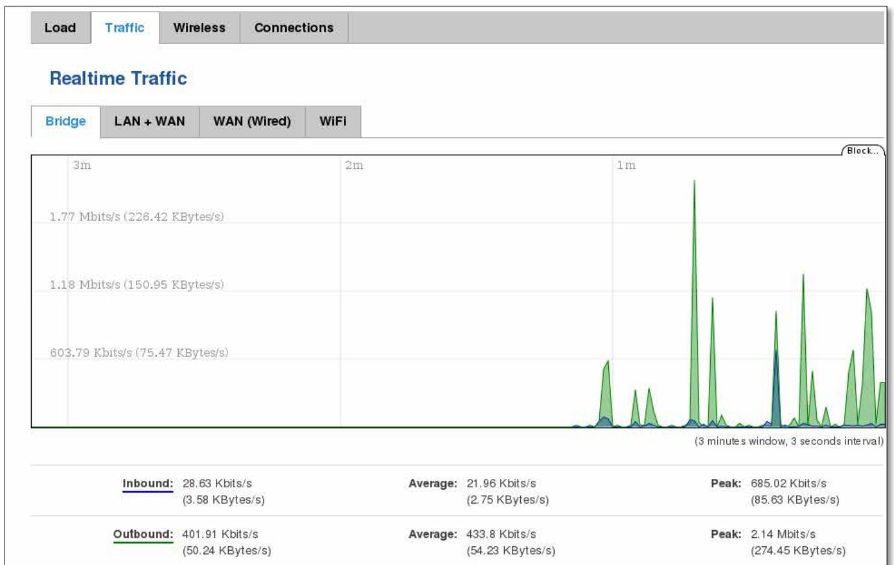

|    | Field Name  | Explanation                                                                                                                                                                                                                                                                                                                                                                                    |
|----|-------------|------------------------------------------------------------------------------------------------------------------------------------------------------------------------------------------------------------------------------------------------------------------------------------------------------------------------------------------------------------------------------------------------|
| 1. | Load        | This tri-graph illustrates average system load over the course of ~3 minutes; each new measurement is taken every 3 seconds. The graph consists out of three color coded graphs, each one corresponding to the average system load over 1 (red), 5 (orange) and 15 (yellow) most recent minutes. Although not graphed, the page also displays peak loads over 1, 5 and 15 minutes. |
| 2. | Bridge      | Cumulative graph, which encompasses wired Ethernet LAN and the wireless network.                                                                                                                                                                                                                                                                                                               |
| 3. | LAN+WAN     | Graphs the total traffic that passes through both WAN and LAN network interfaces.                                                                                                                                                                                                                                                                                                              |
| 4. | WAN         | Graphs the amount of traffic which passed through the current active WAN connection.                                                                                                                                                                                                                                                                                                           |
| 5. | Wi-Fi       | Shows the amount of traffic that has been sent and received through the wireless radio.                                                                                                                                                                                                                                                                                                        |
| 6. | Wireless    | Graphs illustrate how signal strength, amount of noise and physical rate of wireless changes over time.                                                                                                                                                                                                                                                                                     |
| 7. | Connections | This graph shows a concise history of the amount of connections that the router maintained. Blue graph indicates UDP connections, green TCP and red other types (ICMP, etc…). Other values indicate each respective graphs average and peak connection amounts over 3 minutes.                                                                                                           |

### **5.7 Events Log**

Event log displays such actions as: login, reboot, firmware flashing and reset.

#### **5.7.1 All**

| All Authentication     | Safemode Reboot |                                                     |
|---------------------------|--------------------|-----------------------------------------------------|
| EventLog                  |                    |                                                     |
| Events per page   10 ア |                    | Search                                              |
| Time ↑                    | Action +           | Result +                                            |
| 2014-11-04 14:34:24       | WebUl              | Authentication was succesful                        |
| 2014-11-04 14:33:06       | SSH                | Password auth succeeded from 192.168.1.107:41788 |
| 2014-11-04 14:15:50       | WebUI              | Authentication was succesful                        |
| 2014-11-04 13:48:21       | SSH                | Password auth succeeded from 192.168.1.109:47199 |
|                           |                    |                                                     |

#### **5.7.2 Authentication**

| All Authentication  | Reboot Safemode |                                                     |
|------------------------|--------------------|-----------------------------------------------------|
| EventLog               |                    |                                                     |
| Events per page :10 |                    | Search                                              |
| Time •                 | Action ↑           | Result ↑                                            |
| 2014-11-04 14:34:24    | WebUl              | Authentication was succesful                        |
| 2014-11-04 14:33:06    | SSH                | Password auth succeeded from 192.168.1.107:41788 |
| 2014-11-04 14:15:50    | WebUI              | Authentication was succesful                        |

#### **5.7.3 Reboot**

| Events Log                  |     |        |          |          |
|-----------------------------|-----|--------|----------|----------|
| All Authentication       |     | Reboot | Safemode |          |
| EventLog                    |     |        |          |          |
| 10 Events per page       | 1 4 |        |          | Search   |
| Time ↑                      |     |        | Action ↑ | Result ↑ |
| 2014-11-03 15:00:13         |     |        | Reboot   | Other    |
| 2014-11-03 12:23:25         |     |        | Reboot   | Other    |
| 2014-11-03 12:14:38         |     |        | Reboot   | Other    |
| Showing 1 to 3 of 3 entries |     |        |          |          |

#### **5.7.4 Safemode**

| All    | Authentication               | Reboot | Safemode |          |
|--------|------------------------------|--------|----------|----------|
|        | EventLog                     |        |          |          |
|        | Events per page ・ 10   |        |          | Search   |
| Time ↑ |                              |        | Action + | Result + |
|        | There are no events log yet. |        |          |          |

# **6 Network**

### **6.1 Mobile**

### **6.1.1 General**

### **6.1.1.1 Mobile configuration**

Here you can configure the mobile specific settings which are used when connecting to your local 3G/LTE network.

| General | SIM Management       |                       | Network Operators  |   | Mobile Data Limit |  |
|---------|----------------------|-----------------------|--------------------|---|-------------------|--|
|         | Mobile Configuration |                       |                    |   |                   |  |
|         | Mobile Configuration |                       |                    |   |                   |  |
| SIM 1   | SIM 2                |                       |                    |   |                   |  |
|         |                      | Mobile connection     | Use NDIS mode      | > |                   |  |
|         |                      | APN                   | APN                |   |                   |  |
|         |                      | PIN number            | 1234               |   |                   |  |
|         |                      | Dialing number        | *99#               |   |                   |  |
|         |                      | Authentication method | CHAP >          |   |                   |  |
|         |                      | Username              | username           |   |                   |  |
|         |                      | Password              |                    |   | 25                |  |
|         |                      | Service mode          | 4G (LTE) preferred | > |                   |  |
|         |                      | Deny data roaming [   |                    |   |                   |  |

|    | Field Name               | Sample value                                                | Explanation                                                                                                                                                                                                                                                                                                                                                                                                                                                                                                                                                    |
|----|--------------------------|-------------------------------------------------------------|----------------------------------------------------------------------------------------------------------------------------------------------------------------------------------------------------------------------------------------------------------------------------------------------------------------------------------------------------------------------------------------------------------------------------------------------------------------------------------------------------------------------------------------------------------------|
| 1. | Mobile connection     | Use PPPD mode/Use NDIS mode/Use bridge mode           | PPPD mode uses dialling number to establish data connection. NDIS mode (default) does not use dialling and PPP protocol to establish data connection and is usually faster than PPPD mode. Bridge mode bridges LTE data connection with LAN. In this mode the router does not have internet connection as ISP provides IP directly to end device (PC, tablet or smartphone). Using Bridge mode will disable most of the router capabilities and you can access your router's settings only by using static IP address on your end device. |
| 2. | APN                      | "APN"                                                       | Access Point Name (APN) is a configurable network identifier used by a mobile device when connecting to a GSM carrier.                                                                                                                                                                                                                                                                                                                                                                                                                                      |
| 3. | PIN number               | "1234" or any number that falls between 0000 and 9999 | A personal identification number is a secret numeric password shared between a user and a system that can be used to authenticate the user to the system.                                                                                                                                                                                                                                                                                                                                                                                                |
| 4. | Dialing number        | *99***1#                                                    | Dialling number is used to establish a mobile PPP (Point-to-Point Protocol) connection.                                                                                                                                                                                                                                                                                                                                                                                                                                                                     |
| 5. | Authentication method | CHAP, PAP or none                                           | Authentication method, which your carrier uses to authenticate new connections. (This selection is unavailable on the alternate model)                                                                                                                                                                                                                                                                                                                                                                                                                      |

| 6. | Username             | "username"                                                                                             | Your username and password that you would use to connect to your carriers network. These field become available when you select an authentication method (i.e. authentication method is not "none"). These fields are always enabled on the alternate model.                                                                                                                                                             |
|----|----------------------|--------------------------------------------------------------------------------------------------------|-----------------------------------------------------------------------------------------------------------------------------------------------------------------------------------------------------------------------------------------------------------------------------------------------------------------------------------------------------------------------------------------------------------------------------------|
| 7. | Password             | "password"                                                                                             | Shows the current system time. Might differ from your computer, because the router synchronizes it's time with an NTP server. Format [year-month-day, hours: minutes: seconds].                                                                                                                                                                                                                                             |
| 8. | Service mode         | 2G only, 2G preferred, 3G only, 3G preferred, 4G (LTE) only, 4G (LTE) preferred or automatic. | Your network preference. If your local mobile network supports 2G, 3G and 4G (LTE) you can specify to which network you wish to connect. E.g.: if you choose 2G, the router will connect to a 2G network, so long as it is available, otherwise it will connect to a network that provides better connectivity. If you select auto, then the router will connect to the network that provides better connectivity. |
| 9. | Deny data roaming | Enable/Disable                                                                                         | If enabled this function prevents the device from establishing mobile data connection while not in home network.                                                                                                                                                                                                                                                                                                               |

Warning: If an invalid PIN number was entered (i.e. the entered PIN does not match the one that was used to protect the SIM card), your SIM card will get blocked. To avoid such mishaps it is highly advised to use an unprotected SIM. If you happen to insert a protected SIM and the PIN number is incorrect, your card won't get blocked immediately, although after a couple of reboots OR configuration saves it will.

### **6.1.1.2 Mobile Data On Demand**

| Field name | Possible values | Explanation |  |
|------------|-----------------|-------------|--|
|            |                 |             |  |
|            |                 |             |  |
|            |                 |             |  |
|            |                 |             |  |

| 1. | Enable                  | Enable/Disable | Mobile Data On Demand function enables you to keep mobile data connection on only when it's in use |
|----|-------------------------|----------------|-------------------------------------------------------------------------------------------------------|
| 2. | No data timeout(sec) | 1-99999999     | A mobile data connection will be terminated if no data is transferred during the timeout period    |

### **6.1.1.3 Force LTE network**

| Force LTE network |     |  |
|-------------------|-----|--|
| Enable ■          |     |  |
| Interval (sec)    | 300 |  |

|    | Field name     | Possible values | Explanation                                                                                                                                                                                                                                                                                  |
|----|----------------|-----------------|----------------------------------------------------------------------------------------------------------------------------------------------------------------------------------------------------------------------------------------------------------------------------------------------|
| 1. | Enable         | Enable/Disable  | Force LTE network function periodically disables mobile data connection (for a few seconds)) to allow the device to switch to LTE network. This could because some operators do not support switching from 3G to LTE networks while data is being transferred. |
| 2. | Interval (sec) | 180 - 3600      | Interval in seconds the device will use to periodically disable mobile data connection.                                                                                                                                                                                                   |

#### **6.1.2 SIM Management**

| SIM Management Network Operators General | Mobile Data Limit |
|------------------------------------------------|-------------------|
| SIM Switching                                  |                   |
| Primary Card                                   |                   |
| Primary SIM card                               | SIM 1             |
| Sim Switching                                  |                   |
| Enable automatic switching                     |                   |
| On weak signal                                 |                   |
| Signal strength (dBm)                          | -80               |
| On data limit                                  |                   |
| Period                                         | Day               |
| Start hour                                     | 1 2            |
| Data limit (MB)                                | 200               |
| On roaming                                     |                   |
| On data connection fail                        |                   |
| Use same rules for secondary SIM               |                   |
| Switch back to primary SIM card after timeout  |                   |
| Initial timeout (min)                          | 10                |
| Subsequent timeout (min)                       | 20                |

|     | Field name                                          | Possible values | Explanation                                                                                                             |  |
|-----|-----------------------------------------------------|-----------------|-------------------------------------------------------------------------------------------------------------------------|--|
| 1.  | Primary SIM card                                    | SIM 1 / SIM 2   | SIM card that will be used in the system as a primary SIM card                                                          |  |
| 2.  | Enable automatic switching                       | Enable/Disable  | Automatically switch between primary and secondary SIM cards based on the various rules and criterions defined below |  |
| 3.  | On weak signal                                      | Enable/Disable  | Perform a SIM card switch when a signal's strength drops below a certain threshold                                   |  |
| 4.  | Signal strenght (dBm)                            | -80             | Lowest signal's strength value in dBm below which a SIM card switch should occur                                     |  |
| 5.  | On data limit                                       | Enable/Disable  | Perform a SIM card switch when mobile data limit for your current SIM card is exceeded                               |  |
|     | Period                                              | Month/Week/Day  | Period for which data limit based SIM card switching should apply                                                       |  |
| 6.  | Start day/Start hour                             |                 | A starting time for data limit based SIM card switching period                                                          |  |
| 7.  | Data limit (MB)                                     | 200             | A data limit value in MB above which a SIM card switch should occur                                                     |  |
| 8.  | On roaming                                          | Enable/Disable  | Perform a SIM card switch when roaming is detected                                                                      |  |
| 9.  | On data connection fail                          | Enable/Disable  | Perform a SIM card switch when data connection fails                                                                    |  |
| 10. | Use same rules for secondary SIM                 | Enable/Disable  | Apply the same SIM cards switching rules and criterions for both SIM cards                                           |  |
| 11. | Switch back to primary SIM card after timeout | Enable/Disable  | Switch back to primary SIM card after timeout has been reached                                                          |  |
| 12. | Initial timeout                                     | 10              | An initial timeout value in minutes after which a SIM card's switch-back                                                |  |

|     | (min)                       |    | should occur                                                                                                                                                                                                             |
|-----|-----------------------------|----|--------------------------------------------------------------------------------------------------------------------------------------------------------------------------------------------------------------------------|
| 13. | Subsequent timeout (min) | 20 | A subsequent timeout value in minutes after which a SIM card's switch back should occur. This value is increased every time an unsuccessful switch-back is made: new_timeout = old_timeout + subsequent_timeout |
| 14. | Subsequent timeout (min) | 20 | A subsequent timeout value in minutes after which a SIM card's switch back should occur. This value is increased every time an unsuccessful switch-back is made: new_timeout = old_timeout + subsequent_timeout |

#### **6.1.3 Network Operators**

This function lets you Scan, Select and enter manual Network Operator to which router should connect. Function will provide great utility when router is in Roaming conditions.

| Current SIM                |               |            |              |                     |         |
|----------------------------|---------------|------------|--------------|---------------------|---------|
| SIM card in use            |               |            | SIM 1        |                     |         |
| Current operator           |               |            | TELE2        |                     |         |
| Scan For Network Operators |               |            |              |                     |         |
| Status                     | Operator name | Short name | Numeric name | Network access type | Connect |
| Available                  | Tele2 LT      | Tele2 LT   | 24603        | 3G/2G               | Connect |
| Forbidden                  | LT BITE GSM   | BITE       | 24602        | 3G/2G               | Connect |
| Available                  | OMNITEL LT    | OMT        | 24601        | 2G/3G/4G            | Connect |

|    | Field Name       | Sample Value  | Explanation                                  |
|----|------------------|---------------|----------------------------------------------|
| 1. | SIM card in use  | SIM 1 / SIM 2 | Shows current SIM card's in use              |
| 2. | Current operator | "TELE2"       | Operator's name of the connected GSM network |

Note: after clicking Scan button - You will lose current mobile connection! For changing network operator status have to be available. There is manual connection to network operator, you have to fill numeric name, and it's have to be available.

#### **6.1.4 Mobile Data Limit**

This function lets you limit maximum amount of data transferred on WAN interface in order to minimize unwanted traffic costs.

#### **6.1.4.1 Data Connection Limit Configuration**

| General                         | SIM Management                      | Network Operators            | Mobile Data Limit |
|---------------------------------|-------------------------------------|------------------------------|-------------------|
| Mobile Data Limit Configuration |                                     |                              |                   |
| Primary SIM Card                |                                     | Secondary SIM Card           |                   |
|                                 | Data Connection Limit Configuration |                              |                   |
|                                 |                                     | Enable data connection limit |                   |
|                                 |                                     | Data limit (MB) 200       |                   |
| Day Period -              |                                     |                              |                   |
| 14 - Start hour              |                                     |                              |                   |

|    | Field Name                      | Sample value   | Explanation                                                     |
|----|---------------------------------|----------------|-----------------------------------------------------------------|
| 1. | Enable data connection limit | Enable/Disable | Disables mobile data when a limit for current period is reached |
| 2. | Data limit (MB)                 | 200            | Disable mobile data after limit value in MB is reached          |
| 3. | Period                          | Month/Week/Day | Period for which mobile data limiting should apply              |
| 4. | Start day/ Start hour        |                | A starting time for mobile data limiting period                 |

### **6.1.4.2 SMS Warning Configuration**

| SMS Warning Configuration |              |
|---------------------------|--------------|
| Enable SMS warning V      |              |
| Data limit (MB)           | 300          |
| Period                    | Month        |
| Start day                 | -            |
| Phone number              | +37012345678 |

|    | Field Name               | Sample value   | Explanation                                                                                    |
|----|--------------------------|----------------|------------------------------------------------------------------------------------------------|
| 1. | Enable SMS warning    | Enable/Disable | Enables sending of warning SMS message when mobile data limit for current period is reached |
| 2. | Data limit (MB)          | 200            | Send warning SMS message after limit value in MB is reached                                    |
|    | Period                   | Month/Week/Day | Period for which mobile data limiting should apply                                             |
| 4. | Start day/ Start hour |                | A starting time for mobile data limiting period                                                |
| 3. | Phone number             | +37012345678   | A phone number to send warning SMS message to, e.g. +37012345678                               |

### **6.2 WAN**

### **6.2.1 Operation Mode**

| WAN                                                                                  |
|--------------------------------------------------------------------------------------|
| Your WAN configuration determines how the router will be connecting to the internet. |
| Operation Mode                                                                       |
| " Wired Interface 0-1                                                          |
| 69 WiFi                                                                              |
| ( Mobile 9                                                                        |

|    | Type   | Explanation                                                                                            |
|----|--------|--------------------------------------------------------------------------------------------------------|
| 1. | Wired  | An Ethernet cable connected to the WAN port of the router.                                             |
| 2. | Wi-Fi  | The router will be able to connect to a local wireless access point and reach the internet through it. |
| 3. | Mobile | The router will connect to your local mobile network for Mobile access.                                |

#### **6.2.2 Common configuration**

Common configuration allows you to configure your TCP/IP settings for the wan network.

| Common Configuration  |                         |                 |  |
|-----------------------|-------------------------|-----------------|--|
| General Setup         | Advanced Settings       |                 |  |
| Protocol DHCP > |                         |                 |  |
|                       | Really switch protocol? | Switch protocol |  |

You can switch between the Static, DHCP or PPPoE protocol by selecting the protocol that you want to use and then pressing **Switch Protocol** 

**Note: Mobile connection does not use either DHCP or Static protocol therefore it displays "none" in the dropdown menu.**

### **6.2.2.1 General Setup**

#### **6.2.2.1.1 Static:**

| Common Configuration |                        |                |     |
|----------------------|------------------------|----------------|-----|
| General Setup        | Advanced Settings      |                |     |
|                      | Protocol               | Static >    |     |
|                      | IPv4 address           | 192.168.99.162 |     |
|                      | IPv4 netmask           | 255.255.255.0  |     |
|                      | IPv4 gateway           | 192.168.99.254 |     |
|                      | IPv4 broadcast         | 192.168.99.255 |     |
|                      | Use custom DNS servers | 8.8.8.8        | ×   |
|                      |                        | 8.8.6.6        | 图 电 |

This is the configuration setup for when you select the static protocol.

|    | Filed name         | Sample          | Explanation                                                                                                                                                                                                                                                                                                                                                                                                                |
|----|--------------------|-----------------|----------------------------------------------------------------------------------------------------------------------------------------------------------------------------------------------------------------------------------------------------------------------------------------------------------------------------------------------------------------------------------------------------------------------------|
| 1. | IPv4 address       | 192.168.99.162  | Your routers address on the WAN network                                                                                                                                                                                                                                                                                                                                                                                    |
| 2. | IPv4 netmask       | 255.255.255.0   | A mask used to define how "large" the WAN network is                                                                                                                                                                                                                                                                                                                                                                       |
| 3. | IPv4 gateway       | 192.168.99.254  | Address where the router will send all the outgoing traffic                                                                                                                                                                                                                                                                                                                                                                |
| 4. | IPv4 broadcast     | 192.168.99.255  | Broadcast address (autogenerated if not set). It is best to leave this blank unless you know what you are doing.                                                                                                                                                                                                                                                                                                        |
| 5. | custom DNS servers | 8.8.8.8 8.8.6.6 | Usually the gateway has some predefined DNS servers. As such the router, when it needs to resolve a hostname ("www.google.com", "www.cnn.com", etc…) to an IP address, it will forward all the DNS requests to the gateway. By entering custom DNS servers the router will take care of host name resolution. You can enter multiple DNS servers to provide redundancy in case the one of the server fails. |

### **6.2.2.1.2 DHCP:**

| General Setup                       | Advanced Settings                     |                                                                                                           |
|-------------------------------------|---------------------------------------|-----------------------------------------------------------------------------------------------------------|
|                                     | Protocol                              | DHCP                                                                                                      |
|                                     | Hostname to send when requesting DHCP | Teltonika                                                                                                 |
| IP Aliases                          |                                       |                                                                                                           |
|                                     |                                       | IP aliases are a way of defining or reaching a subnet that works in the same space as the regular network |
| There are no IP aliases created yet |                                       |                                                                                                           |
| Add                                 |                                       |                                                                                                           |
|                                     |                                       | Save                                                                                                      |

When you select the DHCP protocol you can use it as is, because most networks will not require any additional advanced configuration.

### **6.2.2.1.3 PPPoE**

This protocol is mainly used by DSL providers:

| Common Configuration |                     |         |     |
|----------------------|---------------------|---------|-----|
| General Setup        | Advanced Settings   |         |     |
|                      | Protocol            | PPPoE - |     |
|                      | PAP/CHAP username   | test    |     |
|                      | PAP/CHAP password   |         | જીડ |
|                      | Access Concentrator | auto    |     |
|                      | Service Name        | auto    |     |

This is the configuration setup for when you select PPPoE protocol.

|    | Filed name          | Sample        | Explanation                                                                           |
|----|---------------------|---------------|---------------------------------------------------------------------------------------|
| 1. | PAP/CHAP username   | test          | Your username and password that you would use to connect to your carriers network. |
| 2. | PAP/CHAP password   | your_password | A mask used to define how "large" the WAN network is                                  |
| 3. | Access Concentrator | isp           | Specifies the name of access concentrator. Leave empty to auto detect.                |
| 4. | Service Name        | isp           | Specifies the name of the service. Leave empty to auto detect.                        |

#### **6.2.2.2 Advanced**

These are the advanced settings for each of the protocols, if you are unsure of how to alter these attributes it is highly recommended to leave them to a trained professional:

#### **6.2.2.2.1 Static**

| Common Configuration |                      |                   |  |  |
|----------------------|----------------------|-------------------|--|--|
| General Setup        | Advanced Settings    |                   |  |  |
|                      | Disable NAT          |                   |  |  |
|                      | Override MAC address | 86:48:71:B7:E9:E4 |  |  |
|                      | Override MTU         | 1500              |  |  |
|                      | Use gateway metric   | 0                 |  |  |

|    | Field name           | Sample value      | Explanation                                                                                                                                                                                                                                                                                                                                 |
|----|----------------------|-------------------|---------------------------------------------------------------------------------------------------------------------------------------------------------------------------------------------------------------------------------------------------------------------------------------------------------------------------------------------|
| 1. | Disable NAT          | On/Off            | Toggle NAT on and off.                                                                                                                                                                                                                                                                                                                      |
| 2  | Override MAC address | 86:48:71:B7:E9:E4 | Override MAC address of the WAN interface. If your ISP gives you a static IP address it might also bind it to your computers MAC address (i.e. that IP will only work with your computer). In this field you can enter your computers MAC address and fool the gateway in thinking that it is communicating with your computer. |
| 3. | Override MTU         | 1500              | Maximum transmission unit – specifies the largest possible size of a data packet.                                                                                                                                                                                                                                                        |
| 4. | Use gateway metric   | 0                 | The WAN configuration by default generates a routing table entry. With this field you can alter the metric of that entry.                                                                                                                                                                                                                |

### **6.2.2.2.2 DHCP**

| Common Configuration                      |                   |  |
|-------------------------------------------|-------------------|--|
| General Setup Advanced Settings        |                   |  |
| Disable NAT O                             |                   |  |
| Use broadcast flag                        |                   |  |
| Use default gateway √                     |                   |  |
| Use DNS servers advertised by peer √      |                   |  |
| Use gateway metric                        | 0                 |  |
| Client ID to send when requesting DHCP    |                   |  |
| Vendor Class to send when requesting DHCP |                   |  |
| Override MAC address                      | 86:48:71:B7:E9:E4 |  |
| Override MTU                              | 1500              |  |

|    | Field name                                   | Sample value      | Explanation                                                                                                                                                                                                                                                                                                                                 |
|----|----------------------------------------------|-------------------|---------------------------------------------------------------------------------------------------------------------------------------------------------------------------------------------------------------------------------------------------------------------------------------------------------------------------------------------|
| 1. | Disable NAT                                  | Enable/Disable    | If checked, router will not perform NAT (masquerade) on this interface                                                                                                                                                                                                                                                                   |
| 2  | Use broadcast flag                           | Enable/Disable    | Required for certain ISPs, e.g. Charter with DOCSIS 3                                                                                                                                                                                                                                                                                       |
| 3. | Use default gateway                          | Enable/Disable    | If unchecked, no default route is configured                                                                                                                                                                                                                                                                                                |
| 4. | Use DNS server advertised by peer         | Enable/Disable    | If unchecked, the advertised DNS server addresses are ignored                                                                                                                                                                                                                                                                               |
| 5. | User gateway metric                          | 0                 | The WAN configuration by default generates a routing table entry With this field you can alter the metric of that entry                                                                                                                                                                                                                  |
| 6. | Client ID to send when requesting DHCP    |                   |                                                                                                                                                                                                                                                                                                                                             |
| 7. | Vendor Class to send when requesting DHCP |                   |                                                                                                                                                                                                                                                                                                                                             |
| 8. | Override MAC address                         | 86:48:71:B7:E9:E4 | Override MAC address of the WAN interface. If your ISP gives you a static IP address it might also bind it to your computers MAC address (i.e. that IP will only work with your computer). In this field you can enter your computers MAC address and fool the gateway in thinking that it is communicating with your computer. |
| 9. | Override MTU                                 | 1500              | Maximum transmission unit – specifies the largest possible size of a data packet.                                                                                                                                                                                                                                                        |

### **6.2.2.2.3 PPPoE**

| Common Configuration               |    |  |
|------------------------------------|----|--|
| General Setup Advanced Settings |    |  |
| Disable NAT                        | 19 |  |
| Use default gateway                | >  |  |
| Use gateway metric                 | 0  |  |
| Use DNS servers advertised by peer | V  |  |
| LCP echo failure threshold         | 0  |  |
| LCP echo interval                  | 5  |  |
| Inactivity timeout                 | 0  |  |

|    | Field name                            | Sample value   | Explanation                                                                                                      |
|----|---------------------------------------|----------------|------------------------------------------------------------------------------------------------------------------|
| 1. | Disable NAT                           | Enable/Disable | If checked, router will not perform NAT (masquerade) on this interface                                        |
| 2  | Use default gateway                   | Enable/Disable | If unchecked, no default route is configured                                                                     |
| 3. | Use gateway metric                    | 0              |                                                                                                                  |
| 4. | Use DNS servers advertised by peer | Enable/Disable | If unchecked, the advertised DNS server addresses are ignored                                                    |
| 5. | LCP echo failure threshold         | 0              | Presume peer to be dead after given amount of LCP echo failures, use 0 to ignore failures                     |
| 6. | LCP echo interval                     | 5              | Send LCP echo requests at the given interval in seconds, only effective in conjunction with failure threshold |
| 7. | Inactivity timeout                    | 0              | Close inactive connection after the given amount of seconds, use 0 to persist connection                      |

### **6.2.2.2.4 IP Aliases**

IP aliases are a way of defining or reaching a subnet that works in the same space as the regular network.

| General Setup | Advanced Settings |                 |
|---------------|-------------------|-----------------|
|               | IP Address        | 192.168.99.161  |
|               | Netmask           | 255.255.255.0 ▼ |
|               | Gateway           | 192.168.99.254  |
| Delete        |                   |                 |
| Add           |                   |                 |
|               |                   | Save            |

As you can see, the configuration is very similar to the static protocol; only in the example a 99th subnet is defined. Now if some device has an IP in the 99 subnet (192.168.99.xxx) and the subnets gateway metric is "higher" and the device is trying to reach the internet it will reroute it's traffic not to the gateway that is defined in common configurations but through the one that is specified in IP aliases.

| General Setup | Advanced Settings |  |      |
|---------------|-------------------|--|------|
|               | IP Broadcast      |  |      |
|               | DNS Server        |  |      |
| Delete        |                   |  |      |
| Add           |                   |  |      |
|               |                   |  | Save |

You may also optionally define a broadcast address and a custom DNS server.

### **6.3 LAN**

This page is used to configure the LAN network, where all your devices and computers that you connect to the router will reside.

### **6.3.1 Configuration**

#### **6.3.1.1 General Setup**

| Configuration |                   |               |
|---------------|-------------------|---------------|
| General Setup | Advanced Settings |               |
|               | IP address        | 192.168.1.1   |
|               | IP netmask        | 255.255.255.0 |
|               | IP broadcast      |               |

|    | Field name   | Sample value  | Explanation                                                                                               |
|----|--------------|---------------|-----------------------------------------------------------------------------------------------------------|
| 1. | IP address   | 192.168.1.1   | Address that the router uses on the LAN network                                                           |
| 2  | IP netmask   | 255.255.255.0 | A mask used to define how large the LAN network is                                                        |
| 3. | IP broadcast | 0             | IP broadcasts are used by BOOTP and DHCP clients to find and send requests to their respective servers |

#### **6.3.1.2 Advanced settings**

| LAN                 |                   |  |
|---------------------|-------------------|--|
| Configuration       |                   |  |
| General Setup       | Advanced Settings |  |
| Override MTU   1500 |                   |  |
| Use gateway metric  |                   |  |

|    | Field name             | Sample value   | Explanation                                                                                 |
|----|------------------------|----------------|---------------------------------------------------------------------------------------------|
| 1. | Enable LAN interface   | Enable/Disable |                                                                                             |
| 2  | Use custom DNS servers | 8.8.8.8        | Multiple DNS servers can be entered by clicking new entry button near a text input field |
| 3. | Override MTU           | 1500           | MTU (Maximum Transmission Unit) specifies the largest possible size of a data packet     |
| 4. | Use gateway metric     | 0              | With this field you can alter the metric of that entry                                      |

#### **6.3.2 DHCP Server**

The DHCP server is the router side service that can automatically configure the TCP/IP settings of any device that requests such a service. If you connect a device that has been configured to obtain IP address automatically the DHCP server will lease an address and the device will be able to fully communicate with the router.

### **6.3.2.1 General Setup**

| DHCP Server   |                   |             |
|---------------|-------------------|-------------|
| General Setup | Advanced Settings |             |
|               | DHCP              | Enable 1 |
|               | Start             | 100         |
|               | Limit             | 150         |
|               | Lease time        | 12          |
|               |                   | Hours       |

|    | Field Name | Sample value   | Explanation                                                                                                                                                                                                                                                                                                                                                                                                                                                                                |
|----|------------|----------------|--------------------------------------------------------------------------------------------------------------------------------------------------------------------------------------------------------------------------------------------------------------------------------------------------------------------------------------------------------------------------------------------------------------------------------------------------------------------------------------------|
| 1. | DHCP       | Enable/Disable | Manage DHCP server                                                                                                                                                                                                                                                                                                                                                                                                                                                                         |
| 2. | Start      | 100            | The starting address of the range that the DHCP server can use to give out to devices. E.g.: if your LAN IP is 192.168.2.1 and your subnet mask is 255.255.255.0 that means that in your network a valid IP address has to be in the range of [192.168.2.1 – 192.168.2.254](192.168.2.0 and 192.168.2.255 are special unavailable addresses). If the Start value is set to 100 then the DHCP server will only be able to lease out addresses starting from 192.168.2.100 |
| 3. | Limit      | 150            | How many addresses the DHCP server gets to lease out. Continuing on the above example: if the start address is 192.168.2.100 then the end address will be 192.168.2.254 (100 + 150 – 1 = 254).                                                                                                                                                                                                                                                                                       |
| 4. | Lease time | 12             | How long can a leased IP be considered valid. An IP address after the specified amount of time will expire and the device that leased it out will have to request for a new one. Select Hour or Minute (minimum 2min).                                                                                                                                                                                                                                                               |

#### **6.3.2.2 Advanced settings**

You can also define some advanced options that specify how the DHCP server will operate on your LAN network.

| DHCP Server    |                   |      |     |  |  |
|----------------|-------------------|------|-----|--|--|
| General Setup  | Advanced Settings |      |     |  |  |
| Dynamic DHCP V |                   |      |     |  |  |
| Force          |                   | 1 21 |     |  |  |
|                | IP netmask        |      |     |  |  |
|                | DHCP Options      |      | ្រុ |  |  |

|    | Field Name   | Sample Value      | Explanation                                                                                                                                                                                       |
|----|--------------|-------------------|---------------------------------------------------------------------------------------------------------------------------------------------------------------------------------------------------|
| 1. | Dynamic DHCP | Checked/Unchecked | Dynamically allocate client addresses, if set to 0 only clients present in the ethers files are served                                                                                         |
| 2. | Force        | Checked/Unchecked | Forces DHCP serving even if another DHCP server is detected on the same network segment.                                                                                                       |
| 3. | IP netmask   |                   | You can override your LAN netmask here to make the DHCP server think it's serving a larger or a smaller network than it actually is.                                                           |
| 4. | DHCP-Options |                   | Additional options to be added for this DHCP server. For example with '26,1470' or 'option:mtu, 1470' you can assign an MTU per DHCP. Your client must accept MTU by DHCP for this to work. |

### **6.4 Wireless**

On this page you can configure your wireless settings. Depending on whether your WAN mode is set to Wi-Fi or not, the page will display either the options for configuring an **Access Point** or options for configuring a **connection** to some local access point.

#### Access Point:

| Wireless General                                                                         | Site Survey                                          |  |  |  |  |
|------------------------------------------------------------------------------------------|------------------------------------------------------|--|--|--|--|
| Wireless Access Point                                                                    |                                                      |  |  |  |  |
| Here you can configure your wireless settings like radio frequency, mode, encryption etc |                                                      |  |  |  |  |
| Device Configuration                                                                     |                                                      |  |  |  |  |
| General Setup                                                                            | Advanced Settings                                    |  |  |  |  |
|                                                                                          | Enable wireless 7                                    |  |  |  |  |
|                                                                                          | Channel > auto                                 |  |  |  |  |
| Interface Configuration                                                                  |                                                      |  |  |  |  |
| General Setup                                                                            | Wireless Security MAC Filter Advanced Settings |  |  |  |  |
| SSID Teltonika_Router                                                                 |                                                      |  |  |  |  |
| Hide SSID ■                                                                              |                                                      |  |  |  |  |

Here you can see the Overview of the wireless configuration. It is divided into two main sections – device and interface. One is dedicated to configuring hardware parameters other – software.

Here you can toggle the availability of the wireless radio and the physical channel frequency.

**Important note**: As seen in the picture you should always **Save** before toggling the radio on and off.

ESSID – Your wireless networks identification string. This is the name of your Wi-Fi network. When other Wi-Fi capable computers or devices scan the area for Wi-Fi networks they will see your network with this name.

Hide ESSID – Will render your SSID hidden from other devices that try to scan the area.

#### **6.4.1.1 Device**

#### **6.4.1.1.1 Advanced Settings**

| Device Configuration |                         |                 |  |
|----------------------|-------------------------|-----------------|--|
| General Setup        | Advanced Settings       |                 |  |
|                      | Mode                    | 802.11g+n V  |  |
|                      | HT mode                 | 20MHz V      |  |
|                      | Country code            | 00 - World V |  |
|                      | Transmit power          | 100 % V      |  |
|                      | Fragmentation threshold |                 |  |
|                      | RTS/CTS threshold       |                 |  |

Here you can configure more advanced parameters:

|    | Field name            | Sample value                            | Explanation                                                                                                                                                                                                                                                            |
|----|-----------------------|-----------------------------------------|------------------------------------------------------------------------------------------------------------------------------------------------------------------------------------------------------------------------------------------------------------------------|
| 1. | Mode                  | Auto, b, g, g+n                         | Different modes provide different throughput and security options.                                                                                                                                                                                                  |
| 2. | Country Code          | Any ISO/IEC 3166 alpha2 country code | Selecting this will help the wireless radio configure its internal parameters to meet your countries wireless regulations.                                                                                                                                          |
| 3. | Distance Optimization | 100                                     | Distance to farthest network member in meters.                                                                                                                                                                                                                         |
| 4. | Frag. Threshold       | 2346                                    | The smallest packet size that can be fragmented and transmitted by multiple frames. In areas were interference is a problem, setting a lower fragment threshold might help reduce the probability of unsuccessful packet transfers, thus increasing speed. |
| 5. | RTS/CTS Threshold     | 2346                                    | Request to send threshold. It can help resolve problems arising when several access points are in the same area, contending.                                                                                                                                        |

### **6.4.1.2 Interface**

### **6.4.1.2.1 Security**

Encryption – There are many modes of encryption, a distinctive class is pointed out below.

| Interface Configuration |                   |  |                                  |  |                   |  |
|-------------------------|-------------------|--|----------------------------------|--|-------------------|--|
| General Setup           | Wireless Security |  | MAC Filter                       |  | Advanced Settings |  |
|                         | Encryption        |  | WPA-PSK/WPA2-PSK mixed mode V |  |                   |  |
|                         | Cipher            |  | Auto                             |  |                   |  |
|                         | Key               |  |                                  |  |                   |  |

First select an encryption method: TKIP, CCMP, TKIP&CCMP and auto. Note: Some authentication methods won't support TKIP (and TKIP&CCMP) encryption. After you've selected your encryption method, you should enter your passphrase, which must be at least 8 characters long.

### **6.4.1.2.2 MAC-Filter**

| Interface Configuration |                    |                   |                        |  |
|-------------------------|--------------------|-------------------|------------------------|--|
| General Setup           | Wireless Security  | MAC Filter        | Advanced Settings      |  |
|                         | MAC address filter |                   | Allow listed only V |  |
|                         | MAC list           | 00:11:22:33:44:55 | +                      |  |

Filter – you can define a rule for what to do with the MAC list you've defined. You can either allow only the listed MACs or allow ALL, but forbid only the listed ones.

### **6.4.1.2.3 Advanced settings**

Separate clients – prevents Wi-Fi clients from communicating with each other on the sane subnet.

| Interface Configuration |                   |            |                   |  |  |
|-------------------------|-------------------|------------|-------------------|--|--|
| General Setup           | Wireless Security | MAC Filter | Advanced Settings |  |  |
| Separate clients        |                   |            |                   |  |  |
|                         |                   |            |                   |  |  |

#### **6.4.1.3 Client**

RUT9xx can work as a Wi-Fi client (check **6.5 Chapter** of this manual). Client mode is nearly identical to AP, except for the fact that most for the options are dictated by the wireless access point that the router is connecting to. Changing them can result in an interrupted connection to an AP.

In addition to standard options you can also click the **Scan** button to rescan the surrounding area and attempt to connect to a new wireless access point.

### **6.5 Backup WAN**

Backup WAN is function that allows you to back up your wired OR wireless connection in case they go down. At the current moment you can only backup wired and Wi-Fi

| Backup WAN                                                                                                                                                                                    |                    |  |
|-----------------------------------------------------------------------------------------------------------------------------------------------------------------------------------------------|--------------------|--|
| Backup Link                                                                                                                                                                                   |                    |  |
| Enable Г                                                                                                                                                                                      |                    |  |
| Backup Configuration                                                                                                                                                                          |                    |  |
| ff mobile is selected as WAN, you cannot enable backup link. Timing and other parameters will indicate how and when it will be determined that your conventional connection has gone down. |                    |  |
| Health monitor interval                                                                                                                                                                       | 5 sec. >        |  |
| Health monitor ICMP host(s)                                                                                                                                                                   | DNS Server(s) > |  |
| Health monitor ICMP timeout                                                                                                                                                                   | 1 sec. >        |  |
| Attempts before WAN failover                                                                                                                                                                  | >                  |  |
| Attempts before WAN recovery                                                                                                                                                                  |                    |  |
| Backup Check                                                                                                                                                                                  |                    |  |
| A remote host that will be used to test wether your backup link is alive.                                                                                                                     |                    |  |
| ICMP host                                                                                                                                                                                     | 8.8.4.4            |  |

The majority of the options consist of timing and other important parameters that help determine the health of your primary connection. Regular health checks are constantly performed in the form of ICMP packets (Pings) on your primary connection. When the connections state starts to change (READY->NOT READY and vice versa) a necessary amount of failed or passed health checks has to be reached before the state changes completely. This delay is instituted so as to mitigate "spikes" in connection availability, but it also extends the time before the backup link can be brought up or down.

|    | Field Name              | Sample value                         | Explanation                                                                                                                                                                                                                                    |
|----|-------------------------|--------------------------------------|------------------------------------------------------------------------------------------------------------------------------------------------------------------------------------------------------------------------------------------------|
| 1. | Enable                  | Enable/Disable                       | Here you can setup your backup WAN. If your conventional WAN connection, such as wired Ethernet or Wireless, fails, the backup link will be enabled and take over to keep the router connected |
| 2. | Health monitor Interval | Disable/5/10/20/30/60/120 Seconds | The interval at which health checks are performed                                                                                                                                                                                              |

| 3. | Health monitor ICMP host(s)     | Disable/DNS/WAN GW/Custom | Where to Ping for a health check. As there is no definitive way to determine when the connection to internet is down for good, you'll have to define a host whose availability that of the internet as a whole. |
|----|---------------------------------|------------------------------|-----------------------------------------------------------------------------------------------------------------------------------------------------------------------------------------------------------------------------|
| 4. | Health monitor ICMP timeout     | 1/3/4/5/10 Seconds           | How long to wait for an ICMP request to come back. Set a higher value if your connection has high latency or high jitter (latency spikes).                                                                            |
| 5. | Attempts before WAN failover    | 1/3/5/10/15/20               | How many checks should fail for your WAN connection to be declared DOWN for good.                                                                                                                                        |
| 6. | Attempts before WAN recovery | 1/3/5/10/15/20               | How many checks should pass for your WAN connection to be declared UP.                                                                                                                                                   |
| 7. | ICMP host                       | 8.8.4.4                      | This is where the address of an ICMP host, that will be used to check the health of your Mobile backup link, goes. This has to be a Ping-able host.                                                                   |

### **6.5.1.1 How do I set up a backup link?**

First we must pick a main link: Wired or Wi-Fi, and ensure that the link is working. Configure your WAN settings to use that link and see whether you have internet access. If the main link is working we can continue configuring our Backup Link.

Now, go to Backup WAN page and configure the settings to your liking. Click Save and wait until the settings are applied.

Now in the Status -> Network Information -> WAN page there should be a status indication for the backup WAN. If everything is working correctly you should see this:

| Backup WAN Status |  |                                              |
|-------------------|--|----------------------------------------------|
|                   |  | WAN: [Wired] IN USE   Backup WAN: [3G] READY |
|                   |  |                                              |

The above picture shows the status for Backup WAN configured on a wired main link. You can now simulate a downed link by simply unplugging your Ethernet WAN cable. When you've done so you should see this:

| Backup WAN Status |                                                  |
|-------------------|--------------------------------------------------|
|                   | WAN: [Wired] NOT READY   Backup WAN: [3G] IN USE |
|                   |                                                  |

And, if you plug the cable back in you should, again, see this:

| Backup WAN Status |                                              |
|-------------------|----------------------------------------------|
|                   | WAN: [Wired] IN USE   Backup WAN: [3G] READY |

If you do not witness the above sequence, your backup link is working!

### **6.6 Firewall**

In this section we will look over the various firewall features that come with RUT950.

#### **6.6.1 General Settings**

The routers firewall is a standard Linux iptables package, which uses routing chains and policies to facilitate control over inbound and outbound traffic.

| General Settings | Port Forwarding                                                | Traffic Rules     | Custom Rules |
|------------------|----------------------------------------------------------------|-------------------|--------------|
| Firewall         |                                                                |                   |              |
|                  | General settings allows you to set up default firewall policy. |                   |              |
| General Settings |                                                                |                   |              |
|                  | Enable SYN flood protection V                                  |                   |              |
|                  | Drop invalid packets O                                         |                   |              |
|                  |                                                                | Accept - Input |              |
|                  | Output                                                         | Accept -          |              |
|                  | Forward                                                        | Reject -       |              |

|    | Field Name                  | Sample value       | Explanation                                                                                 |
|----|-----------------------------|--------------------|---------------------------------------------------------------------------------------------|
| 1. | Enable SYN-flood protection | Checked/Unchecked  | When checked the router becomes more resistant against SYN-flood attacks.                |
| 2. | Drop Invalid packets        | Checked/Unchecked  | A "Drop" action is performed on a packet that is determined to be invalid                |
| 3. | Input                       | Reject/Drop/Accept | DEFAULT* action that is to be performed for packets that pass through the Input chain.   |
| 4. | Output                      | Reject/Drop/Accept | DEFAULT* action that is to be performed for packets that pass through the Output chain.  |
| 5. | Forward                     | Reject/Drop/Accept | DEFAULT* action that is to be performed for packets that pass through the Forward chain. |

*DEFAULT: When a packet goes through a firewall chain it is matched against all the rules for that specific chain. If no rule matches said packet, an according Action (either Drop or Reject or Accept) is performed.

Accept – Packet gets to continue down the next chain.

Drop – Packet is stopped and deleted.

Reject – Packet is stopped, deleted and, differently from Drop, an ICMP packet containing a message of rejection is sent to the **source** of the dropped packet.

**6.6.2 DMZ**

| DMZ Configuration |                     |  |
|-------------------|---------------------|--|
|                   | Enable              |  |
|                   | DMZ host IP address |  |

By enabling DMZ for a specific internal host (for e.g.: your computer), you will expose that host and its services to the routers WAN network (i.e. - internet).

#### **6.6.3 Port Forwarding**

Here you can define your own port forwarding rules.

| General Settings           |                                                                                                                   | Port Forwarding         | Traffic Rules                     | Custom Rules   |                              |               |     |      |  |        |
|----------------------------|-------------------------------------------------------------------------------------------------------------------|-------------------------|-----------------------------------|----------------|------------------------------|---------------|-----|------|--|--------|
| Firewall - Port Forwarding |                                                                                                                   |                         |                                   |                |                              |               |     |      |  |        |
|                            | Port forwarding allows remote computers on the Internet to a specific computer or service within the private LAN. |                         |                                   |                |                              |               |     |      |  |        |
| Port Forwarding Rules      |                                                                                                                   |                         |                                   |                |                              |               |     |      |  |        |
| Name                       | Protocol                                                                                                          | Source                  | Via                               | Destination    |                              | Enable Sort   |     |      |  |        |
| localWebsite               | TCP                                                                                                               | From any host in wan | To any router IP at port 12345 | port 80 in lan | Forward to IP 192.168.1.109, | >             | � � | Edit |  | Delete |
| New Port Forward Rule      |                                                                                                                   |                         |                                   |                |                              |               |     |      |  |        |
| Name                       |                                                                                                                   | Protocol                |                                   | External port  | Internal IP                  | Internal port |     |      |  |        |
| localWebsite               |                                                                                                                   | TCP                     | 12345                             |                | 192.168.1.109 >           | 80            |     |      |  | Add    |

You can use port forwarding to set up servers and services on local LAN machines. The above picture shows how you can set up a rule that would allow a website that is being hosted on 192.168.1.109, to be reached from the outside by entering http://routersExternalIp:12345/.

|    | Field Name          | Sample value                               | Explanation                                                                                                |
|----|---------------------|--------------------------------------------|------------------------------------------------------------------------------------------------------------|
| 1. | Name                | "localWebsite"                             | Name of the rule. Used purely to make it easier to manage rules.                                        |
| 2. | Protocol            | TCP/UDP/TCP+UDP/Other                      | Type of protocol of incoming packet.                                                                       |
| 3. | External Port       | 1-65535                                    | From what port on the WAN network will the traffic be forwarded.                                        |
| 4. | Internal IP address | IP address of some computer on your LAN | The IP address of the internal machine that hosts some service that we want to access from the outside. |
| 5. | Internal port       | 1-65535                                    | To what port on the internal machine would the rule redirect the traffic.                               |

When you click **edit** you can fine tune a rule to near perfection, if you should desire that.

| Rule is enabled      | Disable                        |    |
|----------------------|--------------------------------|----|
| Name                 | localWebsite                   |    |
| Protocol             | TCP                            |    |
| Source zone          | lan: lan:                      |    |
|                      | vpn: (empty)                   |    |
|                      | wan: wan: wan: ppp: [] wan2: [ |    |
| Source MAC address   | any                            | +7 |
| Source IP address    | any                            |    |
| Source port          | any                            |    |
| External IP address  | any                            |    |
| External port        | 12345                          |    |
| Internal zone        | lan: lan:                      |    |
|                      | pn: (empt                      |    |
|                      | 2 ppp: @ wan2: [ wan: wan:  |    |
| Internal IP ackiress | 192.168.1.109                  |    |
| Internal port        | 80                             |    |
| Enable NAT loopback  | >                              |    |
| Extra arguments      |                                |    |

|    | Field Name          | Sample value                    | Explanation                                                                                            |
|----|---------------------|---------------------------------|--------------------------------------------------------------------------------------------------------|
| 1. | Name                | "localWebsite"                  | Name of the rule. Used purely to make it easier to manage rules.                                    |
| 2. | Protocol            | TCP/UDP/TCP+ UDP/ICMP/Custom | You may specify multiple by selecting (custom) and then entering protocols separated by space       |
| 3. | Source zone         | LAN/VPN/WAN                     | Match incoming traffic from this zone only                                                             |
| 4. | Source MAC address  | Any                             | Match incoming traffic from these MACs only                                                            |
| 5. | Source IP address   | any                             | Match incoming traffic from this IP or range only                                                      |
| 7. | Source port         | any                             | Match incoming traffic originating from the given source port or port range on the client host only |
| 8. | External IP address | any                             | Match incoming traffic directed at the given IP address only                                           |

| 9.  | External port       | 12345          | Match incoming traffic directed at the given destination port or port range on this host only                                                                                                   |
|-----|---------------------|----------------|----------------------------------------------------------------------------------------------------------------------------------------------------------------------------------------------------|
| 10. | Internal zone       | LAN/VPN/WAN    | Redirect matched incoming traffic to the specified internal zone                                                                                                                                   |
| 11. | Internal IP address | 192.168.1.109  | Redirect matched incoming traffic to the specified internal host                                                                                                                                   |
| 12. | Internal port       | 80             | Redirect matched incoming traffic to the given port on the internal host                                                                                                                        |
| 13. | Enable NAT loopback | Enable/Disable | NAT loopback enables your local network (i.e. behind your router/modem) to connect to a forward-facing IP address (such as 208.112.93.73) of a machine that it also on your local network |
| 14. | Extra arguments     |                | Passes additional arguments to iptables. Use with care!                                                                                                                                            |

#### **6.6.4 Traffic Rules**

The traffic rule page contains a more generalised rule definition. With it you can block or open ports, alter how traffic is forwarded between LAN and WAN and many more things.

| General Settings         | Port Forwarding                                                                                                                               | Traffic Rules               | Custom Rules            |                                                  |                 |               |      |        |  |
|--------------------------|-----------------------------------------------------------------------------------------------------------------------------------------------|-----------------------------|-------------------------|--------------------------------------------------|-----------------|---------------|------|--------|--|
| Firewall - Traffic Rules | Traffic need drive policies for packets travel zones, for example to reject traffic between cettain hosts or to open WAN ports on the router. |                             |                         |                                                  |                 |               |      |        |  |
| Traffic Rules            |                                                                                                                                               |                             |                         |                                                  |                 |               |      |        |  |
| Name                     | Protocol                                                                                                                                      |                             | Source                  | Destination                                      |                 | Action Enable |      |        |  |
| Allow-DHCP-Relay         | UDP                                                                                                                                           |                             | From any host in wan | To any router IP at port 67 on this device | Accept input |               | Edit | Delete |  |
| Allow-DHCP-Renew         | UDP                                                                                                                                           |                             | From any host in wan | To any router IP at port 68 on this device | Accept input | >             | Edit | Delete |  |
| Allow-Ping               |                                                                                                                                               | ICMP with type echo-request | From any host in wan | To any router IP on this device            | Accept input | >             | Edit | Delete |  |

|    | Field Name  | Explanation                                                                                                                                                                                                                                                                       |
|----|-------------|-----------------------------------------------------------------------------------------------------------------------------------------------------------------------------------------------------------------------------------------------------------------------------------|
| 1. | Name        | Name of the rule. Used for easier rules management purpose only                                                                                                                                                                                                                   |
| 2. | Protocol    | Protocol type of incoming or outgoing packet                                                                                                                                                                                                                                      |
| 3. | Source      | Match incoming traffic from this IP or range only                                                                                                                                                                                                                                 |
| 4. | Destination | Redirect matched traffic to the given IP address and destination port                                                                                                                                                                                                             |
| 5. | Action      | Action to be taken for the packet if it matches the rule                                                                                                                                                                                                                          |
| 6. | Enable      | Self-explanatory. Uncheck to make the rule inactive. The rule will not be deleted, but it also will not be loaded into the firewall.                                                                                                                                           |
| 7. | Sort        | When a packet arrives, it gets checked for a matching rule. If there are several rules that match the rule, the first one is applied i.e. the order of the rule list impacts how your firewall operates, therefore you are given the ability to sort your list as you wish. |

You can configure firewall rule by clicking edit button.

| Rule is disabled           | Enable                   |  |
|----------------------------|--------------------------|--|
| Name                       | Allow-DHCP-Relay         |  |
| Restrict to address family | IPv4 only                |  |
| Protocol                   | UDP                      |  |
| Match ICMP type            | + any                 |  |
| Source zone                | Any zone                 |  |
|                            | lan: lan:                |  |
|                            | vpn: (empty)             |  |
|                            | wan: wan: ppp: @ wan2: 0 |  |
| Source MAC address         | any                      |  |
| Source address             | any                      |  |
| Source port                | any                      |  |
| Destination zone           | Device (input)           |  |
|                            | Any zone (orward)        |  |
|                            | lan: lan:                |  |
|                            | vpn: (empty)             |  |
|                            | wan: wan: ppp: ◎ wan2: 回 |  |
| Destination address        | any                      |  |
| Destination port           | 67                       |  |
| Action                     | accept                   |  |
| Extra arguments            |                          |  |

|    | Field Name                    | Sample value            | Explanation                                                            |
|----|-------------------------------|-------------------------|------------------------------------------------------------------------|
| 1. | Name                          | "Allow-DHCP-Relay"      | Used to make rule management easier                                    |
| 2. | Restrict to address family | IPv4-only               | Match traffic from selected address family only                        |
| 3. | Protocol                      | TCP/UDP/Any/ICMP/Custom | Protocol of the packet that is being matched against traffic rules. |
| 4. | Match ICMP type               | any                     | Match traffic with selected ICMP type only                             |
| 5. | Source zone                   | Any zone/LAN/VPN/WAN    | Match incoming traffic from this zone only                             |
| 6. | Source MAC address            | any                     | Match incoming traffic from these MACs only                            |
| 7. | Source address                | any                     | Match incoming traffic from this IP or range only                      |
| 8. | Source port                   | any                     | Match incoming traffic originating from the given source               |

|     |                     |                                                  | port or port range on the client host only                                                                                                                                      |
|-----|---------------------|--------------------------------------------------|---------------------------------------------------------------------------------------------------------------------------------------------------------------------------------|
| 9.  | Destination zone    | Device/Any zone/LAN/VPN/WAN                   | Match forwarded traffic to the given destination zone only                                                                                                                   |
| 10. | Destination address | any                                              | Match forwarded traffic to the given destination IP address or IP range only                                                                                                 |
| 11. | Destination port    | 67                                               | Match forwarded traffic to the given destination port or port range only                                                                                                     |
| 12. | Action              | Drop/Accept/Reject + chain + additional rules | Action to be taken on the packet if it matches the rule. You can also define additional options like limiting packet volume, and defining to which chain the rule belongs |

### **6.6.4.1 Open Ports On Router**

| Open Ports On Router |          |               |
|----------------------|----------|---------------|
| Name                 | Protocol | External port |
| Open_Port_rule       | TCP ▼ | Add 22     |
|                      |          |               |

|    | Field Name    | Sample value            | Explanation                                                                                  |
|----|---------------|-------------------------|----------------------------------------------------------------------------------------------|
| 1. | Name          | Open_Port_rule          | Used to make rule management easier                                                          |
| 2. | Protocol      | TCP/UDP/Any/ICMP/Custom | Protocol of the packet that is being matched against traffic rules.                    |
| 3. | External port | 1-65535                 | Match incoming traffic directed at the given destination port or port range on this host. |

### **6.6.4.2 New Forward Rule**

| New Forward Rule |        |             |     |  |
|------------------|--------|-------------|-----|--|
| Name             | Source | Destination |     |  |
| Forward rule new | LAN    | WAN         | Add |  |

|    | Field Name | Sample value            | Explanation                                                            |
|----|------------|-------------------------|------------------------------------------------------------------------|
| 1. | Name       | Forward_rule_new        | Used to make rule management easier                                    |
| 2. | Source     | LAN/VPN/WAN             | Match incoming traffic from selected address family only               |
| 3. | Protocol   | TCP/UDP/Any/ICMP/Custom | Protocol of the packet that is being matched against traffic rules. |

#### **6.6.4.3 Source NAT**

| Source NAT |                                |        |                                           |             |                                                    |        |             |                                                                                                                                   |
|------------|--------------------------------|--------|-------------------------------------------|-------------|----------------------------------------------------|--------|-------------|-----------------------------------------------------------------------------------------------------------------------------------|
|            | addresses to internal subnets. |        |                                           |             |                                                    |        |             | Source NAT is a specific form of masquerading which over the source IP used for outgoing traffic, for example to map multiple WAN |
| Name       | Protocol                       | Source | Destination                               |             | SNAT                                               | Enable |             |                                                                                                                                   |
| SNAT       | TCP+UDP                        | in lan | From any host To any host, port 22 in wan |             | Rewrite to source IP 10.101.1.10, port 22 | >      | Edit        | Delete                                                                                                                            |
|            | New Source NAT                 |        |                                           |             |                                                    |        |             |                                                                                                                                   |
| Name       |                                |        | Source                                    | Destination | Source IP                                          |        | Source port |                                                                                                                                   |
| SNAT       |                                |        | LAN 1                                  | WAN -    | 10.101.1.10                                        |        | 22          | Add                                                                                                                               |

|    | Field Name  | Sample value            | Explanation                                                                               |
|----|-------------|-------------------------|-------------------------------------------------------------------------------------------|
| 1. | Name        | Forward_rule_new        | Used to make rule management easier                                                       |
| 2. | Protocol    | TCP/UDP/Any/ICMP/Custom | Protocol of the packet that is being matched against traffic rules.                    |
| 3. | Source      | LAN/VPN/WAN             | Match incoming traffic from selected address family only                                  |
| 4. | Destination |                         | Redirect matched traffic to the given IP address and destination port                  |
| 5. | SNAT        |                         | SNAT (Source Network Address Translation) rewrite packet\'s source IP address and port |
| 6. | Enable      | Enable/Disable          | Make a rule active/inactive                                                               |

You can configure firewall source NAT rule, by clicking edit button.

| Rule is enabled        | Disable                  |
|------------------------|--------------------------|
| Name                   | SNAT                     |
| Protocol               | All protocols            |
| Source zone            | lan: lan: 0              |
|                        | vpn: (empty)             |
|                        | wan: wan: wan: @ wan2: @ |
| Source MAC address     | + any                 |
| Source IP address      | any                      |
| Source port            | any                      |
| Destination zone       | lan: lan:                |
|                        | vpn: (empty)             |
|                        | wan: wan: ppp: @ wan2: @ |
| Destination IP address |                          |
| Destination port       | any                      |
| SNAT IP address        | 10.101.1.10              |
| SNAT port              | 22                       |
| Extra arguments        |                          |

|    | Field Name          | Sample value            | Explanation                                                                                            |
|----|---------------------|-------------------------|--------------------------------------------------------------------------------------------------------|
| 1. | Name                | "Allow-DHCP-Relay"      | Used to make rule management easier                                                                    |
| 2. | Protocol            | TCP/UDP/Any/ICMP/Custom | Protocol of the packet that is being matched against traffic rules.                                 |
| 3. | Source zone         | LAN/VPN/WAN             | Match incoming traffic from this zone only                                                             |
| 4. | Source MAC address  | any                     | Match incoming traffic from these MACs only                                                            |
| 5. | Source address      | any                     | Match incoming traffic from this IP or range only                                                      |
| 6. | Source port         | any                     | Match incoming traffic originating from the given source port or port range on the client host only |
| 7. | Destination zone    | LAN/VPN/WAN             | Match forwarded traffic to the given destination zone only                                          |
| 8. | Destination address | Select from the list    | Match forwarded traffic to the given destination IP address or IP range only                        |

| 9.  | Destination port | any           | Match forwarded traffic to the given destination port or port range only                            |
|-----|------------------|---------------|--------------------------------------------------------------------------------------------------------|
| 10. | SNAT IP address  | "10.101.1.10" | Rewrite matched traffic to the given IP address                                                        |
| 11. | SNAT port        | "22"          | Rewrite matched traffic to the given source port. May be left empty to only rewrite the IP address' |
| 12. | Extra arguments  |               | Passes additional arguments to iptables. Use with care!                                                |

#### **6.6.5 Custom Rules**

Here you have the ultimate freedom in defining your rules – you can enter them straight into the iptables program. Just type them out into the text field ant it will get executed as a Linux shell script. If you are unsure of how to use iptables, check the internet out for manuals, examples and explanations.

| General Settings                             | Port Forwarding                                                           | Traffic Rules | Custom Rules |                                                                                                                         |  |
|----------------------------------------------|---------------------------------------------------------------------------|---------------|--------------|-------------------------------------------------------------------------------------------------------------------------|--|
| Firewall - Custom Rules                      |                                                                           |               |              |                                                                                                                         |  |
|                                              | each firewall restart, right after the default ruleset has been loaded.   |               |              | Custom rules allow you to execute arbitrary iptables covered by the firewall tramework. The commands are executed after |  |
| # This file is interpreted as shell script.  |                                                                           |               |              |                                                                                                                         |  |
|                                              | # Put your custom iptables rules here, they will                          |               |              |                                                                                                                         |  |
| # be executed with each firewall (re-)start. |                                                                           |               |              |                                                                                                                         |  |
|                                              | # Internal uci firewall chains are flushed and recreated on reload, so    |               |              |                                                                                                                         |  |
|                                              | # put custom rules into the root chains e.g. INPUT or FORWARD or into the |               |              |                                                                                                                         |  |
|                                              | # special user chains, e.g. input_wan_rule or postrouting_lan_rule.       |               |              |                                                                                                                         |  |
|                                              |                                                                           |               |              |                                                                                                                         |  |
|                                              |                                                                           |               |              |                                                                                                                         |  |
|                                              |                                                                           |               |              |                                                                                                                         |  |
|                                              |                                                                           |               |              |                                                                                                                         |  |
|                                              |                                                                           |               |              |                                                                                                                         |  |
|                                              |                                                                           |               |              |                                                                                                                         |  |
|                                              |                                                                           |               |              |                                                                                                                         |  |
|                                              |                                                                           |               |              |                                                                                                                         |  |
|                                              |                                                                           |               |              |                                                                                                                         |  |
|                                              |                                                                           |               |              |                                                                                                                         |  |
|                                              |                                                                           |               |              |                                                                                                                         |  |
|                                              |                                                                           |               |              |                                                                                                                         |  |
| Reset                                        |                                                                           |               |              | Submit                                                                                                                  |  |
|                                              |                                                                           |               |              |                                                                                                                         |  |

### **6.7 Static Routes**

Static routes provide a way of entering custom entries in the internal routing table of the router.

| Static IP Routes |              |                |                |        |        |
|------------------|--------------|----------------|----------------|--------|--------|
| Interface        | Target       | Netmask        | Gateway        | Metric |        |
| lan >         | 192.168.55.0 | 255.255.255.0. | 192.168.55.145 | o      | Delete |
|                  |              |                |                |        |        |

|    | Field name | Value            | Explanation                                                                                                             |
|----|------------|------------------|-------------------------------------------------------------------------------------------------------------------------|
| 1. | Interface  | LAN/WAN/PPP/WAN2 | The zone where the 'Target' resides                                                                                     |
| 2. | Target     | IP address       | The source of the traffic.                                                                                              |
| 3. | Netmask    | IP mask          | Mask that is applied to the Target to determine to what actual IP addresses the routing rule applies                 |
| 4. | Gateway    | IP address       | To where the router should send all the traffic that applies to the rule                                             |
| 5. | Metric     | integer          | Used as a sorting measure. If a packet about to be routed fits two rules, the one with the higher metric is applied. |

Additional note on Target & Netmask: You can define a rule that applies to a single IP like this: Target - some IP; Netmask - 255.255.255.255. Furthermore you can define a rule that applies to a segment of IPs like this: Target – some IP that STARTS the segment; Netmask – Netmask that defines how large the segment is. E.g.:

| 192.168.55.161 | 255.255.255.255 | Only applies to 192.168.55.161                      |
|----------------|-----------------|-----------------------------------------------------|
| 192.168.55.0   | 255.255.255.0   | Applies to IPs in range 192.168.55.0-192.168.55.255 |
| 192.168.55.240 | 255.255.255.240 | Applies 192.168.55.240 - 192.168.55.255             |
| 192.168.55.161 | 255.255.255.0   | 192.168.55.0 - 192.168.55.255                       |
| 192.168.0.0    | 255.255.0.0     | 192.168.0.0 - 192.168.255.255                       |

# **7 Services**

## **7.1 VRRP**

### **7.1.1 LAN/WAN Settings**

| LAN/WAN Settings                | Advanced Settings |               |      |  |
|---------------------------------|-------------------|---------------|------|--|
| VRRP Configuration              |                   |               |      |  |
| VRRP LAN Configuration Settings |                   |               |      |  |
|                                 | Enable            |               |      |  |
|                                 | IP address        | 192.168.1.253 | ម្រឹ |  |
| Virtual ID                      |                   | 1             |      |  |
|                                 | Priority          | 100           |      |  |

|    | Field name | Sample         | Explanation                                                                                                              |
|----|------------|----------------|--------------------------------------------------------------------------------------------------------------------------|
| 1. | Enable     | Enable/Disable | Enable VRRP (Virtual Router Redundancy Protocol) for LAN                                                                 |
| 2. | IP address | 192.168.1.253  | Virtual IP address for LAN's VRRP (Virtual Router Redundancy Protocol) cluster                                        |
| 3. | Virtual ID | 1              | Routers with same IDs will be grouped in the same VRRP (Virtual Router Redundancy Protocol) cluster                   |
| 4. | Priority   | 100            | Router with highest priority value on the same VRRP (Virtual Router Redundancy Protocol) cluster will act as a master |

### **7.1.2 Advanced settings**

| LAN/WAN Settings     | Advanced Settings  |         |  |      |
|----------------------|--------------------|---------|--|------|
| VRRP Configuration   |                    |         |  |      |
| Check WAN Connection |                    |         |  |      |
|                      | Enable             | D       |  |      |
|                      | Ping IP address    | 8.8.4.4 |  |      |
| Ping interval        |                    | 10      |  |      |
|                      | Ping timeout (sec) | 1       |  |      |
|                      | Ping packet size   | 50      |  |      |
|                      | Ping retry count   | 10      |  |      |
|                      |                    |         |  | Save |

|    | Field name         | Sample         | Explanation                                                                    |
|----|--------------------|----------------|--------------------------------------------------------------------------------|
| 1. | Enable             | Enable/Disable | Enable WAN's connection monitoring                                             |
| 2. | Ping IP address    | 8.8.4.4        | A host to send ICMP (Internet Control Message Protocol) packets to             |
| 3. | Ping interval      | 10             | Time interval in minutes between two Pings                                     |
| 4. | Ping timeout (sec) | 1              | Response timeout value, interval [1 - 9999]                                    |
| 5. | Ping packet size   | 50             | ICMP (Internet Control Message Protocol) packet's size, interval [0 - 1000] |
| 6. | Ping retry count   | 10             | Failed Ping attempt's count before determining that connection is lost         |

# **7.2 Web filter**

### **7.2.1 Site blocking**

| Site Bloking                     | Proxy Based Content Bloker           |  |  |
|----------------------------------|--------------------------------------|--|--|
|                                  | Site Blocking Settings               |  |  |
| Site Blocking                    |                                      |  |  |
| Enable > Whitelist Mode |                                      |  |  |
| Enable >                      | Host name www.yahoo.com Delete |  |  |
| Add                              |                                      |  |  |
|                                  | Save                                 |  |  |

|    | Field name | Sample              | Explanation                                                         |
|----|------------|---------------------|---------------------------------------------------------------------|
| 1. | Enable     | Enable/Disable      | Enable host name based websites blocking                            |
| 2. | Mode       | Whitelist/Blacklist | Whitelist - allow every site on the list and block everything else. |
|    |            |                     | Blacklist - block every site on the list and allow everything else  |

#### **7.2.2 Proxy based URL content blocker**

| Site Bloking                                                                    | Proxy Based Content Bloker      |  |  |  |  |  |
|---------------------------------------------------------------------------------|---------------------------------|--|--|--|--|--|
| Proxy Based URL Content Blocker Configuration                                   |                                 |  |  |  |  |  |
|                                                                                 | Proxy Based URL Content Blocker |  |  |  |  |  |
| Enable > Blacklist Mode - 8118 Proxy port URL Filter Rules |                                 |  |  |  |  |  |
| Enable                                                                          | URL content                     |  |  |  |  |  |
| <                                                                               | Delete example.com           |  |  |  |  |  |
| Add                                                                             |                                 |  |  |  |  |  |
|                                                                                 | Save                            |  |  |  |  |  |

|    | Field name | Sample              | Explanation                                                                                                                                             |
|----|------------|---------------------|---------------------------------------------------------------------------------------------------------------------------------------------------------|
| 1. | Enable     | Enable/Disable      | Enable proxy server based URL content blocking. Works with HTTP protocol only                                                                        |
| 2. | Mode       | Whitelist/Blacklist | Whitelist - allow every part of URL on the list and block everything else. Blacklist - block every part of URL on the list and allow everything else |
| 3. | Proxy port | 8118                | Proxy's port on the system                                                                                                                              |

### **7.3 NTP**

NTP configuration lets you setup and synchronize routers time.

| Time Servers General                 |          |                   |
|-----------------------------------------|----------|-------------------|
| Time Synchronisation                    |          |                   |
| General                                 |          |                   |
| Current system time 2014-11-24 03:30:49 |          | Sync with browser |
| Time zone                               | UTC > |                   |
| Enable NTP &                            |          |                   |
| Update interval (in seconds)            | 3600     |                   |
| Save time to flash [                    |          |                   |
| Count of time synchronizations          |          |                   |
| Clock Adjustment                        |          |                   |
| Offset frequency                        | 0        |                   |
|                                         |          | Save              |

|    | Field name                        | Description                                                                | Notes                                      |
|----|-----------------------------------|----------------------------------------------------------------------------|--------------------------------------------|
| 1. | Current System time               | Local time of router.                                                      | ---                                        |
| 2. | Time zone                         | Time zone of your country.                                                 | ---                                        |
| 3. | Enable NTP                        | Enables the functionality                                                  | ---                                        |
| 4. | Update interval                   | How often router updates systems time                                   | ---                                        |
| 5. | Count of time synchronizations | Total amount of times that router will do the synchronization        | If left blank - the count will be infinite |
| 6. | Offset frequency                  | Adjust the minor drift of the clock so that it will be more accurate |                                            |

Note, that under **Time Servers** at least one server has to be present, otherwise NTP will not serve its purposes.

### **7.4 SNMP**

SNMP settings window allows you to remotely monitor and send GSM event information to the server.

### **7.4.1 SNMP Settings**

| SNMP Configuration    |                     |                   |  |  |  |  |      |
|-----------------------|---------------------|-------------------|--|--|--|--|------|
| SNMP Service Settings |                     |                   |  |  |  |  |      |
| SNMP Settings         | TRAP Settings       |                   |  |  |  |  |      |
|                       | Enable SNMP service | V                 |  |  |  |  |      |
| Enable remote access  |                     | D                 |  |  |  |  |      |
| Port                  |                     | 161               |  |  |  |  |      |
|                       | Community           | Public ン       |  |  |  |  |      |
| Location              |                     | Location          |  |  |  |  |      |
| Contact               |                     | email@example.com |  |  |  |  |      |
| Name                  |                     | Name              |  |  |  |  |      |
|                       |                     |                   |  |  |  |  | Save |

|    | Field name           | Sample                | Explanation                                                                                                    |
|----|----------------------|-----------------------|----------------------------------------------------------------------------------------------------------------|
| 1. | Enable SNMP service  | Enable/Disable        | Run SNMP (Simple Network Management Protocol) service on system's start up                                  |
| 2. | Enable remote access | Enable/Disable        | Open port in firewall so that SNMP (Simple Network Management Protocol) service may be reached from WAN     |
| 3. | Port                 | 161                   | SNMP (Simple Network Management Protocol) service's port                                                       |
| 4. | Community            | Public/Private/Custom | The SNMP (Simple Network Management Protocol) Community is an ID that allows access to a router's SNMP data |
| 5. | Community name       | custom                | Set custom name to access SNMP                                                                                 |
| 6. | Location             | Location              | Trap named sysLocation                                                                                         |
| 7. | Contact              | email@example.com     | Trap named sysContact                                                                                          |
| 8. | Name                 | Name                  | Trap named sysName                                                                                             |

#### **Variables/OID**

|    | OID                     | Description                        |
|----|-------------------------|------------------------------------|
| 1. | 1.3.6.1.4.1.99999.1.1.1 | Modem IMEI                         |
| 2. | 1.3.6.1.4.1.99999.1.1.2 | Modem model                        |
| 3. | 1.3.6.1.4.1.99999.1.1.3 | Modem manufacturer                 |
| 4. | 1.3.6.1.4.1.99999.1.1.4 | Modem revision                     |
| 5. | 1.3.6.1.4.1.99999.1.1.5 | Modem serial number                |
| 6. | 1.3.6.1.4.1.99999.1.1.6 | SIM status                         |
| 7. | 1.3.6.1.4.1.99999.1.1.7 | Pin status                         |
| 8. | 1.3.6.1.4.1.99999.1.1.8 | IMSI                               |
| 9. | 1.3.6.1.4.1.99999.1.1.9 | Mobile network registration status |

| 10. | 1.3.6.1.4.1.99999.1.1.10 | Signal level                  |
|-----|--------------------------|-------------------------------|
| 11. | 1.3.6.1.4.1.99999.1.1.11 | Operator currently in use     |
| 12. | 1.3.6.1.4.1.99999.1.1.12 | Operator number (MCC+MNC)     |
| 13. | 1.3.6.1.4.1.99999.1.1.13 | Data session connection state |
| 14. | 1.3.6.1.4.1.99999.1.1.14 | Data session connection type  |
| 15. | 1.3.6.1.4.1.99999.1.1.15 | Signal strength trap          |
| 16. | 1.3.6.1.4.1.99999.1.1.16 | Connection type trap          |

### **7.4.2 TRAP Settings**

| SNMP Configuration             |                |
|--------------------------------|----------------|
| SNMP Service Settings          |                |
| SNMP Settings TRAP Settings |                |
| SNMP Trap                      | D              |
| Host/IP                        | 192.168.99.155 |
| Port                           | 162            |
| Community                      | Public r    |
| Signal trap                    | V              |
| Signal strength                | -85            |
| Connection type trap √         |                |
|                                | Save           |

|    | Field name           | Sample         | Explanation                                                                                                    |  |  |  |  |  |
|----|----------------------|----------------|----------------------------------------------------------------------------------------------------------------|--|--|--|--|--|
| 1. | SNMP Trap            | Enable/Disable | Enable SNMP (Simple Network Management Protocol) trap functionality                       |  |  |  |  |  |
| 2. | Host/IP              | 192.168.99.155 | Host to transfer SNMP (Simple Network Management Protocol) traffic to                                       |  |  |  |  |  |
| 3. | Port                 | 162            | Port for trap's host                                                                                           |  |  |  |  |  |
| 4. | Community            | Public/Private | The SNMP (Simple Network Management Protocol) Community is an ID that allows access to a router's SNMP data |  |  |  |  |  |
| 5. | Signal trap          | Enable/Disable | Trap that will be triggered if GSM signal's strength drops below certain value                              |  |  |  |  |  |
| 6. | Signal strength      | -85            | GSM signal's strength value in dBm, e.g. -85                                                                   |  |  |  |  |  |
| 7. | Connection type trap | Enable/Disable | Trap that will be triggered when GSM connection\'s type changes, e.g. from EDGE to HSUPA                    |  |  |  |  |  |

### **7.5 VPN**

### **7.5.1 OpenVPN**

*VPN (Virtual Private Network)* is a method for secure data transfer through unsafe public network. This section explains how to configure OpenVPN, which is implementation of VPN supported by the RUT950 router.

A picture below demonstrates default OpenVPN configurations list, which is empty, so you have to define a new configuration to establish any sort of OpenVPN connection. To create it, enter desired configuration name in **"New configuration name"** field, select device role from **"Role"** drop down list. For example, to create an OpenVPN client with configuration name Demo, select client role, name it "Demo" and press **"Add New"** button as shown in the following picture.

| OpenVPN                                              | IPsec | GRE Tunnel              | PPTP L2TP |         |  |  |  |
|------------------------------------------------------|-------|-------------------------|--------------|---------|--|--|--|
| OpenVPN                                              |       |                         |              |         |  |  |  |
| OpenVPN Configuration                                |       |                         |              |         |  |  |  |
| Tunnel Name Tun/Tap Protocol Port Enable |       |                         |              |         |  |  |  |
| There are no open\/PN configuration yet              |       |                         |              |         |  |  |  |
| Role: Client                                      | V     | New configuration name: | demo         | Add New |  |  |  |
|                                                      |       |                         |              |         |  |  |  |

| OpenVPN Configuration |            |          |      |        |                |  |  |
|-----------------------|------------|----------|------|--------|----------------|--|--|
|                       |            |          |      |        |                |  |  |
| Tunnel Name           | Tun/Tap    | Protocol | Port | Enable |                |  |  |
| Client_demo           | Tun_c_demo | UDP      | 1194 | No     | Edit Delete |  |  |

To see at specific configuration settings press **"edit"** button located in newly created configuration entry. A new page with detailed configuration appears, as shown in the picture below (TLS client example).

There can be multiple server/client instances.

| Enable V                  |                               |
|---------------------------|-------------------------------|
| Tun/Tap                   | Tun (tunnel) T             |
| Protocol                  | UDP V                      |
| Port                      | 1194                          |
| LZO V                     |                               |
| Authentication            | TIs >                      |
| Remote host/IP address    | 215.45.60.66                  |
| Resolve retry             | Infinite                      |
| Keep alive                | 10 60                         |
| Remote network IP address | 10.0.0.0                      |
| Remote network IP netmask | 255.255.255.0                 |
| Certificate authority     | No file chosen Choose File |
| Client certificate        | No file chosen Choose File |
| Client key                | Choose File No file chosen |

You can set custom settings here according to your VPN needs. Below is summary of parameters available to set:

|    | Field name     | Explanation                                                                                                                                                                                                                                                                                                                                                                                                                                                                                                                                                                                                                                                                                                                                                                                                                                                             |  |  |
|----|----------------|-------------------------------------------------------------------------------------------------------------------------------------------------------------------------------------------------------------------------------------------------------------------------------------------------------------------------------------------------------------------------------------------------------------------------------------------------------------------------------------------------------------------------------------------------------------------------------------------------------------------------------------------------------------------------------------------------------------------------------------------------------------------------------------------------------------------------------------------------------------------------|--|--|
| 1. | Enabled        | Switches configuration on and off. This must be selected to make configuration active.                                                                                                                                                                                                                                                                                                                                                                                                                                                                                                                                                                                                                                                                                                                                                                                  |  |  |
| 2. | TUN/TAP        | Selects virtual VPN interface type. TUN is most often used in typical IP-level VPN connections, however, TAP is required to some Ethernet bridging configurations.                                                                                                                                                                                                                                                                                                                                                                                                                                                                                                                                                                                                                                                                                                   |  |  |
| 3. | Protocol       | Defines a transport protocol used by connection. You can choose here between TCP and UDP.                                                                                                                                                                                                                                                                                                                                                                                                                                                                                                                                                                                                                                                                                                                                                                               |  |  |
| 4. | Port           | Defines TCP or UDP port number (make sure, that this port allowed by firewall).                                                                                                                                                                                                                                                                                                                                                                                                                                                                                                                                                                                                                                                                                                                                                                                         |  |  |
| 5. | LZO            | This setting enables LZO compression. With LZO compression, your VPN connection will generate less network traffic; however, this means higher router CPU loads. Use it carefully with high rate traffic or low CPU resources.                                                                                                                                                                                                                                                                                                                                                                                                                                                                                                                                                                                                                                    |  |  |
| 6. | Authentication | Sets authentication mode, used to secure data sessions. Two possibilities you have here: "Static" means, that OpenVPN client and server will use the same secret key, which must be uploaded to the router using "Static pre-shared key" option. "Tls" authentication mode uses X.509 type certificates. Depending on your selected OpenVPN mode (client or server) you have to upload these certificates to the router: For client: Certificate Authority (CA), Client certificate, Client key. For server: Certificate Authority (CA), Server certificate, Server key and Diffie-Hellman (DH) certificate used to key exchange through unsafe data networks. All mention certificates can be generated using OpenVPN or OpenSSL utilities on any type host machine. Certificate generation and theory is out of scope of this user manual. |  |  |

| 7.  | Remote host IP address     | IP address of OpenVPN server (applicable only for client configuration).                                                                                                                                                                                                    |
|-----|-------------------------------|-----------------------------------------------------------------------------------------------------------------------------------------------------------------------------------------------------------------------------------------------------------------------------|
| 8.  | Resolve Retry                 | Sets time in seconds to try resolving server hostname periodically in case of first resolve failure before generating service exception.                                                                                                                                 |
| 9.  | Keep alive                    | Defines two time intervals: one is used to periodically send ICMP request to OpenVPN server, and another one defines a time window, which is used to restart OpenVPN service, if no ICPM request is received during the window time slice. Example Keep Alive "10 60" |
| 10. | Local tunnel endpoint      | IP address of virtual local network interface (applicable only for Point to Point).                                                                                                                                                                                         |
| 11. | Remote tunnel endpoint     | IP address of virtual remote network interface. (Point to Point)                                                                                                                                                                                                            |
| 12. | Remote network IP address  | IP address of remote network, an actual LAN network behind another VPN endpoint.                                                                                                                                                                                            |
| 13. | Remote network IP netmask  | Subnet mask of remote network, an actual LAN network behind another VPN endpoint.                                                                                                                                                                                           |
| 14. | Virtual Network IP address | IP address of a virtual network (not a particular host) that will be created by TLS server. Configurable ONLY on TLS Server role.                                                                                                                                        |
| 15. | Username                      | Username for VPN authentication. Only in "Password" authentication mode.                                                                                                                                                                                                    |
| 16. | Password                      | Password for VPN authentication. Only in "Password" authentication mode.                                                                                                                                                                                                    |
|     |                               |                                                                                                                                                                                                                                                                             |

After setting any of these parameters press **"Save"** button. Some of selected parameters will be shown in the configuration list table. You should also be aware of the fact that router will launch separate OpenVPN service for every configuration entry (if it is defined as active, of course) so the router has ability to act as server and client at the same time.

### **7.5.2 IPSec**

The IPsec protocol client enables the router to establish a secure connection to an IPsec peer via the Internet. IPsec is supported in two modes - transport and tunnel. Transport mode creates secure point to point channel between two hosts. Tunnel mode can be used to build a secure connection between two remote LANs serving as a VPN solution.

IPsec system maintains two databases: Security Policy Database (SPD) which defines whether to apply IPsec to a packet or not and specify which/how IPsec-SA is applied and Security Association Database (SAD), which contain Key of each IPsec-SA.

The establishment of the Security Association (IPsec-SA) between two peers is needed for IPsec communication. It can be done by using manual or automated configuration.

Note: router starts establishing tunnel when data from router to remote site over tunnel is sent. For automatic tunnel establishment used tunnel Keep Alive feature.

| OpenVPN             | IPsec | GRE Tunnel              | PPTP         | L2TP             |  |  |
|---------------------|-------|-------------------------|--------------|------------------|--|--|
| IPsec               |       |                         |              |                  |  |  |
| IPsec Configuration |       |                         |              |                  |  |  |
|                     |       | Enable IPsec 7          |              |                  |  |  |
|                     |       | IPSec key exchange mode |              | Auto key (IKE) ▼ |  |  |
|                     |       |                         | Main Mode |                  |  |  |
|                     |       | Enable NAT traversal    |              |                  |  |  |
|                     |       | Enable initial contact  | 1 - 3        |                  |  |  |
| My identifier type  |       |                         |              | Address T     |  |  |
|                     |       | My identifier           |              | 100.121.122.123  |  |  |
|                     |       | Preshare key            |              | password         |  |  |
| Remote VPN endpoint |       |                         |              | 215.148.3.15     |  |  |
|                     |       | DPD enable              | V            |                  |  |  |
| Delay (sec)         |       |                         | 30           |                  |  |  |

|     | Field name              | Explanation                                                                                                                                                                                  |
|-----|-------------------------|----------------------------------------------------------------------------------------------------------------------------------------------------------------------------------------------|
| 1.  | Enable IPSec            | Check box to enable IPSec.                                                                                                                                                                   |
| 2.  | IPSec key exchange mode | Automatic Key exchange.                                                                                                                                                                      |
| 3.  | Enable NAT traversal    | Enable this function if client-to-client applications will be used.                                                                                                                          |
| 4.  | Enable initial contact  | Enable this to send an INITIAL-CONTACT message.                                                                                                                                              |
| 5.  | Peers identifier type   | Choose "fqdn" or "user fqdn" accordingly to your IPSec server configuration.                                                                                                                 |
| 6.  | Mode                    | Select "Main", "Aggressive" or "Base" mode accordingly to your IPSec server configuration.                                                                                                |
| 7.  | My identifier           | Set the device identifier for IPSec tunnel. In case RUT has Private IP, its identifier should be its own LAN network address. In this way, the RoadWarrior approach is possible.       |
| 8.  | Preshare key            | Specify the authentication secret [string]. Secret's length depends on selected algorithm, eg. 128 bit long secret is 16 characters in length, 128 bits / 8 bits (one character) = 16. |
| 9.  | Remote VPN Endpoint     | Set remote IPSec server IP address.                                                                                                                                                          |
| 10. | DPD delay               | If the RUT does not receive DPD-ACK message from its IPSec peer, RUT shuts the connection down.                                                                                           |

**Phase 1** and **Phase 2** must be configured accordingly to the IPSec server configuration, thus algorithms, authentication and lifetimes of each phase must be identical.

| Phase   |         |                                                                          |                                    |
|---------|---------|--------------------------------------------------------------------------|------------------------------------|
|         |         | The phase must match with another incoming connection to establish IPSec |                                    |
| Phase 1 | Phase 2 |                                                                          |                                    |
|         |         | Encryption algorithm Hash algorithm DH group Lifetime (sec )    | 3DES SHA1 ▼ MODP768 28800 |

| Phase   |         |                                                                          |           |  |
|---------|---------|--------------------------------------------------------------------------|-----------|--|
|         |         | The phase must match with another incoming connection to establish IPSec |           |  |
| Phase 1 | Phase 2 |                                                                          |           |  |
|         |         | Encryption algorithm                                                     | 3DES      |  |
|         |         | PFS group                                                                | MODP768   |  |
|         |         | Authentic ation                                                          | HMAC_SHA1 |  |
|         |         | Life time (sec)                                                          | 3600      |  |

**Remote Network Secure Group** – Set the remote network (Secure Policy Database) information. It must be LAN **network** of remote IPSec host.

| Remote Network Secure Group                                   |  |
|---------------------------------------------------------------|--|
| IP address                                                    |  |
| Subnet mask                                                   |  |
| Tunnel Keep Alive                                             |  |
| Allows sending ICMP echo request to the remote tunnel network |  |
| Enable =                                                      |  |
| Host                                                          |  |
| Ping period (seconds)                                         |  |

|    | Field name            | Explanation                                                                                                                                                                                     |
|----|-----------------------|-------------------------------------------------------------------------------------------------------------------------------------------------------------------------------------------------|
| 1. | Tunnel keep alive     | Allows sending ICMP echo request (Ping utility) to the remote tunnel network. This function may be used to automatically start the IPSec tunnel. This function should be used every time. |
| 2. | Ping IP address       | Enter IP address to which ICMP echo requests will be sent.                                                                                                                                      |
| 3. | Ping period (seconds) | Set sent ICMP request period in seconds.                                                                                                                                                        |

#### **7.5.3 GRE Tunnel**

GRE (Generic Routing Encapsulation RFC2784) is a solution for tunneling RFC1812 private address-space traffic over an intermediate TCP/IP network such as the Internet. GRE tunneling does not use encryption it simply encapsulates data and sends it over the WAN.

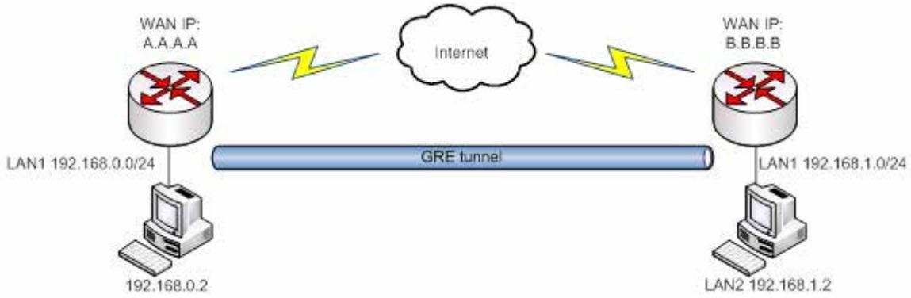

In the example network diagram two distant networks LAN1 and LAN2 are connected.

To create GRE tunnel the user must know the following parameters:

- 1. Source and destination IP addresses.
- 2. Tunnel local IP address
- 3. Distant network IP address and Subnet mask

| OpenVPN IPsec GRE Tunnel | L2TP PPTP |
|--------------------------------|--------------|
| GRE Tunnel                     |              |
| GRE Tunnel Configuration       |              |
| Enable V                       |              |
| TTL                            | 255          |
| PMTUD P                        |              |
| Remote network IP              | 192.168.2.0  |
| Remote network CIDR            | 24           |
| Local tunnel IP                | 10.0.0.1     |
| Local tunnel CIDR              | 30           |
| Remote endpoint IP address     | 84.148.7.87  |
| MTU                            | 1500         |

|    | Field name                       | Explanation                                                                                                                                                      |  |  |
|----|----------------------------------|------------------------------------------------------------------------------------------------------------------------------------------------------------------|--|--|
| 1. | Enable GRE Tunnel                | Check the box to enable the GRE Tunnel function.                                                                                                                 |  |  |
| 2. | TTL                              | Specify the fixed time-to-live (TTL) value on tunneled packets [0-255]. The 0 is a special value meaning that packets inherit the TTL value.                  |  |  |
| 3. | PMTUD                            | Check the box to enable the Path Maximum Transmission Unit Discovery (PMTUD) status on this tunnel.                                                           |  |  |
| 4. | Remote tunnel network address | Specify remote LAN Subnet address.                                                                                                                               |  |  |
| 5. | Remote CIDR                      | Specify remote LAN Subnet CIDR value.                                                                                                                            |  |  |
| 6. | Local tunnel IP                  | IP address of the local virtual tunnel interface. This IP must be in the same network on both GRE ends, i.e. 10.0.0.1 on one end and 10.0.0.2 on another end. |  |  |
| 7. | Local tunnel CIRD                | Virtual tunnel CIDR                                                                                                                                              |  |  |
| 8. | Remote IP address                | Specify remote WAN IP address.                                                                                                                                   |  |  |
| 9. | MTU                              | Specify the maximum transmission unit (MTU) of a communications protocol of a layer in bytes.                                                                 |  |  |

### **7.5.4 PPTP**

### **7.5.5 L2TP**

Allows setting up a L2TP server or client and should it be needed - using it with IPsec (L2TP/IPSec). Below is L2TP server configuration example.

| OpenVPN       | IPsec | GRE Tunnel                         | PPTP     | L2TP            |    |        |
|---------------|-------|------------------------------------|----------|-----------------|----|--------|
|               |       | L2TP Server Instance: L2tpd_server |          |                 |    |        |
| Main Settings |       |                                    |          |                 |    |        |
|               |       |                                    | Enable V |                 |    |        |
| Local ip      |       |                                    |          | 192.168.0.1     |    |        |
|               |       | Remote ip                          |          | 192.168.0.20-30 |    |        |
| Username      |       |                                    |          | Password        |    |        |
| user          |       |                                    |          | pass            | જુ | Delete |
| Add           |       |                                    |          |                 |    |        |

|    | Field name         | Explanation                                      |
|----|--------------------|--------------------------------------------------|
| 1. | Enable L2TP Tunnel | Check the box to enable the GRE Tunnel function. |
| 2. | Local IP           | IP Address of this device (RUT)                  |
| 3. | Remote IP          | IP address of either one or many L2TP clients.   |
| 4. | Username           | Username to connect to L2TP (this) server        |
| 5. | Password           | Password to connect to L2TP server               |

Client configuration is even simplier, which requires only **Servers IP**, **Username** and **Password**.

#### **7.5.6 Dynamic DNS**

Dynamic DNS (DDNS) is a domain name service allowing to link dynamic IP addresses to static hostname. To start using this feature firstly you should register to DDNS service provider (example list is given in description). You are provided with add/delete buttons to manage and use different DDNS configurations at the same time!

You can configure many different DDNS Hostnames in the main DDNS Configuration section.

| DDNS                    |                             |        |         |      |        |      |
|-------------------------|-----------------------------|--------|---------|------|--------|------|
| DDNS Configuration      |                             |        |         |      |        |      |
| DDNS Name               | Hostname                    | Status | Enabled |      |        |      |
| Myddns                  | mypersonaldomain.dyndns.org | NA     | No      | Edit | Delete |      |
| Noip                    | rut9xx.no-ip.org            | n/a    | No      | Edit | Delete |      |
| New configuration name: |                             |        |         |      |        |      |
|                         |                             |        |         |      |        | Save |

To edit your selected configuration, hit **Edit**.

| DDNS                    |                          |    |
|-------------------------|--------------------------|----|
| Enable                  |                          |    |
| Status N/A              |                          |    |
| Service                 | no-ip.com V           |    |
| Hostname                | rut9xx.no-ip.org         |    |
| Username                | myusername               |    |
| Password                | mypassword               | 65 |
| IP source               | Public V              |    |
| URL                     | http://checkmyip.dyndns. |    |
| IP renew interval (min) | 10                       |    |
| Force IP renew (min)    | 472                      |    |

|    | Field name        | Value                                                                            | Explanation                                                                                                                                                                                                                                                                                                                                                                                                                        |
|----|-------------------|----------------------------------------------------------------------------------|------------------------------------------------------------------------------------------------------------------------------------------------------------------------------------------------------------------------------------------------------------------------------------------------------------------------------------------------------------------------------------------------------------------------------------|
| 1. | Enable            | -                                                                                | Enables current DDNS configuration.                                                                                                                                                                                                                                                                                                                                                                                                |
| 2. | Status            | -                                                                                | Timestamp of the last IP check or update.                                                                                                                                                                                                                                                                                                                                                                                          |
| 3. | Service           | 1. dydns.org 2. 3322.org 3. no-ip.com 4. easydns.com 5. zoneedit.com | Your dynamic DNS service provider selected from the list. In case your DDNS provider is not present from the ones provided, please feel free to use "custom" and add hostname of the update URL.                                                                                                                                                                                                                             |
| 4. | Hostname          | RUT9xx.noip.org                                                                  | Domain name which will be linked with dynamic IP address.                                                                                                                                                                                                                                                                                                                                                                          |
| 5. | Username          | myusername                                                                       | Name of the user account.                                                                                                                                                                                                                                                                                                                                                                                                          |
| 6. | Password          | mypassword                                                                       | Password of the user account.                                                                                                                                                                                                                                                                                                                                                                                                      |
| 7. | IP Source         | Public Private Custom                                                      | This option allows you to select specific RUT interface, and then send the IP address of that interface to DDNS server. So if, for example, your RUT has Private IP (i.e. 10.140.56.57) on its WAN (3G/LTE interface), then you can send this exact IP to DDNS server by selecting "Private", or by selecting "Custom" and "WAN" interface. The DDNS server will then resolve hostname queries to this specific IP. |
| 8. | IP renew interval | 10 (minutes)                                                                     | Time interval (in minutes) to check if the IP address of the device have changed.                                                                                                                                                                                                                                                                                                                                               |
| 9. | Force IP renew    | 472 (minutes)                                                                    | Time interval (in minutes) to force IP address renew.                                                                                                                                                                                                                                                                                                                                                                              |

### **7.6 SMS Utilities**

RUT950 has extensive amount of various SMS Utilities. These are subdivided into 4 sections: general SMS Utilities, Send SMS, SMS Management and Remote Configuration.

### **7.6.1 SMS Utilities**

| SMS Utilities               | Call Utilities | User Groups | SMS Management | Remote configuration |                                                                                                                                                                               |      | SMS Post/Get Configuration |
|-----------------------------|----------------|-------------|----------------|----------------------|-------------------------------------------------------------------------------------------------------------------------------------------------------------------------------|------|----------------------------|
| SMS Utilities               |                |             |                |                      |                                                                                                                                                                               |      |                            |
| SMS Rules                   |                |             |                |                      |                                                                                                                                                                               |      |                            |
| Action                      |                | SMS Text    |                | Enable               | Sort                                                                                                                                                                          |      |                            |
| Reboot                      |                | reboot      |                | >                    | ﻟﻠﻘﺎﻧﻮﻥ ﺍﻟﻤﺴﺘﻘﻠﺔ ﺍﻟﻤﺘﺤﺪﺓ ﺍﻟﻤﺘﺤﺪﺓ ﺍﻟﻤﺘﺤﺪﺓ ﺍﻟﻤﺘﺤﺪﺓ ﺍﻟﻤﺘﺤﺪﺓ ﺍﻟﻤﺘﺤﺪﺓ ﺍﻟﻤﺘﺤﺪﺓ ﺍﻟﻤﺘﺤﺪﺓ ﺍﻟﻤﺘﺤﺪﺓ ﺍﻟﻤﺘﺤﺪﺓ ﺍﻟﻤﺘﺤﺪﺓ ﺍﻟﻤﺘﺤﺪﺓ ﺍﻟﻤﺘﺤﺪﺓ ﺍﻟﻤﺘﺤﺪﺓ ﺍﻟﻤﺘﺤﺪﺓ ﺍﻟﻤﺘﺤﺪﺓ ﺍﻟﻤﺘﺤﺪﺓ ﺍﻟﻤﺘﺤﺪﺓ ﺍﻟﻤﺘﺤﺪﺓ ﺍﻟﻤﺘ | Edit | Delete                     |
| Get status                  |                | status      |                | €                    | ન ન                                                                                                                                                                           | Edit | Delete                     |
| Switch WiFi on              |                | wifion      |                | >                    | ﻬﺎ ﻓ                                                                                                                                                                          | Edit | Delete                     |
| Switch WiFi off             |                | wifioff     |                | >                    |                                                                                                                                                                               | Edit | Delete                     |
| Switch mobile data on       |                | mobileon    |                | >                    | ﺎﺕ ﺍﻟﻤﺘﺤﺪﺓ ﺍﻟﻤﺘﺤﺪﺓ ﺍﻟﻤﺘﺤﺪﺓ ﺍﻟﻤﺘﺤﺪﺓ ﺍﻟﻤﺘﺤﺪﺓ ﺍﻟﻤﺘﺤﺪﺓ ﺍﻟﻤﺘﺤﺪﺓ ﺍﻟﻤﺘﺤﺪﺓ ﺍﻟﻤﺘﺤﺪﺓ ﺍﻟﻤﺘﺤﺪﺓ ﺍﻟﻤﺘﺤﺪﺓ ﺍﻟﻤﺘﺤﺪﺓ ﺍﻟﻤﺘﺤﺪﺓ ﺍﻟﻤﺘﺤﺪﺓ ﺍﻟﻤﺘﺤﺪﺓ ﺍﻟﻤﺘﺤﺪﺓ ﺍﻟﻤﺘﺤﺪﺓ ﺍﻟﻤﺘﺤﺪﺓ ﺍﻟﻤﺘﺤﺪﺓ ﺍﻟﻤﺘﺤﺪﺓ ﺍﻟﻤﺘﺤﺪﺓ ﺍﻟ | Edit | Delete                     |
| Switch mobile data off      |                | mobileoff   |                | >                    |                                                                                                                                                                               | Edit | Delete                     |
| Change mobile data settings |                | cellular    |                | >                    | ﻪ ﺍﻟ                                                                                                                                                                          | Edit | Delete                     |
| Get list of profiles        |                | profdisp    |                | >                    | ﻪ ﺍﻟ                                                                                                                                                                          | Edit | Delete                     |

You can choose your SMS Keyword (text to be sent) and authorized phone number in the main menu. You can edit each created rule by hitting **Edit** button. All configuration options are listed below:

|     | Field name                 | Explanation                                                                            | Notes                                                                                                                                                                  |  |  |  |  |
|-----|----------------------------|----------------------------------------------------------------------------------------|------------------------------------------------------------------------------------------------------------------------------------------------------------------------|--|--|--|--|
| 1.  | Enable SMS Reboot          | This check box will enable and disable SMS reboot function.                         | If you select Get Status, it will send routers status once it has rebooted and is operational again. For Get Status description see item No. 4 of this table. |  |  |  |  |
| 2.  | SMS text                   | SMS text which will reboot router.                                                  | SMS text can contain letters, numbers, spaces and special symbols. Capital letters also matters.                                                                    |  |  |  |  |
| 3.  | Sender phone number        | Phone number of person who can reboot router via SMS message                     | You can add as many phone numbers as you need. Dropdown list with additional rows will show up if you click on "add" icon at the end of phone number row.        |  |  |  |  |
| 4.  | Get status                 | Check this to receive connection status via SMS after a reboot.                  | This is both separate SMS Rule and an option under SMS Reboot rule.                                                                                                 |  |  |  |  |
| 5.  | Enable SMS Status          | This check box will enable and disable SMS status function.                         | SMS status is disabled by default.                                                                                                                                     |  |  |  |  |
| 6.  | SMS text                   | SMS text which will send routers status.                                            | SMS text can contain letters, numbers, spaces and special symbols. Capital letters also matters.                                                                    |  |  |  |  |
| 7.  | Sender phone number        | Phone number of person who can receive router status via SMS message             | You can add as many phone numbers as you need. Dropdown list with additional rows will show up if you click on "add" icon at the end of phone number row.        |  |  |  |  |
| 8.  | Get Information            | Data state Operator Connection type Signal Strength Connection State IP | You can select which status elements to display.                                                                                                                       |  |  |  |  |
| 9.  | Wireless On/Off via SMS | This check box will enable and disable this function                                | Allows Wi-Fi control via SMS                                                                                                                                           |  |  |  |  |
| 10. | Wireless on SMS text       | SMS text which will turn Wi-Fi ON                                                   | SMS text can contain letters, numbers, spaces and special symbols. Capital letters also matters.                                                                    |  |  |  |  |
| 11. | Wireless on SMS text       | SMS text which will turn Wi-Fi OFF                                                  | SMS text can contain letters, numbers, spaces and special symbols. Capital letters also matters.                                                                    |  |  |  |  |
| 12. | Sender Phone number        | Phone number of person who can receive router status via SMS message             | You can add as many phone numbers as you need. Dropdown list with additional rows will show up if you click on "add" icon at the end of phone number row.        |  |  |  |  |
| 13. | Write to config            | Permanently saves Wi-Fi state                                                          | With this setting enabled, router will keep Wi-Fi state even after reboot. If it is not selected, router will revert Wi-Fi state after reboot.                |  |  |  |  |
| 14. | Mobile Settings via SMS | This check box will enable and disable mobile settings function                     | Allows cellular control via SMS                                                                                                                                        |  |  |  |  |
| 15. | SMS text                   | Key word that will precede actual configuration parameters                       | SMS text can contain letters, numbers, spaces and special symbols. Capital letters also matters.                                                                    |  |  |  |  |
| 16. | Sender phone number        | Phone number of person who can receive router status via SMS message             | You can add as many phone numbers as you need. Dropdown list with additional rows will show up if you click on "add" icon at the end of phone number row.        |  |  |  |  |

### **Mobile Settings via SMS parameters:**

|    | Parameter   | Value(s)                                               | Explanation                                                                                                                                                     |
|----|-------------|--------------------------------------------------------|-----------------------------------------------------------------------------------------------------------------------------------------------------------------|
| 1. | apn=        | i.e. internet.gprs                                     | Sets APN. i.e: apn=internet.gprs                                                                                                                                |
| 2. | dialnumber= | i.e. *99***1#                                          | Sets dial number                                                                                                                                                |
| 3. | auth_mode=  | none pap chap                                    | Sets authentication mode                                                                                                                                        |
| 4. | service=    | auto 3gpreferred 3gonly 2gpreferred 2gonly | You can add as many phone numbers as you need. Dropdown list with additional rows will show up if you click on "add" icon at the end of phone number row. |
| 5. | username=   | user                                                   | Used only if PAP or CHAP authorization is selected                                                                                                              |
| 6. | password=   | user                                                   | Used only if PAP or CHAP authorization is selected                                                                                                              |

All Mobile settings can be changed in one SMS. Between each <parameter=value> pair a space symbol is necessary.

*Example: cellular apn=internet.gprs dialnumber=**99***1# *auth_mode=pap service=3gonly username=user password=user*

|    | Field name Explanation           |                                                                                              | Notes                                                                                                                                                           |  |
|----|-------------------------------------|----------------------------------------------------------------------------------------------|-----------------------------------------------------------------------------------------------------------------------------------------------------------------|--|
| 1. | 3G On/Off via SMS                   | This check box will enable and disable this function                                      | Function disabled by default                                                                                                                                    |  |
| 2. | 3G on SMS text                      | Text to turn 3G connection ON                                                                | SMS text can contain letters, numbers, spaces and special symbols. Capital letters also matters.                                                             |  |
| 3. | 3G off SMS text                     | Text to turn 3G connection OFF                                                               |                                                                                                                                                                 |  |
| 4. | Write to config                     | Permanently saves 3G network state                                                        | With this setting enabled, router will keep 3G state even after reboot. If it is not selected, router will revert 3G state after reboot.               |  |
| 5. | Change profile via SMS           | This check box will enable and disable this function                                      | Function disabled by default                                                                                                                                    |  |
| 6. | SMS text to change profile       | Keyword that must precede profile name                                                    | SMS text can contain letters, numbers, spaces and special symbols. Capital letters also matters.                                                             |  |
| 7. | SMS text to get list of profiles | Upon receiving this SMS router will send list of created profiles to the sender number |                                                                                                                                                                 |  |
| 8. | Sender Phone number                 | Phone number of person who can control this function                                      | You can add as many phone numbers as you need. Dropdown list with additional rows will show up if you click on "add" icon at the end of phone number row. |  |

Important Notes:

- 3G settings must be configured correctly. If SIM card has PIN number you must enter it at "Network" > "3G" settings. Otherwise SMS reboot function will not work.
- Sender phone number must contain country code. You can check sender phone number format by reading the details of old SMS text massages you receiving usually.

### **7.6.2 Call Utilities**

Allows users to Call the router in order to perform one of the actions: Reboot, Get Status, turn WiFi ON/OFF, turn Mobile data ON/OFF.

Only thing that is needed is to call routers SIM card number from allowed phone (user) and RUT950 will perform all actions that are assigned for this particular number.

#### **7.6.3 User Groups**

Gives possibility to group phone numbers for SMS management purposes. You can then later use these groups in all related SMS functionalities. This option helps if there are several Users who should have same roles when managing router via SMS.

#### **7.6.4 SMS Management**

You can send SMS from RUT WebUI. Under SMS Management you can read and delete received/stored SMS.

|    | Field name   | Explanation                               | Notes                                             |
|----|--------------|-------------------------------------------|---------------------------------------------------|
| 1. | Phone number | Recipients phone number to send SMS to | Should be preceded with country code, i.e. "+370" |
| 2. | Message      | SMS message text                          | All special characters are allowed.               |

With **storage** option you can choose for router NOT to delete SMS from SIM card. If this option is not used, router will automatically delete all incoming messages after they have been read. Message status "read/unread" is examined every 60 seconds. All "read" messages are deleted.

### **7.6.5 Remote Configuration**

RUT9xx can be configured via SMS from another RUT9xx. You only have to select which configuration details are to be sent, generate the SMS Text, type in the phone number and Serial number of the router that you wish to configure and Send the SMS.

**Total count of SMS is managed automatically. You should be aware of possible number of SMS and use this feature at your own responsibility. It should not, generally, be used if you have high cost per SMS. This is especially relevant if you will try to send whole OpenVPN configuration, which might acumulate ~40 SMS.** 

#### **7.6.5.1 Receive configuration**

This section controls how should configuation initiation party should identify itself. In this scenario RUT950 itself is being configured.

| SMS Utilities         | Call Utilities | User Groups          | SMS Management        | Remote configuration | SMS Post/Get Configuration |
|-----------------------|----------------|----------------------|-----------------------|----------------------|----------------------------|
| Receive               | Send           |                      |                       |                      |                            |
| Receive Configuration |                |                      |                       |                      |                            |
|                       |                | Enable 7             |                       |                      |                            |
|                       |                | Authorization method | No authorization V |                      |                            |
|                       |                | Allowed users        | From all numbers > |                      |                            |

|    | Field name           | Values                                                      | Notes                                           |
|----|----------------------|-------------------------------------------------------------|-------------------------------------------------|
| 1. | Authorization method | No authorization By serial By administration password | Method on Receiving and Sending ends must match |
| 2. | Allowed users        | From all numbers From group From single number        | Gives greater control and security measures     |

#### **Note, that for safety reasons Authorization method should be configured before deployment of the router.**

#### **7.6.5.2 Send configuration**

This section lets you configure remote RUT950 devices. The authorization settings must confirm to those that are set on the receiving party.

### **7.7 Hotspot**

Wireless hotspot provides essential functionality for managing an open access wireless network. In addition to standard RADIUS server authentication there is also the ability to gather and upload detailed logs on what each device (denoted as a MAC address) was doing on the network (what sites were traversed, etc.).

### **7.7.1 General settings**

| General                        | Logging          | Landing Page        |                  |  |
|--------------------------------|------------------|---------------------|------------------|--|
| Wireless Hotspot Configuration |                  |                     |                  |  |
|                                | General Settings |                     |                  |  |
|                                |                  | Enable [            |                  |  |
|                                |                  | AP IP               | 192.168.2.254/24 |  |
|                                |                  | Authentication mode | External radius  |  |
|                                |                  | Radius server #1    |                  |  |
|                                |                  | Radius server #2    |                  |  |
|                                |                  | Authentication port | 1812             |  |
|                                |                  | Accounting port     | 1813             |  |
|                                |                  | Hotspot name        | Teltonika        |  |
|                                |                  | Secret key          | 25               |  |
|                                |                  | Protocol            | HTTP             |  |

|    | Field name             | Explanation                                                                                                                                                                                                                                                                                                                                                                                                                                                                                                                                                                                      |
|----|------------------------|--------------------------------------------------------------------------------------------------------------------------------------------------------------------------------------------------------------------------------------------------------------------------------------------------------------------------------------------------------------------------------------------------------------------------------------------------------------------------------------------------------------------------------------------------------------------------------------------------|
| 1. | Enabled                | Check this flag to enable hotspot functionality on the router.                                                                                                                                                                                                                                                                                                                                                                                                                                                                                                                                   |
| 2. | AP IP                  | Access Point IP address. This will be the address of the router on the hotspot network. The router will automatically create a network according to its own IP and the CIDR number that you specify after the slash. E.g. "192.168.2.254/24" means that the router will create a network with the IP address 192.168.182.0, netmask 255.255.255.0 for the express purpose of containing all the wireless clients. Such a network will be able to have 253 clients (their IP addresses will be automatically granted to them and will range from 192.168.2.1 to 192.168.2.253). |
| 3. | Authentication mode | External radius                                                                                                                                                                                                                                                                                                                                                                                                                                                                                                                                                                                  |
| 4. | Radius server #1       | The IP address of the RADIUS server that is to be used for Authenticating your wireless clients.                                                                                                                                                                                                                                                                                                                                                                                                                                                                                              |
| 5. | Radius server #2       | The IP address of the second RADIUS server.                                                                                                                                                                                                                                                                                                                                                                                                                                                                                                                                                      |
| 6. | Authentication port    | RADIUS server authentication port.                                                                                                                                                                                                                                                                                                                                                                                                                                                                                                                                                               |
| 7. | Accounting port        | RADIUS server accounting port.                                                                                                                                                                                                                                                                                                                                                                                                                                                                                                                                                                   |
| 8. | Authentication mode | Internal radius                                                                                                                                                                                                                                                                                                                                                                                                                                                                                                                                                                                  |
| 9. | IP address or          | E.g.(192.168.1.1 or 192.168.1.0/24)                                                                                                                                                                                                                                                                                                                                                                                                                                                                                                                                                              |

|     | network of the client |                                                                                                        |
|-----|--------------------------|--------------------------------------------------------------------------------------------------------|
| 10. | Authentication mode   | Without radius                                                                                         |
| 11. |                          | Doesn't require any RADIUS configuration. Allows simple user connection based on username/password. |
| 12. | Hotspot name             | The name of your hotspot. Will appear on the login screen.                                             |
| 13. | Secret Key               | The secret key used for authenticating with the RADIUS server.                                         |
| 14. | Protocol                 | Either HTTP or HTTPs                                                                                   |

### **7.7.2 Logging**

| General | Logging                 | Landing Page                      |                 |  |
|---------|-------------------------|-----------------------------------|-----------------|--|
|         |                         | Wireless Hotspot Logging Settings |                 |  |
|         | Logging To FTP Settings |                                   |                 |  |
|         |                         | Enable logging and upload Г       |                 |  |
|         |                         | Server address                    | your.ftp.server |  |
|         |                         | Username                          | username        |  |
|         |                         | Password                          |                 |  |
|         |                         | Port                              | 21              |  |

|    | Field name                   | Explanation                                                                                                                                                                                                        |
|----|------------------------------|--------------------------------------------------------------------------------------------------------------------------------------------------------------------------------------------------------------------|
| 1. | Enable logging and upload | Check this box if you want to enable wireless traffic logging. This feature will produce logs which contain data on what websites each client was visiting during the time he was connected to your hotspot. |
| 2. | Server address               | The IP address of the FTP server to which you want the logs uploaded.                                                                                                                                              |
| 3. | Username                     | The username of the user on the aforementioned FTP server.                                                                                                                                                         |
| 4. | Password                     | The password of the user.                                                                                                                                                                                          |
| 5. | Port                         | The TCP/IP Port of the FTP server.                                                                                                                                                                                 |

| FTP Upload Settings                                                             |           |
|---------------------------------------------------------------------------------|-----------|
| You can configure your timing settings for the log upload via FTP feature here. |           |
| Mode                                                                            | Fixed     |
| Hours                                                                           | 8         |
| Minutes                                                                         | 15        |
| Days D                                                                          | Monday    |
|                                                                                 | Tuesday   |
|                                                                                 | Wednesday |
|                                                                                 | Thursday  |
|                                                                                 | Friday    |
|                                                                                 | Saturday  |
|                                                                                 | Sunday    |

|    | Field name     | Explanation                                                                                                                                                                                                                                 |
|----|----------------|---------------------------------------------------------------------------------------------------------------------------------------------------------------------------------------------------------------------------------------------|
| 1. | Mode           | The mode of the schedule. Use "Fixed" if you want the uploading to be done on a specific time of the day. Use "Interval" If you want the uploading to be done at fixed interval.                                                         |
| 2. | Weekdays       | This field specifies on what weekdays the uploading should be done. The entry format is numbers from 1 to 7 separated by only commas. E.g. If you want to upload the logs on Monday, Wednesday and Saturday you should enter "1,3,6". |
| 3. | Interval       | Shows up only when "Mode" is set to Interval. Specifies the interval of regular uploads on one specific day. E.g. If you choose 4 hours, the uploading will be done on midnight, 4:00, 8:00, 12:00, 16:00 and 20:00.                  |
| 4. | Hours, Minutes | Shows up only when "Mode" is set to Fixed. Uploading will be done on that specific time of the day. E.g. If you want to upload your logs on 6:48 you will have to simply enter hours: 6 and minutes: 48.                              |

### **7.7.3 Landing Page**

| General | Logging               | Landing Page                      |        |                   |
|---------|-----------------------|-----------------------------------|--------|-------------------|
|         |                       | Wireless Hotspot Landing Settings |        |                   |
|         | Landing Page Settings |                                   |        |                   |
|         |                       |                                   |        |                   |
|         |                       | Page title                        |        |                   |
|         |                       | Logo image                        | Browse | No file selected. |
|         |                       | Link title                        |        |                   |
|         |                       | Link address                      |        |                   |

|    | Field name   | Explanation                                          |
|----|--------------|------------------------------------------------------|
| 1. | Page title   | Will be seen as landing page title                   |
| 2. | Logo image   | Logo seen on landing page.                           |
| 3. | Link title   | You can add an additional link, example yoursite.com |
| 4. | Link address | Example http://www.yoursite.co                       |

### **7.8 Auto Reboot**

#### **7.8.1 Ping Reboot**

Ping Reboot function will periodically send Ping command to server and waits for echo receive. If no echo is received router will try again sending Ping command defined number times, after defined time interval. If no echo is received after the defined number of unsuccessful retries, router will reboot. It is possible to turn of the router rebooting after defined unsuccessful retries. Therefore this feature can be used as "Keep Alive" function, when router Pings the host unlimited number of times.

| Ping Reboot       | Periodic Reboot                         |           |
|-------------------|-----------------------------------------|-----------|
| Ping Reboot       |                                         |           |
| Ping Reboot Setup |                                         |           |
|                   | Enable [                                |           |
|                   | Reboot router if no echo is received  ▽ |           |
|                   | Interval between pings                  | 5 mins    |
|                   | Ping timeout (sec)                      | 1         |
|                   | Packet size                             | 56        |
|                   | Retry count                             | 5         |
|                   | Host to ping                            | 127.0.0.1 |

|    | Field name                           | Explanation                                                                                            | Notes                                                                                                       |
|----|--------------------------------------|--------------------------------------------------------------------------------------------------------|-------------------------------------------------------------------------------------------------------------|
| 1. | Enable                               | This check box will enable or disable Ping reboot feature.                                          | Ping Reboot is disabled by default.                                                                      |
| 2. | Reboot router if no echo received | This check box will disable router rebooting after the defined number of unsuccessful retries.      | This check box must be unselected if you want to use Ping Reboot feature as "Keep Alive" function. |
| 3. | Interval between Pings               | Time interval in minutes between two Pings.                                                            | Minimum time interval is 5 minutes.                                                                      |
| 4. | Ping timeout (sec)                   | Time after which consider that Ping has failed.                                                        | Range(1-9999)                                                                                               |
| 5. | ICMP packet size                     | This box allows to modify sent packet size                                                             | Should be left default, unless necessary otherwise                                                       |
| 6. | Retry count                          | Number of times to try sending Ping to server after time interval if echo receive was unsuccessful. | Minimum retry number is 1. Second retry will be done after defined time interval.                     |
| 7. | Host to Ping                         | Server IP address or host name, which will receive Ping from router                                 | If you use server host name instead of the IP address you must configure DNS server first.            |

#### **7.8.2 Periodic Reboot**

| Ping Reboot           | Periodic Reboot |           |                                                          |
|-----------------------|-----------------|-----------|----------------------------------------------------------|
| Periodic Reboot       |                 |           |                                                          |
| Periodic Reboot Setup |                 |           |                                                          |
|                       |                 | Enable [] |                                                          |
|                       |                 |           | Days Monday □ Tuesday O Wednesday O Thursday |
|                       |                 | Hours     | Saturday 23                                           |
|                       |                 | Minutes   | 0                                                        |

|    | Field name     | Explanation                                                      |
|----|----------------|------------------------------------------------------------------|
| 1. | Enable         | This check box will enable or disable Periodic reboot feature.   |
| 2. | Days           | This check box will enable router rebooting at the defined days. |
| 3. | Hours, Minutes | Uploading will be done on that specific time of the day          |

# **8 System**

### **8.1 Configuration Wizard**

The configuration wizard provides a simple way of quickly configuring the device in order to bring it up to basic functionality. The wizard is comprised out of 4 steps and they are as follows:

### Step 1 (Password change)

First, the wizard prompts you to change the default password. Simply enter the same password into both Password and Confirmation fields and press **Next**.

| Step 1 - Password                                              | Step 2 - Mobile      | Step 3 - LAN | Step 4 - WiFi |      |
|----------------------------------------------------------------|----------------------|--------------|---------------|------|
| Step - Password                                                |                      |              |               |      |
| First, let's change your router password from the default one. |                      |              |               |      |
|                                                                | New password         |              | 65            |      |
|                                                                | Confirm new password |              | 65            |      |
| Skip Wizard                                                    |                      |              |               | Save |

#### Step 2 (Mobile Configuration)

Next we have to enter your mobile configuration. On a detailed instruction on how this should be done see the Mobile section under Network

| Step 1 - Password                                                                      | Step 2 - Mobile       | Step 3 - LAN | Step 4 - WiFi |
|----------------------------------------------------------------------------------------|-----------------------|--------------|---------------|
| Mobile Configuration                                                                   |                       |              |               |
| Next, let's configure your mobile settings so you can start using internet right away. |                       |              |               |
| Mobile Configuration (SIM1)                                                            |                       |              |               |
|                                                                                        | APN                   |              |               |
|                                                                                        | PIN number            |              |               |
|                                                                                        | Dialing number        | *99#         |               |
|                                                                                        | Authentication method | None V    |               |
|                                                                                        | Service mode          | automatic    | V             |
| Skip Wizard                                                                            |                       |              | Save          |

Step 3 (LAN)

Next, you are given the chance to configure your LAN and DHCP server options. For a detailed explanation see LAN under Network.

| Step 1 - Password     | Step 2 - Mobile | Step 3 - LAN  | Step 4 - WiFi                                                                                                                |
|-----------------------|-----------------|---------------|------------------------------------------------------------------------------------------------------------------------------|
| Step - LAN            |                 |               |                                                                                                                              |
|                       |                 |               | Here we will setup the basic settings of a typical will cover 2 basic configurations: static IP address LAN and DHCP client. |
| General Configuration |                 |               |                                                                                                                              |
|                       | IP address      | 192.168.1.1   |                                                                                                                              |
|                       | Netmask         | 255.255.255.0 |                                                                                                                              |
|                       | Enable DHCP >   |               |                                                                                                                              |
|                       | Start           | 100           |                                                                                                                              |
|                       | Limit           | 150           |                                                                                                                              |
|                       | Lease time      | 12h           |                                                                                                                              |
| Skip Wizard           |                 |               | Save                                                                                                                         |

#### Step 4 (Wi-Fi)

The final step allows you to configure your wireless settings in order to set up a rudimentary Access Point.

| Step 1 - Password                                                                                                                                                                            | Step 2 - Mobile   | Step 3 - LAN     | Step 4 - WiFi |   |  |      |
|----------------------------------------------------------------------------------------------------------------------------------------------------------------------------------------------|-------------------|------------------|---------------|---|--|------|
| Step - Wireless                                                                                                                                                                              |                   |                  |               |   |  |      |
| Now let's configure your wireless radio. (Note: if you are currently via wireless and you change parametion will be dropped and you will have to reconnect with a new set of parameters.) |                   |                  |               |   |  |      |
| WiFi Configuration                                                                                                                                                                           |                   |                  |               |   |  |      |
|                                                                                                                                                                                              | Enable wireless V |                  |               |   |  |      |
|                                                                                                                                                                                              | SSID              | Teltonika Router |               |   |  |      |
|                                                                                                                                                                                              | Mode              | 802.11g+n ▼      |               |   |  |      |
|                                                                                                                                                                                              | Channel           | Auto             | >             |   |  |      |
|                                                                                                                                                                                              | Encryption        | No encryption    |               | v |  |      |
|                                                                                                                                                                                              | Country Code      | 00 - World       |               | V |  |      |
| Skip Wizard                                                                                                                                                                                  |                   |                  |               |   |  | Save |

When you're done with the configuration wizard, press **Finish**.

### **8.2 Configuration profiles**

Router can have virtually unlimited number or configuration profiles, which you can later apply either via WebUI or via SMS. When you add New Profile, you save **current** full configuration of the router. Note: profile names **cannot** exceed 10 symbols.

| Configuration Profiles |             |        |        |
|------------------------|-------------|--------|--------|
| Manage Profiles        |             |        |        |
| Profile name           | Add profile |        |        |
| Profile name           | Created     | Action |        |
| first                  | 2014-12-03  | Apply  | Delete |

### **8.3 Administration**

### **8.3.1 General**

| General                  | Troubleshoot                   | Backup               | Access Control | Diagnostics | MAC Clone |  |      |  |  |
|--------------------------|--------------------------------|----------------------|----------------|-------------|-----------|--|------|--|--|
|                          | Administration Settings        |                      |                |             |           |  |      |  |  |
|                          | Router Name And Host Name      |                      |                |             |           |  |      |  |  |
|                          |                                | Router name          | Teltonika      |             |           |  |      |  |  |
|                          |                                | Host name            | Teltonika      |             |           |  |      |  |  |
|                          | Administrator Password         |                      |                |             |           |  |      |  |  |
|                          |                                | New password         |                | gs          |           |  |      |  |  |
|                          |                                |                      |                |             |           |  |      |  |  |
|                          |                                | Confirm new password |                | \$5         |           |  |      |  |  |
| Language Settings        |                                |                      |                |             |           |  |      |  |  |
|                          |                                | Language             | English T   |             |           |  |      |  |  |
| Login Page               |                                |                      |                |             |           |  |      |  |  |
|                          | Show mobile info at login page |                      |                |             |           |  |      |  |  |
| Restore Default Settings |                                |                      |                |             |           |  |      |  |  |
|                          |                                | Restore to default   | Restore        |             |           |  |      |  |  |
|                          |                                |                      |                |             |           |  | Save |  |  |

|    | Field name                     | Explanation                                                                                         |
|----|--------------------------------|-----------------------------------------------------------------------------------------------------|
| 1. | Router name                    | Enter your new router name.                                                                         |
| 2. | Host name                      | Enter your new host name                                                                            |
| 3. | Password                       | Enter your new administration password. Changing this password will change SSH password as well. |
| 4. | Confirmation                   | Re-enter your new administration password.                                                          |
| 5. | Language                       | Website will be translated into selected language.                                                  |
| 6. | Show mobile info at login page | Show operator and signal strength at login page.                                                    |
| 7. | Restore to default             | Router will be set to factory default settings                                                      |
|    |                                |                                                                                                     |

Important notes:

The only way to gain access to the web management if you forget the administrator password is to reset the device factory default settings. Default administrator login settings are:

User Name: **admin** 

Password: **admin01** 

#### **8.3.2 Troubleshoot**

| General      | Troubleshoot                      | Backup                     | Access Control |   | Diagnostics | MAC Clone |  |
|--------------|-----------------------------------|----------------------------|----------------|---|-------------|-----------|--|
|              | Troubleshoot Settings             |                            |                |   |             |           |  |
| Troubleshoot |                                   |                            |                |   |             |           |  |
|              |                                   | System log level           | Debug          |   |             |           |  |
|              |                                   | Save log in                | RAM memory     | T |             |           |  |
|              |                                   | Include GSMD information V |                |   |             |           |  |
|              |                                   | Include PPPD information   |                |   |             |           |  |
|              | Include chat script information & |                            |                |   |             |           |  |
|              |                                   | System log                 | Show           |   |             |           |  |
|              |                                   | Kernel log                 | Show           |   |             |           |  |
|              |                                   | Troubleshoot file          | Download       |   |             |           |  |

|    | Field name               | Explanation                                                             |
|----|--------------------------|-------------------------------------------------------------------------|
| 1. | System log level         | Debug level should always be used, unless instructed otherwise.         |
| 2. | Save log in              | Default RAM memory should always be used unless instructed otherwise.   |
| 3. | Include GSMD information | Default setting – enabled should be used, unless instructed otherwise.  |
| 4. | Include PPPD information | Default setting – disabled should be used, unless instructed otherwise. |
| 5. | Include Chat script      | Default setting – enabled should be used, unless instructed otherwise.  |

|    | information  |                                                                                                                                                                            |
|----|--------------|----------------------------------------------------------------------------------------------------------------------------------------------------------------------------|
| 6. | System Log   | Provides on-screen System logging information. It does not, however, substitute troubleshooting file that can be downloaded from System -> Backup and Firmware menu. |
| 7. | Kernel Log   | Provides on-screen Kernel logging information. It does not, however, substitute troubleshooting file that can be downloaded from System -> Backup and Firmware menu. |
| 8. | Troubleshoot | Downloadable archive, that contains full router configuration and all System log files.                                                                                    |

#### **8.3.3 Backup**

| General | Troubleshoot          | Backup               | Access Control | Diagnostics                                | MAC Clone |  |
|---------|-----------------------|----------------------|----------------|--------------------------------------------|-----------|--|
| Backup  |                       |                      |                |                                            |           |  |
|         | Backup Configuration  |                      |                |                                            |           |  |
|         |                       | Backup archive:      | Download       |                                            |           |  |
|         | Restore Configuration |                      |                |                                            |           |  |
|         |                       | Restore from backup: |                | Pasirinkti failą Nepasirinktas joks failas |           |  |
|         |                       |                      | Upload archive |                                            |           |  |

|    | Field name          | Explanation                                                                            |
|----|---------------------|----------------------------------------------------------------------------------------|
| 1. | Backup archive      | Download current router settings file to personal computer. This file can be loaded |
|    |                     | to other RUT900 with same Firmware version in order to quickly configure it.           |
| 2. | Restore from backup | Upload and restore router settings file from personal computer.                        |

### **8.3.4 Access Control**

| General                   | Troubleshoot Backup       | Access Control | Diagnostics | MAC Clone |  |  |
|---------------------------|------------------------------|----------------|-------------|-----------|--|--|
| Access Control            |                              |                |             |           |  |  |
|                           | SSH Access Control           |                |             |           |  |  |
|                           | Enable SSH access &          |                |             |           |  |  |
|                           | Remote SSH access            |                |             |           |  |  |
|                           | Port                         | 22             |             |           |  |  |
| Web Access Control        |                              |                |             |           |  |  |
|                           | Enable HTTP access &         |                |             |           |  |  |
| Enable remote HTTP access |                              | 1000           |             |           |  |  |
|                           | Port                         | 80             |             |           |  |  |
|                           | Enable remote HTTPS access [ |                |             |           |  |  |
|                           | Port                         | 443            |             |           |  |  |

|    | Field name                    | Explanation                                                                                                 |
|----|-------------------------------|-------------------------------------------------------------------------------------------------------------|
| 1. | Enable SSH access             | Check box to enable SSH access functionality.                                                               |
| 2. | Remote SSH access             | If check box is selected – user can access the router via SSH from outside (WAN).                           |
| 3. | Port                          | Port to listen for SSH access.                                                                              |
| 4. | Enable HTTP access            | Check box to enable HTTP access functionality.                                                              |
| 5. | Enable remote SSH access   | If check box is selected users can access the router via the HTTP WEB Interface from the outside (WAN).  |
| 6. | Enable remote HTTPS access | If check box is selected users can access the router via the HTTPS WEB Interface from the outside (WAN). |

Note: The router has 2 users: "admin" for WebUI and "root" for SSH. When logging in via SSH use "root".

#### **8.3.5 Diagnostics**

| General           | Troubleshoot   | Backup     | Access Control | Diagnostics | MAC Clone |  |
|-------------------|----------------|------------|----------------|-------------|-----------|--|
| Diagnostics       |                |            |                |             |           |  |
| Network Utilities |                |            |                |             |           |  |
|                   | Host           |            |                |             |           |  |
|                   | Ping Action | Traceroute | Nslookup       |             |           |  |

|    | Field name | Explanation                                                                                                                                                                                                                                                           |
|----|------------|-----------------------------------------------------------------------------------------------------------------------------------------------------------------------------------------------------------------------------------------------------------------------|
| 1. | Host       | Enter server IP address or hostname.                                                                                                                                                                                                                                  |
| 2. | Ping       | Utility used to test the reachability of a host on an Internet IP network and to measure the round trip time for messages sent from the originating host to a destination server. Server echo response will be shown after few seconds if server is accessible. |
| 3. | Traceroute | Diagnostic tool for displaying the route (path) and measuring transit delays of packets across an Internet IP network. Log containing route information will be shown after few seconds.                                                                           |
| 4. | Nslookup   | Network administration command-line tool for querying the Domain Name System (DNS) to obtain domain name or IP address mapping or for any other specific DNS record. Log containing specified server DNS lookup information will be shown after few seconds.    |

#### **8.3.6 MAC Clone**

| General | Troubleshoot      | Backup | Access Control | Diagnostics        | MAC Clone |      |                    |
|---------|-------------------|--------|----------------|--------------------|-----------|------|--------------------|
|         | MAC Address Clone |        |                |                    |           |      |                    |
|         | MAC Address Clone |        |                |                    |           |      |                    |
|         |                   |        |                |                    |           |      |                    |
|         | WAN MAC address   |        |                | Get PC MAC address |           | Save | Restore to default |

|    | Field name           | Explanation                     |
|----|----------------------|---------------------------------|
| 1. | WAN MAC address      | Enter new WAN MAC address.      |
| 2. | Wireless MAC address | Enter new Wireless MAC address. |

### **8.4 User scripts**

Advanced users can insert their own commands to execute at the end of the boot process.

### **8.5 Safe mode**

Router contains two firmware images in its internal flash memory. One is master firmware which is the default firmware on is constantly used by the user. Another is safe mode firmware which plays the role of the backup to the master firmware.

Safe mode firmware has most function of master firmware but to reduce its size some function were removed. Removed functions are: Wireless Hotspot, VRRPD, SNMP, Web Filter

Safe mode firmware can be recognized from different logo and reduced menu in the WebUI. The sole purpose of safe mode firmware is to allow the user to update master firmware so all configuration options are removed. To make safe mode useful it is strongly recommended to back up configuration of master firmware when the user is satisfied with the setup. After configuration backup is created it can be tested by requesting safe mode.

| Safe Mode                                                  |        |
|------------------------------------------------------------|--------|
| Status                                                     |        |
| Safe mode FW version RUT9XX_SM_00.00.465                   |        |
| Safe mode config backup date Save mode config not set yet. |        |
| Safe Mode Configuration                                    |        |
| Write configuration to config partition                    | Write  |
| Delete configuration from config partition                 | Delete |
| Request safemode after reboot                              | Reboot |

### **8.6 Firmware**

| Firmware                     |                           |  |
|------------------------------|---------------------------|--|
| Current Firmware             |                           |  |
| Firmware version             | RUT9XX_T_00.00.611        |  |
| Firmware build date          | 2014-12-03, 15:03:34      |  |
| Kernel version               | 3.10.36                   |  |
| Firmware Upgrade             |                           |  |
| Keep all settings            |                           |  |
| Keep network settings        |                           |  |
| Keep cellular settings       |                           |  |
| Keep LAN settings            |                           |  |
| Keep dynamic DNS settings    | 0000                      |  |
| Keep wireless settings       |                           |  |
| Keep firewall settings       |                           |  |
| Keep OpenVPN settings        |                           |  |
| FW image Pasirinkti failą | Nepasirinktas joks failas |  |
| Upgrade                      |                           |  |

**Keep settings** – when check box is selected router will keep saved user configuration settings after firmware upgrade. When check box is not selected all router settings will be restored to factory defaults after firmware upgrade. When upgrading firmware, you can choose settings that you wish to keep after the upgrade. This function is useful when firmware is being upgraded via Internet (remotely) and you must not lose connection to the router afterwards. In such case: **cellular settings** should be kept.

**FW image** – router firmware upgrade file.

Warning: Do not ever remove router power supply and do not press reset button during upgrade process! This will totally damage your router and it won't be accessible. If you have any problems related to firmware upgrade you should always consult with local dealer.

### **8.7 Restore point**

Allows restoring firmware and configuration from restore point.

### **8.8 Reboot**

Reboot router by pressing button "Reboot".

# **9 Functionality not listed in menu**

### **9.1 SMS by HTTP POST/GET**

It is possible to read and send SMS by using valid HTTP POST/GET syntax. Use web browser or any other compatible software to submit HTTP POST/GET string to router. Router must be connected to GSM network when using "SMS send" feature.

### **9.1.1 Syntax of HTTP POST/GET string**

| HTTP POST/GET string | Explanation                                                 |                   |
|----------------------|-------------------------------------------------------------|-------------------|
| http://{IP_ADDRESS}  | /cgi-bin/sms_read?number={MESSAGE_INDEX}                    | Read message      |
|                      | /cgi-bin/sms_send?number={PHONE_NUMBER}&text={MESSAGE_TEXT} | Send message      |
|                      | /cgi-bin/sms_delete?number={MESSAGE_INDEX}                  | Delete message    |
|                      | /cgi-bin/sms_list?                                          | List all messages |
|                      | /cgi-bin/sms_ total?                                        | Number of         |
|                      |                                                             | messages in       |
|                      |                                                             | memory            |

Note: parameters of HTTP POST/GET string are in capital letters inside curly brackets. Curly brackets ("{ }") are not needed when submitting HTTP POST/GET string.

### **9.1.2 Parameters of HTTP POST/GET string**

|    | Parameter     | Explanation                                                                                                                                                                                                                                                           |  |
|----|---------------|-----------------------------------------------------------------------------------------------------------------------------------------------------------------------------------------------------------------------------------------------------------------------|--|
| 1. | IP_ADDRESS    | IP address of your router                                                                                                                                                                                                                                             |  |
| 2. | MESSAGE_INDEX | SMS index in memory                                                                                                                                                                                                                                                   |  |
| 3. | PHONE_NUMBER  | Phone number of the message receiver. Note: Phone number must contain country code. Phone number format is: 00{COUNTRY_CODE}{RECEIVER_NUMBER}. E.g.: 0037062312345 (370 is country code and 62312345 is receiver phone number) |  |
| 4. | MESSAGE_TEXT  | Text of SMS. Note: Maximum number of characters per SMS is 160. You cannot send longer messages. It is suggested to use alphanumeric characters only.                                                                                                              |  |

After every executed command router will respond with return status.

### **9.1.3 Possible responses after command execution**

|    | Response     | Explanation                                                              |
|----|--------------|--------------------------------------------------------------------------|
| 1. | OK           | Command executed successfully                                            |
| 2. | ERROR        | An error occurred while executing command                                |
| 3. | TIMEOUT      | No response from the module received                                     |
| 4. | WRONG_NUMBER | SMS receiver number format is incorrect or SMS index number is incorrect |
| 5. | NO MESSAGE   | There is no message in memory by given index                             |
| 6. | NO MESSAGES  | There are no stored messages in memory                                   |

### **9.1.4 HTTP POST/GET string examples**

http://192.168.1.1/cgi-bin/sms_read?number=3

http://192.168.1.1/cgi-bin/sms_send?number=0037061212345&text=test

http://192.168.1.1/cgi-bin/sms_delete?number=4

http://192.168.1.1/cgi-bin/sms_list

http://192.168.1.1/cgi-bin/sms_total

### **10 Device Recovery**

The following section describes available option for recovery of malfunctioning device. Usually device can become unreachable due to power failure during firmware upgrade or if core files were wrongly modified in the file system. Teltonika's router does offer several ways to recover from these situations

### **10.1 Reset button**

Reset button is located on the back panel of the device. Reset button has several functions:

**Reboot the device**. After the device has started if the reset button is pressed for up to 4 seconds the device will reboot. Start of the reboot will be indicated by flashing of all 5 signal strength LEDs together with green connection status LED.

**Reset to defaults**. After the device has started if the reset button is pressed for at least 5 seconds the device will reset all user changes to factory defaults and reboot. To help the user to determine how long should reset button be pressed signal strength LEDs count elapsed time. All 5 lit LEDs mean that 5 seconds have elapsed and reset button can be released. Start of the reset to defaults will be indicated by flashing of all 5 signal strength LEDs together with red connection status LED.

SIM PIN on the main SIM card (SIM1) is the only parameter that is kept after reset to defaults.

### **10.2 Safemode**

Router contains two firmware images in its internal flash memory. One is master firmware which is the default firmware on is constantly used by the user. Another is safemode firmware which plays the role of the backup to the master firmware.

Safemode firmware has most function of master firmware but to reduce its size some function were removed. Removed functions are:

- Wireless Hotspot
- VRRPD
- SNMP
- Web Filter

Safemode firmware can be recognized from different logo and reduced menu in the WebUI. The sole purpose of safemode firmware is to allow the user to update master firmware so all configuration options are removed. To make safemode useful it is strongly recommended to back up configuration of master firmware when the user is satisfied with the setup (described in *Safemode* section). After configuration backup is created it can be tested by requesting safemode.

### **10.3 Bootloader's WebUI**

Bootloader also provides a way to recover the router from damaged firmware. To make it easy for the user bootloader has its own webserver that can be accessed with any web browser.

Bootloader's webserver can be started:

**Automatically**. It happens when bootloader does not detect neither master nor safemode firmware. Flashing all 4 Ethernet LEDs indicate that bootloader's webserver has started.

**Manually**. Bootloader's webserver can be requested by holding reset button for 3 seconds while powering the device on. Flashing all 4 Ethernet LEDs indicate that bootloader's webserver has started.

Bootloader's WebUI can be accessed by typing this address in the web browser:

#### http://192.168.1.1/index.html

Note: it may be necessary to clear web browser's cache and to use incognito/anonymous window to access bootloader's WebUI

### **11 Glossary:**

WAN – Wide Area Network is a telecommunication network that covers a broad area (i.e., any network that links across metropolitan, regional, or national boundaries). Here we use the term WAN to mean the external network that the router uses to reach the internet.

LAN – A local area network (LAN) is a computer network that interconnects computers in a limited area such as a home, school, computer laboratory, or office building.

DHCP – The Dynamic Host Configuration Protocol (DHCP) is a network configuration protocol for hosts on Internet Protocol (IP) networks. Computers that are connected to IP networks must be configured before they can communicate with other hosts. The most essential information needed is an IP address, and a default route and routing prefix. DHCP eliminates the manual task by a network administrator. It also provides a central database of devices that are connected to the network and eliminates duplicate resource assignments.

ETHERNET CABLE – Refers to the CAT5 UTP cable with an RJ-45 connector.

AP – Access point. An access point is any device that provides wireless connectivity for wireless clients. In this case, when you enable Wi-Fi on your router, your router becomes an access point.

DNS – Domain Name Resolver. A server that translates names such as www.google.lt to their respective IPs. In order for your computer or router to communicate with some external server it needs to know it's IP, its name "www.something.com" just won't do. There are special servers set in place that perform this specific task of resolving names into IPs, called Domain Name servers. If you have no DNS specified you can still browse the web, provided that you know the IP of the website you are trying to reach.

ARP – Short for Adress Resolution Protocol, a network layer protocol used to convert an IP address into a physical address (called a *DLC address*), such as an Ethernet address.

PPPoE – Point-to-Point Protocol over Ethernet. PPPoE is a specification for connecting the users on an Ethernet to the internet through a common broadband medium, such as DSL line, wireless device or cable modem.

DSL – digital subscriber line - it is a family of technologies that provide internet access by transmitting digital data using a local telephone network which uses the public switched telephone network.

NAT – network address translation – an internet standard that enables a local-area network (LAN) to use one set of IP addresses for internet traffic and a second set of addresses for external traffic.

LCP – Link Control Protocol – a protocol that is part of the PPP (Point-to-Point Protocol). The LCP checks the identity of the linked device and either accepts or rejects the peer device, determines the acceptable packet size for transmission, searches for errors in configuration and can terminate the link if the parameters are not satisfied.

BOOTP – Bootstrap Protocol – an internet protocol that enables a diskless workstation to discover its own IP address, the IP address of a BOOTP server on the network, and a file to be loaded into memory to boot the machine. This enables the workstation to boot without requiring a hard or floppy disk drive.

TCP – Transmission Control Protocol – one of the main protocols in TCP/IP networks. Whereas the IP protocol deals only with packets, TCP enables two hosts to establish a connection and exchange streams of data. TCP guarantees delivery of data and also guarantees that packets will be delivered in the same order in which they were sent.

TKIP – Temporal Key Integrity Protocol – scrambles the keys using hashing algorithm and, by adding an integritychecking feature, ensure that the keys haven't been tampered with.

CCMP – Counter Mode Cipher Block Chaining Message Authentication Code Protocol – encryption protocol designed for Wireless LAN products that implement the standards of the IEEE 802.11i amendment to the original IEEE802.11 standard. CCMP is an enchanged data cryptographic encapsulation designed for data confidentiality and based upon the Counter Mode with CBC-MAC (CCM) of the AES (Advanced Encyprion Standard) standard.

MAC – Media Access Control – hardware address that uniquely identifies each node of a network. In IEEE 802 networks, the Data Link Control (DCL) layer of the PSO Reference Model is divided into two sub-layers: the Logical Link Control (LLC) layer and the Media Access Control layer. The MAC layer interfaces directly with the network medium. Consequently, each different type of network medium requires a different MAC layer.

DMZ – Demilitarized Zone – a computer or small subnetwork that sits between a trusted internal network, such as a corporate private LAN, and an untrusted external network, such as the public internet.

UDP – User Datagram Protocol – a connectionless protocol that, like TCP, runs on top of IP networks. Provides very few error recovery services, offering instead a direct way to send and receive datagrams over IP network.

VPN – Virtual Private Network – a network that is constructed by using public wires — usually the Internet — to connect to a private network, such as a company's internal network.

VRRP – Virtual Router Redundancy Protocol - an election protocol that dynamically assigns responsibility for one or more virtual router(s) to the VRRP router(s) on a LAN, allowing several routers on a multiaccess link to utilize the same virtual IP address.

GRE Tunnel – Generic Routing Encapsulation - a tunneling protocol developed by Cisco Systems that can encapsulate a wide variety of network layer protocols inside virtual point-to-point links over an Internet Protocol internetwork.

PPPD – Point to Point Protocol Daemon – it is used to manage network connections between two nodes on Unixlike operating systems. It is configured using command-line arguments and configuration files.

SSH – Secure SHell - a program to log into another computer over a network, to execute commands in a remote machine, and to move files from one machine to another. It provides strong authentication and secure communications over insecure channels.

VRRPD – Virtual Router Redundancy Protocol – it is designed to eliminate the single point of failure associated with statically routed networks by automatically providing failover using multiple LAN paths through alternate routers.

SNMP – Simple Network Management Protocol - a set of protocols for managing complex networks. SNMP works by sending messages, called *protocol data units (PDUs)*, to different parts of a network.