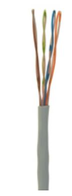
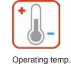
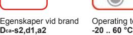
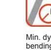
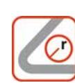
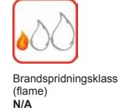

# **U/UTP Category 5e LSZH Cable Dca**

**U/UTP Kategori 5e LSZH 305m box vit**

#### Kontaktuppgifter

Försäljning Tele/Datakabel Telefon: +46 325 80 000 telecomcable-pc.se@nexans.com

**Artikelnr:** 39153103

**E-nr:** 4901283 **EAN 13:** 8680969054683

- Uppfyller kraven enligt den senaste kategori 5e standarden
- Garanterad prestanda upp till 100 Mhz
- Uppfyller RoHS EC Directive
- Vit halogenfri (LSZH) mantel

## **BESKRIVNING**

### **Användningsområde**

Nexans U/UTP Kategori 5e kablar är den ultimata lösningen för att stödja samtliga klass D applikationer för 100Mhz såsom Ethernet och Fast Ehernet.

## **Prestanda**

Kabeln uppfyller samtliga krav enligt EN 50288, ISO IEC 61156-5 och TIA 568B avseende konstruktion och prestanda. Tillsammans med kontaktdon för kategori 5e bildar kabeln en klass D länk enligt systemspecifikationerna EN 50173 Edition 2 och ISO 11801 Edition 2 (2002).

## **Egenskaper**

- 4 tvinnade par
- Liten ytterdiameter ger enkel och snabb installation
- Vit halogenfri (LSZH) mantel
- Förpackning 305m box
- Solid ledare 24 AWG
- Uppfyller RoHS EC Directive
- Brandegenskaper enligt CPR klass Dcas2d2a2

#### **PRESTANDADEKLARATION**

Egenskaper vid brand: Dcas2,d1,a2 enligt EN50575:2014+A1:2016

#### **STANDARDER**

**Internationell** EN 50173-1; IEC 61156-5; ISO/IEC 11801

**Nationell** ANSI/TIA-568-C.2

**Dca-s2,d1,a2**

Min. dynamic operating bending rad. **20,0 mm**

**40 mm**

Böjningsradie, statisk

förläggning **0 .. 50 °C**

Lämplig för EMC installation

**Nej**

Alla illustrationer, konstruktioner, specifikationer, ritningar och angivelser om vikt, storlek och dimensioner i Nexans tekniska eller kommersiella dokumentation är endast indikativa och kan inte förbinda Nexans eller anses vara representativa för Nexans. **Genererad 2018-10-29 www.nexans.se Sida 1 / 3**

# **U/UTP Category 5e LSZH Cable Dca**

**U/UTP Kategori 5e LSZH 305m box vit**

Kontaktuppgifter

Försäljning Tele/Datakabel Telefon: +46 325 80 000 telecomcable-pc.se@nexans.com

### **EGENSKAPER**

| Konstruktionsegenskaper            |              |
|------------------------------------|--------------|
| Kabeltyp                           | UTP          |
| Färg                               | White        |
| Skärm                              | Oskärmad     |
| Mantel, material                   | LSZH         |
| Dimensionsegenskaper               |              |
| Ledardiameter                      | 0,6 mm       |
| Diameter över isolering            | 0,9 mm       |
| Ytterdiameter, nom                 | 4,9 mm       |
| Vikt                               | 30 kg/km     |
| Ledardimension i AWG               | 24           |
| Elektriska egenskaper              |              |
| Karakteristisk impedans            | 100 Ohm      |
| Transmissionsegenskaper            |              |
| Hastighetskvot (NVP)               | 68 %         |
| Utbredningshastighet, max. 100 MHz | 536 ns/100m  |
| Hanteringsinformation              |              |
| Kategori                           | Kat. 5e      |
| Komponentfunktion                  | Kabel        |
| Drifttemperatur, område            | -20  60 °C   |
| Minsta böjningsradie, installation | 20,0 mm      |
| Böjningsradie, statisk             | 40 mm        |
| Längd                              | 305 m        |
| Temperaturområde vid förläggning   | 0  50 °C     |
| Lämplig för EMC installation       | Nej          |
| Brandspridningsklass (flame)       | N/A          |
| Produktfamilj                      | Nexans Cat5e |
| Förpackning                        | Kartong      |

### **ELECTRICAL VALUES**

All values are specified at 20°C

| Frequence (MHz) | Attenuation | NEXT | ACR      | PS NEXT | EL-FEXT  | PS EL FEXT | Return loss |
|--------------------|-------------|------|----------|---------|----------|------------|-------------|
|                    | dB/100 m    | dB   | dB/100 m | dB      | dB/100 m | dB/100 m   | dB          |
| 1                  | 2.1         | 65.3 | 63.2     | 62.3    | 64.0     | 61.0       | 20.0        |
| 4                  | 4.1         | 56.3 | 52.2     | 53.3    | 52.0     | 49.0       | 23.0        |
| 10                 | 6.5         | 50.3 | 43.8     | 47.3    | 44.0     | 41.0       | 25.0        |
| 16                 | 8.3         | 47.2 | 39.0     | 44.2    | 39.9     | 36.9       | 25.0        |
| 20                 | 9.3         | 45.8 | 36.5     | 42.8    | 38.0     | 35.0       | 25.0        |
| 31.25              | 11.7        | 42.9 | 31.1     | 39.9    | 34.1     | 31.1       | 23.6        |
| 62.5               | 17.0        | 38.4 | 21.4     | 35.4    | 28.1     | 25.1       | 21.5        |

Alla illustrationer, konstruktioner, specifikationer, ritningar och angivelser om vikt, storlek och dimensioner i Nexans tekniska eller kommersiella dokumentation är endast indikativa och kan inte förbinda Nexans eller anses vara representativa för Nexans. **Genererad 2018-10-29 www.nexans.se Sida 2 / 3**

# **U/UTP Category 5e LSZH Cable Dca**

**U/UTP Kategori 5e LSZH 305m box vit**

Kontaktuppgifter

Försäljning Tele/Datakabel Telefon: +46 325 80 000 telecomcable-pc.se@nexans.com

| 100 | 22.0 | 35.3 | 13.3 | 32.3 | 24.0 | 21.0 | 20.1 |
|-----|------|------|------|------|------|------|------|
|     |      |      |      |      |      |      |      |

Alla illustrationer, konstruktioner, specifikationer, ritningar och angivelser om vikt, storlek och dimensioner i Nexans tekniska eller kommersiella dokumentation är endast indikativa och kan inte förbinda Nexans eller anses vara representativa för Nexans. **Genererad 2018-10-29 www.nexans.se Sida 3 / 3**

