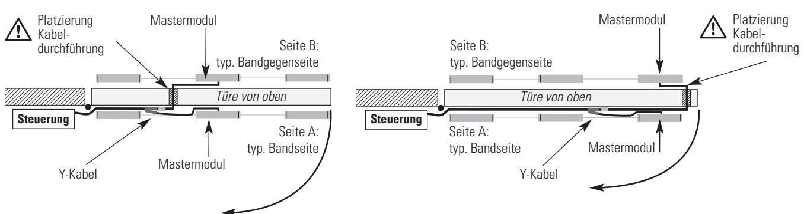
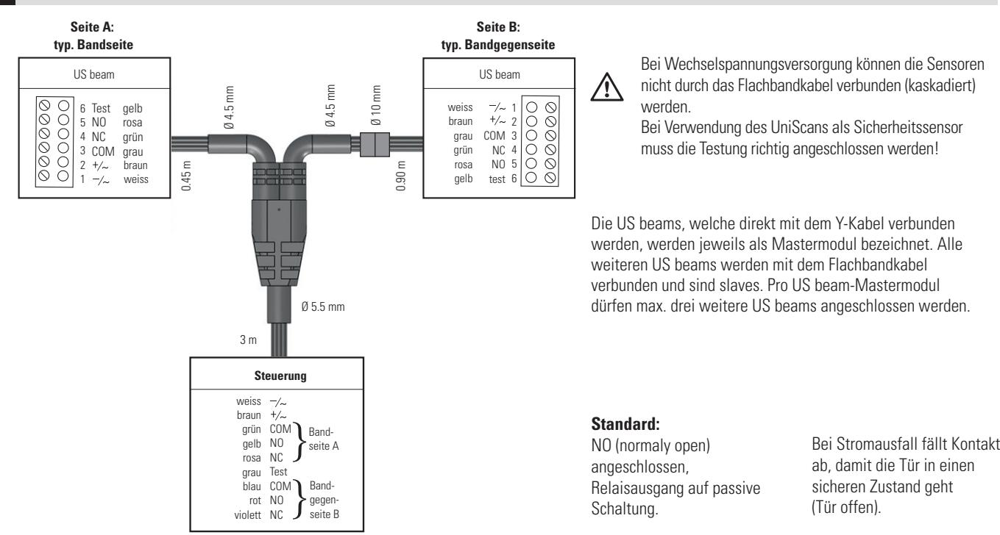
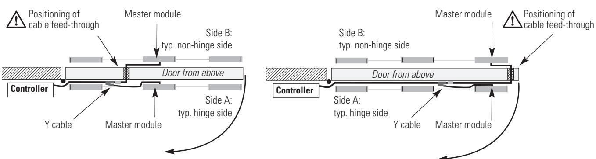
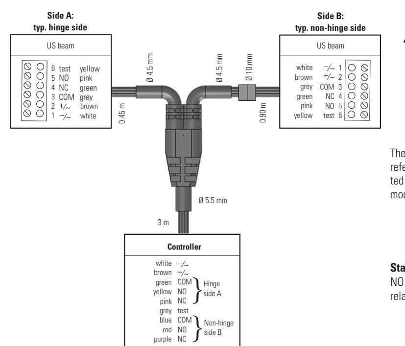

# **UniScan Y-Kabel**

**Beachten Sie die UniScan-Betriebsanleitung!**

# **1 Montage**

Die Positionierung des Y-Kabels sowie der Kabeldurchführung ist entsprechend der Gegebenheiten zu wählen (siehe folgende Skizzen).

### **Kabeldurchführung in Tür-Mitte Kabeldurchführung auf der Tür-Seite**

Wenn die Bohrung in der Tür-Mitte nicht möglich ist (zum Beispiel bei Glastüren), wird empfohlen, die Kabeldurchführung auf der Tür-Seite zu wählen.

- 1. Nach der beidseitigen Positionierung der UniScans, Kabeldurchführung (Loch Ø 10 mm) für das Verbindungskabel bohren. Kabeldurchführung in der Nähe des Mastermoduls platzieren (gem. Skizze oben). **Achtung:** Länge Verbindungskabel beachten! Beachten Sie die länderspezifischen Brandund Rauchschutzbestimmungen! Der 6-polige Stecker passt durch eine 10 mm Bohrung. Dadurch ergibt sich eine reine Stecklösung, keine Demontage erforderlich. Bei kleineren Lochdurchmessern zunächst Steckschraubklemme demontieren, Kabel (Ø 4.5 mm) durchziehen, Steckschraubklemme erneut montieren. **Achtung**: Klemmenbelegung bei der Remontage beachten!
- 2. Y-Kabel und Kabelstück zusammenstecken.
- 3. Verbindungskabel (Ø 5.5 mm) an Türsteuerung anschliessen.
- 4. Nach der Montage und Verkabelung der Sensoren müssen die Initialisierung am Mastermodul auf der Bandseite und Bandgegenseite erfolgen (5 sec «grüne» Taste drücken).

## **2 Anschluss**

**DE EN**

**BBC Bircher Smart Access,** BBC Bircher AG, Wiesengasse 20, CH-8222 Beringen, www.bircher.com

# **UniScan Y cable**

**Comply with the UniScan operating instructions!**

# **1 Mounting**

The position of the Y cable and the cable feed-through must be chosen according to the local conditions (see the following diagrams).

#### **Cable feed-through in door middle Cable feed-through on door side**

If it is not possible to drill a hole in the door middle (for example with glass doors), we recommend choosing a cable feed-through location on the side of the door.

1. After having attached the UniScans on both sides, drill a hole (Ø 10 mm) for feeding through the connection cable. Position the cable feed-through in the vicinity of the master module (acc. to diagram above). **Caution:** Observe length of connection cable!

Comply with the country-specific fire and smoke prevention regulations!

The 6-pin plug fits through a 10 mm hole. This results in a pure plug-in connection; no dismantling required.

In case of smaller hole diameters, first remove the plug-in screw terminal, then pull the cable (Ø 4.5 mm) through and

remount the plug-in screw terminal.

**Caution:** Observe the terminal assignment during remounting!

- 2. Connect Y cable and non-hinge side cable together.
- 3. Connect connection cable (Ø 5.5 mm) to door controller.
- 4. After the sensors have been installed and wired, they must be initialised at the master module on the hinge side and the non-hinge side (press <<green>> button for 5 seconds).

### **2 Connection**

If AC voltage is supplied, only single sensor operation is possible and it is not allowed to cascade the sensors by ribbon cable. When the UniScan is used as a safety sensor, the testsignal must be connected.

The US beams that are connected directly to the Y cable are referred to as master modules. All other US beams are connected with the ribbon cable and are slaves. Per US beam master module, a maximum of three other US beams may be connected.

# **Standard**

NO (normaly open) connected, relay output to passive circuit. In case of a power failure, the contact falls open so that the door goes into a safe state (door open).

**296574F** 10/19