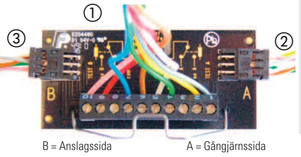
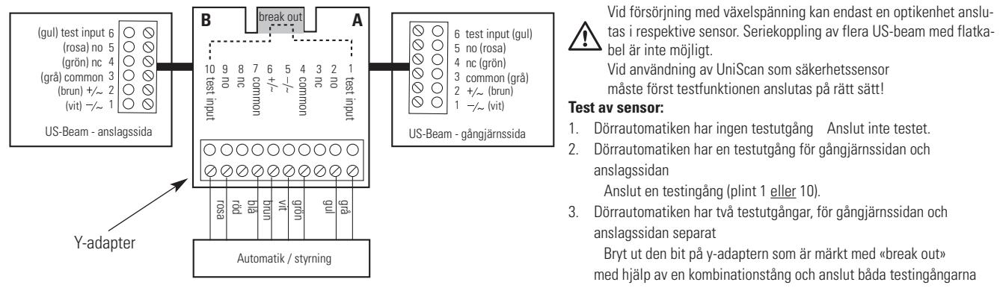
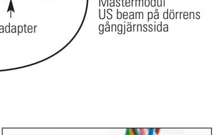
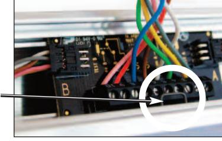

## **UniScan Y-adapter**

**Läs och följ även UniScan-manualen!**

**1 Detta ingår i leveransen:**

- **1 x Y-adapter med anslutningskabel till dörrautomatik**, kabellängd 2,8 m
- -**1 x anslutningskabel till optikenhet på dörrens gångjärnssida**, kabellängd 0,45 m
- **1 x anslutningskabel till optikenhet på dörrens anslagssida**, kabellängd 1 m

## **2 Montering**

Y-adapterns samt kabelgenomföringens placering ska väljas enligt förhållandena på plats (se skiss nedan).

- 1. När UniScan-enheterna har placerats på båda sidorna ska ett hål (Ø 10 mm) utföras för anslutningskabeln. Placera kabelgenomföringen i närheten av mastermodulen (enligt skissen ovan). **OBS:** Observera anslutningskabelns längd! Följ de landsspecifika bestämmelserna gällande brandoch rökskydd! Den 6-poliga kontakten passar genom ett borrhål på 10 mm. På det sättet får man en ren sticklösning, ingen demontering krävs. Vid mindre håldiameter, demontera först stickskruvplinten, dra genom kabeln, montera åter stickskruvplinten.
- **OBS**: Observera plintanvändningen vid demontering och återmontering!! 2. Koppla ihop Y-adaptern och kabeln. Haka sedan in Y-adaptern med fjäderbygeln i spåret på aluminiumprofilen.
- 3. Anslut anslutningskabeln till dörrautomatiken.
- 4. När sensorerna har monterats och anslutits måste initieringen utföras
- på mastermodulen på både anslagssidan och gångjärnssidan. (tryck 5 s på den <<gröna>> knappen).

## **3 Anslutning**

De US Beam, som kopplas direkt till Y-adaptern betecknas som mastermodul. Alla ytterligare US Beam kopplas med flatkabel och är slavar. Per US beammastermodul får max. tre ytterligare US beam anslutas.

(plint 1 och 10)

**Standard:** Vid strömavbrott utlöses kontakten så att dörren går till ett säkert läge (dörr öppen). Plint 2 & 9 (no) anslutna, Reläutgång på passiv koppling.

- **OBS:** Kopplingsschemat visas strömlöst! Som standard är reläet strömsatt (passivt).
- Om NC-anslutning behövs, används NO plint 2 och 9.

