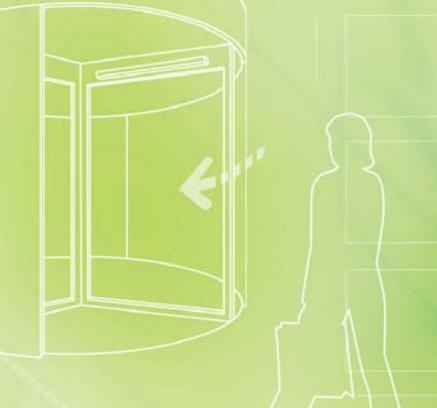

# **sensing the future**

**www.bircher-reglomat.com**

# **UniScan**

Aktiv infraröd närvarodetektor för automatiska slag- och karuselldörrar enligt DIN 18650

# Praktisk, flexibel, smal

- **Helautomatiskt idrifttagande: snabbt och enkelt med ett knapptryck**
- **Automatisk inställning av monteringshöjd: sparar tid och underlättar monteringen**
- **Design i toppklass: den minsta sensorn i sin klass**
- **Individuellt inställbara AIR-punkter: för perfekt anpassning till omständigheterna på plats**

### **sensing the future**

**www.bircher-reglomat.com**

# **UniScan**

Aktiv infraröd närvarodetektor för automatiska slag- och karuselldörrar enligt DIN 18650

# Praktisk, flexibel, smal

- **Helautomatiskt idrifttagande: snabbt och enkelt med ett knapptryck**
- **Automatisk inställning av monteringshöjd: sparar tid och underlättar monteringen**
- **Design i toppklass: den minsta sensorn i sin klass**
- **Individuellt inställbara AIR-punkter: för perfekt anpassning till omständigheterna på plats**

### **UniScan**

# Aktiv infraröd närvarodetektor för automatiska slag- och karuselldörrar enligt DIN 18650

#### **Högsta säkerhet vid daglig användning**

Säker passering med UniScan, överallt där människor går in och ut. Tack vare sitt finmaskiga avkänningsfält erbjuder UniScan högsta möjliga skydd, även för småbarn och rörelsehindrade. känningsfält erbjuder

#### **Monteras snabbt och enkelt**

UniScan har inte bara hög säkerhetsnivå, utan sparar även tid vid idrifttagandet. Ett knapptryck räcker – och UniScan är automatiskt inställd och programmerad. Tack vare sin smala form, fina design och små dimensioner är sensorn diskret och kan användas där det är ont om utrymme. k me.

# Fördelar

#### **Snabb montering och idrifttagande**

- Flera optikenheter kan enkelt kopplas samman med flatkabel
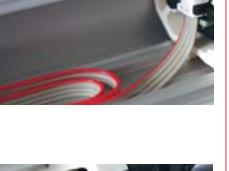

- Mekanisk vinkeljustering utan verktyg
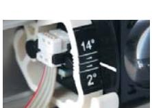

- Automatisk idrifttagande med ett knapptryck, indikering med lysdioder
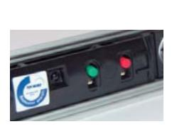

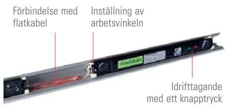

#### **Anpassad inställning**

- Typen av testsignal kan väljas för alla sorters dörrautomatiker
- Detektionshöjden över mark kan ställas in från 10 cm till 100 cm
- Inga interferenser tack vare synkroniserad optik
- Enskilda strålar kan stängas av individuellt, tex. för ett dörrhandtag och ändå uppfylls säkerhetskraven

#### **Kompakta mått**

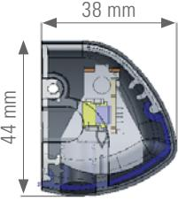

#### **Fältegenskaper för högre säkerhet**

- Finmaskigt fält (471 x 58 mm på 2,2 m höjd) med 8 strålar och mycket kort reaktionstid (< 50 ms)
- Drifthöjd upp till 3,0 m Strömsparläge (enligt DIN 18650)
	- med 5 strålar aktiva

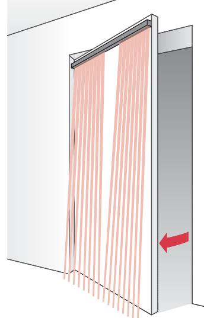

# Tillbehör

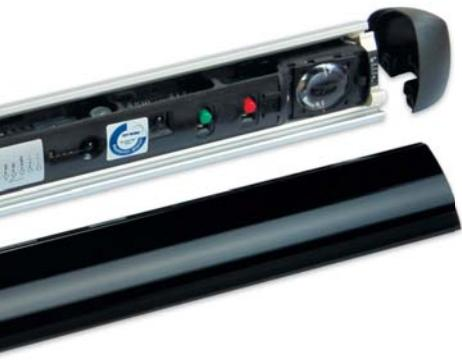

Enskilda komponenter till UniScan, som optikenheten US beam och olika profiler finns tillgängliga. Tillbehöret fjärrkontroll gör det möjligt att ställa in redan monterade sensorer med frontkåpan på. Y-adaptern är en enkel lösning med bara en kabel för två sensorer på båda sidor av dörren. En smidig anslutning till väggen åstadkoms med någon av de båda karmöverföringarna DLP 6 Box och Door Loop.

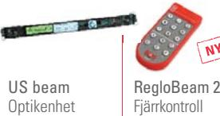

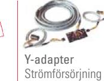

av UniScan på två dörrsidor

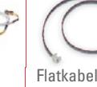

För sammankoppling av US beam-enheter

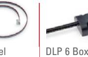

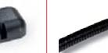

Karmöverföring med väggbox

Door Loop Karmöverföring med väggfäste

# UniScan dörrsats

**Säkerhet i ett paket**

UniScan finns även i användarvänlig dörrsats.

#### **Enkel hantering, komplett och översiktligt**

Alla komponenter levereras i ett paket: ordnade på ett strukturerat sätt. Där finns allt som behövs för att säkra en dörr.

#### **Snabb montering och idriftsättning, inga verktyg behövs**

Y-adaptern trycks in i profilen och förbinder båda dörrsidorna med den praktiska instickslösningen enligt Plug'n'Play-principen. Profilens ändstycken monteras utan verktyg.

# Säker vid varje användning

#### **Situation**

Passering genom slagdörr

#### **Lösning**

- Dörrens fram- och bakkant övervakas på båda sidor av dörren för att säkra hela slagdörren och förhindra kollisioner
- Dörrörelserna blir smidiga vid kort reaktionstid

#### **Fördelar**

- UniScan säkrar alla kanter perfekt
- En passande enhet för varje dörr: Längd och antal sensorer kan väljas

#### **Situation**

Passering genom karuselldörr

#### **Lösning**

- Ett mobilt påkörningsskydd på karuselldörrar gör driften friktionsfri och minimerar risken för olyckor
#### **Fördelar**

- Personer och föremål upptäcks snabbt och utan beröring
- Skydd mot kollisioner och kroppsskador från dörrvingarna

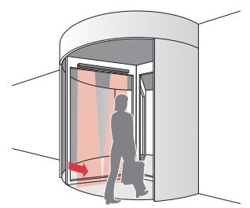

# Orderuppgifter

| Artikel-nr                           | Benämning                                                                                                                        | Antal optikenheter / Mått             |  |
|--------------------------------------|----------------------------------------------------------------------------------------------------------------------------------|------------------------------------------|--|
| 260012 259970                     | UniScan 1.350 silver UniScan 1.350 svart                                                                                      | 1 1                                   |  |
| 260013                               | UniScan 1.350 vit                                                                                                                | 1                                        |  |
| 256274 256317                     | UniScan 2.750 silver UniScan 2.750 svart                                                                                      | 2 2                                   |  |
| 256296                               | UniScan 2.750 vit                                                                                                                | 2                                        |  |
| 256299 256340 256341           | UniScan 2.900 silver UniScan 2.900 svart UniScan 2.900 vit                                                                 | 2 2 2                              |  |
| 256859 256596 256881           | UniScan 2.1100 silver UniScan 2.1100 svart UniScan 2.1100 vit                                                              | 2 2 2                              |  |
| 257182 257184 257189           | UniScan 3.1600 silver UniScan 3.1600 svart UniScan 3.1600 vit                                                              | 3 3 3                              |  |
| 290768                               | Dörrpaket UniScan 2x2.1100 silver                                                                                                | 2 x 2                                    |  |
| 296971                               | Dörrpaket UniScan 2x2.1100 svart                                                                                                 | 2 x 2                                    |  |
| 296972                               | Dörrpaket UniScan 2x2.1100 vit                                                                                                   | 2 x 2                                    |  |
| 291030 296973                     | Dörrpaket UniScan 2x2.1200 silver Dörrpaket UniScan 2x2.1200 svart                                                            | 2 x 2 2 x 2                           |  |
| 296974                               | Dörrpaket UniScan 2x2.1200 vit                                                                                                   | 2 x 2                                    |  |
| 256297                               | US beam Optikenhet inkl. hållare                                                                                              | 1                                        |  |
| 288879                               | Y-Adapter Kabelförgrening                                                                                                     |                                          |  |
| 212354                               | DLP 6 Box, karmöverföring Box och övergångsslang, längd max. 600 mm, innerdiameter max. 6 mm, av plast, svart        |                                          |  |
| 220535                               | Door Loop, karmöverföring Väggfäste och övergångsslang, längd max. 600 mm, innerdiameter max. 6 mm, av plast, svart  |                                          |  |
| 212356                               | Door Loop, karmöverföring Väggfäste och övergångsslang, längd max. 600 mm, innerdiameter max. 6 mm, av metall, svart |                                          |  |
| 291082                               | Kabelsats UniScan Innehåller Y-adapter 288879 och karmöverföringsats 220535                                                |                                          |  |
| 213097 213096                     | Flatkabel 800 Flatkabel 500                                                                                                   | 800 mm 500 mm                         |  |
| 225452                               | Scan frontkåpa                                                                                                                   | 3350 mm                                  |  |
| 219910 247969 247966 247970 | Scan aluminiumprofil silver Scan aluminiumprofil svart Scan aluminiumprofil vit Scan aluminiumprofil obehandlad         | 3350 mm 3350 mm 3350 mm 3350 mm |  |
| 297705                               | Scan Cap-sats svart Ändstyckesats, svart                                                                                      |                                          |  |
| 297706                               | Scan Cap-sats vit Ändstyckesats, vit                                                                                          |                                          |  |
| 218810                               | Hållare Beam Universal Fäste för optikenheten                                                                                 |                                          |  |
| 243025                               | RPT regnskydd Rulle med 17 m                                                                                                  |                                          |  |
| 292393                               | RegloBeam 2 Tvåvägs fjärrkontroll                                                                                             |                                          |  |

# Ytterligare produkter

**Öppningsimpulsgivare**

| Merkur 2 radar med elektroniskt inställbart fält      |  |  |  |  |
|-------------------------------------------------------|--|--|--|--|
| Punktbevakning av närvaro                             |  |  |  |  |
| SpotScan aktiv IR med detekteringsområde upp till 3 m |  |  |  |  |

| Kapslingens material Frontkåpa Vikt (US beam)   | Aluminium Plexiglas PMMA (svart)                                                                                                                                                                                                                                                                                                                                      |
|-------------------------------------------------------|--------------------------------------------------------------------------------------------------------------------------------------------------------------------------------------------------------------------------------------------------------------------------------------------------------------------------------------------------------------------------|
|                                                       |                                                                                                                                                                                                                                                                                                                                                                          |
|                                                       |                                                                                                                                                                                                                                                                                                                                                                          |
|                                                       | 90 g                                                                                                                                                                                                                                                                                                                                                                     |
| Mått (US beam)                                        | 300 x 31 x 20 mm                                                                                                                                                                                                                                                                                                                                                         |
| Vikt (UniScan 2.1100)                                 | 910 g                                                                                                                                                                                                                                                                                                                                                                    |
| Anslutningstyp                                        | Skruvklämma                                                                                                                                                                                                                                                                                                                                                              |
|                                                       |                                                                                                                                                                                                                                                                                                                                                                          |
| Tekniska data                                         |                                                                                                                                                                                                                                                                                                                                                                          |
| Teknik                                                | Infraröd                                                                                                                                                                                                                                                                                                                                                                 |
| Strålar                                               | 8 per US beam                                                                                                                                                                                                                                                                                                                                                            |
| Strömsparläget                                        | 5 strålar per US beam aktiverade (fabriksinställning)                                                                                                                                                                                                                                                                                                                 |
| Monteringshöjd                                        | 1.7 – 3.0 m                                                                                                                                                                                                                                                                                                                                                              |
| Fältstorlek (vid 2.2 m)                               | 471 x 58 mm                                                                                                                                                                                                                                                                                                                                                              |
| Driftssätt                                            | mobil                                                                                                                                                                                                                                                                                                                                                                    |
| Eftersläpningstid vid detektering                  | < 50 ms                                                                                                                                                                                                                                                                                                                                                                  |
| Prestandanivå / utförande                             | c / kategori 2                                                                                                                                                                                                                                                                                                                                                           |
| Max. antal optikenheter anslutna i följd i sensorn | 4 (endast med DC försörjningsspänning)                                                                                                                                                                                                                                                                                                                                |
| Elektriska data                                       |                                                                                                                                                                                                                                                                                                                                                                          |
| Försörjningsspänning                                  | 15–37 VDC ± 0%                                                                                                                                                                                                                                                                                                                                                           |
|                                                       | 15–26 VAC ± 0%                                                                                                                                                                                                                                                                                                                                                           |
|                                                       | AC endast för enskild optikenhet                                                                                                                                                                                                                                                                                                                                         |
| Inkopplingsström                                      | < 500 mA                                                                                                                                                                                                                                                                                                                                                                 |
| Strömförbrukning                                      | 3.3 Watt (138 mA vid 24 V per optikenhet)                                                                                                                                                                                                                                                                                                                             |
| Testning                                              | High/Low active, Pull up/Pull down                                                                                                                                                                                                                                                                                                                                    |
| Eftersläpningstid vid testning                     | 1–7 ms                                                                                                                                                                                                                                                                                                                                                                   |
| Utgång                                                | Relä 40 VDC, 40 VAC, 1 A                                                                                                                                                                                                                                                                                                                                                 |
| Relähålltid                                           | 0–10 s inställbar                                                                                                                                                                                                                                                                                                                                                        |
| Omgivningsvillkor                                     |                                                                                                                                                                                                                                                                                                                                                                          |
| Skyddsklass                                           | Avsedd för IP54-användning                                                                                                                                                                                                                                                                                                                                               |
| Driftstemperatur                                      | –20 °C till +60 °C                                                                                                                                                                                                                                                                                                                                                       |
| Luftfuktighet                                         | < 95 %, icke kondenserande                                                                                                                                                                                                                                                                                                                                               |
| Normer                                                |                                                                                                                                                                                                                                                                                                                                                                          |
| Immission                                             | EN 61000-6-1 EN 61000-6-2                                                                                                                                                                                                                                                                                                                                             |
| Emission                                              | EN 61000-6-3                                                                                                                                                                                                                                                                                                                                                             |
|                                                       | EN 61000-6-4                                                                                                                                                                                                                                                                                                                                                             |
| EG-typtestad enligt                                   | DIN 18650                                                                                                                                                                                                                                                                                                                                                                |
|                                                       | EN 12978                                                                                                                                                                                                                                                                                                                                                                 |
|                                                       | EN 13849-1 EN 61508                                                                                                                                                                                                                                                                                                                                                   |
| Observera på grund av teknisk vidareutveckling.    | Tekniska uppgifter och rekommendationer för våra produkter är empiriska värden och är avsedda att ge användaren orientering. Uppgifter i broschyrer och datablad garanterar inga speciella produktegenskaper. Speciella produktegenskaper som vi skriftligt eller individuellt i undantagsfall medger, finns inte med. Vi förbehåller oss rätten till ändringar |

#### **Bircher Reglomat AG**

Wiesengasse 20 CH -8222 Beringen Schweiz Tel. +41 (0)52 687 11 11 Fax +41 (0)52 687 12 10 info@bircher.com www.bircher-reglomat.com

# **UniScan**

# Aktiv infraröd närvarodetektor för automatiska slag- och karuselldörrar enligt DIN 18650

### **Högsta säkerhet vid daglig användning**

Säker passering med UniScan, överallt där människor går in och ut. Tack vare sitt finmaskiga avkänningsfält erbjuder UniScan högsta möjliga skydd, även för småbarn och rörelsehindrade. känningsfält erbjuder

### **Monteras snabbt och enkelt**

UniScan har inte bara hög säkerhetsnivå, utan sparar även tid vid idrifttagandet. Ett knapptryck räcker – och UniScan är automatiskt inställd och programmerad. Tack vare sin smala form, fina design och små dimensioner är sensorn diskret och kan användas där det är ont om utrymme. k me.

### Fördelar

#### **Snabb montering och idrifttagande**

- Flera optikenheter kan enkelt kopplas samman med flatkabel
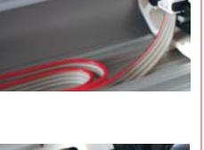

- Mekanisk vinkeljustering utan verktyg

- Automatisk idrifttagande med ett knapptryck, indikering med lysdioder
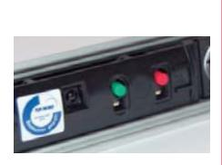

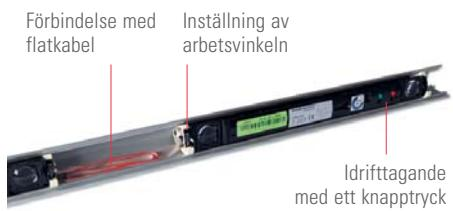

#### **Anpassad inställning**

- Typen av testsignal kan väljas för alla sorters dörrautomatiker
- Detektionshöjden över mark kan ställas in från 10 cm till 100 cm
- Inga interferenser tack vare synkroniserad optik
- Enskilda strålar kan stängas av individuellt, tex. för ett dörrhandtag och ändå uppfylls säkerhetskraven

#### **Kompakta mått**

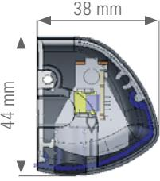

#### **Fältegenskaper för högre säkerhet**

- Finmaskigt fält (471 x 58 mm på 2,2 m höjd) med 8 strålar och mycket kort reaktionstid (< 50 ms)
- Drifthöjd upp till 3,0 m Strömsparläge (enligt DIN 18650)

med 5 strålar aktiva

- 
# Tillbehör

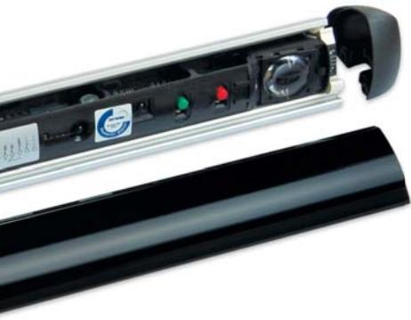

Enskilda komponenter till UniScan, som optikenheten US beam och olika profiler finns tillgängliga. Tillbehöret fjärrkontroll gör det möjligt att ställa in redan monterade sensorer med frontkåpan på. Y-adaptern är en enkel lösning med bara en kabel för två sensorer på båda sidor av dörren. En smidig anslutning till väggen åstadkoms med någon av de båda karmöverföringarna DLP 6 Box och Door Loop.

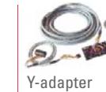

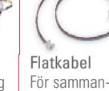

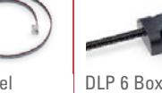

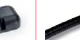

Karmöverföring med väggbox

Door Loop Karmöverföring med väggfäste

# UniScan dörrsats

**Säkerhet i ett paket**

UniScan finns även i användarvänlig dörrsats.

#### **Enkel hantering, komplett och översiktligt**

Alla komponenter levereras i ett paket: ordnade på ett strukturerat sätt. Där finns allt som behövs för att säkra en dörr.

#### **Snabb montering och idriftsättning, inga verktyg behövs**

Y-adaptern trycks in i profilen och förbinder båda dörrsidorna med den praktiska instickslösningen enligt Plug'n'Play-principen. Profilens ändstycken monteras utan verktyg.

# Säker vid varje användning

#### **Situation**

Passering genom slagdörr

#### **Lösning**

- Dörrens fram- och bakkant övervakas på båda sidor av dörren för att säkra hela slagdörren och förhindra kollisioner
- Dörrörelserna blir smidiga vid kort reaktionstid

#### **Fördelar**

- UniScan säkrar alla kanter perfekt
- En passande enhet för varje dörr: Längd och antal sensorer kan väljas

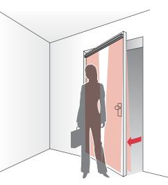

#### **Situation**

Passering genom karuselldörr

#### **Lösning**

- Ett mobilt påkörningsskydd på karuselldörrar gör driften friktionsfri och minimerar risken för olyckor
#### **Fördelar**

- Personer och föremål upptäcks snabbt och utan beröring
- Skydd mot kollisioner och kroppsskador från dörrvingarna

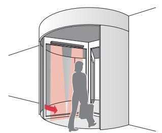

Strömförsörjning av UniScan på två dörrsidor koppling av US beam-enheter

# Orderuppgifter

| Artikel-nr                           | Benämning                                                                                                                        | Antal optikenheter / Mått             |  |
|--------------------------------------|----------------------------------------------------------------------------------------------------------------------------------|------------------------------------------|--|
| 260012 259970 260013           | UniScan 1.350 silver UniScan 1.350 svart UniScan 1.350 vit                                                                 | 1 1 1                              |  |
| 256274 256317 256296           | UniScan 2.750 silver UniScan 2.750 svart UniScan 2.750 vit                                                                 | 2 2 2                              |  |
| 256299 256340 256341           | UniScan 2.900 silver UniScan 2.900 svart UniScan 2.900 vit                                                                 | 2 2 2                              |  |
| 256859 256596 256881           | UniScan 2.1100 silver UniScan 2.1100 svart UniScan 2.1100 vit                                                              | 2 2 2                              |  |
| 257182 257184 257189           | UniScan 3.1600 silver UniScan 3.1600 svart UniScan 3.1600 vit                                                              | 3 3 3                              |  |
| 290768 296971 296972           | Dörrpaket UniScan 2x2.1100 silver Dörrpaket UniScan 2x2.1100 svart Dörrpaket UniScan 2x2.1100 vit                          | 2 x 2 2 x 2 2 x 2                  |  |
| 291030 296973 296974           | Dörrpaket UniScan 2x2.1200 silver Dörrpaket UniScan 2x2.1200 svart Dörrpaket UniScan 2x2.1200 vit                          | 2 x 2 2 x 2 2 x 2                  |  |
| 256297                               | US beam Optikenhet inkl. hållare                                                                                              | 1                                        |  |
| 288879                               | Y-Adapter Kabelförgrening                                                                                                     |                                          |  |
| 212354                               | DLP 6 Box, karmöverföring Box och övergångsslang, längd max. 600 mm, innerdiameter max. 6 mm, av plast, svart        |                                          |  |
| 220535                               | Door Loop, karmöverföring Väggfäste och övergångsslang, längd max. 600 mm, innerdiameter max. 6 mm, av plast, svart  |                                          |  |
| 212356                               | Door Loop, karmöverföring Väggfäste och övergångsslang, längd max. 600 mm, innerdiameter max. 6 mm, av metall, svart |                                          |  |
| 291082                               | Kabelsats UniScan Innehåller Y-adapter 288879 och karmöverföringsats 220535                                                |                                          |  |
| 213097                               | Flatkabel 800                                                                                                                    | 800 mm                                   |  |
| 213096 225452                     | Flatkabel 500 Scan frontkåpa                                                                                                  | 500 mm 3350 mm                        |  |
| 219910 247969 247966 247970 | Scan aluminiumprofil silver Scan aluminiumprofil svart Scan aluminiumprofil vit Scan aluminiumprofil obehandlad         | 3350 mm 3350 mm 3350 mm 3350 mm |  |
| 297705                               | Scan Cap-sats svart Ändstyckesats, svart                                                                                      |                                          |  |
| 297706                               | Scan Cap-sats vit Ändstyckesats, vit                                                                                          |                                          |  |
| 218810                               | Hållare Beam Universal Fäste för optikenheten                                                                                 |                                          |  |
| 243025                               | RPT regnskydd Rulle med 17 m                                                                                                  |                                          |  |
| 292393                               | RegloBeam 2 Tvåvägs fjärrkontroll                                                                                             |                                          |  |

# Ytterligare produkter

**Öppningsimpulsgivare**

| Merkur 2 radar med elektroniskt inställbart fält      |  |  |  |  |
|-------------------------------------------------------|--|--|--|--|
| Punktbevakning av närvaro                             |  |  |  |  |
| SpotScan aktiv IR med detekteringsområde upp till 3 m |  |  |  |  |

| Mekaniska data                                     |                                                                                                                                                                                                                                                                                                                                                                          |
|----------------------------------------------------|--------------------------------------------------------------------------------------------------------------------------------------------------------------------------------------------------------------------------------------------------------------------------------------------------------------------------------------------------------------------------|
| Kapslingens material                               | Aluminium                                                                                                                                                                                                                                                                                                                                                                |
| Frontkåpa                                          | Plexiglas PMMA (svart)                                                                                                                                                                                                                                                                                                                                                   |
| Vikt (US beam)                                     | 90 g                                                                                                                                                                                                                                                                                                                                                                     |
| Mått (US beam)                                     | 300 x 31 x 20 mm                                                                                                                                                                                                                                                                                                                                                         |
| Vikt (UniScan 2.1100)                              | 910 g                                                                                                                                                                                                                                                                                                                                                                    |
| Anslutningstyp                                     | Skruvklämma                                                                                                                                                                                                                                                                                                                                                              |
|                                                    |                                                                                                                                                                                                                                                                                                                                                                          |
| Tekniska data                                      |                                                                                                                                                                                                                                                                                                                                                                          |
| Teknik                                             | Infraröd                                                                                                                                                                                                                                                                                                                                                                 |
| Strålar                                            | 8 per US beam                                                                                                                                                                                                                                                                                                                                                            |
| Strömsparläget                                     | 5 strålar per US beam aktiverade                                                                                                                                                                                                                                                                                                                                         |
|                                                    | (fabriksinställning)                                                                                                                                                                                                                                                                                                                                                     |
| Monteringshöjd                                     | 1.7 – 3.0 m                                                                                                                                                                                                                                                                                                                                                              |
| Fältstorlek (vid 2.2 m)                            | 471 x 58 mm                                                                                                                                                                                                                                                                                                                                                              |
| Driftssätt                                         | mobil                                                                                                                                                                                                                                                                                                                                                                    |
| Eftersläpningstid vid                              | < 50 ms                                                                                                                                                                                                                                                                                                                                                                  |
| detektering                                        |                                                                                                                                                                                                                                                                                                                                                                          |
| Prestandanivå / utförande                          | c / kategori 2                                                                                                                                                                                                                                                                                                                                                           |
| Max. antal optikenheter                            | 4 (endast med                                                                                                                                                                                                                                                                                                                                                            |
| anslutna i följd i sensorn                         | DC försörjningsspänning)                                                                                                                                                                                                                                                                                                                                                 |
|                                                    |                                                                                                                                                                                                                                                                                                                                                                          |
| Elektriska data                                    |                                                                                                                                                                                                                                                                                                                                                                          |
| Försörjningsspänning                               | 15–37 VDC ± 0%                                                                                                                                                                                                                                                                                                                                                           |
|                                                    | 15–26 VAC ± 0%                                                                                                                                                                                                                                                                                                                                                           |
|                                                    | AC endast för enskild optikenhet                                                                                                                                                                                                                                                                                                                                         |
| Inkopplingsström                                   | < 500 mA                                                                                                                                                                                                                                                                                                                                                                 |
| Strömförbrukning                                   | 3.3 Watt (138 mA vid 24 V per optikenhet)                                                                                                                                                                                                                                                                                                                             |
| Testning                                           | High/Low active, Pull up/Pull down                                                                                                                                                                                                                                                                                                                                    |
| Eftersläpningstid vid testning                  | 1–7 ms                                                                                                                                                                                                                                                                                                                                                                   |
| Utgång                                             | Relä 40 VDC, 40 VAC, 1 A                                                                                                                                                                                                                                                                                                                                                 |
| Relähålltid                                        | 0–10 s inställbar                                                                                                                                                                                                                                                                                                                                                        |
|                                                    |                                                                                                                                                                                                                                                                                                                                                                          |
| Omgivningsvillkor                                  |                                                                                                                                                                                                                                                                                                                                                                          |
| Skyddsklass                                        | Avsedd för IP54-användning                                                                                                                                                                                                                                                                                                                                               |
| Driftstemperatur                                   | –20 °C till +60 °C                                                                                                                                                                                                                                                                                                                                                       |
| Luftfuktighet                                      | < 95 %, icke kondenserande                                                                                                                                                                                                                                                                                                                                               |
|                                                    |                                                                                                                                                                                                                                                                                                                                                                          |
| Normer                                             |                                                                                                                                                                                                                                                                                                                                                                          |
| Immission                                          | EN 61000-6-1                                                                                                                                                                                                                                                                                                                                                             |
|                                                    | EN 61000-6-2                                                                                                                                                                                                                                                                                                                                                             |
| Emission                                           | EN 61000-6-3                                                                                                                                                                                                                                                                                                                                                             |
|                                                    | EN 61000-6-4                                                                                                                                                                                                                                                                                                                                                             |
| EG-typtestad enligt                                | DIN 18650                                                                                                                                                                                                                                                                                                                                                                |
|                                                    | EN 12978                                                                                                                                                                                                                                                                                                                                                                 |
|                                                    | EN 13849-1 EN 61508                                                                                                                                                                                                                                                                                                                                                   |
| Observera på grund av teknisk vidareutveckling. | Tekniska uppgifter och rekommendationer för våra produkter är empiriska värden och är avsedda att ge användaren orientering. Uppgifter i broschyrer och datablad garanterar inga speciella produktegenskaper. Speciella produktegenskaper som vi skriftligt eller individuellt i undantagsfall medger, finns inte med. Vi förbehåller oss rätten till ändringar |
|                                                    |                                                                                                                                                                                                                                                                                                                                                                          |
|                                                    |                                                                                                                                                                                                                                                                                                                                                                          |

#### **Bircher Reglomat AG**

Wiesengasse 20 CH -8222 Beringen Schweiz Tel. +41 (0)52 687 11 11 Fax +41 (0)52 687 12 10 info@bircher.com www.bircher-reglomat.com