DATA SHEET

Part No. 193600

# *Universal Mounting Kit*

The Universal Mounting Kit (UMK) is a versatile reader bracket that can be used for wall or pole mounting of the LR-series readers. The UMK is very easy to assemble and configure. The possibility to adjust tilt and swivel angle enables optimal tuning of the reader position. The bracket is suitable for both indoor and outdoor use. The kit contains all parts needed for mounting a reader (see "Configuration options and list of contents"). Each kit contains an assembly instruction that describes options for configuration and installation of the UMK.

#### Wall configuration

The Wall bracket can be mounted on flat surfaces such as walls or ceilings. The UMK is configured for WALL installation from factory. Wall mounting bolts are not included in the kit since the choice of bolts is dependant of the surface material.

#### Pole configuration

The Pole bracket can be mounted on poles or comparable equipment. The factory set UMK has to be reconfigured for POLE installation. The UMK is reconfigured by removing the Adaptor and assembling it with the Pole bracket (see "Configuration options and list of contents").

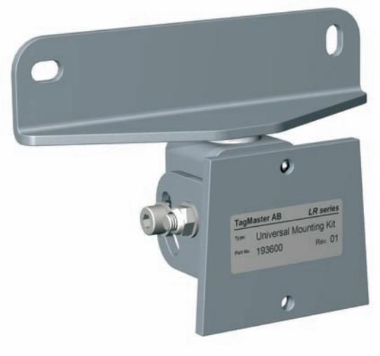

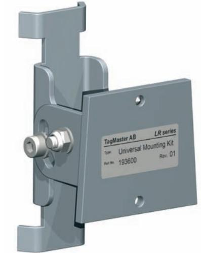

## configuration options and List of contents

| Contents |                             |      |  |
|----------|-----------------------------|------|--|
| #        | Index                       | Pcs. |  |
| I        | Adaptor                     | 1    |  |
| II       | Wall bracket                | 1    |  |
| III      | Pole bracket                | 1    |  |
| IV       | Reader bracket              | 1    |  |
| V        | Screw MC6S-M5x45            | 1    |  |
| VI       | Screw MC6S-M5x10            | 2    |  |
| VII      | Screw MRT-M4x10             | 4    |  |
| VIII     | Screw P6SS-M5x8 (not shown) | 1    |  |
| VIIII    | Washer M5                   | 4    |  |
| X        | Lock Washer M5              | 2    |  |
| XI       | Lock Washer M4              | 4    |  |
| XII      | Lock Nut M5                 | 1    |  |
| XIII     | Hose clamp 50-70 mm         | 2    |  |

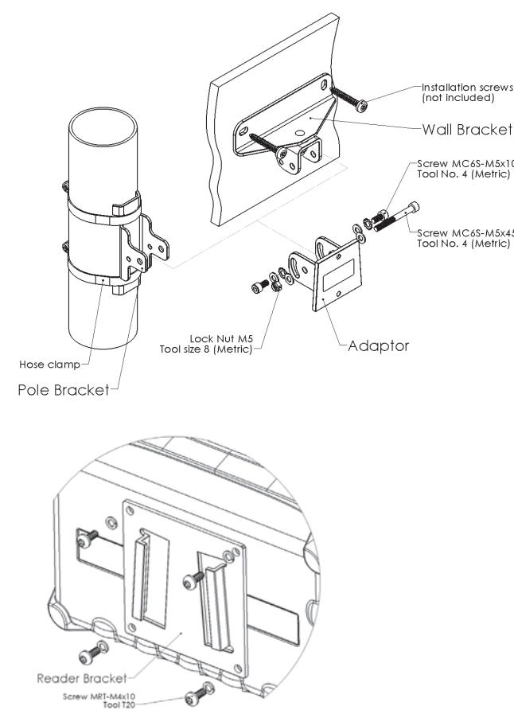

## attachment of READER BRACKET to the LR-series readers

The Reader bracket is attached to the rear side of the reader. The orientation of the bracket is dependant of installation requirements. The bracket is preferably attached with the wide opening towards the cable outlets' side of the reader. The Reader bracket attached to the reader is slid on to the Adaptor.

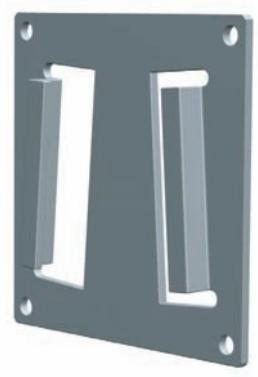

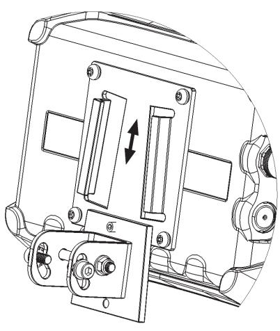

#### TILT and swivel angle, wall configuration

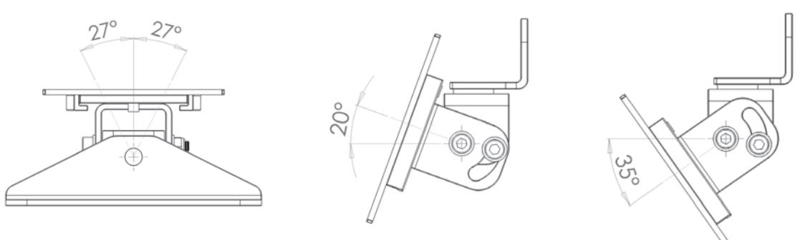

## TILT angle, pole configuration

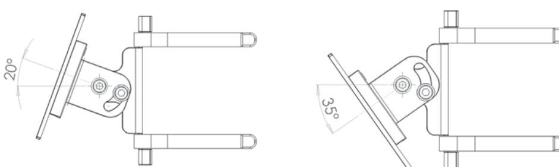

## ADJUSTMENT of TILT and swivel angle

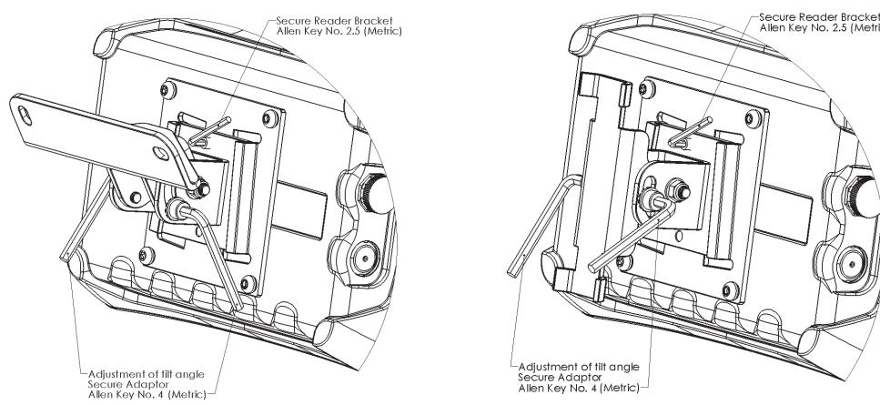

## dimensional drawing, wall configuration

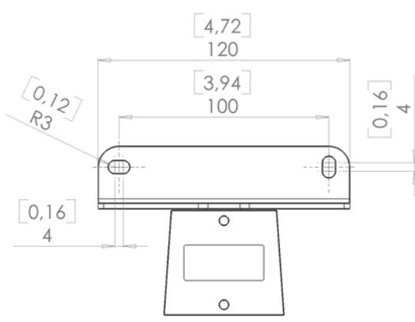

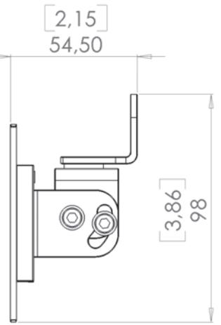

# dimensional drawing, pole configuration

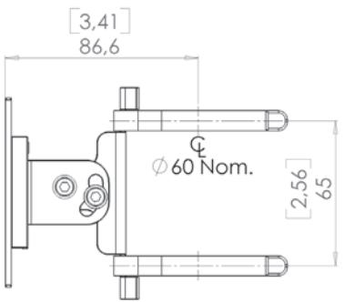

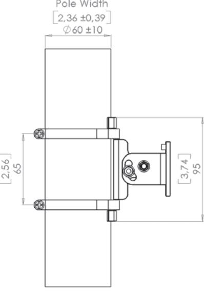

## dimensional drawing, READER BRACKET

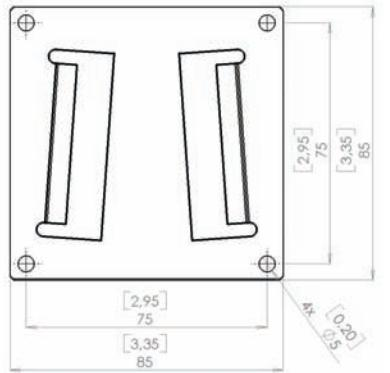

#### mechanical data

| Weight: WALL config.              | 474 g (17 oz)                                     |
|--------------------------------------|---------------------------------------------------|
| Weight: POLE config.              | 415 g (15 oz)                                     |
| Colour                               | Metallic grey (RAL 9006)                          |
| Material: brackets                   | Steel                                             |
| Corrosion protection: brackets    | Outdoor classified paint and surface treatment |
| Material: fixings and accessories | Stainless steel and nylon                         |
| Marking                              | Lable incl. type and part number                  |

The information in this document is subject to change without prior notice.

06-147 01