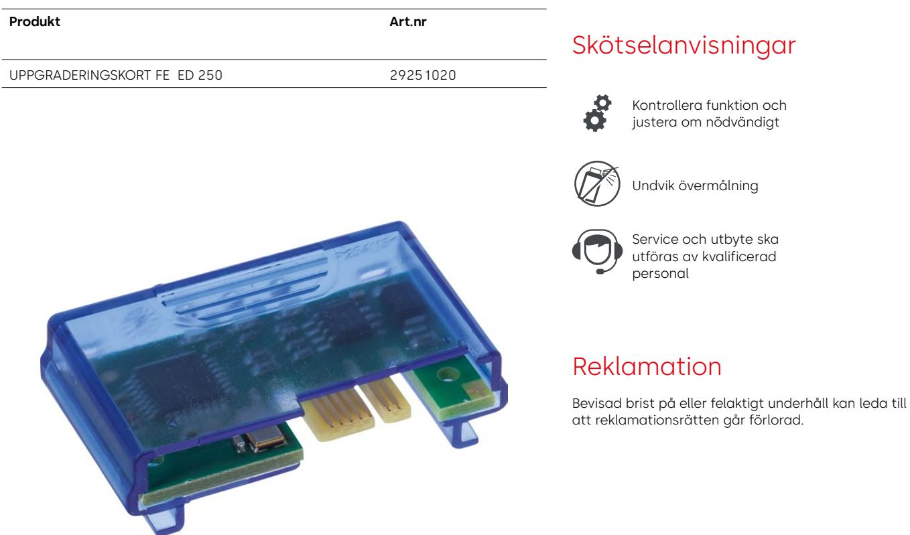

## **Uppgraderingskort ED 250 FullEnergy**

Med detta kort kan man öka hastigheter och krafter i dörrens öppnings och stängnings rörelse som överstiger standard low energy inställningarna i en ED100/250, maximal öppnings hastighet ED100 50 grader/sekund och ED250 60 grader/sekund den statiska kraften i öppning och stängning kan även ökas till 150N på båda drivenheterna. Max. stängningskraft 150N. Den maskindrivna dörrmiljön skall riskbedömas, installeras och dokumenteras i enlighet med SS-EN 16005.

## **dormakaba Sverige AB** | F O Petersons gata 28, 421 31 Västra Frölunda | Sverige | T: +46 31 355 20 00 | info.se@dormakaba.com | www.dormakaba.se Med förbehåll för eventuella ändringar Uppgraderingskort ED 250 FullEnergy_PDS_datasheet_sv_0000820_01