# **SALTO Neo Cylinder | User Manual**

**Scandinavian Profiles Cylinders**

Fully integrated with the SALTO SPACE and SALTO KS platforms, the SALTO Neo is a versatile, cost-effective electronic cylinder with a compact size that permits an easy installation, bringing the latest technology to your SALTO access control system.

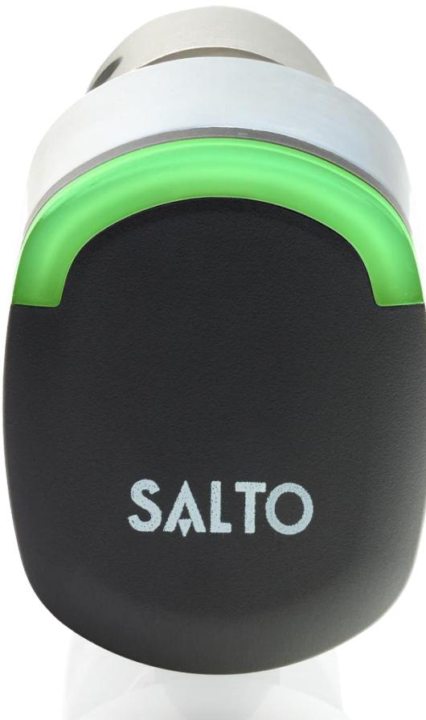

#### **INDEX**

**.** 

| PRODUCT DESCRIPTION       | 2 |
|---------------------------|---|
| WHATS IN BOX              | 2 |
| ACCESORIES                | 2 |
| SALTO Neo RANGE           | 3 |
| MODELS                    | 3 |
| DIMENSIONS                | 3 |
| CERTIFICATIONS            | 4 |
| TECHNICAL DATA            | 4 |
| ACCESS CONTROL FEATURES   | 4 |
| OPENING MODELS            | 5 |
| OPERATION OF THE CYLINDER | 5 |
| TIMEZONES                 | 5 |
| EVENT AUDITOR             | 6 |
| INSTALLATION              | 6 |
| PROGRAMMING               | 6 |
| BATTERIES                 | 6 |
| SALTO Neo SIGNALS         | 7 |

# **PRODUCT DESCRIPTION**

SALTO Neo cylinder is a battery operated electronic cylinder that brings all the advantages and benefits of an access control without wiring the door reducing installation costs and allowing you to control and manage virtually any kind of door.

The SALTO Neo cylinder is specially designed to fit most doors that are equipped with a mortise lock.

A wire free fully stand-alone electronic access control solution, it is suitable for installation in almost every type of wooden door including antique or listed wooden - metal - metal framed glass doors.

#### **WHATS IN THE BOX**

When you purchase a SALTO Neo electronic cylinder, you get:

- SALTO Neo electronic cylinder
- 4 battery LR1 type
- Installation guide

*WARNING: for the maintenance of the cylinder in order to perform replacement of batteries or the installation of double knob cylinders, SALTO recommends to purchase the Installation tool (SP225542 - sold separately).*

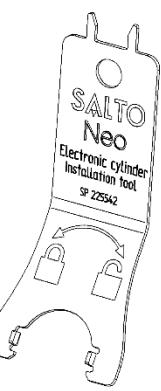

**ACCESSORIES**

- 2,5mm Allen key for SALTO Neo to remove the thumbturn (SP301585).
- 4 LR1 battery for SALTO Neo cylinders (SP01926-5).
- SALTO Euro cylinder measuring key for installers (PZ) (SP201587).
- Burglar resistant security ring kit to compliant with SSF3522 Grade 4 (SP225865).

*WARNING: "The product should not be modified in any way except in accordance with those modifications described in the instructions".*

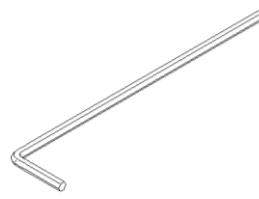

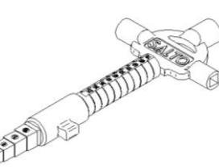

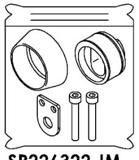

## **SALTO Neo RANGE**

#### **MODELS**

- **S1** = Scandinavian external cylinder. **NxS1xx..**
- **S2** = Scandinavian internal cylinder. **NxS2xx.**.
- **S3** = Security Scandinavian external cylinder**. NxS3xx..**

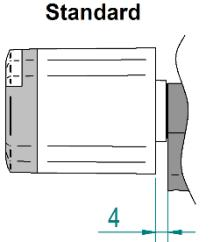

**.** 

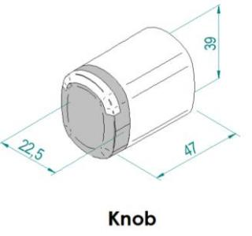

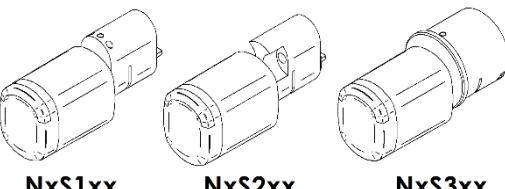

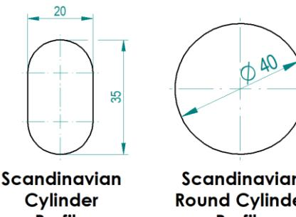

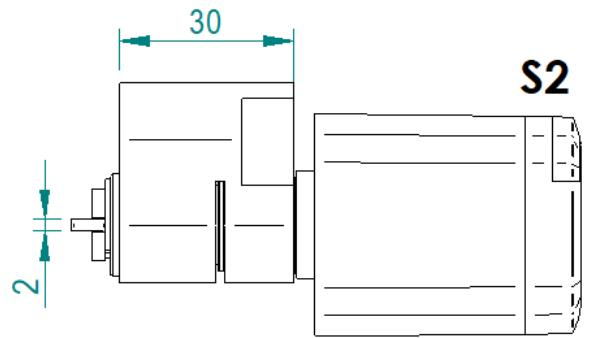

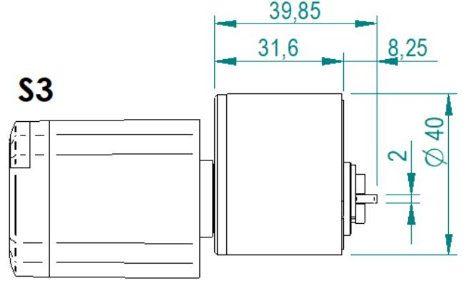

#### **SALTO Neo Cylinder | User Manual**

**4DS00045-ED.-23/09/2020** www.saltosystems.com

# **CERTIFICATIONS**

- CE
- FCC
- IC
- RCM
- MIC
- EN 15684 (1-6-B-3-A-F-3-2)
- IEC 60529 (IP66)
- SSF 3522 Burglar resistance class 4

# **TECHNICAL DATA**

- **CURRENT REQUIRED** 4 x LR1 batteries.
- **ENVIRONMENTAL CONDITIONS:** -20 C / +55 C (without condensation).
	- -35 ºC* / +55 ºC (exterior, only MIFARE).
	- (*) Battery life reduced significantly.
- **NUMBER OF OPENINGS:** up to 130,000 (100,000 with BLE (3) ) at 25C.
- **ACCESS CONTROL SYSTEM:** 
	- RW System.

- SALTO KS System.
**ACCES CONTROL FEATURES**

|                                   | RW System                                              | SALTO KS System               |
|-----------------------------------|--------------------------------------------------------|-------------------------------|
| Maximum number of users per door  | 4,000,000                                              | 1000 for IQ1 10000 for IQ2 |
| Maximum number of door per system | 65,000                                                 | Unlimited                     |
| Maximum events on lock audit      | 2,200                                                  | 1462 (BLUEnet) 472 (RFnet) |
| Time zones                        | 1,024                                                  | -                             |
| Time periods                      | 256                                                    | 128                           |
| Calendars in system               | 256                                                    | -                             |
| User groups                       | Unlimited                                              | Unlimited                     |
| Management software               | ProAccess SPACE ProAccess & HAMS (available SQL) | SALTO KS                      |

|                   |                |            | SALTO Neo |
|-------------------|----------------|------------|-----------|
|                   | SMILE          |            | -         |
| SYSTEMS           | ROM            |            | -         |
|                   | SVN            |            |         |
|                   | SALLIS         |            | -         |
|                   | KS             |            |         |
| RADIO             | RFID           |            |         |
| TECHNOLOGY        | BLE            |            |         |
|                   | TAGS/CARDS     |            |         |
| KEYS              | MOVIL - JustIN | JustIN NFC |         |
|                   |                | JustIN BLE |         |
| CONNECTIVITY      | BLUENet        |            |         |
| SPECIAL FUNCTIONS | SVN-Flex       |            |         |

## **OPENING MODELS**

- **STANDARD:** locked at all times.
- **OFFICE:** Free passage ability.
- **TIMED OFFICE:** free passage with automatic locking.
- **AUTOMATIC OPENING:** 8 pairs of "hands free" timed lock and unlocks per day with holidays.

- **AUTOMATIC OPENING + OFFICE.**
- **TOOGLE:** present card to lock, present card to unlock.
- **TIME TOOGLE:** present car to lock, present card to unlock depending on schedules.
- **TWO PERSON RULE:** present two valid cards to unlock.

#### **OPERATION OF THE CYLINDER**

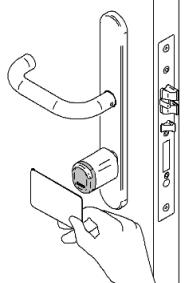

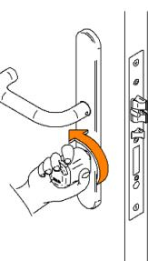

 **Present a valid card Turn the knob to retrieve the latch and deadbolt**

#### **TIMEZONES**

**.** 

Each user can be assigned to a calendar and a time table consists of up to 8 different time intervals with a resolution of 10 minutes assigned to each day of the week. You can also distinguish between holidays, special days and working days.

## **EVENT AUDITOR**

- Authorized access events auditor registration, denied access events auditor registration, system maintenance events auditor registration (low battery, PPD connection,…) and automatic actions events auditor registration (automatic opening…).
- Each events is logged: event type, user, date and time of the event.
- Permanent events registration. Non-volatile memory of the last X events (see table).

# **INSTALLATION**

To install the SALTO Neo cylinder: following the instructions attached with the product, or visiting our website:

**www.saltosystems.com/en/quick-links/manuals-and-guides/**

#### **PROGRAMMING**

To grant or deny access permissions are used to the right SW license. Once you update the system configuration:

- **RW SYSTEM**: the system allows electronic cylinders to read, receive and write information via its operating smart cards or "intelligent keys". This data is captured from the cards at SVN on-line hot spots located at strategic points around the building. The "online points" uploads and downloads user related information that is then used to permit, control or deny access.
- **KS SYSTEM**: the system allows electronic cylinders to read, receive and write information via radio SALTO KS.

## **BATTERIES**

In the case of complete battery failure the product both safe and secure, i.e. the outside handle fails "locked" to avoid intrusions, the inside handle fails "open" to permit emergency openings.

*WARNING: electronic cylinder in standalone or offline mode needs to be update with the PPD to recover the hour. "The product should not be modified in any way except in accordance with those modifications described in the instructions".*

**SALTO just warrantee the correct and best autonomy with Alkaline LR1 Energivm – batteries (SP01926-5).**

**SALTO Neo SIGNALS**

# **ACCESS GRANTED**

Present a valid user key and get the access granted.

| 1 High pitched beep | 1 Green light |
|------------------------|---------------|

# **ACCESS DENIED**

Present a not valid user key and get the access denied.

| 2 Short low pitched beeps | 2 Red lights |
|------------------------------|--------------|

# **LOW BATTERY STATUS**

After presenting a valid user card that has access to the door and opening the door, the cylinder will show 4 light red signal and then grant the access.

| 4 Short low pitched beeps | 4 Red lights |
|------------------------------|--------------|

# **BATTERY CHANGE (RESET)**

Each time you change the batteries, the electronic will do a reset. The cylinder memory will not be erased. Toshow this reset, the cylinder show yellow lights with a lite sound.

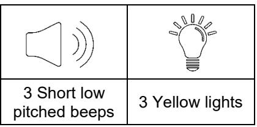

**.** 

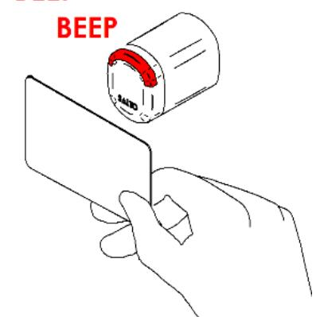

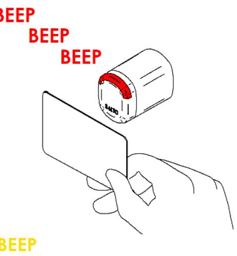

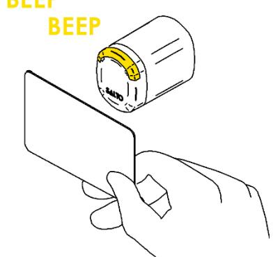

## **OFFICE MODE NOTICE**

Present a valid user key, the cylinder show a green ligth with a lite sound. The cylinder is in "office mode".

| 1 High pitched beep | 1 Green light |
|------------------------|---------------|

# **ACCESS GRANTED IN OFFICE MODE**

Present a valid user key, the cylinder show 3 green ligths with a lite sound and get the access granted.

| 3 Short high pitched beeps | 3 Green lights |
|-------------------------------|----------------|

## **ACCESS DENIED IN OFFICE MODE**

Present a not valid user key, the cylinder show red ligths with a lite sound and get the access denied.

| 6 Short high pitched beeps | 6 Red lights |
|-------------------------------|--------------|

## **OFFICE MODE END**

Present a valid user key, the cylinder show 2 red ligths with a lite sound. The "office mode" is over.

| 2 Short low pitched beeps | 2 Red lights |
|------------------------------|--------------|

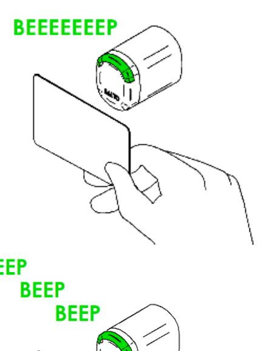

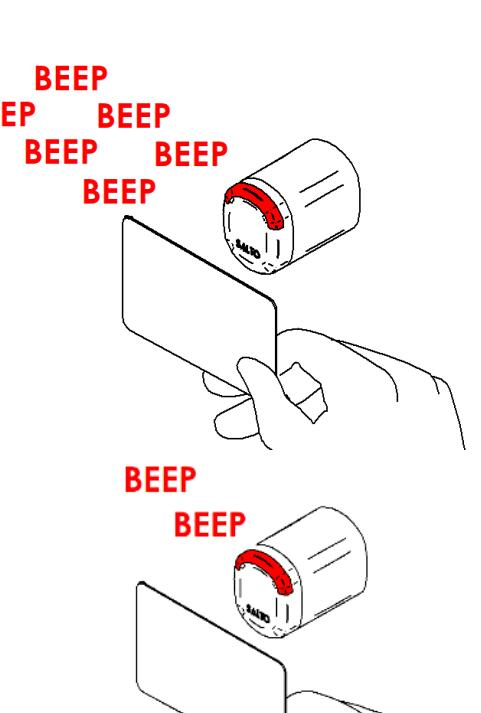

 **8** 

# **ACCESS GRANTED + TOOGLE**

After presenting a valid user card with "TOOGLE" credentials, the SALTO Neo cylinder will start the "TOOGLE" mode. This will be shown by 3 green lights and high pitched beeps.

| 3 Short low pitched beeps | 3 Green lights |
|------------------------------|----------------|

#### **END TOOGLE**

After presenting a valid user card with "TOOGLE" credentials, the SALTO Neo cylinder will end the "TOOGLE" mode. This will be shown by 2 red lights and low pitched beeps.

| 2 Short low pitched beeps | 2 Red lights |
|------------------------------|--------------|

### **SECURITY ERROR**

**.** 

When the cylinder shows continuous blinking light Finished and a combination of high and low pitched beeps and yellow lights, it means that the knob and the cylinder are not paired and they can not be mounted together.

| Short / low pitched beeps | Yellow lights |
|------------------------------|---------------|

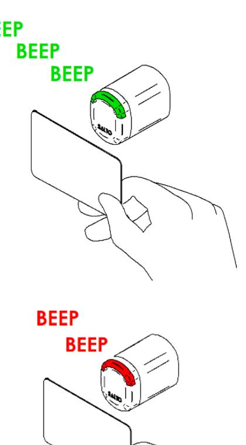

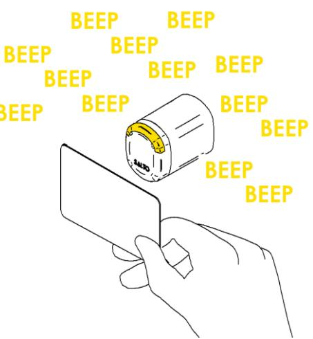

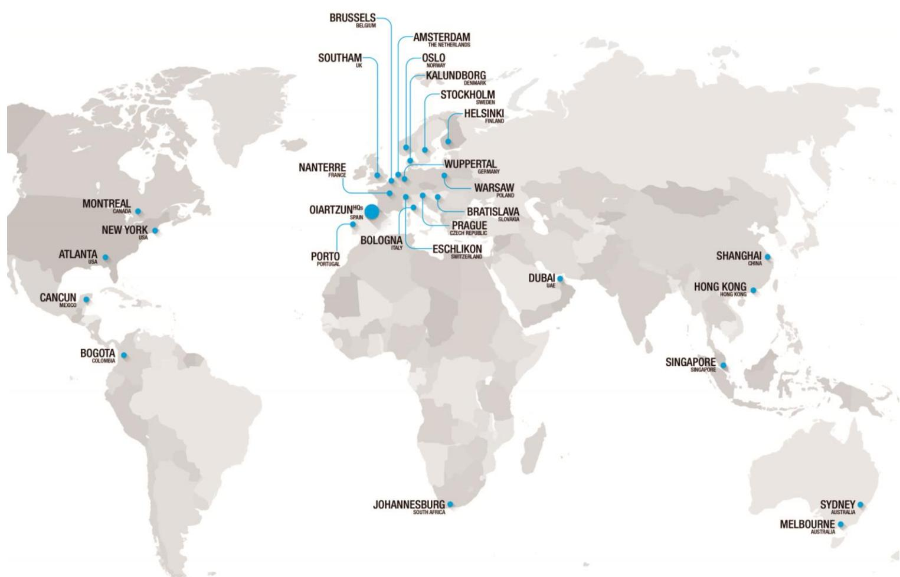

Learn more about innovative SALTO access control technologies through this QR Code using your smartphone to link to the SALTO website. **4DS00045-ED.-23/09/2020**

**4DS00043-ED.-14/01/**

**CONFIDENTIAL -** This document contains confidential and privileged information. The reproduction of any part of the document is strictly prohibited without the prior written consent of SALTO Systems S.L. - © SALTO Systems 2019 SALTO reserves the rights to modify technical specifications, designs and performance without notice*.*