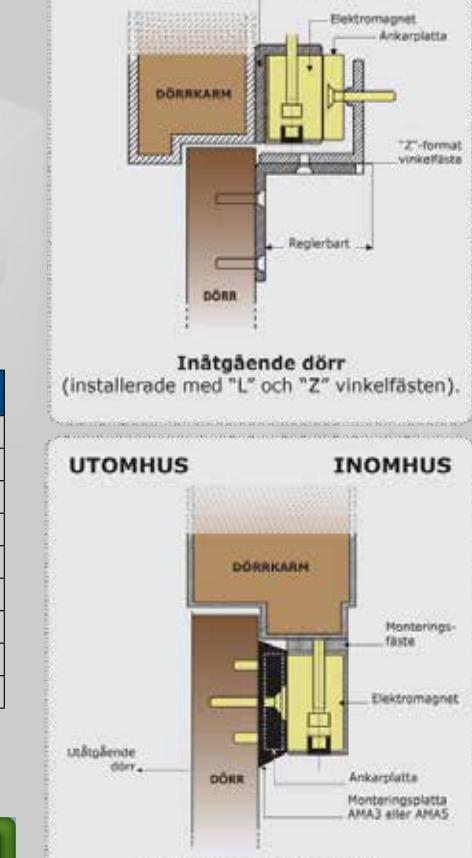

# **V3SR / V4SR / V5SR**

*ELEKTROMAGNETER MED LJUSINDIKERING 300, 400 ELLER 500KG HÅLLKRAFT*

> *The installer's choice*  **cdvi.se**

## **PATENTERADE ELEKTROMAGNETISKA LÅS MED LJUSINDIKERING**

### **V3SR / V4SR / V5SR**

- *> Utanpåliggande montering*
- *> Tydlig ljusindikering av dörrstatus*
	- *rött = låst*
	- *grönt = öppen*
- *> Inbyggd dörrstatus med reläindikering (ersätter magnetkontakt)*
- *> Rekommenderas för inomhusbruk*
- *> Levereras med montagelist och ankarplatta*
- *> Tillverkad i anodiserad aluminium*
- *> 10 års produktgaranti*
- *> Patenterad*

### *Tillval:*

- *V_S = indikerar spänning på - V_SRB = indikering av låst respektive öppet med*
#### Hållkraft:

- V3S-serien = 300kg
- V4S-serien = 400kg
- V5S-serien = 500kg Elektromagnetens dimensioner (L x B x H):

 *summerljud*

- V3S-serien = 254 x 45 x 28mm V4S-serien = 254 x 50 x 29mm
- V5S-serien = 273 x 67 x 41mm
- Ankarplattans dimensioner (L x B x H): V3S-serien = 185 x 38 x 11mm
- V4S-serien = 185 x 45 x 12mm V5S-serien = 185 x 60 x 12mm
- Driftspänning:
- 12/24 VDC (ställbart)
- Strömförbrukning: 12 VDC = 550mA 24 VDC = 275mA
- **V5SRB** 500 kg

**V3SRB** 300 kg

**V4SRB** 400 kg

Commercial Industral

Public Buildings

**Namn Hållkraft Ljus Ljud Relä-**

**V3S** 300 kg - - **V3SR** 300 kg -

**V4S** 400 kg - - **V4SR** 400 kg -

**V5S** 500 kg - - **V5SR** 500 kg -

> Multi-tenant Residential Occupancy

**kontakt**

**CDVI** Sweden AB Datavägen 12B 43632 ASKIM (GÖTEBORG)

Tel: +46 (0)31 760 19 30

*cdvigroup.com cdvi.se*