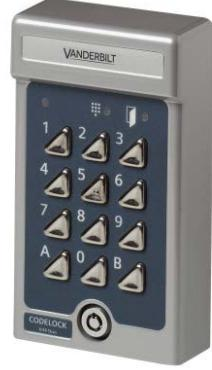

## **V44 Duo** Access Control **Codelock with 30 codes**

- **Programmable codelock for two doors**
- **Sturdy construction for outdoor and indoor use**
- **Alarm output**
- **Up to 20 codes can be used**

The V44 Duo is a programmable codelock for one or two doors. It is possible to set separate codes for each door or the same code for both. V44 Duo also provides the option of door control and alarm output. All programming is done via the keypad. The V44 Duo has a code capacity of 20 four-digit codes and 10 six-digit codes. By using the V44 Duo's tamper switch in combination with the SK5 security unit, it is possible to achieve a higher level of security.

## **Technical data**

|                        | V44 Duo                                     |  |  |
|------------------------|---------------------------------------------|--|--|
| Operating voltage      | 10 to 35 VDC                                |  |  |
|                        | 8 to 24 VAC                                 |  |  |
| Current consumption    | 75 mA in standby                            |  |  |
| Inputs                 | Two exit button requests with delay. Two    |  |  |
|                        | separate for codes disable. Two for door    |  |  |
|                        | contacts. External control of zero opening. |  |  |
| Outputs                | Two voltage-free relay contacts, max. 2 A,  |  |  |
|                        | 28 VDC. Open collector for duress/alert.    |  |  |
|                        | Open collector for door bell. Tamper        |  |  |
|                        | switch for alarm connection (normally       |  |  |
|                        | closed).                                    |  |  |
| Opening time           | 1-99 seconds programmable from keypad       |  |  |
| Door capacity          | 2                                           |  |  |
| Code capacity          | 20 four-digit codes and 10 six-digit codes  |  |  |
| Operating temperature  | -35 to +55 °C                               |  |  |
| Environment            | Indoor or outdoor use (IP54 design).        |  |  |
|                        | In very exposed locations, use SH2          |  |  |
|                        | or SH1 rain cover.                          |  |  |
| IP rating              | IP54                                        |  |  |
| Housing                | Cast metal with stainless steel buttons     |  |  |
|                        | and security lock                           |  |  |
| Colour                 | Grey                                        |  |  |
| Dimensions (W x H x D) | 80 x 140 x 40 mm                            |  |  |

## **Details for ordering**

| Type    | Part no         | Designation            | Weight  |
|---------|-----------------|------------------------|---------|
| V44 Duo | V24246-C3553-A1 | Codelock with 30 codes | 0.75 kg |

Issued by Vanderbilt International (IRL) Ltd. Clonshaugh Business and Technology Park Clonshaugh Dublin 17 Ireland

© 2016 Copyright by Vanderbilt International (IRL) Ltd. Data and design subject to change without notice. Supply subject to availability.

www.vanderbiltindustries.com