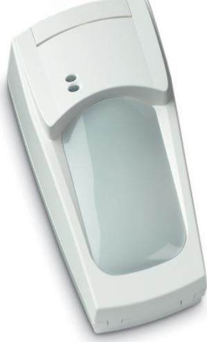
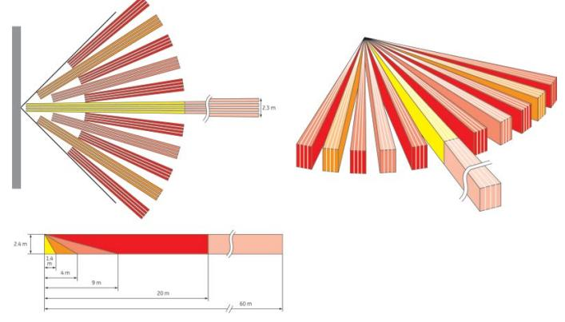

# Produktblad

# VE735

20 m volym + 60 m korridor med VE-teknologi

### Patenterat nytt pyroelement

Med tidigare teknologi för PIR-detektorer har IR-signalerna fångats upp av ett pyroelement som placerats i detektorns fokuseringspunkt. När ett konventionellt pyroelement upptäcker en värmekälla inom bevakningsområdet, skapas en endimensionell signal och närvaro av källan kan detekteras. Detekteringen avgörs vanligen endast av upplösningen hos detektorns optik.

Tack vare den unika konstruktionen av pyroelementet som finns i detektorn, kommer samtliga värmekällor att generera en flerdimensionell signalbild. Signalbilden avslöjar inte bara närvaron av en värmekälla utan även riktningen av densamma. Detekteringsförmågan är direkt en produkt av upplösningen hos optiken och den flerdimensionella signalen från pyroelementet. Resultatet innebär ett stort framsteg inom avancerad PIRdetektering.

## Detektering med DSP-algoritmer

Signalbilden från pyroelementet i VE735 är unik för varje enskild källa. Med hjälp av så kallad DSP-analys kan detektorn avgöra form och karakteristik för varje signalbild, dvs varje signalbild är unik. Inom bevakningsområdet kommer VE735 inte bara att identifiera signalen från en värmekälla, utan tack vare DSP-detekterings algoritmer, även filtrera bort all påverkan från statiska värmekällor. Endast signaler från värmekällor i rörelse kommer att generera larm. Tekniken är unik och har tidigare ej använts för säkerhetsapplikationer.

#### HDO spegeloptik

VE735 har den unika step- och glidande fokusteknolgin, vilket tillsammans med maximal täckning i bevakningsområdet ger högsta säkerhet. Tack vare "High Density Optics" (HDO) spegel, ger VE735 fler och bredare ridåer, utan att storleken på spegel behöver bli större.

Täckningsbilden med 90 graders spegeln och 11 ridåer samt 60 meters räckvidd ger unika möjligheter för att skapa ett effektivt skydd.

### Signalläge

Signalbilden som pyroelementet hos VE735 skapar innehåller unik information om källan vilket innebär att även rörelseriktningen för värmekällan kan bestämmas. Funktionen gör det möjligt att avgöra hur en inkräktare förflyttar sig inom bevakningsområdet. I signalläge kan VE735 till exempel avge larm då en inkräktare rör sig från vänster till höger och likaledes i motsatt riktning.

#### Standardprestanda

- E20 m volymdetektor + 60 m korridor
- EPatenterad pyroelement
- EDetektering med DSP algoritmer
- ESpegel med HDO-optik
- EPlug-in electronics
- EIdentifierar rörelseriktning
- E3 känslighetsnivåer
- EHändelseminne
- EPlug-in elektronik
- EInställningsverktyg med laserteknik
- ESkydd mot bortbrytning och kapslingssabotage
- ETre larmnivåer
- EKan monteras på olika höjd
- EOkänslig för ojämna väggar
- EBortbrytningsskydd

# VE735

# 20 m volym + 60 m korridor med VE-teknologi

Känsligheten för VE735 kan väljas i tre olika nivåer, låg, standard och hög. Känsligheten ställs in genom att välja olika lägen för identifierings-

algoritmer. Det från fabrik förvalda standardläget ger optimal detektering för de flesta applikationer. Känslighetsnivåerna ställs in med hjälp av en bygel på detektorns kretskort.

#### Tillbehör

Som tillbehör till VE735 finns ett inställningsverktyg som arbetar med laserteknik. Verktyget är ett utmärkt hjälpmedel, framförallt då det gäller inställning av detektorns bevakningsområde i långa korridorer.

#### Tekniska data

| Matningsspänning        | 9 till 15 VDC (12 V nominell spänning) |
|-------------------------|----------------------------------------|
| Max rippel              | 2 V (vid 12 VDC)                       |
| Strömförbrukning normal | 11 mA                                  |
| Strömförbrukning larm   | 9 mA                                   |
| Strömförbrukning max    | 15 mA                                  |
| Monteringshögd          | Min 1.8 m max 3.0 m                    |
| Detekteringsförmåga     | 20 cm/sek till 3 m/sek                 |
| Larmutgång              | 80 mA vid 30 VDC max.                  |
| Sabotageutgång          | 100 mA vid 30 VDC max.                 |
| Felutgång               | 80 mA vid 30 VDC max.                  |
| Larmtid                 | 3 sek                                  |
| Uppstartningstid        | 50 sek                                 |
| Drifttemperatur         | -10 °C till +55 °C                     |
| Relativ fuktighet       | Max 95%                                |
| Mått (HxBxD)            | 175 x 93 x 66 mm                       |
| Vikt                    | 275 g                                  |
| Antal ridåer            | 11 vid 20 m + 1 vid 60 m               |
| Täckningsområde         | 86° vid 20 m + 3° vid 60 m             |
| Kapslingsklass          | IP30 / IK02                            |
| SBSC intyg              | 04-668                                 |

#### Order data

| Artikelnummer | Beskrivning                                          |
|---------------|------------------------------------------------------|
| VE735         | 20 m volym + 60 m korridor med VE-teknologi          |
| VE710         | Riktinstrument med laserstråle till VE730-detektorer |

