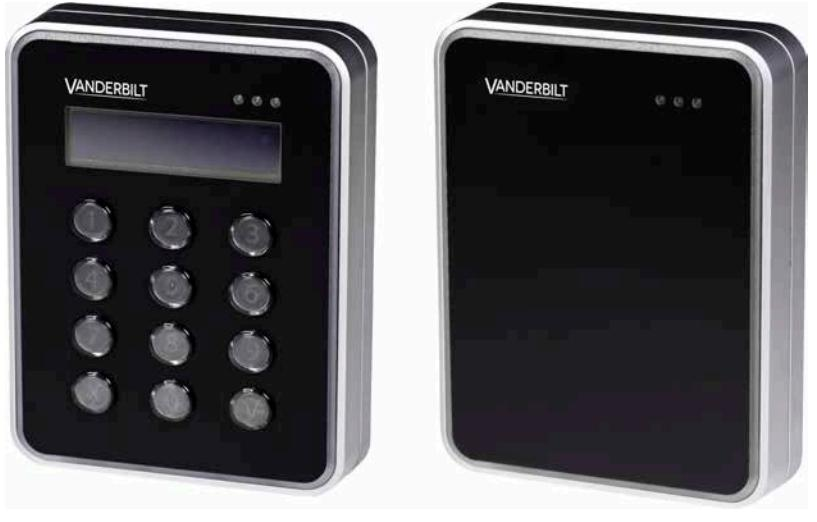

VR4xS-MF VR1xS-MF

# **VR10S-MF VR11S-MF VR40S-MF VR41S-MF**

**Installation och montering**

Version 8.0

**Vanderbilt International (IRL) Ltd.**

Data och konstruktion kan komma att ändras utan föregående meddelande. / Leverans i mån av tillgång.

© 2015 Copyright Vanderbilt International (IRL) Ltd.

Alla rättigheter till detta dokument och till föremålet för det förbehålles. Genom att acceptera dokumentet erkänner mottagaren dessa rättigheter och förbinder sig att inte publicera dokumentet, eller föremålet därför, helt eller delvis, och att inte göra dem tillgängliga för tredje part utan skriftligt tillstånd från oss, och att inte använda dem för något annat syfte än det för vilket de levererats.

Dokumentnr: A-100229-8

### **Innehåll**

| 1 Inledning                                                            | 4  |
|------------------------------------------------------------------------|----|
| 2 Tekniska data                                                        | 5  |
| 3 Säkerhetsföreskrifter                                                | 6  |
| 3.1 Standarder och riktlinjer                                          | 6  |
| 4 Läsarens delar                                                       | 7  |
| 5 Montering och anslutning                                             | 9  |
| 5.1 Läsare med utanpåliggande montage                                  | 10 |
| 5.2 Läsare med utanpåliggande montage och kablar som leds från utsidan | 11 |
| 5.3 Läsare med semi-infällt montage                                    | 13 |
| 5.4 Läsare med semi-infällt montage och med adapterplatta              | 14 |
| 5.5 Ansluta kablarna                                                   | 15 |
| 5.6 Ta isär läsaren                                                    | 17 |
| 6 Standardinställningar                                                | 18 |
| 7 Ansluta kortläsare till SiPass integrated                            | 19 |
| 7.1 Ställa in kortläsarens adress                                      | 19 |
| 8 Avfallshantering                                                     | 21 |

# **1 Inledning**

VR10S-MF, VR11S-MF, VR40S-MF och VR41S-MF är en serie elegant designade kortläsare för moderna säkerhetslösningar. Krypteringen*) sker via ett protokoll som ger hög säkerhet, under förutsättning att kortläsaren och systemet är inställda på säkert läge. När säkert läge är aktiverat kan varken kommunikationen från läsaren eller systemet som den är ansluten till extraheras. De är tillverkade i tåligt material som står emot de flesta väderförhållanden. Läsarna är enkla att montera och ansluta, och kan fästas på en plan yta eller delvis inne i en apparatdosa. De är enkla att rengöra med de flesta typer av rengöringsmedel som är avsedda för hushållsbruk. Alla läsare har en flerfärgad indikeringsram. VR40S-MF och VR41S-MF har dessutom knappsats och display med hög kontrast.

**) Gäller endast SiPass integrated MP2.65 eller senare*

# **2 Tekniska data**

|                           | VR10S-MF Mifare kortläsare standard VR11S-MF Mifare kortläsare standard inkl. UK adapterplatta och förlängningskabel | VR40S-MF Mifare kortläsare standard med knappsats och display VR41S-MF Mifare kortläsare standard med knappsats och display inkl. UK adapterplatta och förlängningskabel |
|---------------------------|----------------------------------------------------------------------------------------------------------------------------------|--------------------------------------------------------------------------------------------------------------------------------------------------------------------------------------------|
| Protokoll                 | OSDP                                                                                                                             | OSDP                                                                                                                                                                                       |
| Gränssnitt till styrenhet | RS485                                                                                                                            | RS485                                                                                                                                                                                      |
| Driftspänning             | 8,5–30,0 VDC                                                                                                                     | 8,5–30,0 VDC                                                                                                                                                                               |
| Strömförbrukning          | DC 12 V 43 mA peak 168 mA DC 24 V 26 mA peak 100 mA                                                                           | DC 12 V 60 mA peak 220 mA DC 24 V 40 mA peak 125 mA                                                                                                                                     |
| Vandalskydd               | Ja                                                                                                                               | Ja                                                                                                                                                                                         |
| Kortteknik                | Mifare                                                                                                                           | Mifare                                                                                                                                                                                     |
| Kortkompatibilitet        | Mifare Classic Mifare Plus Mifare DESfire EV1                                                                              | Mifare Classic Mifare Plus Mifare DESfire EV1                                                                                                                                        |
| Avläsningsavstånd         | Upp till 6 cm                                                                                                                    | Upp till 6 cm                                                                                                                                                                              |
| Indikatorer               | 3 x LED (röd/gul/grön) 1 x summer Flerfärgad indikeringsram                                                                | 3 x LED (röd/gul/grön) 1 x summer Flerfärgad indikeringsram                                                                                                                          |
| Knappsats                 | Nej                                                                                                                              | Ja                                                                                                                                                                                         |
| Display                   | Nej                                                                                                                              | Ja, svartvit grafisk OLED                                                                                                                                                                  |
| Driftstemperatur          | –40 °C till 55 °C*                                                                                                               | –40 °C till 55 °C*                                                                                                                                                                         |
| Skyddsklass               | IP55**                                                                                                                           | IP55**                                                                                                                                                                                     |
| Slagtålighet (IK)         | 08                                                                                                                               | 08                                                                                                                                                                                         |
| Kapsling                  | Infattning i förzinkad metall med front i polykarbonat                                                                        | Infattning i förzinkad metall med front i polykarbonat                                                                                                                                  |
| Färg                      | Svart, matt krom                                                                                                                 | Svart, matt krom                                                                                                                                                                           |
| Mått (B x H x D)          | Utanpåliggande montage: 85 x 114 x 22 Semi-infällt montage: 85 x 114 x 14                                               | Utanpåliggande montage: 85 x 114 x 22 Semi-infällt montage: 85 x 114 x 14                                                                                                         |
| Godkännanden              | CE enligt R&TT- och EMC direktivet                                                                                            | CE enligt R&TT- och EMC direktivet                                                                                                                                                      |

* Gäller endast läsare med utanpåliggande montage. Specifikationen för läsare med semi-infällt montage är –10 till +55°C.

** Gäller endast läsare med utanpåliggande montage. Specifikationen för läsare med semi-infällt montage är IP3X.

# **3 Säkerhetsföreskrifter**

### **Allmänt**

- l Följ alla varningar och instruktioner som är märkta på enheten.
- l Behåll detta dokument som referens.
- l Ta med i beräkningen ytterligare landspecifika, lokala säkerhetsstandarder eller bestämmelser som gäller installation, användning och kassering av produkten.

### **Anspråk och ansvar**

- l Ändra eller modifiera inte enheten på något sätt.
- l Använd endast reservdelar och tillbehör som har godkänts av tillverkaren.

## **3.1 Standarder och riktlinjer**

### **EU-direktiven**

Vanderbilt deklarerar härmed att denna produkt är i överensstämmelse med relevanta krav i direktiv 2004/108/EG om elektromagnetisk kompatibilitet (EMC).

EG-försäkran om överensstämmelse finns tillgänglig via Vanderbilt säljkontor eller:

Vanderbilt International (IRL) Ltd. Clonshaugh Business and Technology Park Clonshaugh Dublin 17 Irland

# **4 Läsarens delar**

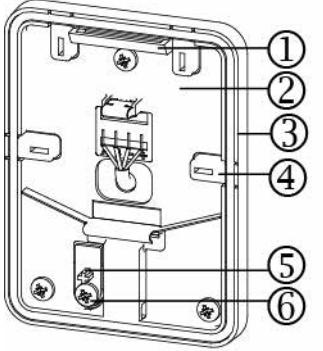

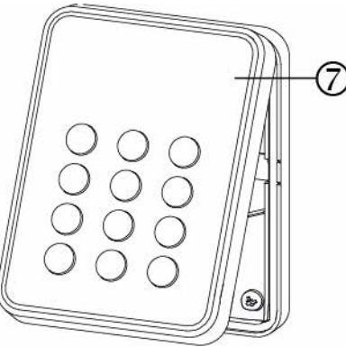

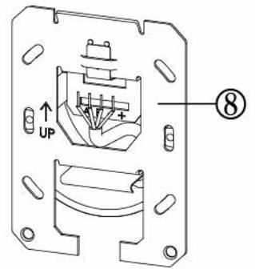

- 
- 
- 
- 
- **5.** Skyddsbas

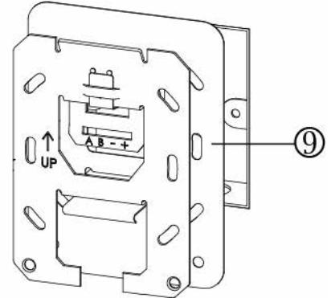

- **1.** Gångjärn **6.** Skruv för att ta bort från vandalskyddet
- **2.** Bas **7** Front
- **3.** Tätningslist **8.** Montageplatta
- **4.** Knock outs x 4 **9.** Adapterplatta (VR11S-MF, VR41S-MF)

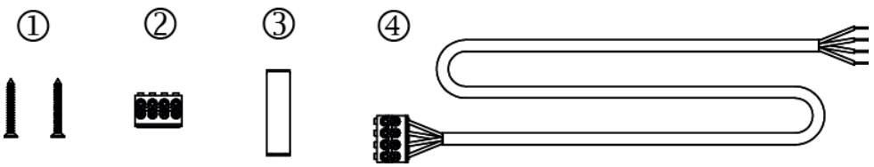

- **1.** Skruvar för montageplatta
- **2.** Kopplingsplint
- **3.** Öppningsverktyg OBS! Detta är en symbolisk illustration.
- **4.** Förlängningskabel (VR11S-MF, VR41S-MF)

# **5 Montering och anslutning**

Läsaren kan monteras på två olika sätt: utanpåliggande och semi-infällt montage. Det finns två olika varianter, beroende på hur ledningarna går eller vilken typ av apparatdosa som används. Läsaren levereras med delar för de båda typerna av montering. Observera att de olika alternativen endast kräver vissa av de olika delarna. Innan du monterar läsaren samlar du ihop de delar som behövs för aktuellt alternativ.

Se respektive sida för:

- l *Läsare med utanpåliggande montage* på sidan 10– Läsaren monteras på basen, som först fästs på väggen.
- l *Läsare med utanpåliggande montage och kablar som leds från utsidan* på sidan 11 – Läsaren monteras på basen och kablarna ansluts via vald knock out.
- l *Läsare med semi-infällt montage* på sidan 13– Läsaren monteras delvis i en apparatdosa i en vägg. Två extra skruvar förhindrar att läsaren vrider sig.
- l *Läsare med semi-infällt montage och med adapterplatta* på sidan 14 Läsaren monteras delvis i en fyrkantig apparatdosa och en adapterplatta används för att bredda monteringsområdet för läsaren.

Du hittar information om anslutning av kablarna till läsaren i avsnittet:

- l *Ansluta kablarna* på sidan 15.
## **5.1 Läsare med utanpåliggande montage**

Använd borr och skruvar som är avsedda för den yta som läsaren ska monteras på. För att läsaren ska sitta ordentligt ska ytan vara plan. Montera basen på väggen:

- **1.** Gör ett litet hål i tätningen. Kablarna leds genom detta hål.
- **2.** Montera basen på väggen med tre skruvar: en upptill i mitten på basen och två nedtill i hörnen på basen.

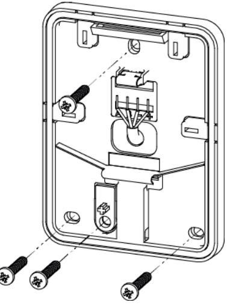

- **3.** Om det är nödvändigt att ta bort vandalskyddet fäster du skruven i hålet under basen på skyddet. Var försiktig så att du inte tar i för hårt.
- **4.** Fortsätt med instruktionerna i avsnittet *Ansluta kablarna* på sidan 15

### **5.2 Läsare med utanpåliggande montage och kablar som leds från utsidan**

Om kablarna ska ledas från utsidan:

- **1.** Ta bort tätningslisten från basen.
- **2.** Se vilket knock out som kablarna ska ledas genom.
- **3.** För in en rak skruvmejsel i fickan på fliken.
- **4.** Slå på skruvmejselns handtag. Då genereras tillräckligt stort tryck för att knock outs ska frigöras.
- **5.** Vinkla fliken med skruvmejseln.

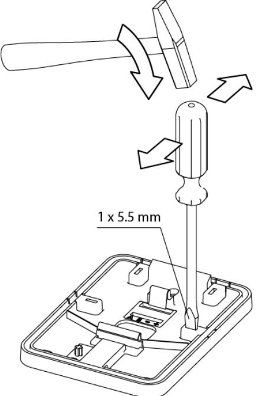

- **6.** Dra bort fliken från basen.
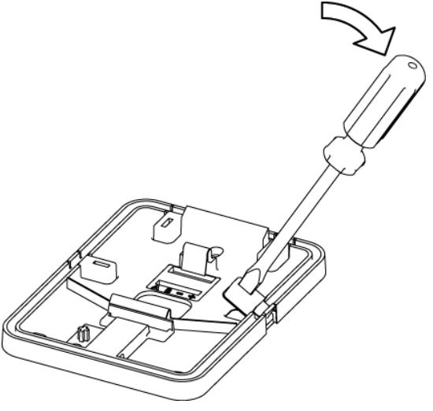

- **7.** Montera basen på väggen med tre skruvar: en upptill i mitten på basen och två nedtill i hörnen på basen.
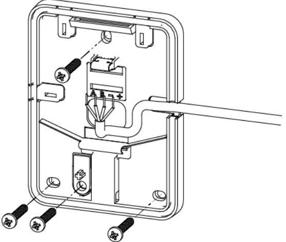

- **8.** Om det är nödvändigt att ta bort vandalskyddet fäster du skruven i hålet under basen på skyddet. Var försiktig så att du inte tar i för hårt.
- **9.** Led kablarna genom öppningen och sätt tillbaka tätningslisten. Fortsätt med instruktionerna i avsnittet *Ansluta kablarna* på sidan 15.

Vi rekommenderar att mellanrummet som skapas av knock outs förseglas. En läsare där fliken har tagits bort har inte skyddsklass IP 55.

## **5.3 Läsare med semi-infällt montage**

Läsaren monteras i en apparatdosa som monteras med två extra skruvar.

- **1.** Montera plattan på apparatdosan.
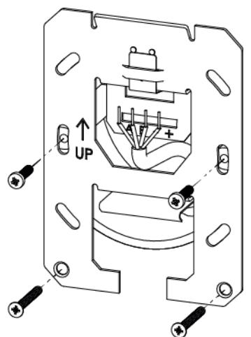

- **2.** Skruva i de extra skruvarna på den nedre delen av plattan för att förhindra att den vrider sig.
Använd endast skruvarna som medföljer för den nedre delen av basen, eftersom de ser till att läsarens front sitter exakt för säker passform i apparatdosan.

- **3.** Fortsätt med instruktionerna i avsnittet *Ansluta kablarna* på sidan 15
## **5.4 Läsare med semi-infällt montage och med adapterplatta**

I vissa fyrkantiga infällnadslådor behöver adapterplattan användas för att bredda monteringsområdet:

- **1.** Placera apparatdosans platta ovanpå adapterplattan.
- **2.** Montera basen och adapterplattan med två skruvar på sidan.

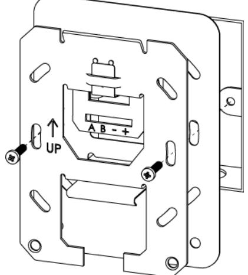

- **3.** Fortsätt med instruktionerna i avsnittet *Ansluta kablarna* på sidan 15

Adapterplattan används för fyrkantiga apparatdosor med måtten 70 mm x 70 mm. Adapterplattan används för vanliga apparatdosor (UK).

## **5.5 Ansluta kablarna**

Använd en skärmad partvinnad kabel (2 par + skärm), till exempel Belden 9502. Kablarna ansluts till respektive indikator. Om en förlängningskabel används är kablarna redan anslutna på kopplingsplinten.

- **1.** Anslut kablarna enligt respektive indikator på kopplingsplinten och basen: **A B +**
- **2.** Snäpp fast kopplingsplinten.

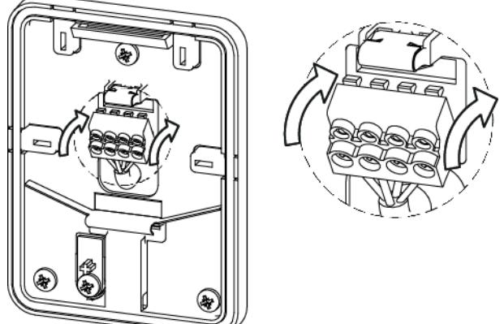

- **3.** Tryck tillbaka kablarna.
- **4.** På frontens baksida finns det en EOL-bygel som används för bussterminering (RS485). (Se bild.) Som standard har läsaren terminering PÅ och fungerar som den *sista* läsaren på bussen. Om det finns en *mellanliggande* läsare på bussen måste bygeln tas bort eller placeras i läge AV.

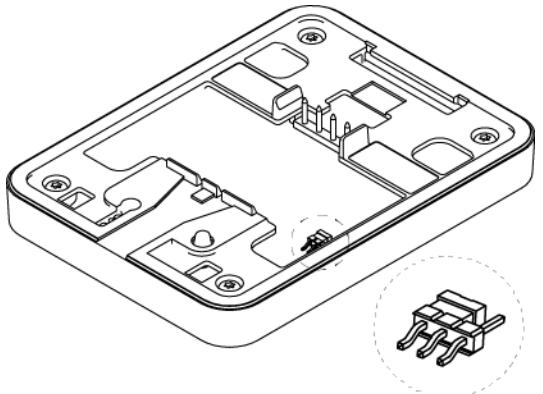

- **5.** Placera läsarens front i vinkel mot gångjärnen på basens övre del.
- **6.** Fäll upp fronten tills låset snäpper på plats ordentligt.
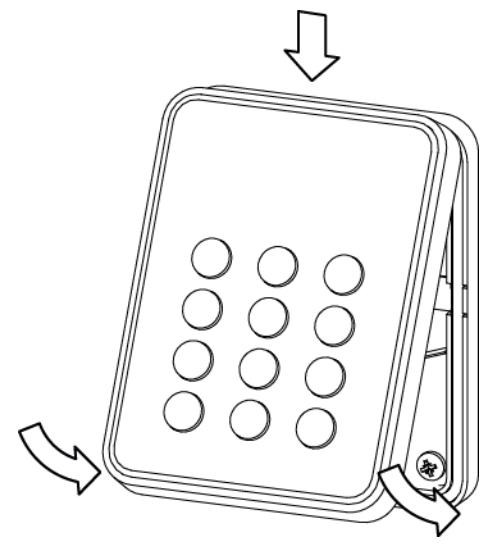

## **5.6 Ta isär läsaren**

Om läsaren måste tas isär:

- **1.** För försiktigt in öppningsverktyget i springan mellan basen och fronten.
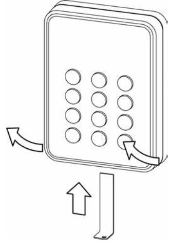

- **2.** Tryck försiktigt och lyft upp basens front.
#### **Ta bort kopplingsplinten:**

- **1.** För in öppningsverktyget enligt bilden.
- **2.** Tryck ner försiktigt och vinkla kopplingsplinten bort från basen.

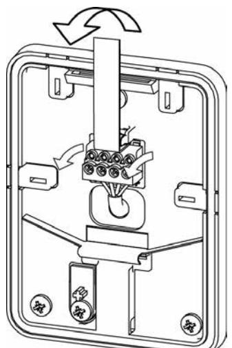

# **6 Standardinställningar**

| Time-out för konfigurationskort | 3 sekunder                                               |
|---------------------------------|----------------------------------------------------------|
| Time-out för displaymeddelanden | 7 sekunder                                               |
| Time-out för aktivering         | 30 sekunder                                              |
| Väntetid för kortavläsning      | 100 ms                                                   |
| Repetition av kort              | Inaktivt                                                 |
| Teckenuppsättning               | Windows 1252                                             |
| Min. bakgrundsbelysning         | 12                                                       |
| Max. bakgrundsbelysning         | 255                                                      |
| Bussadress                      | 0 (stöd för upp till åtta)                               |
| Offlineindikering               | Ja                                                       |
|                                 |                                                          |
| Bakgrundsbelysning              | Alltid aktiv (alternativen aldrig och timer finns också) |
| Summervolym för knapptryckning  | 2                                                        |
| Summervolym för kortläsning     | 2                                                        |
| Systemljud                      | 10                                                       |
| Ljusram följer LED-indikatorer  | Röd, gul, grön                                           |
| Läser MIFARE Classic            | UID                                                      |
| Läser MIFARE Plus SL1 – SL3     | UID                                                      |

Kortläsaren levereras med dessa standardinställningar. Inställningarna kan justeras med Configuration Card Creation Tool (3CT) så att önskade inställningar kan användas. Kontakta leverantören av läsaren om du vill ha ytterligare information.

Läsarna använder FreeRTOS. Du hittar mer information på www.freertos.org.

# **7 Ansluta kortläsare till SiPass integrated**

| RIM (DRI/ERI) |   | VRxx-MF |
|---------------|---|---------|
| 12 V          | ⃡ | +       |
| 0 V           | ⃡ | -       |
| Tx/+          | ⃡ | A       |
| Rx/-          | ⃡ | B       |
|               |   |         |

Anslutning mellan kortläsare och RIM (Reader Interface Module):

## **7.1 Ställa in kortläsarens adress**

Kortläsarna levereras i ett standardläge som anges i *Standardinställningar* på sidan 18. Bussadress för kortläsare med standardinställningar är 0. Slå på en kortläsare i taget för att säkerställa att bussadresserna hamnar i rätt ordning. När du ansluter en kortläsare till en RIM (DRI/ERI) konfigureras kortläsare och bussadress automatiskt enligt följande:

- 1. Den första kortläsaren får bussadress 1.
- 2. Den andra kortläsaren får bussadress 2 och så vidare.

När kortläsaren först slås på blinkar den gula indikatorlampan. Blinkandet slutar när kortläsaren är korrekt konfigurerad till SiPass integrated. Testa genom att hålla ett kort i närheten. En korrekt konfigurerad kortläsare känner av kortet enligt inställningarna för SiPass integrated.

Observera att en ny kortläsare alltid får nästa lediga bussadress. Om en kortläsare med bussadress 5 tas bort och en ny kortläsare installeras, får den nya kortläsaren adress 5.

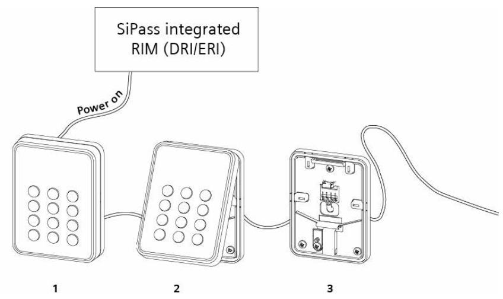

# **8 Avfallshantering**

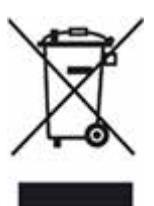

Alla elektriska och elektroniska produkter ska avfallshanteras separat och inte placeras i hushållssoporna. De ska istället avfallshanteras via särskilda statliga eller kommunala uppsamlingsanläggningar.

Symbolen med en överkorsad soptunna på produkten anger att produkten omfattas av 2002/96/EG.

Korrekt avfallshantering och avfallssortering av begagnad utrustning hjälper till att förhindra potentiella negativa konsekvenser för miljö och människors hälsa. Det är en förutsättning för återvinning och återanvändning av begagnad elektrisk och elektronisk utrustning. Mer detaljerad information om avfallshantering av begagnad utrustning kan fås från kommunen, avfallsbolaget eller affären som sålt produkten.

Utgiven av Vanderbilt International (IRL) Ltd. Clonshaugh Business and Technology Park Clonshaugh Dublin 17 Irland www.vanderbiltindustries.com

© 2015 Copyright Vanderbilt International (IRL) Ltd. Data och konstruktion kan komma att ändras utan föregående meddelande. Leverans i mån av tillgång.

Dokumentnr A-100229-8 Utgivningsdatum 2015-10-15