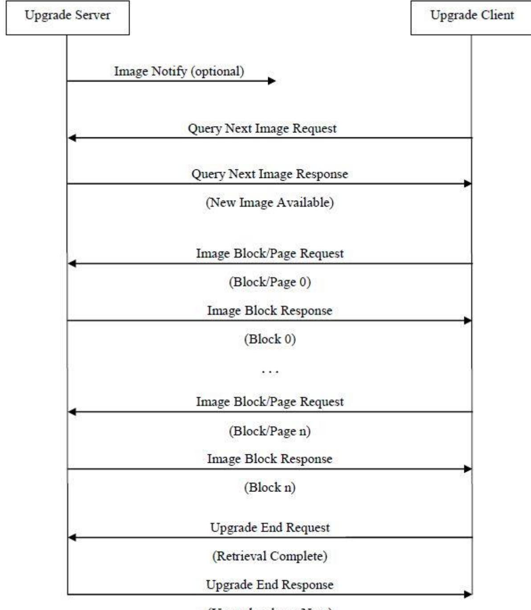
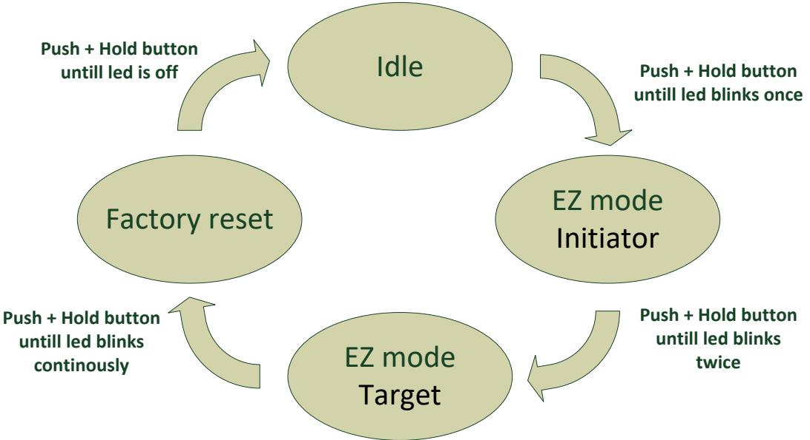

# **Vibration Sensor - WISZB-13x**

# **Technical manual**

Revised 25.02.2021

| 1   | Cautionary notes 5                                               |  |
|-----|------------------------------------------------------------------|--|
| 2   | Features  6                                                      |  |
| 2.1 | Vibration Sensor - WISZB-13x 6                                   |  |
| 2.2 | IAS Zone 6                                                       |  |
| 2.3 | Temperature 6                                                    |  |
| 2.4 | Key features  6                                                  |  |
| 3   | Endpoints7                                                       |  |
| 3.1 | ZigBee Device Object (ZDO)7                                      |  |
| 3.2 | Temperature Sensor7                                              |  |
| 3.3 | IAS Zone7                                                        |  |
| 3.4 | Develco Utility7                                                 |  |
| 4   | Supported Clusters 8                                             |  |
| 4.1 | Common clusters for each end point  8                            |  |
|     | 4.1.1 Basic – Cluster id 0x0000 8                             |  |
|     | 4.1.1.1 Attribute 8                                           |  |
|     | 4.1.2 Identify – Cluster id 0x00039                           |  |
|     | 4.1.2.1 Attribute9                                            |  |
|     | 4.1.2.2 Commands9                                             |  |
| 4.2 | IAS Zone Device – EP 0x2D9                                       |  |
|     | 4.2.1 IAS Zone - Cluster id 0x05009                           |  |
|     | 4.2.1.1 Attribute9                                            |  |
|     | 4.2.1.2 Commands 10                                           |  |
|     | Note: How to clear an alarm in the "Zone status"12               |  |
|     | 4.2.2 Power Configuration - Cluster id 0x000112               |  |
|     | 4.2.2.1 Attribute12                                           |  |
|     | 4.2.3 Poll Control - Cluster id 0x002013                      |  |
|     | 4.2.3.1 Attribute13                                           |  |
|     | 4.2.4 Acceleration Measurement Cluster - Cluster id 0xFC04 13 |  |
|     | 4.2.4.1 Attribute 14                                          |  |

| 4.3 |         | Temperature Sensor Device – EP 0x26 14         |  |
|-----|---------|------------------------------------------------|--|
|     | 4.3.1   | Temperature Measurement – Cluster id 0x0402 14 |  |
|     | 4.3.1.1 | Attribute 14                                   |  |
|     | 4.3.2   | OTA Upgrade – Cluster id 0x0019 15             |  |
|     | 4.3.2.1 | Attributes  15                                 |  |
|     | 4.3.2.2 | Commands 16                                    |  |
|     | 4.3.2.3 | OTA Upgrade Messages Diagram 17                |  |
|     | 4.3.3   | Time – Cluster id 0x000A 18                    |  |
|     | 4.3.3.1 | Attribute 18                                   |  |
| 5   |         | MMI user guide 19                              |  |
| 5.1 |         | Push Button Menu 19                            |  |
|     | 5.1.1   | EZ mode - Initiator 19                         |  |
|     | 5.1.2   | EZ mode - Target20                             |  |
|     | 5.1.3   | Factory reset20                                |  |
| 5.2 |         | Action on Power On20                           |  |
| 6   |         | General network behaviour 21                   |  |
| 6.1 |         | Installation 21                                |  |
| 6.2 |         | Normal – Keep alive21                          |  |
|     | 6.2.1   | Network lost21                                 |  |
| 6.3 |         | Low battery22                                  |  |
| 7   |         | Specifications 23                              |  |
| 8   |         | Contact Information 24                         |  |

Copyright © Develco Products A/S

All rights reserved.

Develco Products assumes no responsibility for any errors, which may appear in this manual. Furthermore, Develco Products reserves the right to alter the hardware, software, and/or specifications detailed herein at any time without notice, and Develco Products does not make any commitment to update the information contained herein.

All the trademarks listed herein are owned by their respective owners.

## **1 Cautionary notes**

Develco Products A/S reserves the right to make changes to any product to improve reliability without further notice. Develco Products A/S does not assume any liability arising out of the application or use of any product or circuit described herein; neither does it convey any license under patent rights or the rights of third parties.

# **2 Features**

### **2.1 Vibration Sensor - WISZB-13x**

The Zigbee-based Vibration Sensor detects and reports vibrations making it ideal for use in home care, smart security, and building management solutions. Home and business owners can have the peace of mind that they will be notified of any shattered windows or glass counters, helping them prevent break-ins and burglaries.

Home care solutions can keep an eye on their patients' health by placing the sensor on furniture at home. Placed underneath a bed, the Vibration sensor can monitor how long patients are in bed and how well they sleep, giving insights into their well-being and recognizing potential illnesses. Similarly, the Vibration Sensor can be installed on chairs and appliances to monitor activity.

Building managers can use the Vibration Sensor to keep an eye on hard-to-reach piping, helping them detect vibration in pipings. This way, they can quickly identify blockages, abnormal water pressure, among other issues.

### **2.2 IAS Zone**

The Vibration Sensor is implemented as a IAS Zone ZigBee end point according to ZigBee Home Automation profile "IAS Zone".

### **2.3 Temperature**

The temperature sensor measures temperature with a resolution of 0.1°C. It supports standard ZigBee reporting (on change or interval). The end point is configured as the Home Automation profile "Temperature Sensor"

### **2.4 Key features**

Key features are:

- Alarm sensor IAS Zone
- Support 15 sensitivity levels
- Temperature sensor
- ZigBee OTA cluster for firmware upgrades
- ZigBee 3.0 Certified application profile
- RoHS compliant according to the EU Directive 2002/95/EC
- Standard ZigBee Home Automation security and stack settings are used

# **3 Endpoints**

The device implements the following standard HA devices on different end points.

### **3.1 ZigBee Device Object (ZDO)**

- End point number 0x00
- Application profile Id 0x0000
- Application device Id 0x0000
- Supports all mandatory clusters

### **3.2 Temperature Sensor**

- End point number 0x26
- Application profile Id 0x0104 (Home Automation)
- Application device Id 0x0302

### **3.3 IAS Zone**

- End point number 0x2D
- Application profile Id 0x0104 (Home Automation)
- Application device Id 0x0402

### **3.4 Develco Utility**

- Application profile Id 0xC0C9 (Develco Products private profile)
- Application device Id 0x0001
- Manufactor code for Develco Products is 0x1015
- Private profile for internal Develco Products use only.

### **Reference documents:**

053474r18ZB_CSG-ZigBee-Specification.pdf 075123r03ZB_AFG-ZigBee_Cluster_Library_Specification.pdf 053520r27ZB_HA_PTG-Home-Automation-Profile.pdf 075356r15ZB_ZSE-ZSE-AMI_Profile_Specification.pdf

They can all be downloaded from : <http://www.zigbee.org/Products/DownloadZigBeeTechnicalDocuments.aspx>

# **4 Supported Clusters**

### **4.1 Common clusters for each end point**

The ZCL "General Function Domain" clusters in this section are implemented as server clusters. Refer to ZigBee Cluster Library Specification. <http://www.zigbee.org/Specifications.aspx>

### **4.1.1 Basic – Cluster id 0x0000**

Only the first set has mandatory attributes, also the optional attributes that can be relevant to a Develco device are all in set 0x000.

#### **4.1.1.1 Attribute**

| Id# | Name             | Type       | Range      | Man/Opt | Relevance and ref. |
|-----|------------------|------------|------------|---------|--------------------|
| 0x0 | ZCLVersion       | Uint8      | Type range | M       |                    |
| 0x4 | ManufacturerName | String     | 0-32 byte  | O       | 4.1.1.1.1          |
| 0x5 | ModelIdentifier  | String     | 0-32 byte  | O       | 4.1.1.1.2          |
| 0x6 | DateCode         | String     | 0-32 byte  | O       |                    |
| 0x7 | PowerSource      | 8 bit enum | Type range | M       |                    |

#### **4.1.1.1.1 ManufacturerName**

"Develco Products A/S"

#### **4.1.1.1.2 ModelIdentifier**

"WISZB-137"

#### **4.1.1.1.3 Manufacture Specific Attribute**

| Id#    | Name                       | Type        | Range | Man/Opt | Relevance and ref. |
|--------|----------------------------|-------------|-------|---------|--------------------|
| 0x8000 | PrimarySwVersion           | OctetString |       | M       | SW version         |
| 0x8010 | PrimaryBootloaderSWVersion | OctetString |       | M       | SW version         |
| 0x8020 | PrimaryHwVersion           | OctetString |       | M       | HW version         |

ZCL header setting – Manufacture code for Develco Products is 0x1015

### **4.1.2 Identify – Cluster id 0x0003**

#### **4.1.2.1 Attribute**

| Id#    | Name         | Type   | Range      | Man/Opt | Relevance and ref. |
|--------|--------------|--------|------------|---------|--------------------|
| 0x0000 | IdentifyTime | Uint16 | Type range | M       |                    |

#### **4.1.2.2 Commands**

The identify cluster has 2 commands as server.

| Id#  | Name           | Payload                          | Man/Opt | Relevance and ref. |
|------|----------------|----------------------------------|---------|--------------------|
| 0x00 | Identify       | Uint16 - Identify Time (seconds) | M       | 0x00               |
| 0x01 | Identify Query | none                             | M       | 0x01               |

The identify cluster has 1 command as client.

| Id#  | Name                    | Payload                          | Man/Opt | Relevance and ref. |
|------|-------------------------|----------------------------------|---------|--------------------|
| 0x00 | Identify Query Response | Uint16 - Identify Time (seconds) | M       | 0x00               |

### **4.2 IAS Zone Device – EP 0x2D**

### **4.2.1 IAS Zone - Cluster id 0x0500**

The IAS Zone cluster is described in ZigBee Cluster Library Specification.

#### **4.2.1.1 Attribute**

| Id#    | Name        | Type        | Man/Opt | Relevance and ref.              |  |  |
|--------|-------------|-------------|---------|---------------------------------|--|--|
| 0x0000 | Zone State  | 8-bit       | M       |                                 |  |  |
|        |             | Enumeration |         |                                 |  |  |
| 0x0001 | Zone Type   | 16-bit      | M       | Hard coded to 0x002D            |  |  |
|        |             | Enumeration |         | Vibration Movement Sensor       |  |  |
| 0x0002 | Zone Status | Uint16      |         | The following bits are |  |  |
|        |             |             |         | supported:                      |  |  |
|        |             |             |         | Bit0: Alarm 1 (Movement)        |  |  |
|        |             |             | M       | Bit1: Alarm 2 (Vibration)       |  |  |
|        |             |             |         | Bit3: Battery                   |  |  |
|        |             |             |         | Bit4: Supervision reports       |  |  |
|        |             |             |         | Bit5: Restore reports           |  |  |

| 0x0010 | IAS CIE Address                                | Valid 64-bit IEEE address | M |                        |
|--------|------------------------------------------------|------------------------------|---|------------------------|
| 0x0011 | ZoneID                                         | Uint8                        | M |                        |
| 0x0012 | Number Of Zone Sensitivity Levels Supported | Uint8                        | O |                        |
| 0x0013 | Current Zone Sensitivity Level        | Uint8                        | O | Default level is 10    |
| 0x8000 | Zone Status Interval                           | Uint16                       | O | Pre-defined to 300 sec |

#### **4.2.1.1.1 Zone State**

The device will automatically start to scan the network for an IAS Zone client in a predefine interval. When the client is found it will automatically attempt to enrol. When it has successfully enrolled the Zone Status command is send every 5 minutes.

The attribute value will change from not enrolled (0x00) to Enrolled (0x01).

#### **4.2.1.1.2 IAS CIE Address**

Attribute specifies the address that commands generated by the server shall be sent to.

To un-enrol the device the back end system has to write a new address into this attribute. Any value is valid. If the back end system writes an IEEE address then it will try to enrol to this devices represented by the IEEE address.

#### **4.2.1.1.3 ZoneID**

A unique reference number allocated by the CIE at zone enrolment time.

Used by IAS devices to reference specific zones when communicating with the CIE. The *ZoneID* of each zone stays fixed until that zone is un-enrolled.

#### **4.2.1.1.4 Number of Zone sensitivity levels supported**

The vibration sensor supports 15 different pre-defined vibration sensitivity levels.

#### **4.2.1.1.5 Current Zone sensitivity levels**

Attribute to read/write a user defined sensitivity level.

#### **4.2.1.2 Commands**

The IAS Zone cluster has 2 commands as server.

| Id#  | Name                               | Payload           |    |    | Man/Opt | Relevance and ref.                                        |
|------|------------------------------------|-------------------|----|----|---------|-----------------------------------------------------------|
| 0x00 | Zone Status Change Notification | Uint16 – bit mask |    |    | M       | The status is report to the coordinator every 5 min |
| 0x01 | Zone Enroll Request                | Bits              | 16 | 16 | M       |                                                           |

Develco Products A/S Tangen 6 http://develcoproducts.com DK-8200 Aarhus N info@develcoproducts.com

| Data type | 16 bit enum | UINT16       |  |
|-----------|-------------|--------------|--|
| Field     | Zone        | Manufacturer |  |
| name      | type        | code         |  |

Init sequence – when the device has join the network it start to scan for an IAS zone client cluster. If a client is found a Zone enroll request command is send and a Zone Enroll response is expected. If it doesn't receive a response within 15 sec it gives up and will continue to scan x number of attempts. When the init sequence is over it will enter a state where it scans for a client every 12 hour.

#### The following bits are supported in Zone status:

Bit0: Alarm 1, Bit1: Alarm 2, Bit3: Battery, Bit4: Supervision reports, Bit5: Restore reports

Alarm bit

Bit0, Alarm1 – Movement – Since last position Bit1, Alarm2 – Vibration – Acceleration trigger

The sensor will report Zone status when there are new events or every 5 min (default).

The sensitivity of the Accelerometer trig settings is listed in the table below.

|       | Alarm 2                        |          | Alarm 1                          |             |
|-------|--------------------------------|----------|----------------------------------|-------------|
|       | (Vibration - acc int trigger)  |          | (Movement - since last position) |             |
| Level | ODR (Output data rate) [Hz] | Duration | Wakeup TH [mg]                   | Movement TH |
| 1     | 25                             | 2        | 32                               | 36          |
| 2     | 25                             | 2        | 16                               | 32          |
| 3     | 25                             | 2        | 8                                | 28          |
| 4     | 25                             | 2        | 4                                | 24          |
| 5     | 25                             | 2        | 2                                | 20          |
| 6     | 25                             | 2        | 1                                | 16          |
| 7     | 25                             | 0        | 32                               | 36          |
| 8     | 25                             | 0        | 16                               | 32          |
| 9     | 25                             | 0        | 8                                | 28          |
| 10    | 25                             | 0        | 4                                | 24          |
| 11    | 25                             | 0        | 2                                | 20          |
| 12    | 25                             | 0        | 1                                | 16          |
| 131   | 50                             | 0        | 1                                | 16          |
| 141   | 100                            | 0        | 1                                | 16          |
| 151   | 200                            | 0        | 1                                | 16          |

"Vibration" is more sensitive the lower the "Duration" and the "WU TH"

"Movement" is more sensitive the lower the "Movement TH", it is set when an absolute change is detected from last reading larger than the TH.

Note: How to clear an alarm in the "Zone status"

The sensor requests ZCL Default Response on the Zone Status Change notification, if any new Alarm bit has been set. Until the IAS CIE has acknowledged the received alarm by sending the mandated Default Response, the Alarm bits are not cleared – even if there is no longer an alarm situation. When the Default Response is received, a new Zone Status Change notification is sent with the Alarm bits cleared, if the alarm situation has disappeared since sending the Zone Status message with alarm set.

Bit3: When the battery is below **2.2 VDC.** Battery bit is set high and "Zone Status" is transmitted to the coordinator.

### **4.2.2 Power Configuration - Cluster id 0x0001**

The power configuration cluster is described in ZigBee Cluster Library Specification

| Id#    | Name                 | Type  | Range       | Man/Opt | Relevance and ref.                     |
|--------|----------------------|-------|-------------|---------|----------------------------------------|
| 0x0020 | BatteryVoltage       | Uint8 | 0x00 - 0xFF | O       | ZCL configure reporting is supported   |
| 0x0031 | BatterySize          | enum8 | AAA         | O       |                                        |
|        |                      |       | (0x04)      |         |                                        |
| 0x0033 | BatteryQuantity      | Uint8 | 2           | O       |                                        |
| 0x0034 | BatteryRatedVoltage  | Uint8 | 1500        | O       | Unit is in 100 mV                      |
| 0x0036 | BatteryVoltageMinThr | Uint8 | 25          |         | Unit is in 100 mV                      |
|        | eshold               |       |             |         |                                        |
| 0x003E | BatteryAlarmState    | Map32 |             | O       | Bit0: BatteryVoltageMinThreshold       |
|        |                      |       |             |         | Is set if BatteryVoltage has been      |
|        |                      |       |             |         | below BatteryVoltageMinThreshold    |
|        |                      |       |             |         | or other internal circuits has deemed  |
|        |                      |       |             |         | the supply to be inadequate.           |
|        |                      |       |             |         | This bit will only reset after a power |
|        |                      |       |             |         | cycle.                                 |
|        |                      |       |             |         | The condition will also be shown on    |
|        |                      |       |             |         | the MMI LED, see MMI description.      |
|        |                      |       |             |         | Reportable. Default Min 12 hours, max  |
|        |                      |       |             |         | 12 hours                               |

#### **4.2.2.1 Attribute**

Note: The attribute "*BatteryVoltage*" is measuring the battery voltage, in units of 100mV.

### **4.2.3 Poll Control - Cluster id 0x0020**

The poll control cluster is described in ZigBee Cluster Library Specification

This cluster provides a mechanism for the management of an end device's MAC Data Request rate. For the purposes of this cluster, the term "poll" always refers to the sending of a MAC Data Request from the end device to the end device's parent.

This cluster can be used for instance by a configuration device to make an end device responsive for a certain period of time so that the device can be managed by the controller.

| Id#    | Name              | Type   | Range       | Man/Opt | Relevance and ref.                      |
|--------|-------------------|--------|-------------|---------|-----------------------------------------|
| 0x0000 | Check-inInterval  | Uint32 | 0x00 - 0xFF | M       | Default value is 1 hour                 |
| 0x0001 | LongPoll Interval | Uint32 |             | M       | Default value is disabled               |
| 0x0002 | ShortPollInterval | Uint16 |             | M       | Default value is 0.5 seconds         |
| 0x0003 | FastPollTimeout   | Uint16 |             | M       | Default value is 10 seconds |

#### **4.2.3.1 Attribute**

Start up, auto scan for client poll control cluster on the coordinator. If it is support on the coordinator an auto bind is created and the smoke sensor will send a check-in command in the interval specified in attribute "CheckinInterval. The coordinator has to reply with a check-in response. The sensor supports the following commands send from the client (Typically the coordinator).

- 0x00 Check-in Response,
- 0x01 Fast Poll Stop,

- 0x02 Set Long Poll Interval,
- 0x03 Set Short Poll Interval,

If it doesn't find a poll client it will search again periodically.

### **4.2.4 Acceleration Measurement Cluster - Cluster id 0xFC04**

The Vibration Sensor includes a manufacturer specific cluster for reading the XYZ acceleration/orientation of the sensor. The cluster is under the manufacturer code for Develco Products (0x1015).

All measurements are in the value of g where g is referred to as the acceleration of gravity. Its value is 9.8 m/s2 on Earth. The resolution is in mg = g/1000.

| Id#    | Name                      | Type   | Unit        | Man/Opt | Relevance and ref.   |
|--------|---------------------------|--------|-------------|---------|----------------------|
| 0x0000 | Measured Value X          | Int16  | Unit g/1000 | O       | Value in mg (g/1000) |
| 0x0001 | Measured Value Y          | Int16  | Unit g/1000 | O       | Value in mg          |
| 0x0002 | Measured Value Z          | Int16  | Unit g/1000 | O       | Value in mg          |
| 0x0003 | Min Measured Value XYZ | Int16  | Unit g/1000 | O       | -2000 mg             |
| 0x0004 | Max Measured Value XYZ | Int16  | Unit g/1000 | O       | +2000 mg             |
| 0x0005 | Resolution XYZ            | Uint16 | Unit g/1000 | O       | 1 mg                 |

#### **4.2.4.1 Attribute**

The XYZ readings are read /updated on vibration interrupt and again 5 seconds after. If no vibrations are detected for 30 seconds,

Then XYZ is also read. as a result, it may take up to 30 seconds to detect movement if the vibration TH is set high and the movement is slow.

The attributes on the Acceleration measurement cluster, is meant to have given indication about the sensor positions/orientation, and as development support. And the attributes can be setup to report changes using standard ZigBee attribute reporting.

It is recommended that reporting of XYZ is configured with reasonable parameters, to avoid over transmitting data. Example report configuration (min report 1-5, max report 60-600, change >20)

### **4.3 Temperature Sensor Device – EP 0x26**

The ZCL "Measurement and Sensing" cluster in this section is implemented as a server cluster. Refer to ZigBee Cluster Library Specification.

#### **4.3.1 Temperature Measurement – Cluster id 0x0402**

The temperature measurement cluster is described in ZigBee Cluster Library Specification section 4.4.

#### **4.3.1.1 Attribute**

| Id#    | Name             | type   | Range                   | Man/Opt | Relevance and ref.                                   |
|--------|------------------|--------|-------------------------|---------|------------------------------------------------------|
| 0x0000 | MeasuredValue    | Sint16 | MinValue to MaxValue | M       | ZCL Reporting is support DP default is configured |
| 0x0001 | MinMeasuredValue | Sint16 | 0                       | M       |                                                      |
| 0x0002 | MaxMeasuredValue | Sint16 | 5000                    | M       |                                                      |

Develco Products A/S Tangen 6 http://develcoproducts.com DK-8200 Aarhus N info@develcoproducts.com

#### **4.3.1.1.1 MeasuredValue**

The attribute is configured with the following default "ZCL configure reporting" setting.

- Min Reporting Interval: 0x003C [60 sec]
- Max Reporting Interval: 0x0258 [600 sec]
- Reportable Change: 0x000A [0.1 °C]

If the temperature value is stable it will be send every 10 minutes.

If the temperature changes more than 0.1 °C it will be reported but not faster than every 1 minute since last reporting value.

Note: Min reporting interval 0 sec is invalid when reportable change is configured.

#### **4.3.1.1.2 MinMeasuredValue**

The temperature sensor is NOT supporting temperature measurements below 0 degrees Celsius.

#### **4.3.1.1.3 MaxMeasuredValue**

The temperature sensor is NOT supporting temperature measurements above 50 degrees Celsius.

### **4.3.2 OTA Upgrade – Cluster id 0x0019**

The cluster provides a ZigBee standard way to upgrade devices in the network via OTA messages. The devices support the client side of the cluster.

When the devices has joined a network it will automatically auto scan for a OTA upgrade server in the network. If it finds a server an auto bind is created and ones every 24 hour it will automatically send its "current file version" to the OTA upgrade server. It is the server that initiate the firmware upgrade process.

#### **4.3.2.1 Attributes**

| Id#    | Name                         | Type    | Range        | Man/Opt | Relevance and ref. |
|--------|------------------------------|---------|--------------|---------|--------------------|
| 0x0000 | UpgradeServerID              | IEEE    | -            | M       |                    |
|        |                              | Address |              |         |                    |
| 0x0001 | FileOffset                   | Uint32  | Type range   | O       |                    |
| 0x0002 | CurrentFileVersion           | Uint32  | Type range   | O       |                    |
| 0x0003 | CurrentZigBeeStackVersion    | Uint16  | Type range   | O       |                    |
| 0x0004 | DownloadedFileVersion        | Uint32  | Type range   | O       |                    |
| 0x0005 | DownloadedZigBeeStackVersion | Uint16  | Type range   | M       |                    |
| 0x0006 | ImageUpgradeStatus           | 8 bit   | 0x00 to 0xFF | O       |                    |
|        |                              | enum    |              |         |                    |
| 0x0007 | Manufacturer ID              | Uint16  | Type range   | O       |                    |
| 0x0008 | Image Type ID                | Uint16  | Type range   | O       |                    |

| 0x0009 | MinimumBlockRequestDelay | Uint16 | Type range | O |  |
|--------|--------------------------|--------|------------|---|--|

Above attribute description is to be found in section 6.7 "OTA Cluster Attributes" in ZigBee document – "zigbeeota-upgrade-cluster-specification" provided by the ZigBee alliance.

#### **4.3.2.2 Commands**

The OTA Client cluster can send the following commands

| Id#  | Name                     | Man/Op t |             | Relevance and ref. |         |         |
|------|--------------------------|-------------|-------------|--------------------|---------|---------|
| 0x01 | Query Next Image request | M           | 6.10.1      | OTA                | Cluster | Command |
|      |                          |             | Identifiers |                    |         |         |
| 0x03 | Image Block Request      | M           | 6.10.1      | OTA                | Cluster | Command |
|      |                          |             | Identifiers |                    |         |         |
| 0x06 | Upgrade End Request      | M           | 6.10.1      | OTA                | Cluster | Command |
|      |                          |             | Identifiers |                    |         |         |

#### **4.3.2.3 OTA Upgrade Messages Diagram**

### **4.3.3 Time – Cluster id 0x000A**

The Time cluster is a general cluster for time it is based on a UTC time in seconds since 0 hrs 0 mins 0 sec on 1st January 2000. Refer to [Z2] for ZigBee specification of the time cluster.

The device will use this clusters as a client – provided that a suitable Time Server is available on the network (most likely on the Gateway).

#### **4.3.3.1 Attribute**

| Id#    | Name       | type         | Range      | Man/Opt | Relevance and ref.            |
|--------|------------|--------------|------------|---------|-------------------------------|
| 0x0000 | Time       | UTCTime      | Type range | M       | The module will         |
|        |            | (Uint32)     |            |         | periodically update its |
|        |            |              |            |         | clock by synchronizing  |
|        |            |              |            |         | through this cluster          |
| 0x0001 | TimeStatus | 8 bit bitmap | 00000xxx   | M       |                               |

# **5 MMI user guide**

### **5.1 Push Button Menu**

Pushing the button on a device provides the user with several possibilities.

Pushing the button for longer (push, hold for a few seconds, and release) allows the user to set the device into a desired mode. A mode change happens at 5 second interval. Below, these modes are illustrated in a state chart. 

When cycling through the menu modes, the state is indicated by a number of 100ms blinks on the LED. The device is supporting the ZigBee standardized EZ- mode Commissioning.

### **5.1.1 EZ mode - Initiator**

If the devices is not on the network EZ-Mode Network Steering is invoked when the user enter this menu. The led blinks once every 1 sec until the devices has joined the network. If the device was already on the network it will broadcast the PermitJoin messages. It is the trust center policy that decides if the device is allowed to join the network.

When the device has joined the network EZ-Mode Finding and Binding is invoked and the device start to blink every 3 sec until a cluster match is found. When a match is found or the cluster examine is finished the blinking stops and the device sends a messages to the target device to stop the identify time.

The following clusters are support in EZ-mode finding and binding:

- Temperature cluster
- Power configuration cluster
The EZ-mode time is hard coded to 3 minutes. This is the Minimum and recommended PermitJoin time broadcast for EZ-Mode Network Steering and minimum IdentifyTime set for EZ-Mode Finding and Binding. If the user enters the menu again another 3 minutes is started.

### **5.1.2 EZ mode - Target**

If the devices is not on the network EZ-Mode Network Steering is invoked when the user enter this menu. The led blinks twice every 1 sec until the devices has joined the network. If the device was already on the network it will broadcast the PermitJoin messages. It is the trust center policy that decides if the device is allowed to join the network.

When the device has joined the network identify mode is invoke and the device start to blink twice every 3 sec until identify mode is stopped or after the EZ-mode time has expired. If the user enters the menu again another 3 minutes is started.

### **5.1.3 Factory reset**

To allow a device to join a network, one either has to power up a device that has not previously joined a network or push the button until the Reset To Factory default mode is indicated – and subsequently release the button. This will cause the device to reset to its factory default state and scan for a suitable coordinator.

### **5.2 Action on Power On**

As a general rule, all end devices and routers that have not previously joined a network (or have been reset to factory default) will start up and search for a network with join permit open. In this mode, the LED will flash once every second.

Once the device has joined the network, is will start scanning for an OTA server, Time server, Poll control client and an IAS Zone client.

If a device has joined a network and is powered down, it will attempt to rejoin this network upon power up. For the first 30 seconds hereafter, the device will be available for communication. This time can be expanded using the poll control cluster functionality.

# **6 General network behaviour**

### **6.1 Installation**

When the device is virgin and powered for the first time it will start looking for a ZigBee PAN Coordinator or router to join. The device will scan each ZigBee channel starting from 11 to 24. The LED will flash once every second until it joins a device.

| #Scan mode - 1                      | #Sleep mode                    | #Scan mode - 2                  | #Sleep mode                    | #Scan mode - 2                  |
|-------------------------------------|--------------------------------|---------------------------------|--------------------------------|---------------------------------|
| Scan all 16 ZigBee                  | MCU is in sleep                | Scan all 16 ZigBee              | MCU is in sleep                | Scan all 16 ZigBee              |
| channel until join network or 15 | mode (Radio off) 15 minutes | ch x 4 or until join network | mode (Radio off) 15 minutes | ch x 4 or until join network |
| minutes                             |                                | ~ 30 seconds                    |                                | ~ 30 seconds                    |

The device will start up using scan mode 1. To increase battery lifetime when the device is joining a network for the first time a scan mode 2 will be used after scan mode 1 has expired. Scan mode 1 it will only be executed one time when the device is powered. If the user invokes EZ-mode it will start scanning the next 3 minutes

In section 5 "MMI" it is explained how to put the device into a join or leave network mode.

Network settings are stored in NV-memory are after a power cycle the device re-join the same network.

If the device has to join a new PAN coordinator the MMI menu supports a "**Reset To Factory Fresh Settings**" mode. This will erase all current network information.

### **6.2 Normal – Keep alive**

The device is sending a "keep alive" message to the PAN coordinator every 15 minute to verify that the device is still connected to the network.

### **6.2.1 Network lost**

If no "keep alive" responses are received 5 times in a row (Worst case 1h15m), the devices will start scanning as specified in the table below.

When the device is in scan mode the LED will flash once every second until it re-joins the network.

According to the ZigBee specification TX is NOT allowed to be enabled all the time and a TX silent period has to be defined.

| #Scan mode - 1    | #Sleep mode      | #Scan mode - 2    | #Sleep mode                    | #Scan mode - 2    |
|-------------------|------------------|-------------------|--------------------------------|-------------------|
| Scan current ch 3 | MCU is in sleep  | Scan current ch 3 | MCU is in sleep                | Scan current ch 3 |
| times             | mode (Radio off) | times             | mode (Radio off) 15 minutes | times             |
| Scan remaining 15 | 15 minutes       | Scan remaining 15 |                                | Scan remaining 15 |
| ch 1 time         |                  | ch 1 time         |                                | ch 1 time         |
| Scan all 16 ch 3  |                  |                   |                                |                   |
| times             |                  |                   |                                |                   |
|                   |                  |                   |                                |                   |

### **6.3 Low battery**

The current battery voltage can be read from the power configuration cluster described in section 4.3.1. The attribute "*BatteryVoltage"* is measuring the battery voltage, in units of 100mV.

Low batt LED indication – RED LED will blink twice every 60 second

# **7 Specifications**

| General                |                                                                  |  |  |
|------------------------|------------------------------------------------------------------|--|--|
| Dimensions (L x B x H) | 76 x 25 x 17 mm (Sensor part)                                    |  |  |
| Colour                 | White                                                            |  |  |
|                        | Battery: 2 x AAA, exchangeable                                   |  |  |
| Power supply           | Battery life: Up to 2 years                                      |  |  |
|                        | Battery level and low battery warning can be reported            |  |  |
|                        |                                                                  |  |  |
| Radio                  | Sensitivity: -100 dBm                                            |  |  |
|                        | Output power: +10 dBm                                            |  |  |
|                        |                                                                  |  |  |
|                        | IP class: IP40                                                   |  |  |
| Environment            | Operation temperature 0 to +50°C                                 |  |  |
|                        | Relative humidity 5% - 85%, non condensing                       |  |  |
|                        |                                                                  |  |  |
| Function               |                                                                  |  |  |
|                        | Range: 0 to +50°C                                                |  |  |
| Temperature sensor     | Resolution: 0.1°C (accuracy Typ ±0.5°C and Max ±2°C)             |  |  |
|                        | Sample time: config.: 2 s -65,000 s                              |  |  |
|                        | Reporting: configurable                                          |  |  |
|                        |                                                                  |  |  |
| Vibration              | 5 sensitivity levels based on duration, g-force, and sample rate |  |  |
|                        | Reporting: configurable or every 5 mins (default)                |  |  |
|                        |                                                                  |  |  |
| Accelerometer          | 3-axis, 16-bit resolution                                        |  |  |
|                        |                                                                  |  |  |
| Communication          |                                                                  |  |  |
| Wireless protocol      | Zigbee 3.0, Zigbee end device                                    |  |  |
|                        |                                                                  |  |  |
| Certifications         |                                                                  |  |  |
|                        | Conforming to CE, FCC, IC, ISED, RED, RoHS and REACH directives  |  |  |

# **8 Contact Information**

| Technical support: | Please contact Develco Products for support. |
|--------------------|----------------------------------------------|
|                    | products@develcoproducts.com                 |

**Sales:** Please contact Develco Products for information on prices, availability, and lead time. [info@develcoproducts.com](mailto:info@develcoproducts.com)

Develco Products A/S Tangen 6 http://develcoproducts.com DK-8200 Aarhus N info@develcoproducts.com