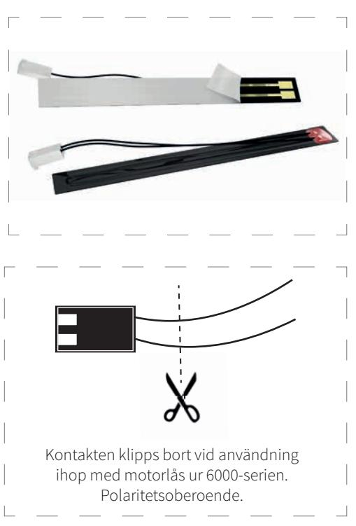

## T I L L B E H Ö R VÄRMETEJP

## EGENSKAPER

För montering i bakkant på låshus eller elslutbleck.

Ihop med Motorlås 6000-serien använder värmetejpen motorlåsets inbyggda sensorer för självreglering av effekt, t.ex. temperatur och luftfuktighet.

- 12VAC eller 24VDC
- Självhäftande tejp
- Förberedd för Motorlås 6000-serien
- Strömsnål

## TEKNISKA DATA

- 12 VAC / 24 VDC. OBS! Endast AC för 12V och endast DC för 24V
- Effekt: 2W

| BENÄMNING | ART NR      |
|-----------|-------------|
| Värmetejp | 202 144 735 |

## **SAFETRON AB**

Säterivägen 18 P.O. Box 2096 65002 Karlstad Sweden

Tel: +46 54 19 02 45 Email: info@safetron.com

Du hittar alltid det senaste på safetron.com