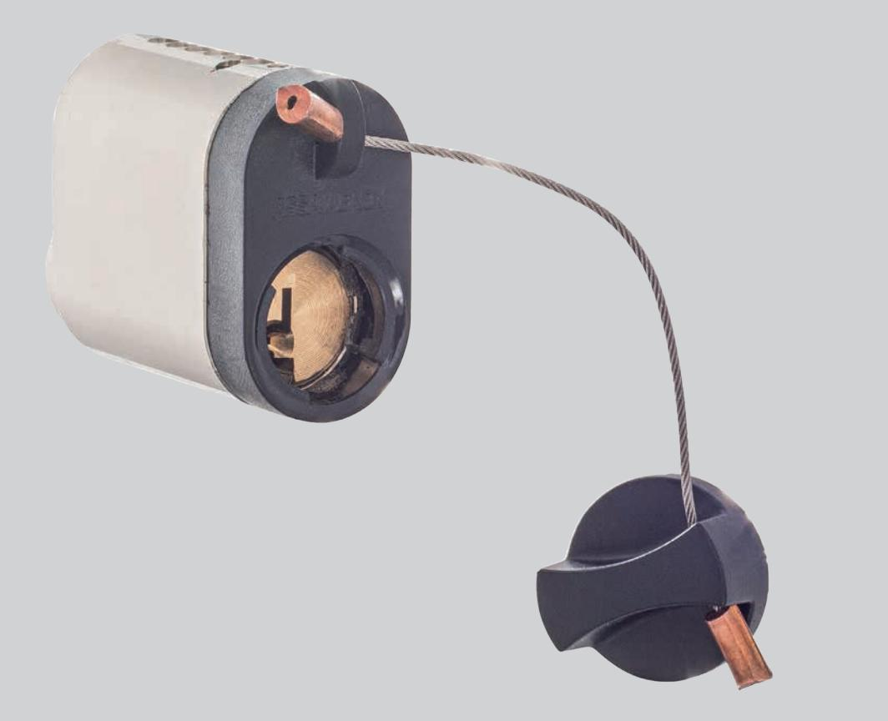
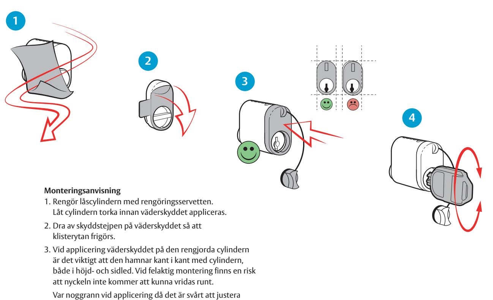

## Väderskydd ovalcylinder

### **Användningsområde**

ASSA ABLOY väderskydd skyddar ovala låscylindrar mot att damm, smuts och väta skall tränga in i profilöppningen som sitter i cylinderns framkant.

#### **Funktion**

Väderskyddet passar på ASSA ABLOY:s ovala cylindrar, så det är möjligt att använda väderskyddet på både nya och befintliga ovala cylindrar. För att skyddet skall ha någon större effekt är det viktigt att man skruvar fast locket efter användning av cylindern.

#### **Egenskaper**

Väderskyddet har en tätande o-ring i locket, denna är ej IP-klassad. O-ringen är tillverkad av gummi och infettad vid leverans för öppning och stängning av locket. Om locket kärvar kan denna o-ring behövas smörjas på nytt. Väderskyddet appliceras på cylindern med dubbelhäftande tejp, denna tejp uppnår sin fulla vidhäftning efter 24 timmar.

#### **Miljö**

Denna produkt är framtagen med minimal påverkan på miljön. Produkten återvinns som plast.

# Väderskydd ovalcylinder

väderskyddets läge i efterhand.

- 4. Kontrollera att nyckeln går att vrida runt i cylindern.

ASSA ABLOY Opening Solutions Sweden P.O. Box 371 SE-631 05 Eskilstuna Sweden Phone +46 (0)16 17 70 00 Fax +46 (0)16 17 70 49 Customer support: Phone intl. +46 (0)16 17 71 00

Phone nat. 0771-640 640 Fax +46 (0)16 17 73 72 e-mail: helpdesk.se.openingsolutions@assaabloy.com www.assaabloyopeningsolutions.se