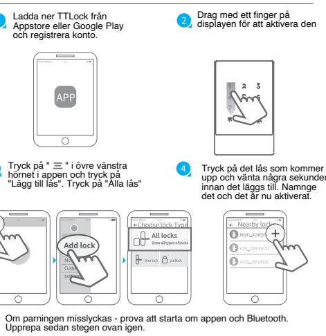
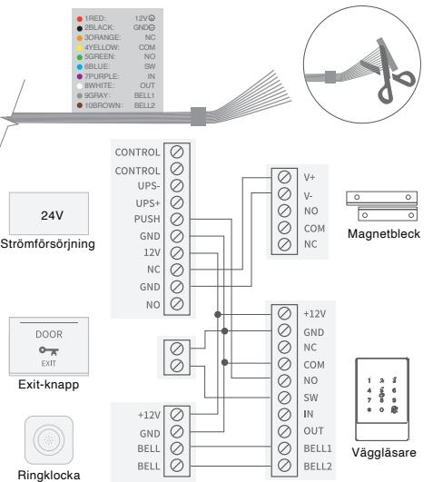
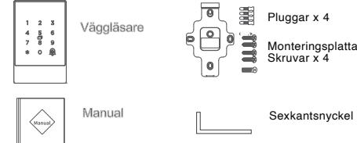

## **Smart Väggläsare**

#### 3 Kabeldragning

Klipp av kontakten från kabeln och skruva fast respelktive kabel på dess plats enligt schema nedan.

> Wecontinuouslyoptimizeproductsasnewtechnologiesandfeaturesaredeveloped.For thisreason,wereservetherighttomakealterationstotheproductswithoutpriornotice.

#### Disclaimer

1.Vid ursprungligt fel på produkten :

1)Återköp av varan inom 7 dagar från inköpsdatum.

2) Byte inom 15 dagar från inköpsdatum.

3) Fri reparation av produkten inom 2 år från inköpsdatum.

2. Garanti gäller inte vid åverkan, felaktig användning, ovarsamhet eller vid bruten försegling inuti enheten .

FCCWARNING

Thisdevicecomplieswith part15oftheFCCRules.Operationissubjectto thefollowingtwoconditions: ( 1 ) t h i s d e v i c e m a y n o t c a u s e h a r m f u l i n t e r f e r e n c e , a n d ( 2 ) t h i s d e v i c e m u s t a c c e p t a n y i n t e r f e r e n c e received,includinginterferencethatmaycauseundesiredoperation.

Anychangesormodificationsnotexpresslyapprovedbythepartyresponsibleforcompliancecouldvoid theuser'sauthoritytooperatetheequipment.

N O T E : T h i s e q u i p m e n t h a s b e e n t e s t e d a n d f o u n d t o c o m p l y w i t h t h e l i m i t s f o r a C l a s s B d i g i t a l d e v i c e , pursuanttoPart15oftheFCCRules.Theselimitsaredesignedtoprovidereasonableprotectionagainst harmfulinterferenceinaresidentialinstallation.Thisequipmentgenerates,usesandcanradiate radio frequencyenergyand,ifnotinstalledandusedinaccordancewiththeinstructions,maycauseharmful

interferencetoradiocommunications.

However ,thereisnoguaranteethatinterferencewillnotoccurinaparticularinstallation.

Ifthisequipmentdoescauseharmfulinterferencetoradioortelevisionreception,

whichcanbedeterminedbyturningtheequipmentoffandon,theuserisencouragedtotrytocorrectthe

interferencebyoneormoreofthefollowingmeasures:

- --Reorientorrelocatethereceivingantenna.
--Increasetheseparationbetweentheequipmentandreceiver.

--Connecttheequipmentintoanoutletonacircuitdifferentfromthattowhichthereceiverisconnected. --Consultthedealeroranexperiencedradio/TVtechnicianforhelp.

T omaintaincompliancewithFCC' sRFExposureguidelines,Thisequipmentshouldbeinstalledand

operatedwithminimumdistancebetween20cmtheradiatoryourbody:Useonlythesuppliedantenna.

#### Smart Väggläsare BG-AC05F

| Modell :                     |                                            |  |  |
|------------------------------|--------------------------------------------|--|--|
|                              | BG-AC05F                                   |  |  |
| Mått:                        | B80mm xH126mm xT19mm                       |  |  |
| Material :                   | ABS/Acryl-panel                            |  |  |
| Supportingsystems:           | Minst Android 4.3/IOS7.0                   |  |  |
| Stand-bycurrent :            | K3/K3F28mA K3Q66mA(Activate back lighting) |  |  |
| Strömförbrukning :           | ≈ 1A                                       |  |  |
| : Voltstyrka              | DC24V                                      |  |  |
| : IP                      | IP67                                       |  |  |
| : Kapacitet kort          | 2000                                       |  |  |
| : Kapacitet koder         | 500                                        |  |  |
| : Kapacitet fingeravtryck | 100                                        |  |  |
|                              |                                            |  |  |

### Para ihop enheten med APP Garanti

# **BG-AC05F**

Kartongens innehåll

## Ändra bakgrundsbelysning

- Bakgrundsbelysning alltid på :*49#admin password#1#
- Bakgrundsbelysning alltid av: *49#admin password#0# OBS! Fungerar inte på alla modeller.

|          | APP | Kort/tag | Kod Fingerprint |  |
|----------|-----|----------|-----------------|--|
| BG-AC05F |     |          |                 |  |