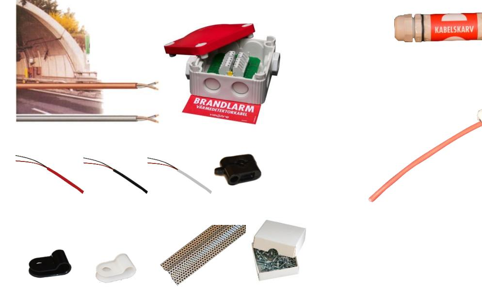
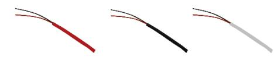

## **Värmedetektorkabel**

## HDC Heat Detector Cable

Värmedetektorkabel HDC ger tidig upptäckt av brand vid utomhusmontage innan branden går in i byggnaden. Kabeln kan även installeras inomhus och där skydda speciella utrymmen.

Värmedetektorkabeln HDC detekterar utefter hela sin längd till skillnad från punktdetektering.

Kabeln består av två tvinnade kopparöverdragna ledare av ståltråd, individuellt isolerade med en massa av värmekänslig polymer. Vid uppnådd temperatur smälter isoleringen och ledarna kortsluts.

Två larmnivåer finns, 68 respektive 105 grader. Kabeln får inte övermålas.

Som tillbehör finns montageklammer, kabelskydd och anslutningsbox. Boxen kan användas som anslutningsbox, skarvbox och avslutningsbox. Boxen innehåller även omkopplare för simulering av brand samt lysdiod för indikering 24V på slingan. Se även produktblad HDC-BOX1.

| Artikelnummer |          |                       |  |  |  |
|---------------|----------|-----------------------|--|--|--|
| HDC-68R       | E4824000 | Värmedetektorkabe     |  |  |  |
|               |          | l 68 gr röd           |  |  |  |
| HDC-105S      | E4824010 | Värmedetektorkabe     |  |  |  |
|               |          | l 105 gr svart        |  |  |  |
| HDC-105V      | E6301045 | Värmedetektorkabe     |  |  |  |
|               |          | l 105 gr vit          |  |  |  |
| K-NX1         | E1504380 | Klammer svart         |  |  |  |
| K-NX1V        | E6301046 | Klammer vit           |  |  |  |
| K-KK1         | E1504381 | Distansklammer        |  |  |  |
|               |          | svart                 |  |  |  |
| HDC-KS        | E6301049 | Kabelskydd            |  |  |  |
| HDC-BOX1      | E5010010 | Komplett              |  |  |  |
|               |          | Kopplingsbox          |  |  |  |
| HDC-BOX2      | E5010029 | Avslutningsbox /      |  |  |  |
|               |          | Skarvbox              |  |  |  |
| HDC-BOX3      | E5010031 | Kopplingsbox          |  |  |  |
| BS200901      |          | Informationsskylt     |  |  |  |
| SKRUV-12      | E6301047 | Skruv för K-NX1 &     |  |  |  |
|               |          | K-NX1V (100-pack)     |  |  |  |
| SKRUV-13      | E6301048 | Skruv för K-KK1 |  |  |  |
|               |          | (50-pack)             |  |  |  |
| SP-5          | E6301480 | Kabelskarv 5-pol      |  |  |  |

| Tekniska specifikationer |                                |  |  |  |
|--------------------------|--------------------------------|--|--|--|
| HDC-68R                  | Larmar vid 68 grader           |  |  |  |
|                          | Omgivningstemp max 40 grader   |  |  |  |
| HDC-105S                 | Larmar vid 105 grader          |  |  |  |
|                          | Omgivningstemp max 60 grader   |  |  |  |
| HDC-105V                 | Larmar vid 105 grader |  |  |  |
|                          | Omgivningstemp max 60 grader   |  |  |  |
| Diameter                 | 4,5 mm                         |  |  |  |
| HDC-KS                   | Kabelskydd perforerad aluzink. |  |  |  |
|                          | Öppning ca 20x20mm. L=2000     |  |  |  |
| HDC-BOX1                 | 85x85x50 mm IP67               |  |  |  |
| BS200901                 | Informationsskylt 80x35        |  |  |  |
| SP-5                     | 130-30 mm 5-pol IP68 Grå    |  |  |  |

## **Tekniska data HDC**

| Tekniska data kabel     |          |          |          |  |  |
|-------------------------|----------|----------|----------|--|--|
| Art. Nr.                | HDC-68R  | HDC-105S | HDC-105V |  |  |
| E-nummer                | E4824000 | E4824010 | E6301045 |  |  |
| Larmtemp.               | 68ºC     | 105ºC    | 105ºC    |  |  |
| Max omgiv ningstemp. | 40ºC     | 60ºC     | 60ºC     |  |  |
| Mantel, material     | PVC      | PVC      | PVC      |  |  |
| Färg                    | Röd      | Svart    | Vit      |  |  |
| Lagrings temp.       | Max 38ºC | Max 38ºC | Max 38ºC |  |  |
| Ursprungs land       | IT       | IT       | IT       |  |  |

