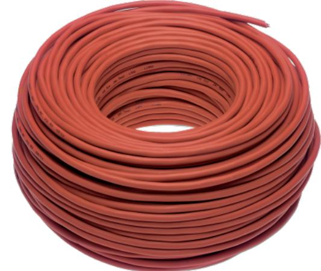

## WFA00210

Produktblad

Brandresistent brandlarmkabel 2x1 mm – PH30 – 100/100 V (200 m rulle)

#### Allmänt

WFA00210L är en halogenfri, partvinnad, brandresistent kabel med skärm och isolering med en speciell silikongummiblandning. Den är idealisk för användning i brandlarmsystem där kretsens integritet vid brand är viktig. WFA00210L säljs i rullar om 200 meter.\

#### Konstruktion

WFA00210 har flertrådig kopparledare och den gensamma skärmen består av aluminium/polyesterband, metallisk sida ner och i kontakt med en solid ren kopparavledare.

#### Godkännanden

WFA00210 är PH30 klassificerad enligt EN 50200:2015. \ Kabeln uppfyller dessutom: BS EN 60754-1:2014, BS EN 60754-2:2014, BS EN 60228:2005, BS EN 5063-1:2005, IEC 60331-21, IEC 60332-3.

#### Standardprestanda

- EFlertrådig kopparledare
- EIsolering med speciell silikongummiblandning
- EHalogenfri

- EEN50200-certifierad – PH30-klassad
# WFA00210

Brandresistent brandlarmkabel 2x1 mm – PH30 – 100/100 V (200 m rulle)

### Tekniska data

| Ledare                     |                        |
|----------------------------|------------------------|
| Ledardiameter              | 1,0 mm²                |
| Motstånd                   | 19,9 ohm/km vid +20 °C |
| Kapacitans                 | 150 nF/km vid 20 °C    |
| Induktans                  | 1 mH/km                |
| Allmänt                    |                        |
| Mista insolationsresistans | 200 Mohm/km            |
| Maximal driftspänning      | 100 V                  |
| Testspänning               | 2000 V                 |
| Fysiskt                    |                        |
| Färg                       | Röd                    |
| Nettovikt                  | 55 kg/km               |
| Ytterdiameter              | 6,6 mm                 |
| Antal ledare               | 2                      |
| Färg på ledare             | Brun och blå           |
| Minsta böjradie            | 10 x total diameter    |
| Miljö                      |                        |
| Arbetstemperatur           | -30 till +180 °C       |
| Installationstemperatur    | -5 till +50 °C         |
| Standarder & Regelverk     |                        |
| Standard                   | EN 50200               |
| Brandresistens             | 30 min                 |

Order data

Artikelnummer Beskrivning WFA00210 Brandresistent brandlarmkabel 2x1 mm – PH30 – 100/100 V (200 m rulle)

