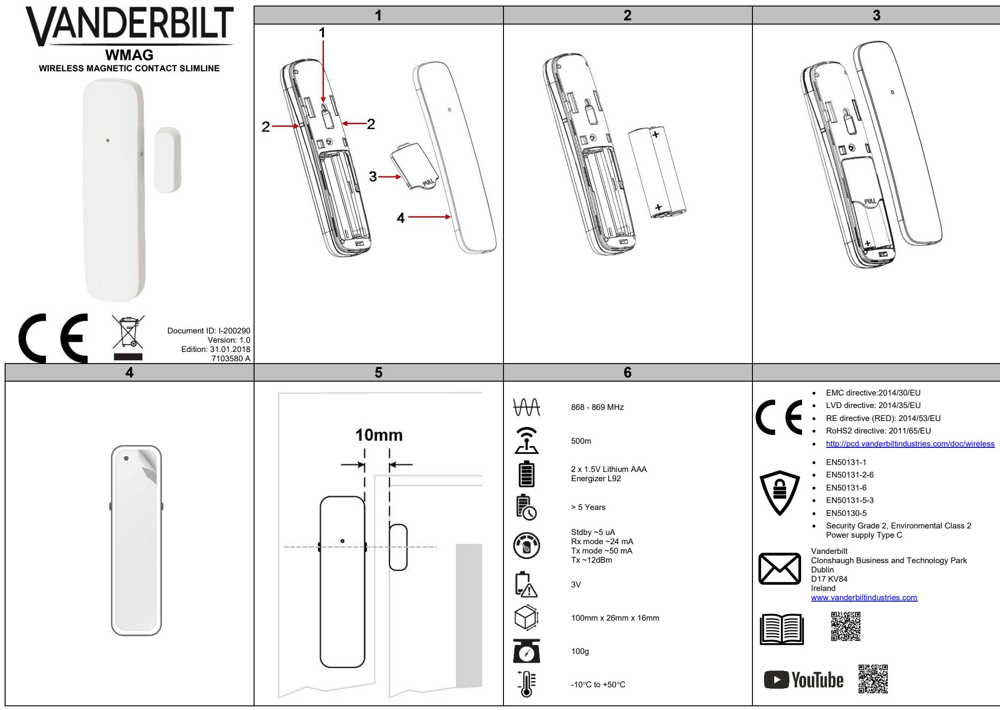

| EN                            |                                                        |                                                                                                                   | DE                                        |                                            |                                                                                                                            |           | ES                                                                                                      |                                                            |                    |                                                                    | FR                                                                    |                           |                                                                                                                        |           |
|-------------------------------|--------------------------------------------------------|-------------------------------------------------------------------------------------------------------------------|-------------------------------------------|--------------------------------------------|----------------------------------------------------------------------------------------------------------------------------|-----------|---------------------------------------------------------------------------------------------------------|------------------------------------------------------------|--------------------|--------------------------------------------------------------------|-----------------------------------------------------------------------|---------------------------|------------------------------------------------------------------------------------------------------------------------|-----------|
| OVERVIEW                      |                                                        |                                                                                                                   | ÜBERBLICK                                 |                                            |                                                                                                                            |           | VISIÓN GENERAL                                                                                          |                                                            |                    |                                                                    | PRÉSENTATION                                                          |                           |                                                                                                                        |           |
|                               |                                                        | The WMAG is an advanced, fully supervised low-current wireless                                                    |                                           |                                            | Der WMAG ist ein moderner, vollständig überwachter und kabelloser                                                          |           | El WMAG es un contacto magnético vía radio para puertas/ventanas                                        |                                                            |                    | Le WMAG est un détecteur d'ouverture à contact magnétique sans fil |                                                                       |                           |                                                                                                                        |           |
| magnetic door/window contact. |                                                        |                                                                                                                   |                                           |                                            | Magnetkontakt mit niedrigem Stromverbrauch für die Überwachung                                                             |           | avanzado, completamente supervisado y de baja corriente.                                                |                                                            |                    |                                                                    | pour portes/fenêtres, à faible consommation de courant et             |                           |                                                                                                                        |           |
|                               | DISCOVERY AND ENROLLMENT PROCESS                       |                                                                                                                   | von Fenster und Türen.                    |                                            |                                                                                                                            |           |                                                                                                         |                                                            |                    |                                                                    | entièrement surveillé.                                                |                           |                                                                                                                        |           |
|                               |                                                        |                                                                                                                   |                                           |                                            | ERKENNUNG UND REGISTRIERUNG                                                                                                |           | PROCESO DE BÚSQUEDA Y REGISTRO                                                                          |                                                            |                    |                                                                    | RECHERCHE ET CONNEXION                                                |                           |                                                                                                                        |           |
| 1.                            |                                                        | Discover the WMAG detector from the SPC control panel: In the SPC browser, select Configuration > Wireless and |                                           |                                            | Erkennen des WMAG-Melders in der SPC-Zentrale:                                                                             |           | Búsqueda del detector WMAG desde el panel de control                                                    |                                                            |                    |                                                                    | Recherche du détecteur WMAG depuis la centrale SPC:                   |                           |                                                                                                                        |           |
|                               | click Enroll New Sensor.                               |                                                                                                                   | 1. Wählen Sie im SPS-Browser die Optionen |                                            |                                                                                                                            |           | SPC:                                                                                                    |                                                            |                    |                                                                    | 1. Dans le navigateur SPC, sélectionnez Configuration>Sans fil        |                           |                                                                                                                        |           |
| 2.                            | Remove the battery cover (Fig. 1, Item 3).             |                                                                                                                   |                                           |                                            | Konfiguration>Kabellos, und klicken Sie auf Neuen Sensor                                                                   |           | 1. En el navegador SPC, seleccione Configuración>Vía radio y haga clic en Registrar un nuevo sensor. |                                                            |                    |                                                                    |                                                                       |                           | et cliquez sur Connecter un nouveau capteur.                                                                           |           |
| 3.                            |                                                        | Insert the batteries taking care to observe correct polarity.                                                     | registrieren.                             |                                            |                                                                                                                            |           | 2. Retire la cubierta de las baterías (fig. 1, elemento 3).                                             |                                                            |                    |                                                                    | 2. Retirez le couvercle du compartiment à pile (Fig. 1, repère 3).    |                           |                                                                                                                        |           |
|                               |                                                        | Inserting the batteries starts the discovery process from the                                                     |                                           |                                            | 2. Entfernen Sie die Batterieabdeckung (Abb. 1, Element 3).                                                                |           | 3. Inserte las baterías teniendo cuidado de que la polaridad sea                                        |                                                            |                    |                                                                    | 3. Insérez les piles en veillant à la polarité.                       |                           |                                                                                                                        |           |
| device.                       |                                                        |                                                                                                                   |                                           |                                            | 3. Legen Sie die Batterien mit der richtigen Polarität ein.Nach                                                            |           | correcta.                                                                                               |                                                            |                    |                                                                    |                                                                       |                           | Le processus de recherche démarre dès que les piles sont                                                               |           |
| 4.                            |                                                        | During the discovery process, the following LED sequence                                                          |                                           |                                            | dem Einlegen der Batterien startet die Erkennung des Gerätes. 4. Während der Erkennung leuchten die LEDs in der         |           | Al insertar las baterías se inicia el proceso de búsqueda desde                                         |                                                            |                    |                                                                    | insérées.                                                             |                           |                                                                                                                        |           |
| occurs:                       |                                                        |                                                                                                                   |                                           | nachstehenden Reihenfolge:                 |                                                                                                                            |           | el dispositivo.                                                                                         |                                                            |                    |                                                                    | 4. Durant le processus de recherche, la LED change plusieurs          |                           |                                                                                                                        |           |
|                               | LED (Fig. 1 item 1) State                              | Duration (s)                                                                                                      |                                           | LED (Abb. 1,                               | Status                                                                                                                     | Dauer (s) | 4. Durante el proceso de búsqueda se produce la siguiente                                               |                                                            |                    |                                                                    | fois d'état :                                                         |                           |                                                                                                                        |           |
| Power up                      | Green/Red                                              | Fast Flash 7 - 10                                                                                                 |                                           | Element 1)                                 |                                                                                                                            |           | secuencia de LED:                                                                                       |                                                            |                    |                                                                    |                                                                       | LED (Fig. 1, repère 1) | État                                                                                                                   | Durée (s) |
| Discovery Start               | Green                                                  | Slow Flash 3 - 5                                                                                                  | Einschalten                               | Grün/rot                                   | Schnelles Blinken                                                                                                          | 7–10      |                                                                                                         | LED (fig. 1,                                               | Estado             | Duración (s)                                                       | Mise sous tension                                                     | Vert/rouge                | Clignotement rapide 7 – 10                                                                                             |           |
| Discovery Complete Green      |                                                        | Steady 3 - 5                                                                                                   | Erkennungsstart Grün                      |                                            | Langsames Blinken 3–5                                                                                                      |           |                                                                                                         | elemento 1)                                                |                    |                                                                    | Début de la                                                           | Vert                      | Clignotement lent                                                                                                      | 3 - 5     |
| Discovery Failed*             | Red                                                    | Steady                                                                                                            | Erkennung                                 | Grün                                       | Konstant                                                                                                                   | 3–5       | Encendido                                                                                               | Verde/rojo                                                 | Parpadeo rápido | 7 - 10                                                             | recherche                                                             |                           |                                                                                                                        |           |
| 5.                            | You can now enroll the device by configuring the       |                                                                                                                   | abgeschlossen                             |                                            |                                                                                                                            |           | Iniciar búsqueda                                                                                        | Verde                                                      | Parpadeo           | 3 - 5                                                              | Recherche terminée Vert                                               |                           | Fixe                                                                                                                   | 3 - 5     |
|                               |                                                        | Description, Zone, Zone Type and other settings in the SPC                                                        | Erkennung                                 | Rot                                        | Konstant                                                                                                                   |           |                                                                                                         |                                                            | lento              |                                                                    | Recherche échouée* Rouge                                              |                           | Fixe                                                                                                                   |           |
| system                        |                                                        |                                                                                                                   | fehlgeschlagen*                           |                                            |                                                                                                                            |           | Búsqueda finalizada                                                                                     | Verde                                                      | Fijo               | 3 - 5                                                              | 5. Vous pouvez maintenant connecter le dispositif en configurant      |                           |                                                                                                                        |           |
| 1. On the keypad, select   |                                                        | Discover and enroll the WMAG detector from the keypad                                                             |                                           |                                            | 5. Sie können nun das Gerät registrieren, indem Sie die                                                                    |           | Búsqueda fallida*                                                                                       | Rojo                                                       | Fijo               |                                                                    |                                                                       |                           | la Description, la Zone, le Type de zone et les autres                                                                 |           |
|                               | WIRELESS>SENSORS>ADD>ENROL.                            |                                                                                                                   |                                           |                                            | Beschreibung, die Zone, den Zonentyp und weitere                                                                           |           | 5. Ahora puede registrar el dispositivo configurando la                                                 |                                                            |                    |                                                                    | paramètres sur le système SPC.                                        |                           |                                                                                                                        |           |
|                               |                                                        | The keypad displays the ADD screen with a flashing ENROL                                                          |                                           | Einstellungen im SPC-System konfigurieren. |                                                                                                                            |           | descripción, zona, tipo de zona y otros ajustes en el sistema                                           |                                                            |                    |                                                                    | Recherche et connexion du détecteur WMAG depuis le                    |                           |                                                                                                                        |           |
| DEVICE message.               |                                                        |                                                                                                                   |                                           |                                            | Erkennen und Registrieren des WMAG-Melders am Bedienteil:                                                                  |           | SPC                                                                                                     |                                                            |                    |                                                                    | clavier                                                               |                           |                                                                                                                        |           |
| 2.                            | Follow steps 2 - 4 in the Discover process above.      |                                                                                                                   | 1. Wählen Sie am Bedienteil               |                                            | KABELLOS>SENSOREN>HINZUFÜGEN>EINLERNEN.                                                                                    |           | Búsqueda y registro del detector WMAG desde el teclado                                                  |                                                            |                    |                                                                    | 1. Sur le clavier, sélectionnez SANS                                  |                           |                                                                                                                        |           |
|                               | The keypad displays the FOUND SENSOR message.          |                                                                                                                   |                                           |                                            | Das Bedienteil zeigt den Bildschirm HINZUFÜGEN mit der                                                                     |           | 1. En el teclado, seleccione VÍA                                                                        |                                                            |                    |                                                                    |                                                                       |                           | FIL>CAPTEURS>AJOUTER>TOUCHE CONNEXION.                                                                                 |           |
| 3. Click OK.               |                                                        |                                                                                                                   |                                           | blinkenden Meldung GERÄT ANMELDEN an.      |                                                                                                                            |           | RADIO>SENSORES>AÑADIR>REGISTRO.                                                                         |                                                            |                    |                                                                    |                                                                       |                           | L'écran AJOUTER est affiché sur le clavier ; le message                                                                |           |
| 4.                            |                                                        | You can now enroll the device by configuring the AREA,                                                            |                                           |                                            | 2. Führen Sie die Schritte 2–4 des oben aufgeführten                                                                       |           | El teclado muestra la pantalla AÑADIR con un mensaje                                                    |                                                            |                    |                                                                    | ACTIVATION DU DISPOSITIF clignote.                                    |                           |                                                                                                                        |           |
|                               | ZONE TYPE and ZONE settings.                           |                                                                                                                   | Erkennungsvorgangs aus.                   |                                            |                                                                                                                            |           | intermitente de INSCRIBIR DISPOSITIVO.                                                                  |                                                            |                    |                                                                    | 2. Suivez les étapes 2 - 4 de la procédure de recherche ci dessus. |                           |                                                                                                                        |           |
| 5. Click OK. 6.         | The keypad displays the UPDATED message.               |                                                                                                                   |                                           |                                            | Das Bedienteil zeigt die Meldung SENSOR GEFUNDEN an.                                                                       |           | 2. Siga los pasos 2 a 4 del proceso de búsqueda indicado                                                |                                                            |                    |                                                                    |                                                                       |                           | Le message CAPTEUR TROUVÉ est affiché sur le clavier.                                                                  |           |
|                               | The WMAG is now enrolled on your SPC system.           |                                                                                                                   | 3. Klicken Sie auf OK.                    |                                            |                                                                                                                            |           | anteriormente. El teclado muestra el mensaje SENSOR ENCONTRADO.                                      |                                                            |                    |                                                                    | 3. Cliquez sur OK.                                                    |                           |                                                                                                                        |           |
|                               |                                                        |                                                                                                                   |                                           |                                            | 4. Sie können nun das Gerät registrieren, indem Sie die                                                                    |           | 3. Haga clic en OK.                                                                                     |                                                            |                    |                                                                    | 4. Vous pouvez maintenant connecter le dispositif en configurant      |                           |                                                                                                                        |           |
| *DISCOVERY FAILED             |                                                        |                                                                                                                   |                                           |                                            | Einstellungen BEREICH, ZONENTYP und ZONE                                                                                   |           | Ahora puede registrar el detector configurando los ajustes                                              |                                                            |                    |                                                                    |                                                                       |                           | la ZONE, le TYPE DE ZONE et les paramètres de la ZONE.                                                                 |           |
| process.                      |                                                        | Remove the batteries, wait for around 10 seconds and repeat the                                                   | konfigurieren. 5. Klicken Sie auf OK.  |                                            |                                                                                                                            |           | ÁREA, TIPO DE ZONA y ZONA.                                                                              |                                                            |                    |                                                                    | 5. Cliquez sur OK.                                                    |                           |                                                                                                                        |           |
|                               |                                                        |                                                                                                                   |                                           |                                            | 6. Das Bedienteil zeigt die Meldung AKTUALISIERT an.                                                                       |           | 4. Haga clic en OK.                                                                                     |                                                            |                    |                                                                    | 6. Le message MIS À JOUR est affiché.                                 |                           |                                                                                                                        |           |
|                               | MOUNTING PROCESS                                       |                                                                                                                   |                                           |                                            | Der WMAG ist nun in Ihrem SPC-System registriert.                                                                          |           | 5. El teclado muestra el mensaje ACTUALIZADO.                                                           |                                                            |                    |                                                                    |                                                                       |                           | Le WMAG est maintenant connecté à votre système SPC.                                                                   |           |
|                               |                                                        | The detector and the magnet are mounted using an adhesive plate                                                   | *ERKENNUNG FEHLGESCHLAGEN                 |                                            |                                                                                                                            |           | El WMAG está ahora registrado en su sistema SPC.                                                        |                                                            |                    |                                                                    | *RECHERCHE ÉCHOUÉE                                                    |                           |                                                                                                                        |           |
|                               | on the back of the detector and the magnet.            |                                                                                                                   |                                           |                                            | Nehmen Sie die Batterien heraus, warten Sie etwa 10 Sekunden,                                                              |           | *BÚSQUEDA FALLIDA                                                                                       |                                                            |                    |                                                                    | Retirez les piles, attendez environ 10 secondes et répétez la         |                           |                                                                                                                        |           |
|                               | CAUTION                                                |                                                                                                                   | und wiederholen Sie den Vorgang.          |                                            |                                                                                                                            |           | Retire las baterías, espere unos 10 segundos y repita el proceso.                                       |                                                            |                    |                                                                    | procédure.                                                            |                           |                                                                                                                        |           |
|                               |                                                        | Mount the detector on clean and dry surfaces. Do not                                                              | MONTAGE                                   |                                            |                                                                                                                            |           |                                                                                                         |                                                            |                    |                                                                    | MONTAGE                                                               |                           |                                                                                                                        |           |
|                               |                                                        | mount on uneven or loosely painted surfaces. Avoid areas                                                          |                                           |                                            | Der Melder und der Magnet werden mithilfe einer Klebeplatte                                                                |           | PROCESO DE MONTAJE                                                                                      |                                                            |                    |                                                                    | Le détecteur et l'aimant sont montés en utilisant une plaque adhésive |                           |                                                                                                                        |           |
|                               |                                                        | that are prone to condensation. The adhesive must be allowed to cure for up to 72 hours before exposing the    |                                           |                                            | befestigt, die auf der Rückseite der jeweiligen Komponente                                                                 |           | El detector y el imán se montan utilizando una placa adhesiva en la                                     |                                                            |                    |                                                                    | au dos du détecteur et de l'aimant.                                   |                           |                                                                                                                        |           |
|                               |                                                        | detector to vibration, moisture, or excessive temperature                                                         | angebracht ist.                           |                                            |                                                                                                                            |           | parte posterior del detector y del imán.                                                                |                                                            |                    |                                                                    |                                                                       |                           | ATTENTION                                                                                                              |           |
|                               | variation.                                             |                                                                                                                   |                                           |                                            | VORSICHT                                                                                                                   |           |                                                                                                         | Monte el detector sobre superficies limpias y secas. No lo | PRECAUCIÓN         |                                                                    |                                                                       |                           | Montez le détecteur sur une surface propre et sèche. Ne                                                                |           |
| •                             |                                                        | The detector should be mounted on the fixed frame of the                                                          |                                           |                                            | Befestigen Sie den Melder auf einer sauberen und trockenen                                                                 |           |                                                                                                         |                                                            |                    | monte sobre superficies irregulares ni con pintura suelta. Evite   |                                                                       |                           | l'installez pas sur une surface irrégulière ou fraîchement                                                             |           |
|                               | door or window, the magnet should be mounted on the    |                                                                                                                   |                                           |                                            | Oberfläche. Befestigen Sie ihn nicht auf unebenen Oberflächen oder                                                         |           |                                                                                                         |                                                            |                    | áreas propensas a la condensación. Se debe permitir que el         |                                                                       |                           | peinte. Évitez les zones susceptibles de présenter de la                                                               |           |
| moving part.                  |                                                        |                                                                                                                   |                                           |                                            | abbröckelnder Farbe. Vermeiden Sie Bereiche, in denen es zu Kondensation kommt. Der Klebstoff muss etwa 72 Stunden lang |           |                                                                                                         |                                                            |                    | adhesivo fragüe durante hasta 72 horas antes de exponer el         |                                                                       |                           | condensation. La liaison adhésive doit sécher durant au moins 72 heures avant de pouvoir exposer le détecteur à des |           |
| To mount the detector         |                                                        |                                                                                                                   |                                           |                                            | trocknen, bevor der Melder Vibrationen, Feuchte oder übermäßigen                                                           |           |                                                                                                         |                                                            | temperatura.       | detector a vibraciones, humedad o variaciones excesivas de         |                                                                       |                           | vibrations, à l'humidité ou des variations excessives de                                                               |           |
| 1.                            |                                                        | Remove the backing paper from the adhesive plate on the                                                           |                                           |                                            | Temperaturschwankungen ausgesetzt werden kann.                                                                             |           | • El detector debe montarse en el marco fijo de la puerta o                                          |                                                            |                    |                                                                    |                                                                       |                           | température.                                                                                                           |           |
|                               | detector and the magnet (Fig. 4).                      |                                                                                                                   | •                                         |                                            | Der Melder sollte auf dem festen Rahmen der Tür oder des                                                                   |           | ventana, y el imán debe montarse en la parte móvil.                                                     |                                                            |                    |                                                                    | •                                                                     |                           | Le détecteur devrait être monté sur un cadre fixe de la porte                                                          |           |
| 2.                            | Gently but firmly press the detector into place.       |                                                                                                                   |                                           |                                            | Fensters und der Magnet am beweglichen Teil der Tür bzw.                                                                   |           | Montaje del detector                                                                                    |                                                            |                    |                                                                    |                                                                       |                           | ou de la fenêtre, l'aimant devrait être monté sur la partie                                                            |           |
| 3.                            | Mount the magnet so that the centre of the magnet is   |                                                                                                                   |                                           | des Fensters befestigt werden.             |                                                                                                                            |           | 1. Retire el papel protector de la placa adhesiva del detector y                                        |                                                            |                    |                                                                    | mobile.                                                               |                           |                                                                                                                        |           |
|                               | aligned with the nib on the detector casing. (Fig. 5). | You can ensure correct alignment of the magnet with the                                                           | Montage des Melders                       |                                            |                                                                                                                            |           | del imán (fig. 4).                                                                                      |                                                            |                    |                                                                    | Pour monter le détecteur                                              |                           |                                                                                                                        |           |
|                               | detector by observing the detector LED when the SPC    |                                                                                                                   |                                           |                                            | 1. Entfernen Sie die Schutzfolie von der Klebeplatte am Melder                                                             |           | 2. Presione el detector en su posición suave pero firmemente.                                           |                                                            |                    |                                                                    | 1. Enlevez le papier au dos de la plaque adhésive du détecteur et     |                           |                                                                                                                        |           |
|                               | system is in Walktest mode.                            |                                                                                                                   | und am Magnet (Abb. 4).                   |                                            |                                                                                                                            |           | 3. Monte el imán de manera que el centro del mismo esté                                                 |                                                            |                    |                                                                    | de l'aimant (Fig. 4).                                                 |                           |                                                                                                                        |           |
| BATTERY REPLACEMENT           |                                                        |                                                                                                                   | Montagestelle an.                         |                                            | 2. Drücken Sie den Melder vorsichtig, aber bestimmt auf der                                                                |           | alineado con la marca de la carcasa del detector (fig. 5).                                              |                                                            |                    |                                                                    | 2. Appuyez doucement mais fermement sur le détecteur pour             |                           |                                                                                                                        |           |
|                               |                                                        |                                                                                                                   |                                           |                                            | 3. Befestigen Sie den Magnet so, dass die Mitte des Magneten                                                               |           | Puede comprobar la alineación correcta del imán con el                                                  |                                                            |                    |                                                                    | bien le fixer.                                                        |                           |                                                                                                                        |           |
|                               |                                                        | CAUTION                                                                                                           |                                           |                                            | mit der kleinen Nase am Meldergehäuse ausgerichtet ist                                                                     |           | detector observando el LED del detector cuando el sistema                                               |                                                            |                    |                                                                    | 3. Montez l'aimant en le centrant sur le picot du boîtier du          |                           |                                                                                                                        |           |
|                               |                                                        | The battery must be replaced by 2 Lithium batteries                                                               | (Abb.5).                                  |                                            |                                                                                                                            |           | SPC se encuentra en modo Test de intrusión.                                                             |                                                            |                    |                                                                    | détecteur (Fig 5).                                                    |                           | Vous pouvez assurer l'alignement correct de l'aimant sur le                                                            |           |
|                               |                                                        | AAA 1.5V Lithium Models such as Energizer L92                                                                     |                                           |                                            | Um den Magneten korrekt mit dem Melder auszurichten,                                                                       |           | SUSTITUCIÓN DE LAS BATERÍAS                                                                             |                                                            |                    |                                                                    |                                                                       |                           | détecteur en observant la LED du détecteur lorsque le                                                                  |           |
|                               |                                                        |                                                                                                                   |                                           |                                            | beobachten Sie die Melder-LED, während das SPC-System im                                                                   |           |                                                                                                         |                                                            | PRECAUCIÓN         | Las baterías deben sustituirse por 2 baterías AAA de litio         |                                                                       |                           | système SPC est en mode Walktest (test de marche).                                                                     |           |
|                               |                                                        |                                                                                                                   | Gehtest-Modus ist.                        |                                            |                                                                                                                            |           |                                                                                                         |                                                            |                    | de 1,5 V, modelos de litio como por ejemplo Energizer L92          | REMPLACEMENT DE LA PILE                                               |                           |                                                                                                                        |           |
|                               |                                                        |                                                                                                                   | AUSTAUSCH DER BATTERIE                    |                                            |                                                                                                                            |           |                                                                                                         |                                                            |                    |                                                                    |                                                                       |                           | ATTENTION                                                                                                              |           |
|                               |                                                        |                                                                                                                   |                                           |                                            | VORSICHT                                                                                                                   |           |                                                                                                         |                                                            |                    |                                                                    |                                                                       |                           | Remplacez la pile uniquement par deux piles au lithium                                                                 |           |
|                               |                                                        |                                                                                                                   |                                           |                                            | Die Batterien müssen immer gegen 2 Lithium-Batterien (AAA,                                                                 |           |                                                                                                         |                                                            |                    |                                                                    |                                                                       |                           | AAA de 1,5 V, par exemple Energizer L92.                                                                               |           |

1,5 V) ausgetauscht werden (z. B. Energizer L92).

| IT                                                                                                                                                                                                                                                                                                                                                                                                                                                                                                                                                                                                                                                                                                                                                                                                                                                                                                                                                                                                                                                                                                              | NL                                                                                                                                                                                                                                                                                                                                                                                                                                                                                                                                                                                                                                                                                                                                                                                                                                                                                                                                                                                                                        | SV                                                                                                                                                                                                                                                                                                                                                                                                                                                                                                                                                                                                                                                                                                                                                                                                                                                                                                                                                                                                                                                                   |  |  |  |
|-----------------------------------------------------------------------------------------------------------------------------------------------------------------------------------------------------------------------------------------------------------------------------------------------------------------------------------------------------------------------------------------------------------------------------------------------------------------------------------------------------------------------------------------------------------------------------------------------------------------------------------------------------------------------------------------------------------------------------------------------------------------------------------------------------------------------------------------------------------------------------------------------------------------------------------------------------------------------------------------------------------------------------------------------------------------------------------------------------------------|---------------------------------------------------------------------------------------------------------------------------------------------------------------------------------------------------------------------------------------------------------------------------------------------------------------------------------------------------------------------------------------------------------------------------------------------------------------------------------------------------------------------------------------------------------------------------------------------------------------------------------------------------------------------------------------------------------------------------------------------------------------------------------------------------------------------------------------------------------------------------------------------------------------------------------------------------------------------------------------------------------------------------|----------------------------------------------------------------------------------------------------------------------------------------------------------------------------------------------------------------------------------------------------------------------------------------------------------------------------------------------------------------------------------------------------------------------------------------------------------------------------------------------------------------------------------------------------------------------------------------------------------------------------------------------------------------------------------------------------------------------------------------------------------------------------------------------------------------------------------------------------------------------------------------------------------------------------------------------------------------------------------------------------------------------------------------------------------------------|--|--|--|
| PANORAMICA                                                                                                                                                                                                                                                                                                                                                                                                                                                                                                                                                                                                                                                                                                                                                                                                                                                                                                                                                                                                                                                                                                      | OVERZICHT De WMAG is een geavanceerd, volledig bewaakt laagspanning                                                                                                                                                                                                                                                                                                                                                                                                                                                                                                                                                                                                                                                                                                                                                                                                                                                                                                                                                    | ÖVERSIKT                                                                                                                                                                                                                                                                                                                                                                                                                                                                                                                                                                                                                                                                                                                                                                                                                                                                                                                                                                                                                                                             |  |  |  |
| corrente, completamente controllato e avanzato.                                                                                                                                                                                                                                                                                                                                                                                                                                                                                                                                                                                                                                                                                                                                                                                                                                                                                                                                                                                                                                                                 | magnetkontakt för dörrar/fönster med låg spänning.                                                                                                                                                                                                                                                                                                                                                                                                                                                                                                                                                                                                                                                                                                                                                                                                                                                                                                                                                                        |                                                                                                                                                                                                                                                                                                                                                                                                                                                                                                                                                                                                                                                                                                                                                                                                                                                                                                                                                                                                                                                                      |  |  |  |
| Lo WMAG è un contatto porta/finestra magnetico wireless a bassa PROCESSO DI SCOPERTA E RILEVAMENTO Rilevare il rilevatore WMAG dal pannello di controllo SPC: 1. Nel browser SPC selezionare Configurazione>Wireless e fare clic su Registra nuovo sensore. 2. Togliere il coperchio della batteria (Fig. 1, elemento 3). 3. Inserire le batterie prestando attenzione a rispettare la corretta polarità. L'inserimento delle batterie dà inizio al processo di rilevamento dal dispositivo. 4. Durante il processo di rilevamento ha luogo la seguente sequenza LED: LED (Fig. 1, Stato Durata (s) elemento 1) Accensione Verde/Rosso Lampeggia 7 - 10 velocemente Inizio rilevamento Verde Lampeggia lentamente 3 - 5                                                                                                                                                                                                                                                                                                                       | draadloos magnetisch deur-/venstercontact. PROCEDURE VOOR DETECTIE EN REGISTRATIE De WMAG-detector detecteren vanaf het SPC bedieningspaneel 1. Open de SPC-browser en selecteer Configuratie>Draadloos en klik op Nieuwe sensor registreren. 2. Verwijder de klep van het batterijvak (Afb. 1, Item 3). 3. Plaats de batterijen. Let op de polariteit. Door het plaatsen van de batterijen wordt het detectieproces van het apparaat gestart. 4. Tijdens het detectieproces gaan de ledlampjes als volgt branden: LED (Afb. 1 Status Duur (s) item 1) Opstarten Groen/rood Snel knipperen 7 - 10 Start van detectie Groen Langzaam knipperen 3 - 5 Detectie voltooid Groen Brandt 3 - 5                                                                                                                                                                                                                                                       | WMAG-enheten är en avancerad, helt övervakad, trådlös PROCESS FÖR IDENTIFIERING OCH TILLDELNING Identifiera WMAG-detektorn från SPC-kontrollpanelen: 1. I SPC-webbläsaren, välj Konfiguration>Trådlös och klicka på Registrera ny sensor. 2. Ta bort batteriluckan (bild 1, post 3). 3. Sätt i batterierna och kontrollera att polariteten är korrekt. När batterierna har satts i börjar identifieringsprocessen från enheten. 4. Under identifieringsprocessen lyser/blinkar lysdioderna på följande sätt: Lysdiod (bild Status Varaktighet 1, post 1) (sek) Uppstart Grönt/rött ljus Snabba blinkningar 7–10 Identifiering inleds Grönt ljus Långsamma 3–5                                                                                                                                                                                                                                                                                                                                         |  |  |  |
| Rilevamento Verde Fisso 3 - 5                                                                                                                                                                                                                                                                                                                                                                                                                                                                                                                                                                                                                                                                                                                                                                                                                                                                                                                                                                                                                                                                          | Detectie mislukt* Rood Brandt                                                                                                                                                                                                                                                                                                                                                                                                                                                                                                                                                                                                                                                                                                                                                                                                                                                                                                                                                                                       | blinkningar Identifiering Grönt ljus Fast ljus 3–5                                                                                                                                                                                                                                                                                                                                                                                                                                                                                                                                                                                                                                                                                                                                                                                                                                                                                                                                                                                                       |  |  |  |
| completato Rilevamento non Rosso Fisso                                                                                                                                                                                                                                                                                                                                                                                                                                                                                                                                                                                                                                                                                                                                                                                                                                                                                                                                                                                                                                                                 | 5. U kunt het apparaat nu registreren door de beschrijving, de zone, het zonetype en andere instellingen te configureren in                                                                                                                                                                                                                                                                                                                                                                                                                                                                                                                                                                                                                                                                                                                                                                                                                                                                                            | avslutad                                                                                                                                                                                                                                                                                                                                                                                                                                                                                                                                                                                                                                                                                                                                                                                                                                                                                                                                                                                                                                                             |  |  |  |
| riuscito*                                                                                                                                                                                                                                                                                                                                                                                                                                                                                                                                                                                                                                                                                                                                                                                                                                                                                                                                                                                                                                                                                                       | het SPC-systeem                                                                                                                                                                                                                                                                                                                                                                                                                                                                                                                                                                                                                                                                                                                                                                                                                                                                                                                                                                                                           | Identifiering Rött ljus Fast ljus misslyckades*                                                                                                                                                                                                                                                                                                                                                                                                                                                                                                                                                                                                                                                                                                                                                                                                                                                                                                                                                                                                             |  |  |  |
| 5. Adesso è possibile registrare il dispositivo configurando la Descrizione, la Zona, il Tipo di zona e altre impostazioni nel sistema SPC Rilevare e registrare il rilevatore WMAG dalla tastiera 1. Sulla tastiera selezionare WIRELESS>SENSORI>AGGIUNGI>REGISTRA. La tastiera mostra la schermata AGGIUNGI con un messaggio ISCRIVERSI DISPOSITIVO lampeggiante. 2. Seguire i passaggi 2 - 4 nel processo di Rilevamento sopra. La tastiera mostra il messaggio SENSORE TROVATO. 3. Fare clic su OK. 4. Adesso è possibile registrare il dispositivo configurando le impostazioni AREA, TIPO DI ZONA e ZONA. 5. Fare clic su OK. 6. La tastiera mostra il messaggio AGGIORNATO. Lo WMAG è ora registrato sul sistema SPC. *RILEVAMENTO NON RIUSCITO Togliere le batterie, attendere circa 10 secondi e ripetere il processo. PROCESSO DI MONTAGGIO Il rilevatore e il magnete sono montati usando una piastra adesiva sul retro del rilevatore e del magnete. ATTENZIONE Montare il rilevatore su superfici pulite e asciutte. Non montare | De WMAG-detector detecteren en registreren vanaf de keypad 1. Selecteer op de keypad DRAADLOOS>SENSOREN>TOEVOEGEN>INLEREN. Het scherm TOEVOEGEN wordt geopend. Hierin knippert het bericht INLEREN APPARAAT. 2. Voer stap 2 - 4 uit van het hierboven beschreven detectieproces. Op het keypad verschijnt het bericht SENSOR GEVONDEN. 3. Klik op OK. 4. U kunt de apparaat nu registreren door het GEBIED, ZONE TYPE en de ZONE in te stellen. 5. Klik op OK. 6. Op het keypad verschijnt het bericht BIJGEWERKT. De WMAG is nu geregistreerd bij het SPC-systeem. *DETECTIE MISLUKT Verwijder de batterijen, wacht ongeveer 10 seconden en herhaal het proces. DETECTOR MONTEREN De detector en de magneet worden bevestigd met een kleefstrook op de achterzijde van de detector en de magneet. LET OP Monteer het apparaat op een schone en droge ondergrond.                                                                                       | 5. Du kan nu tilldela enheten genom att konfigurera Beskrivning, Sektion, Sektionstyp och andra inställningar i SPC-systemet. Identifiera och tilldela WMAG-detektorn med hjälp av manöverpanelen 1. Välj TRÅDLÖS>SENSORER>LÄGG TILL>INLÄST med hjälp av manöverpanelen. Skärmbilden LÄGG TILL med det blinkande meddelandet ANMÄLAN DEVICE visas på manöverpanelen. 2. Följ steg 2–4 i identifieringsprocessen ovan. Meddelandet SENSOR HITTAD visas på manöverpanelen. 3. Klicka på OK. 4. Du kan nu tilldela enheten genom att konfigurera inställningarna för OMRÅDE, SEKTIONSTYP och SEKTION. 5. Klicka på OK. 6. Meddelandet UPPDATERAD visas på manöverpanelen. WMAG-enheten finns nu tilldelad i ditt SPC-system *IDENTIFIERING MISSLYCKADES Plocka ur batterierna, vänta i cirka 10 sekunder och upprepa sedan processen. MONTERINGSPROCESS Detektorn och magneten monteras med hjälp av en självhäftande platta som sitter på baksidan av detektorn och magneten.                           |  |  |  |
| su superfici irregolari o verniciate approssimativamente. Evitare aree che tendono a formare condensa. Far asciugare l'adesivo per 72 ore prima di esporre il rilevatore a vibrazione, umidità o variazione eccessiva della temperatura. • Il rilevatore deve essere montato sul telaio fisso della porta o finestra, il magnete deve essere montato sulla parte mobile. Per montare il rilevatore 1. Togliere la carta posteriore dalla piastra adesiva sul rilevatore e sul magnete (Fig. 4). 2. Premere delicatamente ma in modo deciso il rilevatore. 3. Montare il magnete in modo che il centro dello stesso sia allineato con il pennino sull'alloggiamento del rilevatore. (Fig. 5). È possibile garantire l'allineamento corretto del magnete con il rilevatore osservando il LED del rilevatore quando il sistema SPC è in modalità Test camminata. SOSTITUZIONE DELLA BATTERIA ATTENZIONE La batteria deve essere sostituita con 2 batterie al litio AAA 1.5V, modelli al litio come Energizer L92                                          | Monteer het apparaat niet op een ongelijkmatige ondergrond of bladderende verf. Vermijd gebieden die worden blootgesteld aan condensatie. Het plakmiddel moet tot 72 uur uitharden voordat de detector wordt blootgesteld aan trillingen, vocht of grote temperatuurverschillen. • De detector moet worden gemonteerd op het deur- of vensterkozijn. Bevestig de magneet op de deur of het venster zelf. Ga als volgt om de detector te monteren 1. Verwijder de papieren afdekking van de kleefstrook op de detector en de magneet (Afb. 4). 2. Druk de detector voorzichtig maar stevig vast. 3. Bevestig de magneet zo dat het midden van de magneet op een lijn ligt met de punt op de behuizing van de detector. (Afb. 5). U kunt controleren of de magneet goed is uitgelijnd door te kijken naar de led van de detector als het SPC-systeem in de modus Looptest staat. BATTERIJ VERVANGEN LET OP De batterij moet worden vervangen door 2 lithium AAA | VAR FÖRSIKTIG! Montera detektorn på en ren och torr yta. Får ej monteras på ojämna ytor eller ytor med flagnande målarfärg. Undvik ytor där det finns risk för kondensation. Den självhäftande delen måste få torka i minst 72 timmar innan detektorn utsätts för vibrationer, fukt eller stora temperaturvariationer. • Detektorn bör monteras på den fasta delen av en dörr eller ett fönster (på karmen). Magneten bör monteras på den rörliga delen. Gör så här för att montera detektorn 1. Ta bort skyddspappret från den självhäftande plattan på detektorn och magneten (bild 4). 2. Tryck försiktigt, men bestämt, fast detektorn på plats. 3. Montera magneten så att dess mitt hamnar på samma höjd som stiftet på detektorhöljet. (Bild 5). Du kan kontrollera om magnetens justering mot detektorn är korrekt genom att titta på detektorns lysdiod när SPC systemet är i gångtestläget. BYTE AV BATTERI VAR FÖRSIKTIG! Batterierna måste bytas ut mot två litiumbatterier storlek |  |  |  |