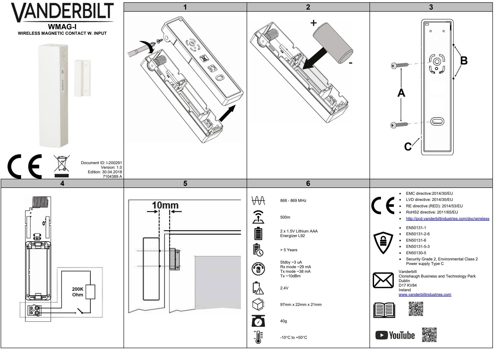

## **EN DE ES FR**

#### **OVERVIEW**

The WMAG-I is an advanced, fully supervised low-current wireless magnetic door/window contact. A built-in reed switch and/or an external wired input may be applied in this device.

#### **DISCOVERY AND ENROLLMENT PROCESS**

- **Discover the WMAG-I detector from the SPC control panel:** 1. In the SPC browser, select **Configuration**>**Wireless** and click **Enroll New Sensor**.
- 2. Open the cover (Fig. 1).
- 3. Insert the battery taking care to observe correct polarity.
- Inserting the battery starts the discovery process from the device.
- 4. During the discovery process, the following LED sequence occurs:

|                          | LED (Fig. 1 item 1) State |                   | Duration (s) |
|--------------------------|---------------------------|-------------------|--------------|
| Power up                 | Green/Red                 | Fast Flash 7 - 10 |              |
| Discovery Start          | Green                     | Slow Flash 3 - 5  |              |
| Discovery Complete Green |                           | Steady            | 3 - 5        |
| Discovery Failed*        | Red                       | Steady            |              |
|                          |                           |                   |              |

5. You can now enroll the device by configuring the Description, Zone, Zone Type and other settings in the SPC system

**Discover and enroll the WMAG-I detector from the keypad** 1. On the keypad, select **WIRELESS>SENSORS>ADD>ENROL**. The keypad displays the **ADD** screen with a flashing **ENROL** 

- **DEVICE** message. 2. Follow steps 2 - 4 in the Discovery process above.
- The keypad displays the **FOUND SENSOR** message. 3. Click **OK.**
- 4. You can now enroll the device by configuring the **AREA**, **ZONE TYP**E and **ZONE** settings.
- 5. Click **OK.**

6. The keypad displays the **UPDATED** message. The WMAG-I is now enrolled on your SPC system.

#### ***DISCOVERY FAILED**

Remove the battery, wait for around 10 seconds and repeat the process.

#### **MOUNTING PROCESS**

The detector and the magnet (and/or external wired input) are mounted using screws to fix to a flat surface. The detector should be mounted on the fixed frame of the door or window, the magnet/input should be mounted on the moving part (**Fig. 5**).

#### **To mount the detector**

- 1. Screw the detector to a flat surface (**Fig. 3, item A**).
- 2. Mount the magnet so that the magnet is aligned with the 2 nibs on the detector casing. (**Fig. 3, item B**). You can ensure correct alignment of the magnet with the detector by observing the detector LED when the SPC system

is in Walktest mode.

**WIRING AN EXTERNAL INPUT (Optional)**

- An external input can be wired to the WMAG-I. 1. Connect the EOL 200K Ohm resistor (supplied) in series with the additional external input no further than 2m from the
- WMAG-I (**Fig. 4**). 2. Use the breakout provided in the back plate (**Fig. 3, item C**) to route the cable to the terminal.

## **BATTERY REPLACEMENT**

CAUTION The battery must be replaced by a 3V Type CR123A Lithium such as VARTA CR123A or GP CR123A.

# **ÜBERBLICK**

Der WMAG-I ist ein moderner, vollständig überwachter und kabelloser Magnetkontakt mit niedrigem Stromverbrauch für die Überwachung von Fenster und Türen. Dieses Gerät könnte einen integrierten Reed-Schalter und/oder einen extern verkabelten Eingang enthalten.

## **ERKENNEN UND EINLERNEN**

**Erkennen des WMAG-I-Melders in der SPC-Zentrale:** 1. Wählen Sie im SPS-Browser die Optionen **Konfiguration>Kabellos**, und klicken Sie auf **Neuen Funkmelder einlernen**.

- 2. Öffnen Sie die Abdeckung (**Abb. 1**).
- 3. Achten Sie beim Einlegen der Batterie auf die korrekte Polarität. Durch das Einlegen der Batterie startet die Erkennung des Gerätes.
- 4. Während der Erkennung leuchten die LEDs in der nachstehenden Reihenfolge:

|                            | LED (Abb. 1, Element 1) | Status                | Dauer (s) |
|----------------------------|----------------------------|-----------------------|-----------|
| Einschalten                | Grün/rot                   | Schnelles Blinken     | 7–10      |
| Erkennungsstart            | Grün                       | Langsames Blinken 3–5 |           |
| Erkennung abgeschlossen | Grün                       | Konstant              | 3–5       |
| Erkennung                  | Rot                        | Konstant              |           |

**fehlgeschlagen*** 5. Sie können nun das Gerät einlernen, indem Sie die Beschreibung, die Zone, den MG-Typ und weitere Einstellungen im SPC-System

#### konfigurieren. **Erkennen und Einlernen des WMAG-I-Melders am**

**Bedienteil:**

- 1. Wählen Sie am Bedienteil **KABELLOS>FUNKMELDER>HINZUFÜGEN>SABO**.
- Das Bedienteil zeigt den Bildschirm **HINZUFÜGEN** mit der
- blinkenden Meldung **GERÄT EINLERNEN** an. 2. Führen Sie die Schritte 2–4 des oben aufgeführten
- Erkennungsvorgangs aus.
- Das Bedienteil zeigt die Meldung **FUNKMELDER GEFUNDEN** an. 3. Klicken Sie auf **OK**.
- 4. Sie können nun das Gerät einlernen, indem Sie die Einstellungen **BEREICH**, **MG-TYP** und **ZONE** konfigurieren.

## 5. Klicken Sie auf **OK**.

6. Das Bedienteil zeigt die Meldung **AKTUALISIERT** an. Der WMAG-I ist nun in Ihrem SPC-System eingelernt.

#### ***ERKENNUNG FEHLGESCHLAGEN**

Nehmen Sie die Batterie heraus, warten Sie etwa 10 Sekunden, und wiederholen Sie den Vorgang.

## **MONTAGE**

Der Melder und der Magnet (und/oder extern verkabelte Eingang) werden mithilfe von Schrauben an einer ebenen Fläche angebracht. Der Melder sollte auf dem festen Rahmen der Tür oder des Fensters und der Magnet/Eingang am beweglichen Teil der Tür bzw. des Fensters befestigt warden (**Abb. 5)**.

## **Montage des Melders**

1. Schrauben Sie den Melder auf eine ebene Fläche (**Abb. 3, Element A**).

- 2. Befestigen Sie den Magnet so, dass er mit den zwei Nasen am Meldergehäuse ausgerichtet ist (**Abb. 3**, **Element B**). Um den Magneten korrekt mit dem Melder auszurichten, beobachten Sie die Melder-LED, während das SPC-System im Gehtest-Modus ist.
#### **VERKABELUNG EINES EXTERNEN EINGANGS (optional)**

Der WMAG-I kann mit einem externen Eingang verkabelt werden: 1. Verbinden Sie den EOL 200k Ohm-Widerstand (beiliegend) in Reihe mit dem zusätzlichen externen Eingang, wobei sich der Eingang maximal 2 m vom WMAG-I entfernt befinden darf (**Abb. 4**). 2. Nutzen Sie die Ausbruchstelle an der Rückplatte (**Abb. 3, Element C**), um das Kabel zur Klemme zu führen.

## **AUSTAUSCH DER BATTERIE**

ACHTUNG Die Batterie muss gegen eine 3-V-Lithium-Batterie vom Typ CR123A ausgetauscht werden (z. B. VARTA CR123A oder GP CR123A).

## **VISIÓN GENERAL**

El WMAG-I es un contacto magnético vía radio para puertas/ventanas avanzado, completamente supervisado y de baja corriente. A este dispositivo se le puede añadir un interruptor de láminas incorporado y/o una entrada conectada de forma externa.

## **PROCESO DE BÚSQUEDA Y REGISTRO**

**Búsqueda del detector WMAG-I desde el panel de control SPC:**

1. En el navegador SPC, seleccione **Configuración>Vía radio** y haga clic en **Registrar un nuevo sensor**.

2. Abra la cubierta (**Fig. 1**).

- 3. Inserte la batería teniendo cuidado de que la polaridad sea la correcta.
Al insertar la batería se inicia el proceso de búsqueda desde el dispositivo.

4. Durante el proceso de búsqueda se produce la siguiente secuencia de LED:

|                                                                                                                                                                                                                                                                                                                                                                     | LED (fig. 1, elemento 1) | Estado                 | Duración (s) |
|---------------------------------------------------------------------------------------------------------------------------------------------------------------------------------------------------------------------------------------------------------------------------------------------------------------------------------------------------------------------|-----------------------------|------------------------|--------------|
| Encendido                                                                                                                                                                                                                                                                                                                                                           | Verde/rojo                  | Parpadeo rápido 7 - 10 |              |
| Iniciar búsqueda                                                                                                                                                                                                                                                                                                                                                    | Verde                       | Parpadeo lento         | 3 - 5        |
| Búsqueda finalizada Verde                                                                                                                                                                                                                                                                                                                                           |                             | Fijo                   | 3 - 5        |
| Búsqueda fallida*                                                                                                                                                                                                                                                                                                                                                   | Rojo                        | Fijo                   |              |
| 5. Ahora puede registrar el dispositivo configurando la descripción, zona, tipo de zona y otros ajustes en el sistema SPC.                                                                                                                                                                                                                                    |                             |                        |              |
| Búsqueda y registro del detector WMAG-I desde el teclado                                                                                                                                                                                                                                                                                                            |                             |                        |              |
| 1. En el teclado, seleccione VÍA RADIO>SENSORES>AÑADIR>REGISTRO.                                                                                                                                                                                                                                                                                                 |                             |                        |              |
| El teclado muestra la pantalla AÑADIR con un mensaje                                                                                                                                                                                                                                                                                                                |                             |                        |              |
| intermitente de DAR DE ALTA DISPOSITIVO.                                                                                                                                                                                                                                                                                                                            |                             |                        |              |
| 2. Siga los pasos 2 a 4 del proceso de búsqueda indicado anteriormente.                                                                                                                                                                                                                                                                                          |                             |                        |              |
| El teclado muestra el mensaje SENSOR ENCONTRADO.                                                                                                                                                                                                                                                                                                                    |                             |                        |              |
| 3. Haga clic en OK.                                                                                                                                                                                                                                                                                                                                                 |                             |                        |              |
| 4. Ahora puede registrar el dispositivo configurando los ajustes                                                                                                                                                                                                                                                                                                    |                             |                        |              |
| ÁREA, TIPO DE ZONA y ZONA.                                                                                                                                                                                                                                                                                                                                          |                             |                        |              |
| 5. Haga clic en OK.                                                                                                                                                                                                                                                                                                                                                 |                             |                        |              |
| 6. El teclado muestra el mensaje ACTUALIZADO. El WMAG-I está ahora registrado en su sistema SPC.                                                                                                                                                                                                                                                                 |                             |                        |              |
| *BÚSQUEDA FALLIDA                                                                                                                                                                                                                                                                                                                                                   |                             |                        |              |
| Retire la batería, espere unos 10 segundos y repita el proceso.                                                                                                                                                                                                                                                                                                     |                             |                        |              |
| PROCESO DE MONTAJE                                                                                                                                                                                                                                                                                                                                                  |                             |                        |              |
| El detector y el imán (y/o la entrada conectada de forma externa) se                                                                                                                                                                                                                                                                                                |                             |                        |              |
| han montado con tornillos para que encajen en una superficie plana.                                                                                                                                                                                                                                                                                                 |                             |                        |              |
| El detector debe montarse en el marco fijo de la puerta o ventana, y                                                                                                                                                                                                                                                                                                |                             |                        |              |
| el imán / la entrada debe montarse en la parte móvil (fig. 5).                                                                                                                                                                                                                                                                                                      |                             |                        |              |
| Montaje del detector                                                                                                                                                                                                                                                                                                                                                |                             |                        |              |
| 1. Atornille el detector a una superficie plana (fig. 3, elemento A). 2. Monte el imán de manera que quede alineado con las dos marcas de la carcasa del detector (fig. 3, elemento B). Puede comprobar la alineación correcta del imán con el detector observando el LED del detector cuando el sistema SPC se encuentra en modo Test de intrusión. |                             |                        |              |
|                                                                                                                                                                                                                                                                                                                                                                     |                             |                        |              |

## **Cableado de una entrada externa (opcional)**

Al WMAG-I se le puede conectar una entrada externa. 1. Conecte la resistencia RFL de 200.000 ohmios (incluida en el suministro) en serie con la entrada externa adicional a no más de 2 metros del WMAG-I (**Fig. 4**). 2. Utilice el orificio situado en la placa trasera (**Fig. 3, elemento** 

**C**) para dirigir el cable al terminal.

## **SUSTITUCIÓN DE LA BATERÍA**

PRECAUCIÓN La batería debe sustituirse por una de litio de 3 V tipo CR123A como por ejemplo VARTA CR123A o GP CR123A.

## **PRÉSENTATION**

Le WMAG-I est un détecteur d'ouverture à contact magnétique sans fil pour portes/fenêtres, à faible consommation de courant et entièrement surveillé. Un interrupteur reed (interrupteur à lames souples) intégré et/ou une entrée câblée externe peuvent être utilisés dans cet appareil.

## **RECHERCHE ET CONNEXION**

**Recherche du détecteur WMAG-I depuis la centrale SPC :**

- 1. Dans le navigateur SPC, sélectionnez **Configuration>Sans fil** et cliquez sur **Connecter un nouveau capteur.**
- 2. Ouvrez le couvercle (**Fig. 1**).
- 3. Insérez la pile en veillant à la polarité.
- Le processus de recherche démarre dès que la pile est insérée. 4. Durant le processus de recherche, la LED change plusieurs fois

|  |  | d'état :                                                                                                        |                           |                                                               |           |
|--|--|-----------------------------------------------------------------------------------------------------------------|---------------------------|---------------------------------------------------------------|-----------|
|  |  |                                                                                                                 | LED (Fig. 1, repère 1) | État                                                          | Durée (s) |
|  |  | Mise sous tension                                                                                               | Vert/rouge                | Clignotement rapide 7 – 10                                    |           |
|  |  | Début de la                                                                                                     | Vert                      | Clignotement lent                                             | 3 - 5     |
|  |  | recherche                                                                                                       |                           |                                                               |           |
|  |  | Recherche terminée Vert                                                                                         |                           | Fixe                                                          | 3 - 5     |
|  |  | Recherche échouée* Rouge                                                                                        |                           | Fixe                                                          |           |
|  |  | 5. Vous pouvez maintenant connecter le dispositif en configurant                                                |                           |                                                               |           |
|  |  |                                                                                                                 |                           | la Description, la Zone, le Type de zone et les autres        |           |
|  |  | paramètres sur le système SPC.                                                                                  |                           |                                                               |           |
|  |  | Recherche et connexion du détecteur WMAG-I depuis le                                                            |                           |                                                               |           |
|  |  | clavier                                                                                                         |                           |                                                               |           |
|  |  | 1. Sur le clavier, sélectionnez SANS                                                                            |                           |                                                               |           |
|  |  | FIL>CAPTEURS>AJOUTER>CONNEXION.                                                                                 |                           |                                                               |           |
|  |  | CONNEXION DU DISPOSITIF clignote.                                                                               |                           | L'écran AJOUTER est affiché sur le clavier ; le message       |           |
|  |  | 2. Suivez les étapes 2 - 4 de la procédure de recherche ci-dessus.                                              |                           |                                                               |           |
|  |  |                                                                                                                 |                           | Le message CAPTEUR TROUVÉ est affiché sur le clavier.         |           |
|  |  | 3. Cliquez sur OK.                                                                                              |                           |                                                               |           |
|  |  | 4. Vous pouvez maintenant connecter le dispositif en configurant                                                |                           |                                                               |           |
|  |  |                                                                                                                 |                           | la ZONE, le TYPE DE ZONE et les paramètres de la ZONE.        |           |
|  |  | 5. Cliquez sur OK.                                                                                              |                           |                                                               |           |
|  |  | 6. Le message MIS À JOUR est affiché.                                                                           |                           |                                                               |           |
|  |  |                                                                                                                 |                           | Le WMAG-I est maintenant connecté à votre système SPC.        |           |
|  |  | *RECHERCHE ÉCHOUÉE                                                                                              |                           |                                                               |           |
|  |  | Retirez la pile, attendez environ 10 secondes et répétez la                                                     |                           |                                                               |           |
|  |  | procédure.                                                                                                      |                           |                                                               |           |
|  |  | MONTAGE                                                                                                         |                           |                                                               |           |
|  |  | Le détecteur et l'aimant (et/ou l'entrée externe filaire) sont montés à                                         |                           |                                                               |           |
|  |  | l'aide de vis pour les fixer sur une surface plane.                                                             |                           |                                                               |           |
|  |  | Le détecteur devrait être monté sur le cadre fixe de la porte                                                   |                           |                                                               |           |
|  |  | (dormant) ou de la fenêtre, l'aimant/l'entrée devrait être monté(e) sur la partie mobile (battant) (Fig. 5). |                           |                                                               |           |
|  |  | Pour monter le détecteur                                                                                        |                           |                                                               |           |
|  |  | 1. Vissez le détecteur sur une surface plane (Fig. 3, repère A).                                                |                           |                                                               |           |
|  |  | 2. Montez l'aimant en l'alignant sur les 2 picots du boîtier du                                                 |                           |                                                               |           |
|  |  | détecteur. (Fig. 3, repère B).                                                                                  |                           |                                                               |           |
|  |  |                                                                                                                 |                           | Vous pouvez assurer l'alignement correct de l'aimant sur le   |           |
|  |  |                                                                                                                 |                           | détecteur en observant la LED du détecteur lorsque le système |           |
|  |  | SPC est en mode Walktest (test de marche).                                                                      |                           |                                                               |           |
|  |  | CÂBLAGE D'UNE ENTRÉE EXTERNE (en option)                                                                        |                           |                                                               |           |
|  |  | Une entrée externe peut être raccordée au WMAG-I.                                                               |                           |                                                               |           |
|  |  | 1. Branchez la résistance fin de ligne 200K ohms (fournie) en                                                   |                           |                                                               |           |
|  |  | WMAG-I (Fig. 4).                                                                                                |                           | série avec l'entrée externe supplémentaire à 2 m maximum du   |           |
|  |  | 2. Utilisez l'ouverture prévue dans la plaque arrière (Fig. 3, repère                                           |                           |                                                               |           |
|  |  | C) pour acheminer le câble jusqu'à la borne.                                                                    |                           |                                                               |           |
|  |  | REMPLACEMENT DE LA PILE                                                                                         |                           |                                                               |           |
|  |  |                                                                                                                 |                           |                                                               |           |
|  |  |                                                                                                                 |                           |                                                               |           |

ATTENTION Utilisez uniquement une pile CR123A 3V au lithium, par exemple VARTA CR123A ou GP CR123A.

| IT                                                                          |                                                                                                            |                                                                                                                                     |                                                             | NL                                                          |                                                                                                                          |                       |                                                         | SV                                                                                                            |                             |                |                                                                                                                      |
|-----------------------------------------------------------------------------|------------------------------------------------------------------------------------------------------------|-------------------------------------------------------------------------------------------------------------------------------------|-------------------------------------------------------------|-------------------------------------------------------------|--------------------------------------------------------------------------------------------------------------------------|-----------------------|---------------------------------------------------------|---------------------------------------------------------------------------------------------------------------|-----------------------------|----------------|----------------------------------------------------------------------------------------------------------------------|
| PANORAMICA                                                                  |                                                                                                            |                                                                                                                                     |                                                             | OVERZICHT                                                   |                                                                                                                          |                       |                                                         | ÖVERSIKT                                                                                                      |                             |                |                                                                                                                      |
| Lo WMAG-I è un contatto porta/finestra magnetico wireless a bassa           |                                                                                                            |                                                                                                                                     | De WMAG-I is een geavanceerd, volledig bewaakt laagspanning |                                                             |                                                                                                                          |                       | WMAG-I-enheten är en avancerad, helt övervakad, trådlös |                                                                                                               |                             |                |                                                                                                                      |
|                                                                             |                                                                                                            | corrente, completamente controllato e avanzato. È possibile                                                                         |                                                             | draadloos magnetisch deur-/venstercontact. Het apparaat kan |                                                                                                                          |                       |                                                         | magnetkontakt för dörrar/fönster med låg spänning. Den här enheten                                            |                             |                |                                                                                                                      |
|                                                                             |                                                                                                            | applicare a questo dispositivo un interruttore Reed e/o un ingresso                                                                 |                                                             |                                                             | worden gebruikt met een ingebouwde reed-schakelaar en/of een                                                             |                       |                                                         | kan användas med en inbyggd reedkontakt och/eller en extern                                                   |                             |                |                                                                                                                      |
| cablato esterno.                                                            |                                                                                                            |                                                                                                                                     |                                                             | externe bedrade ingang.                                     |                                                                                                                          |                       |                                                         | inmatning via kabel.                                                                                          |                             |                |                                                                                                                      |
|                                                                             |                                                                                                            | PROCESSO DI SCOPERTA E RILEVAMENTO                                                                                                  |                                                             |                                                             | PROCEDURE VOOR DETECTIE EN REGISTRATIE                                                                                   |                       |                                                         |                                                                                                               |                             |                | PROCESS FÖR IDENTIFIERING OCH REGISTRERING                                                                           |
|                                                                             |                                                                                                            | Rilevare il rilevatore WMAG-I dal pannello di controllo SPC:                                                                        |                                                             |                                                             | De WMAG-I-detector detecteren vanaf het SPC                                                                              |                       |                                                         | Identifiera WMAG-I-detektorn från SPC-kontrollpanelen:                                                        |                             |                |                                                                                                                      |
|                                                                             |                                                                                                            | 1. Nel browser SPC selezionare Configurazione>Wireless e fare                                                                       |                                                             | bedieningspaneel                                            |                                                                                                                          |                       |                                                         | 1. I SPC-webbläsaren, välj Konfiguration>Trådlös och klicka på                                                |                             |                |                                                                                                                      |
| clic su Registra nuovo sensore. 2. Aprire il coperchio (Fig. 1).         |                                                                                                            |                                                                                                                                     |                                                             |                                                             | 1. Open de SPC-browser, selecteer Configuratie>Draadloos en                                                              |                       |                                                         | Registrera ny sensor.                                                                                         |                             |                |                                                                                                                      |
|                                                                             |                                                                                                            | 3. Inserire la batteria prestando attenzione a rispettare la corretta                                                               |                                                             | 2. Open de klep (Afb. 1).                                   | klik op Nieuwe sensor registreren.                                                                                       |                       |                                                         | 2. Ta bort locket (bild 1). 3. Sätt i batteriet och kontrollera att polariteten är korrekt.                |                             |                |                                                                                                                      |
| polarità.                                                                   |                                                                                                            |                                                                                                                                     |                                                             |                                                             | 3. Plaats de batterij. Let op de polariteit.                                                                             |                       |                                                         | När batteriet har satts i börjar identifieringsprocessen från                                                 |                             |                |                                                                                                                      |
|                                                                             |                                                                                                            | L'inserimento della batteria dà inizio al processo di rilevamento                                                                   |                                                             |                                                             | Door het plaatsen van de batterij wordt het detectieproces van                                                           |                       |                                                         | enheten.                                                                                                      |                             |                |                                                                                                                      |
| dal dispositivo.                                                            |                                                                                                            |                                                                                                                                     |                                                             | het apparaat gestart.                                       |                                                                                                                          |                       |                                                         | 4. Under identifieringsprocessen lyser/blinkar lysdioderna på                                                 |                             |                |                                                                                                                      |
| sequenza LED:                                                               |                                                                                                            | 4. Durante il processo di rilevamento ha luogo la seguente                                                                          |                                                             |                                                             | 4. Tijdens het detectieproces gaan de ledlampjes als volgt                                                               |                       |                                                         | följande sätt:                                                                                                |                             |                |                                                                                                                      |
|                                                                             | LED (Fig. 1,                                                                                               | Stato                                                                                                                               | Durata                                                      | branden:                                                    |                                                                                                                          |                       |                                                         |                                                                                                               | Lysdiod (bild 1, post 1) | Status         | Varaktighet (sek)                                                                                                    |
|                                                                             | elemento 1)                                                                                                |                                                                                                                                     | (s)                                                         |                                                             | LED (Afb. 1 item 1) Status                                                                                               |                       | Duur (s)                                                | Uppstart                                                                                                      |                             | Snabba         |                                                                                                                      |
| Accensione                                                                  |                                                                                                            | Verde/Rosso Lampeggia velocemente 7 - 10                                                                                            |                                                             | Opstarten                                                   | Groen/rood                                                                                                               | Snel knipperen        | 7 - 10                                                  |                                                                                                               | Grönt/rött ljus             | blinkningar    | 7–10                                                                                                                 |
| Inizio rilevamento Verde                                                    |                                                                                                            | Lampeggia lentamente                                                                                                                | 3 - 5                                                       | Start van detectie Groen                                    |                                                                                                                          | Langzaam knipperen | 3 - 5                                                   | Identifiering inleds Grönt ljus                                                                               |                             | Långsamma      | 3–5                                                                                                                  |
| Rilevamento                                                                 | Verde                                                                                                      | Fisso                                                                                                                               | 3 - 5                                                       | Detectie voltooid Groen                                     |                                                                                                                          | Brandt                | 3 - 5                                                   |                                                                                                               |                             | blinkningar    |                                                                                                                      |
| completato                                                                  |                                                                                                            |                                                                                                                                     |                                                             | Detectie mislukt* Rood                                      |                                                                                                                          | Brandt                |                                                         | Identifiering                                                                                                 | Grönt ljus                  | Fast ljus      | 3–5                                                                                                                  |
| Rilevamento non                                                             | Rosso                                                                                                      | Fisso                                                                                                                               |                                                             | 5.                                                          | U kunt het apparaat nu registreren door de beschrijving, de                                                              |                       |                                                         | avslutad                                                                                                      |                             |                |                                                                                                                      |
| riuscito*                                                                   |                                                                                                            |                                                                                                                                     |                                                             |                                                             | zone, het zonetype en andere instellingen te configureren in                                                             |                       |                                                         | Identifiering                                                                                                 | Rött ljus                   | Fast ljus      |                                                                                                                      |
|                                                                             |                                                                                                            | 5. Adesso è possibile registrare il dispositivo configurando la                                                                     |                                                             | het SPC-systeem                                             |                                                                                                                          |                       |                                                         | misslyckades* 5. Du kan nu tilldela enheten genom att konfigurera Beskrivning,                             |                             |                |                                                                                                                      |
| sistema SPC                                                                 |                                                                                                            | Descrizione, la Zona, il Tipo di zona e altre impostazioni nel                                                                      |                                                             |                                                             | De WMAG-I-detector detecteren en registreren vanaf de                                                                    |                       |                                                         | Sektion, Sektionstyp och andra inställningar i SPC-systemet.                                                  |                             |                |                                                                                                                      |
|                                                                             |                                                                                                            | Rilevare e registrare il rilevatore WMAG-I dalla tastiera                                                                           |                                                             | keypad                                                      |                                                                                                                          |                       |                                                         | Identifiera och tilldela WMAG-I-detektorn med hjälp av                                                        |                             |                |                                                                                                                      |
| 1. Sulla tastiera selezionare                                               |                                                                                                            |                                                                                                                                     |                                                             | 1. Selecteer op de keypad                                   |                                                                                                                          |                       |                                                         | manöverpanelen                                                                                                |                             |                |                                                                                                                      |
|                                                                             |                                                                                                            | WIRELESS>SENSORI>AGGIUNGI>REGISTRA.                                                                                                 |                                                             |                                                             | DRAADLOOS>SENSOREN>TOEVOEGEN>REGISTREREN. Het scherm TOEVOEGEN wordt geopend. Hierin knippert het                     |                       |                                                         | 1. Välj TRÅDLÖS>SENSORER>LÄGG TILL>REGISTRERA med                                                             |                             |                |                                                                                                                      |
|                                                                             |                                                                                                            | La tastiera mostra la schermata AGGIUNGI con il messaggio                                                                           |                                                             |                                                             | bericht APPARAAT REGISTREREN.                                                                                            |                       |                                                         | hjälp av manöverpanelen.                                                                                      |                             |                |                                                                                                                      |
| REGISTRA DISPOSITIVO lampeggiante.                                          |                                                                                                            |                                                                                                                                     |                                                             |                                                             | 2. Voer stap 2 - 4 uit van het hierboven beschreven                                                                      |                       |                                                         | Skärmbilden LÄGG TILL med det blinkande meddelandet                                                           |                             |                |                                                                                                                      |
|                                                                             |                                                                                                            | 2. Seguire i passaggi 2 - 4 del processo di rilevamento sopra.                                                                      |                                                             | detectieproces.                                             |                                                                                                                          |                       |                                                         | REGISTRERA ENHET visas på manöverpanelen.                                                                     |                             |                |                                                                                                                      |
|                                                                             |                                                                                                            | La tastiera mostra il messaggio SENSORE TROVATO.                                                                                    |                                                             |                                                             | Op het keypad verschijnt het bericht SENSOR GEVONDEN.                                                                    |                       |                                                         | 2. Följ steg 2–4 i identifieringsprocessen ovan.                                                              |                             |                |                                                                                                                      |
| 3. Fare clic su OK.                                                         |                                                                                                            | 3. Klik op OK.                                                                                                                      |                                                             |                                                             | Meddelandet SENSOR HITTAD visas på manöverpanelen.                                                                       |                       |                                                         |                                                                                                               |                             |                |                                                                                                                      |
|                                                                             | 4. Adesso è possibile registrare il dispositivo configurando le impostazioni AREA, TIPO DI ZONA e ZONA. |                                                                                                                                     |                                                             | 4. U kunt het apparaat nu registreren door het GEBIED, ZONE |                                                                                                                          |                       |                                                         |                                                                                                               |                             |                |                                                                                                                      |
|                                                                             |                                                                                                            |                                                                                                                                     |                                                             |                                                             |                                                                                                                          |                       |                                                         | 3. Klicka på OK.                                                                                              |                             |                |                                                                                                                      |
| 5. Fare clic su OK.                                                         |                                                                                                            |                                                                                                                                     |                                                             |                                                             | TYPE en de ZONE in te stellen.                                                                                           |                       |                                                         | 4. Du kan nu tilldela enheten genom att konfigurera inställningarna för OMRÅDE, SEKTIONSTYP och SEKTION.   |                             |                |                                                                                                                      |
|                                                                             |                                                                                                            |                                                                                                                                     |                                                             | 5. Klik op OK.                                              | 6. Op het keypad verschijnt het bericht BIJGEWERKT.                                                                      |                       |                                                         | 5. Klicka på OK.                                                                                              |                             |                |                                                                                                                      |
| Lo WMAG-I è ora registrato sul sistema SPC.                                 |                                                                                                            |                                                                                                                                     |                                                             |                                                             | De WMAG-I is nu geregistreerd bij het SPC-systeem.                                                                       |                       |                                                         | 6. Meddelandet UPPDATERAD visas på manöverpanelen.                                                            |                             |                |                                                                                                                      |
| 6. La tastiera mostra il messaggio AGGIORNATO. *RILEVAMENTO NON RIUSCITO |                                                                                                            |                                                                                                                                     |                                                             | *DETECTIE MISLUKT                                           |                                                                                                                          |                       |                                                         | WMAG-I-enheten finns nu registrerad i ditt SPC-system.                                                        |                             |                |                                                                                                                      |
|                                                                             |                                                                                                            | Togliere la batteria, attendere circa 10 secondi e ripetere il processo.                                                            |                                                             |                                                             | Verwijder de batterij, wacht ongeveer 10 seconden en herhaal het                                                         |                       |                                                         | *IDENTIFIERING MISSLYCKADES                                                                                   |                             |                |                                                                                                                      |
| PROCESSO DI MONTAGGIO                                                       |                                                                                                            |                                                                                                                                     |                                                             | proces.                                                     |                                                                                                                          |                       |                                                         | Plocka ur batteriet, vänta i cirka 10 sekunder och upprepa sedan                                              |                             |                |                                                                                                                      |
|                                                                             |                                                                                                            | Il rilevatore e il magnete (e/o ingresso cablato esterno) sono montati                                                              |                                                             | DETECTOR MONTEREN                                           |                                                                                                                          |                       |                                                         | processen.                                                                                                    |                             |                |                                                                                                                      |
| con viti per essere fissati a una superficie piatta.                        |                                                                                                            |                                                                                                                                     |                                                             |                                                             | De detector en de magneet (en/of externe bedrade ingang) worden                                                          |                       |                                                         | MONTERINGSPROCESS                                                                                             |                             |                |                                                                                                                      |
|                                                                             |                                                                                                            | Il rilevatore deve essere montato sul telaio fisso della porta o finestra,                                                          |                                                             |                                                             | met schroeven op een vlak oppervlak bevestigd.                                                                           |                       |                                                         | Detektorn och magneten (och/eller inmatningen via en extern kabel)                                            |                             |                |                                                                                                                      |
|                                                                             |                                                                                                            | il magnete/ingresso deve essere montato sulla parte mobile (Fig. 5).                                                                |                                                             |                                                             | De detector moet worden gemonteerd op het deur- of vensterkozijn.                                                        |                       |                                                         | monteras med hjälp av skruvar på en plan yta.                                                                 |                             |                |                                                                                                                      |
|                                                                             |                                                                                                            |                                                                                                                                     |                                                             |                                                             | Bevestig de magneet/ingang op de deur of het venster zelf (Afb. 5).                                                      |                       |                                                         | Detektorn bör monteras på den fasta delen av en dörr eller ett fönster                                        |                             |                |                                                                                                                      |
| elemento A).                                                                |                                                                                                            | 1. Fissare il rilevatore con viti a una superficie piatta (Fig. 3,                                                                  |                                                             |                                                             | Ga als volgt om de detector te monteren                                                                                  |                       |                                                         | (på karmen). Magneten/inmatningen bör monteras på den rörliga                                                 |                             |                |                                                                                                                      |
|                                                                             |                                                                                                            | 2. Montare il magnete in modo che questo sia allineato con i 2                                                                      |                                                             |                                                             | 1. Schroef de detector op een vlak oppervlak (Afb. 3, item A).                                                           |                       |                                                         | delen (bild 5).                                                                                               |                             |                |                                                                                                                      |
|                                                                             |                                                                                                            | pennini sull'alloggiamento del rilevatore. (Fig. 3, elemento B).                                                                    |                                                             |                                                             | 2. Bevestig de magneet zo dat de magneet op een lijn ligt met de 2                                                       |                       |                                                         | Gör så här för att montera detektorn                                                                          |                             |                |                                                                                                                      |
|                                                                             |                                                                                                            | È possibile garantire l'allineamento corretto del magnete con il                                                                    |                                                             |                                                             | punten op de behuizing van de detector. (Afb. 3, item B). U kunt controleren of de magneet goed is uitgelijnd door te |                       |                                                         | 1. Skruva fast detektorn på en plan yta (bild 3, post A).                                                     |                             |                |                                                                                                                      |
|                                                                             |                                                                                                            | rilevatore osservando il LED del rilevatore quando il sistema                                                                       |                                                             |                                                             | kijken naar de led van de detector als het SPC-systeem in de                                                             |                       |                                                         | 2. Montera magneten så att den hamnar på samma höjd som de två stiften på detektorhöljet (bild 3, post B). |                             |                |                                                                                                                      |
| SPC è in modalità Walktest (Test camminata).                                |                                                                                                            |                                                                                                                                     |                                                             | modus Looptest staat.                                       |                                                                                                                          |                       |                                                         | Du kan kontrollera om magnetens justering mot detektorn är                                                    |                             |                |                                                                                                                      |
|                                                                             |                                                                                                            | COLLEGAMENTO DI UN INGRESSO ESTERNO                                                                                                 |                                                             |                                                             | EEN EXTERNE INGANG BEDRADEN (optioneel)                                                                                  |                       |                                                         | korrekt genom att titta på detektorns lysdiod när SPC-systemet                                                |                             |                |                                                                                                                      |
| Per montare il rilevatore (Opzionale)                                    |                                                                                                            |                                                                                                                                     |                                                             |                                                             | Er kan een externe ingang worden aangesloten op de WMAG-I.                                                               |                       |                                                         | är i gångtestläget.                                                                                           |                             |                |                                                                                                                      |
|                                                                             |                                                                                                            | È possibile collegare un ingresso esterno al WMAG-I.                                                                                |                                                             |                                                             | 1. Sluit de EOL 200K ohm resistor (meegeleverd) in serie aan met                                                         |                       |                                                         | KABELDRAGNING FÖR EXTERN INMATNING (valfritt)                                                                 |                             |                |                                                                                                                      |
|                                                                             |                                                                                                            | 1. Collegare il resistore EOL 200K Ohm (in dotazione) in serie con                                                                  |                                                             |                                                             | de aanvullende externe ingang op niet meer dan 2 meter                                                                   |                       |                                                         | En kabel kan dras för extern inmatning till WMAG-I.                                                           |                             |                |                                                                                                                      |
|                                                                             |                                                                                                            | collegamento esterno aggiuntivo a una distanza massima di 2 m                                                                       |                                                             |                                                             | afstand van de WMAG-I (Afb. 4).                                                                                          |                       |                                                         | 1. Anslut motståndet EOL 200K Ohm (medföljer) i serie med den                                                 |                             |                |                                                                                                                      |
| dallo WMAG-I (Fig. 4).                                                      |                                                                                                            |                                                                                                                                     |                                                             |                                                             | 2. Gebruik het uitbreekpunt op de achterplaat (Afb. 3, item C) om                                                        |                       |                                                         |                                                                                                               |                             |                | extra, externa inmatningen. Denna får sitta högst två meter från                                                     |
|                                                                             |                                                                                                            | 2. Usare il punto di passaggio perforabile della piastra posteriore (Fig. 3, elemento C) per la posa del cavo fino al terminale. |                                                             |                                                             | de kabel naar de terminal te leiden.                                                                                     |                       |                                                         | WMAG-I (bild 4).                                                                                              |                             |                |                                                                                                                      |
|                                                                             |                                                                                                            |                                                                                                                                     |                                                             | BATTERIJ VERVANGEN                                          |                                                                                                                          |                       |                                                         | 2. Använd det förstansade hålet på baksidan av plattan (bild 3,                                               |                             |                |                                                                                                                      |
|                                                                             |                                                                                                            |                                                                                                                                     |                                                             |                                                             |                                                                                                                          | LET OP                |                                                         | post C) för att ansluta kabeln till terminalen.                                                               |                             |                |                                                                                                                      |
|                                                                             |                                                                                                            | ATTENZIONE                                                                                                                          |                                                             |                                                             | De batterij moet worden vervangen door een 3 V lithium                                                                   |                       |                                                         | BYTE AV BATTERI                                                                                               |                             |                |                                                                                                                      |
|                                                                             |                                                                                                            | La batteria deve essere sostituita con una batteria tipo 3V                                                                         |                                                             |                                                             | batterij van het type CR123A, zoals VARTA CR123A of GP                                                                   |                       |                                                         |                                                                                                               |                             | VAR FÖRSIKTIG! |                                                                                                                      |
| SOSTITUZIONE DELLA BATTERIA                                                 |                                                                                                            | CR123A al litio come VARTA CR123A o GP CR123A.                                                                                      |                                                             |                                                             |                                                                                                                          | CR123A.               |                                                         |                                                                                                               |                             |                | Batteriet måste bytas ut mot ett litiumbatteri på 3 V av typen CR123A. Till exempel VARTA CR123A eller GP CR123A. |