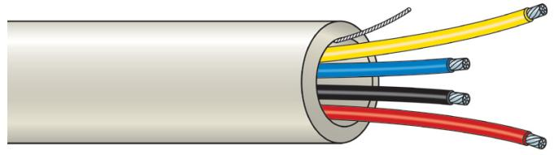

### Produktblad

## WN104W

Installationskabel (100 meter/rulle)

#### Standardprestanda

- EFlexibel installationskabel för inomhusbruk
- EPVC

# WN104W

Installationskabel (100 meter/rulle)

#### Tekniska data

| Core                            |                             |
|---------------------------------|-----------------------------|
| Material                        | Bare copper                 |
| Thickness                       | 0.22 mm2                    |
| Colour                          | Red, yellow, blue, black    |
|                                 |                             |
| Jacket                          |                             |
| Thickness                       | Min. 0.45 mm² - max 0.7 mm² |
| Colour                          | White                       |
| Electrical characteristics      |                             |
| Max. conductor DC resistance | 92.4 ohm/km at +20°C        |
| Current rating                  | 1 A                         |
| Mutual capacitance              | 90 pF/m                     |

Order data

ArtikelnummerWN104W

 Installationskabel (100 meter/rulle)

Beskrivning

