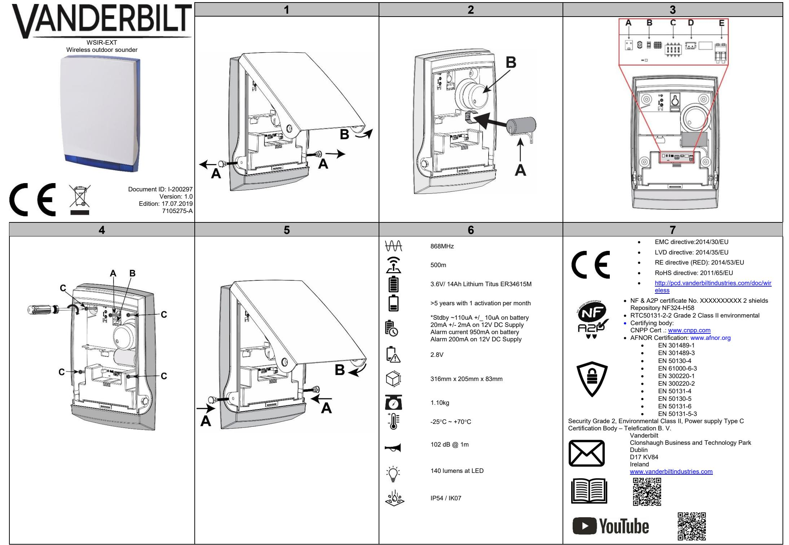

### **OVERVIEW**

The WSIR-EXT B/R/O (Blue, Red or Orange lens colour) is a wireless two-way self-powered external sounder/beacon available with various coloured lenses. It features fully supervised communication, highly reliable operation and optimal wireless performance, including visual and audible indications. The WSIR-EXT is designed for use with the SPC control panel only.

### **DISCOVERY AND ENROLLMENT PROCESS**

#### **Discover the WSIR-EXT from the SPC panel browser:**

- 1. Login as Full Engineer.
- 2. Select **Configuration > Wireless > Two Way** and click **Enrol New Device**.
- 3. Remove the caps from the pivot screws and take the pivot screws all the way out (**Fig. 1, item A**).
- 4. Remove the WSIR-EXT cover (**Fig. 1, item B**).
- 5. Power up the WSIR-EXT by inserting the battery (**Fig. 2, item A**) and connecting the battery to the **-BAT+** connection on the PCB (**Fig. 2, item B**). Connecting the battery starts the discovery process from the WSIR-EXT. During the discovery process, the following LED sequence occurs:

| Product State                     | Status LEDs (Fig. 3, item B)                                                                                                                | Sounder                                                                  | Hi O/P LED |     |  |
|-----------------------------------|---------------------------------------------------------------------------------------------------------------------------------------------|--------------------------------------------------------------------------|------------|-----|--|
|                                   | Green LED                                                                                                                                   | Red LED                                                                  |            |     |  |
| Power UP (Reset) Process          | Alternately blinking Green & Red LED for 500ms ON and 500ms OFF during device initialization and until ready. Starting with Green LED |                                                                          | No         | No  |  |
| Discovery Failed                  | OFF                                                                                                                                         | Blinking 250ms ON 250ms OFF for 10 seconds immediately after power up | No         | No  |  |
| Discovery Process                 | Blinking 250ms on 250ms OFF during all registration process                                                                              | OFF                                                                      | No         | No  |  |
| Discovery success                 | Constant ON for 3 seconds                                                                                                                   | OFF                                                                      | No         | No  |  |
| Discovery failed                  | Blinking 250ms on 750ms OFF for 10 Sec                                                                                                   | OFF                                                                      | No         | No  |  |
| Tamper                            | No local visual indication. Refer to SPC panel browser, keypad.                                                                             |                                                                          | Yes        | Yes |  |
| Low Battery                       |                                                                                                                                             | No local visual indication. Refer to SPC panel browser, keypad.          |            |     |  |
| Table 1: WSIR-EXT LED indications |                                                                                                                                             |                                                                          | No         | No  |  |

- When the WSIR-EXT is mounted on the wall, the status LED's (**Fig. 3, item B**) are only visible at the device and are not visible from ground level.
- 6. When the discovery process succeeds, the SPC Panel browser displays the **Received, S/N, Status, Type, Version, Signal,**  and **Receiver** information.
- 7. Click **Add** to display the **Output Configuration** page.
- 8. Identify the WSIR-EXT by entering a name in the **Description** field (maximum 16 characters).

- 9. Select **Internal Bell** in the **Bell** drop-down.
- 10. Select volume level 1 to 4 in the Volume drop-down. For more information, see Table 2: WSIR_EXT siren output levels.
- 11. Select **System** or **Area** as appropriate in the **Area** drop-down.
- 12. Select **Tamper** in the **Tamper Option** drop-down.
- 13. Click **Save** to confirm the configuration settings for the WSIR-EXT.
- The WSIR-EXT is now enrolled on your SPC system.
- 14. Click **Back** to return to the **Wireless – Enrolled List** page.

#### **Siren output level**

| Volume setting | Sounder output |
|----------------|----------------|
| Level 1        | 85 dB          |
| Level 2        | 95 dB          |
| Level 3        | 99 dB          |
| Level 4        | 102 dB         |

*Table 2: WSIR_EXT siren output levels*

### **EN DE ÜBERBLICK**

Die WSIR-EXT B/R/O (mit blauer, roter oder oranger Linsenfarbe) ist eine selbstbetriebene externe bidirektionale Sirene/-Warnleuchte mit verschiedenfarbigen Linsen. Sie bietet Kommunikation mit Komplettüberwachung, einen äußerst zuverlässigen Betrieb und eine optimale Funkleistung einschließlich visueller und akustischer Anzeigen. Die WSIR-EXT ist ausschließlich für den Einsatz mit der SPC-Zentrale vorgesehen.

### **VERFAHREN ZU ERKENNUNG UND EINLERNEN**

#### **Machen Sie die WSIR-EXT über den Browser der SPC-Zentrale ausfindig:**

- 1. Melden Sie sich im Konfigurationsmodus an.
- 2. Wählen Sie **Konfiguration > Funk > Zwei Wege** und klicken Sie auf **Neues Gerät einlernen**.
- 3. Nehmen Sie die Kappen von den Gelenkschrauben und nehmen Sie die Schrauben ganz heraus (**Abb. 1, Position A**).
- 4. Nehmen Sie das Gehäuse der WSIR-EXT ab (**Abb. 1, Position B**).
- 5. Schalten Sie die WSIR-EXT ein, indem Sie die Batterie einlegen (**Fig. 2, item A**) und diese an der Leiterplatte mit **-BAT+** verbinden (**Abb. 2, Position B**). Durch das Anschließen der Batterie wird das Erkennungsverfahren in der WSIR-EXT initiiert.

Während des Erkennungsverfahrens läuft folgende LED-Sequenz ab:

| Power UP (Reset) Process                                                                                                                                                                                                                                                                                                                                                                                                                                                                                                                                                                                                                                                                                                                                                                                                                                                                           |                                                                                                                                                                                                                           | Alternately blinking Green & Red LED for 500ms ON and 500ms OFF during No                                                                                                                                                                                                                               |                                                                                                                                                                                                                                                                                                                                                                                                                                                                                                                                                                                                                                                                                                                                                                                                                                                        | No                                       | Artikelstatus                                       | Status-LEDs (Abb. 3, Position B)                                                                                                                                                                      |                                                                                                                                                                                                                                                                                                                                                                                                                                                             | Sirene                                                                                                                                                                                                                                                                                                                                                                                                                                                                                                                                                        | Hi O/P LED  |             |  |
|----------------------------------------------------------------------------------------------------------------------------------------------------------------------------------------------------------------------------------------------------------------------------------------------------------------------------------------------------------------------------------------------------------------------------------------------------------------------------------------------------------------------------------------------------------------------------------------------------------------------------------------------------------------------------------------------------------------------------------------------------------------------------------------------------------------------------------------------------------------------------------------------------|---------------------------------------------------------------------------------------------------------------------------------------------------------------------------------------------------------------------------|------------------------------------------------------------------------------------------------------------------------------------------------------------------------------------------------------------------------------------------------------------------------------------------------------------|--------------------------------------------------------------------------------------------------------------------------------------------------------------------------------------------------------------------------------------------------------------------------------------------------------------------------------------------------------------------------------------------------------------------------------------------------------------------------------------------------------------------------------------------------------------------------------------------------------------------------------------------------------------------------------------------------------------------------------------------------------------------------------------------------------------------------------------------------------|------------------------------------------|-----------------------------------------------------|-------------------------------------------------------------------------------------------------------------------------------------------------------------------------------------------------------|-------------------------------------------------------------------------------------------------------------------------------------------------------------------------------------------------------------------------------------------------------------------------------------------------------------------------------------------------------------------------------------------------------------------------------------------------------------|---------------------------------------------------------------------------------------------------------------------------------------------------------------------------------------------------------------------------------------------------------------------------------------------------------------------------------------------------------------------------------------------------------------------------------------------------------------------------------------------------------------------------------------------------------------|-------------|-------------|--|
|                                                                                                                                                                                                                                                                                                                                                                                                                                                                                                                                                                                                                                                                                                                                                                                                                                                                                                    |                                                                                                                                                                                                                           | device initialization and until ready.                                                                                                                                                                                                                                                                     |                                                                                                                                                                                                                                                                                                                                                                                                                                                                                                                                                                                                                                                                                                                                                                                                                                                        |                                          |                                                     |                                                                                                                                                                                                       | Grüne LED                                                                                                                                                                                                                                                                                                                                                                                                                                                   | Rote LED                                                                                                                                                                                                                                                                                                                                                                                                                                                                                                                                                      |             |             |  |
| Discovery Failed                                                                                                                                                                                                                                                                                                                                                                                                                                                                                                                                                                                                                                                                                                                                                                                                                                                                                   | OFF                                                                                                                                                                                                                       | Starting with Green LED                                                                                                                                                                                                                                                                                    | Blinking 250ms ON 250ms OFF for 10                                                                                                                                                                                                                                                                                                                                                                                                                                                                                                                                                                                                                                                                                                                                                                                                                     | No                                       | No                                                  | Inbetriebnahme (Rückstell)- Verfahren                                                                                                                                                              | betriebsbereiten Status abwechselnd für 500 ms EIN und 500 ms AUS.                                                                                                                                                                                                                                                                                                                                                                                          | Die grüne und rote LED blinken während der Inbetriebnahme des Geräts bis zum                                                                                                                                                                                                                                                                                                                                                                                                                                                                                  | mit Display | mit Display |  |
| Discovery Process                                                                                                                                                                                                                                                                                                                                                                                                                                                                                                                                                                                                                                                                                                                                                                                                                                                                                  | all registration process                                                                                                                                                                                                  | Blinking 250ms on 250ms OFF during                                                                                                                                                                                                                                                                         | seconds immediately after power up OFF                                                                                                                                                                                                                                                                                                                                                                                                                                                                                                                                                                                                                                                                                                                                                                                                              | No                                       | No                                                  | Erkennung fehlgeschlagen                                                                                                                                                                              | Beginn mit der grünen LED AUS                                                                                                                                                                                                                                                                                                                                                                                                                            | Unmittelbar nach der Inbetriebnahme blinken für 10 Sekunden 250 ms EIN 250                                                                                                                                                                                                                                                                                                                                                                                                                                                                                 | mit Display | mit Display |  |
| Discovery success                                                                                                                                                                                                                                                                                                                                                                                                                                                                                                                                                                                                                                                                                                                                                                                                                                                                                  |                                                                                                                                                                                                                           | Constant ON for 3 seconds                                                                                                                                                                                                                                                                                  | OFF                                                                                                                                                                                                                                                                                                                                                                                                                                                                                                                                                                                                                                                                                                                                                                                                                                                    | No                                       | No                                                  |                                                                                                                                                                                                       |                                                                                                                                                                                                                                                                                                                                                                                                                                                             | ms AUS                                                                                                                                                                                                                                                                                                                                                                                                                                                                                                                                                        |             |             |  |
| Discovery failed                                                                                                                                                                                                                                                                                                                                                                                                                                                                                                                                                                                                                                                                                                                                                                                                                                                                                   | Sec                                                                                                                                                                                                                       | Blinking 250ms on 750ms OFF for 10                                                                                                                                                                                                                                                                         | OFF                                                                                                                                                                                                                                                                                                                                                                                                                                                                                                                                                                                                                                                                                                                                                                                                                                                    | No                                       | No                                                  | Erkennungsverfahren                                                                                                                                                                                   | Während des gesamten Registrierungsverfahrens blinken 250 ml EIN 250 ms AUS                                                                                                                                                                                                                                                                                                                                                                           | AUS                                                                                                                                                                                                                                                                                                                                                                                                                                                                                                                                                           | mit Display | mit Display |  |
| Tamper                                                                                                                                                                                                                                                                                                                                                                                                                                                                                                                                                                                                                                                                                                                                                                                                                                                                                             |                                                                                                                                                                                                                           | No local visual indication. Refer to SPC panel browser, keypad.                                                                                                                                                                                                                                            |                                                                                                                                                                                                                                                                                                                                                                                                                                                                                                                                                                                                                                                                                                                                                                                                                                                        | Yes                                      | Yes                                                 | Erkennung erfolgreich                                                                                                                                                                                 | Leutet durchgehend für 3 Sekunden                                                                                                                                                                                                                                                                                                                                                                                                                           | AUS                                                                                                                                                                                                                                                                                                                                                                                                                                                                                                                                                           | mit Display | mit Display |  |
| Low Battery                                                                                                                                                                                                                                                                                                                                                                                                                                                                                                                                                                                                                                                                                                                                                                                                                                                                                        |                                                                                                                                                                                                                           | No local visual indication. Refer to SPC panel browser, keypad.                                                                                                                                                                                                                                            |                                                                                                                                                                                                                                                                                                                                                                                                                                                                                                                                                                                                                                                                                                                                                                                                                                                        | No                                       | No                                                  | Erkennung fehlgeschlagen                                                                                                                                                                              | Blinkt 250 ms EIN 750 ms AUS für 10                                                                                                                                                                                                                                                                                                                                                                                                                         | AUS                                                                                                                                                                                                                                                                                                                                                                                                                                                                                                                                                           | mit Display | mit Display |  |
|                                                                                                                                                                                                                                                                                                                                                                                                                                                                                                                                                                                                                                                                                                                                                                                                                                                                                                    | Table 1: WSIR-EXT LED indications                                                                                                                                                                                         |                                                                                                                                                                                                                                                                                                            |                                                                                                                                                                                                                                                                                                                                                                                                                                                                                                                                                                                                                                                                                                                                                                                                                                                        |                                          |                                                     |                                                                                                                                                                                                       | Sekunden                                                                                                                                                                                                                                                                                                                                                                                                                                                    |                                                                                                                                                                                                                                                                                                                                                                                                                                                                                                                                                               |             |             |  |
|                                                                                                                                                                                                                                                                                                                                                                                                                                                                                                                                                                                                                                                                                                                                                                                                                                                                                                    |                                                                                                                                                                                                                           |                                                                                                                                                                                                                                                                                                            |                                                                                                                                                                                                                                                                                                                                                                                                                                                                                                                                                                                                                                                                                                                                                                                                                                                        |                                          |                                                     | Sabo                                                                                                                                                                                                  | Keine lokale visuelle Anzeige. Siehe Browser der SPC-Zentrale, Bedienteil.                                                                                                                                                                                                                                                                                                                                                                                  |                                                                                                                                                                                                                                                                                                                                                                                                                                                                                                                                                               | mit Display | mit Display |  |
| from ground level.                                                                                                                                                                                                                                                                                                                                                                                                                                                                                                                                                                                                                                                                                                                                                                                                                                                                                 |                                                                                                                                                                                                                           |                                                                                                                                                                                                                                                                                                            | When the WSIR-EXT is mounted on the wall, the status LED's (Fig. 3, item B) are only visible at the device and are not visible                                                                                                                                                                                                                                                                                                                                                                                                                                                                                                                                                                                                                                                                                                                         |                                          |                                                     | Batteriestand niedrig                                                                                                                                                                                 |                                                                                                                                                                                                                                                                                                                                                                                                                                                             | Keine lokale visuelle Anzeige. Siehe Browser der SPC-Zentrale, Bedienteil. mit Display mit Display                                                                                                                                                                                                                                                                                                                                                                                                                                                      |             |             |  |
|                                                                                                                                                                                                                                                                                                                                                                                                                                                                                                                                                                                                                                                                                                                                                                                                                                                                                                    |                                                                                                                                                                                                                           |                                                                                                                                                                                                                                                                                                            |                                                                                                                                                                                                                                                                                                                                                                                                                                                                                                                                                                                                                                                                                                                                                                                                                                                        |                                          |                                                     | Tabelle 3: LED-Anzeigen an der WSIR-EXT                                                                                                                                                               |                                                                                                                                                                                                                                                                                                                                                                                                                                                             |                                                                                                                                                                                                                                                                                                                                                                                                                                                                                                                                                               |             |             |  |
| 6. 7. 8. 9. 10. 11. 12. 13. 14. Volume setting Level 1 Level 2 Level 3 Level 4                                                                                                                                                                                                                                                                                                                                                                                                                                                                                                                                                                                                                                                                                                                                                                              | and Receiver information. Select Internal Bell in the Bell drop-down. Select Tamper in the Tamper Option drop-down. Sounder output 85 dB 95 dB 99 dB 102 dB Table 2: WSIR_EXT siren output levels | Click Add to display the Output Configuration page. Select System or Area as appropriate in the Area drop-down. Click Save to confirm the configuration settings for the WSIR-EXT. The WSIR-EXT is now enrolled on your SPC system. Click Back to return to the Wireless – Enrolled List page. | When the discovery process succeeds, the SPC Panel browser displays the Received, S/N, Status, Type, Version, Signal, Identify the WSIR-EXT by entering a name in the Description field (maximum 16 characters). Select volume level 1 to 4 in the Volume drop-down. For more information, see Table 2: WSIR_EXT siren output levels.                                                                                                                                                                                                                                                                                                                                                                                                                                                                                                            |                                          |                                                     | sichtbar. 6. 7. 8. 9. 10. WSIR_EXT siren output levels. 11. 12. 13. 14. Ausgangspegel Sirene Lautstärke Sirenenausgang Level 1 85 dB Level 2 95 dB | Typ, Version, Signal und Empfänger an. Klicken Sie auf Hinzufügen, um die Seite Ausgangskonfiguration anzuzeigen. Wählen Sie in Dropdown-Menü Glocke die Option Innensirene aus. Wählen Sie nach Bedarf im Dropdown-Menü Bereich zwischen System und Bereich. Wählen Sie Sabo im Dropdown-Menü Sabotage Option. Die WSIR-EXT ist nun in Ihrem System eingelernt. Klicken Sie auf Zurück, um zur Seite Funk – Anmeldeliste zurückzukehren. | Ist die WSIR-EXT an der Wand befestigt, sind die Status-LEDs (Abb. 3, Position B) sind nur am Gerät, nicht vom Boden aus Ist das Erkennungsverfahren erfolgreich, zeigt der Browser der SPC-Zentrale die Informationen Empfangen, S/N, Status, Geben Sie im Feld Beschreibung einen Namen für die WSIR-EXT ein (maximal 16 Zeichen). Wählen Sie im Dropdown-Menü zur Lautstärke einen Lautstärkepegel von 1 bis 4. Weitere Informationen siehe Table 2: Klicken Sie auf Speichern, um die Konfigurationseinstellungen der WSIR-EXT zu übernehmen. |             |             |  |
|                                                                                                                                                                                                                                                                                                                                                                                                                                                                                                                                                                                                                                                                                                                                                                                                                                                                                                    |                                                                                                                                                                                                                           |                                                                                                                                                                                                                                                                                                            |                                                                                                                                                                                                                                                                                                                                                                                                                                                                                                                                                                                                                                                                                                                                                                                                                                                        |                                          |                                                     | Level 3 99 dB Level 4 102 dB                                                                                                                                                                 |                                                                                                                                                                                                                                                                                                                                                                                                                                                             |                                                                                                                                                                                                                                                                                                                                                                                                                                                                                                                                                               |             |             |  |
| The settings for the audible and visual indicators must be configured in your SPC control panel.                                                                                                                                                                                                                                                                                                                                                                                                                                                                                                                                                                                                                                                                                                                                                                                                   |                                                                                                                                                                                                                           |                                                                                                                                                                                                                                                                                                            |                                                                                                                                                                                                                                                                                                                                                                                                                                                                                                                                                                                                                                                                                                                                                                                                                                                        | Tabelle 4: Ausgangspegel WSIR-EXT-Sirene |                                                     |                                                                                                                                                                                                       |                                                                                                                                                                                                                                                                                                                                                                                                                                                             |                                                                                                                                                                                                                                                                                                                                                                                                                                                                                                                                                               |             |             |  |
| Discover and enroll the WSIR-EXT from the keypad 1. Login as FULL ENGINEER. 2. Select WIRELESS > OUTPUTS > ADD > ENROL to display the ADD screen with a flashing ENROL DEVICE message. 3. Follow steps 2 - 4 in the Discover process above. When the discovery process succeeds, the keypad displays the FOUND OUTPUT screen with the device ID, the output TYPE, and the SIGNAL level. 4. Click OK to confirm and to display the ADD screen. 5. Identify the WSIR-EXT by entering a description (maximum 16 characters) and click OK to display the BELL TYPE screen. 6. Select EXTERNAL BELL and click OK. 7. The keypad beeps twice and flashes the UPDATED message before returning to the OUTPUTS screen. The WSIR-EXT is now enrolled on your SPC system. 8. Select EDIT to configure the VOLUME, AREA, and TAMPER OPTION settings. |                                                                                                                                                                                                                           |                                                                                                                                                                                                                                                                                                            | Die Einstellungen für akustische und visuelle Anzeigen können Sie im Browser Ihrer SPC-Zentrale konfigurieren. Die WSIR-EXT über das Bedienteil erkennen und einlernen 1. Melden Sie sich im KONFIGURATIONSMODUS an. 2. Wählen Sie FUNK > AUSGÄNGE > HINZUFÜGEN > EINLERNEN, um den Bildschirm HINZUFÜGEN mit blinkender Mitteilung GERÄT EINLERNEN anzuzeigen. 3. Befolgen Sie die Schritte 2 bis 4 des oben beschriebenen Erkennungsverfahrens. Ist das Erkennungsverfahren erfolgreich, zeigt das Bedienteil die Seite AUSGANG GEFUNDEN mitsamt Geräte-ID, AusgangsTYP und SIGNAL-Pegel an. 4. Klicken Sie zur Bestätigung auf OK. Daraufhin wird der Bildschirm HINZUFÜGEN angezeigt. 5. Geben Sie eine Beschreibung für die WSIR-EXT ein (maximal 16 Zeichen) und klicken Sie auf OK, um den Bildschirm |                                          |                                                     |                                                                                                                                                                                                       |                                                                                                                                                                                                                                                                                                                                                                                                                                                             |                                                                                                                                                                                                                                                                                                                                                                                                                                                                                                                                                               |             |             |  |
|                                                                                                                                                                                                                                                                                                                                                                                                                                                                                                                                                                                                                                                                                                                                                                                                                                                                                                    |                                                                                                                                                                                                                           |                                                                                                                                                                                                                                                                                                            |                                                                                                                                                                                                                                                                                                                                                                                                                                                                                                                                                                                                                                                                                                                                                                                                                                                        |                                          | SIRENENTYP anzuzeigen.                              |                                                                                                                                                                                                       |                                                                                                                                                                                                                                                                                                                                                                                                                                                             |                                                                                                                                                                                                                                                                                                                                                                                                                                                                                                                                                               |             |             |  |
|                                                                                                                                                                                                                                                                                                                                                                                                                                                                                                                                                                                                                                                                                                                                                                                                                                                                                                    |                                                                                                                                                                                                                           |                                                                                                                                                                                                                                                                                                            |                                                                                                                                                                                                                                                                                                                                                                                                                                                                                                                                                                                                                                                                                                                                                                                                                                                        |                                          | 6. Klicken Sie auf AUSSENSIRENE und dann auf OK. |                                                                                                                                                                                                       |                                                                                                                                                                                                                                                                                                                                                                                                                                                             |                                                                                                                                                                                                                                                                                                                                                                                                                                                                                                                                                               |             |             |  |

- ***Discovery failed** Remove the battery, wait for 10 seconds and repeat the process.
**Discover and enroll the WSIR-EXT from the keypad** 1. Login as **FULL ENGINEER**.

| EN                                                                                                                                                                                                                                                                                                                                                                                                                                                                                                                                                                                                                                                                                                                                                                                                                                                                                                                                                                                                                                                                                                                                                                                                                                                                                                                                          |                                                                                                |                  | DE                                                                                                                                                                                                                                                                                                                                                                                                                                                                                                                                                                                                                                                                                                                                                                                                                                                                                                                                                                                                                                                                                                                                                                                                                                                                  |             |                                                                                               |                                                                                                                          |
|---------------------------------------------------------------------------------------------------------------------------------------------------------------------------------------------------------------------------------------------------------------------------------------------------------------------------------------------------------------------------------------------------------------------------------------------------------------------------------------------------------------------------------------------------------------------------------------------------------------------------------------------------------------------------------------------------------------------------------------------------------------------------------------------------------------------------------------------------------------------------------------------------------------------------------------------------------------------------------------------------------------------------------------------------------------------------------------------------------------------------------------------------------------------------------------------------------------------------------------------------------------------------------------------------------------------------------------------|------------------------------------------------------------------------------------------------|------------------|---------------------------------------------------------------------------------------------------------------------------------------------------------------------------------------------------------------------------------------------------------------------------------------------------------------------------------------------------------------------------------------------------------------------------------------------------------------------------------------------------------------------------------------------------------------------------------------------------------------------------------------------------------------------------------------------------------------------------------------------------------------------------------------------------------------------------------------------------------------------------------------------------------------------------------------------------------------------------------------------------------------------------------------------------------------------------------------------------------------------------------------------------------------------------------------------------------------------------------------------------------------------|-------------|-----------------------------------------------------------------------------------------------|--------------------------------------------------------------------------------------------------------------------------|
| Mounting Process The WSIR-EXT is mounted by screwing the device to a flat surface in a prominent location on the exterior of the building. If surface of the wall is uneven, use a small plate to accommodate the rear tamper. If the surface is very uneven, use a full-size mounting plate that accommodates the entire WSIR-EXT. Open the unit 1. Remove the caps from the pivot screws and take the pivot screws all the way out (Fig. 1, item A). 2. Remove the WSIR-EXT cover (Fig. 1, item B). Internal DIP switches Do not alter the DIP switches (Fig. 3, item C). Mounting the base                                                                                                                                                                                                                                                                                                                                                                                                                                                                                                                                                                                                                                                                                                              |                                                                                                |                  | 7. Das Bedienteil piept zweimal, und die Meldung AKTUALISIERT blinkt. Dann wird der Bildschirm AUSGÄNGE wieder angezeigt. Die WSIR-EXT ist nun in Ihrem System eingelernt. 8. Klicken Sie auf BEARBEITEN, um LAUTSTÄRKE, BEREICH und SABOTAGE OPTION zu konfigurieren. *Erkennung fehlgeschlagen Nehmen Sie die Batterie heraus, warten Sie 10 Sekunden und wiederholen Sie den Vorgang dann. Montageverfahren Die WSIR-EXT wird an einer flachen Oberfläche an einer gut zugänglichen Stelle außen am Gebäude montiert. Ist die Oberfläche der Wand leicht uneben, bringen Sie den Sabotageschutz auf der Rückseite auf einer kleinen Platte an. Ist die Oberfläche stark uneben, verwenden Sie für die WSIR-EXT eine vollständige Montageplatte. Öffnen des Geräts                                                                                                                                                                                                                                                                                                                                                                                                                                                            |             |                                                                                               |                                                                                                                          |
| 1. Choose a suitable location for the installation that will optimise the visual and audible features of the WSIR-EXT. Ensure that the location is within the wireless coverage of the SPC control panel. 2. Place the WSIR-EXT on the installation surface and mark a hole for the keyhole locator (Fig. 4, item A). 3. Use a single screw in the marked hole and hang the WSIR-EXT loosely on the screw. 4. Use the internal spirit level (Fig. 4, item B) for correct alignment. 5. Mark 4 holes for full mounting of the WSIR-EXT (Fig. 4, item C). 6. Mount the WSIR-EXT onto the installation surface. Connecting 1. Ensure that the siren (Fig. 2, item B) is connected to the Piezo connector (Fig. 3, item A). 2. Insert the battery in the battery holder (Fig. 2, item A)). 3. Connect the battery cable into the battery connector (Fig. 3, item C). 4. Optional: Connect the 9-14V DC external power cable from a limited power source (Fig. 3, item D). Using an external power supply can extend the battery life by up to 5 years. 5. Replace the WSIR-EXT cover on the base, secure it with the 2 pivot screws and replace the caps on the pivot screws (Fig. 5, items A, B). Both screws must be secured to engage the two tamper switches. |                                                                                                |                  | 1. Nehmen Sie die Kappen von den Gelenkschrauben und nehmen Sie die Schrauben ganz heraus (Abb. 1, Position A). 2. Nehmen Sie das Gehäuse der WSIR-EXT ab (Abb. 1, Position B). Interne DiP-Schalter Manipulieren Sie die DiP-Schalter nicht (Abb. 3, Position C). Montage der Basis 1. Wählen Sie einen geeigneten Standort für die Installation, an dem die visuellen und akustischen Funktionen der WSIR-EXT optimal zur Geltung kommen. Achten Sie darauf, dass sich der Standort in Funkreichweite der SPC-Steuerzentrale befindet. 2. Setzen Sie die WSIR-EXT auf die Montagefläche und markieren Sie ein Loch für die Schlüsselloch-Positionierhilfe (Abb. 4, Position A). 3. Führen Sie eine einzige Schraube in das markierte Loch ein und hängen die die WSIR-EXT locker auf die Schraube. 4. Sorgen Sie anhand der inneren Wasserwaage (Abb., Position B) auf die richtige Ausrichtung. 5. Markieren Sie 4 Löcher für die abschließende Montage der WSIR-EXT (Abb. 4, Position C). 6. Befestigen Sie die WSIR-EXT auf der Montagefläche. Verbindungsaufbau 1. Vergewissern Sie sich, dass die Sirene (Abb. 2, Position B) mit dem Piezo-Stecker (Abb. 3, Position A) verbunden ist. |             |                                                                                               |                                                                                                                          |
| Always connect the battery even when the WSIR-EXT is powered from an external 9-14V DC supply. When you connect the battery, the WSIR-EXT beeps once and flashes for up to 30 seconds during the warm-up phase. After the warm-up phase the WSIR-EXT operates as configured on your SPC control panel. Additional specification Siren tone Yelp Frequency Range 2700 +/- 500 Hz                                                                                                                                                                                                                                                                                                                                                                                                                                                                                                                                                                                                                                                                                                                                                                                                                                                                                                                                        |                                                                                                |                  | 2. Legen Sie die Batterie in das Akkufach ein (Abb. 2, Position A)). 3. Schließen Sie das Batteriekabel am Batteriestecker an (Abb. 3, Position C). 4. Optional: Schließen Sie das externe 9–14V DC-Stromkabel von einer Stromquelle mit begrenzter Leistung an (Abb. 3, Position D). Die Verwendung einer externen Stromquelle kann die Batterielebensdauer um bis zu 5 Jahre verlängern. 5. Setzen Sie das Gehäuse der WSIR-EXT auf die Basis, fixieren Sie es mit 2 Gelenkschrauben und setzen Sie die Kappen wieder auf die Gelenkschrauben auf (Abb. 5, Positionen A, B). Beide Schrauben müssen festgezogen werden, damit sie in die beiden Sabotagekontakte greifen.                                                                                                                                                                                                                                                                                                                                                                                                                                                                                                                                                        |             |                                                                                               |                                                                                                                          |
| Flash Light Power Supply Tamper Switch                                                                                                                                                                                                                                                                                                                                                                                                                                                                                                                                                                                                                                                                                                                                                                                                                                                                                                                                                                                                                                                                                                                                                                                                                                                                                                | Power LED (140 Lumens at source) 9V-14V/ 2A Normally closed                              |                  | Schließen Sie die Batterie auf jeden Fall an, auch wenn die WSIR-EXT über eine externe 9–14 V DC-Stromversorgung angetrieben wird. Wenn Sie die Batterie anschließen, piept die WSIR-EXT einmalig und blinkt während der Aufwärmphase bis zu 30 Sekunden lang. Nach der Aufwärmphase erfolgt der Betrieb der WSIR-EXT der Konfiguration Ihrer SPC-Steuerzentrale entsprechend.                                                                                                                                                                                                                                                                                                                                                                                                                                                                                                                                                                                                                                                                                                                                                                                                                                                                             |             |                                                                                               |                                                                                                                          |
| Power Supply Voltage                                                                                                                                                                                                                                                                                                                                                                                                                                                                                                                                                                                                                                                                                                                                                                                                                                                                                                                                                                                                                                                                                                                                                                                                                                                                                                                        | 9-14V or battery 3.6V/ 14Ah Lithium Titus ER34615M                                             |                  | Zusätzliche Spezifikationen                                                                                                                                                                                                                                                                                                                                                                                                                                                                                                                                                                                                                                                                                                                                                                                                                                                                                                                                                                                                                                                                                                                                                                                                                                         |             |                                                                                               |                                                                                                                          |
|                                                                                                                                                                                                                                                                                                                                                                                                                                                                                                                                                                                                                                                                                                                                                                                                                                                                                                                                                                                                                                                                                                                                                                                                                                                                                                                                             |                                                                                                |                  | Ton der Sirene Frequenzbereich                                                                                                                                                                                                                                                                                                                                                                                                                                                                                                                                                                                                                                                                                                                                                                                                                                                                                                                                                                                                                                                                                                                                                                                                                                   | Yelp        | 2700 +/- 500 Hz                                                                               |                                                                                                                          |
| Battery Life                                                                                                                                                                                                                                                                                                                                                                                                                                                                                                                                                                                                                                                                                                                                                                                                                                                                                                                                                                                                                                                                                                                                                                                                                                                                                                                                | Up to 5 years (based on two-minute piezo operation/month)                                      |                  | Blinken                                                                                                                                                                                                                                                                                                                                                                                                                                                                                                                                                                                                                                                                                                                                                                                                                                                                                                                                                                                                                                                                                                                                                                                                                                                             |             | LED Stromversorgung (140 Lumen an der Quelle)                                                 |                                                                                                                          |
| Material                                                                                                                                                                                                                                                                                                                                                                                                                                                                                                                                                                                                                                                                                                                                                                                                                                                                                                                                                                                                                                                                                                                                                                                                                                                                                                                                    | External box: Polycarbonate. (3mm thick)                                                       |                  | Stromversorgung                                                                                                                                                                                                                                                                                                                                                                                                                                                                                                                                                                                                                                                                                                                                                                                                                                                                                                                                                                                                                                                                                                                                                                                                                                                     | 9–14 V/ 2 A |                                                                                               |                                                                                                                          |
| Output control                                                                                                                                                                                                                                                                                                                                                                                                                                                                                                                                                                                                                                                                                                                                                                                                                                                                                                                                                                                                                                                                                                                                                                                                                                                                                                                              | SPC control panel                                                                              |                  | Sabotagekontakt                                                                                                                                                                                                                                                                                                                                                                                                                                                                                                                                                                                                                                                                                                                                                                                                                                                                                                                                                                                                                                                                                                                                                                                                                                                     | Ruhekontakt |                                                                                               |                                                                                                                          |
|                                                                                                                                                                                                                                                                                                                                                                                                                                                                                                                                                                                                                                                                                                                                                                                                                                                                                                                                                                                                                                                                                                                                                                                                                                                                                                                                             |                                                                                                |                  | Versorgungsspannung                                                                                                                                                                                                                                                                                                                                                                                                                                                                                                                                                                                                                                                                                                                                                                                                                                                                                                                                                                                                                                                                                                                                                                                                                                                 |             | 9–14 V oder Batterie 3,6 V/ 14 Ah Lithium Titus ER34615M                                      |                                                                                                                          |
| Battery replacement                                                                                                                                                                                                                                                                                                                                                                                                                                                                                                                                                                                                                                                                                                                                                                                                                                                                                                                                                                                                                                                                                                                                                                                                                                                                                                                         |                                                                                                |                  | Batterielebensdauer Material                                                                                                                                                                                                                                                                                                                                                                                                                                                                                                                                                                                                                                                                                                                                                                                                                                                                                                                                                                                                                                                                                                                                                                                                                                     |             | Bis zu 5 Jahre (bei zweiminütigem Piezo-Betrieb/Monat) Gehäuse: Polycarbonat (Dicke: 3 mm) |                                                                                                                          |
|                                                                                                                                                                                                                                                                                                                                                                                                                                                                                                                                                                                                                                                                                                                                                                                                                                                                                                                                                                                                                                                                                                                                                                                                                                                                                                                                             | Place the SPC control panel into engineering mode prior to removing the cover of the WSIR-EXT. |                  | Ouput control [Ausgangskontrolle]                                                                                                                                                                                                                                                                                                                                                                                                                                                                                                                                                                                                                                                                                                                                                                                                                                                                                                                                                                                                                                                                                                                                                                                                                                   |             | SPC-Steuerzentrale                                                                            |                                                                                                                          |
| 1. Remove the external cover by removing the two screws and lifting upwards. (Fig. 1, items A, B). 2. Disconnect the battery lead (Fig. 3, item C) and remove the battery from the holder (Fig. 2). 3. Insert the new battery into the holder. 4. Connect the battery (Fig. 3, item C). 5. Replace the external cover on the base and secure it with the 2 pivot screws (Fig. 5, item A. Both screws must be secured to engage the two tamper switches.                                                                                                                                                                                                                                                                                                                                                                                                                                                                                                                                                                                                                                                                                                                                                                                                                                                       |                                                                                                |                  | Austausch der Batterie Wechseln Sie an der SPC-Zentrale in den Konfigurationsmodus, ehe Sie das Gehäuse von der WSIR-EXT abnehmen. 1. Entfernen Sie dazu die zwei Schrauben und heben Sie das Gehäuse nach oben an (Abb. 1, Positionen A, B). 2. Ziehen Sie das Batteriekabel ab (Abb. 3, Position C) und nehmen Sie die Batterie aus der Halterung (Abb. 2). 3. Legen Sie die neue Batterie in die Halterung ein. 4. Schließen Sie die Batterie wieder an (Abb. 3, Position C).                                                                                                                                                                                                                                                                                                                                                                                                                                                                                                                                                                                                                                                                                                                                                         |             |                                                                                               |                                                                                                                          |
| Ordering information                                                                                                                                                                                                                                                                                                                                                                                                                                                                                                                                                                                                                                                                                                                                                                                                                                                                                                                                                                                                                                                                                                                                                                                                                                                                                                                        |                                                                                                |                  | 5.                                                                                                                                                                                                                                                                                                                                                                                                                                                                                                                                                                                                                                                                                                                                                                                                                                                                                                                                                                                                                                                                                                                                                                                                                                                                  |             |                                                                                               | Setzen Sie das Gehäuse wieder auf die Basis auf und fixieren Sie es mit den beiden Gelenkschrauben (Abb. 5, Position A). |
| Device                                                                                                                                                                                                                                                                                                                                                                                                                                                                                                                                                                                                                                                                                                                                                                                                                                                                                                                                                                                                                                                                                                                                                                                                                                                                                                                                      | Description                                                                                    | Art. Number      |                                                                                                                                                                                                                                                                                                                                                                                                                                                                                                                                                                                                                                                                                                                                                                                                                                                                                                                                                                                                                                                                                                                                                                                                                                                                     |             | Beide Schrauben müssen fest angezogen sein, damit sie in die beiden Sabotagekontakte greifen. |                                                                                                                          |
| WSIR-EXT-B                                                                                                                                                                                                                                                                                                                                                                                                                                                                                                                                                                                                                                                                                                                                                                                                                                                                                                                                                                                                                                                                                                                                                                                                                                                                                                                                  | 2 way outdoor sounder - BLUE                                                                   | V54538-F116-A100 | Bestellinformationen                                                                                                                                                                                                                                                                                                                                                                                                                                                                                                                                                                                                                                                                                                                                                                                                                                                                                                                                                                                                                                                                                                                                                                                                                                                |             |                                                                                               |                                                                                                                          |
| WSIR-EXT-R                                                                                                                                                                                                                                                                                                                                                                                                                                                                                                                                                                                                                                                                                                                                                                                                                                                                                                                                                                                                                                                                                                                                                                                                                                                                                                                                  | 2 way outdoor sounder - RED                                                                    | V54538-F116-A200 | Gerät                                                                                                                                                                                                                                                                                                                                                                                                                                                                                                                                                                                                                                                                                                                                                                                                                                                                                                                                                                                                                                                                                                                                                                                                                                                               |             | Beschreibung                                                                                  | Artikelnummer                                                                                                            |
| WSIR-EXT-O                                                                                                                                                                                                                                                                                                                                                                                                                                                                                                                                                                                                                                                                                                                                                                                                                                                                                                                                                                                                                                                                                                                                                                                                                                                                                                                                  | 2 way outdoor sounder - ORANGE                                                                 | V54538-F116-A300 | WSIR-EXT-B                                                                                                                                                                                                                                                                                                                                                                                                                                                                                                                                                                                                                                                                                                                                                                                                                                                                                                                                                                                                                                                                                                                                                                                                                                                          |             | Bidirektionale Außensirene – BLAU                                                             | V54538-F116-A100                                                                                                         |
|                                                                                                                                                                                                                                                                                                                                                                                                                                                                                                                                                                                                                                                                                                                                                                                                                                                                                                                                                                                                                                                                                                                                                                                                                                                                                                                                             |                                                                                                |                  | WSIR-EXT-R                                                                                                                                                                                                                                                                                                                                                                                                                                                                                                                                                                                                                                                                                                                                                                                                                                                                                                                                                                                                                                                                                                                                                                                                                                                          |             | Bidirektionale Außensirene – ROT                                                              | V54538-F116-A200                                                                                                         |

### **DESCRIPCIÓN GENERAL**

El dispositivo WSIR-EXT B/R/O (color de óptica azul, rojo o naranja) es una sirena/lámpara exterior vía radio bidireccional disponible con varias ópticas de colores. Cuenta con comunicación totalmente supervisada, funcionamiento altamente confiable y un rendimiento de vía radio óptimo, incluidas indicaciones audibles y visuales. El WSIR-EXT está diseñado para utilizarse con la central de control SPC exclusivamente.

### **PROCESO DE BÚSQUEDA Y REGISTRO**

**Búsqueda del WSIR-EXT desde el navegador de la central SPC:**

- 1. Inicie sesión en Modo técnico completo.
- 2. Seleccione **Configuración > Vía radio> Bidireccional** y haga clic en **Registrar nuevo dispositivo**.
- 3. Retire las tapas de los tornillos de pivote y extraiga totalmente los tornillos de pivote (**Fig. 1, elemento A**).
- 4. Retire la cubierta del WSIR-EXT (**Fig. 1, elemento B**).
- 5. Encienda el WSIR-EXT al insertar la batería (**Fig. 2, elemento A**) y conectar la batería a la conexión **-BAT+** en el PCB (**Fig. 2, elemento B**). La conexión de la batería inicia el proceso de búsqueda desde el WSIR-EXT.

| Estado del producto                        | Led de estado (Fig. 3, elemento B)                                                                                                                                        | Sirena                                                                                               | Led para |             |  |  |
|--------------------------------------------|---------------------------------------------------------------------------------------------------------------------------------------------------------------------------|------------------------------------------------------------------------------------------------------|----------|-------------|--|--|
|                                            | L ed verde                                                                                                                                                             | Led roja                                                                                             |          | salida alta |  |  |
| Proceso de encendido (Restablecimiento) | Parpadeo alternado de led verde y rojo durante 500 ms ACTIVO y 500 ms APAGADO en la inicialización del dispositivo y hasta que esté preparado. Inicio con Led verde | No                                                                                                   | No       |             |  |  |
| Error en la búsqueda                       | Apagado                                                                                                                                                                   | Parpadeo 250 ms ACTIVO 250 ms APAGADO durante 10 segundos inmediatamente después del encendido | No       | No          |  |  |
| Proceso de búsqueda                        | Parpadeo 250 ms ACTIVO 250 ms APAGADO durante todo el proceso de registro                                                                                           | Apagado                                                                                              | No       | No          |  |  |
| Búsqueda realizada correctamente        | ACTIVO constante durante 3 segundos Apagado                                                                                                                               |                                                                                                      | No       | No          |  |  |
| Error en la búsqueda                       | Parpadeo 250 ms ACTIVO 750 ms APAGADO durante 10 segundos                                                                                                              | Apagado                                                                                              | No       | No          |  |  |
| Protección antimanipulación                | Sin indicación visual local. Vea el navegador de la central SPC, teclado.                                                                                                 |                                                                                                      | Sí       | Sí          |  |  |
| Batería baja                               |                                                                                                                                                                           | Sin indicación visual local. Vea el navegador de la central SPC, teclado.                            |          |             |  |  |

#### *Tabla 5: Indicaciones led de WSIR-EXT*

|                   | Tabla 5: Indicaciones led de WSIR-EXT                                                                                                                                                   |                 |                     | au clavier.                                                                                             |                                                                                                                                                              |  |
|-------------------|-----------------------------------------------------------------------------------------------------------------------------------------------------------------------------------------|-----------------|---------------------|---------------------------------------------------------------------------------------------------------|--------------------------------------------------------------------------------------------------------------------------------------------------------------|--|
|                   | Cuando el WSIR-EXT está montado en la pared, las led de estado (Fig. 3, elemento B) solo se pueden ver en el dispositivo                                                                | Batterie faible |                     | au clavier.                                                                                             | Aucune indication visuelle locale. Se référer au navigateur de la centrale SPC et                                                                            |  |
|                   | y no se pueden ver desde el nivel del suelo.                                                                                                                                            |                 |                     | Tableau 7 : Indications LED de la sonde/sirène WSIR-EXT                                                 |                                                                                                                                                              |  |
| 6.                | Cuando el proceso de búsqueda se realiza correctamente, el navegador de la central SPC muestra la información de Recibida, Número de serie, Estado, Tipo, Versión, Señal y Receptor. |                 |                     | et non depuis le sol.                                                                                   | Lorsque la sonde/sirène WSIR-EXT est montée sur un mur, les LED d'état (Fig. 3, point B) ne sont visibles que sur l'appareil                                 |  |
| 7.                | Haga clic en Añadir para mostrar la página de Configuración de salidas.                                                                                                                 |                 |                     |                                                                                                         |                                                                                                                                                              |  |
| 8.                | Identifique el WSIR-EXT ingresando un nombre en el campo Descripción (utilice 16 caracteres como máximo).                                                                               |                 | 6.                  | Version, Signal et Récepteur.                                                                           | Lorsque la recherche a réussi, le navigateur de la centrale SPC affiche les informations Reçu, N° Série, Etat, Type,                                         |  |
| 9.                | Seleccione Sirena interior en la lista desplegable de Sirena.                                                                                                                           |                 | 7.                  | Cliquez sur Ajouter pour afficher la page Configuration des sorties.                                    |                                                                                                                                                              |  |
| 10.               | Seleccione un nivel de volumen del 1 al 4 en la lista desplegable de Volumen. Para obtener más información, consulte Table 2: WSIR_EXT siren output levels.                          |                 | 8.                  |                                                                                                         | Identifiez la sonde/sirène WSIR-EXT en saisissant un nom dans le champ Description (16 caractères maximum).                                                  |  |
| 11.               | Seleccione Sistema o Partición según corresponda en la lista desplegable de Partición.                                                                                                  |                 | 9.                  | Sélectionnez Sirène intérieure dans le menu déroulant Sirène.                                           |                                                                                                                                                              |  |
| 12.               | Seleccione Protección antimanipulación en la lista desplegable Opción de protección antimanipulación.                                                                                   | 10.             |                     |                                                                                                         | Sélectionnez le niveau du volume entre 1 et 4 dans le menu déroulant Volume. Pour plus d'informations, consultez la                                          |  |
| 13.               | Haga clic en Guardar para confirmar los ajustes de configuración para el WSIR-EXT.                                                                                                      |                 |                     | rubrique Table 2: WSIR_EXT siren output levels.                                                         |                                                                                                                                                              |  |
|                   | El WSIR-EXT ahora está registrado en su sistema SPC.                                                                                                                                    | 11.             |                     |                                                                                                         | Sélectionnez la valeur Système ou Secteur en fonction de ce qui convient dans le menu déroulant Secteur.                                                     |  |
| 14.               | Haga clic en Atrás para regresar a la página Vía radio - Lista de registrados.                                                                                                          | 12.             |                     | Sélectionnez Autosurv. dans le menu déroulant Option Autosurv.                                          |                                                                                                                                                              |  |
|                   | Nivel de salida de sirena                                                                                                                                                               | 13.             |                     |                                                                                                         | Cliquez sur Sauver pour confirmer les paramètres de configuration de la sirène/sonde WSIR-EXT.                                                               |  |
| Ajuste de volumen | Salida de sirena                                                                                                                                                                        | 14.             |                     |                                                                                                         | La sonde/sirène WSIR-EXT est désormais enregistrée dans votre système SPC. Cliquez sur Retour pour revenir à la page Radio – Liste des appareils enrôlés. |  |
| Nivel 1           | 85 dB                                                                                                                                                                                   |                 |                     |                                                                                                         |                                                                                                                                                              |  |
| Nivel 2           | 95 dB                                                                                                                                                                                   |                 | Paramètre de volume | Niveau de sortie de la sirène Sortie de la sonde                                                     |                                                                                                                                                              |  |
| Nivel 3           | 99 dB                                                                                                                                                                                   | Niveau 1        |                     | 85 dB                                                                                                   |                                                                                                                                                              |  |
| Nivel 4           | 102 dB                                                                                                                                                                                  | Niveau 2        |                     | 95 dB                                                                                                   |                                                                                                                                                              |  |
|                   | Tabla 6: Niveles de salida de sirena del WSIR_EXT                                                                                                                                       | Niveau 3        |                     | 99 dB                                                                                                   |                                                                                                                                                              |  |
|                   |                                                                                                                                                                                         | Niveau 4        |                     | 102 dB                                                                                                  |                                                                                                                                                              |  |
|                   | Los ajustes para los indicadores visuales y audibles deben configurarse en su central de control SPC.                                                                                   |                 |                     |                                                                                                         |                                                                                                                                                              |  |
|                   | Búsqueda y registro del WSIR-EXT desde el teclado                                                                                                                                       |                 |                     | Tableau 8 : Niveaux de sortie de la sirène WSIR_EXT.                                                    |                                                                                                                                                              |  |
| 1.                | Inicie sesión en MODO TÉCNICO COMPLETO.                                                                                                                                                 |                 |                     |                                                                                                         | Les paramètres des indicateurs sonores et visuels doivent être configurés depuis votre centrale SPC.                                                         |  |
| 2.                | Seleccione VÍA RADIO > SALIDAS > AÑADIR> REGISTRAR para mostrar la pantalla de AÑADIR con el mensaje parpadeante                                                                        |                 |                     |                                                                                                         |                                                                                                                                                              |  |
|                   | REGISTRAR DISPOSITIVO.                                                                                                                                                                  |                 |                     |                                                                                                         | Recherche et enregistrement de la sonde/sirène WSIR-EXT à partir d'un clavier                                                                                |  |
| 3.                | Siga los pasos 2 a 4 del proceso de Búsqueda anterior. Cuando el proceso de búsqueda se realiza correctamente, el teclado muestra la pantalla SALIDA ENCONTRADA con la ID del        |                 | 1.                  | Connectez-vous en MODE PARAMÉTRAGE.                                                                     |                                                                                                                                                              |  |
|                   | dispositivo, el TIPO de salida y el nivel de SEÑAL.                                                                                                                                     |                 | 2.                  |                                                                                                         | Sélectionnez RADIO > SORTIES > AJOUTER > ENRÔLER pour afficher l'écran AJOUTER qui fait apparaître le message                                                |  |
| 4.                | Haga clic en OK para confirmar y mostrar la pantalla AÑADIR.                                                                                                                            |                 | 3.                  | clignotant ACTIVER PERIPHER. Suivez les étapes 2 à 4 de la procédure de recherche décrite ci-dessus. |                                                                                                                                                              |  |
| 5.                | Identifique el WSIR-EXT ingresando una descripción (utilice 16 caracteres como máximo) y haga clic en OK para mostrar la pantalla                                                       |                 |                     |                                                                                                         | Lorsque la recherche a réussi, le clavier affiche l'écran SIR.RADIO TROUVE ainsi que l'ID de l'appareil, le TYPE de sortie                                   |  |
|                   | de TIPO DE SIRENA                                                                                                                                                                       |                 |                     | et le niveau du SIGNAL.                                                                                 |                                                                                                                                                              |  |
| 6. 7.          | Seleccione SIRENA EXTERIOR y haga clic en OK. El teclado emite un sonido dos veces y el mensaje ACTUALIZADO parpadea antes de regresar a la pantalla de SALIDAS.                     |                 | 4.                  | Cliquez sur OK pour confirmer et afficher l'écran AJOUTER.                                              |                                                                                                                                                              |  |
|                   | El WSIR-EXT ahora está registrado en su sistema SPC.                                                                                                                                    |                 | 5.                  |                                                                                                         | Identifiez la sonde/sirène WSIR-EXT en saisissant une description (16 caractères maximum) et cliquez sur OK pour afficher                                    |  |
| 8.                | Seleccione EDITAR para configurar los ajustes de VOLUMEN, ÁREA y OPCIÓN DE PROTECCIÓN ANTIMANIPULACIÓN.                                                                                 |                 |                     | l'écran TYPE SIRÈNE.                                                                                    |                                                                                                                                                              |  |
|                   |                                                                                                                                                                                         |                 |                     |                                                                                                         |                                                                                                                                                              |  |

## **PRÉSENTATION**

La sonde/sirène radio bidirectionnelle WSIR-EXT B/R/O (avec lentille de couleur bleue, rouge ou orange) est un dispositif autoalimenté d'extérieur disponible avec plusieurs couleurs de lentilles. Elle offre une communication entièrement surveillée, une grande fiabilité de fonctionnement et des performances radio optimales, ainsi que des indications visuelles et sonores. La sonde/sirène WSIR-EXT est conçue spécialement pour être utilisée avec une centrale SPC.

### **RECHERCHE ET CONNEXION**

**Recherche de la sonde/sirène WSIR-EXT à partir du navigateur d'une centrale SPC :**

- 1. Connectez-vous en Mode Paramétrage.
- 2. Sélectionnez **Configuration > Radio > Bi-directionnelle** et cliquez sur **Enrôler nouvel appareil**.
- 3. Enlevez les protections des deux vis pivots, puis dévissez-les (**Fig. 1, point A**).
- 4. Retirez le capot de la sonde/sirène WSIR-EXT (**Fig. 1, point B**).
- 5. Mettez sous tension la sonde/sirène WSIR-EXT en insérant la batterie (**Fig. 2, point A**) et la raccordant au branchement **- BAT+** du circuit imprimé. Le raccordement de la batterie lancera la procédure de recherche à partir de la sonde/sirène WSIR-EXT.

|  | Au cours de la procédure de recherche, vous pouvez observer la séquence de LED suivante : |  |
|--|-------------------------------------------------------------------------------------------|--|
|  |                                                                                           |  |

| État de l'appareil                      | LED d'état (Fig. 3, point B)                                                                           | Sonde                                                                                                                                                                                                                      | LED HI de |        |
|-----------------------------------------|--------------------------------------------------------------------------------------------------------|----------------------------------------------------------------------------------------------------------------------------------------------------------------------------------------------------------------------------|-----------|--------|
|                                         | LED verte                                                                                              | LED rouge                                                                                                                                                                                                                  |           | sortie |
| Mise sous tension (réinitialisation) | prêt.                                                                                                  | Les LED verte et rouge clignotent en alternance et s'allument et s'éteignent Non pendant 500 ms durant l'initialisation de l'appareil jusqu'à ce que l'appareil soit Démarrage de la procédure avec la LED verte. |           | Non    |
| Échec de la recherche                   | INACTIF                                                                                                | Clignote en s'allumant et s'éteignant pendant 250 ms durant 10 secondes immédiatement après la mise sous tension.                                                                                                 | Non       | Non    |
| Recherche                               | Clignote en s'allumant et s'éteignant pendant 250 ms durant toute la procédure d'enregistrement. | INACTIF                                                                                                                                                                                                                    | Non       | Non    |
| Recherche réussie                       | Reste allumée de façon ininterrompue durant 3 secondes.                                             | INACTIF                                                                                                                                                                                                                    | Non       | Non    |
| Échec de la recherche                   | Clignote en s'allumant pendant 250 ms et en s'éteignant pendant 750 ms durant 10 secondes.       | INACTIF                                                                                                                                                                                                                    | Non       | Non    |
| Autoprotection                          | au clavier.                                                                                            | Aucune indication visuelle locale. Se référer au navigateur de la centrale SPC et                                                                                                                                          | Oui       | Oui    |
| Batterie faible                         | au clavier.                                                                                            | Aucune indication visuelle locale. Se référer au navigateur de la centrale SPC et                                                                                                                                          | Non       | Non    |

Lorsque la sonde/sirène WSIR-EXT est montée sur un mur, les LED d'état (**Fig. 3, point B**) ne sont visibles que sur l'appareil

- 6. Lorsque la recherche a réussi, le navigateur de la centrale SPC affiche les informations **Reçu, N° Série, Etat, Type,**
- 8. Identifiez la sonde/sirène WSIR-EXT en saisissant un nom dans le champ **Description** (16 caractères maximum).
- 10. Sélectionnez le niveau du volume entre 1 et 4 dans le menu déroulant Volume. Pour plus d'informations, consultez la
- 11. Sélectionnez la valeur **Système** ou **Secteur** en fonction de ce qui convient dans le menu déroulant **Secteur**.

| Niveau 1 | 85 dB                                                                                              |                                                                                                                            |
|----------|----------------------------------------------------------------------------------------------------|----------------------------------------------------------------------------------------------------------------------------|
| Niveau 2 | 95 dB                                                                                              |                                                                                                                            |
| Niveau 3 | 99 dB                                                                                              |                                                                                                                            |
| Niveau 4 | 102 dB                                                                                             |                                                                                                                            |
|          | Tableau 8 : Niveaux de sortie de la sirène WSIR_EXT.                                               |                                                                                                                            |
|          |                                                                                                    | Les paramètres des indicateurs sonores et visuels doivent être configurés depuis votre centrale SPC.                       |
|          |                                                                                                    | Recherche et enregistrement de la sonde/sirène WSIR-EXT à partir d'un clavier                                              |
| 1. 2. | Connectez-vous en MODE PARAMÉTRAGE. clignotant ACTIVER PERIPHER.                                | Sélectionnez RADIO > SORTIES > AJOUTER > ENRÔLER pour afficher l'écran AJOUTER qui fait apparaître le message              |
| 3.       | Suivez les étapes 2 à 4 de la procédure de recherche décrite ci-dessus. et le niveau du SIGNAL. | Lorsque la recherche a réussi, le clavier affiche l'écran SIR.RADIO TROUVE ainsi que l'ID de l'appareil, le TYPE de sortie |
|          |                                                                                                    |                                                                                                                            |

- 5. Identifiez la sonde/sirène WSIR-EXT en saisissant une description (16 caractères maximum) et cliquez sur **OK** pour afficher
**ES FR**

| ES                                                                                     |                                                                                                                                                                                                                                                                                                                                                                                                                                                                                            | FR                                                                                                                                                                                                                                                                                                                                                                                                                            |  |  |  |
|----------------------------------------------------------------------------------------|--------------------------------------------------------------------------------------------------------------------------------------------------------------------------------------------------------------------------------------------------------------------------------------------------------------------------------------------------------------------------------------------------------------------------------------------------------------------------------------------|-------------------------------------------------------------------------------------------------------------------------------------------------------------------------------------------------------------------------------------------------------------------------------------------------------------------------------------------------------------------------------------------------------------------------------|--|--|--|
| * Error en la búsqueda Extraiga la batería, espere 10 segundos y repita el proceso. |                                                                                                                                                                                                                                                                                                                                                                                                                                                                                            | 6. Sélectionnez la valeur SIRÈNE EXTÉRIEURE et cliquez sur OK. 7. Le clavier produit deux bips et fait apparaître le message clignotant MIS À JOUR avant de revenir à l'écran SORTIES. La sonde/sirène WSIR-EXT est désormais enregistrée dans votre système SPC. 8. Sélectionnez EDITER pour configurer les paramètres du VOLUME, du SECTEUR et l'OPTION AUTOSURV.                                         |  |  |  |
| Proceso de montaje emplazamiento.                                                   | El WSIR-EXT se monta atornillando el dispositivo a una superficie plana en una ubicación prominente en el exterior de un                                                                                                                                                                                                                                                                                                                                                                   | *Échec de la recherche Retirez la batterie, patientez 10 secondes et répétez la procédure.                                                                                                                                                                                                                                                                                                                                 |  |  |  |
|                                                                                        | Si la superficie de la pared es irregular, utilice una placa pequeña para alojar la protección antimanipulación trasera. Si la superficie es muy irregular, utilice una placa de montaje de tamaño completo que aloja el WSIR-EXT en su totalidad.                                                                                                                                                                                                                                      | Procédure de montage La sonde/sirène WSIR-EXT se monte en vissant l'appareil sur une surface plane dans un emplacement adapté à l'extérieur du bâtiment.                                                                                                                                                                                                                                                                   |  |  |  |
| Apertura de la unidad 1.                                                            | Retire las tapas de los tornillos de pivote y extraiga totalmente los tornillos de pivote (Fig. 1, elemento A).                                                                                                                                                                                                                                                                                                                                                                            | Si la surface du mur n'est pas régulière, utilisez une petite plaque pour installer l'autoprotection arrière. Si la surface du mur est vraiment très irrégulière, utilisez une plaque de montage de taille suffisante pour installer la sonde/sirène WSIR-EXT dans son intégralité.                                                                                                                                        |  |  |  |
| 2. Interruptores DIP internos                                                       | Retire la cubierta del WSIR-EXT (Fig. 1, elemento B).                                                                                                                                                                                                                                                                                                                                                                                                                                      | Ouverture de l'unité                                                                                                                                                                                                                                                                                                                                                                                                          |  |  |  |
| No altere los interruptores DIP (Fig. 3, elemento C).                                  |                                                                                                                                                                                                                                                                                                                                                                                                                                                                                            | 1. Enlevez les protections des deux vis pivots, puis dévissez-les (Fig. 1, point A). 2. Retirez le capot de la sonde/sirène WSIR-EXT (Fig. 1, point B).                                                                                                                                                                                                                                                              |  |  |  |
|                                                                                        |                                                                                                                                                                                                                                                                                                                                                                                                                                                                                            | Interrupteurs DIP internes                                                                                                                                                                                                                                                                                                                                                                                                    |  |  |  |
| Montaje de la base 1.                                                               | Elija una ubicación adecuada para la instalación que permita optimizar las características visuales y audibles del WSIR-EXT. Asegúrese de que la ubicación esté dentro de la cobertura de vía radio de la central de control SPC.                                                                                                                                                                                                                                                       | Ne modifiez pas la position des interrupteurs DIP (Fig. 3, point C).                                                                                                                                                                                                                                                                                                                                                          |  |  |  |
| 2. 3. 4. 5. 6.                                                             | Ubique el WSIR-EXT en la superficie de instalación y marque un orificio para el localizador del agujero (Fig. 4, elemento A). Utilice un único tornillo en el orificio marcado y cuelgue el WSIR-EXT de forma holgada en el tornillo. Utilice el nivel de burbuja interno (Fig. 4, elemento B) para lograr una alineación correcta. Marque cuatro orificios para un montaje completo del WSIR-EXT (Fig. 4, elementos C). Monte el WSIR-EXT sobre la superficie de instalación. | Montage de la base 1. Choisissez un emplacement adapté pour l'installation de la sonde/sirène WSIR-EXT qui optimisera ses caractéristiques visuelles et sonores. Assurez-vous que l'emplacement se trouve à l'intérieur de la zone de couverture radio de la centrale SPC. 2. Placez la sonde/sirène WSIR-EXT sur la surface d'installation et faites une marque du trou en forme de serrure (Fig. 4, point |  |  |  |
| Conexión                                                                               |                                                                                                                                                                                                                                                                                                                                                                                                                                                                                            | A).                                                                                                                                                                                                                                                                                                                                                                                                                           |  |  |  |
| 1. 2. 3.                                                                         | Asegúrese de que la sirena (Fig. 2, elemento B) esté conectada al conector Piezo (Fig. 3, elemento A). Inserte la batería en el portabatería (Fig. 2, elemento A). Conecte el cable de la batería en el conector de batería (Fig. 3, elemento C).                                                                                                                                                                                                                                    | 3. Vissez sans serrer une seule vis dans le trou marqué et suspendez la sonde/sirène WSIR-EXT à la vis. 4. Utilisez le niveau à bulle interne (Fig. 4, point B) pour ajuster correctement l'appareil. 5. Marquez les 4 trous prévus pour fixer correctement la sonde/sirène WSIR-EXT (Fig. 4, point C). 6. Fixez la sonde/sirène WSIR-EXT à la surface d'installation.                                   |  |  |  |
| 4.                                                                                     | Opcional: Conecte el cable de alimentación externa de 9 a 14 V CC desde una fuente de alimentación limitada (Fig. 3,                                                                                                                                                                                                                                                                                                                                                                       |                                                                                                                                                                                                                                                                                                                                                                                                                               |  |  |  |
| elemento D).                                                                           |                                                                                                                                                                                                                                                                                                                                                                                                                                                                                            | Raccordement 1. Assurez-vous que la sirène (Fig. 2, point B) est raccordée au connecteur piézo-électrique (Fig. 3, point A).                                                                                                                                                                                                                                                                                            |  |  |  |
| 5.                                                                                     | El uso de una fuente de alimentación externa puede extender la vida útil de la batería en hasta 5 años. Sustituya la cobertura del WSIR-EXT sobre la base, asegúrela con dos tornillos de pivote y reemplace las tapas sobre los                                                                                                                                                                                                                                                        | 2. Insérez la batterie dans le compartiment prévu à cet effet (Fig. 2, point A). 3. Raccordez le câble de la batterie au connecteur de la batterie (Fig. 3, point A).                                                                                                                                                                                                                                                |  |  |  |
| tornillos de pivote (Fig. 5, elementos A, B).                                          |                                                                                                                                                                                                                                                                                                                                                                                                                                                                                            |                                                                                                                                                                                                                                                                                                                                                                                                                               |  |  |  |
|                                                                                        | Ambos tornillos de pivote deben asegurarse para agarrar los dos interruptores de la protección antimanipulación.                                                                                                                                                                                                                                                                                                                                                                           | 4. Options : Raccordez le câble d'alimentation externe 9-14 VCC à une source d'alimentation avec une limite de courant (Fig. 3, point D).                                                                                                                                                                                                                                                                               |  |  |  |
| calentamiento.                                                                         | Siempre conecte la batería, incluso cuando el WSIR-EXT se alimente desde una fuente externa de 9 a 14 V CC. Cuando conecte la batería, el WSIR-EXT emite un sonido una vez y parpadea por hasta 30 segundos en la fase de                                                                                                                                                                                                                                                               | Utiliser une alimentation électrique externe peut contribuer à prolonger la durée de vie de la batterie jusqu'à environ 5 années. 5. Remettez en place le capot de la sonde/sirène WSIR-EXT, fixez-le à l'aide de 2 vis pivots et replacez les protections sur les vis pivots (Fig. 5, points A, B).                                                                                                                 |  |  |  |
|                                                                                        | Después de la fase de calentamiento, el WSIR-EXT funciona según esté configurado en su central de control SPC.                                                                                                                                                                                                                                                                                                                                                                             | Les deux vis doivent être parfaitement fixées afin de pouvoir enclencher les deux interrupteurs d'autoprotection.                                                                                                                                                                                                                                                                                                             |  |  |  |
| Especificación adicional                                                               |                                                                                                                                                                                                                                                                                                                                                                                                                                                                                            | Insérez toujours la batterie dans son compartiment même lorsque la sirène/sonde WSIR-EXT est alimentée à partir d'une                                                                                                                                                                                                                                                                                                         |  |  |  |
| Tono de sirena                                                                         | Yelp                                                                                                                                                                                                                                                                                                                                                                                                                                                                                       | source d'alimentation externe 9-14 VCC. Lorsque vous insérez la batterie, la sonde/sirène WSIR-EXT émet un bip et clignote pendant environ 30 secondes durant la phase de démarrage.                                                                                                                                                                                                                                       |  |  |  |
| Rango de frecuencia                                                                    | 2700 +/- 500 Hz                                                                                                                                                                                                                                                                                                                                                                                                                                                                            | Une fois la phase de démarrage terminée, la sonde/sirène WSIR-EXT fonctionne de la façon dont elle a été configurée dans                                                                                                                                                                                                                                                                                                      |  |  |  |
| Luz de flash                                                                           | Led de alimentación (140 lúmenes en fuente)                                                                                                                                                                                                                                                                                                                                                                                                                                                | la centrale SPC.                                                                                                                                                                                                                                                                                                                                                                                                              |  |  |  |
| Alimentación eléctrica                                                                 | 9 V a 14 V/2 A                                                                                                                                                                                                                                                                                                                                                                                                                                                                             | Caractéristiques supplémentaires                                                                                                                                                                                                                                                                                                                                                                                              |  |  |  |
| Interruptor de tamper Voltaje de la fuente de alimentación                          | Normalmente cerrado 9 a 14 V o batería de 3,6 V/14 Ah Litio Titus ER34615M                                                                                                                                                                                                                                                                                                                                                                                                              | Son de sirène Tonalité glapissante Gamme de fréquences 2700 +/- 500 Hz                                                                                                                                                                                                                                                                                                                                               |  |  |  |
| Vida útil de la batería                                                                | Hasta cinco años (de acuerdo con funcionamiento/mes de Piezo de dos minutos)                                                                                                                                                                                                                                                                                                                                                                                                               | Clignotement Témoin d'alimentation à LED (140 lumens à la source)                                                                                                                                                                                                                                                                                                                                                          |  |  |  |
| Material                                                                               | Caja externa: Policarbonato. (Grosor de 3 mm)                                                                                                                                                                                                                                                                                                                                                                                                                                              | Alimentation électrique 9-14 V, 2 A                                                                                                                                                                                                                                                                                                                                                                                        |  |  |  |
| Control de salida                                                                      | Central de control SPC                                                                                                                                                                                                                                                                                                                                                                                                                                                                     | Interrupteur d'autoprotection Normalement fermé                                                                                                                                                                                                                                                                                                                                                                            |  |  |  |
|                                                                                        |                                                                                                                                                                                                                                                                                                                                                                                                                                                                                            | Tension d'alimentation 9-14 V ou batterie 3,6 V/14 Ah Lithium Titus ER34615M                                                                                                                                                                                                                                                                                                                                               |  |  |  |
| Sustitución de la batería                                                              |                                                                                                                                                                                                                                                                                                                                                                                                                                                                                            | Durée de vie de la batterie Jusqu'à 5 ans (sur la base d'une activité piézo-électrique de deux minutes/mois) Matériau Boîtier externe : Polycarbonate (épaisseur : 3 mm)                                                                                                                                                                                                                                             |  |  |  |
|                                                                                        |                                                                                                                                                                                                                                                                                                                                                                                                                                                                                            | Contrôle des sorties Centrale SPC                                                                                                                                                                                                                                                                                                                                                                                          |  |  |  |
|                                                                                        | Coloque la central de control SPC en modo técnico antes de extraer la cubierta del WSIR-EXT.                                                                                                                                                                                                                                                                                                                                                                                               | Remplacement de la batterie                                                                                                                                                                                                                                                                                                                                                                                                   |  |  |  |
| 1. 2. 3. Inserte la batería nueva en el portabatería.                         | Extraiga la cubierta externa extrayendo los dos tornillos y tirando hacia arriba. (Fig. 1, elementos A, B). Desconecte el conductor de la batería (Fig. 3, elemento C) y retire la batería del portabatería (Fig. 2).                                                                                                                                                                                                                                                                   | Accédez au Mode Paramétrage de la centrale SPC avant de retirer le capot de la sonde/sirène WSIR-EXT.                                                                                                                                                                                                                                                                                                                         |  |  |  |
| 4. Conecte la batería (Fig. 3, elemento C). 5.                                   | Sustituya la cubierta externa sobre la base y asegúrela con dos tornillos de pivote (Fig. 5, elemento A).                                                                                                                                                                                                                                                                                                                                                                                  | 1. Enlevez le capot extérieur en retirant les deux vis et en le soulevant vers le haut. (Fig. 1, points A, B). 2. Débranchez le câble de la batterie (Fig. 3, point C) et retirez la batterie de son compartiment (Fig. 2). 3. Insérez la nouvelle batterie dans le compartiment prévu à cet effet.                                                                                                            |  |  |  |
|                                                                                        | Ambos tornillos de pivote deben asegurarse para agarrar los dos interruptores de la protección antimanipulación.                                                                                                                                                                                                                                                                                                                                                                           | 4. Branchez la batterie (Fig. 3, point C). 5. Remettez en place le capot extérieur et fixez-le à l'aide de 2 vis pivots (Fig. 5, point A.)                                                                                                                                                                                                                                                                           |  |  |  |

**Informations de commande**

Les deux vis doivent être parfaitement fixées afin de pouvoir enclencher les deux interrupteurs d'autoprotection.

**Appareil Description Référence** WSIR-EXT-B Sonde bidirectionnelle d'extérieur – BLEU V54538-F116-A100 WSIR-EXT-R Sonde bidirectionnelle d'extérieur – ROUGE V54538-F116-A200 WSIR-EXT-O Sonde bidirectionnelle d'extérieur – ORANGE V54538-F116-A300

#### **Información de pedido**

| Dispositivo | Descripción                                              | Número de artículo |
|-------------|----------------------------------------------------------|--------------------|
| WSIR-EXT-B  | Sirena exterior bidireccional - AZUL                     | V54538-F116-A100   |
| WSIR-EXT-R  | Sirena exterior bidireccional - ROJO                     | V54538-F116-A200   |
| WSIR-EXT-O  | Sirena exterior bidireccional - NARANJA V54538-F116-A300 |                    |

### **DA SV OVERSIGT**

WSIR-EXT B/R/O (Blå, rød eller orange linsefarve) er en trådløs, to-vejs, selvdrevet ekstern lydgiver/rotorblink, der er tilgængelig med forskellige linsefarver. Den inkluderer fuldt overvåget kommunikation, meget pålidelig drift og optimal trådløs præstation, inklusive synlige og hørbare indikationer. WSIR-EXT er udelukkende beregnet til anvendelse med SPC betjeningspanelet.

### **REGISTRERINGS- OG INDSKRIVNINGSPROCES**

#### **Registrer WSIR-EXT'en fra SPC Central-browseren:**

- 1. Log ind som Fuld Tekniker.
- 2. Vælg **Konfiguration > Trådløs > To-Vejs** og klik **Indlæs Ny Enhed** .
- 3. Fjern dækslerne fra omdrejningsskruerne og tag omdrejningsskruerne helt ud (**fig. 1, punkt A**).
- 4. Fjern forsiden til WSIR-EXT (**fig. 1, punkt B**).
- 5. Opstart WSIR-EXT ved at isætte batteriet (**fig. 2, punkt A**) og forbinde batteriet til **-BAT+** forbindelsen på PCB'en (**fig. 2, punkt B**). Tilslutning af batteriet starter registreringsprocessen for WSIR-EXT. Under registreringsprocessen opstår følgende LED-sekvens:

| Produkttilstand             | Status-LED'er (fig. 3, punkt B)                                                                                                                |                                                                              |          | Høj O/P |  |
|-----------------------------|------------------------------------------------------------------------------------------------------------------------------------------------|------------------------------------------------------------------------------|----------|---------|--|
|                             | Grøn LED                                                                                                                                       | Rød LED                                                                      | Lydgiver | LED     |  |
| Opstarts-(Genstarts-)proces | Blinker skiftevis grøn og rød LED med 500 ms TIL og 500 ms FRA under enhedens initialisering og indtil den er klar. Starter med grøn LED |                                                                              | Nej      | Nej     |  |
| Registrering mislykkedes    | FRA                                                                                                                                            | Blinker 250 ms TIL og 250 ms FRA i 10 sekunder umiddelbart efter opstart. | Nej      | Nej     |  |
| Registreringsproces         | Blinker 250 ms TIL og 250 ms FRA under hele registreringsprocessen                                                                          | FRA                                                                          | Nej      | Nej     |  |
| Registrering lykkedes       | Konstant TIL i 3 sekunder                                                                                                                      | FRA                                                                          | Nej      | Nej     |  |
| Registrering mislykkedes    | Blinker 250 ms TIL og 750 ms FRA i 10 sekunder                                                                                              | FRA                                                                          | Nej      | Nej     |  |
| Sabotage                    | Ingen lokal synlig indikation. Se SPC Central-browseren, tastatur.                                                                             |                                                                              | Ja       | Ja      |  |
| Lavt batteri                | Ingen lokal synlig indikation. Se SPC Central-browseren, tastatur.                                                                             |                                                                              | Nej      | Nej     |  |

#### *Tabel 9: WSIR-EXT LED indikationer*

|                                   | jord-niveau. |                                                                                                               | Når WSIR-EXT er monteret på væggen, er status-LED'erne (fig. 3, punkt B) kun synlige på enhedsniveau og ikke synlige fra |  |  |  |  |  |  |
|-----------------------------------|--------------|---------------------------------------------------------------------------------------------------------------|--------------------------------------------------------------------------------------------------------------------------|--|--|--|--|--|--|
| 6.                                |              |                                                                                                               | Når registreringsprocessen lykkedes, viser SPC Central-browseren oplysninger omModtaget, S/N, Status, Type, Version,     |  |  |  |  |  |  |
|                                   |              | Signal, og Modtager.                                                                                          |                                                                                                                          |  |  |  |  |  |  |
| 7.                                |              | Klik Tilføj for at vise siden Output-konfigurering.                                                           |                                                                                                                          |  |  |  |  |  |  |
| 8.                                |              | Identificer WSIR-EXT'en ved at indtaste et navn i feltet Beskrivelse (maksimalt 16 tegn).                     |                                                                                                                          |  |  |  |  |  |  |
| 9.                                |              | Vælg Intern Sirene i rullemenuen Sirene.                                                                      |                                                                                                                          |  |  |  |  |  |  |
| 10.                               |              | Vælg volumen-niveau 1-4 i rullemenuen Volume. Se Table 2: WSIR_EXT siren output levels for flere oplysninger. |                                                                                                                          |  |  |  |  |  |  |
| 11.                               |              | Vælg System eller Område efter behov i rullemenuen Område.                                                    |                                                                                                                          |  |  |  |  |  |  |
| 12.                               |              | Vælg Sabotage i rullemenuen Sabotage Valg.                                                                    |                                                                                                                          |  |  |  |  |  |  |
| 13.                               |              | Klik på Gem for at bekræfte konfigurationsindstillingerne for WSIR-EXT'en.                                    |                                                                                                                          |  |  |  |  |  |  |
|                                   |              | WSIR-EXT'en er nu indlæst på dit SPC system.                                                                  |                                                                                                                          |  |  |  |  |  |  |
| 14.                               |              | Klik på Tilbage for at vende tilbage til siden Trådløs – Indlæst Liste.                                       |                                                                                                                          |  |  |  |  |  |  |
| Sirenes udgangsstyrke             |              |                                                                                                               |                                                                                                                          |  |  |  |  |  |  |
| Volumeindstilling Lydgiver-output |              |                                                                                                               |                                                                                                                          |  |  |  |  |  |  |
| Niveau 1                          |              | 85 dB                                                                                                         |                                                                                                                          |  |  |  |  |  |  |
| Niveau 2                          |              | 95 dB                                                                                                         |                                                                                                                          |  |  |  |  |  |  |
| Niveau 3                          |              | 99 dB                                                                                                         |                                                                                                                          |  |  |  |  |  |  |

# **ÖVERSIKT**

WSIR-EXT B/R/O (Blå, Röd eller Orange linsfärg) är en trådlös tvåvägs självdriven extern summer/ljussignal som finns tillgängliga med olika färgade linser. Den har helt övervakad kommunikation, mycket tillförlitlig drift och optimal trådlös prestanda inklusive ljud- och ljusindikationer. WSIR-EXT är konstruerad för användning endast tillsammans med SPC-centralapparaterna.

### **TILLVÄGAGÅNGSSÄTT FÖR ATT IDENTIFIERA OCH REGISTRERA ENHETEN**

#### **Identifiera WSIR-EXT från webbläsaren till SPC:s centralapparat:**

- 1. Logga in i fullt installatörsläge.
- 2. Välj **Konfiguration > Trådlös > Tvåvägs** och klicka på **Registrera ny enhet**.
- 3. Ta bort locken från vridskruvarna och dra vridskruvarna hela vägen ut (**Bild. 1, post A**).
- 4. Avlägsna WSIR-EXT-hölje (**Bild. 1, post B**).
- 5. Starta WSIR-EXT genom att sätta i batteriet (**Bild. 2, post A**) och anslut batteriet till anslutningen **-BAT+** på PCB (**Bild. 2, post B**). När batterierna sätts i startas identifieringsprocessen från WSIR-EXT. Under identifieringsprocessen, sker följande LED-sekvens:

| Produktstatus                   | Statusdioder (Bild. 3, post B)                                                                                                   | Summer                                                                              | Hi O/P |     |
|---------------------------------|----------------------------------------------------------------------------------------------------------------------------------|-------------------------------------------------------------------------------------|--------|-----|
|                                 | Grön LED                                                                                                                         | Röd LED                                                                             |        | LED |
| Uppstartsprocess (Återställ) | Blinkar växelvis Grön & Röd LED för 500 ms PÅ och 500 ms AV under initiering av enheten och tills redo. Börja med grön LED | Nej                                                                                 | Nej    |     |
| Identifieringen misslyckades | AV                                                                                                                               | Blinkar 250 ms PÅ 250 ms AV under 10 sekunder direkt efter uppstart              | Nej    | Nej |
| Identifieringsprocess           | Blinkar 250 ms PÅ 250 ms AV under hela registreringsprocessen                                                                 | AV                                                                                  | Nej    | Nej |
| Identifieringen lyckades        | Konstant PÅ i 3 sekunder                                                                                                         | AV                                                                                  | Nej    | Nej |
| Identifieringen misslyckades | Blinkar 250 ms På 750 ms OFF under 10 sekunder                                                                                | AV                                                                                  | Nej    | Nej |
| Sabotage                        |                                                                                                                                  | Ingen lokal visuell indikering. Se webbläsare till SPC:s centralapparat, knappsats. | Ja     | Ja  |
| Svagt batteri                   | Ingen lokal visuell indikering. Se webbläsare till SPC:s centralapparat, knappsats.                                              |                                                                                     |        | Nej |

#### *Tabell 11: WSIR-EXT LED-indikationer*

När WSIR-EXT monteras på väggen, är statusdioden (**Bild. 3, post B**) endast synlig på enheten och är inte synliga från marken.

- 6. När identifieringsprocessen lyckats visar webbläsaren till SPC-centralapparaten informationen **Mottagits, S/N, Status, Typ, Version, Signal,** och **Mottagare** .
- 7. Klicka på **Lägg till** för att visa sidan **Utgångskonfiguration**.
- 8. Identifiera WSIR-INT genom att ange ett namn i fältet **Beskrivning** (max 16 tecken).
- 9. Välj **Intern siren** i rullgardinslistan **Siren**.
- 10. Välj volymnivå 1-4 i rullgardinsmenyn för volym. För mer information, gå till Table 2: WSIR_EXT siren output levels.
- 11. Välj **System** eller **Område** om lämpligt i rullgardinslistan **Område**.
- 12. Välj **Sabotage** i rullgardinslistan **Sabotagealternativ**.
- 13. Klicka på **Spara** för att bekräfta konfigurationsinställningarna för WSIR-EXT.
- WSIR-EXT är nu registrerade på SPC-systemet.
- 14. Klicka på **Bakåt** för att återgå till sidan **Trådlös – Registreringslista**.

*Tabel 10: WSIR_EXT sirenes udgangsstyrker*

| Indstillingerne for de hørbare og synlige indikatorer skal konfigureres på dit SPC-kontrolpanel. |
|--------------------------------------------------------------------------------------------------|
|                                                                                                  |

#### **Registrer og indskriv WSIR-EXT'en fra tastaturet**

- 1. Log ind som **FULD TEKNIKER**. 2. Vælg **TRÅDLØS > OUTPUTS > TILFØJ > INDSKRIV** for at vise **TILFØJ**-skærmen med en blinkende **AKTIVER ENHED**-
- meddelelse. 3. Følg trin 2 - 4 i registreringsprocessen ovenfor.
- Når registreringsprocessen lykkedes, vil tastaturet vise skærmen **OUTPUT FUNDET** med enheds-**ID**'en, output-**TYPEN** og **SIGNAL**-niveauet.
- 4. Klik **OK** for at bekræfte og vise skærmen **TILFØJ**.
- 5. Identific'er WSIR-EXT'en ved at indtaste en beskrivelse (maksimalt 16 tegn) og klikke **OK** for at vise skærmen **SIRENE TYPE**.
- 6. Vælg **EKSTERN SIRENE** and Klik på **OK**.
- 7. Tastaturet bipper to gange og blinker med beskeden **OPDATERET** før den vender tilbage til **OUTPUTS**-skærmen. WSIR-EXT'en er nu indlæst på dit SPC system.
- 8. Vælg **REDIGER** for at konfigurere indstillinger for **VOLUME**, **OMRÅDE**, og **SABOTAGE VALG**.

#### ***Registrering mislykkedes**

Niveau 4 102 dB

Fjern batteriet, vent 10 sekunder og gentag derefter processen.

- **Sirenens utmatningsnivå Volyminställning Summerutmatning** Nivå 1 85 dB Nivå 2 95 dB Nivå 3 99 dB Nivå 4 102 dB *Tabell 12: WSIR_EXT sirenens utmatningsnivå* Inställningarna för de ljud- och ljusindikatorerna måste konfigureras i SPC-centralapparaten. **Identifiera och registrera WSIR-EXT från knappsatsen** 1. Logga in i **FULLT INSTALLATÖRSLÄGE**. 2. Välj **TRÅDLÖS > UTMATNINGAR > LÄGG TILL > REGISTRERA** för att visa skärmen **LÄGG TILL** med det blinkande meddelandet **REGISTRERA ENHET**. 3. Följ stegen 2-4 i identifieringsprocessen ovan. När identifieringsprocessen lyckats, visar knappsatsen skärmen **HITTAD UTMATNING** tillsammans med enhetens **ID**, utmatningens **TYP**, och nivå på **SIGNAL**. 4. Klicka på **OK** för att bekräfta och för att visa skärmen **LÄGG TILL**. 5. Identifiera WSIR-EXT genom att ange en beskrivning (max 16 tecken) och klicka på **OK** för att visa skärmen **SIRENTYP**. 6. Välj **EXTERNAL SIREN** och klicka på **OK**. 7. Knappsatsen piper två gånger och meddelandet **UPPDATERAD** blinkar innan den går tillbaka till skärmen **UTMATNINGAR**. WSIR-EXT är nu registrerade på SPC-systemet. 8. Välj **REDIGERA** för att konfigurera **VOLYM**, **OMRÅDE**, och inställningar för **SABOTAGEALTERNATIV**. ***Identifieringen misslyckades**
Ta ut batteriet, vänta i 10 sekunder och upprepa processen.

| DA                                                                                                                                                                                                                                                                                  |                                                                                                                                                                                                                                                                                                                                                                                                                                                                                                                                                                                                                                                                                                                                                                                                                                                                                                                                                                                                                                               |                  | SV                                                                                                                                                                                                                                                                                                                                                                                                                                                                                                                                                                                                                                                                                                                                                                                                                                                                                                                                                                                                                                                                                                                                                                                                                                                                                          |                                                                                          |                  |  |
|-------------------------------------------------------------------------------------------------------------------------------------------------------------------------------------------------------------------------------------------------------------------------------------|-----------------------------------------------------------------------------------------------------------------------------------------------------------------------------------------------------------------------------------------------------------------------------------------------------------------------------------------------------------------------------------------------------------------------------------------------------------------------------------------------------------------------------------------------------------------------------------------------------------------------------------------------------------------------------------------------------------------------------------------------------------------------------------------------------------------------------------------------------------------------------------------------------------------------------------------------------------------------------------------------------------------------------------------------|------------------|---------------------------------------------------------------------------------------------------------------------------------------------------------------------------------------------------------------------------------------------------------------------------------------------------------------------------------------------------------------------------------------------------------------------------------------------------------------------------------------------------------------------------------------------------------------------------------------------------------------------------------------------------------------------------------------------------------------------------------------------------------------------------------------------------------------------------------------------------------------------------------------------------------------------------------------------------------------------------------------------------------------------------------------------------------------------------------------------------------------------------------------------------------------------------------------------------------------------------------------------------------------------------------------------|------------------------------------------------------------------------------------------|------------------|--|
| Monteringsproces                                                                                                                                                                                                                                                                    |                                                                                                                                                                                                                                                                                                                                                                                                                                                                                                                                                                                                                                                                                                                                                                                                                                                                                                                                                                                                                                               |                  | Monteringsprocessen                                                                                                                                                                                                                                                                                                                                                                                                                                                                                                                                                                                                                                                                                                                                                                                                                                                                                                                                                                                                                                                                                                                                                                                                                                                                         |                                                                                          |                  |  |
|                                                                                                                                                                                                                                                                                     | WSIR-EXT'en monteres ved at skrue enheden til en flad overflade i en fremstående beliggenhed på bygningens ydreside.                                                                                                                                                                                                                                                                                                                                                                                                                                                                                                                                                                                                                                                                                                                                                                                                                                                                                                                          |                  | WSIR-EXT monteras genom att skruva fast enheten på en plan yta på en framträdande plats på byggnadens fasad.                                                                                                                                                                                                                                                                                                                                                                                                                                                                                                                                                                                                                                                                                                                                                                                                                                                                                                                                                                                                                                                                                                                                                                                |                                                                                          |                  |  |
|                                                                                                                                                                                                                                                                                     | Hvis væggens overflade er ujævn, anvend en lille plade til at gøre plads til sabotagebeskyttelsen på bagsiden. Hvis overfladen er meget ujævn, skal der anvendes en monteringsplade i fuld størrelse med plads til hele WSIR-EXT'en.                                                                                                                                                                                                                                                                                                                                                                                                                                                                                                                                                                                                                                                                                                                                                                                                       |                  | Om väggens yta är ojämn, använda en liten platta för den bakre sabotageenheten. Om ytan är mycket ojämn, använd en monteringsplatta i full storlek där hela WSIR-EXT får plats.                                                                                                                                                                                                                                                                                                                                                                                                                                                                                                                                                                                                                                                                                                                                                                                                                                                                                                                                                                                                                                                                                                          |                                                                                          |                  |  |
| Åbn enheden                                                                                                                                                                                                                                                                         |                                                                                                                                                                                                                                                                                                                                                                                                                                                                                                                                                                                                                                                                                                                                                                                                                                                                                                                                                                                                                                               |                  | Öppna enheten                                                                                                                                                                                                                                                                                                                                                                                                                                                                                                                                                                                                                                                                                                                                                                                                                                                                                                                                                                                                                                                                                                                                                                                                                                                                               |                                                                                          |                  |  |
| 1.                                                                                                                                                                                                                                                                                  | Fjern dækslerne fra omdrejningsskruerne og tag omdrejningsskruerne helt ud (fig. 1, punkt A).                                                                                                                                                                                                                                                                                                                                                                                                                                                                                                                                                                                                                                                                                                                                                                                                                                                                                                                                                 |                  | 1.                                                                                                                                                                                                                                                                                                                                                                                                                                                                                                                                                                                                                                                                                                                                                                                                                                                                                                                                                                                                                                                                                                                                                                                                                                                                                          | Ta bort locken från vridskruvarna och dra vridskruvarna hela vägen ut (Bild. 1, post A). |                  |  |
| 2. Fjern forsiden til WSIR-EXT (fig. 1, punkt B). Interne DIP-kontakter                                                                                                                                                                                                       |                                                                                                                                                                                                                                                                                                                                                                                                                                                                                                                                                                                                                                                                                                                                                                                                                                                                                                                                                                                                                                               |                  | 2. Avlägsna WSIR-EXT-hölje (Bild. 1, post B). Interna DIP-BRYTARE                                                                                                                                                                                                                                                                                                                                                                                                                                                                                                                                                                                                                                                                                                                                                                                                                                                                                                                                                                                                                                                                                                                                                                                                                     |                                                                                          |                  |  |
| Ændr ikke DIP-kontakterne (fig. 3, punkt C).                                                                                                                                                                                                                                        |                                                                                                                                                                                                                                                                                                                                                                                                                                                                                                                                                                                                                                                                                                                                                                                                                                                                                                                                                                                                                                               |                  | Ändra inte DIP-brytare (Bild. 3, post C).                                                                                                                                                                                                                                                                                                                                                                                                                                                                                                                                                                                                                                                                                                                                                                                                                                                                                                                                                                                                                                                                                                                                                                                                                                                   |                                                                                          |                  |  |
| Montering af basedelen                                                                                                                                                                                                                                                              |                                                                                                                                                                                                                                                                                                                                                                                                                                                                                                                                                                                                                                                                                                                                                                                                                                                                                                                                                                                                                                               |                  | Montera basen                                                                                                                                                                                                                                                                                                                                                                                                                                                                                                                                                                                                                                                                                                                                                                                                                                                                                                                                                                                                                                                                                                                                                                                                                                                                               |                                                                                          |                  |  |
| 1. inden for SPC kontrolpanelets trådløse dækning. 2. 3. 4. 5. 6. Montér WSIR-EXT'en på monteringsfladen. Tilslutning 1. 2. Montér batteriet i batteriholderen (fig. 2, punkt A). 3. 4. 5. omdrejningsskruerne (fig. 5, punkt A og B). | Vælg en egnet lokation til monteringen, der er optimal for WSIR-EXT's synlige og hørbare funktioner. Sørg for at lokationen er Placer WSIR-EXT på monteringsfladen og marker et hul til nøglehulslokatoren (fig. 4, punkt A). Brug en enkelt skrue på det markerede hul og hæng WSIR-EXT'en løst på skruen. Brug den indvendige libelle (fig. 4, punkt B) til at sørge for korrekt placering. Markér 4 huller til fuld montering af WSIR-EXT'en (fig. 4, punkt C). Sørg for at sirenen (fig. 2, punkt B) er forbundet med Piezo-forbinderen (fig. 3, punkt A). Forbind batterikablet til batteriforbinderen (fig. 3, punkt C). Valgfri: Forbind det eksterne strømkabel til 9-14 V DC fra en begrænset strømkilde (fig. 3, punkt D). Anvendelse af en ekstern strømkilde kan forlænge batteriets levetid med op til 5 år. Sæt forsiden til WSIR-EXT tilbage på basedelen, fastgør den med de 2 omdrejningsskruer og genmontér dækslerne på Begge skruer skal fastgøres for at aktivere de to sabotagekontakter. |                  | 1. Hitta en lämplig plats för installationen som kan optimera ljus- och ljudfunktioner för WSIR-EXT. Se till att platsen ligger inom SPC-centralapparatens trådlösa täckning. 2. Placera WSIR-EXT på installationsytan och markera ett hål för nyckelhålsplaceringen (Bild. 4, post A). 3. Använd en skruv i det markerade hålet och häng WSIR-EXT löst på skruven. 4. Använda det interna vattenpasset (Bild. 4, post B) för korrekt justering. 5. Markera 4 hål för full montering av WSIR-EXT (Bild. 4, post C). 6. Montera WSIR-EXT på installationsytan. Ansluter 1. Säkerställ att sirenen (Bild. 2, post B) är ansluten till Piezo-anslutningen (Bild. 3, post A). 2. Sätt i batteriet i batterihållaren (Bild. 2, post A)). 3. Anslut batterikabeln till batterianslutningen (Bild. 3, post C). 4. Valfritt: Anslut den externa strömkabeln 9-14V DC från en begränsad strömkälla (Bild. 3, post D). Om du använder en extern strömkälla kan batteritiden förlängas med upp till 5 år. 5. Ersätta WSIR-EXT locket på basen, fäst den med de 2 vridskruvarna och byt ut locken på svängskruvarna (Bild. 5, post A, B). Båda skruvarna måste säkras för att de två sabotagekontakterna skall aktiveras. |                                                                                          |                  |  |
|                                                                                                                                                                                                                                                                                     | Forbind altid batteriet, selv når WSIR-EXT'en drives af en ekstern 9-14 V DC strømforsyning. Når du forbinder batteriet vil WSIR-EXT'en bippe én gang og blinke i op til 30 sekunder i opvarmningfasen. Efter opvarmningsfasen vil WSIR-EXT'en operere som konfigureret i dit SPC-kontrolpanel.                                                                                                                                                                                                                                                                                                                                                                                                                                                                                                                                                                                                                                                                                                                                         |                  | Anslut alltid batteriet även när WSIR-EXT drivs från en extern 9-14V DC-strömförsörjning. När du ansluter batteriet piper WSIR-EXT en gång och blinkar i upp till 30 sekunder under uppvärmningsfasen. Efter uppvärmningsfasen fungerar WSIR-EXT så som den konfigurerats på SPC-centralapparaten.                                                                                                                                                                                                                                                                                                                                                                                                                                                                                                                                                                                                                                                                                                                                                                                                                                                                                                                                                                                    |                                                                                          |                  |  |
| Yderligere specifikation                                                                                                                                                                                                                                                            |                                                                                                                                                                                                                                                                                                                                                                                                                                                                                                                                                                                                                                                                                                                                                                                                                                                                                                                                                                                                                                               |                  |                                                                                                                                                                                                                                                                                                                                                                                                                                                                                                                                                                                                                                                                                                                                                                                                                                                                                                                                                                                                                                                                                                                                                                                                                                                                                             |                                                                                          |                  |  |
| Sirenetone                                                                                                                                                                                                                                                                          | Hyl                                                                                                                                                                                                                                                                                                                                                                                                                                                                                                                                                                                                                                                                                                                                                                                                                                                                                                                                                                                                                                           |                  | Ytterligare specifikationer Sirenton                                                                                                                                                                                                                                                                                                                                                                                                                                                                                                                                                                                                                                                                                                                                                                                                                                                                                                                                                                                                                                                                                                                                                                                                                                                     | Yelp                                                                                     |                  |  |
| Frekvensbånd                                                                                                                                                                                                                                                                        | 2700 +/- 500 Hz                                                                                                                                                                                                                                                                                                                                                                                                                                                                                                                                                                                                                                                                                                                                                                                                                                                                                                                                                                                                                               |                  | Frekvensområde                                                                                                                                                                                                                                                                                                                                                                                                                                                                                                                                                                                                                                                                                                                                                                                                                                                                                                                                                                                                                                                                                                                                                                                                                                                                              | 2700 +/- 500 Hz                                                                          |                  |  |
| Blinklys                                                                                                                                                                                                                                                                            | Strømforsynings-LED (140 Lumens ved kilden)                                                                                                                                                                                                                                                                                                                                                                                                                                                                                                                                                                                                                                                                                                                                                                                                                                                                                                                                                                                                   |                  | Blinkande ljus                                                                                                                                                                                                                                                                                                                                                                                                                                                                                                                                                                                                                                                                                                                                                                                                                                                                                                                                                                                                                                                                                                                                                                                                                                                                              | Strömindikator (140 lumens vid källan)                                                   |                  |  |
| Strømforsyning                                                                                                                                                                                                                                                                      | 9V-14V/ 2A                                                                                                                                                                                                                                                                                                                                                                                                                                                                                                                                                                                                                                                                                                                                                                                                                                                                                                                                                                                                                                    |                  |                                                                                                                                                                                                                                                                                                                                                                                                                                                                                                                                                                                                                                                                                                                                                                                                                                                                                                                                                                                                                                                                                                                                                                                                                                                                                             | Spänningsmatning 9V-14V/ 2A                                                           |                  |  |
| Sabotagekontakt                                                                                                                                                                                                                                                                     | Normalt lukket                                                                                                                                                                                                                                                                                                                                                                                                                                                                                                                                                                                                                                                                                                                                                                                                                                                                                                                                                                                                                                |                  |                                                                                                                                                                                                                                                                                                                                                                                                                                                                                                                                                                                                                                                                                                                                                                                                                                                                                                                                                                                                                                                                                                                                                                                                                                                                                             | Sabotagebrytare Normalt stängd                                                        |                  |  |
| Strømforsyningsspænding                                                                                                                                                                                                                                                             | 9-14 V eller batteri 3,6 V/ 14 Ah Lithium Titus ER34615M                                                                                                                                                                                                                                                                                                                                                                                                                                                                                                                                                                                                                                                                                                                                                                                                                                                                                                                                                                                      |                  |                                                                                                                                                                                                                                                                                                                                                                                                                                                                                                                                                                                                                                                                                                                                                                                                                                                                                                                                                                                                                                                                                                                                                                                                                                                                                             | Strömförsörjning spänning 9-14V eller batteri 3,6V/ 14Ah Litium Titus ER34615M        |                  |  |
| Batterilevetid                                                                                                                                                                                                                                                                      | Op til 5 år (baseret på to minutters piezo-drift om måneden)                                                                                                                                                                                                                                                                                                                                                                                                                                                                                                                                                                                                                                                                                                                                                                                                                                                                                                                                                                                  |                  | Batteriets livslängd                                                                                                                                                                                                                                                                                                                                                                                                                                                                                                                                                                                                                                                                                                                                                                                                                                                                                                                                                                                                                                                                                                                                                                                                                                                                        | Upp till 5 år (baserat på två minuters piezo-drift/månad)                                |                  |  |
| Materialer                                                                                                                                                                                                                                                                          | Eksternt hylster: Polycarbonat. (3 mm tyk)                                                                                                                                                                                                                                                                                                                                                                                                                                                                                                                                                                                                                                                                                                                                                                                                                                                                                                                                                                                                    |                  | Material                                                                                                                                                                                                                                                                                                                                                                                                                                                                                                                                                                                                                                                                                                                                                                                                                                                                                                                                                                                                                                                                                                                                                                                                                                                                                    | Extern box: Polykarbonat. (3 mm bred)                                                    |                  |  |
| Udgangskontrol                                                                                                                                                                                                                                                                      | SPC-kontrolpanel                                                                                                                                                                                                                                                                                                                                                                                                                                                                                                                                                                                                                                                                                                                                                                                                                                                                                                                                                                                                                              |                  | Passagekontroll                                                                                                                                                                                                                                                                                                                                                                                                                                                                                                                                                                                                                                                                                                                                                                                                                                                                                                                                                                                                                                                                                                                                                                                                                                                                             | SPC-centralapparat                                                                       |                  |  |
| Udskiftning af batterier                                                                                                                                                                                                                                                            |                                                                                                                                                                                                                                                                                                                                                                                                                                                                                                                                                                                                                                                                                                                                                                                                                                                                                                                                                                                                                                               |                  | Byte av batteri                                                                                                                                                                                                                                                                                                                                                                                                                                                                                                                                                                                                                                                                                                                                                                                                                                                                                                                                                                                                                                                                                                                                                                                                                                                                             |                                                                                          |                  |  |
|                                                                                                                                                                                                                                                                                     | Sæt SPC-kontrolpanelet i tekniker-tilstand før forsiden til WSIR-EXT'en fjernes.                                                                                                                                                                                                                                                                                                                                                                                                                                                                                                                                                                                                                                                                                                                                                                                                                                                                                                                                                              |                  | Placera SPC-centralapparaten i ingenjörsläge innan du avlägsnar locket till WSIR-EXT.                                                                                                                                                                                                                                                                                                                                                                                                                                                                                                                                                                                                                                                                                                                                                                                                                                                                                                                                                                                                                                                                                                                                                                                                       |                                                                                          |                  |  |
| 1. 2. 3. Sæt det nye batteri i holderen. 4. Tilslut batteriet (fig. 3, punkt C). 5. Bestillingsoplysninger                                                                                                                                                     | Fjern forsiden ved at fjerne de to skruer og derefter løfte opad. (fig. 1, punkt A og B). Frakobl batteriledningen (fig. 3, punkt C) og fjern batteriet fra holderen (fig. 2). Sæt den udvendige forside tilbage på basen og fastgør den med de 2 omdrejningsskruer (fig. 5, punkt A. Begge skruer skal fastgøres for at aktivere de to sabotagekontakter.                                                                                                                                                                                                                                                                                                                                                                                                                                                                                                                                                                                                                                                                           |                  | 1. Avlägsna yttre hölje genom att ta bort de två skruvarna och lyft uppåt. (Bild. 1, post A, B). 2. Koppla ur batterikabeln (Bild. 3, post C) och avlägsna batteriet från hållaren (Bild. 2). 3. Sätt i det nya batteriet i hållaren. 4. Anslut batteriet (Bild. 3, post C). 5. Byt ut den externa kåpan på basen och fäst den med de 2 svängskruvarna (Bild. 5, post A. Båda skruvarna måste säkras för att aktivera de två sabotagekontakterna. Beställningsinformation                                                                                                                                                                                                                                                                                                                                                                                                                                                                                                                                                                                                                                                                                                                                                                                  |                                                                                          |                  |  |
| Enhed                                                                                                                                                                                                                                                                               | Beskrivelse                                                                                                                                                                                                                                                                                                                                                                                                                                                                                                                                                                                                                                                                                                                                                                                                                                                                                                                                                                                                                                   | Vare nummer      | Enhet                                                                                                                                                                                                                                                                                                                                                                                                                                                                                                                                                                                                                                                                                                                                                                                                                                                                                                                                                                                                                                                                                                                                                                                                                                                                                       | Beteckning                                                                               | Art.nummer       |  |
| WSIR-EXT-B                                                                                                                                                                                                                                                                          | To-vejs udendørs lydgiver - BLÅ                                                                                                                                                                                                                                                                                                                                                                                                                                                                                                                                                                                                                                                                                                                                                                                                                                                                                                                                                                                                               | V54538-F116-A100 | WSIR-EXT-B                                                                                                                                                                                                                                                                                                                                                                                                                                                                                                                                                                                                                                                                                                                                                                                                                                                                                                                                                                                                                                                                                                                                                                                                                                                                                  | 2-vägs utomhussiren - BLÅ                                                                | V54538-F116-A100 |  |
| WSIR-EXT-R                                                                                                                                                                                                                                                                          | To-vejs udendørs lydgiver - RØD                                                                                                                                                                                                                                                                                                                                                                                                                                                                                                                                                                                                                                                                                                                                                                                                                                                                                                                                                                                                               | V54538-F116-A200 | WSIR-EXT-R                                                                                                                                                                                                                                                                                                                                                                                                                                                                                                                                                                                                                                                                                                                                                                                                                                                                                                                                                                                                                                                                                                                                                                                                                                                                                  | 2-vägs utomhussiren - RÖD                                                                | V54538-F116-A200 |  |
| WSIR-EXT-O                                                                                                                                                                                                                                                                          | To-vejs udendørs lydgiver - ORANGE                                                                                                                                                                                                                                                                                                                                                                                                                                                                                                                                                                                                                                                                                                                                                                                                                                                                                                                                                                                                            | V54538-F116-A300 | WSIR-EXT-O                                                                                                                                                                                                                                                                                                                                                                                                                                                                                                                                                                                                                                                                                                                                                                                                                                                                                                                                                                                                                                                                                                                                                                                                                                                                                  | 2-Vägs utomhussiren - ORANGE                                                             | V54538-F116-A300 |  |
|                                                                                                                                                                                                                                                                                     |                                                                                                                                                                                                                                                                                                                                                                                                                                                                                                                                                                                                                                                                                                                                                                                                                                                                                                                                                                                                                                               |                  |                                                                                                                                                                                                                                                                                                                                                                                                                                                                                                                                                                                                                                                                                                                                                                                                                                                                                                                                                                                                                                                                                                                                                                                                                                                                                             |                                                                                          |                  |  |