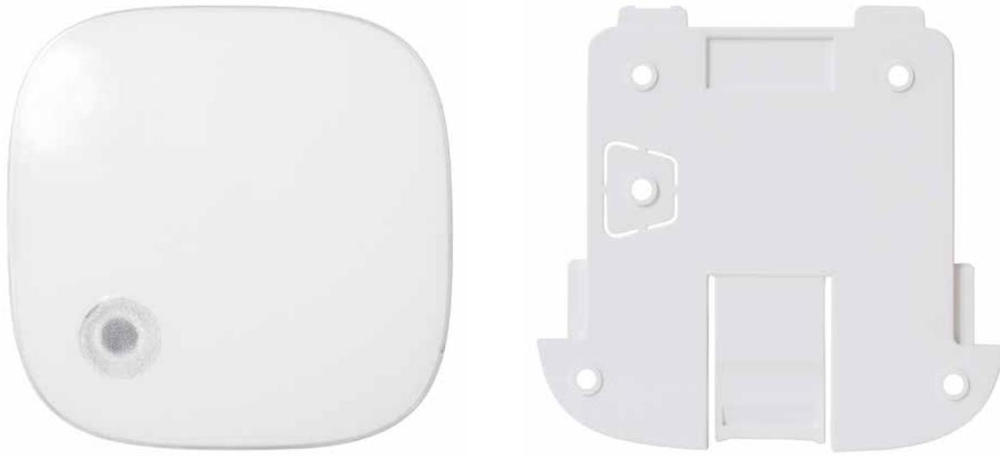
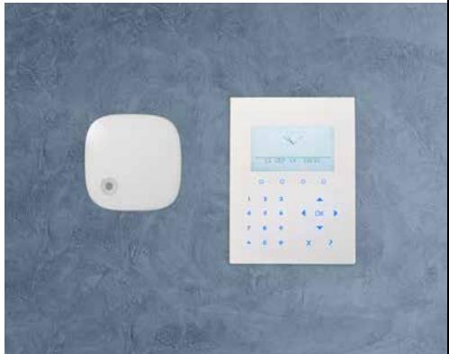
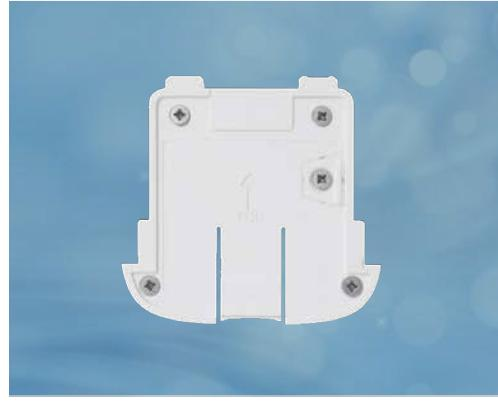

## **Översikt:**

Vanderbilts WSIR-INT ger en ljud- och ljusindikation för ett larm. Vanderbilts WSIR-INT blandar stil och säkerhet på ett sömlöst sätt vilket resulterar i en ledande produkt. WSIR-INT är smal och elegant och kan installeras på några sekunder. Denna enhet är lätt att montera, lätt att koppla ihop och lätt att konfigurera vilket leder till att installationstiden minimeras. Utöver det använder de båda enheterna dessutom förbättrad RF-teknik med svagström som ger överlägsen kommunikation och garanterar lång batteritid.

## **Ledande säkerhetsskydd:**

- Sabotageskydd för vägg
- EN Grade 2-godkänd
- Ljud- och ljusindikation
- Justerbar utgångsvolym, fyra nivåer

# **WSIR-INT** Trådlös inomhus siren och blixtljus

## **Överlägsen RF och batteriets prestanda:**

## **Lång batteritid**

Tack vare högpresterande litiumbatterier och APS-teknik (automatiskt energisparläge) har WSIR-INT-detektorerna en batteritid på 5 år.

## **Lång RF-räckvidd**

Med upp till 500 m räckvidd i öppet utrymme innebär att en enda transceiver kan täcka de flesta installationer.

## **Snabb installation och konfiguration:**

## **Lätt att montera**

WSIR-INT kan monteras på några sekunder. Monteringsplattan skruvas fast till avsedd yta och WSIR-INT fästs enkelt på plattan.

### **Lätt att reparera**

Smart parkopplingsmekanism som möjliggör att enheten kan parkopplas med SPC-panelmottagare på bara några sekunder.

#### Huvudfunktionerna omfattar:

- Automatisk parkoppling när batteriet sätts i
- Ledguidad registrering
- Unikt serienummer för varje enhet

### **Lätt att konfigurera**

WSIR-INT-enheten är helt konfigurerbar med fast programvara på distans.

#### Konfigurerbara funktioner inkluderar:

- Utgångskontroll för ljud- och ljusutgångar
- Justerbar övervakningstid
- Fullständig utgångskontroll från SPC

Frekvensband 868-MHz

# **Batteri/energi:**

| Spänningsmatning                  | WSIR-INT: 2 x 1,5v Energizer AA litiumbatterier             |
|-----------------------------------|----------------------------------------------------------------|
| Batteriets livslängd              | upp till 5 år                                                  |
| Räckvidd på öppen plats           | 500 m räckvidd på öppen plats                                  |
| Strömförbrukning                  | Standby ~60μA Mottagningsläge ~26mA Sändningsläge ~50 mA |
| Sändningseffekt                   | ~ 14dBm                                                        |
| APS automatiskt energisparläge | Ja                                                             |

# **Inbrottsdetekteringsportfölj:**

| Sabotage           | Främre skydd och borttagning              |
|--------------------|-------------------------------------------|
| Övervakningstid    | Justerbar 7 min som standard              |
| Händelseöverföring | Larm, Sabotage, Övervakning, Lågt batteri |

## **Monteringsspecifikationer:**

| Driftstemperatur      | -10 °C till +55 °C |
|-----------------------|--------------------|
| IP/IK klassning       | IP41/IK04          |
| Produktmått           | 93mm x 93mm x 31mm |
| Vikt (inkl. batteri)  | 150 g netto        |
| Extern ljudindikation | 100dB vid 1m       |
| Extern ljusindikation | 8 lm vid källan    |

| Typ      | Art. nr          | Beteckning                    |
|----------|------------------|-------------------------------|
| WSIR-INT | V54538-F115-A100 | WSIR-INT trådlös intern siren |

#### **vanderbiltindustries.com**

@VanderbiltInd Vanderbilt Industries

**023_WSIR-INT_I-200350_SV**

### **Vanderbilt International Ltd.**

Clonshaugh Business and Technology Park Clonshaugh, Dublin D17 KV 84, Irland

+353 1 437 2560