# Wireless PIR Detector Installation Manual

**RF-EV1012-K4 / RF-EV1012PI-K4 / RF-EV1016-K4 / RF4012I4 / RF4012I4PI / RF4016I4 / TX-2213-03-1 / TX-2311-03-1 / TX-2214-03-1** 

#### **EN DE ES FR IT NL PL PT SV**

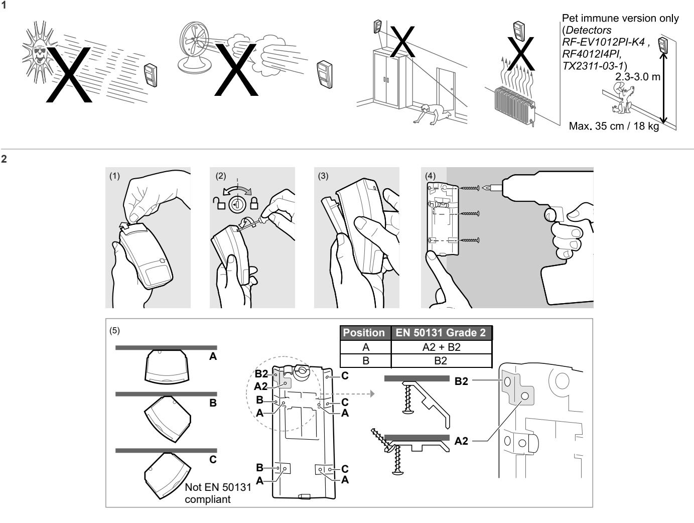

**3** *Detectors RF-EV1012-K4 RF-EV1012PI-K4 RF4012I4 RF4012I4PI TX-2213-03-1 TX-2311-03-1*

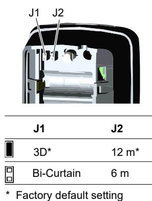

**4** *Detectors RF-EV1016-K4 RF4016I4 TX-2214-03-1*

**J1 J2** 3D* 16 m*

J1 J2

* Factory default setting

Bi-Curtain

10 m

**5**

*Detectors RF-EV1012-K4, RF-EV1012PI-K4, RF4012I4, RF4012I4PI, TX-2213-03-1, TX-2311-03-1*

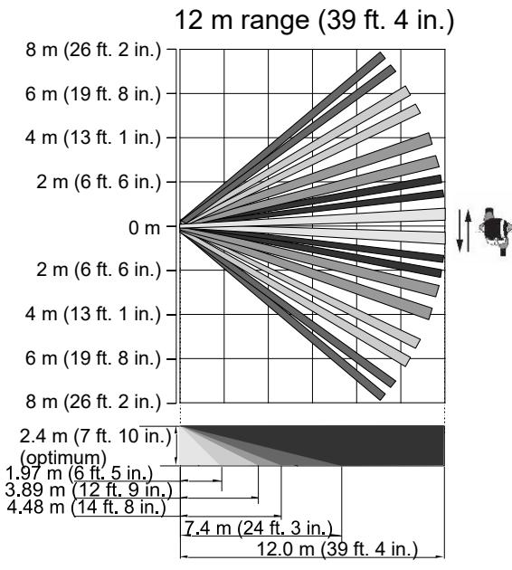

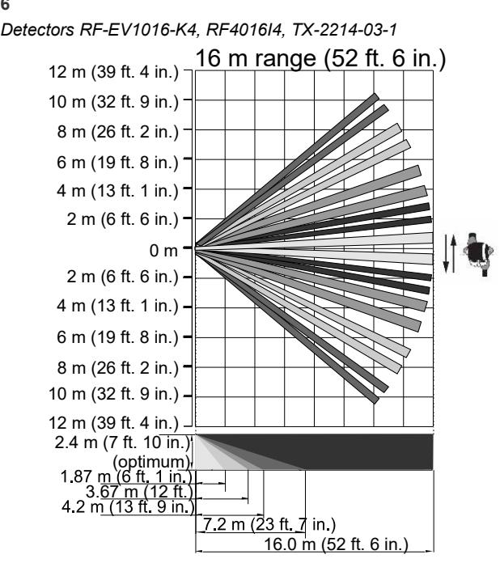

Note for EN 50131 installations: For 16 m range detector mounting height must be 2.3 to 3.0 m.

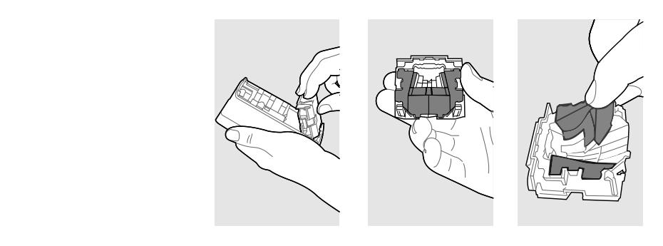

#### **8**

**7**

*Detectors RF-EV1012-K4, RF-EV1016-K4, RF4012I4, RF4016I4, TX-2213-03-1, TX-2214-03-1* 

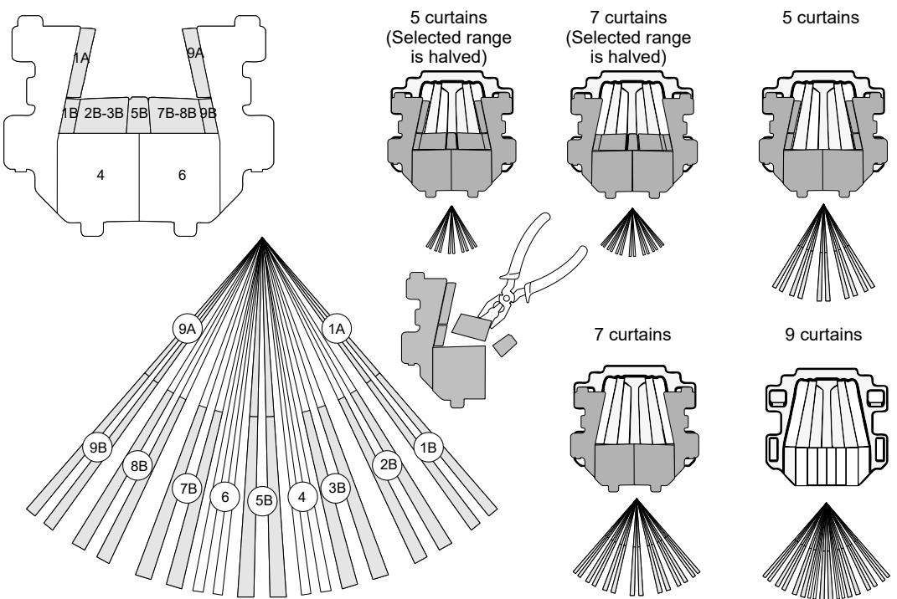

**6**

#### *Detectors RF-EV1012PI-K4, RF4012I4PI, TX-2311-03-1*

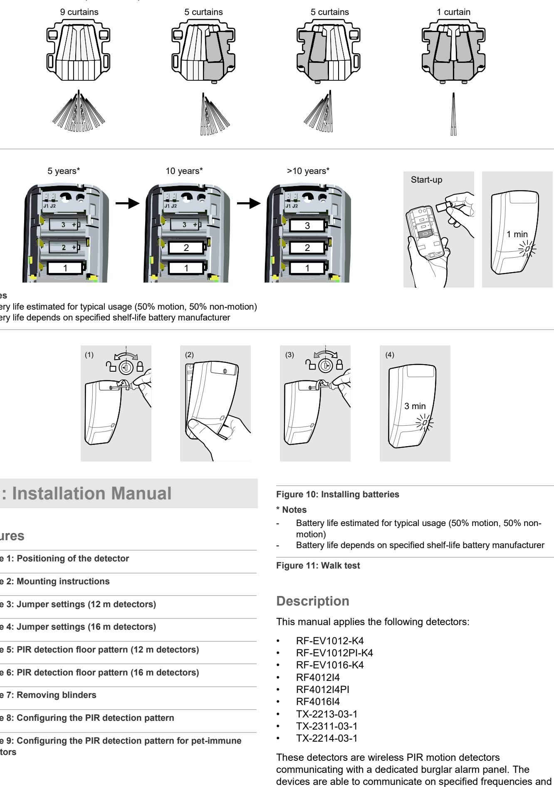

**10**

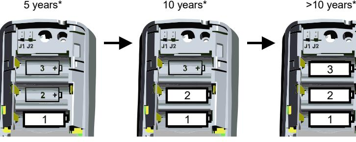

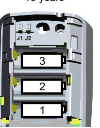

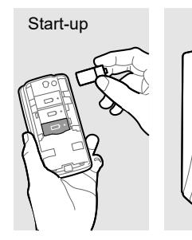

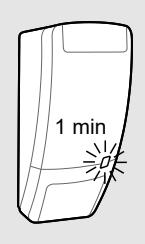

*** Notes**

- Battery life estimated for typical usage (50% motion, 50% non-motion)

- Battery life depends on specified shelf-life battery manufacturer

**11**

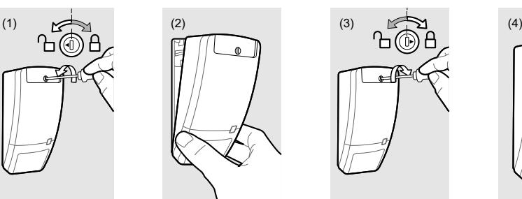

## **EN: Installation Manual**

#### **Figures**

**Figure 1: Positioning of the detector**

**Figure 2: Mounting instructions**

**Figure 3: Jumper settings (12 m detectors)**

**Figure 4: Jumper settings (16 m detectors)**

**Figure 5: PIR detection floor pattern (12 m detectors)**

**Figure 6: PIR detection floor pattern (16 m detectors)**

**Figure 7: Removing blinders**

**Figure 8: Configuring the PIR detection pattern**

**Figure 9: Configuring the PIR detection pattern for pet-immune detectors**

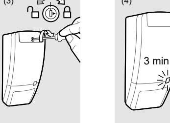

**Figure 10: Installing batteries**

#### *** Notes**

- Battery life estimated for typical usage (50% motion, 50% nonmotion)
- Battery life depends on specified shelf-life battery manufacturer

**Figure 11: Walk test**

### **Description**

This manual applies the following detectors:

- RF-EV1012-K4
- RF-EV1012PI-K4
- RF-EV1016-K4
- RF4012I4
- RF4012I4PI
- RF4016I4
- TX-2213-03-1
- TX-2311-03-1
- TX-2214-03-1

These detectors are wireless PIR motion detectors communicating with a dedicated burglar alarm panel. The protocols. The detectors have patented mirror technology to establish the highest and uniform motion detection performance.

### **Installation guidelines**

The detector is intended to be mounted on walls. Use the following guidelines to determine the best location to install the detector.

See Figure 1.

The mirror optics and processing technology of this detector is very resistant to false alarm hazards. However, avoid potential causes of instability, such as:

- Direct sunlight on the detector
- Strong air draughts onto the detector
- Heat sources within the detector field of view
- Animals in the field of view (for non-PI version)
- Obscuring the detector field of view with large objects
- An area with an excessively metallic surface
- Mount the detector so the expected movement of an intruder is across the detection pattern. See Figures 5 and 6.
- Mount the detector at a stable surface
- Do not place objects in front of the detector that may prevent a clear line of sight

To avoid radio hazards, do not locate the sensor in the following places:

- An area with an excessively metallic surface
- Beyond 40 m of the receiver unit
- Where the ambient temperature is below −10°C or above +55°C

We recommend that the detector is regularly walk tested and checked at the control panel.

### **Opening the device**

- 1. Slide the custom insert to the top (see Figure 2, item 1).
- 2. Using a screwdriver, carefully turn the screw to the left to open the detector (see Figure 2, item 2).
- 3. Separate mounting plate and detector (Figure 2, item 3).

### **Mounting the device**

- 1. Fix the mounting plate to the wall at specified mounting height from the floor (Figure 2, item 4). See "Specifications" on page 6.
- 2. In all positions use a *minimum of two* M4 screws from the standards DIN 7505B, DIN 96, DIN 7996 or a screw with a head with 8 mm diameter and a flat surface (see Figure 2, item 5):

- For flat mounting, use screws in positions A.

- For corner mounting, use screws in position B or C. - For EN 50131 Grade 2 installations, do not use position C.
- 3. Select the desired jumper settings. See "Jumper settings" below for more information. See Figure 5 for the detection floor-pattern for 12 m, and Figure 6 for 16 m.

- 4. Add and adjust the blinders, if required. See "Coverage pattern configuration" below for more details.
**Note:** Figure 9 shows the blinder configuration for the Pet Immune detectors.

### **Installing the battery and first set up**

The wireless PIR contains a built-in transmitter that is used in conjunction with a compatible receiver. There is no address setting required for the PIR. Consult the appropriate control programming manual for instructions.

**Install batteries as follows:** 

- 1. Observing the correct polarity, insert the battery into the battery holder (Figure 10).
- 2. Once the first battery is installed, the wireless detector starts blinking *slowly* (0.5 Hz), indicating the device is starting up.
- 3. Place the device on the mounting bracket and turn the screw to the right (Figure 11, item 3).
- 4. After the start up period the detector initiates a 3 minutes walktest mode. For additional walktest periods, see "Walk test" on page 5.

If the control panel indicates a low battery condition, measure battery voltage. If the battery voltage is less than 3 VDC, replace the battery, repeating from step 1.

**Note:** If an empty battery is inserted, the device will blink *fast* (2 Hz).

By default, there is one battery included with the detector. Additional batteries must be sourced by the installer when needed.

This device can be equipped with up to 3 batteries. Only use Duracell® DL123A, Panasonic® CR123A or Sanyo® CR123A.

### **Jumper settings**

See Figures 3 or 4 for the jumper locations in the detector.

#### **J1: Mode jumper**

ON: Standard mode (default), suitable for most of the wide angle and single curtain applications

OFF: BI-curtain mode. Bi-curtain is used to reduce the possibility of false alarms. It looks for signal verification and requires the intruder to be seen in two curtains.

This mode is not suitable for single curtain applications.

**J2: PIR sensitivity** 

ON: 12 m (16 m) detection range (default).

OFF: 6 m (10 m) detection range.

#### **Coverage pattern configuration**

Mask the appropriate mirror curtains with the adjustable blinders provided and reassemble the sensor module (Figure 7). See figures 8 and 9 for an example of several mirror curtain coverage patterns.

**Note:** The coverage pattern can be changed to fit specific requirements using the mirror masks. Mask off unused curtains that are looking at walls or windows very close to the detector. Under optimal conditions, the range of the detector can be up to 100% higher than stated.

### **Walk test**

**Caution:** Each detector should be walk tested before commissioning the installation.

The wireless PIR provides a walk test mode for testing the detector operation and coverage pattern. Use the following instructions to walk test the detector.

- 1. Slide the custom insert to the top (see Figure 2, item 1).
- 2. Using a screwdriver, carefully turn the screw to the left to open the detector (see Figure 11, item 1).
- 3. Create a tamper event by removing the device from its mounting plate (Figure 11, item 2).
- 4. Place the detector back on the mounting plate and turn the screw to the right (Figure 11, item 3).
- 5. Place back the custom insert at the top.

When the device is mounted again, the detector enters walk test mode for approximately 3 minutes. The LED on the front cover flashes to indicate an alarm event (Figure 11, item 4).

- Walk test the detection pattern and make any necessary adjustments with the adjustable blinders (see Figures 8 or 9).
- Walk test the unit and verify the detector is communicating with the control panel. See also the control panel manufacturer's instructions.

#### **Notes**

- Allow minimal 8 s of non-motion between individual walks to allow the PIR to stabilize.
- If the walk test period has timed out, the LED flashes 3X fast and the detector returns to normal operating mode. In this mode the wireless PIR only supervises every 18 minutes, and the LED is disabled to reduce battery consumption.
- The fixed lockout time after an alarm is 3 minutes.

#### **Detector maintenance**

When installed and used properly, the wireless PIR provides years of service with minimal maintenance. Walk tests should be performed annually to ensure proper operation. See "Walk test" above. Clean the cover with a damp (water) cloth to keep it free of dust and dirt. Always test the detector after cleaning.

### **Replacing the battery**

Remove the battery to reset the low battery signal before installing a new battery. To prevent a low battery condition, install the battery exactly as described in "Installing the battery and first set up" on page 4. Replace with the recommended batteries only (Duracell® DL123A, Panasonic® CR123A, or

Sanyo® CR123A). Use of any other batteries may present a risk of fire or explosion.

**Caution:** Batteries can explode or cause burns if disassembled, recharged or exposed to fire or high temperature. This device can be equipped with up to 3 batteries. If multiple batteries are used, replace all batteries at the same time. Keep away from children. Dispose of used battery according to battery directive instructions and/or as required by local laws.

### **Regulatory information**

| Manufacturer                        | PLACED ON THE MARKET BY: UTC Fire & Security Americas Corporation, Inc. 3211 Progress Drive, Lincolnton, NC, 28092, USA AUTHORIZED EU REPRESENTATIVE: UTC Fire & Security B.V. Kelvinstraat 7, 6003 DH Weert, Netherlands                                                                                                                                |  |  |  |  |  |
|-------------------------------------|-------------------------------------------------------------------------------------------------------------------------------------------------------------------------------------------------------------------------------------------------------------------------------------------------------------------------------------------------------------------------|--|--|--|--|--|
| Product warnings and disclaimers | THESE PRODUCTS ARE INTENDED FOR SALE TO AND INSTALLATION BY QUALIFIED PROFESSIONALS. UTC FIRE & SECURITY CANNOT PROVIDE ANY ASSURANCE THAT ANY PERSON OR ENTITY BUYING ITS PRODUCTS, INCLUDING ANY "AUTHORIZED DEALER" OR "AUTHORIZED RESELLER", IS PROPERLY TRAINED OR EXPERIENCED TO CORRECTLY INSTALL FIRE AND SECURITY RELATED PRODUCTS. |  |  |  |  |  |
|                                     | For more information on warranty disclaimers and product safety information, please check https://firesecurityproducts.com/policy/product warning/ or scan the QR code.                                                                                                                                                                                        |  |  |  |  |  |
| Certification                       |                                                                                                                                                                                                                                                                                                                                                                         |  |  |  |  |  |
| EN 50131                            | RF-EV1012-K4, RF-EV1012PI-K4, RF-EV1016- K4, TX-2213-03-1, TX-2311-03-1, TX-2214-03-1                                                                                                                                                                                                                                                                                |  |  |  |  |  |
|                                     | EN 50131-2-2: Security Grade 2, Environmental Class II.                                                                                                                                                                                                                                                                                                              |  |  |  |  |  |
|                                     | Tested and Certified by Telefication.                                                                                                                                                                                                                                                                                                                                   |  |  |  |  |  |
| European Union directives        | UTC Fire & Security hereby declares that this device is in compliance with the applicable requirements and provisions of all applicable rules and regulations, including but not limited to the Directive 2014/53/EU. For more information see: www.utcfssecurityproducts.eu                                                                             |  |  |  |  |  |
|                                     | 2012/19/EU (WEEE directive): Products marked with this symbol cannot be disposed of as unsorted municipal waste in the European Union. For proper recycling, return this product to your local supplier upon the purchase of equivalent new equipment, or dispose of it at designated collection points. For more information see:                    |  |  |  |  |  |

#### www.utcfssecurityproducts.eu/recycle/

### **Contact information**

www.utcfireandsecurity.com or www.interlogix.com

For customer support, see www.interlogix.com/customersupport or www.utcfssecurityproducts.eu

### **Specifications**

| Model                                        | RF-EV1012-K4                     | RF-EV1012PI-K4           | RF-EV1016-K4   | RF4012I4     | RF4012I4PI           | RF4016I4       | TX-2213-03-1         | TX-2311-03-1    | TX-2214-03-1   |  |
|----------------------------------------------|----------------------------------|--------------------------|----------------|--------------|----------------------|----------------|----------------------|-----------------|----------------|--|
| Detection technology                         | PIR (9 curtains, view angle 86°) |                          |                |              |                      |                |                      |                 |                |  |
| Detection modes (selectable by J1)        |                                  | Standard 3D, bi-curtain* |                |              |                      |                |                      |                 |                |  |
| Target speed range                           |                                  | 30 cm/s to 3 m/s         |                |              |                      |                |                      |                 |                |  |
| Detectable range (selectable by J2)       | 6 and 12 m                       | 6 and 12 m            | 10 and 16 m | 6 and 12 m   | 6 and 12 m        | 10 and 16 m | 6 and 12 m           | 6 and 12 m   | 10 and 16 m |  |
| Blinders equipped                            | Segmented                        | Full                     | Segmented      | Segmented    | Full                 | Segmented      | Segmented            | Full            | Segmented      |  |
| Pet immune:                                  | No                               | Yes                      | No             | No           | Yes                  | No             | No                   | Yes             | No             |  |
| Mounting height                              | 1.8 to 3.0 m                     | 2.3 to 3.0 m          | 2.3 to 3.0 m   | 1.8 to 3.0 m | 2.3 to 3.0 m      | 2.3 to 3.0 m   | 1.8 to 3.0 m         | 2.3 to 3.0 m | 2.3 to 3.0 m   |  |
| Operating frequency                          | 433.05 to 434.79 MHz             |                          |                |              | 433.05 to 434.79 MHz |                | 868.60 to 868.70 MHz |                 |                |  |
| Power output                                 | <10 dBm                          |                          |                |              | <10 dBm              |                | <10 dBm              |                 |                |  |
| Protocol                                     | 433-80plus                       |                          |                |              | 433-63bit            |                | GEN2                 |                 |                |  |
| RF range (open air / obstructed), typical | 300 m / 40 m                     |                          |                |              | 300 m / 40 m         |                | 600 m / 40 m         |                 |                |  |
| Detector start-up time                       |                                  | 1 min                    |                |              |                      |                |                      |                 |                |  |
| Supervisory interval                         |                                  | 18 min                   |                |              |                      |                |                      |                 |                |  |
| Lockout timer                                |                                  | 3 min                    |                |              |                      |                |                      |                 |                |  |
| Battery type                                 | 3.0 V, 1300 mAh lithium          |                          |                |              |                      |                |                      |                 |                |  |
| Battery life (typical with 1 battery)     | 5 years                          |                          |                |              |                      |                |                      |                 |                |  |
| Battery included                             | 1X CR123                         |                          |                |              |                      |                |                      |                 |                |  |
| Current consumption                          | 22 µA (avg.), 50 mA (max.)       |                          |                |              |                      |                |                      |                 |                |  |
| Operating temperature                        | EN −10 to +55°C                  |                          |                |              |                      |                |                      |                 |                |  |
| Relative humidity                            | 95% max. noncondensing           |                          |                |              |                      |                |                      |                 |                |  |
| IP/IK rating                                 | IP30 IK02                        |                          |                |              |                      |                |                      |                 |                |  |
| Dimensions (LxWxH)                           | 130 x 69 x 53 mm                 |                          |                |              |                      |                |                      |                 |                |  |
| Weight (incl. 1 battery)                     | 146 g                            |                          |                |              |                      |                |                      |                 |                |  |

* Bi-curtain is not tested for EN 50131-2-2.

## **DE: Installationshandbuch**

### **Abbildungen**

**Abbildung 1: Positionierung des Bewegungsmelders**

#### **Abbildung 2: Montageanleitung**

**Abbildung 3: Steckbrückeneinstellungen (Melder mit 12 m Reichweite)**

**Abbildung 4: Steckbrückeneinstellungen (Melder mit 16 m Reichweite)**

**Abbildung 5: Abdeckmuster für PIR-Bewegungserkennung (Melder mit 12 m Reichweite)**

**Abbildung 6: Abdeckmuster für PIR-Bewegungserkennung (Melder mit 16 m Reichweite)**

**Abbildung 7: Entfernen der Sensorabdeckungen**

**Abbildung 8: Konfigurieren des PIR-Bewegungserkennungsmusters**

**Abbildung 9: Konfigurieren des PIR-Bewegungserkennungsmusters für Haustier-tolerante Melder**

#### **Abbildung 10: Installieren der Batterien**

#### *** Hinweise**

- Die Lebensdauer der Batterie für einen typischen Einsatz ist geschätzt (50 % Bewegungserkennung, 50 % keine Bewegungen)
- Die Lebensdauer der Batterie ist abhängig von der vom Hersteller angegebenen Haltbarkeit

**Abbildung 11: Gehtest**

### **Beschreibung**

Dieses Handbuch gilt für die folgenden Bewegungsmelder:

- RF-EV1012-K4
- RF-EV1012PI-K4
- RF-EV1016-K4
- RF4012I4
- RF4012I4PI
- RF4016I4
- TX-2213-03-1
- TX-2311-03-1
- TX-2214-03-1

Es handelt sich um PIR-Bewegungsmelder, die per Funkverbindung mit einer zugewiesenen

Einbruchmeldezentrale kommunizieren. Die Geräte können auf bestimmten Frequenzen und über bestimmte Protokolle kommunizieren. Die Bewegungsmelder verfügen über eine patentierte Spiegeltechnik, mit die höchste und einheitliche Leistung bei der Bewegungserkennung erreicht wird.

#### **Installationsanleitung**

Der Bewegungsmelder ist zur Montage an Wänden gedacht. Die folgenden Richtlinien helfen Ihnen bei der Auswahl eines geeigneten Montageorts für den Melder.

Siehe Abbildung 1.

Die Spiegeloptik und Prozessortechnik dieses Melders dient zur Vermeidung falscher Alarmmeldungen. Sie sollten jedoch potenzielle Instabilitätsfaktoren vermeiden, darunter:

- Direkte Sonneneinstrahlung auf den Melder
- Starke Zugluft am Melder
- Hitzequellen innerhalb des Erfassungsbereichs des Melders
- Tiere im Erfassungsbereich (für die nicht Haustiertolerante Version)
- Verdecken des Erfassungsbereichs des Melders durch große Objekte
- Ein Bereich mit einer übermäßig metallischen Oberfläche
- Montieren Sie den Melder so, dass die erwartete Bewegung eines Eindringlings im Erfassungsbereich des Melders liegt. Siehe Abbildungen 5 und 6.
- Montage des Melders auf einer stabilen Oberfläche
- Platzieren von Objekten vor den Melder, die die Sichtlinie beeinträchtigen könnten

Um Risiken bei der Funkübertragung zu vermeiden, installieren Sie den Sensor nicht an folgenden Orten:

- Ein Bereich mit einer übermäßig metallischen Oberfläche
- Mehr als 40 m von der Empfängereinheit entfernt
- Mit einer Umgebungstemperatur unter −10 °C oder über +55 °C

Wir empfehlen, in regelmäßigen Abständen einen Melder-Gehtest durchzuführen und den Melder von der Einbruchmeldezentrale aus zu überprüfen.

### **Öffnen des Geräts**

- 1. Schieben Sie die Schraubabdeckung nach oben (siehe Abbildung 2, Bild 1).
- 2. Drehen Sie die Schraube mit einem Schraubendreher vorsichtig nach links, um den Melder zu öffnen (siehe Abbildung 2, Bild 2).
- 3. Nehmen Sie die Montageplatte vom Melder ab (Abbildung 2, Bild 3).

#### **Montage des Geräts**

- 1. Befestigen Sie die Montageplatte in der angegebenen Montagehöhe, gemessen vom Boden, an der Wand (Abbildung 2, Bild 4). Siehe "Technische Daten" auf Seite 10.
- 2. Verwenden Sie in allen Positionen *mindestens zwei* Schrauben der Größe M4 mit der Norm DIN 7505B, DIN 96 oder DIN 7996 oder eine Schraube mit einem flachen Kopf von 8 mm Durchmesser (siehe Abbildung 2, Bild 5):
	- Setzen Sie zur flachen Montage Schrauben an den Positionen A ein.
	- Setzen Sie zur Eckmontage Schrauben an den Positionen B bzw. C ein.
	- Verwenden Sie für Installationen gemäß EN 50131 Sicherheitsstufe 2 nicht Position C.
- 3. Wählen Sie die gewünschten Steckbrückeneinstellungen aus. Weitere Informationen finden Sie in Abschnitt "Steckbrückeneinstellungen" unten. Abdeckmuster zur Bewegungserkennung für 12 m Reichweite finden Sie in Abbildung 5, für 16 m Reichweite in Abbildung 6.

- 4. Bringen und passen Sie ggf. die Sensorabdeckungen an. Weitere Informationen finden Sie unter "Konfiguration des Abdeckmusters" unten.
**Hinweis:** Abbildung 9 zeigt die Konfiguration der Sensorabdeckungen für Haustier-tolerante Melder.

### **Installieren der Batterie und Ersteinrichtung**

Der PIR-Funkbewegungsmelder verfügt über einen integrierten Sender, der in Verbindung mit einem kompatiblen Empfänger verwendet wird. Für den PIR ist keine Adresseinstellung erforderlich. Eine entsprechende Anleitung finden Sie im zugehörigen Programmierhandbuch für die Einbruchmeldezentrale.

**Installieren Sie die Batterien wie folgt:** 

- 1. Setzen Sie die Batterien in das Batteriefach ein und achten Sie dabei auf die richtige Polarität (Abbildung 10).
- 2. Sobald die erste Batterie installiert ist, beginnt der Funkbewegungsmelder *langsam* zu blinken (0,5 Hz) und zeigt damit an, dass das Gerät startet.
- 3. Setzen Sie das Gerät auf die Montageplatte und drehen Sie die Schraube nach rechts (Abbildung 11, Bild 3).
- 4. Nach dem Gerätestart zeigt der Melder einen 3-minütigen Gehtestmodus an. Informationen zu weiteren Gehtestzeiten finden Sie unter "Gehtest" unten.

Wenn in der Einbruchmeldezentrale ein niedriger Batteriestand angezeigt wird, messen Sie die Batteriespannung. Wenn eine Batteriespannung weniger als 3 VDC beträgt, ersetzen Sie die Batterie, beginnend bei Schritt 1.

**Hinweis:** Wenn eine leere Batterie eingesetzt wird, blinkt das Gerät *schnell* (2 Hz).

Standardmäßig ist eine Batterie im Lieferumfang des Bewegungsmelders enthalten. Weitere Batterien müssen, falls erforderlich, selbst zur Verfügung gestellt werden.

Dieses Gerät kann bis zu drei Batterien aufnehmen. Verwenden Sie nur Duracell® DL123A, Panasonic® CR123A oder Sanyo® CR123A.

### **Steckbrückeneinstellungen**

Siehe Abbildung 3 oder 4 für die Anordnung der Steckbrücken im Melder.

#### **J1: Modus-Steckbrücke**

EIN: Standardmodus, geeignet für die meisten Weitwinkelanwendungen und Anwendungen mit einem Erfassunsvorgang.

AUS: BI-Curtain Modus. Dieser Modus wird zur Verringerung möglicher Fehlalarme verwendet. In diesem Modus ist eine Bestätigung des Signals erforderlich, indem ein Eindringling in zwei Erfassungsvorhängen erkannt wird.

Dieser Modus ist für Anwendungen mit nur einem Erfassungsvorhang ungeeignet.

#### **J2: PIR-Empfindlichkeit**

EIN: 12 m (16 m) Erfassungsbereich (Standard).

AUS: 6 m (10 m) Erfassungsbereich.

### **Konfiguration des Abdeckmusters**

Decken Sie die jeweiligen Spiegelsensorbereiche mit den beiliegenden anpassbaren Sensorabdeckungen ab, und setzen Sie das Sensormodul wieder zusammen (Abbildung 7). In den Abbildungen 8 und 9 finden Sie Beispiele für verschiedene Abdeckmuster der Spiegelsensorbereiche.

**Hinweis:** Der Erfassungsbereich kann mithilfe der Spiegelabdeckungen für verschiedene Anforderungen angepasst werden. Decken Sie nicht verwendete Sensorbereiche ab, die auf Wände oder Fenster in der unmittelbaren Nähe des Melders gerichtet sind. Unter optimalen Bedingungen kann der Erfassungsbereich des Melders bis zu 100 % größer als angegeben sein.

### **Gehtest**

**Achtung:** Jeder Melder sollte vor der Inbetriebnahme einem Gehtest unterzogen werden.

Der PIR-Funkbewegungsmelder verfügt über einen Gehtestmodus, mit dem die Funktion und der Erfassungsbereich überprüft werden können. Gehen Sie wie folgt vor, um den Gehtest des Melders durchzuführen.

- 1. Schieben Sie die Schraubabdeckung nach oben (siehe Abbildung 2, Bild 1).
- 2. Drehen Sie die Schraube mit einem Schraubendreher vorsichtig nach links, um den Melder zu öffnen (siehe Abbildung 11, Bild 1).
- 3. Führen Sie ein Sabotageereignis herbei, indem Sie das Gerät von der Montageplatte abnehmen (Abbildung 11, Bild 2).
- 4. Setzen Sie den Melder zurück auf die Montageplatte und drehen Sie die Schraube nach rechts (Abbildung 11, Bild 3).
- 5. Schieben Sie die Schraubabdeckung oben wieder an ihre Position.

Wenn das Gerät erneut montiert wird, aktiviert der Melder für etwa 3 Minuten den Gehtestmodus. Die LED an der Frontabdeckung leuchtet, um ein Alarmereignis anzuzeigen (Abbildung 11, Bild 4).

- Führen Sie einen Gehtest für den Erfassungsbereich durch und nehmen Sie mithilfe der anpassbaren Sensorabdeckungen die nötigen Anpassungen vor (siehe Abbildung 8 oder 9).
- Führen Sie einen Gehtest für das Gerät durch und überprüfen Sie, ob der Melder mit der Einbruchmeldezentrale kommuniziert. Ziehen Sie auch die Anweisungen des Herstellers der Einbruchmeldezentrale zurate.

#### **Hinweise**

- Halten Sie zwischen den einzelnen Gehtests mindestens 8 Sek. Bewegungspause ein, damit sich der PIR stabilisieren kann.
- Wenn die Gehtestzeit abgelaufen ist, leuchtet die LED 3 mal schnell und der Melder kehrt in den normalen Betriebsmodus zurück. In diesem Modus ruht der PIR-Funkbewegungsmelder mit deaktivierter LED nach einer Auslösung und sendet alle 18 Minuten ein Überwachungssignal, um den Batterieverbrauch zu senken.
- Die festgesetzte Sperrzeit nach einem Alarm / Bewegungserkennung beträgt 3 Minuten.

### **Wartung des Melders**

Bei ordnungsgemäßer Installation und korrektem Betrieb kann der PIR-Funkbewegungsmelder jahrelang mit minimaler Wartung eingesetzt werden. Gehtests sollten jährlich durchgeführt werden, um den richtigen Betrieb zu gewährleisten. Siehe "Gehtest" oben. Reinigen Sie das Gehäuse mit einem feuchten Tuch, um es frei von Staub und Schmutz zu halten. Testen Sie den Melder nach jeder Reinigung.

### **Ersetzen der Batterie**

Bevor Sie eine neue Batterie einlegen, müssen Sie die Batterie entfernen, um die Meldung für den schwachen Batteriestand zurückzusetzen. Um die Meldung einer nahezu entladenen Batterie zu verhindern, legen Sie die Batterie genau wie unter "Installieren der Batterie und Ersteinrichtung" auf Seite 8 beschrieben ein. Verwenden Sie nur empfohlene Batterien (Duracell® DL123A, Panasonic® CR123A oder Sanyo® CR123A). Bei Verwendung anderer Batterien kann Brandoder Explosionsgefahr bestehen.

**Achtung:** Batterien können explodieren oder einen Brand verursachen, wenn sie auseinander genommen, erneut aufgeladen oder Feuer bzw. hohen Temperaturen ausgesetzt werden. Dieses Gerät kann bis zu drei Batterien aufnehmen. Bei Verwendung mehrerer Batterien müssen alle Batterien gleichzeitig ersetzt werden. Von Kindern fern halten. Entsorgen Sie gebrauchte Batterien gemäß der Batterieverordnung bzw. gemäß den örtlichen Entsorgungsbestimmungen für Batterien.

### **Regulatorische Informationen**

| Hersteller | IN VERKEHR GEBRACHT VON:                        |
|------------|-------------------------------------------------|
|            | UTC Fire & Security Americas Corporation, Inc.  |
|            | 3211 Progress Drive, Lincolnton, NC, 28092, USA |
|            | AUTORISIERTER VERTRETER IN DER EU:              |
|            | UTC Fire & Security B.V.                        |
|            | Kelvinstraat 7, 6003 DH Weert, Netherlands      |

Produktwarnungen und Haftungsausschluss

DIESE PRODUKTE SIND FÜR DEN VERKAUF AN UND DIE INSTALLATION DURCH QUALIFIZIERTES PERSONAL VORGESEHEN. UTC FIRE & SECURITY ÜBERNIMMT KEINERLEI GEWÄHRLEISTUNG DAFÜR, DASS NATÜRLICHE ODER JURISTISCHE PERSONEN, DIE UNSERE PRODUKTE ERWERBEN, SOWIE "AUTORISIERTE HÄNDLER" ODER "AUTORISIERTE WIEDERVERKÄUFER" ÜBER DIE ERFORDERLICHE QUALIFIKATION UND ERFAHRUNG VERFÜGEN, UM BRANDSCHUTZ- ODER SICHERHEITSTECHNISCHE PRODUKTE ORDNUNGSGEMÄSS ZU INSTALLIEREN.

Weitere Informationen zu Haftungsausschlüssen sowie zur Produktsicherheit finden Sie unter https://firesecurityproducts.com/policy/productwarning/, oder scannen Sie den QR-Code.

Informationen hierzu finden Sie auf der folgenden Website: www.utcfssecurityproducts.eu/recycle/

| Zertifizierung                           |                                                                                                                                                                                                                                                                                                                                                                                                                              |
|------------------------------------------|------------------------------------------------------------------------------------------------------------------------------------------------------------------------------------------------------------------------------------------------------------------------------------------------------------------------------------------------------------------------------------------------------------------------------|
| EN 50131                                 | RF-EV1012-K4, RF-EV1012PI-K4, RF-EV1016- K4, TX-2213-03-1, TX-2311-03-1, TX-2214-03-1                                                                                                                                                                                                                                                                                                                                     |
|                                          | EN 50131-2-2: Sicherheitsgrad 2, Umweltklasse II.                                                                                                                                                                                                                                                                                                                                                                         |
|                                          | Getestet und zertifiziert von Telefication.                                                                                                                                                                                                                                                                                                                                                                                  |
| Richtlinien der Europäischen Union | UTC Fire & Security erklärt hiermit, dass dieses Gerät den geltenden Anforderungen und Bestimmungen aller anwendbaren Regeln und Vorschriften entspricht - einschließlich, aber nicht beschränkt auf die Richtlinie 2014/53/EU. Für weitere Informationen siehe www.utcfssecurityproducts.eu                                                                                                               |
|                                          | 2012/19/EU (WEEE): Produkte die mit diesem Symbol gekennzeichnet sind, dürfen nicht als unsortierter städtischer Abfall in der europäischen Union entsorgt werden. Für die korrekte Wiederverwertung bringen Sie dieses Produkt zu Ihrem lokalen Lieferanten nach dem Kauf der gleichwertigen neuen Ausrüstung zurück, oder entsorgen Sie das Produkt an den gekennzeichneten Sammelstellen. Weitere |

### **Kontaktinformationen**

www.utcfireandsecurity.com oder www.interlogix.com

Kontaktinformationen für den Kundendienst finden Sie auf www.interlogix.com/customer-support oder www.utcfssecurityproducts.eu

### **Technische Daten**

| Modell                                                   | RF-EV1012-K4                            | RF-EV1012PI-K4   | RF-EV1016-K4     | RF4012I4              | RF4012I4PI       | RF4016I4         | TX-2213-03-1          | TX-2311-03-1     | TX-2214-03-1     |
|----------------------------------------------------------|-----------------------------------------|------------------|------------------|-----------------------|------------------|------------------|-----------------------|------------------|------------------|
| Überwachungstechnik                                      | PIR (9 Sensorbereiche, Sichtwinkel 86°) |                  |                  |                       |                  |                  |                       |                  |                  |
| Erkennungsmodi (über J1 wählbar)                         | Standard 3D, Bi-Curtain*                |                  |                  |                       |                  |                  |                       |                  |                  |
| Erfassungsgeschwindigkeitsbereich                        | 30 cm/s bis 3 m/s                       |                  |                  |                       |                  |                  |                       |                  |                  |
| Erfassungsreichweite (über J2 wählbar)                   | 6 und 12 m                           | 6 und 12 m    | 10 und 16 m   | 6 und 12 m         | 6 und 12 m    | 10 und 16 m   | 6 und 12 m         | 6 und 12 m    | 10 und 16 m   |
| Spiegelabdeckungen angebracht                            | Segment.                                | Voll ständig  | Segment.         | Segment.              | Voll ständig  | Segment.         | Segment.              | Voll ständig  | Segment.         |
| Haustier-tolerant:                                       | Nein                                    | Ja               | Nein             | Nein                  | Ja               | Nein             | Nein                  | Ja               | Nein             |
| Montagehöhe                                              | 1,8 bis 3,0 m                        | 2,3 bis 3,0 m | 2,3 bis 3,0 m | 1,8 bis 3,0 m      | 2,3 bis 3,0 m | 2,3 bis 3,0 m | 1,8 bis 3,0 m      | 2,3 bis 3,0 m | 2,3 bis 3,0 m |
| Betriebsfrequenz                                         | 433,05 bis 434,79 MHz                   |                  |                  | 433,05 bis 434,79 MHz |                  |                  | 868,60 bis 868,70 MHz |                  |                  |
| Ausgangsleistung                                         | <10 dBm                                 |                  |                  | <10 dBm               |                  |                  | <10 dBm               |                  |                  |
| Protokoll                                                | 433-80plus                              |                  |                  | 433-63bit             |                  |                  | GEN2                  |                  |                  |
| HF-Reichweite (im Freien / bei Versperrung), typisch  | 300 m / 40 m                            |                  |                  | 300 m / 40 m          |                  |                  | 600 m / 40 m          |                  |                  |
| Meldereinschaltzeit                                      |                                         |                  |                  |                       | 1 Min.           |                  |                       |                  |                  |
| Überwachungsintervall                                    | 18 Min.                                 |                  |                  |                       |                  |                  |                       |                  |                  |
| Sperr-Timer                                              | 3 Min.                                  |                  |                  |                       |                  |                  |                       |                  |                  |
| Batterietyp                                              | 3,0 V, 1300 mAh Lithium                 |                  |                  |                       |                  |                  |                       |                  |                  |
| Lebensdauer der Batterie (typisch mit einer Batterie) | 5 Jahre                                 |                  |                  |                       |                  |                  |                       |                  |                  |
| Batterie enthalten                                       | 1X CR123                                |                  |                  |                       |                  |                  |                       |                  |                  |
| Stromaufnahme                                            | 22 µA (mtl.), 50 mA (max.)              |                  |                  |                       |                  |                  |                       |                  |                  |
| Betriebstemperatur                                       | EN −10 bis +55 °C                       |                  |                  |                       |                  |                  |                       |                  |                  |
| Relative Luftfeuchtigkeit                                | Max. 95 %, nicht kondensierend          |                  |                  |                       |                  |                  |                       |                  |                  |
| IP/IK-Schutzklasse                                       | IP30 IK02                               |                  |                  |                       |                  |                  |                       |                  |                  |
| Abmessungen (L x B x H)                                  |                                         |                  |                  |                       | 130 x 69 x 53 mm |                  |                       |                  |                  |
| Gewicht (mit einer Batterie)                             |                                         |                  |                  |                       | 146 g            |                  |                       |                  |                  |

* Bi-Curtain Modus ist nicht geprüft für EN 50131-2-2.

## **ES: Manual de instalación**

### **Figuras**

**Figura 1: Colocación del detector**

**Figura 2: Instrucciones de montaje**

**Figura 3: Configuración de puentes (detectores de 12 m)**

**Figura 4: Configuración de puentes (detectores de 16 m)**

**Figura 5: Patrón de suelos de la detección PIR (detectores de 12 m)**

**Figura 6: Patrón de suelos de la detección PIR (detectores de 16 m)**

**Figura 7: Eliminación de las máscaras**

**Figura 8: Configuración de los patrones de detección PIR**

**Figura 9: Configuración del patrón de detección PIR para detectores inmunes a mascotas**

**Figura 10: Instalación de las pilas**

*** Notas**

- Duración estimada de las pilas para un uso normal (50 % con movimiento y 50 % sin movimiento)
- La duración de las pilas depende de la autonomía que haya especificado el fabricante

**Figura 11: Prueba de detección**

### **Descripción**

Este manual es para los siguientes detectores:

- RF-EV1012-K4
- RF-EV1012PI-K4
- RF-EV1016-K4
- RF4012I4
- RF4012I4PI
- RF4016I4
- TX-2213-03-1
- TX-2311-03-1
- TX-2214-03-1

Estos detectores de movimiento PIR inalámbricos se comunican con un panel de alarma antirrobo exclusivo. Los dispositivos pueden comunicarse en frecuencias y protocolos determinados. Los detectores cuentan con la tecnología patentada de espejo para establecer el más alto y constante rendimiento en la detección del movimiento.

### **Instrucciones para la instalación**

El detector se ha diseñado para su montaje en paredes. Utilice las siguientes instrucciones para determinar cuál es la mejor posición para instalar el detector.

#### Consulte la figura 1.

Las lentes de espejo y la tecnología de procesamiento de este detector es muy resistente a los peligros ocasionados por falsas alarmas. Sin embargo, debe evitar potenciales causas de inestabilidad, como:

- Luz solar directa en el detector.
- Fuertes corrientes de aire sobre el detector.
- Fuentes de calor dentro del campo de visión del detector. • Animales dentro del campo de visión (para la versión no
- inmune a las mascotas).
- Oscurecer del campo de visión del detector con objetos de gran tamaño.
- Una zona con demasiada superficie metálica.
- Montar el detector de forma que el movimiento esperado de un intruso se produzca en medio del patrón de detección. Consulte las figuras 5 y 6.
- Montar el detector en una superficie estable.
- No colocar objetos que puedan impedir una línea clara de visión delante del detector.

Para evitar peligros ocasionados por las radiofrecuencias, no coloque el sensor en los lugares siguientes:

- Una zona con demasiada superficie metálica.
- A una distancia superior a 40 m de la unidad receptora.
- Donde la temperatura ambiente esté por debajo de −10 °C o por encima de +55 °C

Se recomienda que se realice la prueba de paseo al detector con regularidad y se compruebe con el panel de control.

### **Apertura del dispositivo**

- 1. Deslice la tapa hacia arriba (consulte la figura 2, elemento 1).
- 2. Con ayuda de un destornillador, gire con cuidado el tornillo hacia la izquierda para abrir el detector (consulte la figura 2, elemento 2).
- 3. Separe el detector de la placa de montaje (figura 2, elemento 3).

### **Montaje del dispositivo**

- 1. Coloque la placa de montaje en la pared a la altura especificada con respecto al suelo (figura 2, elemento 4). Consulte "Especificaciones" en la página 14.
- 2. En todas las posiciones utilice un *mínimo de dos* tornillos M4 de los estándares DIN 7505B, DIN 96, DIN 7996 o un tornillo con una cabeza de 8 mm de diámetro y superficie plana (consulte la figura 2, elemento 5).

- Para realizar un montaje sobre una superficie plana utilice tornillos en la posición A.

- Para los montajes en esquina, utilice tornillos en posición B o C.

- Para las instalaciones EN 50131 de Grado 2, no utilice la posición C.

- 3. Seleccione la configuración de puentes deseada. Consulte "Configuración de puentes" en la página 12 para obtener más información. Consulte la figura 5 para conocer el patrón de suelos de detección para 12 m, y la figura 6 para 16 m.
- 4. Si fuera necesario, añada y ajuste las máscaras. Consulte "Configuración del patrón de alcance" en la página 12 para obtener más información.

**Nota:** la figura 9 muestra la configuración de la máscara para los detectores inmunes a las mascotas.

### **Instalación de las pilas y primera configuración**

Los PIR inalámbricos contienen un transmisor incorporado que se usa conjuntamente con un receptor compatible. No es necesaria ninguna configuración de dirección para el PIR. Consulte el manual de programación de control pertinente para obtener instrucciones.

**Coloque las pilas como se indica a continuación:**

- 1. Introduzca la pila en el receptáculo pertinente respetando la polaridad correcta (figura 10).
- 2. Una vez colocada la primera pila, el detector inalámbrico empezará a parpadear *lentamente* (0,5 Hz) para indicar que el dispositivo se está iniciando.
- 3. Coloque el dispositivo en el soporte de montaje y gire el tornillo hacia la derecha (figura 11, elemento 3).
- 4. Después del periodo de arranque, el detector inicia el modo de prueba de detección durante 3 minutos. Para periodos de prueba de detección adicionales, consulte "Prueba de detección" más adelante.

Si el panel de control indica una condición de carga baja, mida la tensión de la pila. Si la tensión de la pila es inferior a 3 V CC, cámbiela y repita los pasos desde el primero.

**Nota:** si coloca una pila cuya carga se ha agotado, el dispositivo parpadeará *rápidamente* (2 Hz).

Con el detector se incluye una pila de forma predeterminada. El instalador deberá proporcionarle las pilas adicionales que necesite.

Este dispositivo se puede equipar con un máximo de 3 pilas. Utilice únicamente pilas Duracell® DL123A, Panasonic® CR123A o Sanyo® CR123A.

### **Configuración de puentes**

Consulte las figuras 3 o 4 para conocer las ubicaciones de los puentes en el detector.

#### **J1: Puente de modo**

ACTIVADO: modo Estándar (predeterminado), apto para la mayoría de las aplicaciones de una sola cortina o de ángulo de visión amplio.

OFF: modo Bi-cortina. El modo Bi-cortina se utiliza para reducir las posibilidades de que se produzcan falsas alarmas. Busca la verificación de las señales y requiere la visualización del intruso en dos cortinas.

Este modo no es apto para aplicaciones de una sola cortina.

**J2: Sensibilidad de PIR** 

ACTIVADO: rango de detección de 12 m (16 m) predeterminado.

OFF: rango de detección de 6 m (10 m).

### **Configuración del patrón de alcance**

Oculte las cortinas de espejo elegidas con las máscaras ajustables proporcionadas y vuelva a montar el módulo del sensor (figura 7). Consulte las figuras 8 y 9 para ver un ejemplo de varios patrones de alcance de cortinas de espejo. **Nota:** el patrón de alcance se puede cambiar para que cumpla unos requisitos específicos utilizando las máscaras de espejo. Enmascare las cortinas no usadas que estén orientadas a paredes o ventanas muy cercanas al detector. En condiciones óptimas, el rango del detector puede ser hasta un 100 % superior al indicado.

### **Prueba de detección**

**Precaución:** cada detector debe pasar por una prueba de detección antes de poner en funcionamiento la instalación.

Los PIR inalámbricos disponen de un modo de prueba de detección para probar el funcionamiento del detector y el patrón de alcance. Utilice las siguientes instrucciones para realizar la prueba de detección del detector:

- 1. Deslice la tapa hacia arriba (consulte la figura 2, elemento 1).
- 2. Con ayuda de un destornillador, gire con cuidado el tornillo hacia la izquierda para abrir el detector (consulte la figura 11, elemento 1).
- 3. Cree un evento de manipulación quitando el dispositivo de su placa de montaje (figura 11, elemento 2).
- 4. Vuelva a colocar el detector en la placa de montaje y gire el tornillo hacia la derecha (figura 11, elemento 3).
- 5. Vuelva a colocar la tapa en la parte superior.

Cuando el dispositivo se haya vuelto a montar, el detector entrará en el modo de detección durante aproximadamente 3 minutos. El indicador LED de la parte delantera parpadeará para indicar que hay un evento de alarma (figura 11, elemento 4).

- Realice la prueba de detección del patrón de detección y realice las modificaciones necesarias con las máscaras ajustables (consulte las figuras 8 o 9).
- Realice la prueba de detección de la unidad y compruebe si el detector se comunica con el panel de control. Consulte también las instrucciones del fabricante del panel de control.

#### **Notas**

- Deje como mínimo 8 segundos entre los movimientos para que el PIR se estabilice.
- Si se ha agotado el tiempo del periodo de la prueba de detección, el indicador LED parpadeará tres veces más rápido y el detector volverá al modo de funcionamiento normal. En este modo el PIR inalámbrico solo supervisa cada 18 minutos, y el indicador LED se desactiva para reducir el consumo de las pilas.
- El tiempo de bloqueo establecido tras una alarma es de 3 minutos.

### **Mantenimiento del detector**

Si se instala y usa correctamente, los PIR inalámbricos proporcionan años de servicio con un mantenimiento mínimo. Las pruebas de detección deben realizarse anualmente para garantizar un funcionamiento correcto. Consulte "Prueba de detección" más atrás. Limpie la tapa con un paño húmedo (con agua) para limpiar el polvo o la suciedad. Pruebe siempre el detector después de limpiarlo.

### **Sustitución de la pila**

Saque la pila para restablecer la señal de carga baja antes de instalar una nueva. Para evitar que se produzca una condición de carga baja, instale la pila tal y como se indica en "Instalación de las pilas y primera configuración" en la página 12. Sustituya la pila únicamente por otra de las recomendadas (Duracell® DL123A, Panasonic® CR123A o Sanyo® CR123A). El uso de otras baterías puede suponer un riesgo de incendio o de explosión.

**Precaución:** Las pilas pueden explotar o causar quemaduras si se desmontan, se recargan o se exponen al fuego o a altas temperaturas. Este dispositivo se puede equipar con 3 pilas como máximo. Si se utilizan varias pilas, cambie todas ellas al mismo tiempo. Manténgalas fuera del alcance de los niños. Deseche las pilas usadas de conformidad con las instrucciones de la directiva sobre pilas o según lo estipule la normativa local vigente.

### **Información normativa**

| Fabricante                                                        | COMERCILIZADO POR: UTC Fire & Security Americas Corporation, Inc. 3211 Progress Drive, Lincolnton, NC, 28092, EE. UU.                                                                                                                                                                                                                                                                                                              |
|-------------------------------------------------------------------|---------------------------------------------------------------------------------------------------------------------------------------------------------------------------------------------------------------------------------------------------------------------------------------------------------------------------------------------------------------------------------------------------------------------------------------------|
|                                                                   | REPRESENTANTE AUTORIZADO EN LA UE: UTC Fire & Security B.V. Kelvinstraat 7, 6003 DH Weert, Países Bajos                                                                                                                                                                                                                                                                                                                               |
| Advertencias del producto y descargos de responsabilidad | ESTOS PRODUCTOS ESTÁN DESTINADOS A LA VENTA A, E INSTALACIÓN POR, UN PROFESIONAL DE SEGURIDAD EXPERIMENTADO. UTC FIRE & SECURITY NO PUEDE GARANTIZAR QUE TODA PERSONA O ENTIDAD QUE COMPRE SUS PRODUCTOS, INCLUYENDO CUALQUIER "DISTRIBUIDOR O VENDEDOR AUTORIZADO", CUENTE CON LA FORMACIÓN O EXPERIENCIA PERTINENTE PARA INSTALAR CORRECTAMENTE PRODUCTOS RELACIONADOS CON LOS INCENDIOS Y LA SEGURIDAD. |
|                                                                   | Para obtener más información sobre exclusiones de garantía e información de seguridad de                                                                                                                                                                                                                                                                                                                                                 |

productos, consulte

https://firesecurityproducts.com/policy/product-

warning/ o escanee el código QR.

| Certificación                     |                                                                                                                                                                                                                                                                                                                                                                                              |
|-----------------------------------|----------------------------------------------------------------------------------------------------------------------------------------------------------------------------------------------------------------------------------------------------------------------------------------------------------------------------------------------------------------------------------------------|
| EN 50131                          | RF-EV1012-K4, RF-EV1012PI-K4, RF-EV1016- K4, TX-2213-03-1, TX-2311-03-1, TX-2214-03-1                                                                                                                                                                                                                                                                                                     |
|                                   | EN 50131-2-2: Grado de seguridad 2, Clase medioambiental II.                                                                                                                                                                                                                                                                                                                              |
|                                   | Probado y certificado por Telefication.                                                                                                                                                                                                                                                                                                                                                      |
| Directivas de la Unión Europea | UTC Fire & Security declara por este medio que este dispositivo cumple con los requisitos y disposiciones aplicables de todas las reglas y regulaciones aplicables, incluyendo pero no limitado a la Directiva 2014/53/EU. Para mas información consulte www.utcfssecurityproducts.eu                                                                                      |
|                                   | 2012/19/EU (directiva WEEE): los productos marcados con este símbolo no se pueden desechar como residuos urbanos no clasificados en la Unión Europea. Para que se pueda realizar un reciclaje adecuado, devuelva este producto a su representante de ventas local al comprar un equipo nuevo similar o deséchelo en los puntos de recogida designados. Para obtener más |

### **Información de contacto**

www.utcfireandsecurity.com o www.interlogix.com

Para ponerse en contacto con el servicio técnico, consulte www.interlogix.com/customer-support o www.utcfssecurityproducts.eu

información, consulte:

www.utcfssecurityproducts.eu/recycle/

### **Especificaciones**

| Modelo                                            |                                           |                          |                    |                   |                        |                    |                        |                   |                    |  |
|---------------------------------------------------|-------------------------------------------|--------------------------|--------------------|-------------------|------------------------|--------------------|------------------------|-------------------|--------------------|--|
|                                                   | RF-EV1012-K4                              | RF-EV1012PI-K4           | RF-EV1016-K4       | RF4012I4          | RF4012I4PI             | RF4016I4           | TX-2213-03-1           | TX-2311-03-1      | TX-2214-03-1       |  |
| Tecnología de detección                           | PIR (9 cortinas, ángulo de visión de 86°) |                          |                    |                   |                        |                    |                        |                   |                    |  |
| Modos de detección (seleccionable mediante J1) |                                           | 3D estándar, bi-cortina* |                    |                   |                        |                    |                        |                   |                    |  |
| Rango de velocidades de detección                 |                                           |                          |                    |                   | De 30 cm/s a 3 m/s     |                    |                        |                   |                    |  |
| Rengo detectable (seleccionable mediante J2)   | entre 6 y 12 m                         | entre 6 y 12 m        | entre 10 y 16 m | entre 6 y 12 m | entre 6 y 12 m      | entre 10 y 16 m | entre 6 y 12 m      | entre 6 y 12 m | entre 10 y 16 m |  |
| Máscaras proporcionadas                           | Segmen tadas                           | Comple tas            | Segmen tadas    | Segmen tadas   | Comple tas          | Segmen tadas    | Segmen tadas        | Comple tas     | Segmen tadas    |  |
| Inmune a las mascotas:                            | No                                        | Sí                       | No                 | No                | Sí                     | No                 | No                     | Sí                | No                 |  |
| Altura de instalación                             | de 1,8 a 3,0 m                         | de 2,3 a 3,0 m        | de 2,3 a 3,0 m  | de 1,8 a 3,0 m | de 2,3 a 3,0 m      | de 2,3 a 3,0 m  | de 1,8 a 3,0 m      | de 2,3 a 3,0 m | de 2,3 a 3,0 m  |  |
| Frecuencia operativa                              | de 433,05 a 434,79 MHz                    |                          |                    |                   | de 433,05 a 434,79 MHz |                    | de 868,60 a 868,70 MHz |                   |                    |  |
| Potencia de salida                                |                                           | <10 dBm                  |                    |                   | <10 dBm                |                    | <10 dBm                |                   |                    |  |
| Protocolo                                         | 433-80plus                                |                          |                    | 433-63bit         |                        |                    | GEN2                   |                   |                    |  |
| Rango de RF (aire libre/obstrucción), típico   | 300 m/40 m                                |                          |                    | 300 m/40 m        |                        |                    | 600 m/40 m             |                   |                    |  |
| Tiempo de arranque del detector                   |                                           | 1 min                    |                    |                   |                        |                    |                        |                   |                    |  |
| Intervalo de supervisión                          | 18 min                                    |                          |                    |                   |                        |                    |                        |                   |                    |  |
| Temporizador de bloqueo                           | 3 min                                     |                          |                    |                   |                        |                    |                        |                   |                    |  |
| Tipo de batería                                   | 3,0 V, 1300 mAh de litio                  |                          |                    |                   |                        |                    |                        |                   |                    |  |
| Carga de la pila (normalmente con una pila)    | 5 años                                    |                          |                    |                   |                        |                    |                        |                   |                    |  |
| Pila incluida                                     |                                           | 1X CR123                 |                    |                   |                        |                    |                        |                   |                    |  |
| Consumo de corriente                              | 22 µA (media), 50 mA (máx.)               |                          |                    |                   |                        |                    |                        |                   |                    |  |
| Temperatura de funcionamiento                     | EN de −10 a +55 °C                        |                          |                    |                   |                        |                    |                        |                   |                    |  |
| Humedad relativa                                  | 95 % máx., sin condensación               |                          |                    |                   |                        |                    |                        |                   |                    |  |
| Índice IP/IK                                      |                                           | IP30 IK02                |                    |                   |                        |                    |                        |                   |                    |  |
| Dimensiones (L × An × Al)                         | 130 × 69 × 53 mm                          |                          |                    |                   |                        |                    |                        |                   |                    |  |
| Peso (una pila incluida)                          | 146 g                                     |                          |                    |                   |                        |                    |                        |                   |                    |  |

* El modo Bi-cortina no esta aprobado por EN50131-2-2.

## **FR: Manuel d'installation**

### **Figures**

**Figure 1 : Positionnement du détecteur**

**Figure 2 : Instructions de montage**

**Figure 3 : Réglage des cavaliers (détecteurs 12 m)**

**Figure 4 : Réglage des cavaliers (détecteurs 16 m)**

**Figure 5 : Schéma de détection IRP (détecteurs 12 m)**

**Figure 6 : Schéma de détection IRP (détecteurs 16 m)**

**Figure 7 : Retrait des œillères**

**Figure 8 : Configuration du schéma de détection IRP**

**Figure 9 : Configuration du schéma de détection IRP, pour les détecteurs ne tenant pas compte des animaux**

**Figure 10 : Insertion des piles**

*** Remarques**

- La durée de vie des piles est estimée dans des conditions normales d'utilisation (détection de mouvements la moitié du temps).
- La durée de vie des piles varie en fonction du fabricant.

**Figure 11 : Test de marche**

### **Description**

Ce manuel s'applique aux détecteurs suivants :

- RF-EV1012-K4
- RF-EV1012PI-K4
- RF-EV1016-K4
- RF4012I4
- RF4012I4PI
- RF4016I4
- TX-2213-03-1
- TX-2311-03-1
- TX-2214-03-1

Ces détecteurs de mouvement IRP sans fil communiquent avec une centrale d'alarme intrusion, via les fréquences et protocoles définis. Ils sont équipés d'une technologie brevetée basée sur des miroirs, qui offre des performances de détection optimales et uniformes.

### **Instructions d'installation**

Le détecteur est destiné à un montage mural. Suivez les instructions ci-dessous afin d'identifier l'emplacement le plus approprié pour le détecteur.

Reportez-vous à la figure 1.

Les miroirs et la technologie de traitement dont est doté ce détecteur permettent une détection fiable. Il est néanmoins conseillé d'éviter toute source d'instabilité :

- N'exposez pas le détecteur à la lumière directe du soleil ;
- N'exposez pas le détecteur aux forts courants d'air ;
- Évitez toute source de chaleur dans le champ de détection du détecteur ;
- Évitez le passage d'animaux dans le champ de détection (avec les versions non dotées de la fonction de nondétection des animaux) ;
- N'obstruez pas le champ de détection avec des objets volumineux ;
- Évitez les zones présentant une surface métallique importante ;
- Montez le détecteur de sorte que le schéma de détection couvre le lieu de passage éventuel d'un intrus (reportezvous aux figures 5 et 6) ;
- Installez le détecteur sur une surface stable ;
- Ne placez pas d'objets devant le détecteur, afin de ne pas obstruer le champ de vision.

Afin d'éviter toute perturbation liée au signal radio, ne placez pas le capteur :

- dans une zone présentant une surface métallique importante.
- à plus de 40 m du récepteur.
- dans un lieu où la température est inférieure à −10°C ou supérieure à 55°C.

Il est conseillé d'effectuer des tests de marche et de vérifier la communication avec la centrale régulièrement.

#### **Ouverture de l'appareil**

- 1. Faites glisser la partie supérieure de l'appareil vers le haut (figure 2, étape 1).
- 2. À l'aide d'un tournevis, ouvrez délicatement le détecteur en tournant la vis dans le sens inverse des aiguilles d'une montre (figure 2, étape 2).
- 3. Retirez la plaque de montage du détecteur (figure 2, étape 3).

### **Montage de l'appareil**

- 1. Fixez la plaque de montage au mur à la hauteur adéquate (figure 2, étape 4). Reportez-vous à la section « Caractéristiques techniques » à la page 18.
- 2. Quelle que soit la position adoptée, utilisez *au minimum deux* vis M4 conformes à la norme DIN 7505B, DIN 96 ou DIN 7996. Vous pouvez également utiliser une vis munie d'une tête de 8 mm de diamètre, sur une surface plane (figure 2, étape 5) :
	- Pour un montage à plat, adoptez la position A.

- Pour un montage en angle, utilisez les vis en position B ou C.

- Pour les installations suivant la norme EN 50131 Niveau 2, n'adoptez pas la position de montage C.

- 3. Réglez les cavaliers de la manière appropriée. Reportezvous à la section « Placement des cavaliers » à la page 16, pour obtenir des informations supplémentaires. Reportez-vous à la figure 5 en cas de portée de détection de 12 m, ou à la figure 6 en cas de portée de détection de 16 m.
- 4. Au besoin, ajoutez et ajustez les caches. Reportez-vous à la section « Configuration du schéma de détection » à la page 16, pour obtenir des informations supplémentaires.

**Remarque :** la figure 9 indique comment placer les caches avec les détecteurs ne tenant pas compte de la présence d'animaux.

### **Insertion des piles et première configuration**

Le détecteur IRP sans fil est doté d'un transmetteur intégré, utilisable avec un récepteur compatible. Aucun paramétrage d'adresse n'est nécessaire. Consultez le manuel de programmation de la centrale pour obtenir des instructions.

**Insérez les piles de la manière suivante :**

- 1. Insérez une pile dans le compartiment en respectant la polarité (figure 10).
- 2. Une fois cela fait, le détecteur sans fil commence à clignoter *lentement* (0,5 Hz), afin d'indiquer le démarrage de l'appareil.
- 3. Placez l'appareil sur le support de montage et tournez la vis dans le sens des aiguilles d'une montre (figure 11, étape 3).
- 4. Une fois le détecteur en marche, celui-ci entre en mode Test de marche pendant 3 minutes. Pour accéder à des durées de test supplémentaires, consultez la section « Test de marche » ci-dessous.

Si la centrale indique que les piles sont faiblement chargées, contrôlez leur tension. Si celle-ci est inférieure à 3 Vcc, remplacez les piles en revenant à l'étape 1.

**Remarque :** si vous insérez une pile usagée, le voyant clignote *rapidement* (2 Hz).

Par défaut, une pile est fournie avec le détecteur. La personne en charge de l'installation doit insérer des piles supplémentaires, si cela est nécessaire.

Cet appareil peut contenir jusqu'à 3 piles. Utilisez uniquement des piles Duracell® DL123A, Panasonic® CR123A ou Sanyo® CR123A.

### **Placement des cavaliers**

Reportez-vous à la figure 3 ou 4 pour connaître les emplacements des cavaliers dans le détecteur.

#### **J1 : Mode cavalier**

ON (activé) : mode par défaut, généralement adapté aux couvertures grand angle ou à rideau unique.

OFF (désactivé) : mode bi-rideau. Ce mode permet de réduire les fausses détections. Le signal est vérifié et il est nécessaire que l'intrus soit détecté par deux rideaux.

Ce mode n'est pas adapté aux applications à rideau unique.

#### **J2 : Sensibilité du détecteur IRP**

ON (activé) : portée de détection de 12 ou 16 m (valeurs par défaut).

OFF (désactivé) : portée de détection de 6 ou 10 m.

### **Configuration du schéma de détection**

Masquez les rideaux appropriés du miroir au moyen des caches ajustables fournis, puis remontez le capteur (figure 7). Reportez-vous aux figures 8 et 9 pour consulter plusieurs exemples de configuration.

**Remarque :** le schéma de détection peut être modifié à l'aide des masques, afin de répondre à des besoins spécifiques. Masquez les rideaux non utilisés, qui sont orientés vers des murs ou des fenêtres situés très près du détecteur. Dans des

conditions d'utilisation optimales, la portée du détecteur peut se révéler jusqu'à deux fois supérieure à celle indiquée.

### **Test de marche**

**Attention :** avant la mise en marche du système, vous devez réaliser un test de marche avec chaque détecteur.

Le détecteur IRP sans fil comporte un mode Test de marche permettant de tester le fonctionnement et le schéma de détection. Pour réaliser ce test, procédez comme indiqué cidessous.

- 1. Faites glisser la partie supérieure de l'appareil vers le haut (figure 2, étape 1).
- 2. À l'aide d'un tournevis, ouvrez délicatement le détecteur en tournant la vis dans le sens inverse des aiguilles d'une montre (figure 11, étape 1).
- 3. Simulez un sabotage en retirant l'appareil de la plaque de montage (figure 11, étape 2).
- 4. Replacez l'appareil sur la plaque de montage et tournez la vis dans le sens des aiguilles d'une montre (figure 11, étape 3).
- 5. Replacez la partie supérieure de l'appareil.

Une fois l'assemblage terminé, le détecteur entre en mode Test de marche pendant environ 3 minutes. Le voyant situé sur la partie avant clignote afin d'indiquer un événement d'alarme (figure 11, étape 4).

- Testez le schéma de détection et réalisez les ajustements nécessaires à l'aide des caches (reportez-vous à la figure 8 ou 9).
- Vérifiez la communication entre le détecteur et la centrale. Consultez également les instructions fournies par le fabricant de la centrale.

#### **Remarques**

- Évitez tout mouvement pendant au moins 8 secondes pour permettre au détecteur IRP de se stabiliser.
- Une fois le temps de test écoulé, le voyant émet 3 clignotements rapides et le détecteur revient en mode de fonctionnement normal. En mode de fonctionnement normal, le détecteur IRP sans fil effectue une supervision toutes les 18 minutes uniquement, et le voyant est désactivé afin de réduire la consommation d'énergie.
- Le système est verrouillé pendant 3 minutes après le déclenchement d'une alarme.

### **Maintenance du détecteur**

S'il est installé et utilisé correctement, le détecteur IRP sans fil est opérationnel pendant de longues années et nécessite peu d'entretien. Les tests de marche doivent être réalisés chaque année, afin de garantir le bon fonctionnement du système. Reportez-vous à la section « Test de marche » ci-dessus. Nettoyez le boîtier à l'aide d'un chiffon légèrement imbibé d'eau, afin de retirer toute poussière ou saleté. Testez à nouveau le détecteur après chaque nettoyage.

### **Remplacement des piles**

Vous devez retirer les piles pour réinitialiser le signal associé aux piles faiblement chargées. Installez ensuite les nouvelles piles de la façon décrite dans la section « Insertion des piles et première configuration » ci-dessus. Utilisez uniquement les piles recommandées (Duracell® DL123A, Panasonic®

CR123A ou Sanyo® CR123A). L'utilisation de toute autre pile peut provoquer un incendie ou une explosion.

**Attention :** les piles sont susceptibles d'exploser ou de causer des brûlures si elles sont désassemblées, rechargées ou exposées au feu ou à des températures élevées. Cet appareil peut contenir jusqu'à 3 piles. Si vous utilisez plusieurs piles, remplacez-les toutes en même temps. Conservez les piles hors de la portée des enfants. Pour les piles usagées, conformez-vous aux instructions du fabricant et/ou aux réglementations locales en vigueur.

### **Informations sur la réglementation**

| Fabricant                                          | COMMERCIALISÉ PAR : UTC Fire & Security Americas Corporation, Inc. 3211 Progress Drive, Lincolnton, Caroline du Nord, 28092, États-Unis                                                                                             |  |  |  |  |
|----------------------------------------------------|----------------------------------------------------------------------------------------------------------------------------------------------------------------------------------------------------------------------------------------------|--|--|--|--|
|                                                    | REPRÉSENTANT AUTORISÉ EN UE : UTC Fire & Security B.V. Kelvinstraat 7, 6003 DH Weert, Pays-Bas                                                                                                                                         |  |  |  |  |
| Avertissements et avis de non responsabilité | CES PRODUITS SONT DESTINÉS À DES PROFESSIONNELS EXPÉRIMENTÉS, QUI DOIVENT ÉGALEMENT SE CHARGER DE LEUR INSTALLATION. UTC FIRE & SECURITY                                                                                            |  |  |  |  |
|                                                    | NE PEUT GARANTIR QU'UNE PERSONNE OU ENTITÉ FAISANT L'ACQUISITION DE CEUX-CI, Y COMPRIS UN REVENDEUR AGRÉÉ, DISPOSE DE LA FORMATION OU DE L'EXPÉRIENCE REQUISE POUR PROCÉDER À CETTE MÊME INSTALLATION DE FAÇON APPROPRIÉE. |  |  |  |  |

Pour obtenir des informations supplémentaires sur les garanties et la sécurité, rendez-vous à l'adresse

https://firesecurityproducts.com/policy/productwarning/ ou scannez le code QR.

| Certification                          |                                                                                                                                                                                                                                                                                                                                                                                                      |
|----------------------------------------|------------------------------------------------------------------------------------------------------------------------------------------------------------------------------------------------------------------------------------------------------------------------------------------------------------------------------------------------------------------------------------------------------|
| EN 50131                               | RF-EV1012-K4, RF-EV1012PI-K4, RF-EV1016- K4, TX-2213-03-1, TX-2311-03-1, TX-2214-03-1                                                                                                                                                                                                                                                                                                             |
|                                        | EN 50131-2-2 : Grade de sécurité 2, Classe d'environnement II.                                                                                                                                                                                                                                                                                                                                    |
|                                        | Testé et certifié par Telefication.                                                                                                                                                                                                                                                                                                                                                                  |
| Directives de l'Union Européenne | UTC Fire & Security déclare par la présente que cet appareil est conforme aux exigences applicables et aux dispositions de toutes les règles et règlements applicables, y compris, mais sans s'y limiter, de la Directive 2014/53/EU. Pour plus d'informations, voir www.utcfssecurityproducts.eu.                                                                                 |
|                                        | 2012/19/EU (WEEE) : Les produits marqués de ce symbole peuvent pas être éliminés comme déchets municipaux non triés dans l'Union européenne. Pour le recyclage, retourner ce produit à votre fournisseur au moment de l'achat d'un nouvel équipement équivalent, ou à des points de collecte désignés. Pour plus d'informations, voir: www.utcfssecurityproducts.eu/recycle/ |

### **Informations de contact**

www.utcfireandsecurity.com ou www.interlogix.com

Pour contacter l'assistance clientèle, rendez-vous à l'adresse www.interlogix.com/customer-support ou www.utcfssecurityproducts.eu.

### **Caractéristiques techniques**

| Modèle                                              | RF-EV1012-K4                   | RF-EV1012PI-K4 | RF-EV1016-K4  | RF4012I4                             | RF4012I4PI          | RF4016I4      | TX-2213-03-1        | TX-2311-03-1 | TX-2214-03-1  |
|-----------------------------------------------------|--------------------------------|----------------|---------------|--------------------------------------|---------------------|---------------|---------------------|--------------|---------------|
| Technologie de détection                            |                                |                |               | IRP (9 rideaux, angle de vue de 86°) |                     |               |                     |              |               |
| Modes de détection (J1)                             |                                |                |               | Standard 3D, bi-rideau*              |                     |               |                     |              |               |
| Vitesse de la cible                                 |                                |                |               |                                      | De 30 cm/s à 3 m/s  |               |                     |              |               |
| Portée de détection (J2)                            | 6 et 12 m                   | 6 et 12 m   | 10 et 16 m | 6 et 12 m                         | 6 et 12 m        | 10 et 16 m | 6 et 12 m        | 6 et 12 m | 10 et 16 m |
| Caches                                              | Partiels                       | Intégr.        | Partiels      | Partiels                             | Intégr.             | Partiels      | Partiels            | Intégr.      | Partiels      |
| Non-détection des animaux                           | Non                            | Oui            | Non           | Non                                  | Oui                 | Non           | Non                 | Oui          | Non           |
| Hauteur de montage                                  | 1,8 à 3 m                   | 2,3 à 3 m   | 2,3 à 3 m  | 1,8 à 3 m                         | 2,3 à 3 m        | 2,3 à 3 m  | 1,8 à 3 m        | 2,3 à 3 m | 2,3 à 3 m  |
| Fréquence de fonctionnement                         | 433,05 à 434,79 MHz            |                |               |                                      | 433,05 à 434,79 MHz |               | 868,60 à 868,70 MHz |              |               |
| Puissance de sortie                                 | <10 dBm                        |                |               |                                      | <10 dBm             |               | <10 dBm             |              |               |
| Protocole                                           | 433-80plus                     |                |               | 433-63bit                            |                     | GEN2          |                     |              |               |
| Portée RF usuelle (champ libre/obstrué)             | 300 m/40 m                     |                |               | 300 m/40 m                           |                     | 600 m/40 m    |                     |              |               |
| Temps de démarrage du détecteur                     |                                |                | 1 min         |                                      |                     |               |                     |              |               |
| Intervalle de supervision                           | 18 min                         |                |               |                                      |                     |               |                     |              |               |
| Durée du verrouillage                               | 3 min                          |                |               |                                      |                     |               |                     |              |               |
| Type de pile                                        | Pile au lithium 3 V, 1 300 mAh |                |               |                                      |                     |               |                     |              |               |
| Durée de vie de la pile (standard ; une seule pile) | 5 ans                          |                |               |                                      |                     |               |                     |              |               |
| Pile incluse                                        | 1 pile CR123                   |                |               |                                      |                     |               |                     |              |               |
| Consommation électrique                             | 22 µA (env.), 50 mA (max.)     |                |               |                                      |                     |               |                     |              |               |
| Température de fonctionnement                       | −10 à 55°C                     |                |               |                                      |                     |               |                     |              |               |
| Humidité relative                                   | 95 % max., sans condensation   |                |               |                                      |                     |               |                     |              |               |
| Indices IP/IK                                       | IP30 IK02                      |                |               |                                      |                     |               |                     |              |               |
| Dimensions (L x l x H)                              | 130 x 69 x 53 mm               |                |               |                                      |                     |               |                     |              |               |
| Poids (1 pile comprise)                             |                                |                |               |                                      | 146 g               |               |                     |              |               |
|                                                     |                                |                |               |                                      |                     |               |                     |              |               |

* Le mode bi-rideau n'a pas été testé en EN 50131-2-2.

## **IT: Manuale di installazione**

### **Figure**

**Figura 1: Posizionamento del rilevatore**

**Figura 2: Istruzioni di montaggio**

**Figura 3: Impostazioni dei ponticelli (rilevatori da 12 m)**

**Figura 4: Impostazioni dei ponticelli (rilevatori da 16 m)**

**Figura 5: Schema di base per il rilevamento PIR (rilevatori da 12 m)**

**Figura 6: Schema di base per il rilevamento PIR (rilevatori da 16 m)**

**Figura 7: Rimozione degli oscuratori**

**Figura 8: Configurazione dello schema di rilevamento PIR**

**Figura 9: Configurazione dello schema di rilevamento PIR per rilevatori non sensibili agli animali domestici**

**Figura 10: Installazione delle batterie**

- *** Note**
- Durata stimata della batteria per uso normale (50% movimento, 50% non movimento)
- La durata della batteria dipende da quella specificata dal produttore

**Figura 11: Test copertura**

### **Descrizione**

Questo manuale è valido per i seguenti rilevatori:

- RF-EV1012-K4
- RF-EV1012PI-K4
- RF-EV1016-K4
- RF4012I4
- RF4012I4PI
- RF4016I4
- TX-2213-03-1
- TX-2311-03-1
- TX-2214-03-1

Questi sono rilevatori di movimento PIR wireless che comunicano con un pannello di allarme anti-intrusione dedicato. I dispositivi sono in grado di comunicare su frequenze e protocolli specifici. I rilevatori hanno una tecnologia brevettata a specchio per garantire prestazioni di rilevamento del movimento elevatissime e uniformi.

### **Linee guida per l'installazione**

Il rilevatore è progettato per l'installazione a parete. Per determinare la posizione di installazione ideale per il rilevatore, attenersi alle seguenti linee guida.

#### Vedere la figura 1.

La tecnologia ottica e di elaborazione di questo rilevatore è molto resistente ai rischi di falsi allarmi. Tuttavia è opportuno evitare possibili fattori di instabilità, quali:

- Esposizione del rilevatore alla luce solare diretta
- Forti correnti d'aria in prossimità del rilevatore
- Fonti di calore nel campo visivo del rilevatore
- Animali all'interno del campo visivo (per la versione sensibile agli animali domestici)
- Oscuramento del campo visivo del rilevatore con oggetti di grandi dimensioni
- Area con molte superfici metalliche.
- Installare il rilevatore in modo tale che il movimento previsto di un eventuale intruso attraversi il campo di rilevamento. Vedere le figure 5 e 6.
- Montare il rilevatore su una superficie stabile
- Non collocare davanti al rilevatore oggetti che possano ostacolarne il raggio di copertura

Per evitare i rischi di interferenze radio, non posizionare il sensore nei luoghi seguenti:

- Area con molte superfici metalliche.
- A più di 40 m dall'unità di ricezione
- In ambienti con temperatura inferiore a −10°C o superiore a +55°C

Si raccomanda di eseguire regolarmente il test di copertura del rilevatore e i relativi controlli sulla centrale di controllo.

### **Apertura del dispositivo**

- 1. Fare scorrere l'inserto di protezione verso la parte superiore (vedere la figura 2, voce 1).
- 2. Per aprire il rilevatore, girare delicatamente la vite verso sinistra con un cacciavite (vedere la figura 2, voce 2).
- 3. Separare la piastra di montaggio dal rilevatore (vedere la figura 2, voce 3).

### **Montaggio del dispositivo**

- 1. Fissare la piastra di montaggio al muro all'altezza da terra specificata (figura 2, voce 4). Vedere "Specifiche" a pagina 22.
- 2. Utilizzare in tutte le posizioni *almeno due* viti M4 conformi alle normative DIN 7505B, DIN 96, DIN 7996 oppure una vite con testa avente un diametro minimo di 8 mm e una superficie piatta (vedere la figura 2, voce 5):

- Per il montaggio su superficie piana, utilizzare le viti in posizione A.

- Per il montaggio angolare, utilizzare le viti nelle posizioni B o C.

- Per installazioni EN 50131 di Grado 2, non utilizzare la posizione C.

- 3. Selezionare le impostazioni dei ponticelli desiderate. Per ulteriori informazioni, vedere "Impostazioni dei ponticelli" a pagina 20. Vedere la figura 5 per lo schema di base di rilevamento per 12 m e la figura 6 per 16 m.
- 4. Se necessario, applicare e regolare gli oscuratori. Per ulteriori dettagli vedere "Configurazione del campo di copertura" a pagina 20.

**Nota:** la figura 9 mostra la configurazione degli oscuratori per i rilevatori non sensibili agli animali domestici.

### **Installazione delle batterie e prima configurazione**

Il PIR senza fili è dotato di un trasmettitore incorporato da utilizzare con un ricevitore compatibile. Non è necessario impostare l'indirizzo per il PIR. Per le istruzioni, consultare il manuale di programmazione di controllo appropriato.

**Installare le batterie nel modo seguente:** 

- 1. Rispettando la polarità corretta, inserire le batterie nell'apposito comparto (figura 10).
- 2. Una volta installata la prima batteria, il rilevatore wireless inizia a lampeggiare *lentamente* (0,5 Hz), indicando che il dispositivo si sta avviando.
- 3. Posizionare il dispositivo sulla staffa di montaggio e girare la vite verso destra (figura 11, voce 3).
- 4. Dopo l'intervallo di avvio, il rilevatore avvia la modalità di test di copertura per 3 minuti. Per gli intervalli aggiuntivi del test di copertura, vedere "Test copertura" più sotto.

Se la centrale di controllo indica che il livello della batteria è basso, misurare la tensione della batteria. Se la tensione della batteria è inferiore a 3 V CC, sostituirla e ripetere la procedura dal passaggio 1.

**Nota:** se viene inserita una batteria scarica, il dispositivo lampeggerà *velocemente* (2 Hz).

Il rilevatore viene fornito con una batteria inclusa. In caso di necessità, l'installatore dovrà reperire le batterie aggiuntive.

Questo dispositivo può essere dotato con un massimo di 3 batterie. Usare esclusivamente Duracell® DL123A, Panasonic® CR123A o Sanyo® CR123A.

### **Impostazioni dei ponticelli**

Per le posizioni dei ponticelli nel rilevatore, vedere le figure 3 o 4.

#### **J1: Ponticello di modalità**

ON: Modalità standard (predefinita), adatta per la maggior parte delle applicazioni grandangolari e a barriera singola.

OFF: Modalità a doppia barriera. La modalità a doppia barriera viene utilizzata per ridurre la possibilità di falsi allarmi. Questa cerca la verifica del segnale e ha bisogno di rilevare la presenza dell'intruso nelle due barriere.

Questa modalità non è adatta alle applicazioni a barriera singola.

#### **J2: Sensibilità PIR**

ON: Area di rilevamento di 12 m (16 m) (predefinita).

OFF: Area di rilevamento di 6 m (10 m).

### **Configurazione del campo di copertura**

Mascherare le barriere protettive a specchio appropriate utilizzando gli oscuratori regolabili forniti e riassemblare il modulo del sensore (figura 7). Per un esempio dei vari campi di copertura delle barriere protettive a specchio, vedere le figure 8 e 9.

**Nota:** è possibile modificare il campo di copertura per adattarlo a determinate esigenze utilizzando le maschere per gli specchi. È opportuno mascherare le tende non utilizzate rivolte verso muri o finestre in prossimità del rilevatore. In condizioni ottimali, la portata del rilevatore può essere superiore fino al 100% rispetto al valore indicato.

### **Test copertura**

**Attenzione:** Prima della messa in servizio dell'impianto, si dovrebbe eseguire il test di copertura di ogni rilevatore.

Il rilevatore PIR wireless dispone di una modalità test di copertura per verificarne il funzionamento e il campo di copertura. Per eseguire un test di copertura, attenersi alle seguenti istruzioni.

- 1. Fare scorrere l'inserto di protezione verso la parte superiore (vedere la figura 2, voce 1).
- 2. Per aprire il rilevatore, girare delicatamente la vite verso sinistra con un cacciavite (vedere la figura 11, voce 1).
- 3. Creare un evento di manomissione rimuovendo il dispositivo dalla piastra di montaggio (figura 11, voce 2).
- 4. Riposizionare il dispositivo sulla staffa di montaggio e girare la vite verso destra (figura 11, voce 3).
- 5. Ricollocare l'inserto di protezione sulla parte superiore.

Quando il dispositivo viene rimontato, il rilevatore entra in modalità test di copertura per circa 3 minuti. Per indicare un evento di allarme, il LED sul coperchio frontale lampeggia (figura 11, voce 4).

- Eseguire un test di copertura del campo di rilevamento e apportare le eventuali modifiche utilizzando gli oscuratori regolabili (vedere le figure 8 o 9).
- Eseguire un test di copertura dell'unità e controllare se il rilevatore è in grado di comunicare con la centrale di controllo. Consultare anche le istruzioni del produttore della centrale di controllo.

#### **Note**

- Per consentire al PIR di stabilizzarsi, lasciar passare almeno 8 s tra il passaggio di una persona e l'altra.
- Al termine del test di copertura, il LED lampeggia velocemente per 3 volte e il rilevatore torna alla modalità di funzionamento normale. In questa modalità, il PIR wireless esegue la supervisione ogni 18 minuti e il LED viene disattivato per ridurre il consumo della batteria.
- Dopo un allarme, il tempo di blocco stabilito è di 3 minuti.

### **Manutenzione del rilevatore**

Se installato e utilizzato correttamente, il PIR senza fili richiede una manutenzione minima negli anni. Per garantirne il corretto funzionamento, i test di copertura dovrebbero essere eseguiti annualmente. Vedere "Test copertura" più sopra. Pulire il coperchio con un panno inumidito con acqua in modo da eliminare polvere e impurità. Eseguire sempre un test del rilevatore al termine della pulizia.

### **Sostituzione della batteria**

Per ripristinare il segnale di batteria bassa, è necessario rimuovere la batteria usata prima di installarne una nuova. Per evitare problemi dovuti alle batterie scariche, installarle esattamente come indicato in "Installazione delle batterie e prima configurazione" più sopra. Sostituire soltanto con le

batterie consigliate (Duracell® DL123A, Panasonic® CR123A, o Sanyo® CR123A). L'uso di batterie di altro tipo potrebbe comportare il rischio di incendi o esplosioni.

**Attenzione:** Le batterie possono esplodere o causare ustioni se smontate, ricaricate o esposte al fuoco o a temperature elevate. Questo dispositivo può essere dotato con un massimo di 3 batterie. Se vengono utilizzate varie batterie, sostituirle tutte contemporaneamente. Tenere fuori della portata dei bambini. Smaltire le batterie usate nel rispetto delle istruzioni sulle batterie e/o delle normative locali.

### **Informazioni sulle normative**

| Produttore                                                             | POSTO SUL MERCATO DA: UTC Fire & Security Americas Corporation, Inc. 3211 Progress Drive, Lincolnton, NC, 28092, USA                                                                                                                                                                                                                                                                                                       |  |  |  |  |  |
|------------------------------------------------------------------------|----------------------------------------------------------------------------------------------------------------------------------------------------------------------------------------------------------------------------------------------------------------------------------------------------------------------------------------------------------------------------------------------------------------------------------|--|--|--|--|--|
|                                                                        | RAPPRESENTANTE AUTORIZZATO PER L'UE: UTC Fire & Security B.V. Kelvinstraat 7, 6003 DH Weert, Paesi Bassi                                                                                                                                                                                                                                                                                                                   |  |  |  |  |  |
| Avvertenze sul prodotto e dichiarazioni di non responsabilità | QUESTI PRODOTTI SONO DESTINATI ALLA VENDITA A, E DEVONO ESSERE MONTATI DA, UN ESPERTO QUALIFICATO. UTC FIRE & SECURITY NON PUÒ GARANTIRE CHE LE PERSONE O GLI ENTI CHE ACQUISTANO I SUOI PRODOTTI, COMPRESI I "RIVENDITORI AUTORIZZATI", DISPONGANO DELLA FORMAZIONE O ESPERIENZA ADEGUATE PER ESEGUIRE LA CORRETTA INSTALLAZIONE DI PRODOTTI PER LA SICUREZZA E PER LA PROTEZIONE ANTINCENDIO. |  |  |  |  |  |
|                                                                        | Per ulteriori informazioni sulle esclusioni di                                                                                                                                                                                                                                                                                                                                                                                   |  |  |  |  |  |

garanzia e sulla sicurezza dei prodotti, consultare il sito

https://firesecurityproducts.com/policy/productwarning/ oppure eseguire la scansione del codice QR.

| Certificazione              |                                                                                                                                                                                                                                                                                                                                                                                                                            |
|-----------------------------|----------------------------------------------------------------------------------------------------------------------------------------------------------------------------------------------------------------------------------------------------------------------------------------------------------------------------------------------------------------------------------------------------------------------------|
| EN 50131                    | RF-EV1012-K4, RF-EV1012PI-K4, RF-EV1016- K4, TX-2213-03-1, TX-2311-03-1, TX-2214-03-1                                                                                                                                                                                                                                                                                                                                   |
|                             | EN 50131-2-2: Grado di sicurezza 2, Classe ambientale II.                                                                                                                                                                                                                                                                                                                                                               |
|                             | Testato e certificato da Telefication.                                                                                                                                                                                                                                                                                                                                                                                     |
| Direttive Unione Europea | UTC Fire & Security dichiara che il presente dispositivo è conforme con i requisiti e le disposizioni applicabili di una o più direttive seguenti: 1999/5/CE, 2014/30/UE e 2014/35/UE. Per ulteriori informazioni, consultare www.utcfireandsecurity.com o www.interlogix.com.                                                                                                                           |
|                             | 2002/96/CE (direttiva WEEE): all'interno dell'Unione europea i prodotti contrassegnati con questo simbolo non possono essere smaltiti come normali rifiuti. Al momento dell'acquisto di un'apparecchiatura nuova analoga, restituire il prodotto al fornitore locale o smaltirlo consegnandolo presso gli appositi punti di raccolta. Per ulteriori informazioni consultare: www.recyclethis.info. |

### **Informazioni di contatto**

www.utcfireandsecurity.com o www.interlogix.com

Per l'assistenza clienti, consultare www.interlogix.com/customer-support o www.utcfssecurityproducts.eu

### **Specifiche**

| Modello                                             | RF-EV1012-K4                           | RF-EV1012PI-K4         | RF-EV1016-K4               | RF4012I4                                 | RF4012I4PI      | RF4016I4        | TX-2213-03-1           | TX-2311-03-1    | TX-2214-03-1    |  |  |
|-----------------------------------------------------|----------------------------------------|------------------------|----------------------------|------------------------------------------|-----------------|-----------------|------------------------|-----------------|-----------------|--|--|
| Tecnologia di rilevamento                           |                                        |                        |                            | PIR (9 tendine, angolo di copertura 86°) |                 |                 |                        |                 |                 |  |  |
| Modalità di rilevamento (selezionabili da J1)       |                                        |                        |                            | 3D standard, a doppia barriera*          |                 |                 |                        |                 |                 |  |  |
| Velocità di rilevamento                             | Da 30 cm/s a 3 m/s                     |                        |                            |                                          |                 |                 |                        |                 |                 |  |  |
| Campo di rilevamento (selezionabile da J2)          | 6 e 12 m                               | 6 e 12 m            | 10 e 16 m               | 6 e 12 m                                 | 6 e 12 m     | 10 e 16 m    | 6 e 12 m               | 6 e 12 m     | 10 e 16 m       |  |  |
| Dotato di oscuratori                                | Segment.                               | Compl.                 | Segment.                   | Segment.                                 | Compl.          | Segment.        | Segment.               | Compl.          | Segment.        |  |  |
| Non sensibile agli animali domestici:               | No                                     | Sì                     | No                         | No                                       | Sì              | No              | No                     | Sì              | No              |  |  |
| Altezza di montaggio                                | Da 1,8 a 3 m                        | Da 2,3 a 3 m        | Da 2,3 a 3 m            | Da 1,8 a 3 m                          | Da 2,3 a 3 m | Da 2,3 a 3 m | Da 1,8 a 3 m        | Da 2,3 a 3 m | Da 2,3 a 3 m |  |  |
| Frequenza di funzionamento                          |                                        | Da 433,05 a 434,79 MHz |                            | Da 433,05 a 434,79 MHz                   |                 |                 | Da 868,60 a 868,70 MHz |                 |                 |  |  |
| Potenza in uscita                                   | <10 dBm                                |                        | <10 dBm                    |                                          |                 | <10 dBm         |                        |                 |                 |  |  |
| Protocollo                                          | 433-80 plus                            |                        |                            | 433-63 bit                               |                 |                 | GEN2                   |                 |                 |  |  |
| Portata RF (in campo libero/in interni), normale | 300 m/40 m                             |                        |                            | 300 m/40 m                               |                 |                 |                        | 600 m/40 m      |                 |  |  |
| Tempo di avvio rilevatore                           |                                        |                        | 1 min                      |                                          |                 |                 |                        |                 |                 |  |  |
| Intervallo di supervisione                          |                                        |                        | 18 min                     |                                          |                 |                 |                        |                 |                 |  |  |
| Timer di blocco                                     |                                        |                        | 3 min                      |                                          |                 |                 |                        |                 |                 |  |  |
| Tipo batteria                                       |                                        |                        |                            | Al litio da 3,0 V, 1300 mAh              |                 |                 |                        |                 |                 |  |  |
| Durata batteria (in genere con 1 batteria)          |                                        |                        | 5 anni                     |                                          |                 |                 |                        |                 |                 |  |  |
| Batteria inclusa                                    |                                        |                        | 1 x CR123                  |                                          |                 |                 |                        |                 |                 |  |  |
| Consumo di corrente                                 |                                        |                        | 22 µA (medio), 50 mA (max) |                                          |                 |                 |                        |                 |                 |  |  |
| Temperatura di esercizio                            | EN da −10 a +55°C                      |                        |                            |                                          |                 |                 |                        |                 |                 |  |  |
| Umidità relativa                                    | 95% di umidità massima, senza condensa |                        |                            |                                          |                 |                 |                        |                 |                 |  |  |
| Grado di protezione IP/IK                           | IP30 IK02                              |                        |                            |                                          |                 |                 |                        |                 |                 |  |  |
| Dimensioni (LxPxA)                                  |                                        |                        | 130 x 69 x 53 mm           |                                          |                 |                 |                        |                 |                 |  |  |
| Peso (1 batteria inclusa)                           |                                        |                        |                            |                                          | 146 g           |                 |                        |                 |                 |  |  |

* La modalità doppia barriera non è testate per EN 50131-2-2.

## **NL: Installatiehandleiding**

### **Afbeeldingen**

**Afbeelding 1: De detector plaatsen**

**Afbeelding 2: Montage-instructies**

**Afbeelding 3: Jumperinstellingen (12m-detectors)**

**Afbeelding 4: Jumperinstellingen (16 m-detectors)**

**Afbeelding 5: Vloerpatroon PIR-detectie (12m-detectors)**

**Afbeelding 6: Vloerpatroon PIR-detectie (16 m-detectors)**

**Afbeelding 7: Blinders verwijderen**

**Afbeelding 8: Het PIR-detectiepatroon configureren**

**Afbeelding 9: Het PIR-detectiepatroon configureren voor detectors die geen dieren waarnemen**

**Afbeelding 10: Batterijen plaatsen**

*** Opmerkingen**

- De levensduur van de batterij is geschat voor normaal gebruik (50% bij beweging, 50% bij niet-beweging)
- De levensduur van de batterij is afhankelijk van de houdbaarheid die door de batterijfabrikant is opgegeven

**Afbeelding 11: Looptest**

### **Beschrijving**

Deze handleiding is van toepassing op de volgende detectors:

- RF-EV1012-K4
- RF-EV1012PI-K4
- RF-EV1016-K4
- RF4012I4
- RF4012I4PI
- RF4016I4
- TX-2213-03-1
- TX-2311-03-1
- TX-2214-03-1

Deze detectors zijn draadloze PIR-bewegingsdetectors die via een draadloze ontvanger met de inbraakalarmcentrale communiceren. De apparaten kunnen op opgegeven frequenties en protocollen met elkaar communiceren. De detectors zijn voorzien van gepatenteerde spiegeltechnologie om beweging zo goed en zo uniform mogelijk te detecteren.

### **Richtlijnen voor de installatie**

De detector is bedoeld voor montage aan muren. Gebruik de volgende richtlijnen voor het bepalen van de beste locatie voor installatie van de detector.

Zie afbeelding 1.

De spiegeloptica en verwerkingstechnologie van deze detector voorkomt het risico van loze alarmen. Vermijd niettemin alle mogelijke oorzaken van instabiliteit, zoals:

- Rechtstreeks zonlicht op de detector
- Veel tocht op de detector
- Warmtebronnen binnen het blikveld van de detector
- Dieren in het kijkveld (voor niet-PI-versie)
- Het kijkveld van de detector versperren met grote objecten
- Een gebied met een overmatig metalen oppervlak
- Installeer de detector zodanig dat de verwachte bewegingsrichting van een indringer dwars over het detectiepatroon verloopt. Zie afbeeldingen 5 en 6.
- Installeer de detector op een stabiele ondergrond
- Plaats geen voorwerpen voor de detector die het zicht kunnen verhinderen

Om radioverstoringen te voorkomen, raden we u af de sensor op de volgende locaties te plaatsen:

- Een gebied met een overmatig metalen oppervlak
- Verder dan 40 m vanaf de ontvangsteenheid
- Waar de omgevingstemperatuur lager is dan −10°C of hoger dan +55°C

Wij adviseren om regelmatig een looptest van de detector uit te voeren en het resultaat op het controlepaneel te verifiëren.

### **Het apparaat openen**

- 1. Schuif het op maat gemaakte klepje op de bovenkant (zie afbeelding 2, item 1).
- 2. Draai de schroef met een schroevendraaier voorzichtig naar links om de detector te openen (zie afbeelding 2, item 2).
- 3. Verwijder de montageplaat van de detector (afbeelding 2, item 3).

### **Het apparaat installeren**

- 1. Bevestig de montageplaat aan de muur op de opgegeven montagehoogte vanaf de vloer (afbeelding 2, item 4). Zie "Specificaties" op pagina 26.
- 2. Gebruik in alle posities *minimaal twee* M4-schroeven van de standaarden DIN 7505B, DIN 96, DIN 7996 of een schroef met een platte kop van 8 mm doorsnede (zie afbeelding 2, item 5):
	- Gebruik voor vlakke montage schroeven in posities A.
	- Gebruik voor hoekmontage schroeven in positie B of C.
	- Gebruik niet positie C voor EN 50131 niveau 2 installaties.
- 3. Selecteer de gewenste jumperinstellingen. Zie "Jumperinstellingen" op pagina 24 voor meer informatie. Zie afbeelding 5 voor het vloerdetectiepatroon voor de 12m-detector en afbeelding 6 voor de 16m-detector.
- 4. Voeg eventueel blinders toe en stel deze af. Zie "Configuratie van het dekkingspatroon" op pagina 24 voor meer informatie.

**Opmerking:** in afbeelding 9 ziet u de configuratie van de blinders voor detectors die geen dieren waarnemen.

### **De batterij plaatsen en eerste installatie**

De draadloze PIR bevat een ingebouwde RF-zender die wordt gebruikt in combinatie met een ontvanger. Er hoeft geen adres te worden ingesteld voor de PIR. Raadpleeg de bijbehorende handleiding voor het programmeren van de bedieningselementen voor instructies.

#### **Plaats de batterijen als volgt:**

- 1. Let op de polariteit en plaats de batterij in het batterijvakje (afbeelding 10).
- 2. Zodra de eerste batterij is geplaatst, gaat de draadloze detector *langzaam* knipperen (0,5 Hz) om aan te geven dat het apparaat bezig is met opstarten.
- 3. Plaats het apparaat op de montagesteun en draai de schroef naar rechts (afbeelding 11, item 3).
- 4. Na de opstartperiode wordt gedurende 3 minuten een looptestmodus geïnitieerd. Raadpleeg "Looptest" hieronder voor extra looptestperioden.

Als het bedieningspaneel aangeeft dat de batterij bijna leeg is, moet u de batterijspanning meten. Als een batterij minder dan 3 VDC heeft, moet u deze vervangen en vanaf stap 1 herhalen.

**Opmerking:** als u een lege batterij plaatst, knippert het apparaat *snel* (2 Hz).

Standaard wordt één batterij bij de detector meegeleverd. Indien nodig kunt u bij de installateur extra batterijen verkrijgen.

In dit apparaat kunnen maximaal 3 batterijen worden geplaatst. Gebruik alleen Duracell® DL123A, Panasonic® CR123A of Sanyo® CR123A.

### **Jumperinstellingen**

Zie afbeelding 3 of 4 voor de locatie van de jumpers in de detector.

#### **J1: Modusjumper**

ON: Standaardmodus (standaard), geschikt voor de meeste groothoektoepassingen en toepassingen met één gordijn

OFF: Modus met twee gordijnen Deze modus wordt gebruikt om de mogelijkheid op een vals alarm te verkleinen. Er wordt naar signaalverificatie gezocht en de insluiper moet in twee gordijnen worden gezien.

Deze modus is niet geschikt voor toepassingen met één gordijn.

**J2: PIR-gevoeligheid** 

ON: Detectiebereik van 12 m (16 m) (standaard).

OFF: Detectiebereik van 6 m (10 m).

### **Configuratie van het dekkingspatroon**

Maskeer de bijbehorende spiegelgordijnen met de meegeleverde afstelbare blinders en zet de sensormodule weer in elkaar (afbeelding 7). Zie afbeelding 8 en 9 voor een voorbeeld van verschillende dekkingspatronen met spiegelgordijnen.

**Opmerking:** Het dekkingspatroon kan aan specifieke vereisten worden aangepast met behulp van de spiegelmaskeringen. Maskeer niet-gebruikte gordijnen die gericht zijn naar wanden of vensters die zich dicht bij de detector te bevinden. Onder optimale omstandigheden kan het bereik van de detector maximaal 100% hoger zijn dan wordt vermeld.

### **Looptest**

**Let op:** u moet een looptest uitvoeren voor elke detector voordat de installatie wordt opgeleverd.

De draadloze PIR beschikt over een looptestmodus voor het testen van de werking en het detectieveld van de detector. Voer aan de hand van de volgende instructies een looptest voor de detector uit.

- 1. Schuif het op maat gemaakte klepje op de bovenkant (zie afbeelding 2, item 1).
- 2. Draai de schroef met een schroevendraaier voorzichtig naar links om de detector te openen (zie afbeelding 11, item 1).
- 3. Simuleer een sabotagesituatie door het apparaat van de montageplaat te verwijderen (afbeelding 11, item 2).
- 4. Plaats de detector terug op de montagesteun en draai de schroef naar rechts (afbeelding 11, item 3).
- 5. Plaats het plaatje terug aan de bovenkant.

Zodra het apparaat weer is bevestigd, wordt gedurende circa 3 minuten de looptestmodus geactiveerd. De LED op de voorkant knippert om een alarmgebeurtenis aan te geven (afbeelding 11, item 4).

- Voer een looptest voor het detectiepatroon uit en stel waar nodig de afstelbare blinders af (zie afbeelding 8 of 9).
- Voer een looptest voor het apparaat uit en controleer of de detector met de centrale communiceert. Raadpleeg ook de instructies van de fabrikant van de centrale.

#### **Opmerkingen**

- Zorg dat er tussen twee loopmomenten ten minste 8 seconden niet wordt bewogen zodat de PIR kan stabiliseren.
- Als de looptestperiode is verlopen, knippert de LED 3 keer snel en keert de detector terug naar de normale bedrijfsmodus. In deze modus controleert de draadloze PIR maar om de 18 minuten en wordt de LED uitgeschakeld om de batterij te sparen.
- De vaste vergrendelingstijd na een alarm is 3 minuten.

### **Onderhoud van detectoren**

Wanneer de draadloze PIR goed is geïnstalleerd en regelmatig wordt onderhouden, zal deze jarenlang werken met minimaal onderhoud. Looptesten moeten jaarlijks worden uitgevoerd om correcte werking te garanderen. Zie "Looptest" hierboven. Maak de melder schoon met een vochtige (water) doek en houd de behuizing vrij van stof en vuil. Test de detector altijd nadat u deze hebt schoongemaakt.

### **De batterij vervangen**

Verwijder de batterij om het batterijlaag signaal te resetten voordat u een nieuwe batterij plaatst. Als u een batterijfout wilt vermijden, installeert u de batterij precies zoals is beschreven in "De batterij plaatsen en eerste installatie" op pagina 23. Plaats alleen aanbevolen batterijen (Duracell® DL123A, Panasonic® CR123A of Sanyo® CR123A). Het gebruik van andere batterijen kan mogelijk leiden tot brand of een explosie.

**Let op:** Batterijen kunnen exploderen of brandwonden veroorzaken als ze worden geopend, opgeladen of blootgesteld aan vuur of hoge temperaturen. In dit apparaat kunnen maximaal 3 batterijen worden geplaatst. Als u meerdere batterijen gebruikt, moet u alle batterijen tegelijk vervangen. Houd batterijen buiten het bereik van kinderen. Verwijder gebruikte batterijen conform de instructies van de batterijrichtlijnen en/of zoals bepaald volgens lokale wetgeving.

| Regelgeving                                                            |                                                                                                                                                                                                                                                                                                                          | EN 50131                            | RF-EV1012-K4, RF-EV1012PI-K4, RF-EV1016- K4, TX-2213-03-1, TX-2311-03-1, TX-2214-03-1                                                                                                                                                                                                                                                                                                                                        |  |  |  |
|------------------------------------------------------------------------|--------------------------------------------------------------------------------------------------------------------------------------------------------------------------------------------------------------------------------------------------------------------------------------------------------------------------|-------------------------------------|---------------------------------------------------------------------------------------------------------------------------------------------------------------------------------------------------------------------------------------------------------------------------------------------------------------------------------------------------------------------------------------------------------------------------------|--|--|--|
| Fabrikant                                                              | OP DE MARKT GEBRACHT DOOR: UTC Fire & Security Americas Corporation, Inc. 3211 Progress Drive, Lincolnton, NC, 28092, VS                                                                                                                                                                                           |                                     | EN 50131-2-2: Security Grade 2, Environmental class II.                                                                                                                                                                                                                                                                                                                                                                      |  |  |  |
|                                                                        | GEAUTORISEERDE EU                                                                                                                                                                                                                                                                                                        |                                     | Tested and certified by Telefication.                                                                                                                                                                                                                                                                                                                                                                                           |  |  |  |
|                                                                        | VERTEGENWOORDIGER: UTC Fire & Security B.V. Kelvinstraat 7, 6003 DH Weert, Nederland                                                                                                                                                                                                                               | Richtlijnen van de Europese Unie | UTC Fire & Security verklaart hierbij dat dit apparaat voldoet aan de van toepassing zijnde vereisten en bepalingen van een of meer van de Richtlijnen 1999/5/EG, 2014/30/EU en 2014/35/EU. Ga voor meer informatie naar www.utcfireandsecurity.com of www.interlogix.com.                                                                                                                                    |  |  |  |
| Waarschuwingen en disclaimers met betrekking tot de producten | DEZE PRODUCTEN ZIJN BEDOELD VOOR VERKOOP AAN EN INSTALLATIE DOOR GEKWALIFICEERDE BEROEPSKRACHTEN. UTC FIRE & SECURITY GEVEN GEEN                                                                                                                                                                                |                                     |                                                                                                                                                                                                                                                                                                                                                                                                                                 |  |  |  |
|                                                                        | GARANTIE DAT EEN PERSOON OF ENTITEIT DIE DIENS PRODUCTEN AANSCHAFT, WAARONDER "GEAUTORISEERDE DEALERS" OF "GEAUTORISEERDE WEDERVERKOPERS", OP DE JUISTE WIJZE ZIJN OPGELEID OF VOLDOENDE ERVARING HEBBEN OM PRODUCTEN MET BETREKKING TOT BRAND EN BEVEILIGING OP DE JUISTE WIJZE TE INSTALLEREN. |                                     | 2002/96/EC (WEEE-richtlijn): Producten met dit symbool mogen in de Europese Unie niet bij het ongesorteerde gemeenteafval worden gegooid. Voor een correcte recycling dient u dit product te retourneren aan uw lokale leverancier op het moment dat u een vergelijkbaar nieuw product aanschaft, of het weg te gooien op toegewezen verzamelpunten. Ga voor meer informatie naar www.recyclethis.info. |  |  |  |
|                                                                        | Zie voor meer informatie over garantiebepalingen en productveiligheid https://firesecurityproducts.com/policy/product warning/ of scan de QR-code.                                                                                                                                                              | Contactgegevens                     |                                                                                                                                                                                                                                                                                                                                                                                                                                 |  |  |  |

Certificatie

| Richtlijnen 1999/5/EG, 2014/30/EU en 2014/35/EU. Ga voor meer informatie naar www.utcfireandsecurity.com of www.interlogix.com.                                                                                                                                                                                                               |
|--------------------------------------------------------------------------------------------------------------------------------------------------------------------------------------------------------------------------------------------------------------------------------------------------------------------------------------------------------|
| 2002/96/EC (WEEE-richtlijn): Producten met dit symbool mogen in de Europese Unie niet bij het ongesorteerde gemeenteafval worden gegooid. Voor een correcte recycling dient u dit product te retourneren aan uw lokale leverancier op het moment dat u een vergelijkbaar nieuw product aanschaft, of het weg te gooien op toegewezen |
| verzamelpunten. Ga voor meer informatie naar                                                                                                                                                                                                                                                                                                           |
|                                                                                                                                                                                                                                                                                                                                                        |

www.utcfireandsecurity.com of www.interlogix.com

Voor klantenondersteuning, zie www.interlogix.com/customersupport of www.utcfssecurityproducts.eu

### **Specificaties**

| Model                                            | RF-EV1012-K4               | RF-EV1012PI-K4                      | RF-EV1016-K4      | RF4012I4              | RF4012I4PI  | RF4016I4          | TX-2213-03-1          | TX-2311-03-1 | TX-2214-03-1      |  |
|--------------------------------------------------|----------------------------|-------------------------------------|-------------------|-----------------------|-------------|-------------------|-----------------------|--------------|-------------------|--|
| Detectortechnologie                              |                            | PIR (9 gordijnen, weergavehoek 86°) |                   |                       |             |                   |                       |              |                   |  |
| Detectiemodi (te selecteren met J1)           |                            | Standaard 3D, twee gordijnen*       |                   |                       |             |                   |                       |              |                   |  |
| Bewegingsnelheid                                 |                            | 30 cm/s tot 3 m/s                   |                   |                       |             |                   |                       |              |                   |  |
| Detecteerbaar bereik (te selecteren met J2)   | 6 en 12 m                  | 6 en 12 m                           | 10 en 16 m        | 6 en 12 m             | 6 en 12 m   | 10 en 16 m        | 6 en 12 m             | 6 en 12 m    | 10 en 16 m        |  |
| Blinders meegeleverd                             | Gesegmen teerd          | Volledig                            | Gesegmen teerd | Gesegmen teerd     | Volledig    | Gesegmen teerd | Gesegmen teerd     | Volledig     | Gesegmen teerd |  |
| Geen waarneming van dieren                    | Nee                        | Ja                                  | Nee               | Nee                   | Ja          | Nee               | Nee                   | Ja           | Nee               |  |
| Montagehoogte                                    | 1,8 tot 3 m                | 2,3 tot 3 m                         | 2,3 tot 3 m       | 1,8 tot 3 m           | 2,3 tot 3 m | 2,3 tot 3 m       | 1,8 tot 3 m           | 2,3 tot 3 m  | 2,3 tot 3 m       |  |
| Bedrijfsfrequentie                               |                            | 433,05 tot 434,79 MHz               |                   | 433,05 tot 434,79 MHz |             |                   | 868,60 tot 868,70 MHz |              |                   |  |
| Vermogen                                         | <10 dBm                    |                                     |                   | <10 dBm               |             |                   | <10 dBm               |              |                   |  |
| Protocol                                         | 433-80plus                 |                                     |                   |                       | 433-63bit   |                   |                       | GEN2         |                   |  |
| RF-bereik (openlucht / geblokkeerd), normaal  | 300 m/40 m                 |                                     |                   | 300 m/40 m            |             |                   | 600 m/40 m            |              |                   |  |
| Opstarttijd detector                             |                            | 1 minuut                            |                   |                       |             |                   |                       |              |                   |  |
| Supervisie-interval                              |                            | 18 min.                             |                   |                       |             |                   |                       |              |                   |  |
| Vergrendelingstimer                              |                            | 3 min.                              |                   |                       |             |                   |                       |              |                   |  |
| Type batterij                                    | 3,0 V, 1300 mAh lithium    |                                     |                   |                       |             |                   |                       |              |                   |  |
| Levensduur batterij (normaal, met 1 batterij) | 5 jaar                     |                                     |                   |                       |             |                   |                       |              |                   |  |
| Inclusief batterij                               | 1x CR123                   |                                     |                   |                       |             |                   |                       |              |                   |  |
| Stroomverbruik                                   | 22 µA (gem.), 50 mA (max.) |                                     |                   |                       |             |                   |                       |              |                   |  |
| Omgevingstemperatuur                             | EN −10 tot +55°C           |                                     |                   |                       |             |                   |                       |              |                   |  |
| Relatieve luchtvochtigheid                    |                            | 95% max., niet-condenserend         |                   |                       |             |                   |                       |              |                   |  |
| IP/IK-klasse                                     |                            | IP30 IK02                           |                   |                       |             |                   |                       |              |                   |  |
| Afmetingen (L x B x H)                           | 130 x 69 x 53 mm           |                                     |                   |                       |             |                   |                       |              |                   |  |
| Gewicht (met 1 batterij)                         | 146 g                      |                                     |                   |                       |             |                   |                       |              |                   |  |

* Twee-gordijnen modus is niet getest voor EN 50131-2-2.

## **PL: Instrukcja instalacji**

### **Rysunki**

**Rysunek 1: Miejsce instalacji czujki**

**Rysunek 2: Instrukcje montażu**

**Rysunek 3: Ustawienia zworek (czujki 12 m)**

**Rysunek 4: Ustawienia zworek (czujki 16 m)**

**Rysunek 5: Charakterystyka przestrzenna i zasięgu PCP na podłodze (czujka 12 m)**

**Rysunek 6: Charakterystyka przestrzenna i zasięgu PCP na podłodze (czujka 16 m)**

**Rysunek 7: Zdejmowanie zaślepek**

**Rysunek 8: Konfiguracja charakterystyki przestrzennej i zasięgu PCP**

**Rysunek 9: Konfiguracja charakterystyki przestrzennej i zasięgu czujki odpornej na zwierzęta domowe**

**Rysunek 10: Instalacja baterii**

#### *** Uwagi**

- Szacunkowy czas pracy baterii przy typowym użytkowaniu (50% z ruchem, 50% bez ruchu)
- Czas pracy baterii zależy od okresu przydatności do użycia określonego przez producenta

**Rysunek 11: Test przejścia**

### **Opis**

Niniejsza instrukcja dotyczy następujących czujek:

- RF-EV1012-K4
- RF-EV1012PI-K4
- RF-EV1016-K4
- RF4012I4
- RF4012I4PI
- RF4016I4
- TX-2213-03-1
- TX-2311-03-1
- TX-2214-03-1

Są to bezprzewodowe czujki ruchu PCP, komunikujące się z dedykowaną centralą alarmową antywłamaniową. Urządzenia mogą komunikować się na określonych częstotliwościach, z użyciem określonych protokołów. Czujki są wyposażone w opatentowaną technologię luster pozwalającą uzyskać najwyższą, jednorodną skuteczność detekcji ruchu.

### **Instalacja - wskazówki**

Czujka jest przeznaczona do montażu na ścianach. Poniższe wskazówki pomogą określić najlepsze miejsce instalacji czujki.

#### Patrz Rysunek 1.

Optyka luster i technologia przetwarzania zastosowana w niniejszej czujce zabezpiecza ją przed fałszywymi alarmami. Należy jednak unikać potencjalnych przyczyn niestabilności, takich jak:

- Światło słoneczne padające bezpośrednio na czujkę
- Silne strumienie powietrza skierowane na czujkę
- Źródła ciepła w polu widzenia czujki
- Zwierzęta w polu widzenia czujki (wersja bez PI)
- Przesłonięcie pola widzenia czujki przez duże przedmioty
- Zbyt duża ilość elementów metalowych w obszarze
- Czujkę należy zamontować w taki sposób, aby oczekiwany kierunek ruchu intruza przecinał obszar detekcji. Patrz Rysunki 5 i 6.
- Czujkę należy zamontować na stabilnej powierzchni
- Z przodu czujki nie należy umieszczać obiektów, które mogłyby zasłaniać pole widzenia

Aby uniknąć zakłóceń radiowych, nie należy umieszczać czujki w następujących miejscach:

- Ze zbyt dużą ilością elementów
- W odległości ponad 40 m od odbiornika
- O temperaturze otoczenia poniżej −10°C lub powyżej +55°C

Zalecamy regularne testowanie czujki i sprawdzanie za pomocą centrali.

### **Otwieranie urządzenia**

- 1. Przesunąć wkład w górę (patrz Rysunek 2, poz. 1).
- 2. Za pomocą wkrętaka ostrożnie obrócić śrubę w lewo w celu otwarcia czujki (patrz Rysunek 2, poz. 2).
- 3. Oddzielić podstawę montażową od czujki (Rysunek 2, poz. 3).

### **Montaż urządzenia**

- 1. Zamocować podstawę montażową do ściany na określonej wysokości montażowej nad podłogą (Rysunek 2, poz. 4). Patrz "Dane techniczne" na stronie 30.
- 2. Należy użyć *co najmniej dwóch* śrub M4 zgodnych z normami DIN 7505B, DIN 96, DIN 7996 lub śruby z łbem płaskim o średnicy 8 mm (patrz Rysunek 2, poz. 5):
	- W przypadku montażu płaskiego użyj śrub w pozycji A. - W przypadku montażu narożnego użyj śrub w pozycji B lub C.

- W przypadku instalacji EN 50131 klasy 2 nie należy używać pozycji C.

- 3. Wybrać wymagane ustawienia zworek. Aby uzyskać więcej informacji, zobacz "Ustawienia zworek" na stronie 28. Charakterystykę przestrzenną i zasięgu na podłodze podano na Rysunku 5 dla czujek 12 m i na Rysunku 6 dla czujek 16 m.
- 4. Dołączyć i wyregulować klapki w razie potrzeby. Aby uzyskać więcej szczegółów, patrz "Konfiguracja charakterystyki przestrzennej i zasięgu" na stronie 28.

**Uwaga:** Rysunek 9 przedstawia konfigurację zaślepek dla czujek odpornych na zwierzęta domowe (PI).

### **Instalacja baterii i pierwsza konfiguracja**

Bezprzewodowa czujka PCP zawiera wbudowany nadajnik. Nie jest wymagane ustawianie adresu czujki PCP. Patrz odpowiednia instrukcja programowania centrali.

#### **Zainstalować baterie w następujący sposób:**

- 1. Zwracając uwagę na biegunowość, włożyć baterię w uchwyt baterii (Rysunek 10).
- 2. Po zainstalowaniu pierwszej baterii czujka bezprzewodowa zaczyna migać *powoli* (0,5 Hz), sygnalizując rozruch urządzenia.
- 3. Umieścić urządzenie na podstawie montażowej i obróć śrubę w prawo (Rysunek 11, poz. 3).
- 4. Po okresie rozruchu czujka inicjuje 3-minutowy tryb testu przejścia. W sprawie dodatkowych okresów testu przejścia patrz "Test przejścia" niżej.

Jeśli centrala sygnalizuje niski poziom energii baterii, zmierzyć napięcie baterii. Jeśli napięcie baterii wynosi poniżej 3 V, wymienić baterię, powtarzając procedurę od punktu 1.

**Uwaga:** W przypadku włożenia rozładowanej baterii urządzenie miga *szybko* (2 Hz).

Domyślnie z czujką dostarczana jest jedna bateria. Dodatkowe baterie musi załatwić instalator w razie potrzeby.

To urządzenie można wyposażyć w maksymalnie 3 baterie. Można stosować tylko baterie Duracell® DL123A, Panasonic® CR123A lub Sanyo® CR123A.

### **Ustawienia zworek**

Lokalizacja zworek czujki została przedstawiona na rysunkach 3 i 4.

#### **J1: Zworka trybu**

WŁ.: Tryb standardowy (domyślny), odpowiedni do większości zastosowań szerokokątnych i z jedną kurtyną

WYŁ.: Tryb dwóch kurtyn. Tryb dwóch kurtyn jest używany w celu ograniczenia możliwości występowania fałszywych alarmów. W tym trybie czujka dokonuje weryfikacji sygnału i wymaga widoczności intruza na dwóch kurtynach.

Ten tryb nie nadaje się do zastosowań z jedna kurtyną.

#### **J2: Czułość PCP**

WŁ.: Zasięg detekcji 12 m (16 m) (domyślny).

WYŁ.: Zasięg detekcji 6 m (10 m).

### **Konfiguracja charakterystyki przestrzennej i zasięgu**

Zakryć odpowiednie kurtyny lustrzane regulowanymi zaślepkami dołączonymi do zestawu i zmontować moduł czujki (Rysunek 7). Rysunki 8 i 9 przedstawiają przykładowe charakterystyki przestrzenne kurtyn lustrzanych.

**Uwaga:** Charakterystykę przestrzenną i zasięgu można zmieniać w celu dopasowania do określonych wymogów, stosując zaślepki na lustra. Należy zasłonić nieużywane kurtyny, które są skierowane na ściany lub okna znajdujące się bardzo blisko czujki.

### **Test przejścia**

**Ostrożnie:** Test przejścia należy przeprowadzić dla każdej czujki przed jej oddaniem do użytku.

Bezprzewodowa czujka PCP oferuje tryb testu przejścia służący do testowania działania czujki oraz jej charakterystyki przestrzennej i zasięgu. Poniżej znajdują się instrukcje przeprowadzania testu przejścia czujki.

- 1. Przesunąć wkład w górę (patrz Rysunek 2, poz. 1).
- 2. Za pomocą wkrętaka ostrożnie obrócić śrubę w lewo w celu otwarcia czujki (patrz Rysunek 11, poz. 1).
- 3. Zasymuluj sabotaż przez zdjęcie urządzenia z podstawy montażowej (Rysunek 11, poz. 2).
- 4. Umieścić czujkę z powrotem na podstawie montażowej i obróć śrubę w prawo (Rysunek 11, poz. 3).
- 5. Z powrotem umieścić wkład u góry.

Po ponownym zamontowaniu czujka przechodzi w tryb testu przejścia trwający około 3 minuty. Dioda LED na przedniej pokrywie błyśnie, sygnalizując alarm (Rysunek 11, poz. 4).

- Przeprowadzić test przejścia dla charakterystyki przestrzennej i zasięgu i dokonać niezbędnych regulacji za pomocą zaślepek (patrz Rysunek 8 lub 9).
- Przeprowadzić test przejścia dla czujki i sprawdzić, czy komunikuje się ona z centralą. Patrz również instrukcja producenta centrali.

#### **Uwagi**

- Między poszczególnymi przejściami odczekać co najmniej 8 s bez ruchu, aby czujka PCP ustabilizowała się.
- W razie upłynięcia okresu testu przejścia dioda LED szybko miga 3-krotnie i czujka wraca do zwykłego trybu pracy. W tym trybie bezprzewodowa czujka PCP nadzoruje co 18 minut, a dioda LED jest wyłączona w celu ograniczenia zużycia energii baterii.
- Stały czas blokady po alarmie wynosi 3 minuty.

### **Konserwacja czujki**

Prawidłowo zainstalowana i użytkowana bezprzewodowa czujka PCP może służyć przez wiele lat z minimalnymi wymogami konserwacyjnymi. Testy przejścia należy przeprowadzać corocznie w celu zapewnienia prawidłowego działania. Patrz "Test przejścia" wyżej. Oczyścić pokrywę wilgotną ściereczką (woda) w celu usunięcia kurzu i zanieczyszczeń. Za każdym razem po czyszczeniu wykonać test czujki.

### **Wymiana baterii**

Przed zainstalowaniem nowej baterii wyjąc obecną w celu zresetowania sygnału niskiego poziomu energii baterii. Aby zapobiec wystąpieniu stanu niskiego poziomu energii baterii, zainstalować baterię dokładnie w sposób opisany w "Instalacja baterii i pierwsza konfiguracja" na stronie 27. Wymieniać tylko na baterie zalecanych typów (Duracell® DL123A, Panasonic® CR123A lub Sanyo® CR123A). Użycie innych baterii może stwarzać ryzyko pożaru lub eksplozji.

**Ostrożnie:** Baterie mogą eksplodować lub powodować poparzenia w przypadku rozmontowania, ponownego ładowania lub narażenia na działanie ognia bądź wysokiej temperatury. To urządzenie można wyposażyć w maksymalnie 3 baterie. W przypadku stosowania kilku baterii należy wymieniać wszystkie baterie równocześnie. Trzymać poza zasięgiem dzieci. Utylizować zużyte baterie zgodnie z instrukcjami zawartymi w dyrektywie bateryjnej i/lub z przepisami lokalnymi.

| Informacje prawne                          |                                                                                                                                                                                                                                                                                                                     | EN 50131                                | RF-EV1012-K4, RF-EV1012PI-K4, RF-EV1016-                                                                                                                                                                                                                                                                                                                                      |  |  |  |
|--------------------------------------------|---------------------------------------------------------------------------------------------------------------------------------------------------------------------------------------------------------------------------------------------------------------------------------------------------------------------|-----------------------------------------|-------------------------------------------------------------------------------------------------------------------------------------------------------------------------------------------------------------------------------------------------------------------------------------------------------------------------------------------------------------------------------|--|--|--|
| Producent                                  | NA RYNEK WPROWADZIŁA FIRMA: UTC Fire & Security Americas Corporation, Inc. 3211 Progress Drive, Lincolnton, NC, 28092, USA                                                                                                                                                                                    |                                         | K4, TX-2213-03-1, TX-2311-03-1, TX-2214-03-1 EN 50131-2-2: Stopień systemu 2; klasa środowiskowa II.                                                                                                                                                                                                                                                                    |  |  |  |
|                                            | AUTORYZOWANY PRZEDSTAWICIEL NA TERENIE UNII EUROPEJSKIEJ: UTC Fire & Security B.V.                                                                                                                                                                                                                            | Dyrektywy Unii                          | Testowanie i certyfikacja: Telefication. UTC Fire & Security niniejszym deklaruje                                                                                                                                                                                                                                                                                          |  |  |  |
|                                            | Kelvinstraat 7, 6003 DH Weert, Holandia                                                                                                                                                                                                                                                                             | Europejskiej                            | zgodność urządzenia ze wszystkimi wymaganiami wszystkich stosownych dyrektyw, łącznie z, lecz nie ograniczając się do, Dyrektywą 2014/53/EU. Więcej informacji na stronie www.utcfssecurityproducts.eu.                                                                                                                                                           |  |  |  |
| Ostrzeżenia i zastrzeżenia dotyczące | TEN PRODUKT JEST PRZEZNACZONY DO SPRZEDAŻY I MONTAŻU PRZEZ WYKWALIFIKOWANYCH SPECJALISTÓW. UTC                                                                                                                                                                                                                |                                         |                                                                                                                                                                                                                                                                                                                                                                               |  |  |  |
| produktu                                   | FIRE & SECURITY NIE UDZIELA ŻADNEJ GWARANCJI, ŻE JAKAKOLWIEK OSOBA LUB JAKIKOLWIEK PODMIOT NABYWAJĄCY JEJ PRODUKTY, W TYM "AUTORYZOWANI SPRZEDAWCY" ORAZ "AUTORYZOWANI DEALERZY", SĄ PRAWIDŁOWO PRZESZKOLENI LUB DOŚWIADCZENI TAK, BY MOGLI PRAWIDŁOWO ZAMONTOWAĆ PRODUKTY ZABEZPIECZAJĄCE. |                                         | 2012/19/EU (dyrektywa WEEE): Na terenie Unii Europejskiej produktów oznaczonych tym znakiem nie wolno wyrzucać wraz z odpadami miejskimi. W celu zapewnienia prawidłowego recyklingu produkt należy oddać lokalnemu sprzedawcy lub przekazać do wyznaczonego punktu zbiórki. Aby uzyskać więcej informacji, patrz: www.utcfssecurityproducts.eu/recycle/ |  |  |  |
|                                            | Więcej informacji o zastrzeżeniach dotyczących gwarancji oraz bezpieczeństwa produktów można przeczytać na stronie https://firesecurityproducts.com/policy/product warning/ lub po zeskanowaniu kodu QR.                                                                                                |                                         | Informacje kontaktowe www.utcfireandsecurity.com lub www.interlogix.com Wsparcie dla klienta jest dostępne pod adresem                                                                                                                                                                                                                                                  |  |  |  |
| Certyfikacja                               |                                                                                                                                                                                                                                                                                                                     | www.interlogix.com/customer-support lub |                                                                                                                                                                                                                                                                                                                                                                               |  |  |  |

www.utcfssecurityproducts.eu

### **Dane techniczne**

| Model                                                       | RF-EV1012-K4       | RF-EV1012PI-K4                   | RF-EV1016-K4       | RF4012I4           | RF4012I4PI                 | RF4016I4           | TX-2213-03-1            | TX-2311-03-1       | TX-2214-03-1       |  |  |
|-------------------------------------------------------------|--------------------|----------------------------------|--------------------|--------------------|----------------------------|--------------------|-------------------------|--------------------|--------------------|--|--|
|                                                             |                    |                                  |                    |                    |                            |                    |                         |                    |                    |  |  |
| Technologia detekcji                                        |                    | PCP (9 kurtyn, kąt widzenia 86°) |                    |                    |                            |                    |                         |                    |                    |  |  |
| Tryby detekcji (wybierane za pomocą zworki J1)           |                    | Standardowy 3D, dwie kurtyny*    |                    |                    |                            |                    |                         |                    |                    |  |  |
| Zakres prędkości celu                                       |                    | od 30 cm/s do 3 m/s              |                    |                    |                            |                    |                         |                    |                    |  |  |
| Zasięg detekcji (wybierany za pomocą zworki J2)          | 6 i 12 m           | 6 i 12 m                         | 10 i 16 m          | 6 i 12 m           | 6 i 12 m                   | 10 i 16 m          | 6 i 12 m                | 6 i 12 m           | 10 i 16 m          |  |  |
| Zaślepki na wyposażeniu                                     | Segmen towe     | Pełne                            | Segmen towe     | Segmen towe     | Pełne                      | Segmen towe     | Segmen towe          | Pełne              | Segmen towe     |  |  |
| Brak reakcji na zwierzęta domowe:                           | Nie                | Tak                              | Nie                | Nie                | Tak                        | Nie                | Nie                     | Tak                | Nie                |  |  |
| Wysokość montażu                                            | od 1,8 do 3,0 m | od 2,3 do 3,0 m               | od 2,3 do 3,0 m | od 1,8 do 3,0 m | od 2,3 do 3,0 m         | od 2,3 do 3,0 m | od 1,8 do 3,0 m      | od 2,3 do 3,0 m | od 2,3 do 3,0 m |  |  |
| Częstotliwość robocza                                       |                    | Od 433,05 do 434,79 MHz          |                    |                    | Od 433,05 do 434,79 MHz    |                    | Od 868,60 do 868,70 MHz |                    |                    |  |  |
| Moc wyjściowa                                               |                    | <10 dBm                          |                    |                    | <10 dBm                    |                    | <10 dBm                 |                    |                    |  |  |
| Protokół                                                    | 433-80plus         |                                  |                    |                    | 433-63bit                  |                    | GEN2                    |                    |                    |  |  |
| Zasięg radiowy (otwarta przestrzeń / przeszkody), typowy | 300 m / 40 m       |                                  |                    |                    | 300 m / 40 m               |                    | 600 m / 40 m            |                    |                    |  |  |
| Czas uruchamiania czujki                                    |                    | 1 min                            |                    |                    |                            |                    |                         |                    |                    |  |  |
| Odstęp czasowy nadzoru                                      |                    |                                  |                    |                    | 18 min                     |                    |                         |                    |                    |  |  |
| Zegar blokady                                               |                    |                                  |                    |                    | 3 min                      |                    |                         |                    |                    |  |  |
| Typ baterii                                                 |                    |                                  |                    |                    | Litowa 3,0 V, 1300 mAh     |                    |                         |                    |                    |  |  |
| Czas pracy baterii (typowy z 1 baterią)                     |                    |                                  |                    |                    | 5 lat                      |                    |                         |                    |                    |  |  |
| Bateria w zestawie                                          |                    |                                  |                    |                    | 1X CR123                   |                    |                         |                    |                    |  |  |
| Pobór prądu                                                 |                    |                                  |                    |                    | 22 µA (śr.), 50 mA (maks.) |                    |                         |                    |                    |  |  |
| Temperatura pracy                                           |                    | EN od −10 do +55°C               |                    |                    |                            |                    |                         |                    |                    |  |  |
| Wilgotność względna                                         |                    | maks. 95%, bez kondensacji       |                    |                    |                            |                    |                         |                    |                    |  |  |
| Klasa IP/IK                                                 |                    | IP30 IK02                        |                    |                    |                            |                    |                         |                    |                    |  |  |
| Wymiary (dł. x szer. x wys.)                                |                    |                                  |                    |                    | 130 x 69 x 53 mm           |                    |                         |                    |                    |  |  |
| Waha (z 1 baterią)                                          | 146 g              |                                  |                    |                    |                            |                    |                         |                    |                    |  |  |

* Tryb dwóch kurtyn nie został przetestowany pod kątem wymogów EN 50131-2-2.

## **PT: Manual de instalação**

### **Figuras**

**Figura 1: Posicionamento do detector**

**Figura 2: Instruções de montagem**

**Figura 3: Configurações do jumper (detectores de 12 m)**

**Figura 4: Configurações do jumper (detectores de 16 m)**

**Figura 5: Padrão de detecção PIR no pavimento PIR (detectores de 12 m)**

**Figura 6: Padrão de detecção PIR no pavimento PIR (detectores de 16 m)**

**Figura 7: Remoção de máscaras**

**Figura 8: Configuração do padrão de detecção PIR**

**Figura 9: Configuração do padrão de detecção PIR para detectores imunes a animais domésticos**

**Figura 10: Instalação das pilhas**

*** Notas**

- Vida útil das pilhas estimada para utilização normal (50% com movimento, 50% sem movimento)
- A vida útil das pilhas depende do prazo de validade especificado pelo fabricante das mesmas

**Figura 11: Walk test**

### **Descrição**

Este manual aplica-se aos seguintes detectores:

- RF-EV1012-K4
- RF-EV1012PI-K4
- RF-EV1016-K4
- RF4012I4
- RF4012I4PI
- RF4016I4
- TX-2213-03-1
- TX-2311-03-1
- TX-2214-03-1

Estes dispositivos são detectores de movimento PIR sem fios que comunicam com um painel de alarme anti-roubo. Os dispositivos têm capacidade para comunicar em frequências e protocolos específicos. Os detectores possuem tecnologia de espelho patenteada para estabelecer o melhor e mais uniforme desempenho de detecção de movimento.

### **Directrizes de instalação**

O detector destina-se a ser instalado na parede. Utilize as directrizes que se seguem para determinar a melhor localização para a instalação do detector.

Ver a figura 1.

A tecnologia de óptica de espelho e de processamento deste detector é muito resistente ao perigo de falsos alarmes. No entanto, evite potenciais causas de instabilidade, tais como:

- Luz solar directa no detector
- Correntes de ar fortes que incidam no detector
- Fontes de calor dentro do campo de visão do detector
- Animais dentro do campo de visão (versão não PI)
- Obscurecimento do campo de visão do detector devido a objectos de grandes dimensões
- Uma área com uma superfície excessivamente metálica
- Instale o detector para que o movimento previsto de um intruso atravesse o padrão de detecção. Consulte as figuras 5 e 6.
- Instale o detector numa superfície estável
- Não coloque objectos à frente do detector, que possam impedir uma linha de visão clara

Para evitar perigos de radiofrequência, não coloque o sensor nos seguintes locais:

- Uma área com uma superfície excessivamente metálica
- A mais de 40 m da unidade receptora
- Local com temperatura ambiente inferior a −10 °C ou superior a +55 °C

Recomenda-se fazer regularmente um walk test ao detector e uma verificação no painel de controlo.

### **Abertura do dispositivo**

- 1. Faça deslizar o insert personalizável para cima (consulte a Figura 2, item 1).
- 2. Com uma chave de fendas, rode o parafuso no sentido contrário ao dos ponteiros do relógio, para abrir o detector (consulte a Figura 2, item 2).
- 3. Separe o detector da chapa de montagem (consulte a Figura 2, item 3).

### **Montagem do dispositivo**

- 1. Fixe a placa de montagem à parede, à distância especificada do chão (Figura 2, item 4). Consulte "Especificações" na página nº 34.
- 2. Em todas as posições, utilize um mínimo de dois parafusos M4 dos padrões DIN 7505B, DIN 96, DIN 7996, ou um parafuso de cabeça chata com 8 mm de diâmetro (consulte a Figura 2, item 5):

- Para montagem plana, utilize parafusos nas posições A. - Para montagem de canto, utilize parafusos na posição B ou C.

- Para instalações EN 50131 de grau 2, não utilize a posição C.

- 3. Seleccione as configurações do jumper desejadas. Consulte "Definições do jumper" na página nº 32 para obter mais informações. Consulte a Figura 5 para obter o padrão de detecção no pavimento para 12 e a Figura 6 para 16 m.
- 4. Adicione e ajuste as máscaras, se necessário. Consulte "Configuração do padrão de cobertura" na página nº 32 para obter mais informações.

**Nota:** a Figura 9 apresenta a configuração de máscaras para detectores imunes a animais domésticos.

### **Instalação da pilha e primeira configuração**

O PIR sem fios contém um transmissor integrado que é utilizado em conjunto com um receptor compatível. Não existe qualquer definição de endereço necessária para o PIR. Consulte o manual de programação de controlo adequado para obter instruções.

**Instale as pilhas do seguinte modo:** 

- 1. Respeitando as polaridades, insira a pilha no compartimento de pilhas (consulte a Figura 10).
- 2. Após a primeira pilha ser instalada, o detector sem fios começa a piscar *lentamente* (0,5 Hz), indicando que o dispositivo se está a inicializar.
- 3. Coloque o dispositivo no suporte de montagem e rode o parafuso no sentido dos ponteiros do relógio (Figura 11, item 3).
- 4. Após o período de arranque, o detector inicia um modo walk test de 3 minutos. Para períodos de teste adicionais, consulte "Walk test" abaixo.

Se o painel de controlo indicar bateria fraca, meça a tensão da pilha. Se a tensão da pilha for inferior a 3 V CC, substitua-a, repetindo a partir do passo 1.

**Nota:** Se for inserida uma pilha descarregada, o dispositivo irá piscar *rapidamente* (2 Hz).

Por predefinição, vem incluída no detector apenas uma pilha. Pilhas adicionais terão de ser obtidas pelo instalador quando necessário.

Este dispositivo pode estar equipado com até 3 pilhas. Utilize apenas Duracell® DL123A, Panasonic® CR123A ou Sanyo® CR123A.

### **Definições do jumper**

Consulte a Figura 3 ou 4 para ver as localizações do jumper no detector.

#### **J1: Jumper de modo**

ON (Ligado): Modo padrão (predefinição), adequado para a maioria das aplicações de ângulo maior e de cortina única

OFF (Desligado): modo de cortina dupla. O modo de cortina dupla é utilizado para reduzir a possibilidade de falsos alarmes. Procura verificação de sinal e requer que o intruso seja visto em duas cortinas.

Este modo não se adequa a aplicações de cortina única.

#### **J2: Sensibilidade PIR**

ON (Ligado): intervalo de detecção de 12 m (16 m) (predefinição).

OFF (Desligado): intervalo de detecção de 6 m (10 m).

### **Configuração do padrão de cobertura**

Mascarar as cortinas de espelho aplicáveis com as máscaras ajustáveis fornecidas e volte a montar o módulo do sensor (Figura 7). Consulte as figuras 8 e 9 para obter um exemplo de vários padrões de cobertura de cortinas de espelho.

**Nota:** o padrão de cobertura pode ser alterado de modo a adaptar-se a requisitos específicos utilizando máscaras de espelho. Mascare as cortinas não utilizadas que estejam viradas para paredes ou janelas muito próximas do detector. Em condições ideais, o alcance do detector pode ser até o dobro do indicado.

### **Walk test**

**Cuidado:** todos os detectores devem ser testados antes da instalação.

O PIR sem fios fornece um modo para testar a operação e o padrão de cobertura do detector. Utilize as instruções seguintes para testar o detector.

- 1. Faça deslizar o insert personalizável para cima (consulte a Figura 2, item 1).
- 2. Com uma chave de fendas, rode o parafuso no sentido contrário ao dos ponteiros do relógio, para abrir o detector (consulte a Figura 11, item 1).
- 3. Crie um evento de tamper removendo o dispositivo da sua placa de montagem (Figura 11, item 2).
- 4. Coloque o detector novamente na placa de montagem e rode o parafuso no sentido dos ponteiros do relógio (Figura 11, item 3).
- 5. Coloque novamente o insert personalizável em cima.

Após o dispositivo estar novamente montado, o detector entra em modo de teste durante aproximadamente 3 minutos. O LED da tampa frontal pisca, indicando um evento de alarme (Figura 11, item 4).

- Teste o padrão de detecção e faça quaisquer ajustes necessários com as máscaras ajustáveis (Figuras 8 e 9).
- Teste a unidade e certifique-se de que o detector está em comunicação com o painel de controlo. Consulte também as instruções do fabricante do painel de controlo.

#### **Notas**

- Permita um mínimo de 8 segundos sem movimento entre testes individuais para deixar que o PIR estabilize.
- Se o período de teste terminar, o LED pisca 3 vezes rapidamente e o detector volta ao modo de operação normal. Neste modo, o PIR sem fios apenas supervisiona a cada 18 minutos, e o LED é desactivado para reduzir o consumo de bateria.
- O tempo de bloqueio após um alarme é de 3 minutos.

### **Manutenção dos detectores**

Quando instalado e utilizado adequadamente, o PIR sem fios oferece anos de serviço com muito pouca manutenção. O teste deve ser realizado anualmente para assegurar um funcionamento correcto. Consulte "Walk test" acima. Limpe a tampa com um pano húmido (água) para a manter sem pó e sujidade. Teste sempre o detector após a limpeza.

### **Substituição da pilha**

Remova a pilha para repor o sinal de bateria fraca antes de instalar uma pilha nova. Para evitar um estado de bateria fraca, instale a pilha exactamente conforme descrito em "Instalação da pilha e primeira configuração" na página nº 31. Substitua apenas por pilhas recomendadas (Duracell® DL123A, Panasonic® CR123A ou Sanyo® CR123A). A utilização de quaisquer outras pilhas pode causar perigo de fogo ou explosão.

**Cuidado:** as pilhas podem explodir ou causar queimaduras se forem abertas, recarregadas ou expostas a fogo ou a temperatura elevada. Este dispositivo pode estar equipado com até 3 pilhas. Se forem utilizadas várias pilhas, substituaas todas ao mesmo tempo. Manter fora do alcance das

crianças. Elimine as pilhas usadas em conformidade com as instruções e/ou com a legislação local.

### **Informação reguladora**

| Fabricante                                                  | COMERCIALIZADO POR: UTC Fire & Security Americas Corporation, Inc. 3211 Progress Drive, Lincolnton, NC, 28092, EUA                                                                                                                          |  |  |  |  |  |  |
|-------------------------------------------------------------|---------------------------------------------------------------------------------------------------------------------------------------------------------------------------------------------------------------------------------------------------|--|--|--|--|--|--|
|                                                             | REPRESENTANTE AUTORIZADO NA UE: UTC Fire & Security B.V. Kelvinstraat 7, 6003 DH Weert, Países Baixos                                                                                                                                       |  |  |  |  |  |  |
| Avisos e isenções de responsabilidade dos produtos | ESTES PRODUTOS ESTÃO PREVISTOS PARA SEREM VENDIDOS E INSTALADOS POR PROFISSIONAIS QUALIFICADOS. A UTC FIRE & SECURITY NÃO PODE APRESENTAR QUALQUER GARANTIA DE QUE QUALQUER PESSOA OU ENTIDADE QUE COMPRE OS                       |  |  |  |  |  |  |
|                                                             | SEUS PRODUTOS, INCLUINDO QUALQUER "DISTRIBUIDOR AUTORIZADO" OU "REVENDEDOR AUTORIZADO", TEM FORMAÇÃO OU EXPERIÊNCIA ADEQUADA PARA INSTALAR CORRETAMENTE PRODUTOS RELACIONADOS COM A SEGURANÇA E A PROTEÇÃO CONTRA INCÊNDIOS. |  |  |  |  |  |  |
|                                                             | Para mais informações sobre isenções de garantia e sobre a segurança dos produtos, consulte                                                                                                                                                 |  |  |  |  |  |  |

https://firesecurityproducts.com/policy/productwarning/ ou faça a leitura do código QR.

Certificação

| EN 50131                        | RF-EV1012-K4, RF-EV1012PI-K4, RF-EV1016- K4, TX-2213-03-1, TX-2311-03-1, TX-2214-03-1                                                                                                                                                                                                                                                                                                                                                                                                |  |  |  |  |  |  |
|---------------------------------|-----------------------------------------------------------------------------------------------------------------------------------------------------------------------------------------------------------------------------------------------------------------------------------------------------------------------------------------------------------------------------------------------------------------------------------------------------------------------------------------|--|--|--|--|--|--|
|                                 | EN 50131-2-2: Grau de segurança 2, classe ambiental II.                                                                                                                                                                                                                                                                                                                                                                                                                              |  |  |  |  |  |  |
|                                 | Testado e certificado por Telefication.                                                                                                                                                                                                                                                                                                                                                                                                                                                 |  |  |  |  |  |  |
| Directivas da União Europeia | A UTC Fire & Security declara que o presente dispositivo está em conformidade com os requisitos e disposições aplicáveis de pelo uma das Directivas 1999/5/CE, 2014/30/UE e 2014/35/UE. Para mais informações, consulte www.utcfireandsecurity.com ou www.interlogix.com.                                                                                                                                                                                             |  |  |  |  |  |  |
|                                 | 2002/96/CE (directiva WEEE, sobre Resíduos de Equipamentos Eléctricos e Electrónicos): Os produtos marcados com este símbolo não podem ser eliminados como lixo municipal não separado na União Europeia. Para uma reciclagem adequada, devolva este equipamento ao fornecedor local aquando da compra de um novo equipamento equivalente, ou coloque-o num ponto de recolha designado para o efeito. Para mais informações, consulte: www.recyclethis.info. |  |  |  |  |  |  |

### **Informação de contacto**

www.utcfireandsecurity.com ou www.interlogix.com

Para assistência ao cliente, consulte www.interlogix.com/customer-support ou www.utcfssecurityproducts.eu

### **Especificações**

| Modelo                                                 | RF-EV1012-K4                             | RF-EV1012PI-K4 | RF-EV1016-K4        | RF4012I4              | RF4012I4PI       | RF4016I4                  | TX-2213-03-1   | TX-2311-03-1   | TX-2214-03-1   |  |  |
|--------------------------------------------------------|------------------------------------------|----------------|---------------------|-----------------------|------------------|---------------------------|----------------|----------------|----------------|--|--|
| Tecnologia de detecção                                 | PIR (9 cortinas, ângulo de visão de 86°) |                |                     |                       |                  |                           |                |                |                |  |  |
| Modos de detecção (seleccionável através de J1)        |                                          |                |                     |                       |                  | 3D padrão, cortina dupla* |                |                |                |  |  |
| Velocidade do "alvo"                                   |                                          |                |                     |                       | 30 cm/s a 3 m/s  |                           |                |                |                |  |  |
| Alcance da detecção (seleccionável através de J2)      | 6 e 12 m                                 | 6 e 12 m    | 10 e 16 m        | 6 e 12 m              | 6 e 12 m      | 10 e 16 m              | 6 e 12 m       | 6 e 12 m    | 10 e 16 m      |  |  |
| Máscaras equipadas                                     | Segment.                                 | Total          | Segment.            | Segment.              | Total            | Segment.                  | Segment.       | Total          | Segment.       |  |  |
| Imune a animais domésticos                             | Não                                      | Sim            | Não                 | Não                   | Sim              | Não                       | Não            | Sim            | Não            |  |  |
| Altura da instalação                                   | 1,8 a 3,0 m                           | 2,3 a 3,0 m | 2,3 a 3,0 m      | 1,8 a 3,0 m        | 2,3 a 3,0 m   | 2,3 a 3,0 m            | 1,8 a 3,0 m | 2,3 a 3,0 m | 2,3 a 3,0 m |  |  |
| Frequência de operação                                 | 433,05 a 434,79 MHz                      |                | 433,05 a 434,79 MHz |                       |                  | 868,60 a 868,70 MHz       |                |                |                |  |  |
| Potência de saída                                      | <10 dBm                                  |                | <10 dBm             |                       |                  | <10 dBm                   |                |                |                |  |  |
| Protocolo                                              | 433-80plus                               |                | 433-63bit           |                       |                  | GEN2                      |                |                |                |  |  |
| Alcance de RF (espaço aberto/com obstrução), típico | 300 m/40 m                               |                | 300 m/40 m          |                       |                  | 600 m/40 m                |                |                |                |  |  |
| Tempo de início do detector                            |                                          |                |                     |                       | 1 min            |                           |                |                |                |  |  |
| Intervalo de supervisão                                |                                          | 18 min         |                     |                       |                  |                           |                |                |                |  |  |
| Temporizador de bloqueio                               |                                          |                |                     | 3 min                 |                  |                           |                |                |                |  |  |
| Tipo de pilha                                          |                                          |                |                     | 3,0 V, 1300 mAh lítio |                  |                           |                |                |                |  |  |
| Vida útil da pilha (típica com 1 pilha)                |                                          |                |                     | 5 anos                |                  |                           |                |                |                |  |  |
| Pilha incluída                                         |                                          |                |                     | 1X CR123              |                  |                           |                |                |                |  |  |
| Consumo de corrente                                    | 22 µA (média), 50 mA (máx.)              |                |                     |                       |                  |                           |                |                |                |  |  |
| Temperatura de funcionamento                           | EN −10 a +55 °C                          |                |                     |                       |                  |                           |                |                |                |  |  |
| Humidade relativa                                      | 95% máx. sem condensação                 |                |                     |                       |                  |                           |                |                |                |  |  |
| Classificação de IP/IK                                 |                                          |                |                     |                       | IP30 IK02        |                           |                |                |                |  |  |
| Dimensions (CxLxA)                                     |                                          |                |                     |                       | 130 x 69 x 53 mm |                           |                |                |                |  |  |
| Peso (incl. 1 pilha)                                   |                                          |                |                     |                       | 146 g            |                           |                |                |                |  |  |

* O modo cortina dupla não é testado para EN 50131-2-2.

## **SV: Installationsmanual**

### **Figurer**

**Bild 1: Positionering av detektorn**

- **Bild 2: Monteringsanvisningar**
- **Bild 3: Bygelinställningar (12 m detektorer)**
- **Bild 4: Bygelinställningar (16 m detektorer)**
- **Bild 5: PIR-detektering täckningsområde (12 detektorer)**
- **Bild 6: PIR-detektering täckningsområde (16 detektorer)**
- **Bild 7: Avlägsna maskeringar**
- **Bild 8: Konfigurera PIR-detekteringsmönster**

**Bild 9: Konfigurera PIR-detekteringsmönster för husdjursimmuna detektorer**

**Bild 10: Installera batterier**

- *** Anteckningar**
- Batteriets livslängd har uppskattats för vanlig användning (5 0% rörelse, 50 % icke-rörelse)
- Batteriets livslängd varierar beroende på batteritillverkarnas hållbarhetstid.

**Bild 11: Gångtest**

### **Beskrivning**

Denna manual gäller för följande detektorer:

- RF-EV1012-K4
- RF-EV1012PI-K4
- RF-EV1016-K4
- RF4012I4
- RF4012I4PI
- RF4016I4
- TX-2213-03-1
- TX-2311-03-1
- TX-2214-03-1

Dessa detektorer är trådlösa PIR-rörelsedetektorer som kommunicerar med en inbrottscentral. Enheterna kan kommunicera via särskilda frekvenser och protokoll. Detektorerna har en pattenterad spegelteknologi för att utveckla den bästa möjliga prestandan med avseende på enhetlig rörelsedetektering.

### **Installationsanvisningar**

Detektorn avses för montering på väggar. Använd följande anvisningar för att hitta den bästa monteringsplatsen för detektorn.

Se figur 1.

Spegeloptiken och processtekniken i den här detektorn är mycket resistent mot falsklarm. Undvik trots detta potentiella källor till instabilitet, såsom:

- Direkt solljus på detektorn.
- Kraftigt luftdrag på detektorn.
- Värmekällor inom detektorns täckningsområde.
- Djur inom täckningsområdet (för icke-PI-version).
- Avskärmning av detektorns täckningsområde med stora föremål.
- Områden med en extrem metallyta.
- Montera detektorn så att en eventuell inkräktare förväntas korsa detektorns övervakningsområde vid förflyttning. Se figur 5 och 6.
- Montera detektorn på en stabil yta.
- Placera inte föremål framför detektorn som blockerar detektionsområdet.

För att undvika radioproblem, placera inte detektorn på följande ställen:

- områden med en extrem metallyta
- längre än 40 m från mottagarenheten
- där temperaturen är under −10°C eller över +55°C

Vi rekommenderar att detektorn regelbundet gångtestas och kontrolleras via centralapparaten.

### **Öppna enheten**

- 1. Skjut locket till toppen (se figur 2, objekt 1).
- 2. Vrid försiktigt skruven med en skruvmejsel åt vänster för att öppna detektorn (se figur 2, objekt 2).
- 3. Separera monteringsplattan och detektorn (figur 2, objekt 3).

### **Montera enheten**

- 1. Fixera monteringsplattan på väggen vid specificerad monteringshöjd från golvet (figur 2, objekt 4). Se "Specifikationer" på sidan 37.
- 2. I alla lägen använd *minst två* M4-skruvar av standarden DIN 7505B, DIN 96, DIN 7996 eller en skruv med ett huvud med en diameter om 8 mm och en plan yta (se figur 2, objekt 5).
	- För plan montering ska du använda skruvar i lägena A.
	- För hörnmontering ska du använda skruvarna i position B eller C.

- Använd inte plats C för installationer av typ EN 50131, grad 2.

- 3. Välj önskade bygelinställningar. Se "Inställning av byglar" på sidan 36 för mer information. Se figur 5 för golvmönsterdetektering för 12 m, och figur 6 för 16 m.
- 4. Lägg till och justera maskeringen, vid behov. Se "Konfiguration av täckningsmönster" på sidan 36 för mer information.

**Obs!** Figur 9 visar maskeringskonfiguration för husdjursimmuna detektorer.

### **Batteriinstallation och första installation**

Den trådlösa PIR-detektorn innehåller en inbyggd sändare som används tillsammans med en kompatibel mottagare. Det krävs ingen adressinställning för PIR. Hänvisa till lämplig styrprogrammeringsmanual för instruktioner.

#### **Installera batterier på följande sätt:**

- 1. Kontrollera korrekt polaritet, placera batteriet i batterihållaren (figur 10).
- 2. När batteriet är installerat börjar den trådlösa detektorn *långsamt* (0,5 Hz) att blinka, vilket indikerar att enheten startar upp.
- 3. Placera enheten på monteringsfästet och vrid skruven åt höger (figur 11 objekt 3).
- 4. Efter uppstart initierar detektorn en gångtestperiod som varar i tre minuter. För ytterligare gångtestperioder, se "Gångtest" nedan.

Om centralapparaten indikerar ett lågt batteritillstånd, mät batterispänningen. Om batterinivån är under 3 VDC byter du batteri och upprepa från steg 1.

**Obs!** Om ett tomt batteri förs in blinkar enheten *snabbt* (2 Hz).

Som standard medföljer ett batteri detektorn. Övriga batterier måste anskaffas av installatören vid behov.

Enheten kan utrustas med upp till tre batterier. Använd endast Duracell® DL123A, Panasonic® CR123A eller Sanyo® CR123A.

### **Inställning av byglar**

Se figur 3 eller 4 för byglarnas placering i detektorn.

#### **J1: Lägesbygel**

På: Standardläge (standard), lämpar sig för de flesta installationer med en ridå eller bred vinkel.

Av: BI-ridåläge. BI-ridå används för att minska sannolikheten av falska alarm. Den letar efter signalverifiering och kräver att inkräktaren detekteras av två ridåer.

Detta läge lämpar sig inte för installationer med en ridå.

#### **J2: PIR-känslighet**

På: 12 m (16 m) detekteringsintervall (standard).

Av: 6 m (10 m) detekteringsintervall.

### **Konfiguration av täckningsmönster**

Maskera spegelridåerna med de medföljande justerbara maskeringarna och sätt ihop sensorn. (figur 7). Se figur 8 och 9 för exempel på flera täckningsmönster för spegelridån.

**Obs!** Du kan anpassa täckningsmönstret efter särskilda krav med hjälp av spegelmasker. Maskera oanvända ridåer som övervakar väggar eller fönster mycket nära detektorn. Vid optimala förhållanden kan intervallet för detektorn vara upp till 100 % större än vad som är angivet.

### **Gångtest**

**Varning!** Varje detektor bör gångtestas innan installationen tas i drift.

Du kan ställa in detektorn i ett gångtestläge när du vill kontrollera täckningsmönstret och hur detektorn fungerar. Så här gångtestar du detektorn:

- 1. Skjut locket till toppen (se figur 2, objekt 1).
- 2. Vrid försiktigt skruven med en skruvmejsel åt vänster för att öppna detektorn (se figur 11, objekt 1).
- 3. Skapa en sabotagehändelse genom att avlägsna enheten från sin monteringsplatta (figur 11, objekt 2).
- 4. Placera återigen detektorn på monteringsplattan och vrid skruven åt höger (figur 11, objekt 3).
- 5. Placera återigen den anpassade insättningen högst upp.

När enheten är monterad igen, startas gångtestläget och det varar i ungefär tre minuter. LED:en på fronthöljet blinkar för att indikera en larmhändelse (se figur 11, objekt 4).

- Gångtesta detekteringsmönstret och gör nödvändiga justeringar med de justerbara maskeringarna (se figur 8 eller 9).
- Gångtesta enheten och kontrollera att den kommunicerar med centralapparaten. Mer information finns i anvisningarna till centralapparaten.

#### **OBS!**

- Tillåt minst 8 s av icke-rörelse mellan enskild gång i gångtestet för att tillåta stabilisering av PIR.
- Om gångstestperioden har löpt ut, blinkar LED:en tre gånger så snabbt och detektorn återgår till normalt driftsläge. I detta läge övervakas detektorn bara var 18:e minut och lampan är avaktiverad för att spara ström.
- Den fasta låsningstiden efter ett larm är tre minuter.

### **Underhåll av detektorn**

När detektorn har installerats korrekt och den används på rätt sätt fungerar den i åratal med minimalt underhåll. Gångtest bör utföras årligen för att säkerställa korrekt drift. Se "Gångtest" ovan. Rengör höljet med en trasa fuktad med vatten när damm och smuts måste tas bort. Testa alltid detektorn när du har rengjort den.

### **Byta batteri**

Avlägsna batteriet för att återställa signalen för låg batterinivå innan du installerar ett nytt batteri. Undvik låg batterinivå genom att installera batteriet enligt beskrivningen "Batteriinstallation och första installation" på sidan 35. Byt endast ut batterier med rekommenderade batterier (Duracell® DL123A, Panasonic® CR123A, eller Sanyo® CR123A). Om du byter till något annat batteri finns det risk för brand eller explosion.

**Varning!** Batterier kan explodera eller orsaka brand om de tas isär, återladdas eller utsätts för eld eller hög temperatur. Enheten kan utrustas med upp till tre batterier. Om flera batterier används, byt ut alla batterier samtidigt. Låt inte barn komma över batterierna. Kassera alla batterier i enlighet med instruktioner för batterier och/eller i enlighet med lokala föreskrifter.

### **Information om regler och föreskrifter**

| Tillverkare | MARKNADSFÖRS AV: UTC Fire & Security Americas Corporation, Inc. 3211 Progress Drive, Lincolnton, NC, 28092, USA |  |  |  |  |
|-------------|-----------------------------------------------------------------------------------------------------------------------|--|--|--|--|
|             | AUKTORISERAT OMBUD INOM EU: UTC Fire & Security B.V. Kelvinstraat 7, 6003 DH Weert, Nederländerna               |  |  |  |  |

Produktvarningar och friskrivningar

DESSA PRODUKTER ÄR AVSEDDA FÖR FÖRSÄLJNING TILL OCH INSTALLATION AV BEHÖRIG PERSONAL. UTC FIRE & SECURITY KAN INTE GARANTERA ATT EN PERSON ELLER JURIDISK PERSON SOM KÖPER DESS PRODUKTER, INKLUSIVE "KVALIFICERAD FÖRSÄLJARE" ELLER "ÅTERFÖRSÄLJARE", ÄR ORDENTLIGT UTBILDAD ELLER HAR ERFARENHET AV ATT INSTALLERA BRAND-OCH SÄKERHETSRELATERADE PRODUKTER.

För mer information om garantifriskrivningar och produktsäkerhet, se https://firesecurityproducts.com/policy/productwarning/ eller skanna QR-koden.

Certifiering EN 50131 RF-EV1012-K4, RF-EV1012PI-K4, RF-EV1016- K4, TX-2213-03-1, TX-2311-03-1, TX-2214-03-1 EN 50131-2-2: Security Grade 2, Environmental class II. Testad och certifierad av Telefication. SBSC RF-EV1012-K4, RF-EV1012-PI-K4, RF-EV1016- K4: Larmklass R, Miljöklass II

EU-direktiv UTC Fire & Security deklarerar härmed att denna enhet överensstämmer med gällande krav och bestämmelser i alla tillämpliga regler och föreskrifter, inklusive men inte begränsat till direktivet 2014/53/EU. För mer information: www.utcfssecurityproducts.eu

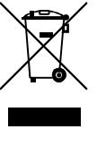

2012/19/EU (WEEE): Produkter märkta med denna symbol får inte kastas i allmänna sophanteringssytem inom den europeiska unionen. För korrekt återvinning av utrustningen skall den returneras din lokala återförsäljare vid köp av liknande ny utrustning eller lämnas till en därför avsedd deponering. För mer information, se: www.utcfssecurityproducts.eu/recycle/

### **Kontaktuppgifter**

www.utcfireandsecurity.com eller www.interlogix.com

För kundsupport, se www.interlogix.com/customer-support eller www.utcfssecurityproducts.eu

### **Specifikationer**

| Modell                                         | RF-EV1012-K4      | RF-EV1012PI-K4                | RF-EV1016-K4      | RF4012I4          | RF4012I4PI              | RF4016I4          | TX-2213-03-1           | TX-2311-03-1      | TX-2214-03-1      |  |  |
|------------------------------------------------|-------------------|-------------------------------|-------------------|-------------------|-------------------------|-------------------|------------------------|-------------------|-------------------|--|--|
| Detekteringsteknik                             |                   | PIR (9 ridåer, se vinkel 86°) |                   |                   |                         |                   |                        |                   |                   |  |  |
| Detekteringslägen (valbara via J1)             |                   | Standard- 3D, bi-ridå*        |                   |                   |                         |                   |                        |                   |                   |  |  |
| Objektets rörelsehastighet                     |                   | 30 cm/s till 3 m/s            |                   |                   |                         |                   |                        |                   |                   |  |  |
| Detekteringsintervall (valbart via J2)         | 6 och 12 m     | 6 och 12 m                 | 10 och 16 m    | 6 och 12 m     | 6 och 12 m           | 10 och 16 m    | 6 och 12 m          | 6 och 12 m     | 10 och 16 m    |  |  |
| Bländare utrustade                             | Delvis            | Fullständ.                    | Delvis            | Delvis            | Fullständ.              | Delvis            | Delvis                 | Fullständ.        | Delvis            |  |  |
| Husdjursimmun:                                 | Nej               | Ja                            | Nej               | Nej               | Ja                      | Nej               | Nej                    | Ja                | Nej               |  |  |
| Monteringshöjd                                 | 1,8 till 3,0 m | 2,3 till 3,0 m             | 2,3 till 3,0 m | 1,8 till 3,0 m | 2,3 till 3,0 m       | 2,3 till 3,0 m | 1,8 till 3,0 m      | 2,3 till 3,0 m | 2,3 till 3,0 m |  |  |
| Frekvens                                       |                   | 433,05 till 434,79 MHz        |                   |                   | 433,05 till 434,79 MHz  |                   | 868,60 till 868,70 MHz |                   |                   |  |  |
| Ljudstyrka                                     |                   | <10 dBm                       |                   |                   | <10 dBm                 |                   | <10 dBm                |                   |                   |  |  |
| Protokoll                                      |                   | 433-80plus                    |                   |                   | 433-63bit               |                   | GEN2                   |                   |                   |  |  |
| RF-intervall (utan hinder/med hinder), normal  |                   | 300 m/40 m                    |                   |                   | 300 m/40 m              |                   | 600 m/40 m             |                   |                   |  |  |
| Uppstartningstid                               |                   | 1 min                         |                   |                   |                         |                   |                        |                   |                   |  |  |
| Övervakningsintervall                          |                   | 18 min                        |                   |                   |                         |                   |                        |                   |                   |  |  |
| Låsningstimer                                  |                   | 3 min                         |                   |                   |                         |                   |                        |                   |                   |  |  |
| Batterityp                                     |                   |                               |                   |                   | 3,0 V, 1 300 mAh litium |                   |                        |                   |                   |  |  |
| Batteriets livslängd (typiskt med ett batteri) |                   | 5 år                          |                   |                   |                         |                   |                        |                   |                   |  |  |
| Batteri medföljer                              |                   | 1X CR123                      |                   |                   |                         |                   |                        |                   |                   |  |  |
| Aktuell strömförbrukning                       |                   | 22 µA (medel), 50 mA (max.)   |                   |                   |                         |                   |                        |                   |                   |  |  |
| Drifttemperatur                                |                   | EN −10 till +55°C             |                   |                   |                         |                   |                        |                   |                   |  |  |
| Relativ fuktighet                              |                   | 95 % max., icke-kondenserande |                   |                   |                         |                   |                        |                   |                   |  |  |
| IP/IK-klassning                                | IP30 IK02         |                               |                   |                   |                         |                   |                        |                   |                   |  |  |
| Dimensioner (LxWxH)                            |                   |                               |                   |                   | 130 x 69 x 53 mm        |                   |                        |                   |                   |  |  |
| Vikt (inkl. 1 batteri)                         | 146 g             |                               |                   |                   |                         |                   |                        |                   |                   |  |  |

* Bi-ridåläge är inte testat för EN 50131-2-2.