# //DATASHEET

XS4 2.0 READER Cutting-edge design + Outstanding technology:

The SALTO XS4 2.0 Reader incorporates the cutting edge design standard of the XS4 2.0 product range in this technological powerhouse.

XS4 2.0 READER WRDBxxx

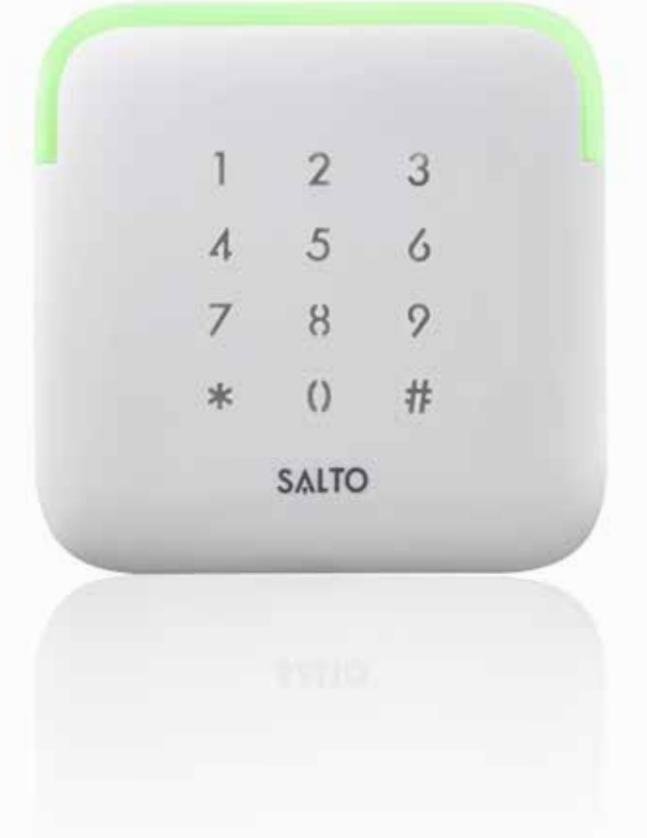

Publications of SALTO SYSTEMS S.L. are protected by copyright and all rights are reserved. SALTO SYSTEMS publications may not be reproduced in any form or by any means without written permission from the copyright owner.

83,5

22

83,5

# SALTO XS4 WALL READER

The SALTO XS4 2.0 Reader incorporates the cutting-edge design standard of the XS4 2.0 product range in this technological powerhouse. The SALTO XS4 2.0 Reader in combination with the SALTO XS4 2.0 Controller, facilitates the integration of the wall reader with almost any SALTO interface such as SALTO ProAccess SPACE, to provide your facility with a complete security solution. 22 95,5

95,5

95,5

# XS4 2.0 READER: STANDARD

# WRDB0E04

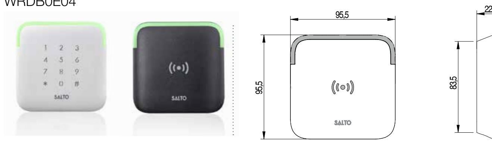

# MAIN FEATURES:

- Modern aesthetic design with clear LED signaling.
- Conical shape.
- Fully integrated with the SALTO XS4 platform.
- Virtual network capable through SALTO Virtual Network technology.
- ID technologies available: DESfire, DESfire EV1, Mifare, Mifare plus, Mifare Ultralight C, SKIDATA and Bluetooth Low Energy.
- NFC compatible.
- All communications between the carrier and the wall reader are encrypted and secure2 .
- Acoustic and optical signalling, dual colour green/red to indicate access authorisation.
- Available in 2 different finishes: White and Black.
- Concealed fixing screw for greater security and improved aesthetics.
- Contactless reading of the carrier, Reading distance up to 35mm (depending on the credential).

### MECHANICAL ASPECTS:

- Dimensions: 95,5mm x 95,5mm x 22mm (W x H x D).
#### CERTIFICATIONS:

- IP 66 compliant, suitable for outdoor and indoor use.
- CE comform (pending).
- UL 294 (pending).
- FCC certified (pending)..
- The maximum cable length between the door controller and the wall reader is 400meters1 . using a twisted pair cable.
- Connection to the door controller using AWG24 twisted pair or AWG18 cable connection. R
- Powered by the controller.

60

95,5

95,5

95,5

95,5

- 83,5 • Emergency opening by means of contactless portable programming device (PPD). 60 95,5 83,5q 60 [2-3/8"] 4"]
60

[2-3/8"] 60

15,5

### INSTALLATION:

95,5

### COMPATIBLE WITH STANDARD EUROPEAN ELECTRICAL BOX

2

1 2 3

15,5

83,5

q

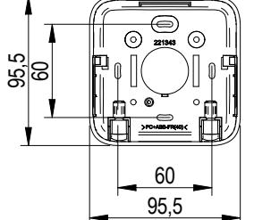

60

95,5

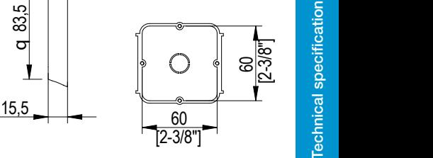

1

 Depending on the cable. Depending on the card and the RFID technology

22

[1/

22

6

[2-3/8"]

52 [2-1/16"] 60

52

[2-1/16"]

[2-3/8"]

60

2a 2b

[2-3/8"]

[2-3/8"] 60

[2-3/8"]

52 [2-1/16"]

R

4"]

6

[2-3/8"]

52 [2-1/16"]

[1/

60

52

[2-1/16"]

60

52

[2-1/16"]

[2-3/8"]

[2-3/8"]

2a

60

2a

2b

2a 2b

2b

60

95,5

R

4"]

6

[1/

95,5

22

22

22

# SALTO XS4 WALL READER WITH KEYPAD

22 95,5 The SALTO XS4 2.0 Reader incorporates the cutting-edge design standard of the XS4 2.0 product range in this technological powerhouse. The SALTO XS4 2.0 Reader in combination with the SALTO XS4 2.0 Controller, facilitates the integration of the wall reader with almost any SALTO interface such as SALTO ProAccess SPACE, to provide your facility with a complete security solution.

83,5 95,5 83,595,5 83,595,5 This product allows for the additional use of a Personal Identification Number (PIN) key pad option increasing the security by using a double autentication and enhanced more opening modes.

95,5

# XS4 2.0 READER: READER + KEYPAD

# WRDB0E04WK

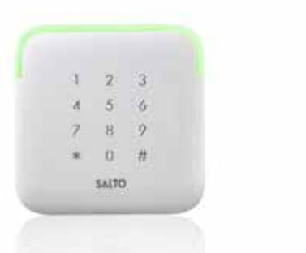

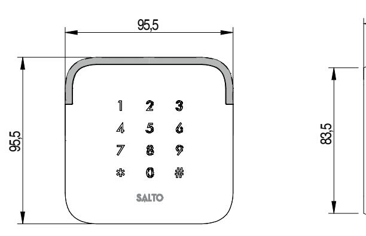

22

# MAIN FEATURES:

- Modern aesthetic design with clear LED signaling.
- Conical shape.
- Capacitive keypad.
- Fully integrated with the SALTO XS4 platform.
- Virtual network capable through SALTO Virtual Network technology.
- ID technologies available: DESfire, DESfire EV1, Mifare, Mifare plus, Mifare Ultralight C, SKIDATA and Bluetooth Low Energy.
- NFC compatible.
- Permits additional opening modes and user authentication through a user PIN.
- All communications between the carrier and the wall reader are encrypted and secure2 .
- Acoustic and optical signalling, dual colour green/red to indicate access authorisation.
- Available in White finish.
- Keys are iluminatd for better usability (intelligent lightening).

## SPECIFIC OPENING MODES:

- Opening through key card.
Technical specifications - SALTO XS4 2.0 READER - datasheet_WRDBx_ENG_11_15

- Opening Card plus personal PIN.
- Opening through doorr code.
- •

### MECHANICAL ASPECTS:

- Dimensions: 95,5mm x 95,5mm x 22mm (W x H x D).
## CERTIFICATIONS:

- IP 66 compliant, suitable for outdoor and indoor use.
- CE comform (pending).
- UL 294 (pending).
- FCC certified (pending).
- Concealed fixing screw for greater security and improved aesthetics.
- Contactless reading of the carrier, Reading distance up to 35mm (depending on the credential).
- R [1/ 6 4"]• The maximum cable length between the door controller and the wall reader is 400meters1 . using a twisted pair cable.
- 60 95,5 83,5q 60 [2-3/8"] 52 • Connection to the door controller using AWG24 twisted pair or AWG18 cable connection.
- 15,5• Powered by the controller.

95,5

95,5

- 60 95,5 60 [2-3/8"] 60 [2-3/8"] 52 [2-1/16"] • Emergency opening by means of contactless portable programming device (PPD).
### INSTALLATION:

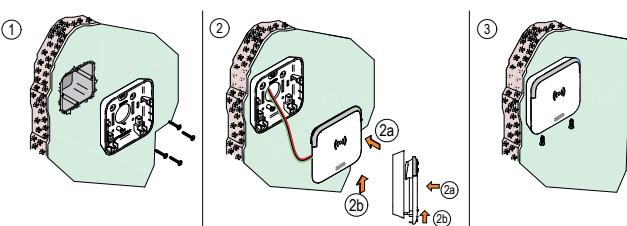

### COMPATIBLE WITH STANDARD EUROPEAN ELECTRICAL BOX

15,5

2

83,5

q

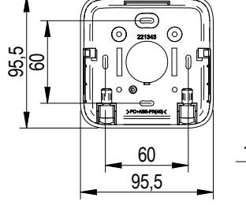

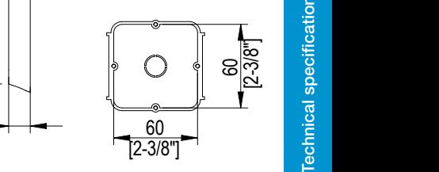

2a

2a 2b

2a 2b

2b

2a

2b

1 2 3

60

[2-1/16"]

[2-3/8"]

[2-3/8"]

R

4"]

6

[1/

[2-3/8"]

52 [2-1/16"]

52

[2-1/16"]

R

4"]

6

[1/

[2-3/8"]

52 [2-1/16"] 60

52

[2-3/8"]

60

[2-1/16"]

[2-3/8"]

# SALTO XS4 WALL READER

The SALTO XS4 2.0 Reader incorporates the cutting-edge design standard of the XS4 2.0 product range in this technological powerhouse. The SALTO XS4 2.0 Reader in combination with the SALTO XS4 2.0 Controller, facilitates the integration of the wall reader with almost any SALTO interface such as SALTO ProAccess SPACE, to provide your facility with a complete security solution. 95,5 (3-3/4") 1-5/32" (29,5)

This wall reader has been designed to fit on standard ANSI electrical box.

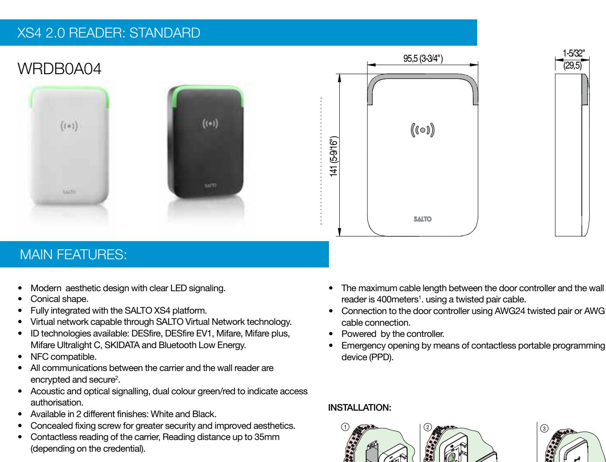

#### MECHANICAL ASPECTS:

- Dimensions: 95,5mm x 141mm x 29,5mm (W x H x D).
#### CERTIFICATIONS:

- IP 66 compliant, suitable for outdoor and indoor use.
- CE comform (pending).
- UL 294 (pending).
- FCC certified (pending).
- 
- Connection to the door controller using AWG24 twisted pair or AWG18
- Emergency opening by means of contactless portable programming

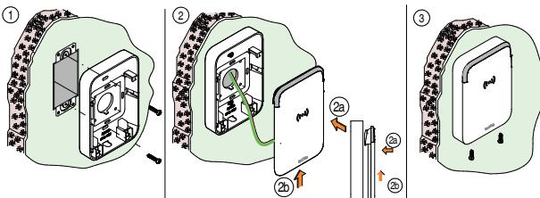

### COMPATIBLE WITH STANDARD ANSI ELECTRICAL BOX

2

3-3/4" (95,5mm)

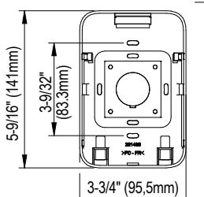

3-9/32"

(83.3mm)

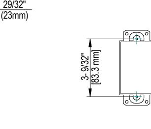

2a

2a

3- 9/32"

2a

2b

2a

2b

2b

60

15,5

83,5 q

95,5

60

95,5

60

15,5

83,5 q

95,5

60

15,5

83,5 q

95,5

60

95,5

60

95,5

[83.3 mm]1 Depending on the cable. Depending on the card and the RFID technology

1 2 3

2b

1-5/32" (29,5)

95,5 (3-3/4")

# SALTO XS4 WALL READER WITH KEYPAD

The SALTO XS4 2.0 Reader incorporates the cutting-edge design standard of the XS4 2.0 product range in this technological powerhouse. The SALTO XS4 2.0 Reader in combination with the SALTO XS4 2.0 Controller, facilitates the integration of the wall reader with almost any SALTO interface such as SALTO ProAccess SPACE, to provide your facility with a complete security solution. 95,5 (3-3/4") 1-5/32" (29,5) 141 (5-9/16")

This product allows for the additional use of a Personal Identification Number (PIN) key pad option increasing the security by using a double autentication and enhanced more opening modes. 141 (5-9/16")

141 (5-9/16")

141 (5-9/16")

141 (5-9/16")

# XS4 2.0 READER: READER + KEYPAD

# WRDB0A04WK

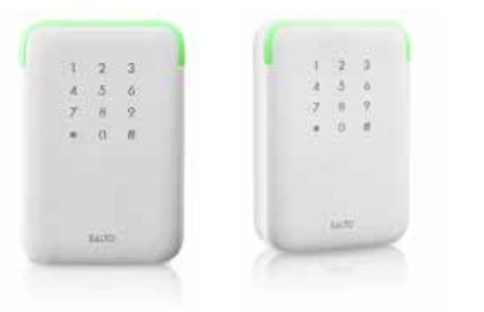

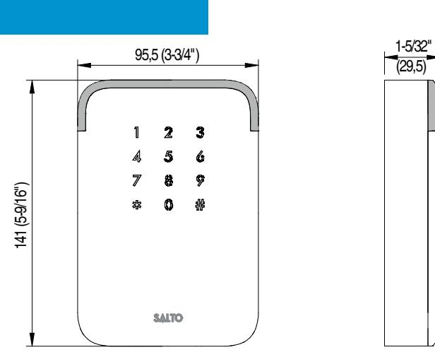

## MAIN FEATURES:

- Modern aesthetic design with clear LED signaling.
- Conical shape.
- Capacitive keypad.
- Fully integrated with the SALTO XS4 platform.
- Virtual network capable through SALTO Virtual Network technology.
- ID technologies available: DESfire, DESfire EV1, Mifare, Mifare plus, Mifare Ultralight C, SKIDATA and Bluetooth Low Energy.
- NFC compatible.
- Permits additional opening modes and user authentication through a user PIN.
- All communications between the carrier and the wall reader are encrypted and secure2 .
- Acoustic and optical signalling, dual colour green/red to indicate access authorisation.
- Available in White finish.
- Keys are iluminatd for better usability (intelligent lightening).

## SPECIFIC OPENING MODES:

- Opening through key card.
Technical specifications - SALTO XS4 2.0 READER - datasheet_WRDBx_ENG_11_15

- Opening Card plus personal PIN.
- Opening through doorr code.
- 

#### MECHANICAL ASPECTS:

- Dimensions: 95,5mm x 141mm x 29,5mm (W x H x D).
### CERTIFICATIONS:

- IP 66 compliant, suitable for outdoor and indoor use.
- CE comform (pending).
- UL 294 (pending).
- FCC certified (pending).
- Concealed fixing screw for greater security and improved aesthetics.
- Contactless reading of the carrier, Reading distance up to 35mm (depending on the credential).
- The maximum cable length between the door controller and the wall reader is 400meters1 . using a twisted pair cable. 29/32" (23mm)
- Connection to the door controller using AWG24 twisted pair or AWG18 cable connection. 5-9/16" (141mm)3-9/32" (83.3mm) 3- 9/32" [83.3 mm]
- Powered by the controller.
- Emergency opening by means of contactless portable programming device (PPD). 3-3/4" (95,5mm)

### INSTALLATION:

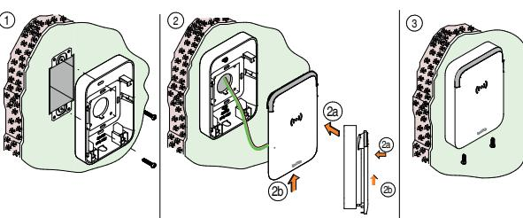

29/32"

COMPATIBLE WITH STANDARD ANSI ELECTRICAL BOX 60

2

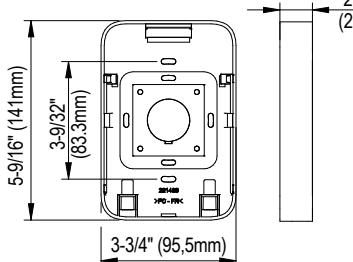

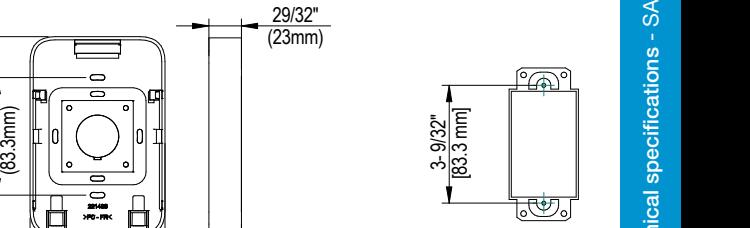

1 Depending on the cable. Depending on the card and the RFID technology

2b

2a

2a

2b

2b

3- 9/32"

2a

2a

2b

60

15,5

60

15,5

83,5 q 95,5

15,5

83,5 q

60 95,5

95,5

60

95,5

83,5 q

95,5

60

95,5

## DOOR CONTROLLER REQUIERED:

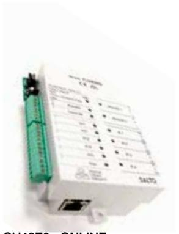

CU42E0 - ONLINE CONTROLLER

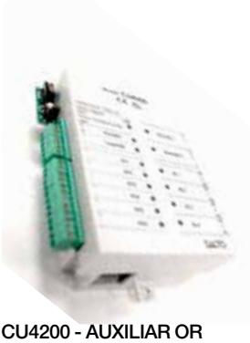

OFFLINE CONTROLLER

## MIFARE:

Mifare RFID contactless technology reads & writes information to contactless smart cards (RFID) compatible with standards, such as Mifare, Mifare plus, DESFire, DESFire EV1 technologies or even Bluetooth Low Energy (BLE) technology. These technologies also allow for the updating of carriers via SALTO Virtual Network (SVN) technology.

- Fully integrated with the SALTO XS4 platform.
- 13.56MHz contactless RFID identification.
- ISO 14.443A Mifare, Mifare plus, DESFire, DESFire EV1 Compatible.
- ISO 15.693 Tag it, Icode, Flex Space (SKIDATA) Compatible. • Near Field Communication (NFC) compatible.
- Available key cards: 1Kbyte, 4Kbytes and 8 Kbytes depending on technology.

The SALTO XS4 2.0 Reader needs to be used in combination with the XS4 2.0 Controller (CU42E0 or CU4200).

Depending on the specific requirements, the XS4 2.0 Reader will need to be connected to CU42E0 controller (online)or to the CU4200 controller (offline).

- Available carriers: ISO 7810 cards, fobs, bracelets, stickers, watches…
- Reusable key cards.
- SALTO Virtual Network (SVN) compatible.
- RFID technology permits contactless exchange of information between the card and the reader.
- High security encrypted Proximity cards.
- Multi-application with other systems using the same card with different sectors.
- Customized issuing card through SALTO Authorization Media software (SAM).
- Waterproof cards which can be customized.

# ID TECHNOLOGIES: RANGE OF RFID CREDENTIAL / KEYS AVAILABLE

- MIFARE: Mifare, Mifare plus, Ultralight C, DESfire, DESfire EV1 and Vicinity cards.
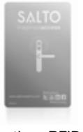

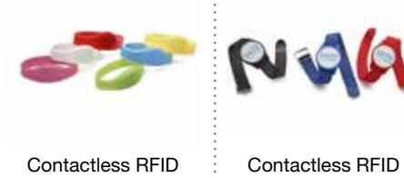

### mSVN SOLUTION:

Technical specifications - SALTO XS4 2.0 READER - datasheet_WRDBx_ENG_11_15

With mSVN (Mobile SALTO Virtual Network) it´s now possible to update cards remotely and without using a fixed update point. All an end-user needs is an NFC-enabled smartphone to update their DESFire EV1 credential using SALTOs' JustIN mSVN App, thereby increasing the flexibility of an instalation's security.

### MAIN FEATURES:

- XS4 COMPABILITY: XS4 Original RFID escutcheon range. Extensive range of escutcheon styles and sizes including European, Scandinavian, ANSI models and Wireless models (RFID models only).
- SMARTPHONE: Android minimum version: 2.3.3
- SYSTEM REQUIREMENTS: SALTO ProAccess SPACE software.
- SMART KEY COMPABILITY: DESFire EV1 (AES 3DES encryption) (SALTO SAM Card required)
- BLACKLIST dissemination that increases security without the need to wire or visit doors.

#### MOBILE GUEST KEYS SOLUTION:

Silicone Bracelet

SALTO Bluetooth mobile guest key via SALTO's JustIN Key app communicates securely via the Cloud and enables a user to receive their door key online, anytime and anywhere.

Fobs Bracelet

#### MAIN FEATURES:

- XS4 COMPABILITY: XS4 Original RFID escutcheon range. Extensive range of escutcheon styles and sizes including European, Scandinavian, ANSI models and Wireless models (RFID models only - no Keypad).
- SSL: Secure Socket Layer.
- AES 128 BIT encryption opening procedures.
- SMARTPHONE Compability: iOS and Android devices.
- SYSTEM REQUIREMENTS: SALTO ProAcess SPACE software.

