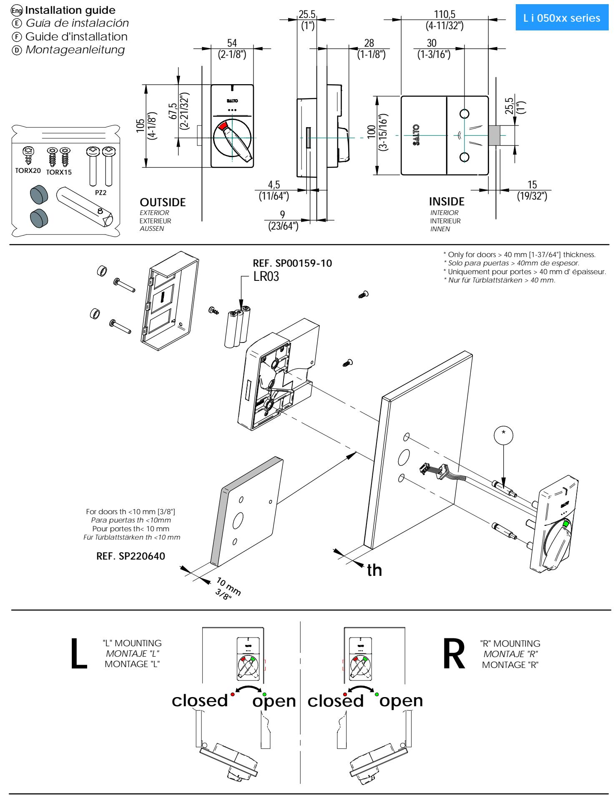
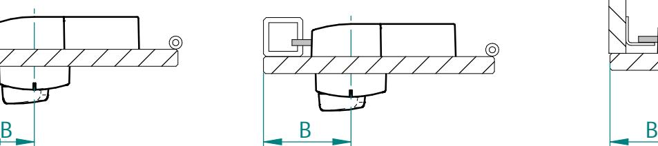
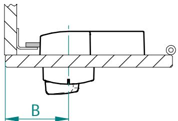
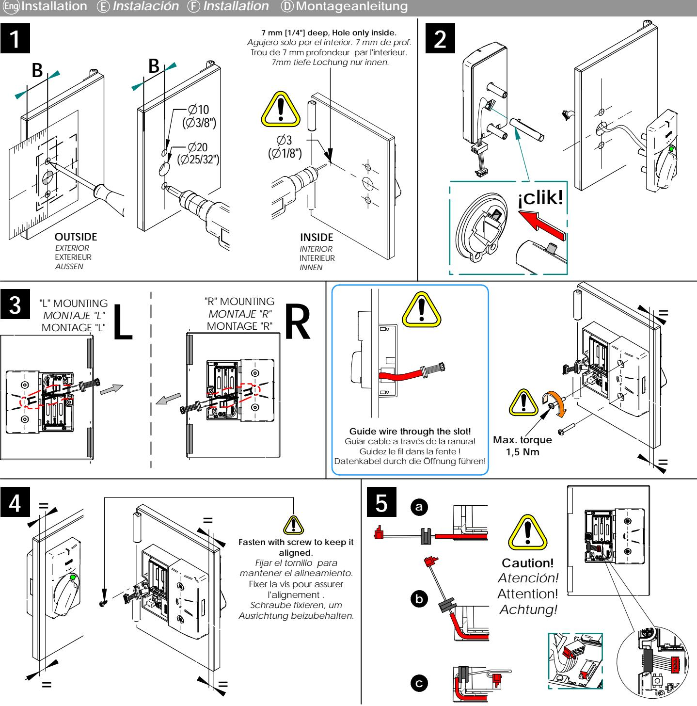
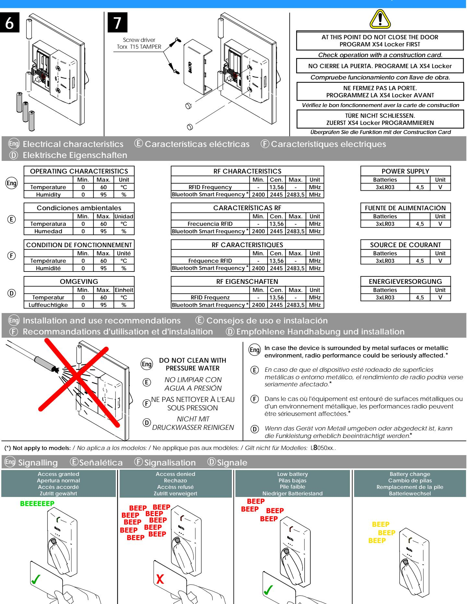
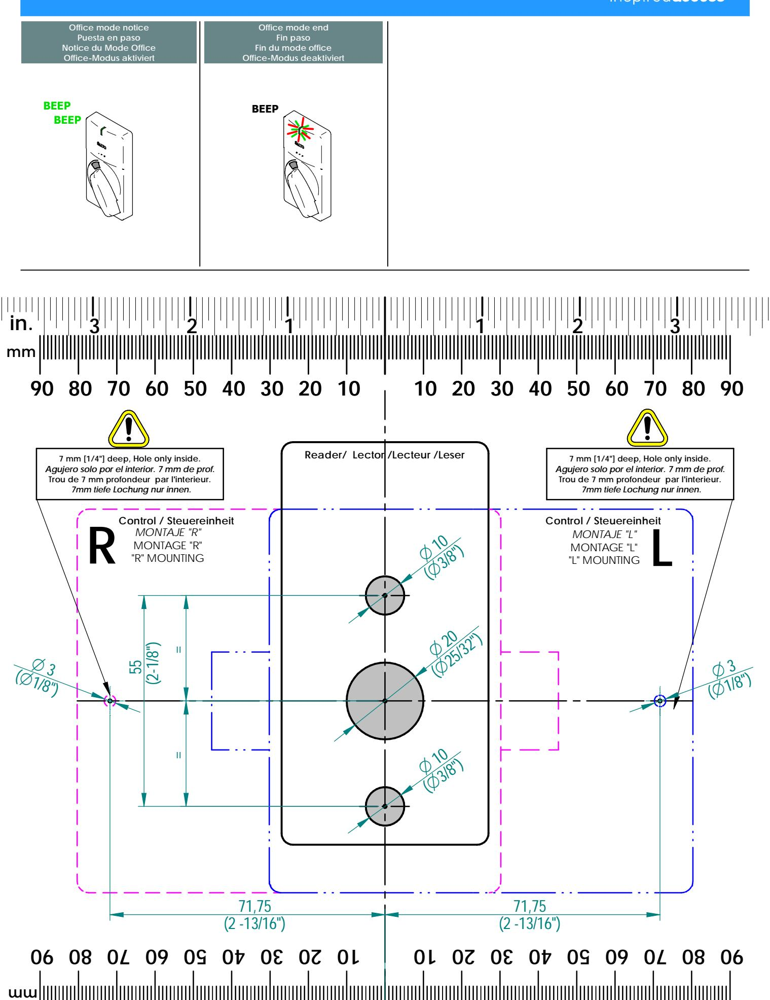

- **The dimension B will depend on the door or strike tipe the locker lock is going to be installed on. Eng**
- *La cota B dependerá en cada caso del tipo de puerta o cerradero donde se instale la cerradura de taquilla .* **E**
- La mesure B dépendra dans chaque cas du type de porte ou gâche où va s'intaller la serrure vestiaire. **F**
- *Moß B ist abhängig von Tür-oder Schließblechart, an der das Schrank-/Kabinenschloss installiert wird.* **D**

All contents current at time of publication. SALTO Systems S.L. reserves the right to change availability of any item in this catalog, its design, construction, and/or materials. © **2020 SALTO Systems S.L. 220639 -ED0 -17/09/2020**

