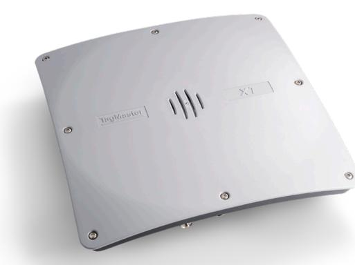

# XT-5 UHF Reader

# Automatic Vehicle Identification

## KEY FEATURES

- Advanced Linux based UHF reader with PoE+
- High power radio with polarization control
- Self-jammer cancellation (SJC)
- Read range up to 12m (40ft)
- Additional external antenna as option

## A world leading reader

The XT-5 is our most advanced integrated reader to this date. It has an advanced radio design with high output power, self-jammer cancellation (SJC) and control of antenna polarization (which can be set to vertical, horizontal or circular). It supports both PoE+ (Power over Ethernet) and conventional power supply. It has a high performance processor running Linux and supports a SDK (Software Development Kit). The bright LEDs for visual indication are implemented as RGB (Red/Green/Blue).

An external antenna can be connected, and also this external antenna supports polarization control and RGB LEDs, all using a single RF cable connected to the reader.

## Unmatched flexibility

The XT-5 is easy to install, configure and use. The reader is intended for outdoor usage and is well suited for the toughest environments. XT-5 has a wide number of built-in interfaces including Ethernet (2 separate ports), RS232, RS485 and Wiegand/Magstripe as well as the option to add an additional external antenna. All this together with the SDK supporting development of customer specific software give an unmatched flexibility.

Using a unique firmware implementation the TagMaster readers in a single installation communicates real-time information (per separate antenna) to accurately distinguish and discriminate tags from adjacent lanes using the Distributed Cross Read Elimination (DCRE) feature. The readers also have Distributed Duty Cycling (DDC) ensuring

www.tagmaster.com sales@tagmaster.com

that adjacent readers/antennas do not read simultaneously and thereby achieving absolutely optimal reading conditions.

#### RAIN compliant

The TagMaster XT-5 is fully compliant with RAIN. The XT-5 includes TagMaster's SecureMarkID® tag format, which is developed to ensure that each UHF tag has a unique identity which is difficult to duplicate. The XT-5 combined with our SecureMarkID® tags provides a higher level of security.

## PART NO. INFORMATION

| XT-5 eu                           | 152800 |
|-----------------------------------|--------|
| XT-5 us                           | 152900 |
| External XT-5 eu antenna          | 163810 |
| External XT-5 us antenna          | 163820 |
| Universal Mounting Kit (optional) | 193600 |
| Antenna Cable 10m                 | 196000 |

#### TECHNICAL INFORMATION

| Operating frequencies     | XT-5 eu:                                                                                                        |
|---------------------------|-----------------------------------------------------------------------------------------------------------------|
|                           | 865.6-867.6 MHz, Europe                                                                                         |
|                           | 865.0-867.0 MHz, India 866.0-867.6 MHz, Russian Federation                                                   |
|                           | XT-5 us:                                                                                                        |
|                           | 902.0-928.0 MHz, Unites States, Americas 920.0-926.0 MHz , Australia                                         |
|                           | 920.5-924.5 MHz, China                                                                                          |
|                           | 919.0-923.0 MHz, Malaysia 921.5-928.0 MHz, New Zealand                                                       |
|                           | 920.0-925.0 MHz, Singapore                                                                                      |
| Read range                | Up to 12 meters (40 ft.) with TagMaster Windshield tag depending on vehicle type and installation conditions |
| Protection                | IP66                                                                                                            |
| Housing                   | Aluminum housing UL94 certified plastic XENOY™ cover                                                            |
| Operating temperature     | -40°C (-40°F) to +60°C (+140°F)                                                                                 |
| Output power              | EU: 2 W (e.r.p). US: 4 W (e.i.r.p)                                                                              |
| Power supply              | 10 to 30 VDC or PoE+                                                                                            |
| Power consumption         | 8 W (max 15 W)                                                                                                  |
| Input                     | 4 isolated inputs                                                                                               |
| Output                    | 4 isolated outputs                                                                                              |
| Relay                     | 1 relay output, 60 VDC, 2 A                                                                                     |
| Interfaces                | RS232, RS485, Wiegand/Magstripe, 2 x Ethernet                                                                   |
| CPU                       | ARM Cortex™-A5 running at 536 MHz                                                                               |
| Memory                    | 4GB Flash, 512 MB DRAM                                                                                          |
| Weight                    | 2.3 kg (5.1 lbs)                                                                                                |
| Dimensions                | 300 x 300 x 60 mm (11.8 x 11.8 x 2.4 inch)                                                                      |
| LED indicator             | RGB                                                                                                             |
| Communication protocols   | TAGP and various OEM protocols. More information in TagMaster manuals                                           |
| Encrypted air interface   | According to RAIN                                                                                               |
| EMC                       | EN 301489-1, EN301489-3                                                                                         |
| Certificates              | CE Certificate according directive 2014/53/EU (RED) and FCC                                                     |
| Standard                  | RAIN (EPC Gen2/ISO 18000-63)                                                                                    |
| Safety                    | EN 60950-1 and 60950-22                                                                                         |
| Manuals and documentation | XT Series Reader Manual                                                                                         |

www.tagmaster.com sales@tagmaster.com