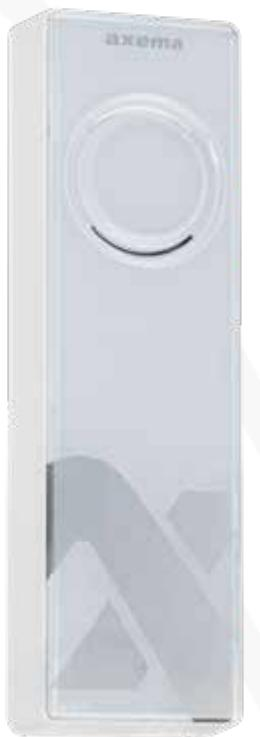
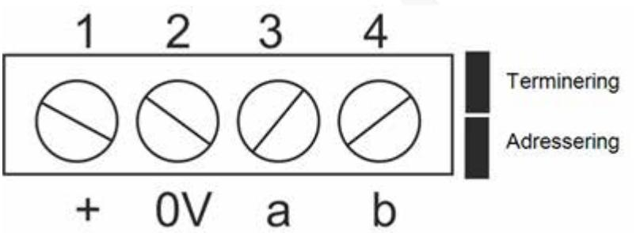
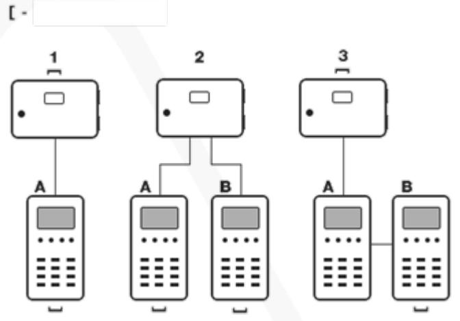
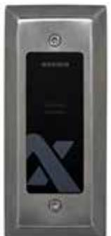

### Manual

Updated 11/20/2020

# **Reader VAKA A45**

A45 is used as an EM- and MIFARE proximity reader in Axema VAKA

# A45 reader for VAKA

| Screw connectors           | 3 |
|----------------------------|---|
| Termination and addressing | 3 |
| Cable                      | 4 |
| Reading                    | 4 |
| Vandal proof cover C811    | 5 |
| Mounting                   | 5 |
| Tecnical data C811         | 5 |
| Technical data             | 5 |

# Screw connectors

| Connector | Function                                   | B17/B27B28 | B18 |
|-----------|--------------------------------------------|------------|-----|
| 1-2       | Power supply (connector 1 is positive (+)) | 8-9        | 1-2 |
| 3-4       | Communication, termination (100Ω)          | 10-11      | 3-4 |

# Termination and addressing

| Unit                                | A45                              | B17, B27 and B28              | B18                                            |
|-------------------------------------|----------------------------------|----------------------------------|------------------------------------------------|
| Termination                         | Mount the ter mination jumper | Mount the ter mination jumper | Install the 100 Ω resistor between 3 and 4. |
| Address a B unit (inside reader) | Remove the addressing jumper  |                                  |                                                |

The unit is named in the VAKA software.

### Cable

| Cable type  |      | Maximum cable length at 24V |  |
|-------------|------|-----------------------------|--|
| 1 x 4 x 0,5 | 150m |                             |  |
| Cat 5/6     | 200m |                             |  |
|             |      |                             |  |
|             |      |                             |  |
|             |      |                             |  |
|             |      |                             |  |

How a UTP Cat 5 should be connected for maximum length.

#### Maximum cable length between B16/B26 and the reader is 10m. No termination resistor should be used.

### Reading

Present the credential against centre of the reader.A successful reading is indicated by a red or green LED depending on if the credential do have access or not.

If a reading not is indicated, the credential lacks compatibility, or that the MIFARE or EM reading has been disabled. This is set in the in the VAKA software under Settings, Card/Code, Cards.

# Vandal proof cover C811

#### Mounting

Detach the plastic cover from the A45 and fixate the C811 with the attached screws.

Full stability is obtained after installation when resistance is provided by the A45 for the vandal protection polycarbonate insert. Without resistance, the bonding is not strong enough in itself, but should only facilitate the assembly of the C811.

Please use the screws provided as far as possible as these are customized for the product's various installation options.

### Tecnical data C811

- l 2mm stainless steel
- l Mounting screws are includes
- l Dimensions: 150x54x19 (HxWxD)

# Technical data

| Attribute                                | A45                            |
|------------------------------------------|--------------------------------|
| Reading distans in optimal conditions | 7 cm with EM, 3 cm with MIFARE |
| Power supply                             | From door controller           |
| IP-rating                                | IP44                           |

| Attribute         | A45                   |
|-------------------|-----------------------|
| IP rating         | IK06 (IK08 with C811) |
| Temperature range | -30° to +55C°         |