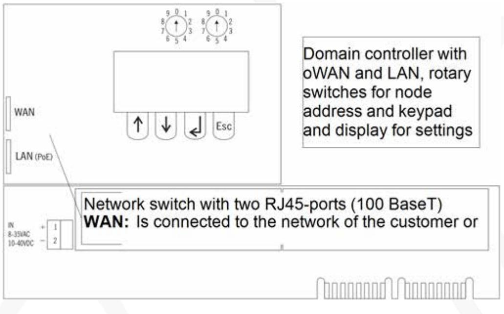
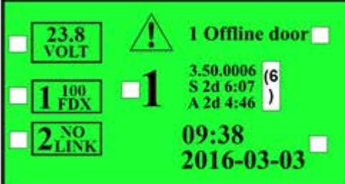
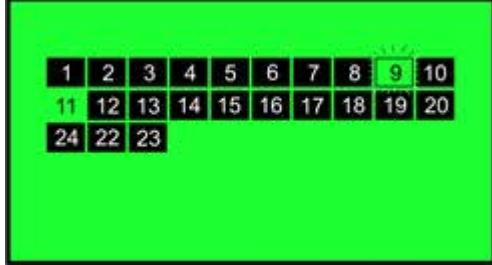
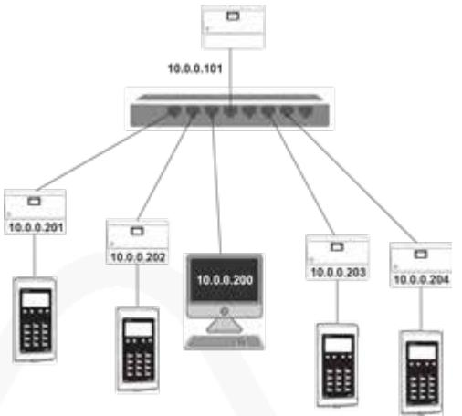
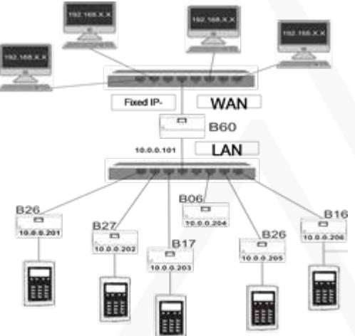
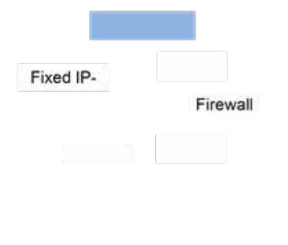
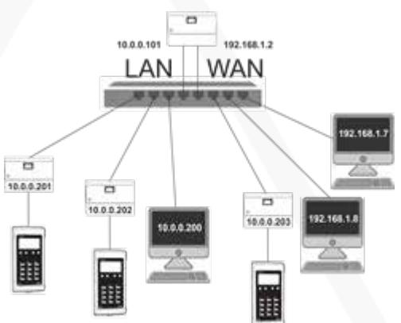
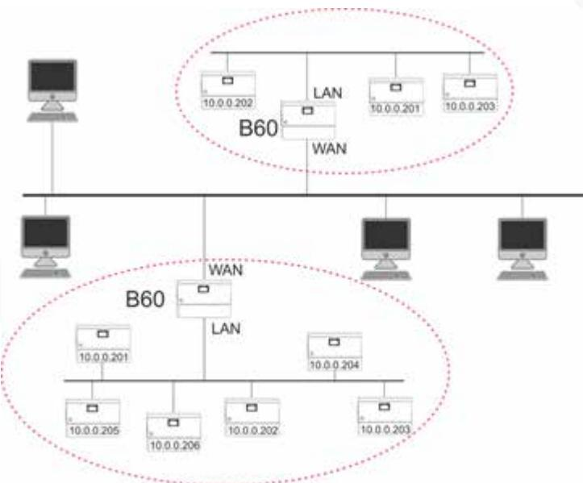
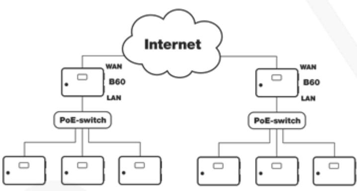
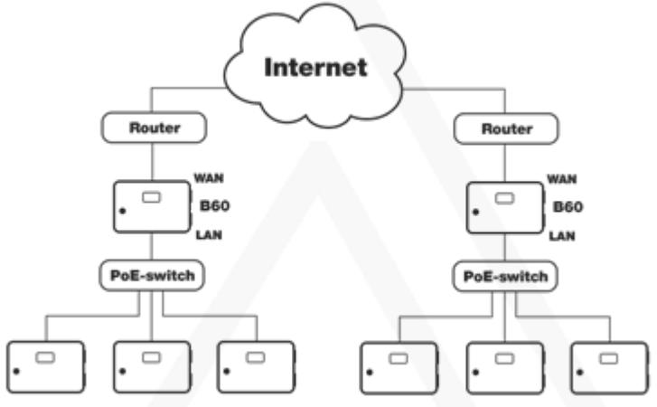

## Manual

Updated 11/23/2020

# **Domain controller VAKA B60**

The B60 is used in systems with more than ten door environments and/or when information panels and reservation is needed.

# B60 Domain controller

| B60 with connection card                                                                       | 3  |
|------------------------------------------------------------------------------------------------|----|
| Node addresses                                                                                 | 3  |
| Display                                                                                        | 3  |
| Door nodes                                                                                     | 4  |
| Connection examples (one domain)                                                               | 5  |
| Local network only LAN                                                                         | 5  |
| Local network with door controller in an isolated network.                                     | 5  |
| Internet                                                                                       | 6  |
| WAN and LAN in the same network                                                                | 6  |
| Connection examples (multiple domains)                                                         | 7  |
| Controllers in isolated network and the WAN port connected to the network of the cus tomer. | 7  |
| Communication between domains over internet.                                                   | 8  |
| Communication between domains using routers over internet.                                     | 8  |
| Doors in different network segments                                                            | 8  |
| Menues                                                                                         | 9  |
| Installation and configuration                                                                 | 10 |
| Before you contact support                                                                     | 11 |
| Technical data and performance                                                                 | 11 |

# B60 with connection card

# Node addresses

Domain controllers in a VAKA system should have unique node addresses from 1 mto 99. The node address of a B60 is not in conflict with the node addresses of the door controllers.- A B60 can have the same node address as a door controller.

The domain controllers' default IP addresses on the LAN side follow the node address, for example, a domain controller with a node address 1 has the IP address 10.0.0.101 and a domain controller with node address 4 has IP address 10.0.0.104.

The node address is set by the rotary switches and should be set before installing the domain controller in VAKA.

## Display

- 1. Shows current voltage.
- 2. 100 FDX (100Mb full duplex) Shows that the network socket is connected to e.g. a switch.
- 3. Device node address.
- 4. Shows that the socket is not connected to anything.
- 5. Shows potential system error. In the example, a door is offline. Which door can be seen under the menuDoor Status.
- 6. Software installed on the door controller. Not to be confused with the PC client on the computer which often has a similar version, e.g. 3.50.0002.
- 7. Shows time that the system has been running since restart. (2 days, 6 hours and 7 minutes).
- 8. Shows time that the Application has been running. Reset e.g. by Restart App.
- 9. Current time.

# Door nodes

To enter this menu, select Node status/ Domain status in Main menu.

Black rectangles indicates that the doos controller and domain controller is connected to the system.

No rectangle indicates that the controller currently is off-line. An off-line door controller got iss latest settings, but can't be configured from VAKA.

A flashing node indicates that the controller is synchronizing.

Node 9 indicates an on going synchronization and node 11 indicates that the controller is off line.

# Connection examples (one domain)

Avoid daisy chaining controllers. Daisy chained controller can cause problems i.e. during upgrades when door controller restarts.

## Local network only LAN

## Local network with door controller in an isolated network.

### Internet

## WAN and LAN in the same network

# Connection examples (multiple domains)

Avoid daisy chaining controllers. Daisy chained controller can cause problems i.e. during upgrades when door controller restarts.

### Controllers in isolated network and the WAN port connected to the network of the customer.

## Communication between domains over internet.

The example assumes then the domain controllers have fixed public IP-addresses on the WAN side.

### Communication between domains using routers over internet.

The example assumes that port forwarding of ports 3088 and 123 is configured in the routers

# Doors in different network segments

With B60 in combination with VAKA version 3.50 or later, it is possible to have doors in different network segments.

The automatic function in VAKA for hardware installation does not work for devices in different network segments. The installation must therefore be done manually.

- 1. Use only the LAN port on the B60 in the system.
- 2. Add the new door network settings to the B60 program and to B17 / B27 from the control panel.
- 3. The door controllers to be installed must be located inFactor100 mode. The Factor100 mode is activated by entering a node address higher than 10. The door controller will then restart in the Factor100 mode and then the current node address can be specified.
- 4. The B60 will then search for the door, the search usually takes a couple of minutes.

#### A door controller in Factor100 mode cannot be logged in to.

## Menues

Main Menu

System Information

- l Door Nodes
- l Domain Nodes
	- l Displays the status of doors and domain controllers.

#### Node Status

- l Displays the status of connected doors
#### Network Settings

- l WAN Settings
	- l View AddressesDisplays WAN / Mac address for controllers.
	- l Edit Settings
		- l DHCP Enable / DisableSwitches with the up / down arrow
		- l DHCP Enable
			- l IP address
			- l Netmask
			- l Gateway
			- l DNS 1
			- l DNS 2
- l LAN Settings
	- l View AddressesDisplays LAN / Mac address on B60
	- l Edit Settings
		- l IP address
		- l Netmask

#### Tools

- l Restart AppRestarts the device software
- l Restart DeviceRestarts the device
- l Clear ControllerResets to factory settings
- l Set System CodeUsed when system security is set to high

# Installation and configuration

This manual only covers the installation and connection of the unit.

For information of how to configure the unit, see the manual for VAKA commissioning (https://info.axema.se?commissioning).

For configuration of motor lock settings, see section Access control -> Motor lock in the commissioning manual. /https//info.axema.se?commissioning)

For configuration of the C12, see section Volume settings in the commissioning manual. (/https//info.axema.se?commissioning)

# Before you contact support

The CF card of a C10 module should contain at least v 1.09.

Updating is recommended to do over LAN.

During upgrade, the IP-addresses are reset to the factory defaults, WAN to DHCP, LAN to 10.0.0.101 and door controllers to 10.0.0.2xx.

To browse from the 10-network, the gateway needs to be the LAN address of the B60. (Factory default 10.0.0.101)

If units can't be detected, the Windows firewall temporarily should be deactivated.

| Attribute         | B60                                    |
|-------------------|----------------------------------------|
| Power supply      | 12-35 VAC/ 12-40VDC eller PoE 802.3 at |
| Built in switch   | No                                     |
| Built in firewall | Yes                                    |
| PoE-support       | Yes                                    |
| IP-rating         | IP22                                   |
| IP rating         | IK06                                   |
| Temperature range | 0° to +55C°                            |

# Technical data and performance