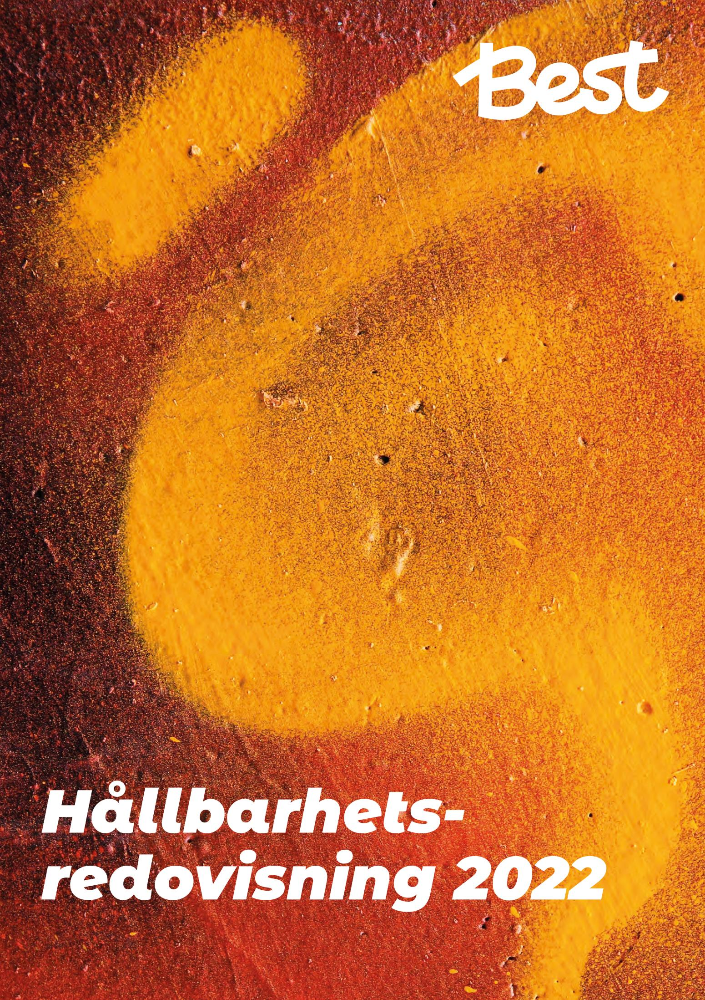

## **Group CEO** *Niklas Knight*

*" " 2022 var året när Best tog avgörande steg mot fossilfria leveranser*

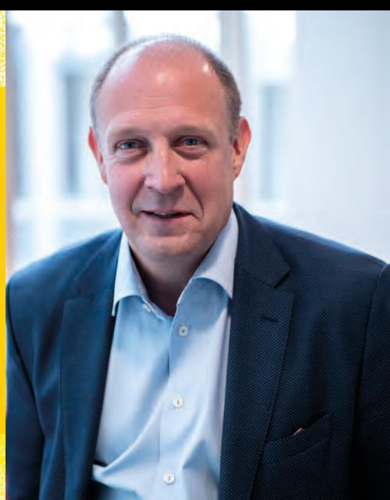

2022 var året när Best Transport tog avgörande steg mot fossilfria leveranser. I Sverige slutfördes denna historiska omställning och vår egen fordonsflotta är nu i princip helt fossilfri, vilket också var vårt främsta fokus i hållbarhetsarbetet 2022. Nu fortsätter vi med att ställa om till fossilfritt i resterande marknader i Best-koncernen.

När vi summerar 2022 kan vi konstatera att hela 99,23 procent av alla tankningar som genomförts i Sverige har varit fossilfria. Det är en otrolig bedrift som har krävt tydlighet, målinriktade aktiviteter och daglig uppföljning. För miljön har Best Transports konsekventa hållbarhetsarbete inneburit en total minskning av CO2-utsläpp om 2 696 ton, vilket är en minskning med 36,3 procent jämfört med föregående år.

Under första kvartalet 2022 skenade priserna på bränsle och energi, främst med anledning av kriget i Ukraina, men även på grund av reduktionsplikten. För oss i transportbranschen har de skyhöga priserna naturligtvis en direkt påverkan på vår verksamhet. En viktig åtgärd som Best Transport genomförde i mars 2022 var införandet av drivmedelstillägg (DMT).

Under 2022 har vi utvecklat en långsiktig hållbarhetsplan som är kopplad mot FN:s globala mål. För Best är detta en logisk progression eftersom vi verkar i så stor utsträckning i den offentliga miljön med leveranser till samhällsbärande funktioner såväl som till privata konsumenters hemmiljö. Denna plan kopplar på ett naturligt sätt ihop hela koncernens hållbarhetsarbete ovidkommande av nationella skillnader. På en hållbar leverans ställer vi krav som sträcker sig längre än bara miljöaspekten till att inkludera social och ekonomisk hållbarhet.

Best Transport har under 2022 fortsatt arbetet med social hållbarhet i koncernen. Vårt införande av krav på kollektivavtal hos anslutna åkerier i den svenska verksamheten resulterade under året i att Svenska Transportarbetareförbundet presenterade Best Transport i deras förteckning över bolag med schyssta villkor. I Norge blev vi under 2022 medlemmar i Norges Lastebileier-Forbund. Självklart har vi även fortsatt med revisioner av anslutna åkerier samt med att utveckla våra processer och kontrollsystem för att säkerställa avtalsefterlevnad vad gäller arbetsförhållanden och villkor.

Under hösten 2022 har alla Best Transports chefer genomgått en utbildning i inkluderande ledarskap och rekrytering. Utbildningen har givit oss ytterligare kunskap om fördelarna med mångfald och breddad rekrytering för verksamheten samt hur vi alla kan agera än mer inkluderande i vår arbetsvardag. Att vi som arbetar tillsammans har olika bakgrund och att alla får komma till tals gör att vi får en mer utvecklande arbetsplats. Det menar vi på Best Transport är en nyckel till vår framgång.

Nu ser vi fram emot 2023 och Best Transports fortsatta hållbarhetsutveckling!

Årsta, mars 2023

**Niklas Knight** Group CEO, Best Transport

## *Snabba hållbara leveranser*

Vår affärsmodell ska säkerställa att samtliga hållbarhetsdimensionerna drar nytta av våra insatser och investeringar. Vi erbjuder våra kunder konkurrenskraftiga och snabba leveranser som utförs på ett miljömässigt, socialt och ekonomiskt hållbart sätt.

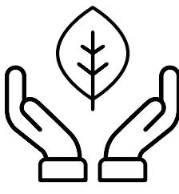

#### *Miljöansvar*

Vi ställer om hela vår verksamhet till fossilfria drivmedel. Samtidigt investerar vi i miljöfordon samt teknologi som gör vår verksamhet än mer resurseffektiv.

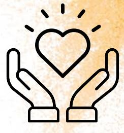

#### *Socialt ansvar*

Vi säkerställer schyssta villkor och goda arbetsförhållanden. Best har kollektivavtal för egen personal och krav på kollektivavtal hos underleverantörer.

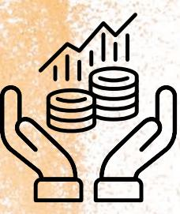

#### *Ekonomiskt ansvar*

Vi arbetar för att skapa en långsiktig ekonomisk utveckling för vårt företag, våra samarbetspartners, våra kunder och övriga intressenter.

Vår Head of CSR, **Jonas Wahlström**, leder vårt arbete med att säkerställa att vi tar ansvar för både människa och miljö.

*" " Under 2022 slutfördes Best Transports omställning till fossilfria leveranser i Sverige. En uppseendeväckande bedrift i transportbranschen! Jag vill här rikta ett stort tack och en eloge till våra anslutna åkerier.*

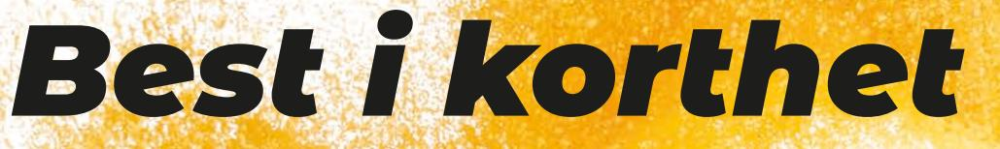

Vi är specialister på **snabba hållbara leveranser**. I vårt breda tjänsteutbud finns bland annat:

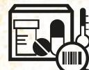

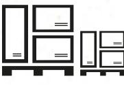

*Hållbarhet 2022*

Lokala bud Distribution Hemleveranser Boxleveranser IT-logistik GDP-transporter Lagring av gods

Sedan 1976 har Best Transport erbjudit små och stora företag prisvärda transportlöasningar. Idag är vi ett av Sveriges ledande företag inom snabba leveranser.

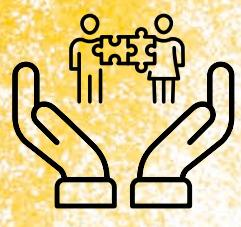

På Best är vi eniga om att mångfald är en nyckel till framgång. Olika erfarenheter och perspetiv hos våra medarbetare gör oss mer kreativa, dynamiska och effektiva. Vi har därför **jämlikhet, mångfald & inkludering** i fokus i vår organisation samt när vi rekryterar nya medarbetare.

*Vi arbetar enligt de etiska riktlinjerna i vår Code of Conduct*

Vår stora flotta består av budbilar samt lätta och tunga lastbilar.

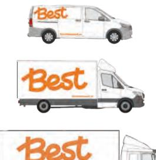

Best har över 8 500 aktiva företagskunder. I vår **B2B**-verksamhet har vi framförallt kunder inom branscherna healthcare, bygg, fordon och tillverkning. **B2C**-verksamheten riktar sig till företag inom e-handel och retail.

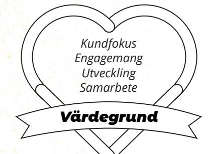

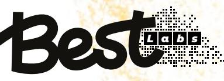

Genom vårt tech-dotterbolag **Best Labs** utvecklar vi nya innovativa tjänster inom sista milen-leveranser samtidigt som vi vidareutvecklar Europas mest avancerade trafik- och ruttoptimeringsteknologi.

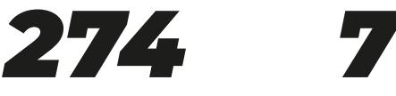

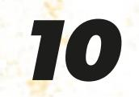

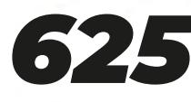

Fordon

Medarbetare Terminaler Trafikledningscentraler

Åkerier

Vi finns i **Stockholm, Göteborg, Malmö, Jönköping, Växjö, Oslo, Trondheim, Köpenhamn och Århus**. Via franchisetagare och samarbetspartners finns vi närvarande på ytterligare ett tjugotal orter. Det gör att vi kan finnas nära våra kunder och att vi kan erbjuda en nationell täckning med en lokal närvaro.

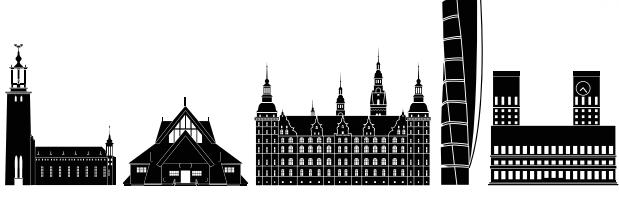

# *Hållbarhet 2022*

Vår **hållbarhetsvision** är att vi ska tillfredsställa dagens behov av snabba leveranser utan att äventyra framtiden för kommande generationer.

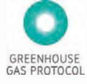

Best genomförde 2022 **klimatredovisning** enligt GHG-protokollet för Sverige, Norge och Danmark. Vid redovisningen inkluderades Scope 1, 2 & 3.

Hos oss finns visselblåsartjänsten **WhistleB**. Vi sänder kvartalsvis ut påminnelse till alla åkerier och chaufförer om möjlig-

heten att anonymt anmäla eventuella oegentligheter.

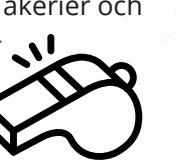

## Includer

Under 2022 gick våra svenska chefer Includers utbildning i **inkluderande** ledarskap och rekrytering. Includer

Includer

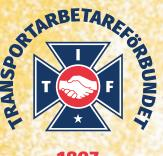

#### Vi har **krav på kollektivavtal**

hos anslutna åkerier med fler än fem resurser. För mindre åkerier har vi krav på kollektivavtalsmässiga villkor, vilket har

resulterat i att Svenska Transportarbetareförbundet rekommenderar våra leveranser.

Vi har medverkat i framtagandet av en branschöverenskommelse gällande fossilfria leveranser.

Tack vare vår nya vita fordonsprofil kan vi reducera mängden vinylfolie som används för foliering med 50-80% per fordon.

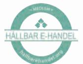

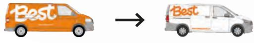

Våra chaufförer genomgår utbildning i grundläggande miljökunskap samt sparsam körning via vår utbildningsplattform Best Academy.

De etiska riktlinjer vi ska följa finns samlade i vår **Code of Conduct**. Den hjälper oss att agera korrekt och att fatta rätt beslut.

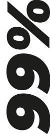

Drivmedelsanvändningen följs dagligen upp genom att samtliga tankningar registreras i vårt drivmedelsrapporteringssystem. Under 2022 var **över 99% av tankningarna fossilfria** i vår svenska verksamhet.

Vid våra terminaler i Sverige finns laddningsstolpar för elfordon alternativt tankanläggningar för HVO100. Includer

Best har **högsta kreditvärdighet** hos Bisnode.

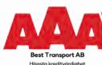

Ett kvitto på att vårt företag sköts ekonomiskt ansvarsfullt.

Vi har rutiner för att genomföra **löpande revisioner** av anslutna åkerier, helt i enlighet med vad som stipuleras i samtliga våra transportörsavtal. Genom vårt

**kontrollsystem** kontrollerar vi bland annat F-skatt, trafiktillstånd, godstillstånd, betalning av arbetsgivaravgifter och körkortsbehörighet.

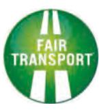

Best innehar transportbranschens hållbarhetscertifiering **Fair Transport**.

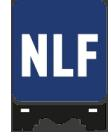

Under 2022 blev vi på Best medlemmar i **NLF** (Norges Lastebileier-Forbund).

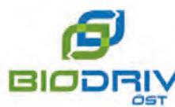

Medlemskapet i Biodriv gör är vi alltid uppdaterade kring politiska beslut som rör drivmedels- och fordonsfrågor.

Genom **BKY** kontrollerar vi körkort, trafiktillstånd samt godstillstånd.

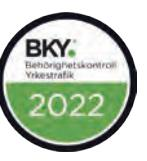

Vi är certifierade enligt Svensk Miljöbas & Svensk Kvalitetsbas via **SUSA** (Sustainable Standards).

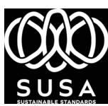

## *Globala målen & Best Transport*

Vår hållbarhetsvision och långsiktiga hållbarhetsplan är kopplade till de av FN fastställda globala hållbarhetsmålen. Följande globala mål fokuserar vi på:

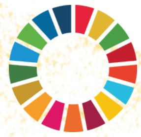

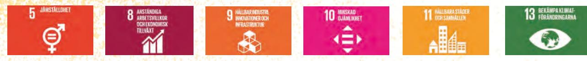

### **Agenda 2030**

I september 2015 antog världens stats- och regeringschefer en ny utvecklingsagenda och globala mål för hållbar utveckling. Agenda 2030 består av 17 globala mål för hållbar utveckling som syftar till att utrota fattigdom, stoppa klimatförändringar och skapa fredliga och trygga samhällen.

Världens ledare har lovat att uppnå de globala målen till år 2030. Alla länder har därmed tagit på sig ansvaret att skapa en mer rättvis, hållbar och bättre värld.

## **Sex globala mål**

Alla i samhället kan bidra till de globala målen på sitt sätt. Best Transport verkar i såväl den offentliga miljön, med leveranser till samhällsbärande funktioner, liksom i privata konsumenters närmiljö.

Vi har, utifrån våra förutsättningar att göra störst nytta, beslutat oss för att fokusera på sex globala mål: 5, 8, 9, 10, 11 och 13.

## *Hållbarhetsplan*

I vår hållbarhetsplan har vi identifierat för vår verksamhet relevanta globala delmål. Utifrån dessa har vi tagit fram hållbarhetsinitiativ och därtill kopplade hållbarhetsmål. Vår hållbarhetsplan kopplar på ett naturligt sätt ihop hela koncernens hållbarhetsarbete, ovidkommande av nationella skillnader.

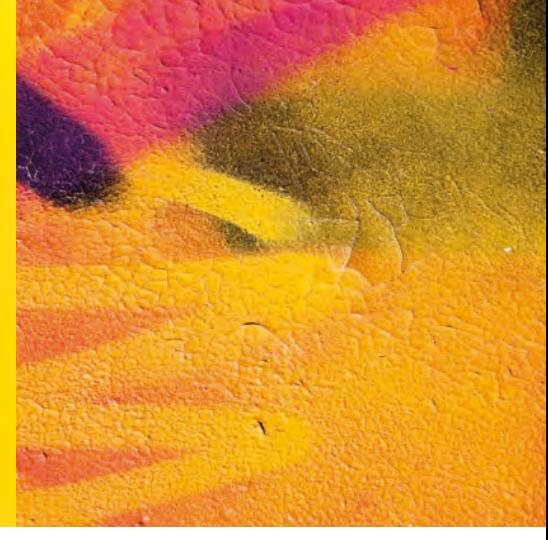

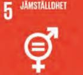

#### **Relevanta globala delmål Best hållbarhetsinitiativ Best hållbarhetsmål**

**5.5** Tillförsäkra kvinnor fullt och faktiskt deltagande och lika möjligheter till ledarskap på alla beslutsnivåer i det politiska, ekonomiska och offentliga livet.

Sträva efter jämställdhet mellan könen i hela verksamheten och vara ett föredöme i transportbranschen när det kommer till jämställdhet.

Att Best Transport är en lika självklar arbetsplats oavsett kön.

| Relevanta globala delmål                                                                                                                                                                                                                                                                                                          | Best hållbarhetsinitiativ                                                                                                                                                                                       | Best hållbarhetsmål                                                                                                                                                                                                                                                                                                             |
|-----------------------------------------------------------------------------------------------------------------------------------------------------------------------------------------------------------------------------------------------------------------------------------------------------------------------------------|-----------------------------------------------------------------------------------------------------------------------------------------------------------------------------------------------------------------|---------------------------------------------------------------------------------------------------------------------------------------------------------------------------------------------------------------------------------------------------------------------------------------------------------------------------------|
| 8.2 Uppnå högre ekonomisk produktivitet genom diversifiering, teknisk uppgradering och innovation, bland annat genom att foku sera på sektorer med högt förädlingsvärde och hög arbetsintensitet.                                                                                                                     | Genom lönsam tillväxt säkerställer vi framtida satsningar inom innovation, vilket ger oss förutsättningar för att fortsätta vara en hållbart växande arbetsplats.                                   | Stabil organisk ekonomisk tillväxt. Kontinuerlig expansion av geografi och tillförande av ny kompetens.                                                                                                                                                                                                             |
| 8.4 Fram till 2030 successivt förbättra den globala resurseffektiviteten i konsumtionen och produktionen samt sträva efter att bryta sambandet mellan ekonomisk tillväxt och miljöförstöring, i enlighet med det tioåriga ramverket för hållbar konsumtion och pro duktion, med de utvecklade länderna i täten. | Tillhandahålla det mest resurseffek tiva ruttoptimeringsverktyget baserat på ekonomiska likväl som miljömäs siga aspekter samt nyttjande av den för ändamålet mest resurseffektiva fordonstypen. | Kontinuerlig vidareutveckling av ruttoptimeringsverktyget för att säkerställa optimal rersurseffektivitet. Utveckla och implementera ett resursplaneringsverktyg för att säkerställa optimalt resursnyttjande. Identifiera fordonsalternativ för långsiktig ekonomisk och miljömässig hållbarhet. |
| 8.5 Senast 2030 uppnå full och produktiv sysselsättning med anständiga arbetsvillkor för alla kvinnor och män, inklusive ungdomar och personer med funktionsnedsättning, samt lika lön för likvärdigt arbete.                                                                                                         | Vi ska vara socialt ansvarstagande och säkerställa schyssta arbetsvillkor i hela leveranskedjan.                                                                                                          | Utarbeta tydliga riktlinjer och ramverk för säkerställande av schyssta arbetsvillkor.                                                                                                                                                                                                                                     |
| 8.8 Skydda arbetstagarnas rättigheter och främja en trygg och säker arbetsmiljö för alla arbetstagare, inklusive arbetskraftsinvand ring, i synnerhet kvinnliga migranter, och människor i otrygga anställningar.                                                                                                     | Att vara en trygg arbetsplats baserat på lagenliga anställnings villkor, rätt till föreningsfrihet och en trygg arbetsmiljö i enlighet med gällande lagstiftning.                                   | Best Transport ska alltid uppfylla våra åtaganden och skyldigheter som arbetsgivare.                                                                                                                                                                                                                                      |

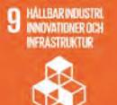

#### **Relevanta globala delmål Best hållbarhetsinitiativ Best hållbarhetsmål**

**9.4** Till 2030 rusta upp infrastrukturen och anpassa industrin för att göra dem hållbara, med effektivare resursanvändning och fler rena och miljövänliga tekniker och industriprocesser. Alla länder vidtar åtgärder i enlighet med sina respektive förutsättningar.

Med beslutsamhet uppnå Best Transports fastslagna hållbarhetsvision och genom innovativa lösningar fortsätta vara ett föredöme för branschens omställning till hållbara transporter.

Fossilfria transporter* i hela koncernen till år 2030.

* Godkända fossilfria drivmedel: el, HVO100, biogas, vätgas och FAME/RME.

| Relevanta globala delmål                                                                                                                                                                                                                                         | Best hållbarhetsinitiativ                                     | Best hållbarhetsmål                                                                                                                                                                               |
|------------------------------------------------------------------------------------------------------------------------------------------------------------------------------------------------------------------------------------------------------------------|---------------------------------------------------------------|---------------------------------------------------------------------------------------------------------------------------------------------------------------------------------------------------|
| 10.2 Till 2030 möjliggöra och verka för att alla människor, oavsett ålder, kön, funktionsned sättning, ras, etnicitet, ursprung, religion eller ekonomisk eller annan ställning, blir inklude rade i det sociala, ekonomiska och politiska livet. | Tillförsäkra mångfald och inkludering i hela verksamheten. | Att erbjuda alla anställda oberoende av ålder, kön, funktionsnedsättning, ras, etnicitet, ursprung, religion eller ekonomisk eller annan ställning en inkluderande arbetsplats. |

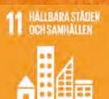

**11.6** Till 2030 minska städernas negativa miljöpåverkan per person, bland annat genom att ägna särskild uppmärksamhet åt luftkvalitet samt hantering av kommunalt och annat avfall.

#### **Relevanta globala delmål Best hållbarhetsinitiativ Best hållbarhetsmål**

Med beslutsamhet uppnå Best Transports fastslagna hållbarhetsvision och genom innovativa lösningar fortsätta vara ett föredöme för branschens omställning till hållbara transporter.

Reducera koncernens totala klimatpåverkan med minst 7% i genomsnitt per år fram till år 2030 (basår 2020, enligt GHG-rapporteringen).

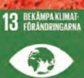

**13.2** Integrera klimatåtgärder i politik, strategier och planering på nationell nivå.

#### **Relevanta globala delmål Best hållbarhetsinitiativ Best hållbarhetsmål**

Agera i enlighet med internationella och nationella direktiv (för de marknader där Best Transport verkar) om åtgärder för att begränsa klimatförändringarna. Inkludera klimatåtgärder i strategiarbetet.

Implementera och efterleva miljöledningssystem.

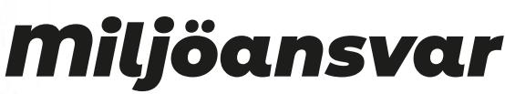

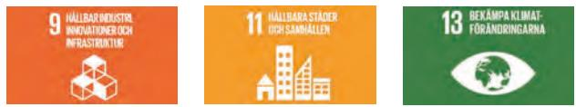

### **Klimatredovisning**

Best Transport utför, för våra kunders räkning, ett stort antal transporter varje dag. Best Transport genomförde 2022 klimatredovisning enligt GHG-protokollet för Sverige, Norge och Danmark. I klimatredovisningen för 2022 inkluderades Scope 1, 2 och 3.

Klimatredovisningen enligt GHG-protokollet visar att 88 procent av vår klimatpåverkan uppstår genom de transportuppdrag vi utför. Därför har vi fortsatt att fokusera på att ställa om fordonsflottan till förnybara drivmedel. Tabellen nedan visar förändring över perioden som Best Transport rapporterat enligt GHG-protokollet.

| Scope (ton CO2e) | 2020     | 2021     | 2022     | % av total 2022 | Förändring 2021-2022 | Förändring % 2021-2022 |
|---------------------|----------|----------|----------|--------------------|-------------------------|---------------------------|
| Scope 1             |          |          |          |                    |                         |                           |
| Danmark             | 481,60   | 507,10   | 386,60   | 8,20%              | -120,50                 | -23,80%                   |
| Norge               | 1 058,30 | 1 132,90 | 465,40   | 9,80%              | -667,50                 | -58,90%                   |
| Sverige             | 4 270,90 | 2 608,70 | 124,20   | 2,60%              | -2 484,60               | -95,20%                   |
| Totalt              | 5 810,80 | 4 248,70 | 976,20   | 20,60%             | -3 272,60               | -77,00%                   |
| Scope 2             |          |          |          |                    |                         |                           |
| Danmark             | 45,60    | 65,30    | 74,00    | 1,60%              | 8,70                    | 13,30%                    |
| Norge               | 4,70     | 0        | 34,80    | 0,70%              | 34,80                   | n/a                       |
| Sverige             | 324,40   | 72,90    | 98,20    | 2,10%              | 25,20                   | 34,60%                    |
| Totalt              | 374,70   | 138,20   | 207,00   | 4,40%              | 68,70                   | 49,70%                    |
| Scope 3             |          |          |          |                    |                         |                           |
| Danmark             | 149,00   | 75,00    | 534,00   | 11,30%             | 459,00                  | 612,30%                   |
| Norge               | 254,30   | 162,50   | 440,30   | 9,30%              | 277,80                  | 171,00%                   |
| Sverige             | 2 093,40 | 2 807,80 | 2 578,70 | 54,40%             | -229,20                 | -8,20%                    |
| Totalt              | 2 496,70 | 3 045,30 | 3 553,00 | 75,00%             | 507,90                  | 16,70%                    |
| Total               | 8 670,70 | 7 432,30 | 4 736,30 | 100,00%            | -2 696,00               | -36,30%                   |

*Tabell 1. Visar klimatpåverkan för Scope 1, 2 och 3 för respektive marknad och totalt.* 

## **Reducerad klimatpåverkan**

Under 2022 har de skett en dramatisk sänkning i Scope 1, vilket främst beror på att Best Transport ställt om hela den svenska verksamheten till fossilfria drivmedel (främst genom HVO100).

Vi ser dock en ökning av utsläpp i både Scope 2 & 3 som förklaras av utökade lokaler i Danmark och Göteborg (Scope 2) men även betydligt mer omfattande rapportering i Scope 3. Detta till trots har Best Transport åstadkommit en minskning av våra CO2-utsläpp med drygt 36 procent sedan 2021.

Tabellen visar även utsläppen per land. Detta åskådliggör hur fördelningen ser ut, men förklarar även varför vi prioriterat omställningen i Sverige som i nuläget är våran klart största marknad.

Att vi ser en ökning i Danmark beror främst på utökade systemgränser. Samma ökning ser vi i Scope 3 även i Norge men eftersom vi effektiviserat verksamheten och som en följd av detta minskat antalet fossila fordon har Norge ändå minskat sitt totala avtryck. Tack vare vårt enormt framgångsrika arbete med omställningen till fossilfria leveranser ligger nu nästan hela CO2-utsläppet i Sverige i Scope 3.

Totalt sett har Best Transport, sedan vi började klimatredovisa enligt GHG-protokollet år 2020, reducerat koncernens utsläpp med 45 procent. Tack vare våra tuffa hållbarhetskrav närmar vi oss, redan efter tre år, vårt långsiktiga mål att halvera koncernens CO2-avtryck till år 2030.

| KPI                              | 2020  | 2021  | 2022  | Förändring 2021-2022 | Förändring % 2021-2022 | Enhet       |
|----------------------------------|-------|-------|-------|-------------------------|---------------------------|-------------|
| Klimatpåverkan per anställd   | 31,34 | 25,90 | 17,29 | -8,61                   | -49,80%                   | t CO2e/FTE  |
| Klimatpåverkan per omsättning | 10,70 | 7,61  | 4,85  | -2,76                   | -57,00%                   | t CO2e/MSEK |

*Tabell 2. Nyckeltal för verksamhetens totala klimatpåverkan 2020 - 2022 med marknadsbaserad metod. Förändring sedan tidigare år redovisas både i ton C02e samt procentuellt.*

## **Miljöledningssystem**

Best Transport har sedan 2005 arbetat med Stockholms stads miljödiplom och uppfyller samtliga kriterier för Svensk Miljöbas. Under 2022 har vi arbetat enligt Svensk Miljöbas i vår svenska verksamhet och företaget har genomfört en miljöutredning där våra mest betydande miljöaspekter har kartlagts. Utifrån detta har vi formulerat miljöpolicy, mål och handlingsprogram. I april 2022 genomfördes en extern revision av Best Transports miljöledningssystem med framgångsrikt resultat.

Via verktyget lagpunkten.se håller vi oss uppdaterade gällande lagstiftning inom samtliga områden som berör vår verksamhet, såsom exempelvis miljölagstiftningen.

Under 2022 blev Best Transport medlemmar i Norges Lastbileier-Forbund (NLF). Via NLF kommer Best Transport i Norge att certifieras enligt ledningssystemet Fair Transport som bland annat har som mål att sänka utsläpp av miljö- och klimatgaser.

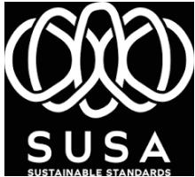

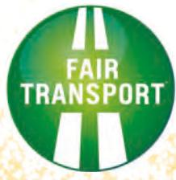

### **Fossilfria leveranser**

I Sverige slutfördes i början av 2022 omställningen till fossilfria drivmedel. Samtliga Best Transports cirka 530 egna fordon (eget ägda eller genom åkeriavtal) utför därmed fossilfria leveranser. För att nyttja fordon genom hela sin kvarvarande livslängd har befintliga dieselfordon ställt om till det förnybara drivmedlet HVO100.

Under året har Best Transport utvärderat ett flertal elfordon, allt ifrån elmoped till tung ellastbil. Utvärderingen har omfattat trafikledning och optimering likväl som laddnings- och räckviddsupplevelse för att säkerställa optimala investeringar i vår framtida emissionsfria fordonsflotta.

Under 2022 har Best Transport beslutat om hur verksamheten i Norge och Danmark långsiktigt ska arbeta för att säkerställa omställningen till fossilfria transporter. Vid utgången av 2022 var 25 procent av varubilarna i Norge elfordon.

### **Klimatkompensation**

Även om en transport utförs med fossilfria bränslen kan det fortfarande finnas en viss miljöpåverkan i tillverkningsprocessen av bränslet. För att fullt ut ta ansvar för den miljöpåverkan vår verksamhet har klimatkompenserar vi i samarbete med Atmoz.

Genom klimatkompensation stöttade Best Transport under 2022 den chilenska vindenergiparken Puntos Palmeras. Chile får idag 60% av sin energi från kol och gas, endast 10% kommer från förnybara energikällor. Genom Punto Palmeras tillförs fossilfri vindenergi till det chilenska elnätet, vilket förhindrar utsläpp av CO2.

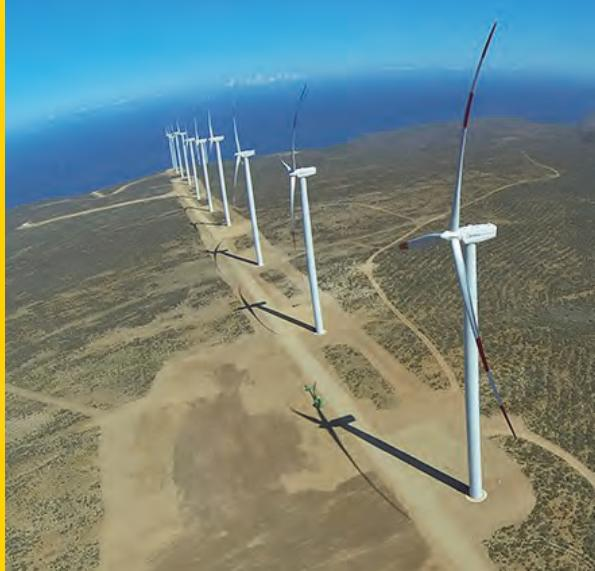

### **Drivmedelsrapportering**

Sedan 2020 använder Best Transport i Sverige ett system för drivmedelsrapportering. Vi får en drivmedelsrapport **vid varje laddnings- och tanktillfälle**. För att säkerställa att drivmedelsrapporteringen är korrekt genomför Best Transport regelbundet slumpmässiga stickprovskontroller. När vi sammanfattar 2022 kan vi konstatera att otroliga 99,23% av alla laddningar/tankningar var fossilfria!

Under hösten 2022 infördes även drivmedelsrapportering vid varje laddnings- och tanktillfälle även i Norge. Målet är att vi under 2023 ska införa drivmedelsrapporteringen i Danmark.

### **Best Box**

Under 2022 kompletterade vi våra snabba, bekväma och hållbara hemleveranser med Best Box – Sveriges mest bostadsnära och mest tillgängliga boxleveranser.

Tack vare paketskåpens placering i det offentliga rummet möjliggörs access 24/7 för både transportör och konsument. För Best Transport innebär det att leveranser kan ske även nattetid, något som avlastar logistiknätet framförallt i storstäderna.

## *Socialt ansvar*

#### **Medarbetare**

Best Transport är en platt och snabbfotad organisation och våra medarbetare är en av våra viktigaste tillgångar. Engagemanget för hållbarhet genomsyrar vår organisation och våra medarbetare medverkar aktivt till att vi ska uppnå våra högt uppsatta mål.

Under 2022 ökade den totala sjukfrånvaron i koncernen till 3,7% (jmf 3,3% år 2021). Långtidssjukfrånvaron ökade marginellt, medan korttidssjukfrånvaron sjönk.

Respekten för våra anställdas mänskliga rättigheter säkerställs genom kollektivavtal och flertalet policys och rutiner. Best Transport har kollektivavtal med Biltrafikens Arbetsgivareförbund. Rättigheter, men även medarbetares och chefers ansvar på arbetsplatsen, finns beskrivna i bl.a. arbetsmiljöhandboken, arbetsmiljöpolicyn, alkohol- och drogpolicyn och trafiksäkerhetspolicyn.

Inom ramen för ett "ärligt företagande" har Best Transports ställningstagande kring mutor och gåvor tydliggjorts i "Policy mot givande och tagande av muta".

Best Transports målsättning är att inga allvarliga arbetsplatsolyckor som innebär fara för liv och hälsa ska inträffa. Under 2022 rapporterades tolv arbetsmiljöhändelser, ingen av dessa var dödsfall.

På Best Transport råder nolltolerans mot diskriminering och kränkande särbehandling. Vi har en diskrimineringspolicy som tydligt konkretiserar ramarna. Skulle en medarbetare uppleva att denne blivit diskriminerad eller särbehandlad ska detta rapporteras till närmsta chef alternativt HR varefter åtgärder sätts in i enlighet med framtagna rutiner. På Best Transport har vi även en visselblåsartjänst där den anställde har möjlighet att rapportera oegentligheter helt anonymt.

I den medarbetarundersökning som genomfördes i september 2022 besvarade Best Transports medarbetare ett antal frågor kopplat till arbetsmiljön:

- 83% svarade att arbetsplatsen är trygg och säker.
- 82% svarade att hen behandlas med respekt på arbetsplatsen.
- 84% svarade att det inte finns trakasserier eller diskriminering på arbetsplatsen.

*Utöver vad som framgår i hållbarhetsredovisningen bedömer vi att det inte föreligger några ytterligare sociala risker.*

### **Code of Conduct**

Best Transport har samlat de etiska riktlinjer vi ska följa i vår Code of Conduct. Denna hjälper oss och våra underleverantörer att agera korrekt och att fatta rätt beslut.

Vår Code of Conduct behandlar affärsintegritet, mänskliga rättigheter & socialt ansvar, miljöansvar samt kundfokus & samarbete.

Samtliga medarbetare och chaufförer har, via Best Academy, fått tillgång till vår utbildning Code of Conduct. Bland våra medarbetare var genomförandegraden av utbildningen 93,4% och bland chaufförer 85,7%. Samtliga anslutna åkerier har signerat Best Transports Code of Conduct.

### **Best Transports värdegrund**

Värdegrunden är kärnan i vår identitet och en ledstjärna för vårt sätt att arbeta. Den utgår från vad vi anser är rätt och vad vi står för. Vår värdegrund består av fyra värdeord:

#### **Kundfokus**

Våra kunders behov styr hur vi arbetar och vad vi erbjuder. Vi är alltid uppmärksamma på vad som påverkar oss och våra kunders värld, vi agerar både genomtänkt och med fingertoppskänsla.

#### **Engagemang**

Intresse för våra kunder och vår affär genomsyrar alla led av vår verksamhet. Vi leder och tar initiativ, vi talar med trovärdighet och kunskap.

#### **Samarbete**

Tydlighet, ledarskap och gemenskap gör att alla medarbetare känner delaktighet och mening. Det skapar driv i vår organisation så att vi presterar på topp och tillsammans når våra mål.

#### **Utveckling**

Vi söker ständigt nya och bra lösningar. Genom att alltid sträva efter att bli bättre håller vi oss relevanta för kunder, medarbetare och samarbetspartners.

### **Mångfald, inkludering & jämlikhet**

På Best Transport är vi eniga om att mångfald är en nyckel till framgång och att vi får en mer utvecklande arbetsplats när vi som arbetar tillsammans har olika bakgrund och alla får komma till tals.

Vi arbetar aktivt och kontinuerligt med att säkerställa att våra medarbetare kommer till vår arbetsplats och får växa, ha kul – men framförallt att de får vara sig själva!

I den medarbetarundersökning som genomfördes i september 2022 besvarade Best Transports medarbetare ett par frågor som behandlar mångfald, inkludering och jämlikhet:

- 86% känner sig trygga med att prata om sin sociala och kulturella bakgrund på arbetsplatsen.
- 81% tycker att Best Transport erbjuder lika möjligheter för alla medarbetare oavsett kön eller social bakgrund.

Under hösten 2022 gick Best Transports chefer i Sverige Includers utbildning i inkluderande ledarskap och rekrytering. Utbildningen gav oss ytterligare kunskap om fördelarna med mångfald och breddad rekrytering för verksamheten samt hur vi alla kan agera än mer inkluderande i vår arbetsvardag. I utbildningen blandades teori och forskning med verklighetsnära exempel och scenarion där alla deltagare fick möjlighet att diskutera och reflektera.

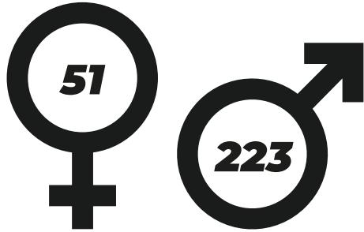

*Vid slutet av 2022 var vi 274 anställda i Best-koncernen. Av dessa var 51 st (18,6%) kvinnor och 223 st män. Andelen kvinnor i koncernen ökade under 2022 med ca 1% jmf med 2021.*

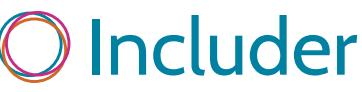

Includer

Includer

Includer

### **Best Academy**

För oss är det viktigt att förse medarbetare, anslutna åkerier och chaufförer med både kunskap och trygghet för att kunna göra ett bra jobb. I vår utbildningsportal Best Academy utbildar vi i allt från sparsam körning och grundläggande miljökunskap till Code of Conduct och Trevligt bemötande. I Stockholm, Göteborg och Malmö genomgår chaufförerna även en förarutbildning som innehåller alla praktiska moment som yrket innefattar. Uppföljning av genomförandegrad sker månatligen och presenteras för berörda parter.

Fastslaget utbildningsprogram omfattar:

- Sparsam körning
- Grundläggande miljökunskap
- Avvikelsehantering
- GDPR
- Code of Conduct
- GDP
- Trevligt bemötande
- Hemleveransutbildningar
- Kvittensutbildning
- ADR 1.3. (extern utbildning)

## **Åkeri & chaufför**

Under 2022 har Best Transport löpande genomfört revisioner av anslutna åkerier, helt i enlighet med vad som stipuleras i våra transportörsavtal. Genom vårt kontrollsystem har vi säkerställt avtalsefterlevnad och schyssta villkor hos våra anslutna åkerier. Kontrollsystemet innehåller bland annat kontroll av:

- F-skatt
- Betalning av arbetsgivaravgifter
- Trafiktillstånd
- Godstillstånd på varje fordon
- Körkortsbehörighet

Under året har samtliga nya åkerier som anslutit till Best Transports svenska verksamhet kollektivavtal. Kollektivavtalskravet har fortsatt gälla för befintliga åkerier med fler än fem resurser.

Best Transports visselblåsartjänst WhistleB är tillgänglig för anslutna åkerier och deras chaufförer som en potentiell väg att informera om eventuella avvikelser. Påminnelse om funktionen har under 2022 sänts ut kvartalsvis till samtliga chaufförer som kör uppdrag för Best Transport i den svenska verksamheten. Under 2022 har fyra ärenden inkommit via WhistleB, varav samtliga har hanterats enligt implementerade rutiner och processer.

Under 2022 blev Best Transport medlemmar i Norges Lastbileier-Forbund (NLF). Via NLF kommer Best Transport i Norge att certifieras enligt ledningssystemet Fair Transport som bland annat har som mål att stärka trafiksäkerheten och att säkerställa de sociala villkoren hos transportörer.

### **Svenska Transportarbetareförbundet rekommenderar Best Transport**

Vårt gedigna arbete inom socialt ansvarstagande kombinerat med kollektivavtalskravet har resulterat i att Svenska Transportarbetareförbundet rekommenderar leveranser med Best Transport. Vi finns med i deras förteckning över budbolag med schyssta leveranser.

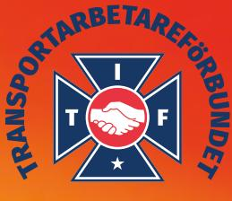

## *Ekonomiskt ansvar*

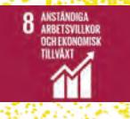

#### **Innovation & tech**

Sedan Best Transport startades har samordning och samtransport varit företagets ledstjärna för att korta ner transportsträckor och sänka bränsleförbrukningen. Optimering sker både genom praktiskt utförande liksom utveckling av trafikledning och ruttplanering.

Hos vårt tech-dotterbolag **Best Labs** utvecklar vi nya innovativa tjänster inom sista milen-leveranser samtidigt som vi vidareutvecklar Europas mest avancerade trafik- och ruttoptimeringsteknologi.

Under 2022 har tech-teamets fortsatt förbättringsarbetet av vår rutt- samt resursplanering. Vår satsning inom tech och systemutveckling ger ytterligare positiva klimateffekter i form av att samlastningsgraden och effektiviteten i vår fordonsflotta ökar, vilket i sin tur minskar bränsleförbrukningen och därmed de totala utsläppen.

#### **Införande av DMT**

Den 1 januari 2022 genomfördes en av de största prishöjningarna på drivmedel någonsin i Sverige. Främst berodde höjningen på den ökade reduktionsplikten, men även höjd skatt.

I Sverige, likväl som i Norge och Danmark, fortsatte drivmedelspriserna under det första kvartalet 2022 att stiga i rask takt till följd av kriget i Ukraina och oroligheter i vår omvärld. För Best Transport och hela transportbranschen fick de skyhöga drivmedelspriserna en direkt effekt på verksamheten.

För oss på Best Transport har det, trots den extraordinära prisutvecklingen på drivmedel, varit viktigt att fortsätta ha hållbarhet i fokus genom att erbjuda fossilfria leveranser till våra kunder. Samtidigt vilar

ett stort ansvar på oss där vi säkerställer en ekonomisk hållbarhet för våra underleverantörer och där vi tar socialt ansvar genom att se till att vi har schyssta villkor i alla led av vår verksamhet. Införandet av drivmedelstillägget (DMT) har under året fått en positiv effekt hos våra anslutna åkerier.

På grund av den höga prisnivån på drivmedel samt oförutsägbarheten i prisutvecklingen införde Best Transport i mars 2022 ett rörligt drivmedelstillägg. Under året har Best Transport fortsatt följa utvecklingen av drivmedelspriserna noga och hållit tät kontakt med bransch- och arbetsgivarorganisationen Transportföretagen likväl som intresseorganisationer såsom Sveriges Åkeriföretag och BioDriv.

Årsta 2023-03-07

**Niklas Knight** Group CEO, Best Transport

**Best Transport AB** 

Byängsgränd 5 120 40 Årsta Tel: 08 447 33 00 www.besttransport.se Group CEO: Niklas Knight Organisationsnummer: 556623-6278