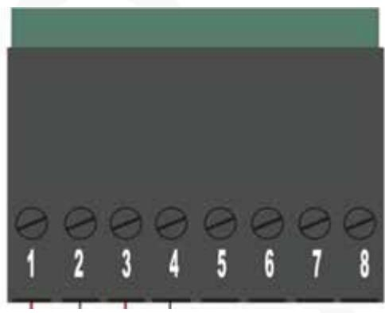
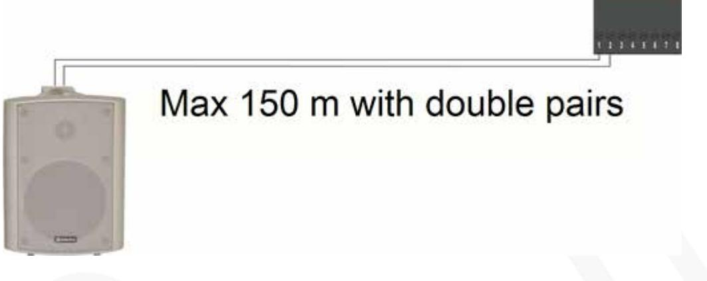
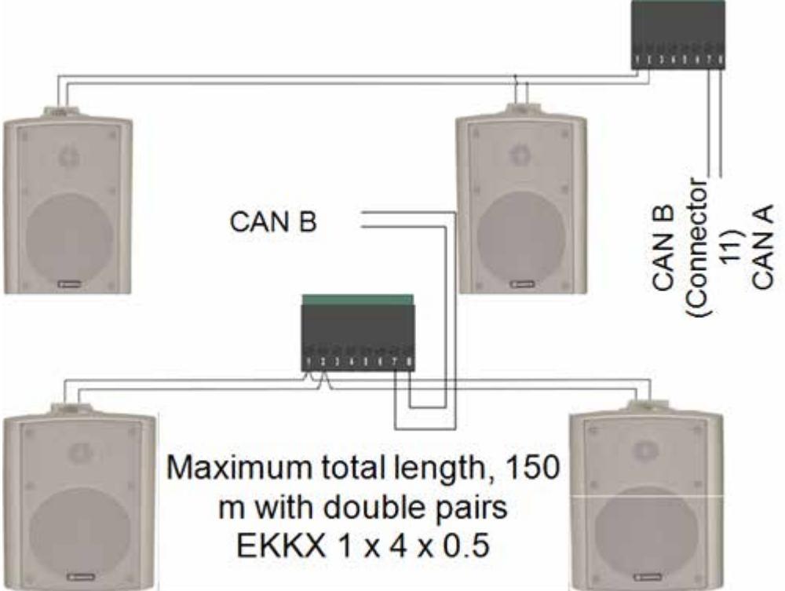

#### Connection instructions

Updated11/26/2020

# **Sound module C12, 2-3120**

Module to connect external speakers for spoken messages in VAKA.

### Introduction

C12 sound module is designed to give spoken messages when arming and disarming from VAKA. The C12 is equipped with a high-level output for driving passive speakers.

The messages that can be played are "Alarm activation started", "Alarm activation interrupted" and "The alarm is activated in ..." with countdown every full minute and the last 30 and 15 seconds.

Rev. 1 and 2 are used with B26. Rev. 3 is used with B27. Rev. 4 is used with B27 or B28.

## Connection

| Connector Function |                                                                                        | Cable                                                                                                                                             |
|--------------------|----------------------------------------------------------------------------------------|---------------------------------------------------------------------------------------------------------------------------------------------------|
| 1-2                | High level output for passive speakers. 3 W 4-8 Ω. 1 is negative and 2 is positive. | Noin twisted cable, 2 x 0.75 mm2, max 200 m. Cat. 5/6, 1 pair for each pole, max 150 m. Double pairs EKKX, 1 x 4 x 0.5, max 150 m. |
| 7                  | Connects to CAN bus B (Terminal 11 at the door controller)                          | Same cable as between door controller and reader.                                                                                              |
| 8                  | Connects to CAN bus B (Terminal 11 at the door controller)                          | Same cable as between door controller and reader.                                                                                              |

# Connection examples and cable lengths

#### High level with one speaker

#### High level with two speakers

### Commissioning

- 1. Power off the controller.
- 2. Mount the module at any module location in the door controller.
- 3. Install the supplied terminal below the module and power up the controller.

# Installation and configuration

This manual only deals with the assembly and connection of the unit.

For configuration of C12, see the sectionVolume settings in the commissioning manual. (https://info.axema.se?commissioning)