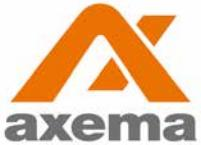
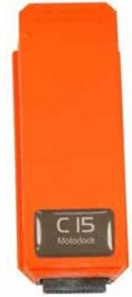

# Data Sheet

Updated 2018-11-17

# C15 Motor Lock Module Safetron

C15 replaces the original motor lock controller.

# Functions and application

- l C15 replaces the original Safetron motor lock controller and allows for a tidy installation with less boxes mounted on the wall.
- l Automatic configuration of quick configurations of the motor lock functions.
- l Easy and cost effective.

# Technical Data

| Attributes     | C15                  |  |
|----------------|----------------------|--|
| Housing        | Plastic              |  |
| Power Supply   | From door controller |  |
| Temperature    | 0° to + 55°C         |  |
| Article number | 2-3150               |  |
| E number       | E5877472             |  |

### C40 VAKA motor lock 5150 (complete kit)

| Article number | 2-3400   |
|----------------|----------|
| E number       | E5866900 |

#### C41 VAKA motorlock 5250 H with drop bolt (complete kit)

Article number 2-3410 E number E5866901

#### C42 VAKA motorlock 5250 V with drop bolt (complete kit)

| Article number | 2-3420   |
|----------------|----------|
| E number       | E5866902 |

#### C46 VAKA motor lock 5328 slim with hook bolt (complete kit)

Article number 2-3460 E number E5866903