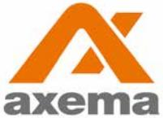
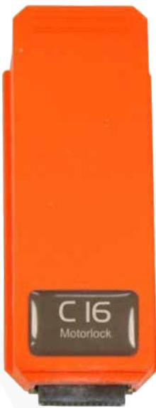

# Data Sheet

Updated 2018-11-17

# C16 Motor Lock Module ASSA

C16 replaces the original controller in the Hi-O 840C- and 850C series of ASSA motor locks.

# Functions and application

- l C16 replaces the original ASSA motor lock controller and allows for a tidy installation.
- l C16 is an easy and cost effective solution with automatic configuration of the motor lock's functions.

# Technical Data

| Attributes     | C16                  |
|----------------|----------------------|
| Housing        | Plastic              |
| Power Supply   | From door controller |
| Temperature    | 0° to + 55°C         |
| Article number | 2-3160               |
| E number       | E5870723             |

### ASSA motor lock 841C-50 VAKA

| Article number | 2-3700   |
|----------------|----------|
| E number       | E5870747 |

### ASSA motorlock 840C-50 VAKA with drop bolt

| Article number | 2-3710   |
|----------------|----------|
| E number       | E5870748 |

### ASSA motor lock 841C-35 VAKA slim

| Article number | 2-3720   |
|----------------|----------|
| E number       | E5870749 |