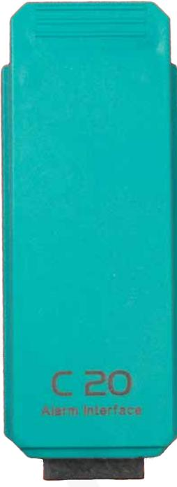
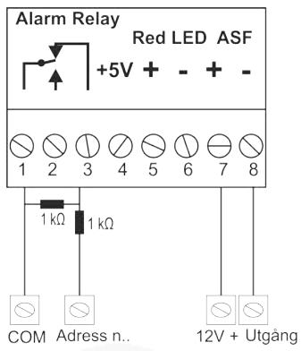
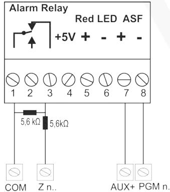
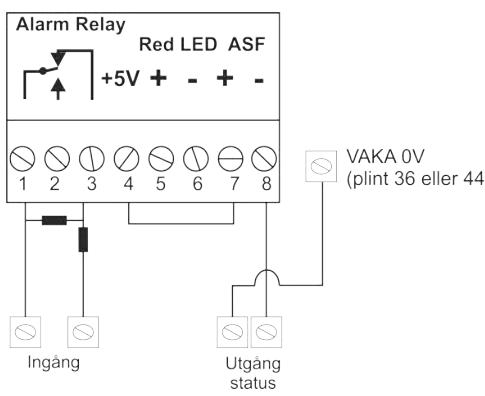

### Connection instructions

Updated11/26/2020

# **Alarm module C20, 2-3220**

Alarm module C20 is used to control an external alarm system with Axema VAKA.

### Connection

- 1. Power off the controller.
- 2. Mount the module at any module location in the door controller.
- 3. Install the supplied terminal below the module and power up the controller.
- 4. Power up the controller.

### Terminal description

| Connector | Function                                                                    |
|-----------|-----------------------------------------------------------------------------|
| 1         | Alarm relay (C)                                                             |
| 2         | Alarm relay (NO)                                                            |
| 3         | Alarm relay (NC)                                                            |
| 4         | 5 V 20 mA output. Useful in some ASF applications (See terminals 7 & 8)     |
| 5         | Red LED +                                                                   |
| 6         | RED LED -                                                                   |
| 7 & 8     | ASF input for feedback from the intrusion system ON / OFF status, 5V-24VDC. |
|           | If the ASF signal from the alarm panel is a voltage exceeding Important: |
|           | 12V, Axema recommends mounting a serial resistor (4.7kOhm) on the plus      |
|           | side. This is to minimize power consumption of the alarm panel.             |

#### ASF tips

If the ASF signal from the control panel is a closing contact, connect terminals 4 to 7 in the C20 terminal, 8 in the C20 terminal to one status pole in the alarm panel, and the other status pole in the alarm panel to 36 or 44 (0V) in B28

## Connection of third-party alarm system with C20

### Axema VAKA C20 and Galaxy

### Axema VAKA C20 and Teletec

#### C20 and intrusion panels with potential-free relay switching for alarm status

# Installation and configuration

This manual only covers the installation and connection of the unit.