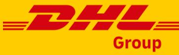
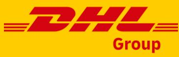
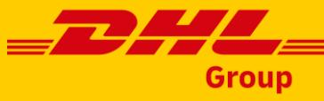

# CLEAN OPERATIONS FOR CLIMATE PROTECTION

DHL GROUP ENVIRONMENTAL AND ENERGY POLICY

Version 2.0 (July 2023) – Public

# CONTENT

| 1 | Purpose of this Policy and its Commitments 1 |    |
|---|-------------------------------------------------|----|
| 2 | Group Environmental Targets 3                |    |
| 3 | Clean Operations Roadmap and Measures 4      |    |
| 4 | Collaboration across the Value Chain 6       |    |
| 5 | ESG Reporting and Controlling 9              |    |
| 6 | Governance for Environmental Topics 9        |    |
| 7 | Policy Communication and Review                 | 10 |

# 1 PURPOSE OF THIS POLICY AND ITS COMMITMENTS

This Environmental and Energy Policy statement describes DHL Group's approach to environmental and energy management and applies to all global operations and business activities.

DHL Group is the world's leading mail and logistics group. In linking the world through the transport of goods and information, we facilitate economic growth and the creation of wealth. Leadership for us includes being a leader in terms of environmental protection - a key component of our business strategy which also focuses on achieving net zero logistics-related emissions by 2050.

We conduct our business in accordance with applicable laws and high ethical, social and environmental standards. These are fully anchored for the entire Group in our **@** Code of Conduct for employees, and in the **@** Supplier Code of Conduct for our suppliers and subcontractors.

Due to the nature of our core businesses, the primary focus of our efforts is on our greenhouse gas emissions and climate protection. However, our sustainability roadmap and Clean Operations program also covers a broad range of aspects such as energy, waste and local pollution.

We are committed to minimizing our impact on the environment and preventing pollution in all our activities by implementing an effective environmental and energy management system (according to ISO 14001 / ISO 50001) to continually improve our environmental and energy performance and to comply with applicable legal and other requirements.

Our goal is to offer sustainable solutions to our customers, and to operate an environmentally sustainable and energy efficient network through consideration of performance improvements in design and modification of facilities and transport infrastructure, and processes. We will achieve this goal by ensuring the availability of information and deploying necessary resources and connecting with our employees, customers, and other key stakeholders.

This Environmental and Energy Policy is binding for all operations, business activities and companies within DHL Group. It will help us to embed environmental and energy management topics into our business, thus helping us realize our stakeholders' expectations when it comes to sustainability performance and the decarbonization of our operations.

As an organization headquartered in the European Union, DHL Group is in scope of the European Union's Corporate Sustainability Reporting Directive (CSRD). Therefore, this

policy has been developed under consideration of the first set of the European Union's upcoming European Sustainability Reporting Standards (ESRS) as approved by the EFRAG Sustainability Reporting Board and submitted to the European Commission in November 2022. References to the corresponding ESRS principles are added in the document with the following symbol: .

This policy does not stand in isolation but is accompanied by other internal policies and guidelines on environmental topics at DHL Group. References to these policies are indicated in the document with the following symbol: @.

Bonn, June 2023

**Dr. Tobias Meyer** Chairman of the Board **Nikola Hagleitner** Post & Parcel Germany **John Pearson** Express

**Oscar de Bok** Supply Chain

**Melanie Kreis** Chief Financial Officer **Tim Scharwath** Global Forwarding, Freight

**Pablo Ciano** eCommerce Solutions **Dr. Thomas Ogilvie** Human Resources

# 2 GROUP ENVIRONMENTAL TARGETS

By transforming our business towards Clean Operations, we strive to achieve net zero emissions by 2050. We have set new, ambitious targets to be achieved by 2030. These targets cover our own emissions (Scope 1 & 2) as well as emissions from transport services provided by our subcontractors (Scope 3).

Particularly important for achieving these goals by 2030 are planned decarbonization measures, for which we plan additional expenditures of up to €7 billion. These cover the increasing use of sustainable technologies and fuels in our fleets and buildings. Our efforts reflect in a range of environmentally friendly products that allow our customers to actively participate in our decarbonization journey.

# 2.1 SCIENCE-BASED TARGET FOR GREENHOUSE GAS EMISSION REDUCTION BY 2030

Our 2030 target is to reduce the Group's overall Scope 1, 2 and transport-related Scope 3 greenhouse gas emissions to below 29 million tonnes CO2e. This target has been developed based on the requirements of the Science-Based Targets initiative (SBTi) and supports global efforts to limit global warming in line with the United Nations' Paris Agreement. The following sub-targets have been validated by SBTi in October 2022:

#### Target for Scopes 1 & 2:

DHL Group commits to reduce absolute Scopes 1 & 2 GHG emissions 42 % by 2030 from a 2021 base year. This sub-target is in line with requirements to limit global warming to below 1.5 degrees Celsius.

### Target for Scope 3:

DHL Group commits to reduce absolute Scope 3 GHG emissions from fuel- and energyrelated activities, upstream transportation and distribution and business travel 25 % by 2030 from a 2021 base year. This sub-target is in line with requirements to limit global warming to well-below two degrees Celsius.

Both sub-targets have been developed under consideration of a business-as-usual growth scenario for our operations until 2030.

### 2.2 NET-ZERO TARGET "MISSION 2050"

Our long-term objective is to reduce our GHG emissions to net zero by 2050. That means we will implement active decarbonization measures to reduce our GHG emissions (Scopes 1, 2 and 3) down to an unavoidable minimum, which is to be fully compensated for with countermeasures recognized by external standards (excluding offsetting).

# 3 CLEAN OPERATIONS ROADMAP AND MEASURES

Our environmental targets can only be achieved if we implement, steer and monitor a clear roadmap of decarbonization measures. Therefore, we have defined a transition plan with key performance indicators (KPIs) for all our business activities that we strive to achieve by 2030. In addition to these KPIs, we have identified a number of efficiency measures that will help us to reduce energy consumption across the Group.

# 3.1 SUSTAINABLE AVIATION

Aviation is the largest source of greenhouse gas emissions in our business and therefore the area where we must invest time and resources to improving the most. Sustainable Aviation Fuels (SAF) offer a viable alternative to fossil fuels for powering commercial aircraft with significant potential to reduce aviation's greenhouse gas emissions. To achieve this reduction, we focus on the following measures:

- **Main Focus – Sustainable Aviation Fuel (SAF) blending:** > 30 % SAF blending for air transport by 2030 on Group average, and strategic partnerships with producers and carriers to secure sufficient and cost-effective SAF supply; the details of our approach to purchasing sustainable fuels are outlined in DPDHL's **@** Sustainable Fuel Policy.
- **Re-fleeting:** Continue to invest in the latest technology of most fuel-efficient, SAF capable, and alternative power solution assets available in the industry
- **Fuel optimization:** Improve flight operations efficiency by utilizing technology, ideal weight balance, and optimized network design and choosing efficient carriers
- **Drive innovation:** Support innovative technologies like the development of electric aircraft and ready to scale Power-to-Liquid SAF plants
- **Decarbonize our ground handling:** Use electrification and hydrogen technology to drive down emissions of ground operations at our major hubs

# 3.2 SUSTAINABLE OCEAN FREIGHT

In ocean freight, we exclusively act as a freight forwarder and do not operate any own vessels. Therefore, all GHG emissions from ocean freight are part of our Scope 3 footprint. In order to decarbonize, close collaboration with our carriers is required. To achieve this, we focus on the following measures:

- **Main Focus – Sustainable Marine Fuel (SMF) blending:** > 30 % SMF blending for ocean freight transport by 2030, strategic partnerships with producers and carriers to secure sufficient and cost-effective SMF supply; the details of our approach to purchasing sustainable fuels are outlined in DPDHL's **@** Sustainable Fuel Policy.

- **Network optimization:** Reduce greenhouse gas emissions through permanent network improvements
- **Strategic industry partnerships:** Foster technological and process developments for promising future technologies like Ammonia and Methanol within the industry through strategic partnerships throughout the whole value chain

### 3.3 SUSTAINABLE LINEHAUL ROAD FREIGHT AND LAST-MILE DELIVERY

To ensure excellence in our deliveries to our customers, we have initiated steps to make our last-mile delivery and line-hauls green, in close collaboration with our subcontractors in this area. To achieve decarbonization, we focus on the following measures:

- **Main Focus – Electrification of pick-up and delivery fleet:** Electrify 60 % of our lastmile delivery vehicles by 2030.
- **Main Focus – Sustainable Road Fuels & Technologies:** Grow sustainable fuel share to > 30 % by 2030 on Group average; the details of our approach to purchasing sustainable fuels are outlined in DPDHL's **@** Sustainable Fuel Policy
- **Fuel Optimization:** Reduce fuel use through permanent network improvements
- **Innovation:** Promote development and availability of hydrogen and electric trucks
- **Behavior change:** Enable employee contribution through ecofriendly driving training

### 3.4 CARBON NEUTRAL BUILDINGS

Being the most international company in the world with operations in over 220 countries and territories, we use a considerable network of physical assets including warehouses, sorting centers, hubs, terminals and office buildings. We aim to leverage the latest green technologies to have carbon neutral buildings across our businesses worldwide. To achieve this, we focus on the following measures:

- **Main Focus – Carbon neutral design:** Since 2021, we apply a carbon neutral design to all new buildings, as well as to strategic existing buildings; to the remainder of our portfolio we will apply low carbon levers as feasible.
- **Green electricity:** Keep high share of green electricity at above 90 % until 2030 and focus on direct energy generation or procurement from sustainable sources; the details of our approach to purchasing green electricity are outlined in DPDHL's **@** Green Electricity Guidance.

- **Sustainable heating:** Foster roll-out of sustainable heating of our buildings through heat pumps and sustainable fuels; the details of our approach to purchasing sustainable fuels are outlined in DPDHL's **@** Sustainable Fuel Policy
- **Sector coupling:** Convert locally produced renewable electricity (e.g. solar power) into fuels for our fleet, using either electricity directly or e-fuels
- **Digitalization:** Use intelligent, digital building management systems to further reduce energy consumption
- **Sustainable construction:** Fostering the use of alternative construction materials, to reduce embedded carbon

# 3.5 GREEN PACKAGING

Packaging is an essential part of our commercial offer as it helps to protect the goods we transport across our logistics and supply chain operations. Although there are many good reasons for the use of packaging in the logistics industry, we are conscious of the potential harm these products can have on the planet.

For the packaging categories that are mostly used in our operations (void fill, shipping labels, tape, mailing bags, pallet wrap, cardboard boxes), our **@** Green Packaging Standards set out the following aspirations:

- **Paper Packaging:** Use paper that is recycled, mixed or from sustainable forestry in accordance with **@** DPDHL Paper Policy
- **Plastic packaging:** Use a minimum of 30 % certified renewable material (recycled and/or bio-based) for shipping labels, tape and pallet wrap, and a minimum of 50 % of such certified material for void fill material and mailing bags

In addition, the **@** Green Packaging Principles provide overall guidance. By minimizing the material consumption in general, optimizing the use of single-use packaging and replacing it by reusable solutions where beneficial, we want to enable the lowest environmental packaging footprint possible and avoid waste across the Group.

# 4 COLLABORATION ACROSS THE VALUE CHAIN

ESRS E1-4

# 4.1 COLLABORATION WITH TRANSPORT PARTNERS AND SUPPLIERS

Our calculations of scope 3 emissions and our decarbonization targets include emissions from our transport partners (subcontractors), who generate approximately 80% of our overall greenhouse gas emissions. This requires collaboration – only through working together will we be able to achieve our goals. How we make that happen:

- **Subcontractor Management:** We have a comprehensive subcontractor management system and include environmental performance among our subcontractor selection criteria; in line with our **@** Supplier Code of Conduct
- **Green Carrier Certification:** We introduced a certification scheme for the sustainability performance of our carriers which helps to identify subcontractors that are already contributing to sustainable logistics, while encouraging even more investment in green technologies to reduce our own as well as our carriers' and our customers' carbon footprint

## 4.2 COLLABORATION WITH TECHNOLOGY PROVIDERS

We support innovation and the testing and scaling of new technologies by collaborating with manufacturers, technology providers and start-ups in the field of sustainable logistics. This collaboration includes:

- **Sustainable Road Technology Pilots:** We collaborate with manufacturers in piloting and advancing innovative technologies, e.g., the operation of Bio-LNG/CNG, hydrogen or electric heavy-duty trucks
- **Sustainable Aviation**: We support innovative technologies like the development of electric aircraft and ready to scale Power-to-Liquid SAF plants

# 4.3 COLLABORATION WITH CUSTOMERS

Reducing the carbon footprint of our own operations and setting the highest social and governance standards is essential and a significant contribution towards a sustainable world. But our impact will be even greater if we join forces with our customers.

Our commitment is to offer the most comprehensive portfolio of green products and solutions in the industry. How we make that happen:

### 4.3.1 GREEN PRODUCTS

We offer green alternatives for all our main products and services. There are two main categories, GoGreen Plus and GoGreen. The details of our approach to providing green products are outlined in DPDHL's **@** Green Product Guideline.

- **GoGreen Plus Products:** Offer decarbonized alternatives for all our core products using sustainable fuels and low carbon technology, facilitated by insetting / book & claim; these products are based on reduction measures implemented within our value chain and contribute to the decarbonization of logistics
- **GoGreen Products:** Compensate carbon emissions through highest quality certified climate protection projects outside our value chain according to our **@** Carbon

Credits Standard Guidelines (e.g. GoldStandard) on behalf of our customers; the reductions from compensation are neither included in our Group GHG emission footprint nor do they contribute to the achievement of our Science-based Target

### 4.3.2 OPTIMIZATION INITIATIVES

In addition to our green products, we support the reduction of our customers' carbon footprint through targeted optimization measures in dedicated customer operations.

- **Green Optimization:** Avoid carbon emissions through optimized supply chain design and energy efficient technology
- **Circular Economy:** Reduce material, energy and waste through sustainable packaging, recycling and waste management solutions
- **Transparency:** Extend our digital customer carbon reporting capabilities to provide better transparency and data access to more customers
- **Collaboration for innovation:** Partner with customers to share best practices and jointly develop industry-leading solutions, continue to drive innovations and adopt new technologies to enhance our green product and solution portfolio

#### 4.4 ENGAGEMENT WITH INDUSTRY INITIATIVES & POLICY MAKERS ESRS E1-2

Partnerships with national and international organizations and engagement with public stakeholders are of strategic importance for our company. The exchange that ensues from these alliances has a significant impact on the success of our efforts in the area of sustainability.

- **Industry & Certification Initiatives:** We shape decarbonization initiatives together with subcontractors, customers, and peers, allowing us to advance consumption and emissions data necessary for effective subcontractor management – to this end, we participate in programs such as the Global Logistics Emissions Council (GLEC) and the United States Environmental Protection Agency's SmartWay program. To accelerate the transition towards sustainable fuel uptake we are members with the International Sustainability and Carbon Certification (ISCC) and Roundtable for Sustainable Biomaterial (RSB), we also work with Aireg (Aviation Initiative for Renewable Energy in Germany) and other initiatives
- **Policy Makers:** The Corporate Public Affairs department represents the Group vis-àvis political stakeholders and introduces the interests of the company into political decision-making processes on environmental topics; exchange with external stakeholders takes place both bilaterally as well as via organizations such as associations and foundations

# 5 ESG REPORTING AND CONTROLLING

#### ESRS GOV 1

We calculate our greenhouse gas emissions according to the internationally recognized Greenhouse Gas Protocol Corporate Standard and in accordance with the requirements of the European Emissions Trading System (EU ETS), the ISO 14083 and the ISO 14064 standards. We also follow the accounting methodology of the Global Logistics Emission Council (GLEC).

Our greenhouse gas emissions reflect the full lifecycle of the fuels and energy used; they are reported as well-to-wheel emissions.

The reporting of emissions from our own sources (Scope 1) and from energy supply (Scope 2) is linked to our financial accounting and reporting system. In this way, we can capture CO2-relevant consumption data (fuel, kerosene and energy consumption of our own fleet and buildings) via our financial systems and directly link it to our expense data for validation purposes.

For Scope 3 emissions, we have developed a staged method framework, which uses primary data where available from our large cooperation partners, and model based calculations based on operational data, such as shipments' weights, distances and types of vehicles and fuels; for residual categories models based on economic parameters can be applied.

The Corporate ESG Reporting and Controlling department is responsible for the measurement and reporting of DPDHL Group's greenhouse gas emissions, the progress toward the group's ESG ambitions and regulatory requirements. This includes the measurement of environmental, social and governance related data as well as the reporting of the same to internal and external stakeholders. Detailed descriptions of key performance indicators and reporting approaches are outlined in the **@** ESG Reporting Guideline and **@** Carbon Accounting Reporting Instructions documents.

# 6 GOVERNANCE FOR ENVIRONMENTAL TOPICS

#### ESRS E1-1, 1-4 ESRS GOV1&2

The responsibility for environmental standards of DHL Group is managed centrally at Board level, while the divisions are responsible for aligning customer requirements with our strategic, ethical, and environmental principles.

The **Board of Management** is the central decision maker on Group-wide sustainability topics, whereas the divisions are responsible for implementation. 30 % of the Board of Management's annual bonus is linked to the achievement of our sustainability targets.

The **Sustainability Steering Board** manages the ESG (Environment, Social and Governance) agenda of DPDHL Group. Composition of the Board: CEO (Chair), CFO, Board Member Human Resources, Executive Vice Presidents Corporate Development,

Corporate Communications, Investor Relations and Corporate Accounting & Controlling as well as divisional Business Sustainability Officers.

The **Operations Board** is chaired by the CEO and steers the implementation of environmental topics and related decarbonization measures. The corporate and divisional Clean Operations teams prepare decisions on strategic direction. Because of its member composition, the Operations Board can make effective decisions that can be implemented directly in our operations. With regard to environment, the Operations Board, for example, reviews the development of CO2e emissions and efficiency data, monitors the business units' progress towards achieving targets, and develops climatechange related strategy, policies and programs.

The **Chief Financial Officer** holds overall responsibility over ESG monitoring, controlling and reporting including our internal controls and risk management process. If risks or opportunities are identified, the finance organization is responsible for assessing them and to give recommendations on how to manage them.

The **Global Commercial Board** is chaired by the CEO of DHL Express and responsible Board member for Customer Solutions & Innovation and steers the strategic decisions on the commercialization of our sustainable products and solutions for customers.

The **Corporate Procurement** team under leadership of our Chief Procurement Officer is responsible for establishing group-wide standards for sustainable procurement, which includes the requirement of embedding the **@** Supplier Code of Conduct in contractual relationships with suppliers.

In addition, the external **Sustainability Advisory Council** comprising advisors from the scientific community, business, and government and administration, provides external perspectives and advice on sustainability topics for the Group.

# 7 POLICY COMMUNICATION AND REVIEW

ESRS DC-T

This policy will be communicated to employees via internal communication channels, and will be made available to all other interested parties via our corporate website www.dpdhl.com. Environmental policies for all companies within DHL Group shall be aligned with this Group policy. This Environmental Policy, including its objectives and targets, will be reviewed on a regular basis.

For further information, please contact the Clean Operations Office team [(Department](https://dpdhl.sharepoint.com/sites/Clean-Operations-Hub?xsdata=MDV8MDF8fDFkZmFjZWZjYzhiYzQ5NGIzMzg5MDhkYjUxNTQ0NGUxfGNkOTlmZWY4MWNkMzRhMmE5YmRmMTU1MzExODFkNjVlfDB8MHw2MzgxOTMxOTQ1Nzc3NjkzNTN8VW5rbm93bnxWR1ZoYlhOVFpXTjFjbWwwZVZObGNuWnBZMlY4ZXlKV0lqb2lNQzR3TGpBd01EQWlMQ0pRSWpvaVYybHVNeklpTENKQlRpSTZJazkwYUdWeUlpd2lWMVFpT2pFeGZRPT18MXxNVFk0TXpjeU1qWTFOekE0TmpzeE5qZ3pOekl5TmpVM01EZzJPekU1T2pCbU4yVTVNREkzTFRFeVkySXROR0k1T1MwNFlqYzJMV1ptTmpObU1UUXdaV0ZpWTE5aVlqZ3dNekZsWWkwM1lUY3pMVFF3TnpBdE9HTTBNaTFpWVdZMVlXRmpZbVJtWWpKQWRXNXhMbWRpYkM1emNHRmpaWE09fGRiNGYyNTgwNzk3ZDQ5NTczMzg5MDhkYjUxNTQ0NGUxfDM5OTQ5MWU3YzA0YzQ0NzFhZTliMGQ4OWFhM2JjNmEy&sdata=R3Q3TWRHbVZ4WWZwUXhSRXZpd3Z1NXhaS3ZOZzFBMlpudnB2MEZBZGNvND0%3D&ovuser=cd99fef8-1cd3-4a2a-9bdf-15531181d65e%2Cnicolle.chen%40dpdhl.com&OR=Teams-HL&CT=1683722662110&clickparams=eyJBcHBOYW1lIjoiVGVhbXMtRGVza3RvcCIsIkFwcFZlcnNpb24iOiIyNy8yMzA0MDIwMjcwNSIsIkhhc0ZlZGVyYXRlZFVzZXIiOmZhbHNlfQ%3D%3D)  [CD032 Strategy & Operations Programs)](https://dpdhl.sharepoint.com/sites/Clean-Operations-Hub?xsdata=MDV8MDF8fDFkZmFjZWZjYzhiYzQ5NGIzMzg5MDhkYjUxNTQ0NGUxfGNkOTlmZWY4MWNkMzRhMmE5YmRmMTU1MzExODFkNjVlfDB8MHw2MzgxOTMxOTQ1Nzc3NjkzNTN8VW5rbm93bnxWR1ZoYlhOVFpXTjFjbWwwZVZObGNuWnBZMlY4ZXlKV0lqb2lNQzR3TGpBd01EQWlMQ0pRSWpvaVYybHVNeklpTENKQlRpSTZJazkwYUdWeUlpd2lWMVFpT2pFeGZRPT18MXxNVFk0TXpjeU1qWTFOekE0TmpzeE5qZ3pOekl5TmpVM01EZzJPekU1T2pCbU4yVTVNREkzTFRFeVkySXROR0k1T1MwNFlqYzJMV1ptTmpObU1UUXdaV0ZpWTE5aVlqZ3dNekZsWWkwM1lUY3pMVFF3TnpBdE9HTTBNaTFpWVdZMVlXRmpZbVJtWWpKQWRXNXhMbWRpYkM1emNHRmpaWE09fGRiNGYyNTgwNzk3ZDQ5NTczMzg5MDhkYjUxNTQ0NGUxfDM5OTQ5MWU3YzA0YzQ0NzFhZTliMGQ4OWFhM2JjNmEy&sdata=R3Q3TWRHbVZ4WWZwUXhSRXZpd3Z1NXhaS3ZOZzFBMlpudnB2MEZBZGNvND0%3D&ovuser=cd99fef8-1cd3-4a2a-9bdf-15531181d65e%2Cnicolle.chen%40dpdhl.com&OR=Teams-HL&CT=1683722662110&clickparams=eyJBcHBOYW1lIjoiVGVhbXMtRGVza3RvcCIsIkFwcFZlcnNpb24iOiIyNy8yMzA0MDIwMjcwNSIsIkhhc0ZlZGVyYXRlZFVzZXIiOmZhbHNlfQ%3D%3D).

