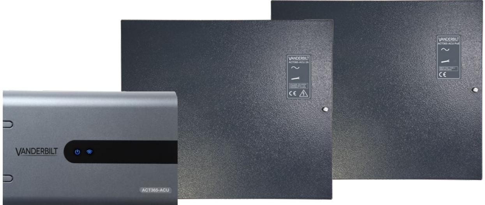
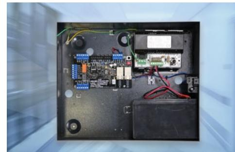
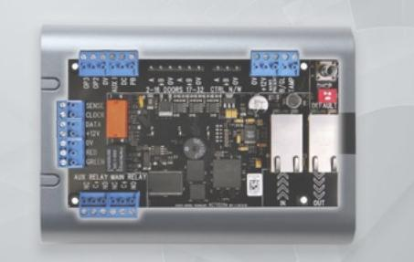
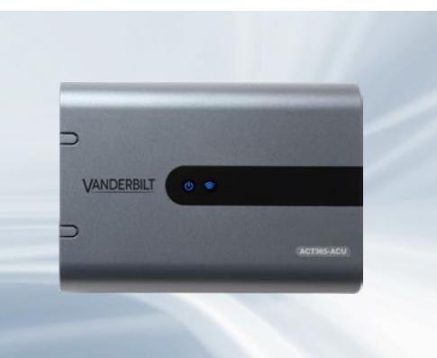
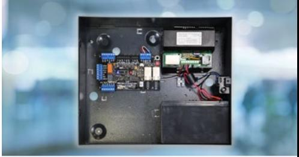

Single door IP controller for ACT365

#### **Introduction:**

**LAN**

ACT365 ACU is a single door IP Controller and includes a dual port Ethernet switch. The controller includes a rich set of advanced access control features, including voltage monitoring, break glass monitoring, interlock/airlock. ACT365 is ideal to manage the physical security for all your sites in a single interface.

# **Benefits: •** No upfront server costs **•** No Server maintenance or licensing **•** No backup issues **•** No complicated networking issues **•** No IT headaches **LAN Max of 4 controllers in a hub based network ACT365-ACU2A**

Single door IP controller for ACT365

#### **Features:**

- Manage access control and video from one interface
- Integrated Access Control and Video; Monitor live video stream and review recorded video associated with events and doors
- Manage and control access from anywhere, at any time and on any device (PC, Tablet, smart phone) with a modern web browser
- Native iOS and Android apps with modern web browser (free to download) on iTunes and Android Play stores
- Automatic notification on critical door events, voltage problems, break glass, tamper
- Live Muster reporting
- Dual port Ethernet switch, allows for IP connection
- Voltage Monitoring
- Break Glass Monitoring
- Monitoring of Mains Present, Output Voltage and Tamper
- Fire Override
- Airlock/Interlock
- Anti Passback (ACU's required to be on the same LAN segment)
- TCP / IP DHCP / Static IP addresses
- Status LED's
- Space in the enclosure for 1 x 12V 7Hr Amp Battery
- Compatible with all ACT readers
- Set/Unset alarm panel from ACT365 reader, Web portal or Mobile app

### **ACT365-ACU**

To use ACT365 you must first register as an installer via the Signup button on the login screen at **www.act365.eu**. Simply signup FREE at **www.act365.eu**.

Single door IP controller for ACT365

#### **Certifications:**

### **ACT365-ACU & ACT365-ACUPoE**

This equipment type is in compliance with the following EU Directives for CE marking:

- **•** Directive 2014/30/EU (Electromagnetic Compatibility Directive)
- **•** Directive 2011/65/EU (Restriction of the use of certain hazardous substances Directive)

Declaration of conformity available at: **http://van.fyi?Link=DoC**

#### **ACT365-ACU2A**

This equipment type is in compliance with the following EU Directives for CE marking:

- **•** Directive 2014/30/EU (Electromagnetic Compatibility Directive)
- **•** Directive 2014/35/EU (Low Voltage Directive)
- **•** Directive 2011/65/EU (Restriction of the use of certain hazardous substances Directive)

Declaration of conformity available at: **http://van.fyi?Link=DoC**

Download manual from: **http://van.fyi?Link=ACT365ACU**

Single door IP controller for ACT365

| Product Comparisons:                                                             | ACT365 ACU                    | ACT365 System    |
|----------------------------------------------------------------------------------|-------------------------------|------------------|
| Card holders (Users)                                                             | 10,000                        | N/A              |
| Card credentials per User                                                        | 4                             | 4                |
| PIN Codes per User                                                               | 1                             | 1                |
| Doors on ACT365 ACU                                                              | 1                             | N/A              |
| Log Events                                                                       | 1,000                         | 1 Year           |
| Card Holder Groups                                                               | 250                           | 250 per customer |
| Door Monitoring (Door Forced/Ajar)                                            | Yes                           | Yes              |
| Fire Alarm Override                                                              | Yes                           | Yes              |
| Interlock/Airlock                                                                | Yes                           | Yes              |
| Voltage Monitoring                                                               | Yes                           | Yes              |
| Break Glass Monitoring                                                           | Yes                           | Yes              |
| Battery Monitoring                                                               | Yes                           | Yes              |
| Tamper Monitoring                                                                | Yes                           | Yes              |
| Time Actions                                                                     | Yes                           | Yes              |
| Toggle/Latch                                                                     | Yes                           | Yes              |
| Card only or PIN only                                                            | Yes                           | Yes              |
| Card and PIN                                                                     | Yes                           | Yes              |
| Validity period (From and To)                                                    | Yes                           | Yes              |
| Muster Reporting                                                                 | N/A                           | Yes              |
| Ethernet Switch                                                                  | 2 Ports                       | N/A              |
| DHCP/Static IP Addressing                                                        | Yes                           | N/A              |
| NetBIOS name                                                                     | Yes                           | N/A              |
| Entry Exit Readers                                                               | Yes (multiple up to 500mA) | N/A              |
| Supports ACTpro Readers                                                          | Yes                           | N/A              |
| Support Wiegand readers                                                          | Yes                           | N/A              |
| Door Relay output                                                                | Yes (5 Amp)                   | N/A              |
| Auxiliary Relay Output                                                           | Yes (1 Amp)                   | N/A              |
| Programmable inputs                                                              | 1                             | N/A              |
| Support IP Connected controllers (Maximum of 4 controllers on hub network) | Yes                           | N/A              |
| Warranty period                                                                  | 3 Years                       | N/A              |
| Operating Voltage                                                                | 12V DC / 24V DC               | N/A              |

**ACT365-ACUPoE**

Android app: Supports Jelly Bean (OS 4.3) or later on devices with at least 160dpi

iOS app: Supports iOS 8 or later on iPhone 4S or above

Single door IP controller for ACT365

| Product/Technical Specificaiton      | ACT365-ACU                             | ACT365-ACU 2A                                   | ACT365-ACU PoE                                  |
|-----------------------------------------|----------------------------------------|-------------------------------------------------|-------------------------------------------------|
| Vanderbilt Material Number              | V54502-C130-A100                       | V54502-C131-A100                                | V54502-C132-A100                                |
| Input Voltage Range (Controller)     | 11-24V DC                              | 11-24V DC                                       | 11-24V DC                                       |
| Current Consumption (Controller)     | 350mA (Max) 350mA (Max)             |                                                 | 350mA (Max)                                     |
| Operating Environment                   | Surface mounting, Internal Use only | Surface mounting, Internal Use only          | Surface mounting, Internal Use only          |
| Environmental Temperature               | -10 to +50° C                          | -10 to +40 (operating) 75% RH non-condensing | -10 to +40 (operating) 75% RH non-condensing |
| Gross Product Weight (Kg)               | 0.600                                  | 3.060                                           | 3.080                                           |
| NET Product Weight (Kg)                 | 2.8590                                 | 0.5120                                          | 2.8390                                          |
| Size (mm)                               | 250x175x60                             | 355x305x95                                      | 355x305x95                                      |
| RoHS                                    | Yes                                    | Yes                                             | Yes                                             |
| Reach                                   | Yes                                    | Yes                                             | Yes                                             |
| WEEE                                    | Yes                                    | Yes                                             | Yes                                             |
| Enclosure Material                      | ABS                                    | 1.2 mm steel gray powder coated              | 1.2 mm steel gray powder coated              |
| LED Status Indicators                   | Yes                                    | Yes                                             | Yes                                             |
| PSU Fault Output                        | N/A                                    | No                                              | Yes                                             |
| Lid opening tamper detection (front) | Yes                                    | Yes                                             | Yes                                             |
| Rear tamper detection                   | No                                     | Yes                                             | Yes                                             |
| AC Mains Monitoring                     | Yes                                    | No                                              | Yes                                             |

Single door IP controller for ACT365

| Electrical Specificaiton                 | ACT365-ACU | ACT365-ACU 2A                                                                                 | ACT365-ACU PoE                                |
|------------------------------------------|------------|-----------------------------------------------------------------------------------------------|-----------------------------------------------|
| PoE 802.3bt input (PoE Ultra / PoE++) | N/A        | N/A                                                                                           | 13.8V at 3A output + 0.5A battery charge   |
| PoE 802.3at input (PoE+)                 | N/A        | N/A                                                                                           | 13.8V at 1A output + 0.5A battery charge   |
| PoE 802.3af input (PoE)                  | N/A        | N/A                                                                                           | 13.8V at 0.3A output + 0.5A battery charge |
| Battery charging                         | N/A        | Yes                                                                                           | Yes                                           |
| Standby Battery                          | N/A        | 12V 7Ah Battery                                                                               | 12V 7Ah Battery                               |
| Battery Deep Discharge Protection     | N/A        | No                                                                                            | Yes                                           |
| Input: Voltage Rated                     | N/A        | 100-240V ac                                                                                   | N/A                                           |
| Input: Voltage Operating                 | N/A        | 90-264V ac                                                                                    | N/A                                           |
| Input: Frequency                         | N/A        | 50-60Hz                                                                                       | N/A                                           |
| Input: Max Current                       | N/A        | 1.0A (@ 90V ac)                                                                               | N/A                                           |
| Input: Mains input fuse                  | N/A        | T2.0A                                                                                         | N/A                                           |
| Input: Max standby power                 | N/A        | 0.5W (no load and no battery connected)                                                    | N/A                                           |
| Output: Voltage                          | N/A        | 13.4 - 14.2V DC (13.8V DC Nominal) on mains power 10.0 - 12.3V DC on battery standby | See input voltage above                       |
| Output: Max load current                 | N/A        | 2.0A                                                                                          | N/A                                           |
| Output: Ripple                           | N/A        | 150mA pk-pk max                                                                               | N/A                                           |
| Output: Load output fuse                 | N/A        | F2.0A                                                                                         | N/A                                           |
| Output: Overload                         | N/A        | Electronic shutdown until overload or short circuit removed (Under mains power only) | N/A                                           |

#### **Ordering Information:**

| Product Code   | Material Number  | EAN Number    | Description                                             |
|----------------|------------------|---------------|---------------------------------------------------------|
| ACT365-ACU     | V54502-C130-A100 | 7330082004584 | Single door cloud IP controller                         |
| ACT365-ACU2A   | V54502-C131-A100 | 7330082004911 | Single door cloud IP controller with 2Amp 12V DC PSU |
| ACT365-ACUPoE  | V54502-C132-A100 | 7330082004904 | Single door cloud IP controller with PoE PSU            |
| PS1270 Battery | N54545-Z156-A100 |               | Battery 12V 7.0 Ah Flame Ret.                           |

#### **vanderbiltindustries.com**

@VanderbiltInd Vanderbilt Industries

#### **Vanderbilt International Ltd.**

Clonshaugh Business and Technology Park Clonshaugh, Dublin D17 KV 84, Ireland

+353 1 437 2560