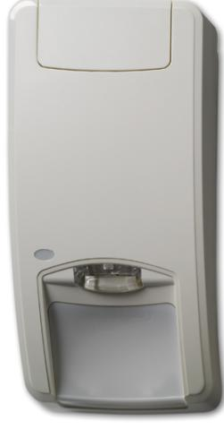

## DDV1016AM

Produktblad

Kombidetektor 16 m Passiv IR/MW, antimask

#### Patenterad mikrovåg "Range Gated Radar"-teknologi

Kombidetektorerna i DDV1000-serien innehåller UTC Fire & Security patenterade och unika "range gated radar"-teknik som definierar en tydlig gränslinje som mikrovågen använder för att mäta avståndet mellan detektorn och det rörliga objektet. Detta hindrar eventuella störande larm som genereras av rörelser utanför detekteringsområdet. DDV1016AM har fyra möjligheter för avståndsinställning, valbart via DIP-switchar som gör det möjligt att anpassa detektorn till det rum där detektorn är installerad.

Detektorn arbetar på 5,8 GHz frekvens och kommer inte att störa något WiFi-nätverk.

#### Vektorteknologi i kombination med patenterade spegeloptik

IR detekteringen använder de patenterade Vektorteknologin och spegeloptiken. Vår patenterade spegeloptiksteknologi har fördelen med glidande fokus, vilket skapar en kontinuerlig detekteringsridå från golv till tak. I DDV1016-serien används ett dubbel pyroelement som generera fyra segment i varje ridå för var och en av de nio ridåerna.

#### Detekteringsteknikerna arbetar tillsammans

Kombidetektorer i DDV1016-serien genererar ett larm beroende på vad båda teknikerna – mikrovåg "range gated radar" och Passiv IR - upptäcker i täckningsområdet. Vår kombiteknologi går utöver en enkel ''OCH'' funktion: den klassificerar signalerna från varje teknik – "range gated radar" och Passiv IR - att ha den bästa larmresultatet utan att vara känslig för störande signalkällor. Denna teknik skapar en enhetlig känslighet i samtliga rörelseriktningar.

#### Enkel och flexibel installation

1. Tolererar vinkelavvikelse vid skeva väggar och olika monteringshöjder 2. Begränsad förlust av täckningen när föremålen skymmer området för PIR

3. Enkel inställning via DIP-switchar för avståndet av "range gated radarn" för att anpassa täckningsområdet, fyra lägen 4. Flera olika inbyggda slingmotståndsvärden vilket underlättar inkopplingen

- 5. Plug-in detektor
#### Antimaskskydd (IR och mikrovåg)

Användningen av aktiv IR och mikrovåg ger en överlägsen övertäckningsskydd som övervakar detektorn på insidan och utsidan. Mikrovågskontroll förhindrar från att ha oönskad AM larm orsakade av t ex insekter. I avancerad inställning är

#### Standardprestanda

- EPatenterade och unik "Range Gated Radar"-teknik för exakta avståndsdetektering
- EVektorteknologi med patenterade spegeloptik
- EAntimaskskyddad som använder Aktiv IR och mikrovåg för att skydda mot sabotageåverkan utanför och inuti rörelsesensorn
- EIntelligenta larmbeslut baserat på signalbehandlingen av IRoch mikrovågslarm
- EAutomatisk och kontinuerlig självdiagnostik på alla teknologier
- EGrönt läge: möjlighet att stänga av mikrovågen då inbrottslarmet inte är tillkopplat
- ESBSC, Larmklass 3

# DDV1016AM

### Kombidetektor 16 m Passiv IR/MW, antimask

kvarhålls larmet till dess källan för övertäckningen (t.ex. spray, tejp, ...) har tagits bort. Även delvis täckning - som går utöver EN Grade III standard - kommer att detekteras i den avancerade inställningen.

## Tekniska data

| Täckningsområde                      | 10, 12, 14, 16 m valbart       |
|--------------------------------------|--------------------------------|
| Bevakningsvinkel                     | 78°                            |
| PIR Optik                            | 9 High density spegelridåer    |
| MIkrovågsfrekvens                    | 5.8 GHz                        |
| Max. mikrvågs ut (vid 1m)            | 0.003 µW/cm²                   |
| Minnesfunktion                       | Ja                             |
| Spänningsmatning                     | 9 till 15 VDC (12 V nominelll) |
| Peak-to-peak ripple immunitet     | 2V (vid 12 VDC)                |
| Uppstartstid                         | 60 s                           |
| Strömförbrukning                     | 5 till 16 mA (8 mA nominelll)  |
| Monteringshöjd                       | 1,8 till 3,0 m                 |
| Objektets rörelsehastighet           | 0,2 till 3,0 m/s               |
| Larm-/Sabotagerelä characteristic | NC, 80 mA 30 VDC, Form A       |
| Larmtid                              | 3 s                            |
| Arbetstemperatur                     | -10 till +55° C                |
| Relativ fuktighet                    | 95% max. ej-kondenserande      |
| Vikt                                 | 120 g                          |
| Dimension (H x B x D)                | 126 x 63 x 50 mm               |
| IP/IK-klass                          | IP30 IK04                      |
| SBSC                                 | Larmklass 3                    |

Order data

| Artikelnummer | Beskrivning                               |
|---------------|-------------------------------------------|
| DDV1016AM     | Kombidetektor 16 m Passiv IR/MW, antimask |
| AMGR2-10      | Motståndsmodul för trippelbalansering     |

