### **1 Introduction**

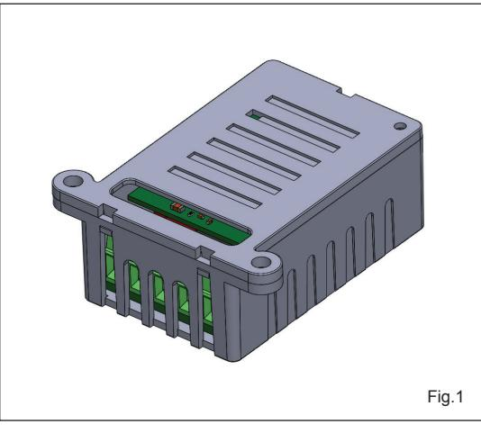

## **RX CUBE - Bluetooth controlled radio receiver**

The receiver ERONE "Cube" is a superheterodyne radio receiver operating at 433,92 MHz in AM/ASK demodulation. It is compatible with the full range of remote controls Erone that use the Keeloq® Hopping code security protocol. This receiver can be programmed only via Bluetooth using set-up and control that can be done only using the app : "RX Cube" on a Smartphone ( IOs or Android ).

It is realized in 2 versions : "Signal" and "Power". The type "Power" is equipped with an automotive relay and the contacts C-NO-NC make it suited to drive even inductive loads as magnets or strikes.

Power supply 12-24 Vac/dc autodetect. The equipment is manufactured in compliance with the provisions of European Directive 2014/30/EU, 2014/35/EU, 2014/53/EU and the provisions of the standard EN 62368-1.

| Part-name       | F-code      | Description                   |  |  |
|-----------------|-------------|-------------------------------|--|--|
| SEL2641R433-RC  | F1001000105 | RECEIVER CUBE BT 12/24V       |  |  |
| SEL2641R433-RCP | F1001000106 | RECEIVER CUBE POWER BT 12/24V |  |  |

### **2 Technical Specifications**

| Receiver typeSuperheterodyne                          |  |
|-------------------------------------------------------|--|
| Carrier frequency 433,92 MHz                          |  |
| Demodulation AM/ASK                                   |  |
| Input sensitivity -103 dBm                            |  |
| Input load: 50 Ohm                                    |  |
| Power supply: 12 - 24 Vac/dc ( autodetect)            |  |
| Max switching power:                                  |  |
| - Type RC 1 A @ 24V ( max 60 V)                       |  |
| - Type RCP20 A @ 12V - 3 A @ 24V                      |  |
| Relay number: 1                                       |  |
| Operating modes: Pulse / Latch / Timed                |  |
| Release time (Timed mode): from 1 sec. to 23h.59m:59s |  |
| Contacts: C-NO-NC                                     |  |
| Memory capacity: 250 user codes                       |  |
| TX security code:KeeLoq® Hopping code                 |  |
| Max code combination number: 264                      |  |
| Operating temperature: -20°/+70°C                     |  |
| Housing protection: IP2X                              |  |
| Overall dimensions: 50 x 32 x 20 mm                   |  |
| Communication w/mobile phone: Bluetooth               |  |
| Standard:BLE 4.2                                      |  |
| Power supply:3 Vdc                                    |  |
| IO : Compatibility: Android, IOs                      |  |
| Release Android: 5.1 and next                         |  |
| Release iOS: 10 and next                              |  |

### **3 Dimensions**

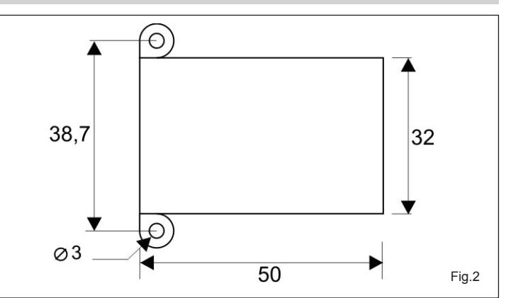

# **4 Warnings**

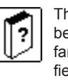

The receiver allocation is very important for the best operation of the system. Place the receiver far from interference sources such as big magnetic fields or radio emissions.The distance between 2 receivers must be at least 1,5 m.

- The equipment must be powered from a device that provides a safety extra low voltage (SELV) type LPS ( Low Power Source);

- There must be a suitable disconnecting device to the current drawn by the receiver (90 mA max @ 12Vdc).

## **RX CUBE**

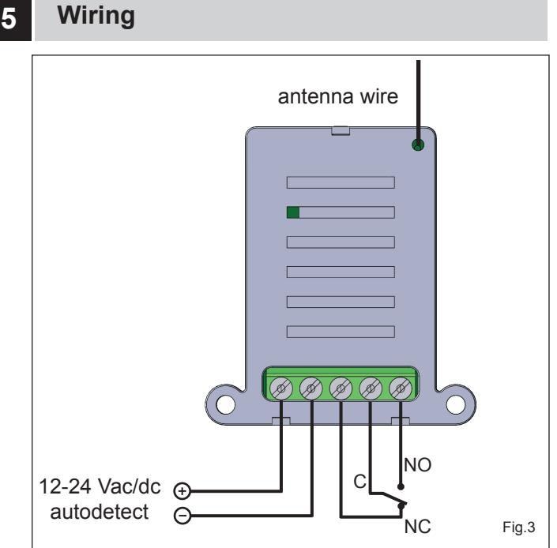

### **6 Compatible transmitters**

- Erone S2TR2641E2-E4-E2M
- Erone SETR2641AM1, SETR2641AM2
- Erone S3TR2641T1-T2-T4
- Erone S4TR2641E1-E2-E4
- Erone SETR2641TM
- Erone S7TR2641E4
- Erone FKT2641E1 FKTHS2641E1- TTH2641E1
- Erone S4TR2641E1-E2-E4
- CDVI GALEOR

# **7 The App "RX CUBE"**

The setup of the receiver can be done only through the App "RX CUBE". So, first of all, download the App from "Apple Store" or "Google Play". You can find it both typing the name of the App, "RX Cube", or searching simply CDVI and then selecting Rx Cube. Once downloaded, authorize the App to use the Bluetooth communication. The App will ask even the GPS localization: please authorize it for the full operating of the Bluetooth BLE.

|  |  |  | CUBE | > |
|--|--|--|------|---|
|  |  |  | CUBE | > |
|  |  |  |      |   |
|  |  |  |      |   |
|  |  |  |      |   |

Start the App and press the scan button: the App begins scanning the surroundings searching for any RX Cube is running in the range of the Bluetooth signal ( 10 -- 30 m ). Much depends on the fixing position of the receiver and whether the communication is direct or passes through walls. At the end of the scanning, the screen will show all the receivers RX Cube found.

The receiver, by factory, comes with the name "CUBE". If you power two or more receivers simultaneously, the scanning will list many receivers all identical: it is advisable to power one device at time and possibly rename it individually. The name of the device can have up to 12 characters.

### **7.0 Changing the factory name of the receiver**

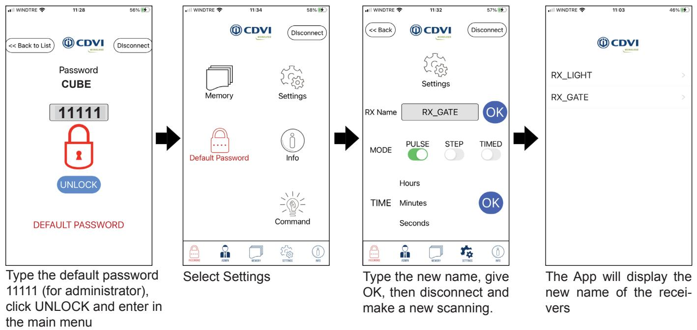

#### **7.1 Password**

The access to the receiver has 2 different security levels : ADMINISTRATOR and INSTALLER. Factory password for **ADMINISTRATOR = 11111.** 

### Factory password for **INSTALLER = 00000**

Both can make all the settings. Only the Administrator can change the passwords, the Installer is not authorized

## **8 Memory**

Enter the submenu Memory to manage the receiver memory : add or delete transmitters individually, add or delete a batch of transmitters, delete all the transmitters, restore the memory to factory settings

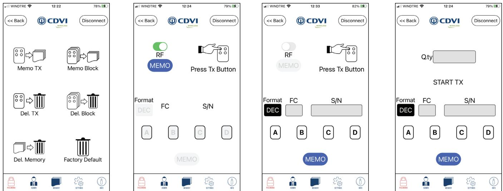

#### **8.1 Memorizing transmitters**

### 8.1.1 Individually

The memorization can be done directly, pressing the button of the transmitter to store or specifying its S/N and Facility code. In this case you must specify the button/s authorized ( you can store up to 4 buttons).

### 8.1.2 In one block ( fig. 3)

Specify the number of transmitters of the block, the detail of the first transmitter ( S/N and Facility code ) and the buttons to enable ( A, B, C or D).

NOTE : The button **Format** allows to display the numbers in **DECIMAL** or **HEXADECIMAL** format

# **RX CUBE**

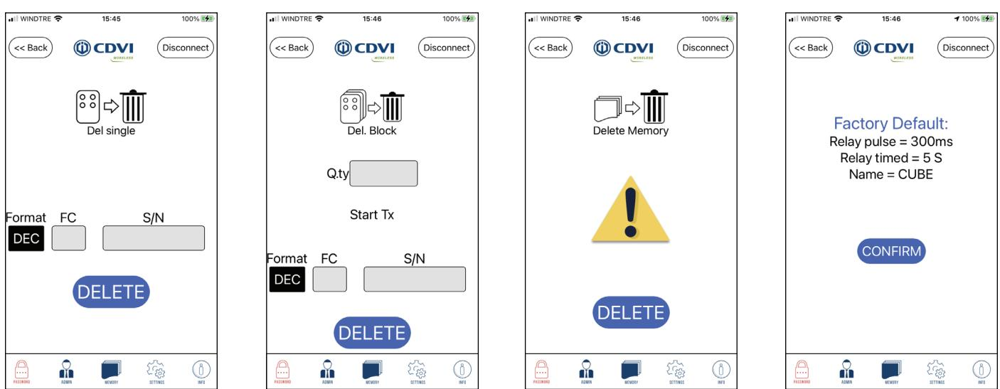

#### **8.2 Delete transmitters**

#### **8.2.1 Individually**

Enter the S/N and Facility code of the transmitter to delete and press DELETE

### **8.2.2 In one block**

Specify the number of transmitters of the block, enter S/N and Facility code of the first TX and press DELETE

### **8.2.3 Delete memory**

Press DELETE to delete all the transmitters memorized

### **8.2.4 Factory Default**

This option allows to delete all the transmitters and reset the settings to the factory defaults: pulse mode, time of the timed mode ( 5 sec.), name of the receiver ( CUBE).

# **9 Settings**

Clicking on Settings it is possible to set the the relay operating mode: PULSE, STEP, TIMED. In pulse mode the relay remains activated for the entire duration of the radio transmission with a min. time of 300 mS. For the Timed mode it is possible to set the release time of the relay from 1 sec. to 23h : 59m : 59s

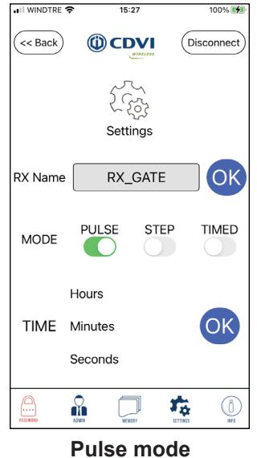

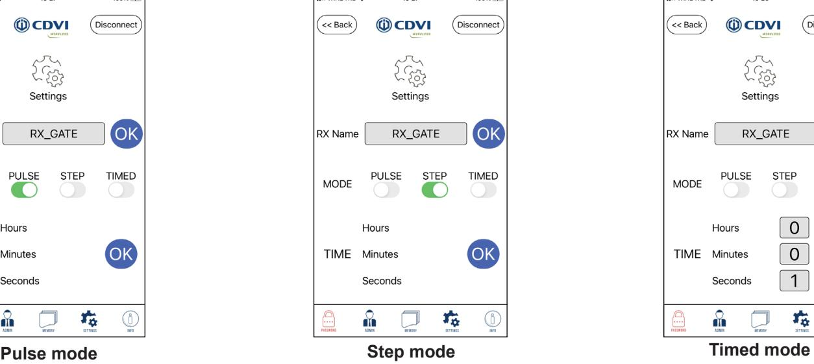

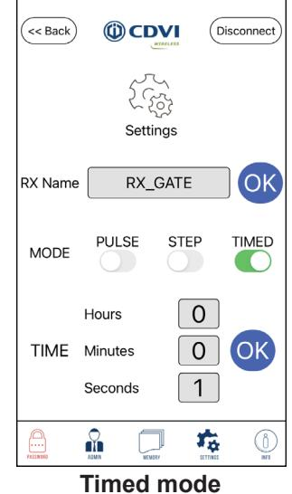

# **10 Password**

The password can be changed selecting the icon Password on the mail screen.

Only the ADMINISTRATOR is authorized to change the password.

The password set-in-factory are :

- Administrator : 11111
- Installer : 00000

The password is composed by max 5 numeric digits ( min 1 ). A red message appears if the password is still the factory password

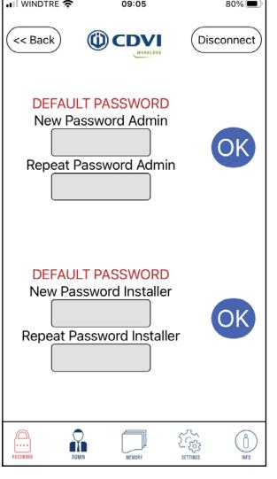

# **11 Info**

The icon INFO of the main screen allows to display the features of the receiver: number of TX memorized, revision of the Firmware and release of the App.

It is possible to list the transmitters memorized: press **List..>**  The screen displays only 5-6 lines of the list.

Scroll the list taping the center of the screen. The Serial number of the transmitters can be displayed in Decimal or Hexadecimal format.

If you select one line, you display the information of a specific transmitter. For each transmitter it is displayed the FC + S/N and the button active ( A, B, C or D).

For changing this setting, press one of the 4 buttons and push CHANGE.

From this screen is also possible to DELETE the TX from the memory.

It is possible to activate directly the relay from the App. Enter the icon "Command" and press the button. The symbol becomes RED confirming of the relay activation.

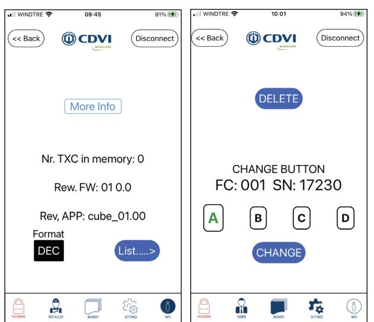

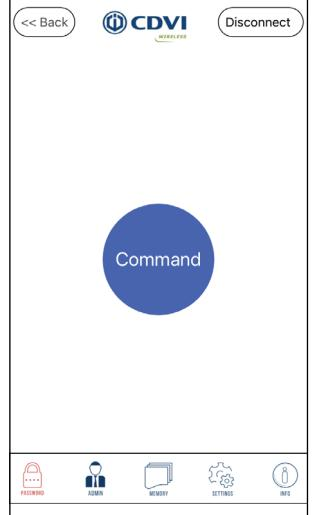

### **1 Introduction**

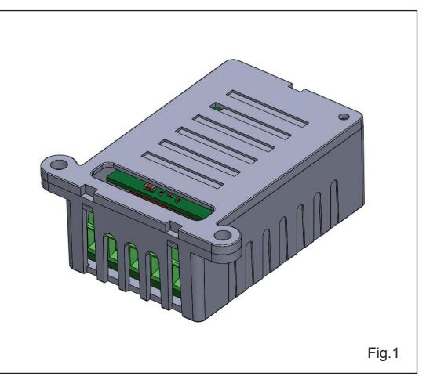

## **RX CUBE - RX radio controllato via Bluetooth**

Il ricevitore ERONE "Cube" è un ricevitore radio supereterodina funzionante a 433,92 MHz in AM/ASK. E' compatibile con l'intera gamma di radiocomandi Erone con protocollo di sicurezza Keeloq® Hopping code Può essere configurato unicamente via Bluetooth usando la App "RX Cube" su uno Smartphone ( IOs o Android ).

E' disponibile in 2 versioni : "Signal" e "Power". Il modello "Power" ha un relè automotive con contatti C-NA-NC, che lo rendono idoneo a comandare direttamente carichi induttivi quali elettroserrature e ventose magnetiche. Alimentazione 12-24 Vac/dc con autodetect. Il dispositivo è costruito in conformità con le Direttive Europee 2014/30/EU, 2014/35/EU, 2014/53/EU e con la Norma EN 62368-1.

| Articolo        | F-code      | Descrizione                     |  |  |  |
|-----------------|-------------|---------------------------------|--|--|--|
| SEL2641R433-RC  | F1001000105 | RICEVITORE CUBE BT 12/24V       |  |  |  |
| SEL2641R433-RCP | F1001000106 | RICEVITORE CUBE POWER BT 12/24V |  |  |  |

### **2 Caratteristiche tecniche**

| Tipo ricevitore Supereterodina                          |  |
|---------------------------------------------------------|--|
| Frequenza 433,92 MHz                                    |  |
| Demodulazione AM/ASK                                    |  |
| Sensibilità per segnale a buon fine -103 dBm            |  |
| Impedenza di ingresso: 50 Ohm                           |  |
| Alimentazione: 12 - 24 Vac/dc ( autodetect)             |  |
| Potenza commutabile (max):                              |  |
| - Versione RC 1 A @ 24V ( max 60 V)                     |  |
| - Versione RCP20 A @ 12V - 3 A @ 24V                    |  |
| N° di relè 1                                            |  |
| Funzionamento relè Impulsivo, passo-passo, temporizzato |  |
| Ritardo ( in modo temporizzato) da 1 Sec. a 23h.59m:59s |  |
| Contatti C-NA-NC                                        |  |
| Memoria 250 TX                                          |  |
| Protocollo di sicurezzaKeeLoq® Hopping code             |  |
| Max combinazioni di codice 264                          |  |
| Temperatura di funzionamento -20°/+70°C                 |  |
| Protezione del contenitore IP2X                         |  |
| Dimensioni 50 x 32 x 20 mm                              |  |
| Communicazione con smartphone:Bluetooth                 |  |
| Standard:BLE 4.2                                        |  |
| Alimentazione BT : 3 Vdc                                |  |
| IO : Compatibità :Android, IOs                          |  |
| Release Android: 5.1 e successive                       |  |
| Release iOS: 10 e successive                            |  |

### **3 Dimensioni**

6

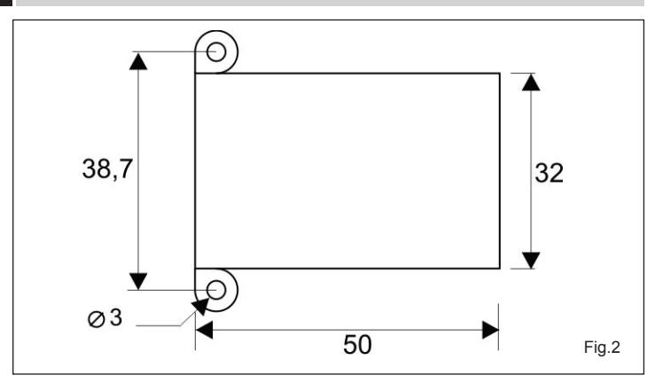

# **4 Avvertenze**

Il posizionamento del ricevitore è molto importante per la ricezione del segnale radio. Collocare il dispositivo lontano da sorgenti di interferenza quali grossi campi magnetici o emissioni radio. La distanza tra 2 ricevitori deve essere almeno di 1,5 m. - Il dispositivo deve essere alimentato con una sorgente del "safety extra low voltage (SELV), tipo LPS ( Low Power Source);

- Deve essere presente un dispositivo di disconnessione in grado di condurre una corrente max di 90 mA max @ 12Vdc.

# **5 Collegamenti**

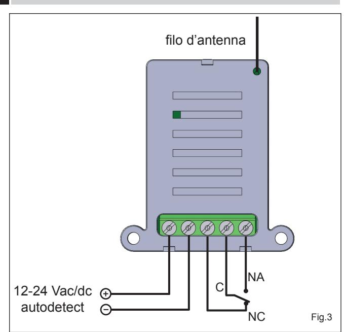

## **6 Trasmettitori compatibili**

- Erone S2TR2641E2-E4-E2M Erone - SETR2641AM1, SETR2641AM2 Erone - S3TR2641T1-T2-T4 Erone - S4TR2641E1-E2-E4 Erone - SETR2641TM Erone - S7TR2641E4 Erone - FKT2641E1 - FKTHS2641E1- TTH2641E1 Erone - S4TR2641E1-E2-E4 CDVI - GALEOR
# **7 La App "RX CUBE"**

La programmazione del ricevitore può essere fatta esclusivamente usando la App "RX CUBE". Quindi per prima cosa scaricare la App da "Apple Store" o "Google Play". La si può trovare facilmente o cercando "RX Cube" oppure cercando semplicemente CDVI e poi selezionando Rx Cube. Una volta eseguito il download, autorizzare la App all'utilizzo del Bluetooth. La App richiede anche la localizzazione GPS: autorizzare per il corretto funzionamento del Bluetooth BLE.

|  |  |  | CUBE |  | > |
|--|--|--|------|--|---|
|  |  |  | CUBE |  | > |
|  |  |  |      |  |   |
|  |  |  |      |  |   |
|  |  |  |      |  |   |
|  |  |  |      |  |   |
|  |  |  |      |  |   |
|  |  |  |      |  |   |
|  |  |  |      |  |   |

Far partire l'applicazione e premere il pulsante SCAN : l'applicazione inizia una scansione per stabilire quali ricevitori CUBE ci sono nel raggio del segnale Bluetooth ( 10 -- 30 m ). Molto dipende dalla posizione di fissaggio del ricevitore e se la comunicazione è diretta o passa attraverso muri o pareti. Alla fine della scansione, lo schermo visualizza tutti i ricevitori CUBE trovati.

Il ricevitore viene denominato in fabbrica "CUBE". Se si alimentano due o più ricevitori contemporaneamente la lista mostrerà tutti nomi uguali. E' consigliabile alimentarne uno alla volta e rinominarli. Il nome del dispositivo può avere fino a 12 caratteri.

## **RX CUBE**

#### **7.0 Modifica del nome di fabbrica del ricevitore**

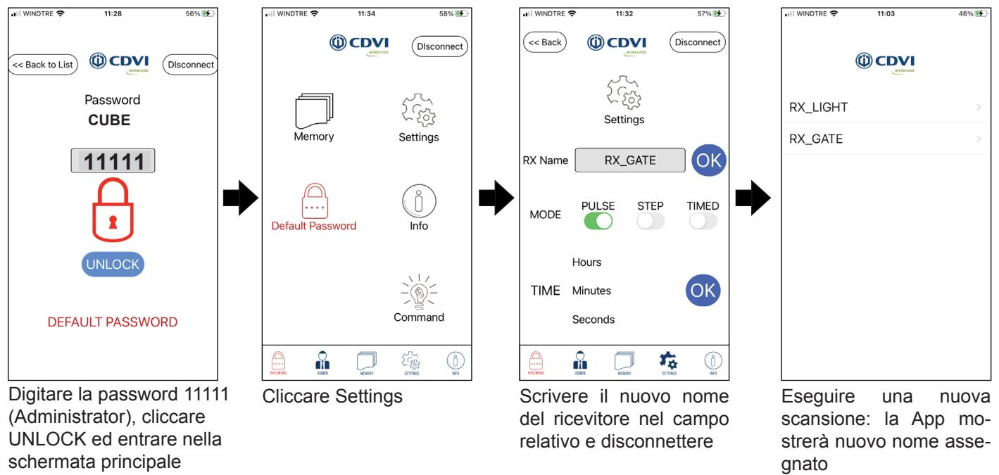

### **7.1 Password**

L'accesso al ricevitore è previsto con 2 diversi livelli di sicurezza : ADMINISTRATOR e INSTALLER.

Passwordi di default **ADMINISTRATOR = 11111.** 

Passwordi di default **INSTALLER = 00000**

Entrambi possono impostare il ricevitore. Solo l' Administrator può cambiare le password. L'Installer non è autorizzato.

# **8 Memory**

Entrare nella schermata Memory per gestire la memoria del ricevitore. E' possibile aggiungere o cancellare i trasmettitori singolarmente, aggiungere o cancellare trasmettitori a blocchi, cancellare tutti i trasmettitori o riportare il dispositivo alle impostazioni di fabbrica.

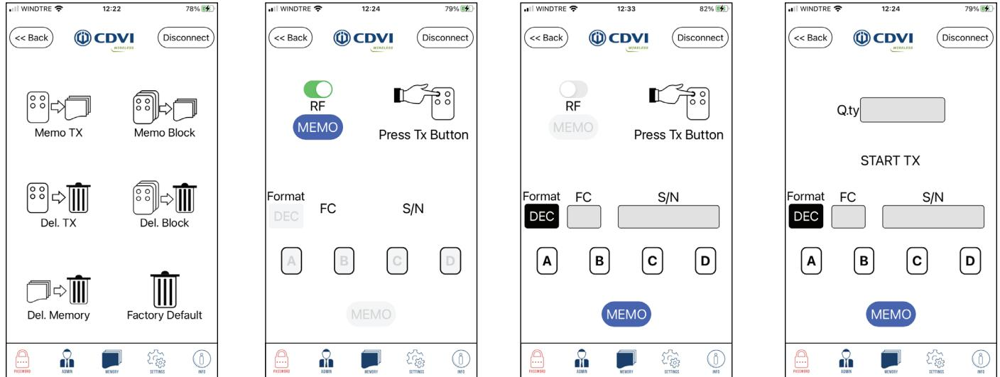

### **8.1 Memorizzare i trasmettitori**

#### **8.1.1 Singolo TX**

La memorizzazione può essere eseguita in 2 modi: premere il pulsante MEMO e poi premere il tasto del trasmettitore da memorizzare, oppure specificare S/N e Facility code del trasmettitore e scegliere il tasto o i tasti da autorizzare

### **8.1.2 Memorizzazione a blocchi**

Indicare il numero di Trasmettitori del blocco, i dettagli del primo TX da memorizzare ( S/N e Facility code ) e il tasto da autorizzare ( A, B, C o D).

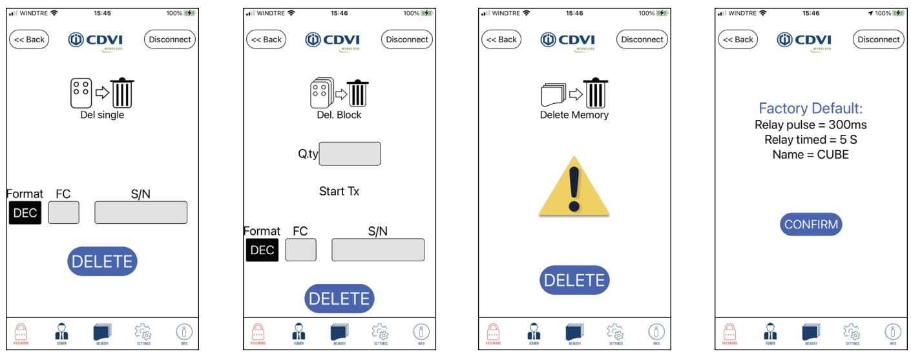

#### **8.2 Cancellazione trasmettitori**

### **8.2.1 Cancellazione singola**

Digitare S/N e Facility code del trasmettitore da cancellare e premere DELETE.

### **8.2.2 Cancellazione a blocchi**

Indicare il numero di trasmettitori del blocco e digitare S/N e Facility code del primo TX del blocco : poi premere DELETE

### **8.2.3 Cancellazione completa della memoria**

Premere DELETE per cancellare tutti i trasmettitori memorizzati.

#### **8.2.4 Ripristino impostazioni di fabbrica**

Questa opzione cancella tutta la memoria e riporta il ricevitore alle impostazioni di fabbrica: premere CONFIRM.

### **9 Settings**

Selezionando Settings è possibile impostare il modo di funzionamento del relè: PULSE ( impulsivo), STEP ( passo-passo), TIMED ( temporizzato). In modo Pulse il relè resta eccitato per tutta la durata della trasmissione radio, con un minimo di 300 mS. In modo Timed è possibile impostare il tempo di rilascio da 1 sec. a 23h : 59m : 59s

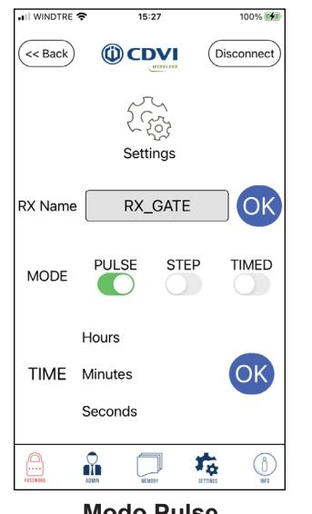

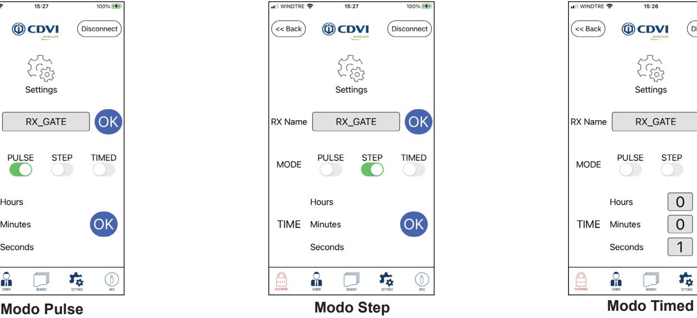

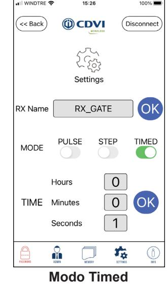

## **10 Password**

The password può essere cambiata selezionando l'icona Password dello schermo principale.

Solo l'ADMINISTRATOR è autorizzato a cambiare la password. Le password di fabbrica sono :

- **• Administrator : 11111**
- **• Installer : 00000**

La password è composta da un massimo di 5 cifre ( min 1 ). Quando la password è ancora la password di fabbrica, appare il messaggio rosso "DEFAULT PASSWORD"

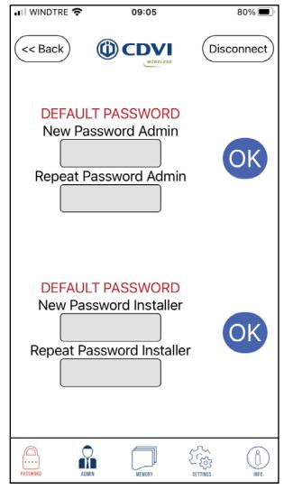

## **11 Info**

Premendo l'icona INFO dello schermo principale, si ottengono le principali informazioni sul ricevitore

- Numero di TX memorizzati
- Indice di revisione del Firmware
- Indice di revisione della App.

Premendo **List..>** si visualizza la lista dei trasmettitori memorizzati che appare sullo schermo con 5-6 righe.

Scorrere la lista col dito al centro dello schermo. Il numero seriale dei trasmettitori può essere espresso in Decimale o Esadecimale. ( premere DEC per impostare il formato) Se si seleziona una riga, il sistema visualizza tutte le informazioni di un determinato trasmettitore.

Per ciascun TX sono visualizzati FC + S/N ed il tasto o i tasti attivi ( A, B, C o D).

Per cambiare questa impostazione premere la lettera corrispondente al tasto desiderato e poi confermare con CHANGE. E' possibile inoltre cancellare dalla memoria il trasmettitore premendo DELETE.

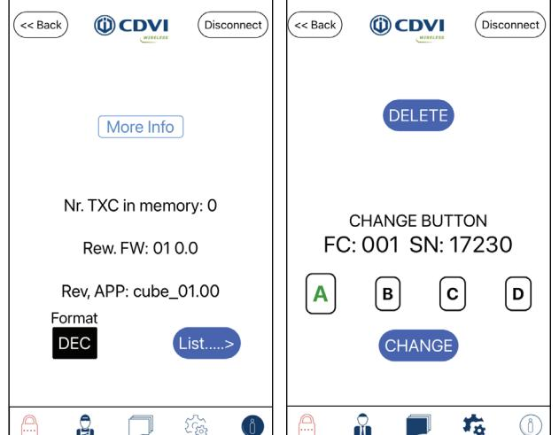

### **12 Command**

E' possibile attivare direttamente il relè dallo smartphone. Selezionare l'icona Command e premere sul cerchio blu con **Command**. L'icona diventa rossa quando il relè è attivato.

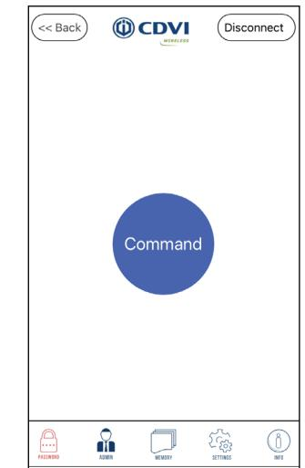

## **13 Guarantee**

*The warranty period for this product is 60 months, beginning from the manufacturer date. During this period, if the product does not work correctly, due to a defective component, the product will be repaired or substituted at our discretion. The guarantee does not cover the plastic container integrity. After-sale service is supplied at the factory.*

*La garanzia è di 60 mesi dalla data di fabbricazione apposta all'interno.* 

*Durante tale periodo, se l'apparecchiatura non funziona correttamente, a causa di un componente difettoso, essa verrà riparata o sostituita a discrezione del fabbricante. La garanzia non copre l'integrità del contenitore plastico. La garanzia viene prestata presso la sede del fabbricante.*

IS-RCERML rev.0 on 6/4/2021

Manufactured by : CDVI WIreless SPA - Via Piave, 23 31020 S.Pietro di Feletto (TV) - Italy Tel : +39-0438-450960 - Fax : +39-0438-455628 web: www.erone.com - email: info@erone.com

**CDVI AMERICAS**

[CANADA - USA - LATIN AMERICA] www.cdvi.ca

**CDVI BENELUX**

[BELGIUM - NETHERLAND - LUXEMBOURG] www.cdvibenelux.com

> **CDVI FRANCE** www.cdvi.com

**CDVI IBÉRICA** [SPAIN - PORTUGAL] www.cdviberica.com

> **CDVI ITALIA** www.cdvi.it

**CDVI MAROC** www.cdvi.ma

**CDVI POLSKA** www.cdvi.com.pl

> **CDVI SUISSE** [SWITZERLAND] www.cdvi.ch

**CDVI SWEDEN** [SWEDEN - DENMARK - NORWAY - FINLAND] www.cdvi.se

**CDVI UK** [UNITED KINGDOM - IRELAND - SOUTH AFRICA] www.cdvi.co.uk

> **CDVI WIRELESS**  www.erone.com

## **www.erone.com**

Manufactured by : CDVI Wireless SPA Via Piave, 23 - 31020 S.Pietro di Feletto (TV) - Italy tel: +39-0438-450860 - mail: info@erone.com - web:www.erone.com All the information contained within this document (pictures, drawing, features, specifications and dimensions) could be perceptibly different and can be changed without prior notice.Reference manual: CDVI_CUBE_IM_01_EN_A4_CMYK.pdf - Printed in Italy - Apr 2021