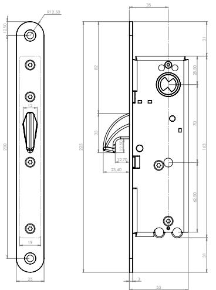
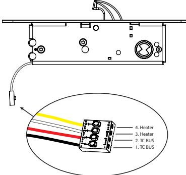

## M O TO R L Å S

### 6300 Vårt snabbaste och mest avancerade motorlås

Safetron 6300 motorlås i smalprofilutförande är vårt snabbaste och mest avancerade motorlås. Låset frånreglar under 0.2 sekunder och därför behövs normalt sett inget separat daglås på högfrekventa dörrar. 6300 är anpassad att fungera ihop med dörrautomatiker.

Typiska användningsområden är dag-, natt- och säkerhetslåsning inom handel, kontor och industri samt där det ställs mycket höga krav på säkerhet. Motorlåset är certifierat enligt SSF-3522 låsklass 2B, 3, 4 och 5 samt SS-EN 14846 Grade 7.

Låshuset har en inbyggd navigeringsbar display. Displayen möjliggör justering av konfigurationen samt informationshämtning av bl.a. händelser och installationsdatum.

#### Långa kabellängder

I kombination med Styrenhet TwoCom erhålls en 128-bitars kryptering för högsta säkerhet. TwoCom tillåter kabellängder upp till 100 meter mellan låshus och styrenhet med standardkabeln vilket ger nya möjligheter att installera styrenheter i skyddade miljöer såsom elcentraler eller serverrum. För längre kabellängder skall kabelarean beräknas.

#### TwoCom och seriekoppling

TwoCom innebär en egenutvecklad tvåtrådsteknik där kommunikation, kryptering och spänningsmatning går parallellt i en anslutningskabel med endast två ledare. Initiering sker automatiskt och förenklar installationen avsevärt.

Med TwoCom ges också möjlighet att ansluta två motorlås mot en styrenhet. Använd två motorlås i samma dörr eller i två separata dörrar. Förberedelse finns också för integrerad slussfunktion.

#### EGENSKAPER

- Dorndjup 35 mm
- Hakregel
- Frångreglar under 0.2 sekunder
- Öppningsbart med nyckel/vred (90 graders vridning)
- Anpassad för dörrautomatik
- Automatisk initiering
- TwoCom BUS teknik
- Händelselogg
- Seriekoppling, upp till två motorlås mot en styrenhet (TwoCom Lite)
- Certifierat enligt SSF-3522 låsklass 3, 4 och 5 samt SS-EN 14846 grade 7

#### TEKNISKA DATA

- 10-48VDC, 8-35VAC
- Strömförbrukning: 60 mA @ 24VDC, max 300 mA vid aktivering
- Arbetstemperatur -30°C till +70°C
- Passar skandinaviska oval- och rundcylindrar samt Abloy cylindrar Protec / Sento

| BENÄMNING                        | ART NR      | E-NUMMER |
|----------------------------------|-------------|----------|
| Motorlås 6300 TC                 | 202 144 705 | 5866981  |
| Motorlås 6300 TC satsförpackning | 202 144 713 | 5866978  |

Satsförpackning: motorlås, styrenhet TC, anslutningskabel C04 (10m), slutbleck 6301

# Rätt till ändringar av katalogens innehåll och sortiment förbehålls. Vi reserverar oss för eventuella tryckfel.