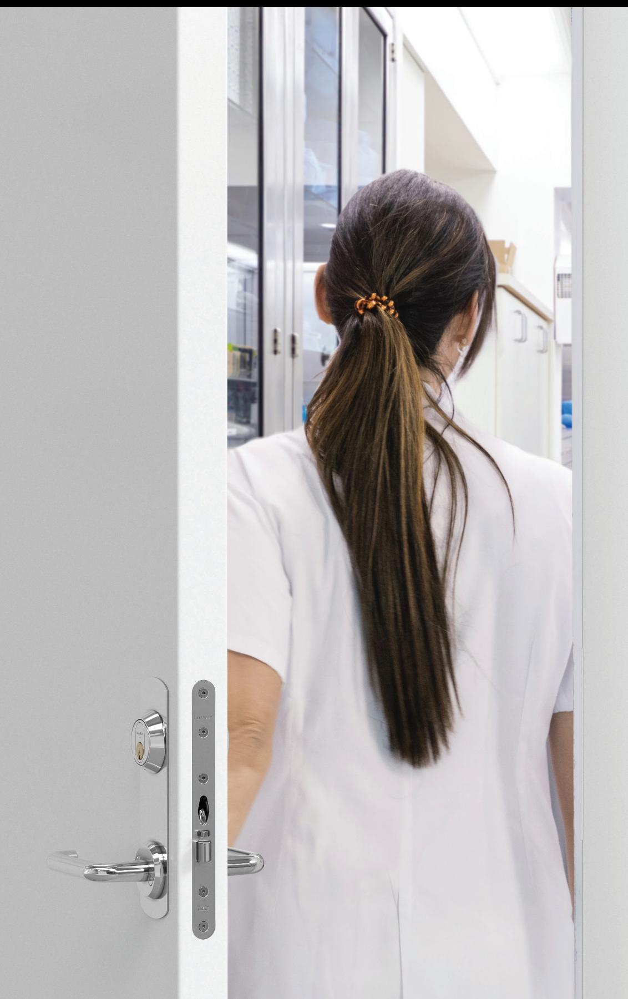
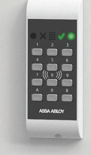
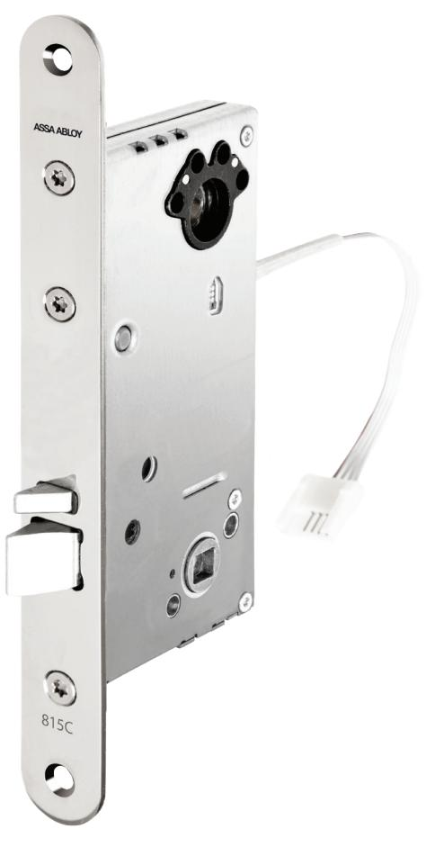
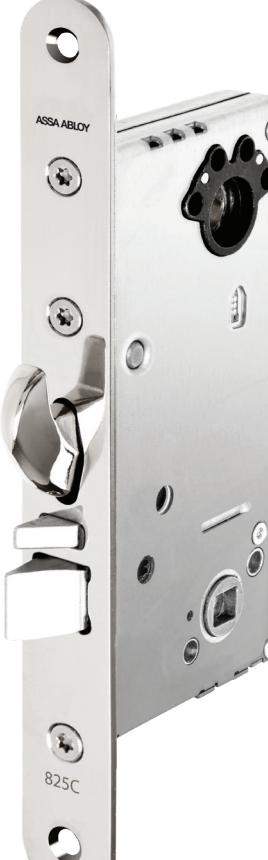

# Velox-serien tar eltryckeslåsen in i framtiden

En helt ny standard för funktioner och prestanda

# Velox-serien tar eltryckeslåsen in i framtiden

*En helt ny standard för eltryckeslås anpassade för dagens och framtidens krav på funktioner och prestanda. Ja, du läste rätt.*

*ASSA ABLOY Velox är här. Velox-serien från ASSA ABLOY är anpassad för en snabb och flexibel installation och är lämplig för daglåsning av allt från lätta innerdörrar till tunga ytterdörrar. Och gissa vad? Velox-låsen är redo för framtiden.* 

#### **Trygg, tryggare, tryggast**

Velox-låsen finns i fem varianter, där det mest avancerade är godkänt i låsklass 3. Det betyder att du kan välja den variant som passar dina behov och förväntningar. Självklart är låsen certifierade för att klara tuffa krav inom brand, inbrott och utrymning.

#### **Anpassa?**

Inga problem. För den som håller i skruvmejseln kommer Velox att kännas bekant. Velox-låsen bygger på en väl beprövad plattform. De går enkelt att anpassa beroende på hur den lokala dörrmiljön ser ut och vilka funktioner som behövs.

#### **Digital och krypterad kommunikation**

Denna nya serie lås kommunicerar digitalt och krypterat med anslutna passersystem. Det går självklart att ansluta låsen analogt om du hellre vill det.

#### **Smarta på riktigt**

Velox är smarta lås på riktigt. I låsen sitter sensorer istället för mikrobrytare och gör både övervakning och status i realtid möjlig. Velox är kompatibla med Hi-O™ och förberedda för framtida behov, som till exempel förebyggande underhåll.

#### **Öppna och stäng. Igen och igen.**

Låsen är anpassade för högfrekvent användning. Med andra ord: det är lås som håller och som tål att användas.

#### **Hållbart, såklart**

Velox-låsen är energieffektiva och är tillverkade av 100 procent återvinningsbart material. Ett bra miljöval, helt enkelt.

# **Så här funkar det**

Låshus 813

Trycket på ut- och insidan aktiveras elektriskt via en signal från passersystem, kodlås, tryckknapp eller liknande.

### Låshus 815, 820, 825 och 835

Trycket på utsidan aktiveras elektriskt via en signal från passersystem, kodlås eller liknande. Trycket på insidan är mekaniskt inkopplat, därav behövs ingen tryckknapp kopplas in. På låshus 835 kan man välja att trycket på insidan ska aktiveras via en signal från ett passersystem för att uppfylla låsklass 3. Funktionen (split spindle) är ställbar utifrån höger/vänster och in/ut.

# **Så här kopplar du in Velox**

Inkoppling till Hi-O-bussen sker med fyra trådar, två för spänning, två för kommunikation. Använd färdigkontakterad kabel EA226 (10 m) vid installation. Kabeln kopplas in på valfritt ställe på Hi-O- bussen.

# **Egenskaper**

- Förreglad tryckesfall
- Hakregel (820, 825 och 835)
- Låsen kan alltid manövreras med nyckel/vred
- Brandgodkända E/EI 120
- Certifierade enligt SSF 3522-1093, klass 1A, 2A, 2B och 3
- Multifunktionella
	- Enkelt omställbara rättvänd/omvänd funktion - Vändbar fallkolv
	- Multispänning 12-24V
- Statusindikering tillgänglig på Hi-O-bussen och via relä på I/O BOX 350
	- Förregling
	- Regel inne (820, 825 och 835)
	- Regel ute (820, 825 och 835)
	- Insidans trycke
	- Error
- Dörr forcerad
- Dörrlägesindikering

| Benämning | Typ          | Dorndjup | Beskrivning                                                                                                        | Låsklass        | Kommunikation digitalt Hi-O | Kommunikation analogt | hållande funktion Brandigen | förbrukning Ström                                                   |
|-----------|--------------|----------|--------------------------------------------------------------------------------------------------------------------|-----------------|--------------------------------|--------------------------|--------------------------------|------------------------------------------------------------------------|
| 813       | Eltryckeslås | 50       | Förreglad tryckesfall, enkel funktion                                                                           | 1A              | DAC530, DAC564              | I/O Box 350              | Ja                             | "Standby: 1W Inkoppling trycke: 2,64W under en cykel på 0,08sek" |
| 815       | Eltryckeslås | 50       | Förreglad tryckesfall, split-funktion                                                                           | 1A              | DAC530, DAC564              | I/O Box 350              | Ja                             | "Standby: 1W Inkoppling trycke: 2,64W under en cykel på 0,08sek" |
| 820       | Eltryckeslås | 50       | Manuell hakregel och förreglad tryckesfall. Split-funktion på tryckesfall                                 | 2A              | DAC530, DAC564              | I/O Box 350              | Ja                             | "Standby: 1W Inkoppling trycke: 2,64W under en cykel på 0,08sek" |
| 825       | Eltryckeslås | 50       | Manuell hakregel och förreglad tryckesfall. Split-funktion på hakre gel och tryckesfall                   | 2A, 2B       | DAC530, DAC564              | I/O Box 350              | Ja                             | "Standby: 1W Inkoppling trycke: 2,64W under en cykel på 0,08sek" |
| 835       | Eltryckeslås | 50       | Automatisk hakregel (auto hook) och för reglad tryckesfall. Split funktion på hakregel och tryckesfall | 2A, 2B, 3 | DAC530, DAC564              | I/O Box 350              | Ja                             | "Standby: 1W Inkoppling trycke: 2,64W under en cykel på 0,08sek" |

ASSA ABLOY Opening Solutions Sweden P.O. Box 371 SE-631 05 Eskilstuna Sweden Phone +46 (0)16 17 70 00 Fax +46 (0)16 17 70 40

Customer support: Phone intl. +46 16 17 71 00 Phone nat. 0771 640 640 Fax +46 (0)16 17 73 72 e-mail: helpdesk.se.openingsolutions@assaabloy.com www.assaabloyopeningsolutions.se