## FÖNSTER- OCH FÖNSTERDÖRRHANDTAG

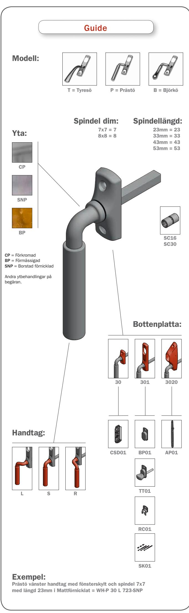

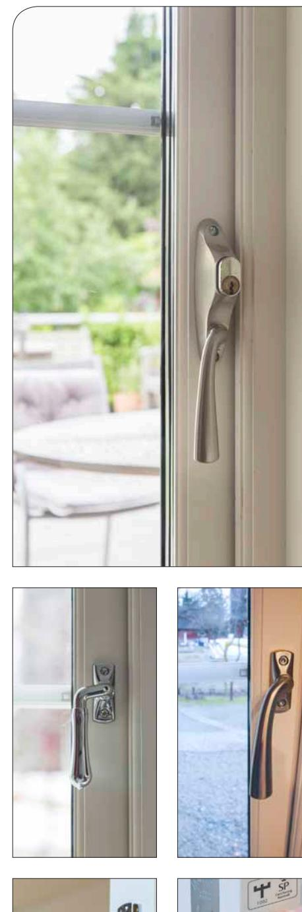

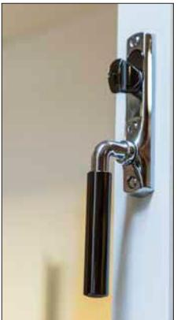

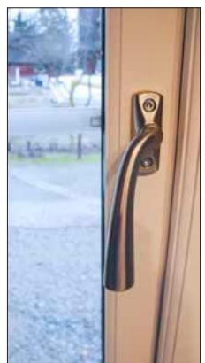

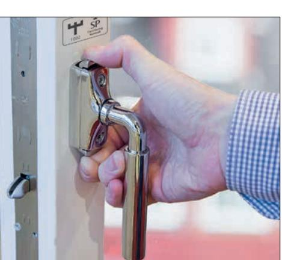

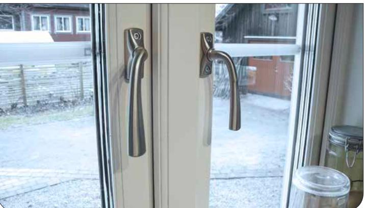

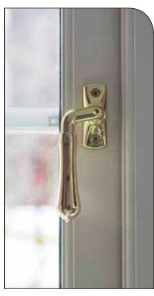

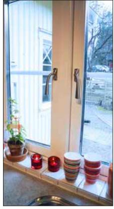

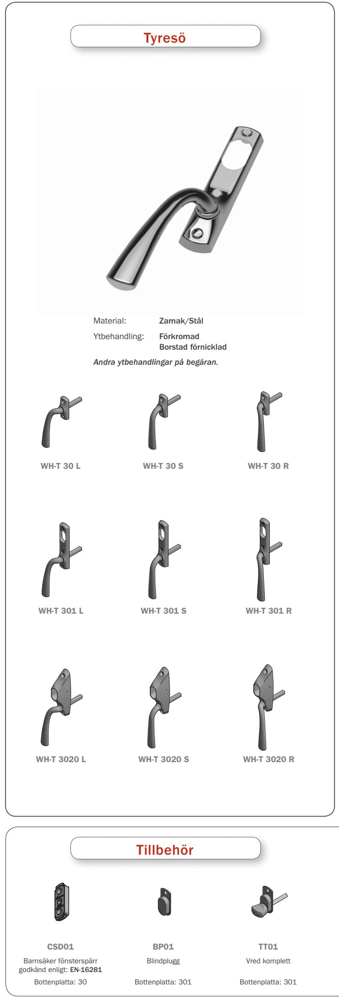

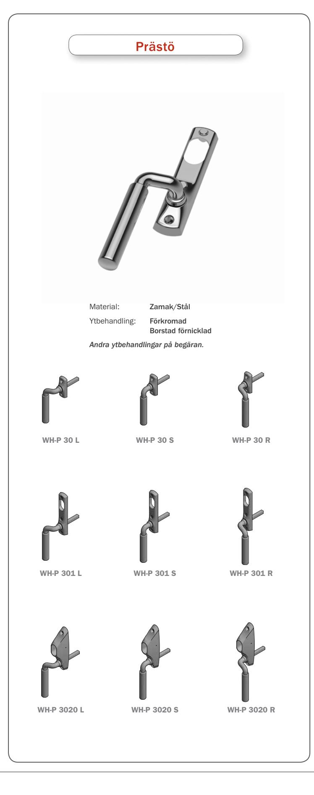

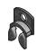

RC01 Rokokocylinder

Bottenplatta: 301

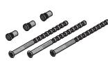

SK01 Skruv kit

Bottenplatta: 301

AP01

Underläggsskylt

Bottenplatta: 3020

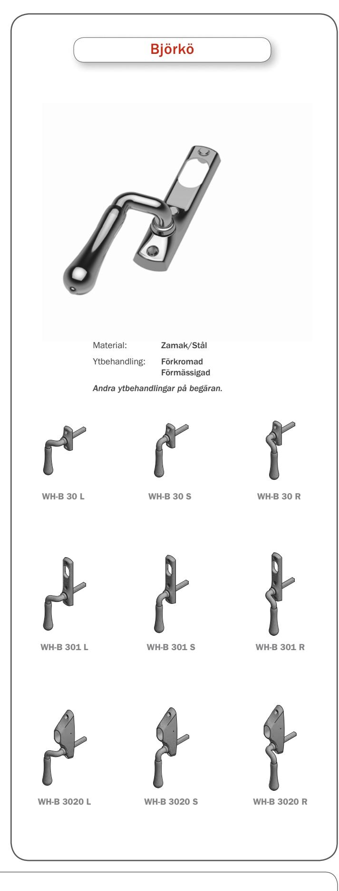

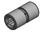

SC16/SC30 Handtagskoppling mellan 2 spindlar

CP = Förkromad BP = Förmässigad SNP = Borstad förnicklad

## Om serien

- *En komplett serie fönster och fönsterdörrhandtag.*
- *Passar de flesta tidsepoker.*
- *Både för invändigt och utvändigt montage.*
- *Med eller utan cylinderlåsning.*
- *Barnsäker handtagsspärr enligt EN-16281.*

 *Olika fönstertyper i ett objekt, samma utseende på alla fönsterhandtagen.*

- *Passar till: utåtgående*
	- *inåtgående*
	- *dreh-kip*
	- *vridfönster.*

Nationalromantikens 1910

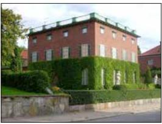

1920

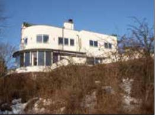

Funktionalism (Modernism) 1930

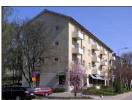

1940

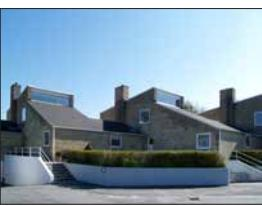

1950

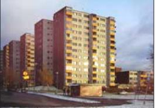

Postmodernismen 1970

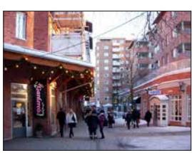

1960

1980

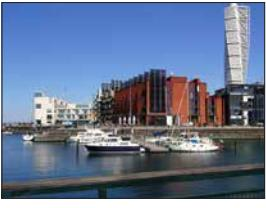

2000

1990

*The ROCA stands for quality, design and stainless performance. Since more than 40 years ROCA Industry is producing stainless products for demanding applications.*

## rocaindustry.com