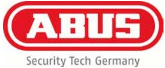
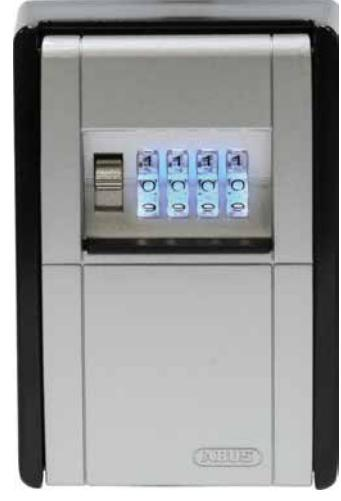

## **KeyGarage™ 787 LED**

Sida 1 av 1

## **Teknik**

- Stabilt metallhus
- Lucka av tryckgjuten zink med sifferhjul
- 4-siffrig kod som kan väljas fritt
- Belysta siffervalsar ger bättre läsbarhet vid dåliga ljusförhållanden
- Lysdioderna lyser ca 30 sekunder
- Lätt utbytbara, vanliga knappcellsbatterier (CR2032), livslängd vid normalanvändning (1x/dag) ca 2 år
- Skyddslock med skjutmekanism
- Väggfäste med skruvförband
- Plats för upp till 14 plastkort eller 20 nycklar (787 LED) eller upp till 30 plastkort eller 50 nycklar (787 BIG LED)
- Uttagbar nyckelkrok för mer komfort vid förvaring av nycklar
- Husets yttermått: 84 x 120 x 42 (787 LED) / 84 x 120 x 62 (787 BIG LED)

## **Användningsområden**

- För säker förvaring av nycklar och små värdesaker för behöriga personer
- Snabb och smidig åtkomst för många olika användare (t.ex. hantverkare, servicepersonal, sommargäster, biluthyrning, flerfamiljshus)
- De som ska ha tillgång till nycklarna behöver bara veta vad koden är
- För väggmontering inomhus eller i ett skyddat område utomhus
- Kodlås med LED-ljus för bättre läsning i mörker

## **Varianter**

Powered by TCPDF (www.tcpdf.org)

- Färg: svart/silver
- 797 LED: KeyGarage™ för fastsättning med bygeln t.ex. på dörrvred

KeyGarage™ för väggmontering