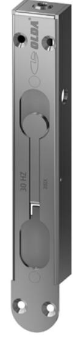
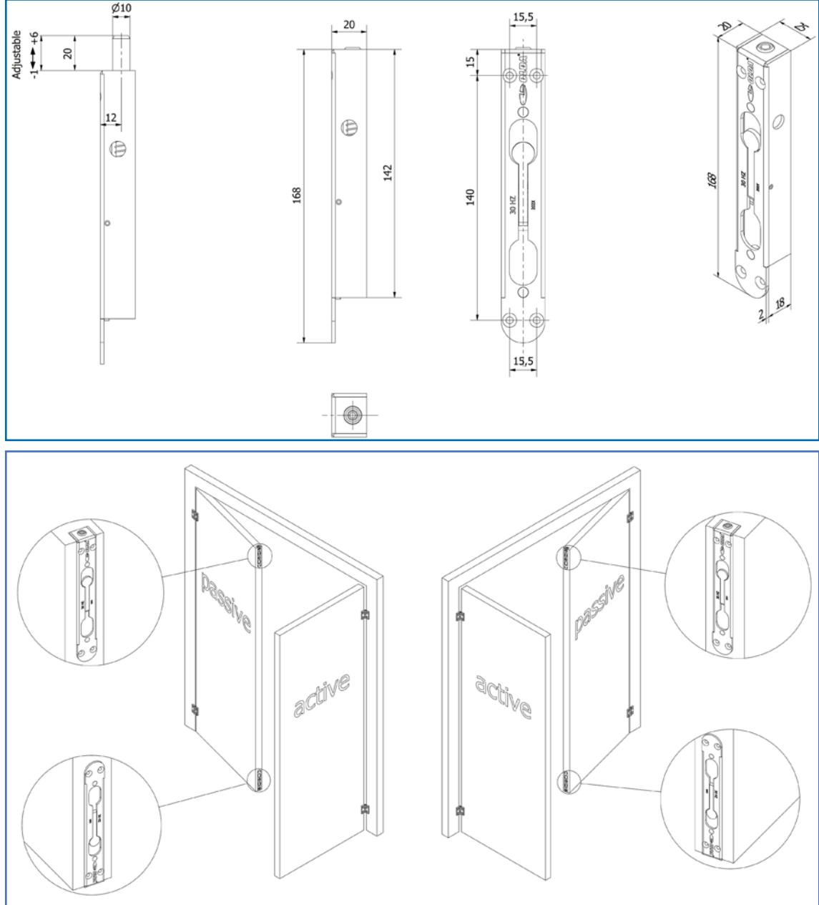

# **Manuell kantregel OLDA 30 HZ**

# **Funktion:**

Manuell, enkelverkande kantregel för tvingande regling av passivt dörrblad i pardörrar.

# **Egenskaper:**

OLDA 30 HZ reglas med hävarmssystem och har regeldiameter 10 mm, dorndjup 12 mm samt stolpbredd 25 mm.

Samma dimensioner som automatiska kantreglar OLDA 28 HZ typ 1 och typ 2.

## **Användning:**

Fälls in i trädörrar, upptill och/eller nedtill, i kanten på passiva dörrblad.

## **Montage:**

OLDA 30 HZ monteras infällt i dörrbladskanten, antingen med eller utan urtag för stolpen. Fästs med fyra försänkta 3,5 x 40 mm skruvar.

## **Behör:**

Slutblecket LP 10 fästs med fyra försänkta 3,5 x 16 mm skruvar.

## **Specifikation:**

- Manuell, enkelverkande och tvingande regelfunktion
- Regel:
	- o diameter: 10 mm
	- o projektion: 20 mm
	- o justermån: 1 / + 6 mm
- Rund elförzinkad stolpe av stål
- Produkt:
	- o bredd: 25 mm
	- o höjd: 168 mm
	- o djup: 20 mm
	- o stolptjocklek: 2 mm
- Dorndjup inklusive stolpe: 12 mm
- Material: stål
- Ytbehandling: elförzinkning

# **Relaterade produkter, stolpbredd 25 mm:**

- Manuell kantregel 30 o 30 HZ (11-030-0)
- Automatisk kantregel 28
	- o 28 HZ typ 1 (10-028-1)
	- o 28 HZ typ 2 (10-028-2)
- Förlängda kantregelversioner o 30 HZ (11-130-0)
	- +8, +15, +20 och +30 mm
	- o 28 HZ typ 1 (10-128-1)
		- +8, +15, +20 och +30 mm
	- o 28 HZ typ 2 (10-128-2)
		- +8, +15, +20 och +30 mm

## **Service:**

Funktions- & systemtest rekommenderas en till två gånger per år. Testa, smörj och justera rörliga delar vid behov.

Vid krävande miljöer eller hög passagefrekvens bör kantregeln testas oftare.

# **Garanti:**

Mekaniska produkter med varumärke "OLDA" har 36 månaders fabriksgaranti.

**Produktblad: 30 HZ**

## **Manuell kantregel OLDA 30 HZ**

### **Produktdokument:**

- Mått
- Montering med urtag för stolpe
- Montering utan urtag för stolpe

### **Produktvyer – 2D:**

- PDF
- DXF
- DWG

### **Produktmodeller – 3D:**

- STEP
- DWG
- PDF 3D

### **OLDA produktlänkar:**

- Manuell kantregel 30 HZ
- Automatisk kantregel 28 HZ
- Behör kantreglar
- OLDA kantregelguide
- OLDA beslagsskolan