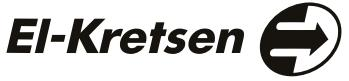

## Certifikat Produkter | WEEE 2024

## Certificate

## **Copiax AB**

Företaget är anslutet till El-Kretsen i Sverige AB och följer därmed förordning SFS 2022:1276 om producentansvar för elutrustning.

El-Kretsen driver ett insamlingssystem och garanterar att insamlade elektriska och elektroniska produkter omhändertas och återvinns på ett miljömässigt och korrekt sätt enligt gällande lagar.

The company is affiliated to El-Kretsen i Sverige AB and is undertaking the ordinance SFS 2022:1276 regarding electrical and electronic products.

El-Kretsen is the business sectors service company for the collection and recycling of electrical and electronic products, and guaranties that the collected and treated electrical and electronic products are recycled correctly according to the ordinance.

VD/CEO Fredrik Benson

