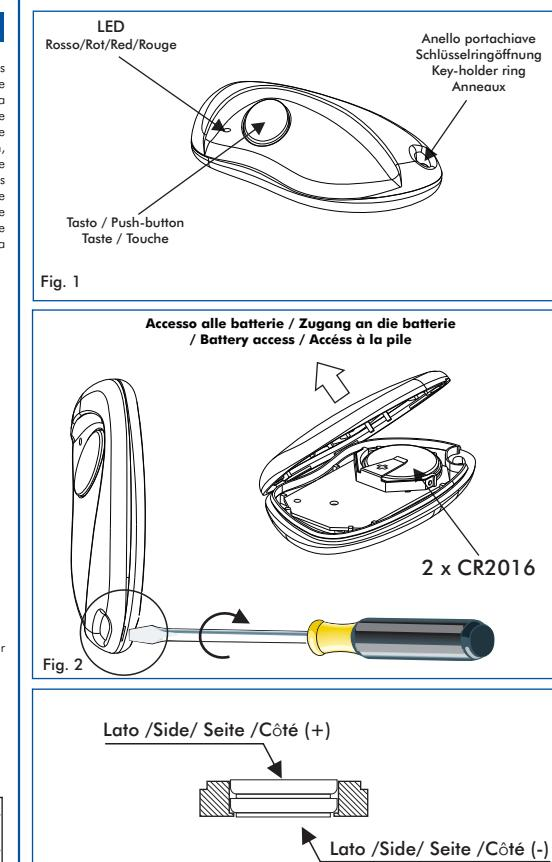

# **TRASMETTITORE SETR2641AM1**

#### **Generalità**

Il trasmettitore SETR2641AM1 è concepito per comandare automatismi di chiusura e sistemi d'allarme grazie ad una codifica ad altissima sicurezza (KeeLoq ® Hopping code). Il codice inviato dal trasmettitore cambia ad ogni attivazione, evitando così il rischio della copia e della sua successiva riproduzione. Un sistema interno permette di mantenere sincronizzati trasmettitore e ricevitore. Il relativo ricevitore viene collegato, in sede di installazione, al meccanismo da comandare ( cancello, porta del garage, serrande, tapparelle, tende, centrale antifurto, illuminazione, ecc.). Tutti i ricevitori della serie Erone 433 sono in grado di apprendere e conservare nella memoria EEPROM il codice di serie e l'algoritmo di sincronizzazione di più trasmettitori.

Lo stesso trasmettitore può essere memorizzato in più ricevitori e quindi assolvere più funzioni. Applicare il ricevitore appropriato a qualche altro meccanismo ( es. l'elettroserratura di una porta pedonale, una suoneria, ecc.) per utilizzare anche i pulsanti rimasti a disposizione. Il fabbricante, CDVI Wireless Spa, dichiara che l'apparecchiatura radio SETR2641AM1 è conforme alla direttiva 2014/53/UE. Il testo completo della dichiarazione di conformità UE è disponibile al seguente indirizzo internet: www.erone.com.

#### **Caratteristiche tecniche**

| 1 canale                    |
|-----------------------------|
| 2 batterie al litio CR 2016 |
| 18 ÷ 24 mesi                |
| 9 mA                        |
| 433.92 MHz                  |
| 64 2                     |
| AM / ASK                    |
| 50 ÷ 100 µW                 |
| 100 ÷ 150 m                 |
| -10 ÷ +55 °C                |
| 61 x 36 x 13 mm             |
| 14 gr.                      |
|                             |

#### **Codifica**

Ogni trasmettitore è prodotto e venduto con un codice seriale di fabbrica differente ed infalsificabile. Il codice effettivamente trasmesso è ottenuto da un algoritmo che combina il numero seriale, un codice costruttore ed un numero di sincronizzazione.

#### **Memorizzazione del codice del trasmettitore nel ricevitore**

Il trasmettitore deve essere memorizzato sul ricevitore o su tutti i ricevitori a disposizione dell'utente. Il Vs. rivenditore provvederà a tale operazione in sede di installazione o Vi darà le opportune istruzioni durante la vendita. Per la memorizzazione, seguire la procedura indicata nelle istruzioni del ricevitore specifico utilizzato.

#### **Accesso al vano batterie**

Per accedere al vano porta batterie, rimuovere il fondo agendo sulla fessura laterale facendo uso di un cacciavite (Fig. 2). Posizionare le 2 batterie con il lato positivo rivolto verso l'alto, così come indicato dal simbolo + inciso sul contatto batteria. *NOTA: Lo smaltimento delle batterie scariche deve essere effettuato facendo uso degli appositi contenitori.*

#### **Diagnostica di guasto**

| Anomalia                                                              | Soluzione                                 |
|-----------------------------------------------------------------------|-------------------------------------------|
| Emissione radio non verificabile Il Led del trasmettitore è spento | Sostituire le batterie del trasmettitore  |
| Emissione radio non verificabile Il Led del trasmettitore è acceso | Verificare l'alimentazione del ricevitore |

## **TRANSMITTER SETR2641AM1**

#### **Product introduction**

The radiocontrol SETR2641AM1 has been designed for the control of automatic closing systems and anti-burglar systems thanks to its very high security coding system.(KeeLoq® Hopping code). The code sent by the transmitter changes at each activation, avoiding any scanning and copying risk. A special algorithm allows to keep syncronysed transmitter and receiver. The operating frequency is among the European harmonised frequencies.The receiver which makes the activation, once received the transmitter code, has to be connected during the installation to the device to control (gate, garage door, rolling shutters, awnings, anti-burglar appliances, lighting ). All the receivers of the same range 433 can store into the EEPROM a serial number, a manufacturer key and a synchronism algorithm of more transmitters. Each transmitter can be stored into different receivers and hence can do more functions. Hereby, CDVI Wireless Spa, declares that the radio equipment type SETR2641AM1 is in compliance with directive 2014/53/EU. The full text of the EU declaration of conformity is available at the following internet address: www.erone.com.

#### **Technical specifications**

| Number of keys:        | 1                           |
|------------------------|-----------------------------|
| Supply :               | 2 lithium batteries CR 2016 |
| Battery life:          | 18 ÷ 24 months              |
| Current consumption :  | 9 mA                        |
| Operating frequency :  | 433.92 MHz                  |
| Code combinations :    | 64 2                     |
| Modulation :           | AM / ASK                    |
| Rated e.r.p. :         | 50 ÷ 100 µW                 |
| Range in free space:   | 100 ÷ 200 m                 |
| Operating temperature: | -10 ÷ +55 °C                |
| Overall dimensions:    | 61 x 36 x 13 mm             |
| Weight:                | 14 gr.                      |
|                        |                             |

#### **Coding**

Each transmitter is manufactured and sold with a different univocal serial number set-in-factory. The real transmitted code is the result of a special algorithm which combines a serial number, a manufacturer key and a syncronisation number.

#### **Memorization**

The transmitter security code has to be stored onto the receiver or the receivers memory available. Your own installer or reseller will perform this operation during the installation or will give you the necessaries instructions during the selling. Ask your installer the best suitable receiver.

#### **Battery access**

To access the battery open the case with a screwdriver acting on the slot between the cover and the bottom and remove the bottom, as shown in fig. 3a and 3b. Slide out the old batteries and replace them with the new ones [CR2016] respecting the polarity, with the positive (+) side upward. *NOTE: Please dispose of the batteries properly according to local laws and regulations. Test proper battery installation by verifying that the red LED illuminates when the button is pushed.*

#### **Troubleshooting**

| Fault                                                              | Solution                          |
|--------------------------------------------------------------------|-----------------------------------|
| The radio emission isn't verifiable The transmitter led is OFF. | Replace the transmitter batteries |
| The radio emission isn't verifiable The transmitter led is ON.  | Check the receiver supply         |
|                                                                    |                                   |

# **HANDSENDER SETR2641AM1**

#### **Allgemein**

Attraktives ergonomisches Design vereint mit der Rolling Code Technologie von Keeloq, ergeben einen Handsender mit einem hohen Grad an Sicherheit und Zuverlässigkeit. 2 hoch 64 Kombinationsmöglichkeiten in Verbindung mit einer dynamischen Kodifizierung und höchster Unverletzlichkeit durch sich algorithmisch ändernde Codes. Der hersteller, CDVI Wireless Spa, behauptet dass das funkgerät entsprechend der vorschrift 2014/53/UE ist. Die komplete beschreibung UE befindet sich unter dieser internet adresse: www.erone.com. SETR2641AM1

#### **Technische Eigenschaften**

| Anzahl der Funktionen:        | 1 Kanal                     |
|-------------------------------|-----------------------------|
| Spannungsversorgung:          | 2 x Batterie Lithium Cr2016 |
| Batterielebensdauer:          | 18 24 Monate ÷           |
| Stromverbrauch:               | 9 mA                        |
| Frequenz:                     | 433,92 MHz                  |
| Anzahl der Codes-Kombination: | 2 hoch 64                   |
| Modulation:                   | AM / ASK                    |
| Nennleistung E.R.P.:          | 50 100 µW ÷              |
| Reichweite in freiem Raum:    | 100 150 m ÷              |
| Temperatur von Funktionieren: | -10°C ÷ +55°C         |
| Abmessungen:                  | 61 x 36 x 13 mm             |
|                               |                             |

#### **Codierung**

Jeder Handsender wird mit einem seriell unterschiedlichen und nicht reproduzierbaren Bau-Code erstellt und verkauft. Der tatsächlich übertragene Code wird von einem Algorithmus erhalten, der sich aus Seriennummer, dem Bau-Code und einer Synchronisierungsnummer zusammenstellt.

#### **Speicherung des handsenders im empfanger**

Der Handsender wird im Empfänger gespeichert oder in allen Empfänger des Benutzers. Die einzelnen Tasten werden entsprechend der Bedienungsanleitung Ihres Empfänger eingelernt.

#### **Zugang an die batterie**

Die farbig abgesetzte untere Batterieabdeckung an der Unterseite des Handsenders an der Schlüsselringöffnung nach außen ziehen. ( Fig. 2) Das Batteriefach wird herausgeschwenkt und die Batterie kann gewechselt werden.

#### **Fehler diagnose**

| Fehler                                                                       | Losung                                  |
|------------------------------------------------------------------------------|-----------------------------------------|
| Die Aussendung ist nicht prüfbar. Die Led des Handsenders leuchtet nicht. | Die Batterien des Handsenders ersetzen. |
| Die Aussendung ist nicht prüfbar. Die Led des Handsenders leuchtet.       | Die Einspeisung des Empfängers prüfen.  |
| Die Led des Handsenders blinkt.                                              | Die Batterien des Handsenders ersetzen. |

# **EMETTEUR RADIO SETR2641AM1**

#### **Informations générales**

Le contrôle radio Erone type SETR2641AM1 a été fabriqué pour le contrôle de systèmes automatiques de fermeture et systèmes Antivol. Cela grâce à un système d'encodage de haute sécurité. (KeeLoq® Hopping code). Afin d'assurer une sécurité et une inviolabilité totale de la transmission entre émetteur et récepteur, le code émis par l'émetteur est changé à chaque transmission et reconnu seulement par le récepteur, grâce à un calcul d'encodage infalsifiable évitant tout risque d'enregistrement ou de copie de code. Le récepteur qui met en route l'activation, doit-être connecté durant l'installation, au mécanisme de contrôle.(portail, porte de garage, porte coulissante, stores, dispositif anti-vol, éclairage). Chaque émetteur, peuvent-être programmés dans différents récepteurs et peuvent avoir plusieurs fonctions. Afin d'utiliser les clefs inutilisées de l'émetteur, il suffit de connecter le récepteur dédié au mécanisme de transmission.(i.e fermeture électrique d'un portail pour piétons, buzzer etc.). Le fabricant, CDVI Wireless Spa, déclare que le produit radio SETR2641AM1 est conforme à la directive 2014/53/UE. Le texte intégral de la déclaration de conformité est disponible à l'adresse internet suivante: www.erone.com.

#### **Caracteristiques principales**

- Nombre de clefs: 1 Alimentation : 6 Vdc Batteries 2 Batteries lithium Cr2016 Durée de vie de la pile: 12 ÷ 18 mois Consommation courante : 9 mA Code de sécurité: Keeloq Fréquence : 433.92 MHz 64 Nombre de combinaisons : 2 Modulation : AM / ASK Puissance e.r.p. émise : 50 ÷ 100 µW Portée en espace libre: 100 ÷ 150 m Température de fonctionnement: -10 ÷ +55 °C Dimensions: 61 x 36 x 13 mm Poids: 14 gr.
® Hopping code

#### **Encodage**

Chaque émetteurs de la gamme sont fabriqués et vendus avec un numéro de série unique attribué en usine. Le code transmit est le résultat d'un algorithme qui combine le numéro de série, une clé de fabrication et numéro de synchronisation. Le code sécurité de l'émetteur doitêtre enregistré sur le récepteur ou la mémoire disponible des récepteurs.

#### **Memorisation**

Votre installateur ou revendeur fera cette opération lors de l'installation ou vous donnera les instructions nécessaires lors de la vente. N'oubliez pas que les boutons restants de votre émetteur peuvent être utilisés pour de futures fonctions. Demandez à votre installateur le récepteur le mieux adapté à votre besoin.

#### **Accéss à la pile**

Pour accéder aux batteries, enlever avec un tournevis le fond de la boîte en agissant sur la fente latérale (Fig. 2). Positionner les 2 batteries avec le côté positif tourné vers le haut, comme indiqué par le symbole + gravé sur le contact batterie.

*NOTE: L'écoulement des batteries déchargé doit être effectué en utilisant les récipients spéciaux.*

| Problémes                              |                                               |
|----------------------------------------|-----------------------------------------------|
| Defaut                                 | Solution                                      |
| Absence de signal radio LED éteinte | Replacer la batterie de l'émetteur            |
| Pas d'activation: LED allumeé          | Vérifier le recepteur alimentation électrique |

Fig. 3

### **GARANZIA**

La garanzia è di 24 mesi dalla data di fabbricazione apposta all'interno. Durante tale periodo se l'apparecchiatura non funziona correttamente a causa di un componente difettoso, essa verrà riparata o sostituita a discrezione del fabbricante. La garanzia non copre l'usura della batteria e l'integrità del contenitore plastico. La garanzia viene prestata presso la sede del fabbricante.

## **GUARANTEE**

The guarantee period of all Erone products is 24 months, beginning from the manufacturer date. During this period, if the product does not work correctly, due to a defective component, the product will be repaired or substituted at the discretion of the producer. The guarantee does not cover the plastic container integrity. After-sale service is supplied at the producer's factory.

### **GARANTIE**

Emetteur fabriqué et vendu avec un numéro de série unique sélectionné lors de la fabrication. Période de garantie : 24 mois à compter de la date de fabrication, uniquement pour les composants électronique, ne couvrant pas le boîtier.

## **GARANTIE**

Die Garantie beträgt 24 Monate vom Innen angezeigten Herstellungsdatum. Die Garantie umfasst die Funktion der elektronischen Bauteile unter Voraussetzung des korrekten Anschlusses. Die Garantie umfasst keine äußeren Beschädigungen am Gehäuse durch Fremdeinwirkung oder falsche Installation. Die Garantie wird beim Sitz des Herstellers geleistet.

> Manufactured by CDVI Wireless Spa Via Piave, 23 - 31020 San Pietro di Feletto (TV) - Italy Tel.: +39/0438/450860 - Fax.: +39/0438/455628 Numero verde: 800.53.46.46 E-Mail: info@erone.com Web: www.erone.com

