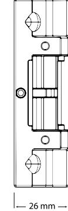
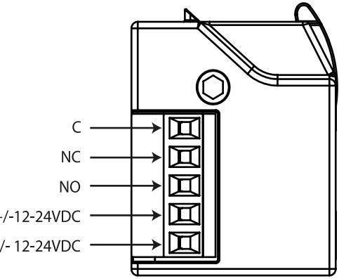

# INSTALLATIONSANVISNING SAFETRON ES17

Måttritning ES 17 SAFETRON ES17 är ett elslutbleck av typen standard med listtrycksteknik som passar till branddörrar med normalt ställda krav på säkerhet men höga krav på driftsäkerhet. ES17 passar bra som daglåsning i skalskydd och internlåsning inom handel, kontor och industri eller i entréer och allmänna utrymmen i flerbostadshus.

SAFETRON ES17 är certifierat och CE-märkt för användning i brandcellsgränser högst brandteknisk klass 120 min. OBS! gäller endast rättvänd funktion.

SAFETRON ES17 har listtrycksteknik vilket innebär att låset öppnar trots att tryck mot dörren föreligger. Listtryck är ett normalt förekommande fenomen ofta orsakat av exempelvis övertryck i fastigheten, skeva dörrar eller att snö/grus hamnat i dörrsprin- gan. ES 7 eliminerar dessa problem och förhindrar onödiga driftstopp.

Tack vare sin litenhet passar ES17 i praktiskt taget alla urtag förberedda för elslutbleck av typen standard. Den lilla storleken tillåter även 150mm montagestolpar anpassade för innerdörrar.

ES17 klarar multispänning 12-24VDC. Detta effektiviserar lagerhållning och urvalet blir enklare vid projektering. ES17 finns i rättvänd eller omvänd funktion samt med kolvkontakt som tillval.

### Egenskaper

## • Listtryck: 50 kg

- Hållkraft upp till 1000 kg / 10kN
- Omvänd- eller rättvänd funktion
- Multispänning 12-24VDC (-10% +15%)
- Kolvkontakt som tillval
- Passar låshus enligt skandinavisk standard med enkel- eller dubbelfallås

### Tekniska data

- 12-24VDC
- Strömförbrukning: 35mA
- Mikrobrytare: 30VDC: 500mA

| ART NR      | BENÄMNING   | FUNKTION                       | SPÄNNING  |
|-------------|-------------|--------------------------------|-----------|
| 202 144 750 | ES 17 PTO   | Rättvänd funktion              | 10-30 VDC |
| 202 144 761 | ES 17 PTL   | Omvänd funktion                | 10-30 VDC |
| 202 144 751 | ES 17 M PTO | Rättvänd funktion, kolvkontakt | 10-30 VDC |
| 202 144 762 | ES 17 M PTL | Omvänd funktion, kolvkontakt   | 10-30 VDC |

### Montering

- Montera originalstolpen på elslutblecket med de två medföljande skruvarna M4x6
- Dörrspringan mellan låshusets stolpe och elslutbleckets stolpe skall vara 2-5mm för att få god funktion.
- Mellan vridfall och låshusets fallkolv skall det vara ett glapp på 0,5-1,5mm.
- Se till att urtaget för elslutblecket är ordentligt rengjort. Borr och filspån kan störa elslutbleckets funktion.
- Se till att inga kablar kläms när elslutblecket monteras in i karmen.
- Använd skruv för fastsättning av stolpen som är avsedd för karmens material.
- Elslutblecket får ej övermålas.

### Underhåll

- Vid behov eller 2 ggr/år smörj vridfallet och låskolvens glidytor med ett tunt lager låsfett.
- Kontrollera elslutbleckets funktion och fastsättning med jämna mellanrum eller 2 ggr/år.
- Låsets elektriska delar är underhållningsfria.
- Kontrollera och justera vid behov att dörren stängs korrekt. För att uppnå detta kan t.ex. dörrens gångjärn liksom dörrstängare behöva justeras. En dålig dörrfunktion påverkar låsfunktionen negativt.

### Kopplingsschema

