SAFE

TRON

# MANUAL
ELTRYCKESLÅS SL620 SE

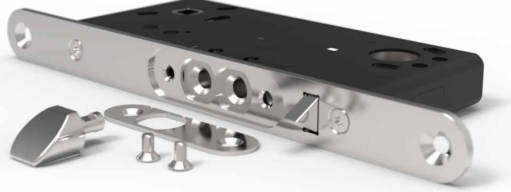

### **VIKTIG INFORMATION**

Säkerhetsegenskaperna för produkt är avgörande för dess överenstämmelse med EN 14846:2008. Modifikationer eller andra ändringar på installation/produkter utöver de som beskrivs i denna dokumentation är inte tillåtna. SAFETRON tar inget ansvar för produkter som inte monterats i enlighet med gällande anvisningar eller då underhållsinstruktioner inte följs.

- SAFETRON eltryckeslås i 600-serien är elektriska lås som används i dörrar med normalt ställda krav på säkerhet. Låsen finns i olika utföranden för olika typer av användningsområden och säkerhet. Eltryckeslås används med fördel där krav på en snabb låsning finns och kan användas på såväl lätta innerdörrar till tunga ytterdörrar.
- Brandklassning med hänvisning till testrapport med nummer: **PGA11645A_rev1**. Testet utfördes med en enkeldörr i stål.
- Vid användning i brandcellsgränser måste eltryckeslås i 600-serien användas i kombination med en certifierad dörr.
- Kontrollera dörrens eventuella brandcertifikat för att säkerställa att det inte finns villkor i certifikatet som utesluter eller begränsar användning av SL620/SL621.
- Innan man monterar ett elektriskt lås bör man kontrollera att dörren hänger korrekt och att dörrbladet löper fritt. Det är inte rekommenderbart att installera SAFETRON eltryckeslås i dörrar med ihålig kärna. Kontrollera att dörrens konstruktion medger montage av lås, exempelvis genom kontroll av dolda gångjärn, att dörrblad som greppar i varandra kan öppnas samtidigt, att dörrspringan mellan dörrblad är 3 mm +/- 1mm samt att rörliga delar inte påverkar varandra.
- SAFETRON lås får monteras i enkeldörrar eller pardörrar av trä, stål eller aluminium. Dörrvikt: upp till och över 200kg.
- Lås tillverkade enligt SS-EN 14846:2008 ger en hög grad av rimlig säkerhet förutsatt att de monteras på dörrar och karmar i gott skick.
- Beaktande skall vidtas för säkerställande av att eventuella tätningar eller tätningslister inte hämmar låsets funktion.
- Se till att rätt lås monteras för den avsedda dörrmiljön (se produktkatalog)
- Montagesättet skiljer sig inte mellan olika typer av dörrar, typ trä/metall.
- Fastställda anvisningar måste följas noga under installationen. De här instruktionerna måste överföras av installatören till användaren.
- Alla komponenter specificerade för installationen skall användas för att uppfylla europastandard SS-EN 14846:2008.
- Kontrollera låsets kolvar så att de i indraget läge inte förhindrar dörrens öppnings- och stängningsfunktion (se underhåll)
- Där lås monteras på dubbeldörrar (pardörrar) krävs att dörrstängare används som har dörr koordinator enligt EN 1158 (se standard) för att säkerställa rätt stängnings sekvens.
- Produkterna får inte användas i dörrar som kan öppnas åt båda hållen, typ svängdörr eller pendeldörr.

### **INSTALLATION**

#### **Läs igenom och följ installationsanvisningarna!**

- För en god funktion skall dörrspringan mellan låshusets stolpe och slutbleck vara 3mm +/- 1mm.
- Undvik fil- och smärgelspån. Efter att urtaget gjorts i karmen skall det rengöras ordentligt.
- Se till att kabel inte kläms eller skadas vid montering.
- Kabel av typ data/tele/signal (enkelledare) med area mindre än 0,2 får inte användas till spänningsmatning av låset. Kabelarea ska vara dimensionerad utifrån de förutsättningar som gäller.
- Vid gemensam matning av flera lås/passagesystem/läsare/centraler och dylikt skall den sammanlagda strömförbrukningen tas i beaktande vid beräkning av kabelarea.
- Garanti bortfaller vid felaktigt montage, inkoppling eller vid användande av tillbehör som inte är rekommenderat av SAFETRON.
- SAFETRON ger ingen funktionsgaranti på installationer som inte följer rekommendationer.

# **UNDERHÅLL**

#### **Underhåll av lås ska utföras av utbildad fackman. Vid normal användning smörjes låshusets mekaniska delar 1 gång per år. Använd ett smörjmedel som inte Innehåller grafit eller lösningsmedel.**

- Kontrollera att monterade vred, trycken och cylindrar fungerar tillfredsställande. Vid behov smörj och/eller justera
- Vid högfrekvent användning smörjes låshusets mekaniska delar efter behov.
- Låshusets elektriska delar är underhållsfria
- Kontrollera och justera vid behov att dörren stängs korrekt. För att uppnå detta kan t.ex. dörrens gångjärn liksom dörrstängare behöva justeras. En dålig dörrfunktion påverkar låsfunktionen negativt

SAFETRON lås i 600-serien är elektromekaniskt styrda tryckesfunktionslås i modulutförande i rättvänd och omvänt utförande, ställbara för höger/vänster hängda dörrar och med eller utan split funktion.

För mer information om användningsområde och tillbehör se www.safetron.com.

#### Tekniska data

#### SAFETRON SL620/SL621

- Multispänning: 12-24VDC (-10% / +25%)
- Strömförbrukning: 40mA @ 24VDC
- Strömförbrukning Vila: 0mA
- Arbetstemperatur: -25°C till +70°C
- Givare Dörravk: Max 250mA 30VAC/VDC, 10W

#### Egenskaper

#### SAFETRON SL620/SL621

- Justerbar kolvplacering
- Fallkolv utsprång: 14mm
- Dorndjup: 50mm
- Tryckespinne: 8mm
- Ställbara funktioner: Split höger, Split vänster, Upplåst, Enkel funktion

#### SAFETRON SL620 / SL621 är testade och certifierade i enlighet med EN 14846: 2008

| Category of use | Durability and load on latch | Door mass and closing force | Suitability for use on fire / smoke doors | Safety | Corrosion resistance and temperature | Security and drill resistance | Security electrical function | Security electrical manupilation |
|-----------------------|------------------------------------|--------------------------------------|-------------------------------------------------------|--------|-----------------------------------------------|----------------------------------------|------------------------------------|----------------------------------------|
| 3                     | X                                  | 6                                    | F                                                     | 0      | L                                             | 1                                      | 1                                  | 1                                      |

#### Produkterna uppfyller följande krav enligt SS-EN 14846: 2008

Uppfyller kraven för brandcellsgränser: 120 min

#### SAFETRON SL620 / SL621 är tillsammans med nödutrymningsbehör 793 och 794 testade och certifierade i enlighet med SS-EN 179:2008

#### Produkterna uppfyller följande krav enligt SS-EN 179:2008

| Category of use | Durability | Door mass and closing force | Suitability for use on fire / smoke doors | Safety | Corrosion resistance and temperature | Security | Projection of operating element | Type of operation | Field of door application |
|-----------------------|------------|--------------------------------------|-------------------------------------------------------|--------|-----------------------------------------------|----------|------------------------------------------|-------------------------|---------------------------------|
| 3                     | 7          | 7                                    | B                                                     | 1      | 3                                             | 5        | 2                                        | A                       | B                               |

### **TILLBEHÖR**

#### **Beskrivning Art nr**

| Anslutningskabel C02 (10m) | 202144628 |
|----------------------------|-----------|
| Nödbeslag 793 H            | 202144777 |
| Nödbeslag 793 V            | 202144799 |
| Nödbeslag 794 H            | 202144840 |
| Nödbeslag 794 V            | 202144841 |
| Slutbleck 105-1            | 202144635 |
| Slutbleck 105-2            | 202144609 |
| Infälld magnet (12mm)      | 202144596 |
| Karmöverföring CT81        | 202144719 |

| 44777                                                                                                                                                                         |  |
|-------------------------------------------------------------------------------------------------------------------------------------------------------------------------------|--|
| 44799                                                                                                                                                                         |  |
| 44840                                                                                                                                                                         |  |
| 44841                                                                                                                                                                         |  |
| / / / / / / / / / / / / / / / / / / / / / / / / / / / / / / / / / / / / / / / / / / / / / / / / / / / / / / / / / / / / / / / / / / / / / / / / / / / / / / / / / / / / / / / |  |

### **UTFÖRANDEN**

#### Enkel funktion

Både utsidans och insidans trycke är elektriskt styrt och därmed behövs alltid elektrisk aktivering för passering. På insidan behövs en öppnaknapp eller ett kodlås/passersystem, det sistnämnda alternativet används med fördel om man vill höja övervakningen ytterligare.

#### Split funktion

Split funktion innebär att utsidans trycke är elektriskt styrt medan insidans trycke alltid är mekaniskt påkopplat och därigenom alltid medger en mekanisk utpassage. På detta sätt slipper man en öppnaknapp på insidan.

#### Upplåst

I upplåst läge är både ut och insidans trycke mekaniskt påkopplade vilket innebär att låset kan användas innan det driftsatts t.ex. på en byggarbetsplats där dörrar monterats men ännu inte passersystem. Välj upplåst läge via funktionsväljaren och montera beslagen på dörren, därefter kan dörren användas normalt.

### **INKOPPLING**

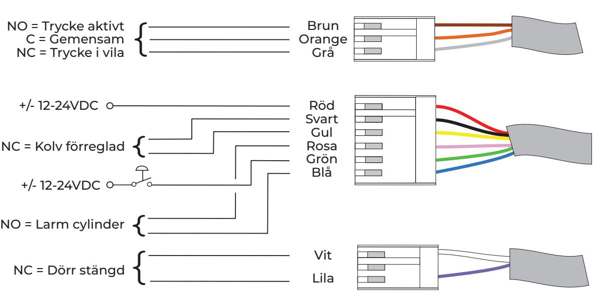

Det är viktigt att strömförsörjningen har rätt dimensionerad kabel för att inte få spänningsfall som stör låsets funktion.

Vid gemensam matning av flera lås/passagesystem/läsare/centraler och dylikt skall den sammanlagda strömförbrukningen tas i beaktande vid beräkning av kabelarea.

Kabel av typ data/tele/signal (enkelledare) med area mellan 0,1-0,2 får inte användas som spänningsmatning av eltryckeslås.

| Minsta rekommenderade kabelarea |         |         |         |         |         |  |  |
|---------------------------------|---------|---------|---------|---------|---------|--|--|
|                                 | 0-10M   | 11-20M  | 21-40M  | 41-80M  | 81-100M |  |  |
| 12-24V                          | 0,17mm² | 0,34mm² | 0,68mm² | 1,36mm² | 1,7mm²  |  |  |

Magnet justeras in emot typbeteckning på låshusets stolpe.

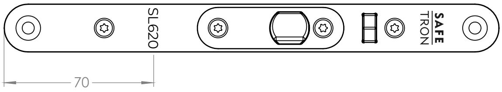

## **OMSTÄLLNING HÖGER-VÄNSTER**

### Ändring av fallkolv

- 1. Lossa fixerskruv med insexnyckel 2.5mm.
- 2. Ta ut fallkolven och vänd den.
- 3. Tryck in fallkolven och skruva åter fixerskruv.

### **OMSTÄLLNING SPLIT FUNKTION**

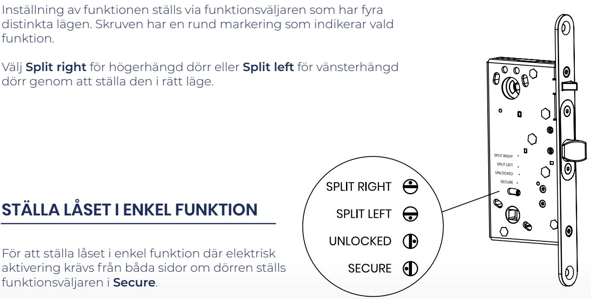

# **STÄLLA LÅSET I UPPLÅST LÄGE**

För att ställa låset i upplåst läge där båda sidorna är mekaniskt öppna ställs funktionsväljaren i **Unlocked**.

### ÄNDRING AV KOLVPLACERING

### "MODERN" KOLVPLACERING

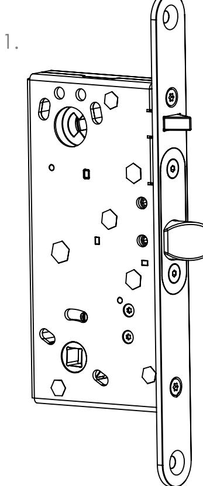

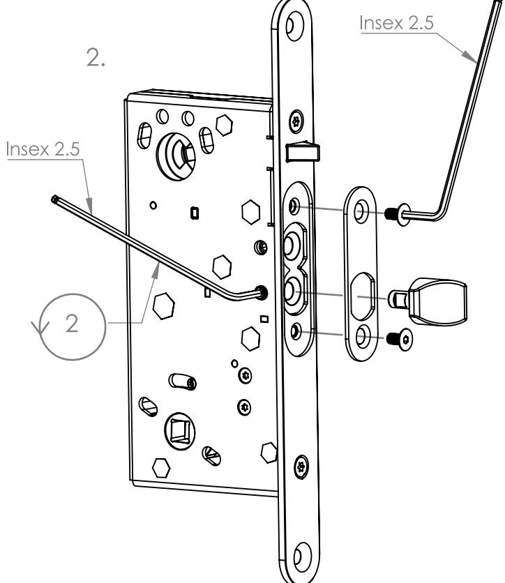

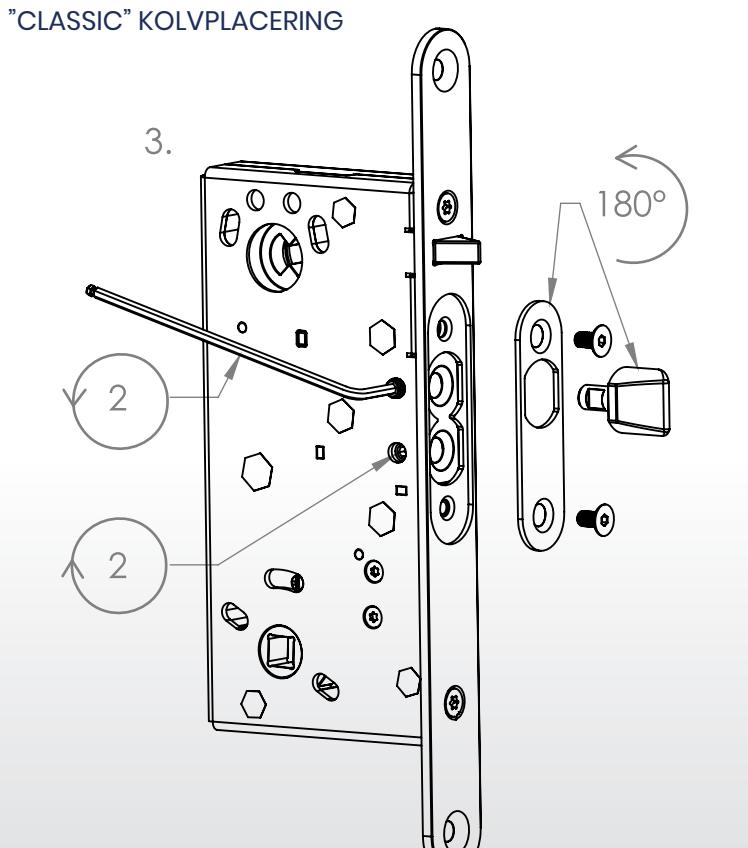

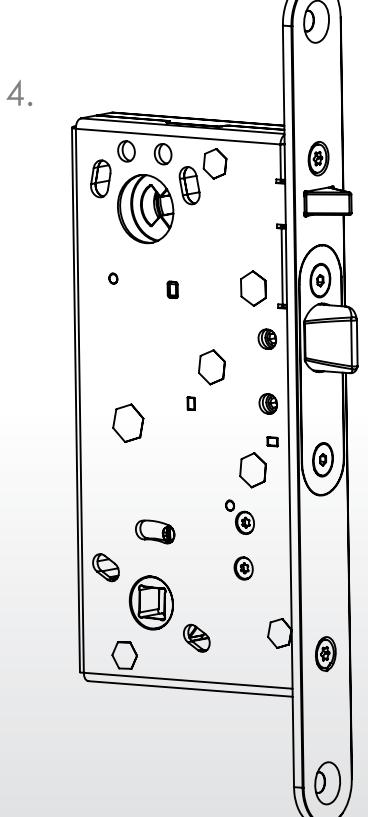

### **MÅTTRITNING**

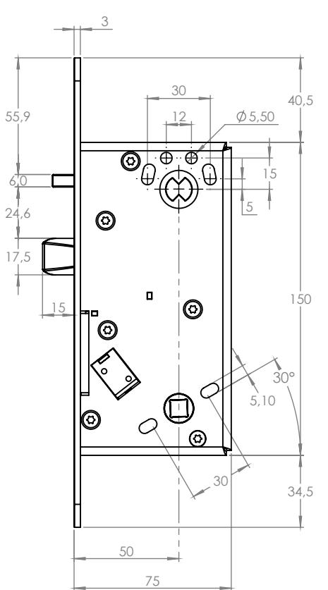

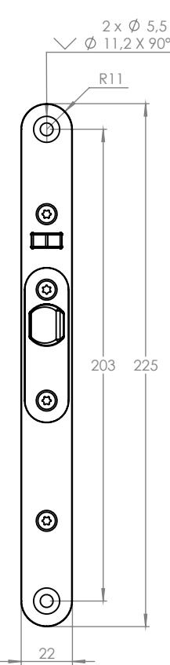

### **Måttritning**

SL 620 SL 621

### **Kolvplacering:**  Classic

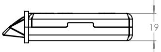

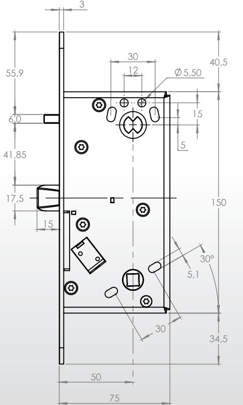

### **Måttritning**

SL 620 SL 621

### **Kolvplacering:**  Modern

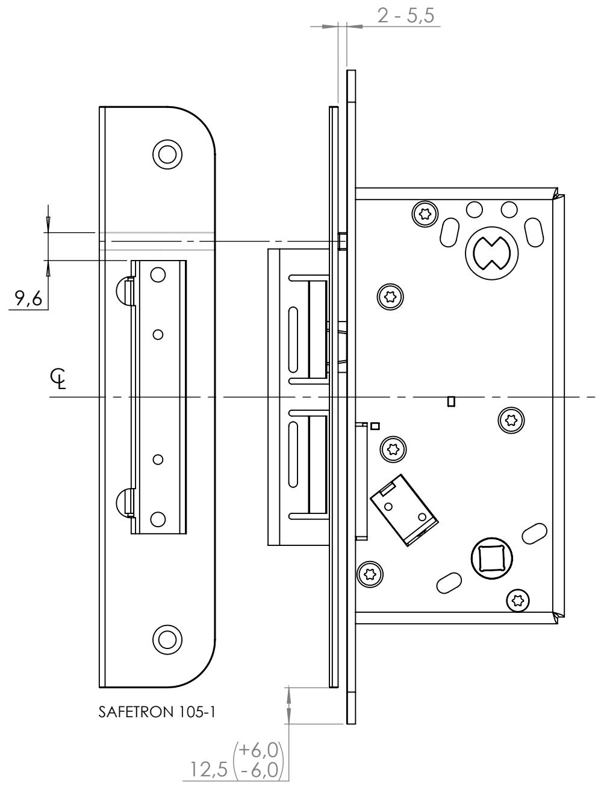

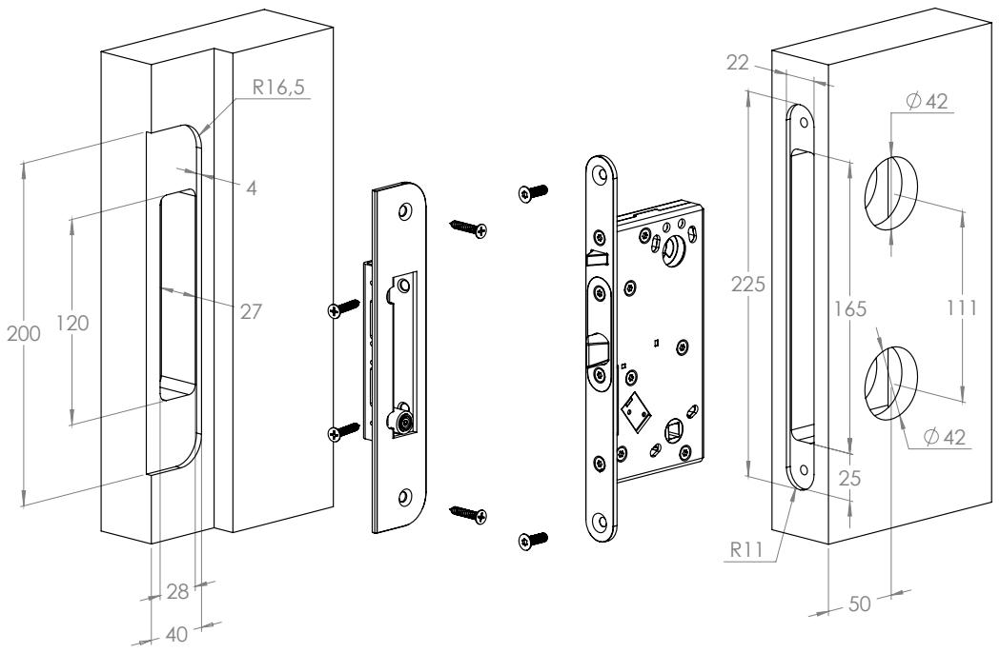

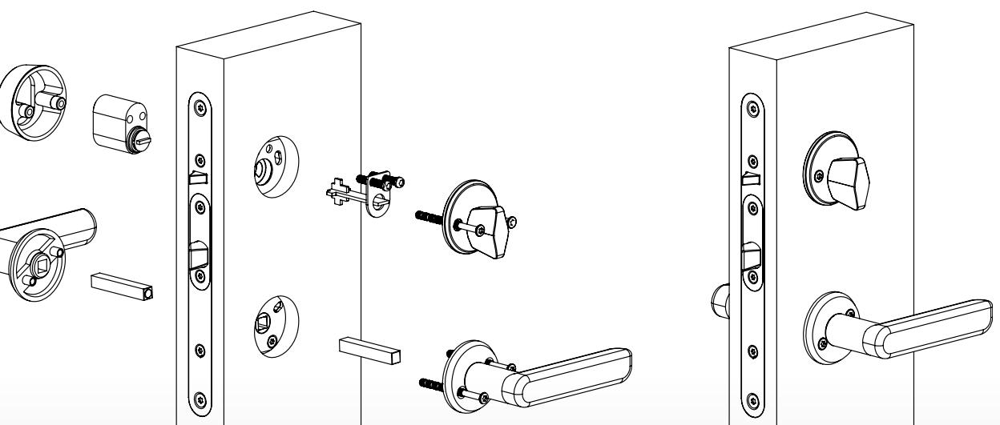

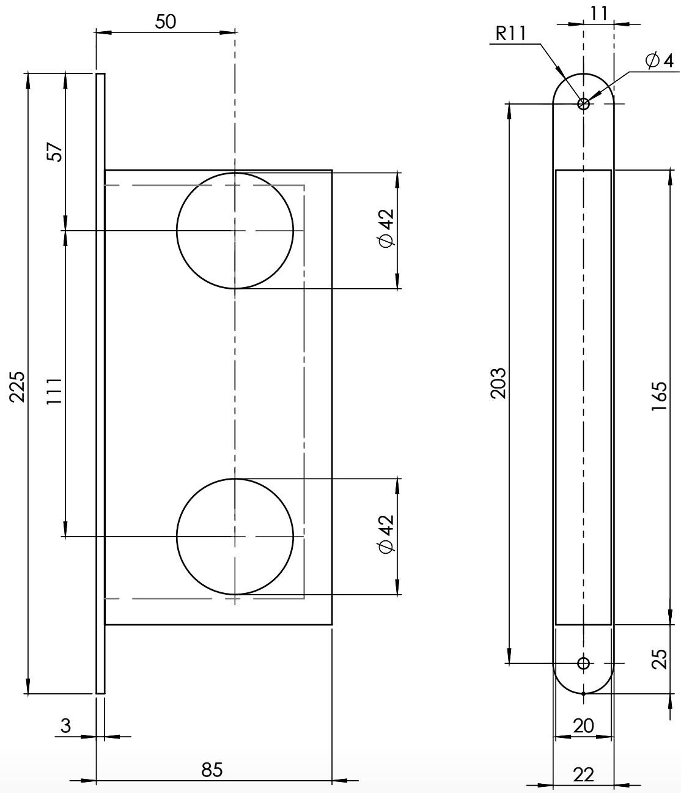

(Lock case depth 75 mm) (Lock case depth 75 mm)

#### **UNDERHÅLL AV SAFETRON ELTRYCKESLÅS**

- Underhåll av lås ska utföras av utbildad fackman
- Kontrollera att monterade vred, trycken och cylindrar fungerar tillfredsställande
- Vid behov smörj och/eller justera
- Vid normal användning smörjes låshusets mekaniska delar 1 gång per år. Använd ett smörjmedel som inte innehåller grafit eller lösningsmedel
- Vid högfrekvent användning smörjes låshusets mekaniska delar efter behov.
- Låshusets elektriska delar är underhållsfria
- Kontrollera och justera vid behov att dörren stängs korrekt. För att uppnå detta kan t.ex. dörrens gångjärn liksom dörrstängare behöva justeras. En dålig dörrfunktion påverkar låsfunktionen negativt

#### **MAINTENANCE SAFETRON SOLENOID LOCK**

- Maintenance should be performed by a trained professional
- Ensure that mounted knobs, handles and cylinders are working satisfactory
- Lubricate and make adjustments as necessary
- In normal use lubricate the lock housing mechanical parts once a year. Use a lubricant that does not contain graphite or solvents
- At high frequency use, lubricate mechanical parts as needed
- Lock housing electrical components are maintenance free
- Check that the door closes properly. If necessary adjust door hinges and/or door closers. A bad door function adversely affects locking

### KVALITET OCH INNOVATION FRÅN SVERIGE

Säterivägen 18 P.O. Box 2096 65002 Karlstad Sweden

Tel: +46 54 19 02 45 Email: info@safetron.com

www.safetron.com

NI HITTAR ALLTID DET SENASTE PÅ SAFETRON.COM

Rätt till ändringar av katalogens innehåll och sortiment förbehålls. Vi reserverar oss för eventuella tryckfel.SAFETRON™ är ett registrerat varumärke.