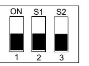
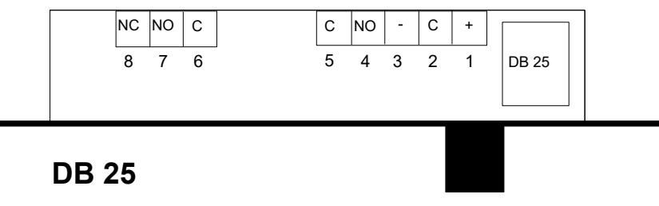
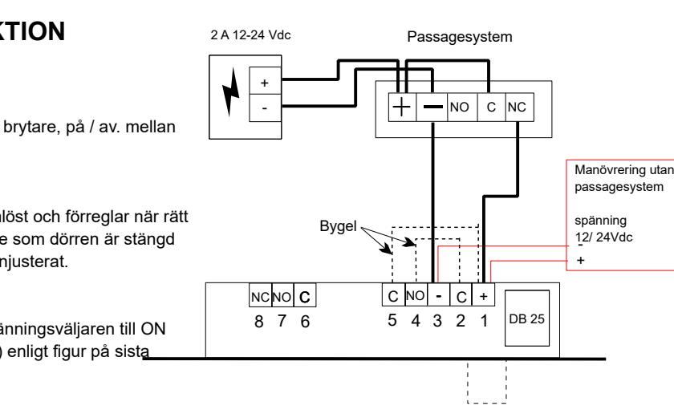
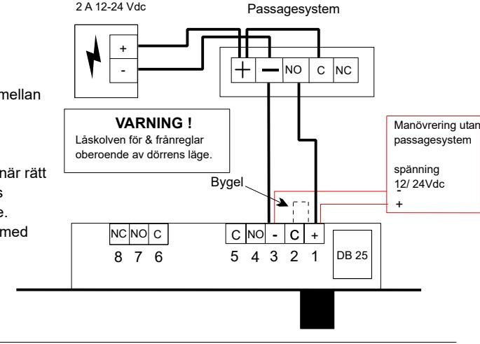

#### **För att tids ställa låset till önskad funktion** .

0

3

6

9

Tre DIP-omkopplare placerade på låset kretskortet bestämmer operationen. Dessa nås genom att ta bort locket .

Omkopplare **S1** och **S2** används för att ställa in tiden på låset. om en upplåsnings signal ges till låset men dörren inte öppnats, DB25 låser automatiskt igen efter en viss tid .

Detta säkerställer att en dörr inte kan lämnas oskyddad om den har låsts upp men inte öppnat .Ttimern är fabriksinställd till 9 sekunder men 0 , 3 och 6 sekunders alternativ erbjuds och väljs av positionering av dip omkopplaren. Omkopplarer **M** används för att välja NO eller NC på aktiveringen av låset.. Detta är fabriks inställtt och enda gången den kommer att behöva flyttas är när du använder en PTL inställt lås i två trådläget

Märkningar S1, S2 och M finns på kretskortet (ta bort täck kåpan på låset)

Timer Switch position sekunder tids fördröjning S1 ON och S2 ON sekunders tidsfördröjning S1 OFF och S2 ON sekunders tidsfördröjning S1 ON och S2 OFF sekunders tidsfördröjning S1 OFF och S2 OFF

| TIO FU NK NE R                                                                                                   | S TIO 3 PA RT FU NK N | S TIO 2 PA RT FU NK N |  |
|------------------------------------------------------------------------------------------------------------------------------|--------------------------------------------|--------------------------------------------|--|
| frå sfö rsö Fle ling k ra nre g (en da st PT O= Lå st str öm lös t) | OK 5x                                   | -                                          |  |
| 8 ku nd frå ling se er nre g                                                                         | OK                                         | -                                          |  |
| An ti bo tag sa e                                                                                             | OK                                         | -                                          |  |
| Au atis k för ling tom reg                                                                                 | OK                                         | OK                                         |  |
| Fle för ling sfö rsö k ra reg                                                                           |                                            |                                            |  |
| Öp (en da PT L= öm lös t) st t str pe                                                       | OK 9x                                   | OK 5x                                   |  |
| Ele ktr isk öp ing sko ntr oll pn                                                                    | OK                                         | -                                          |  |
| Sa bo tag sky dd e                                                                                            | OK                                         | OK                                         |  |

### **TEKNISKA SPECIFIKATIONER**

| Ö Ö S T R M F R B R U K N I N G | Ö Ö M A N V E R S T R M | Ö V I L O S T R M ( f 2 0 0 M S ) tr e |
|------------------------------------------------------------------------------|----------------------------------------------------------|----------------------------------------------------------------------------------------------|
| 1 2 V dc                                                            | 1 0 0 A 5 m                               | 2 1 0 A m                                                                        |
| 1 3, 8 V dc                                                      | 1 2 2 0 A m                               | 1 8 A 5 m                                                                        |
| 2 4 V dc                                                            | 9 0 0 A m                                    | 8 0 A m                                                                             |
| 2 7, 6 V dc                                                      | 1 0 0 0 A m                               | 7 5 A m                                                                             |

**Spänning** 12 Vdc -10% till 24 Vdc + 15% Inbyggt skydd mot transienter **Dörr läges brytare (DPS)** Terminalerna 4 & 5 Max belastning 100Vac/dc 300 mA **Kolv läges brytare (BPS)** Terminalerna 6,7 & 8 Max belastning 125 Vac 3A , 30 Vdc 500mA **" DPS"** kontrolleras av den runda magneten i slutblecket, In justeras mot "M" i låsets stolpe.

## **SMÖRJNING**

Denna produkt är smord för hela sin livslängd,

**Vid ytterligare smörjning av något slag bortfaller samtidigt alla tillverkarens garantiåtaganden.**

# **Inkopplingsanvisning Solenoidlås Modell DB-25**

### **DB 25 INSTRUKTIONER**

**Läs monteringsanvisningarna innan monteringen påbörjas**

# **Montering**

**1.**

- MONTERING OCH JUSTERING Låset kan monteras horisontellt eller vertikalt i dörrkarm eller dörrblad. TILLSE ATT. Den runda magneteni slutblecket kommer mitt för "M" på låsets stolpe. Urtaget bakom slutblecket är tillräkligt djupt och fritt från skräp så att låskolven kan låsaLåskolven inte stöter emot eller fastnar när den är i rörelse eftersom den då inte kan för / frånregla. UNDVIK. Att montera låset uppåtvänt i golvet.
# **Strömförsörjning**

| 2. | TIL LS E AT T. | lås 2 A str öm för sö rjn ing vä nd ( sta bb ad än nin rek de ) an s pe r sp g om en ras                |
|----|----------------------------|---------------------------------------------------------------------------------------------------------------------------------------------------------------------------------------------|
|    |                            | Pla öm för sö rjn ing å nä lås mö j lig str et t. ce ra en s ra so m                                                         |
|    | UN DV IK             | å Att vä nd väx els trö tra nsf ato d likr ikta be nd str öm för lus ter an a ms orm r me re roe e p |

# **Kabel**

- **3.** TILLSE ATT. Anslutningarna görs med standard larm kabel. Använd extra parter för att dubbla kabeln om spänningsfall skulle uppstå beroende på avståndet mellan lås och strömförsörjning. UNDVIKAttanvändahomogenatelefonkablarföranslutningarna.
#### **Styrning av låset**

- **4.** En 3 parts fullfunktions anslutning är att föredra framför en reducerad 2 parts funktion. Egenskaperna framgår av denna instruktion. **3 parts** funktion kräver permanent strömtillförsel till låset och en positiv slutning mellan plint 1 & 2 för manövrering av låset. **2 parts** funktion fungerar på liknande sätt som ett traditionellt elektriskt lås. Genom att använda 2 parts funktionen går de inbyggda passagekontroll funktionerna förlorade jämfört med 3 parts funktion.
#### **2 PARTS FUNKTION**

Öppet strömlöst ( PTL )

# **Anslutningar**

Denna metod kräver en brytare, på / av. mellan terminalerna 1 & 3

# **Funktion**

Detta lås är öppet strömlöst och förreglar när rätt spänning tillförs så länge som dörren är stängd och slutblecket korrekt injusterat.

# **Spänningsväljare**

Flytta den invändiga spänningsväljaren till ON ( öppet strömlöst / PTL ) enligt figur på sista sidan.

### **2 PARTS FUNKTION**

Låst strömlöst ( PTO 

# **Anslutningar**

Denna metod kräver en brytare, på / av. mellan terminalerna 1 & 3

)

## **Funktion**

 ut helt. Detta lås är låst strömlöst och frånreglar när rätt spänning tillförs. När strömtillförseln bryts förreglar låset oberoende av dörrens läge. Användning av lås av denna typ bör ske med urskiljning.

## **Spänningsväljare**

Enligt figur på sista sidan.

### **3 PARTS FUNKTION**

Låst strömlöst ( PTO ) Öppet strömlöst ( PTL )

# **Anslutningar**

Denna metod kräver en permanent strömförsörjning via terminalerna 1 & 3.

## **Funktion**

Efter de initiala 8 sekunderna när låset först tillförs ström kommer låset att förregla ( öppet strömlöst = PTO ) så länge som dörren är stängd med slutblecket korrekt injusterat. En kort inpuls mellan terminalerna 1 & 2 frånreglar låset. Detta förreglar så snart som dörren stängs. Om dörren inte öppnas förreglar låset efter 8 sekunder. Tillförsmellanterminalerna1&2

 en impuls som är längre än 8 sekunder kommer låset att förregla

så snart som impulsen avbryts och dörren

# stängs. **Spänningsväljare**

 Enligt figur på sista sidan.

### **Låsets anslutningar**

**D**B25 har en flerfaldig spänningsingång från 12 Vdc- 10% till 24 Vdc + 15 %. Inbyggt skydd mot transienter och ovänd polaritet.

8 7 6

NC NO C

+

2 A 12-24 Vdc

+

+

+

-

-

-

-

N C

N C

N C

- 1. + Positiv ingång strömförsörjning.
- 2. C Kontroll anslutning ( BLANDA EJ SAMMAN MED DÖRRLÄGES BRYTARE
- 3. - Negativ ingång strömförsörjning.
- 4. NO Dörrlägesbrytare - Normalt öppen
- 5. C Dörrlägesbrytare - Allmän
- 6. C Kolvlägesbrytare - Allmän

- 7. NO Kolvlägesbrytare - Normalt öppen 8.NC
	- Kolvlägesbrytare - Normalt stängd

5 4

 ) C

C

C

123

NO C NC

Passagesystem

TB

DB 25

Slutning

öppna

knapp

TB

TB

-

12/ 24Vdc

Manövrering utan

spänning

passagesystem

+

- C +

NO

-

- C +

- C +